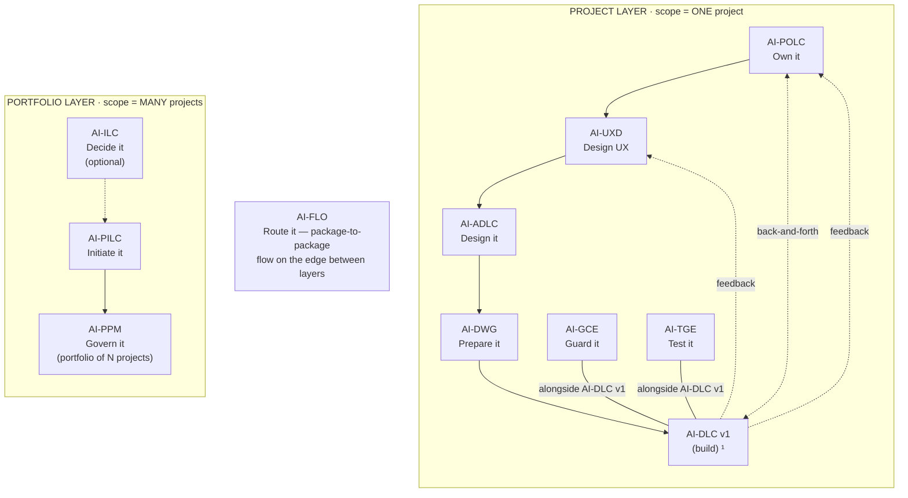

# AIFLC · The AI-* PDLC Family — Injectable Workflow Packages for AI-Assisted Software Delivery

[](./LICENSE)

**Version:** 0.1.0-beta.1
**Author:** [Mohammad Maheri](https://www.linkedin.com/in/mohammad-maheri-8399565b)

---

## What Is This?

The AI-* PDLC Family is part of **AIFLC** (AI Full Life Cycle) — a suite of **injectable workflow packages** that guide AI coding assistants through professional software delivery — from idea through architecture, workspace setup, governance, and test accountability.

Each package is a set of markdown files you drop into your IDE workspace. The AI reads them and gains structured expertise: it knows what to ask, what to produce, and when to hand off to the next package in the chain. No plugins, no APIs, no vendor lock-in.

**Think of it as:** Professional process knowledge, packaged so an AI assistant can execute it with human oversight at every gate.

---

## The Chain


  ¹ AI-DLC v1 = Amazon's open-source build lifecycle (not ours; we feed it).

---

## Packages

| Layer | Package | Type | What It Does |
|-------|---------|------|--------------|
| Portfolio | [AI-ILC](./pdlc-packages/ai-ilc/) | Interactive workflow | Evaluate raw ideas → Approved Idea Brief |
| Portfolio | [AI-PILC](./pdlc-packages/ai-pilc/) | Interactive workflow | Raw requirement → Project Initiation Package (PIP) |
| Portfolio | [AI-PPM](./pdlc-packages/ai-ppm/) | Adaptive portfolio engine | Multiple PIPs → Portfolio governance & prioritization |
| Project | [AI-ADLC](./pdlc-packages/ai-adlc/) | Interactive workflow | Requirements → Architecture Package (AP) |
| Project | [AI-UXD](./pdlc-packages/ai-uxd/) | Interactive workflow | PIP/AP → UX Design Package (personas, flows, design system) |
| Project | [AI-POLC](./pdlc-packages/ai-polc/) | Interactive workflow | PIP/AP → Product Backlog Package (PBP) |
| Project | [AI-DWG](./pdlc-packages/ai-dwg/) | One-time generator | AP + PBP + UXP → Ready-to-code workspace |
| Project | [AI-GCE](./pdlc-packages/ai-gce/) | Adaptive governance engine | Workspace → Compliance enforcement layer |
| Project | [AI-TGE](./pdlc-packages/ai-tge/) | Test governance engine | Workspace → Test strategy, register, coverage tracking |

> **AI-DLC v1** ([awslabs/aidlc-workflows](https://github.com/awslabs/aidlc-workflows)) is NOT part of this suite — it's Amazon's open-source build lifecycle. Our chain produces the workspace AI-DLC v1 consumes.
>
> **Fabric (not table rows):** **AI-FLO** (router / orchestration — package-to-package flow, shown on the edge of the diagram above) · **AI-DFE** (data fabric engine — gathers data from all packages and distributes structured JSON for dashboards and status roll-ups). Both run *alongside* the chain rather than as linear steps, so neither is shown as a chain row above. They are family-scoped fabric engines that install with the family.

---

## Quick Start

### 1. Pick a starting point

- **New project from scratch?** Start with [AI-PILC](./pdlc-packages/ai-pilc/) (project initiation)
- **Have requirements, need architecture?** Start with [AI-ADLC](./pdlc-packages/ai-adlc/)
- **Have architecture, need a workspace?** Start with [AI-DWG](./pdlc-packages/ai-dwg/)
- **Have an idea to evaluate?** Start with [AI-ILC](./pdlc-packages/ai-ilc/)
- **Managing multiple projects?** Start with [AI-PPM](./pdlc-packages/ai-ppm/)

### 2. Install only what you need

**Use the interactive installer** to pick packages and have them placed in the right location for your platform:

```powershell
# Windows (from repo root)
.\pdlc-packages\installer\install.ps1

# macOS / Linux (from repo root)
./pdlc-packages/installer/install.sh
```

Or install manually — packages are **independently installable**. You decide how many to run:

- **Solo** — install a single package on its own. Each one is fully self-contained and produces complete, professional output without any other package present.
- **Selective family** — install any subset that fits your work. The chain is modular, so combinations like `AI-PILC + AI-ADLC`, `AI-ADLC + AI-DWG`, or `AI-GCE + AI-TGE` work without requiring the packages in between. When a package detects a sibling's output markers, it enriches its own work with that context; when it doesn't, it runs standalone.
- **Full family** — install the whole chain for end-to-end coverage from idea to test accountability.

Install each package one at a time — adding a package never requires reinstalling the others.

### 3. Each package picks its own AI platform

Compatibility is **per package, not suite-wide**. Every package ships its own `setup/INSTALL.md` with platform-specific setup, so you can run different packages on different assistants in the same workspace if you want. Supported targets per package:

- **Kiro** (VS Code-based)
- **Amazon Q Developer**
- **Cursor**
- **Claude Code**
- **Cline** (VS Code extension)
- **GitHub Copilot** (⚠️ partial — workspace-level instructions only)

Each INSTALL.md documents the exact destination paths for that platform. The general pattern is the same everywhere: place the package's `*-rules/core-workflow.md` where your AI reads always-loaded steering, and place the `*-rule-details/` folder where the workflow can resolve it on demand. See the [Compatibility](#compatibility) table below for the full matrix.

### 4. Use

Open your IDE chat and tell the AI to use the package:

```
Using AI-PILC, help me initiate this project from my requirements
```

The AI reads the package's core workflow, adopts the appropriate professional role, and guides you through each stage with gates for your approval.

---

## ⚠️ Brownfield Deployment Warning

If you are injecting packages into an **existing project** (brownfield), please take the following precautions:

1. **Back up first.** Commit all work to version control or take a snapshot before injection.
2. **Use a test branch.** Try the package in an isolated branch before applying to your main codebase.
3. **Review output structure.** Each package documents what it generates — check for conflicts with your existing files and folders.
4. **No warranty.** This software is provided "AS IS" under Apache 2.0. The author accepts no liability for overwritten files, broken pipelines, lost data, or any other damage resulting from integration into existing environments. You are solely responsible for determining appropriateness.

See [LICENSE](./LICENSE) and [NOTICE](./NOTICE) for full liability and warranty disclaimer details.

---

## Key Design Principles

- **Human-in-the-loop.** Every stage has an approval gate. The AI proposes; you decide.
- **Injectable.** Drop files into any workspace. No plugins, no lock-in.
- **Professional quality.** Each package embeds domain expertise (PMO, CTO, DevOps, QA). Output reads as if produced by a senior professional.
- **Chain-aware.** Packages can hand off to each other via state markers. But each works standalone too.
- **Platform-agnostic.** Works with any AI coding assistant that reads workspace files.
- **Adaptive depth.** Three tiers (Minimal / Standard / Comprehensive) adapt to project complexity.
- **Generic.** Zero project-specific content. Works for any project, any domain, any technology.

---

## Repository Structure

```
AIPDLC/
├── README.md              ← You are here
├── LICENSE                ← Apache 2.0
├── NOTICE                 ← Attribution requirement
├── CONTRIBUTING.md        ← How to contribute
├── SECURITY.md            ← Vulnerability reporting
│
└── pdlc-packages/         ← All packages + installer (one level down to keep root clean)
    ├── ai-ilc/            ← Idea evaluation workflow
    ├── ai-pilc/           ← Project initiation workflow
    ├── ai-adlc/           ← Architecture design workflow
    ├── ai-uxd/            ← UX design workflow
    ├── ai-polc/           ← Product ownership workflow
    ├── ai-dwg/            ← Workspace generator
    ├── ai-ppm/            ← Portfolio management engine
    ├── ai-flo/            ← Flow router engine
    ├── ai-gce/            ← Governance compliance engine
    ├── ai-tge/            ← Test governance engine
    ├── ai-dfe/            ← Data fabric engine
    │
    ├── installer/         ← Interactive package installer (PowerShell + Bash)
    ├── contracts/         ← Cross-package conventions & contracts
    ├── narrative/         ← Whitepapers and HOW documents
    └── knowledge_docs/    ← Design patterns and reference material
```

> **Why the subfolder?** To keep your workspace root clean. Cloning this repo only places a handful of files (README, LICENSE, etc.) at the top level — all operational content lives inside `pdlc-packages/`. The installer reads from this subfolder automatically.

---

## Use Them Together or Alone

**Full chain** (maximum value): AI-ILC → AI-PILC → AI-POLC → AI-UXD → AI-ADLC → AI-DWG → AI-GCE + AI-TGE → AI-DLC v1 (build)

**Standalone** (each package works independently):
- AI-PILC alone produces a professional Project Initiation Package
- AI-ADLC alone produces a complete Architecture Package
- AI-DWG alone generates a workspace from any architecture document
- AI-GCE alone derives governance for any existing workspace
- AI-TGE alone assesses test coverage against architectural commitments

When used in the chain, each package detects its predecessor's output markers and enriches its own work with that context. When used standalone, it gracefully handles missing predecessors.

---

## Compatibility

| Platform | Supported | Install Guide |
|----------|:---------:|:-------------:|
| Kiro | ✅ | Each package's `setup/INSTALL.md` |
| Amazon Q Developer | ✅ | Each package's `setup/INSTALL.md` |
| Cursor | ✅ | Each package's `setup/INSTALL.md` |
| Cline | ✅ | Each package's `setup/INSTALL.md` |
| Claude Code | ✅ | Each package's `setup/INSTALL.md` |
| GitHub Copilot | ⚠️ Partial | Each package's `setup/INSTALL.md` (workspace-level instructions only) |
| Any other platform | ✅ | Universal Setup section in each `INSTALL.md` |

> Compatibility is per package — every package ships the same platform coverage. For unlisted IDEs, follow the **Universal Setup** steps: place `core-workflow.md` where your AI reads always-loaded steering and `*-rule-details/` where the workflow can resolve it.

---

## Contributing

See [CONTRIBUTING.md](./CONTRIBUTING.md) for guidelines and our Contributor License Agreement.

---

## Security

To report a vulnerability, see [SECURITY.md](./SECURITY.md).

---

## License

**Apache License 2.0 with Attribution Addendum**

Free to use for personal, commercial, educational, and organizational purposes. Modify and distribute freely. One requirement:

> Any distributed product substantially based on this work must include:
> *"Built on AIFLC by Mohammad Maheri — [LinkedIn](https://www.linkedin.com/in/mohammad-maheri-8399565b)"*

See [LICENSE](./LICENSE) and [NOTICE](./NOTICE) for full terms.

**Copyright:** © 2026 Mohammad Maheri

---

*Part of [AIFLC](https://github.com/mbmd/AIFLC) — AI Full Life Cycle · The AI-* PDLC Family · See the [AIFLC Roadmap](https://github.com/mbmd/AIFLC/blob/main/ROADMAP.md)*
