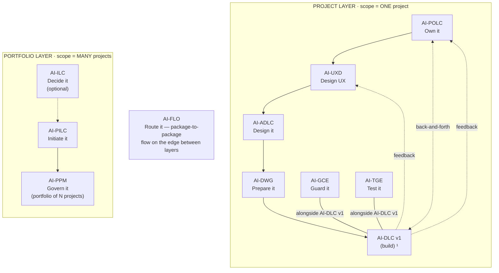

# AI-* Family — Complete Package & Output Structure

**Version:** 2.1.0
**Date:** 2026-06-17
**Author:** Maheri

> **Amendment (2026-06-22 — family-workspace prefix + install split):** PART 2 runtime trees now nest all output under the family workspace `pdlc-ws/` (`pdlc-ws/projects/…`, `pdlc-ws/ideas/`, `pdlc-ws/portfolio/`, `pdlc-ws/data/`). See the install-lock design + `OUTPUT_AND_STATE_CONTRACT.md`.
>
> **Amendment (OI-158 — unified core placement):** cores + rule-details now install into ONE uniform home `.aiflc/{family}/` on every platform (superseding the earlier Kiro `.kiro/steering/{family}/` + `.kiro/{family}/` split); only the always-loaded orchestrator sits in each platform's native slot. See the "Installed Location" subsection in PART 1.
>
> **Amendment (OI-163 — single-copy fabric source):** the fabric engines **AI-FLO** and **AI-DFE** are no longer in-family dev-source folders. They exist as exactly ONE canonical engine copy in the build tree and are **cloned into the family at assemble** (stamped with the free-tier license set — INV-L4-007). PDLC therefore carries **no `ai-flo/` or `ai-dfe/` dev-source folder**; PART 1 now depicts them as cloned-at-assemble fabric, not built-here source. FLO/DFE remain valid family members — their chain contracts (PART 3) and runtime artifacts (PART 2) are unchanged.

---

## The AI-* Family


  ¹ AI-DLC v1 = Amazon's open-source build lifecycle (not ours; we feed it).

| Layer | Package | Type | Input | Output |
|-------|---------|------|-------|--------|
| Portfolio | **AI-ILC** ² | Interactive workflow (lifecycle) | Raw idea | Approved Idea Brief / Feature Brief |
| Portfolio | **AI-PILC** | Interactive workflow (lifecycle) | Raw requirement | Project Initiation Package (PIP) |
| Portfolio | **AI-PPM** ³ | Adaptive portfolio engine | Multiple PIPs + Approved Idea Briefs | Portfolio register + cross-project prioritization & governance |
| Edge | **AI-FLO** ³ | Router / orchestration engine | Any package output marker | Routing decision + handoff to next package/layer |
| Project | **AI-POLC** ³ | Interactive workflow (lifecycle) | PIP | Product Backlog Package (PBP) |
| Project | **AI-UXD** ³ | Interactive workflow (lifecycle) | PIP + PBP | UX Design Package (UXP): personas/journeys, IA, user flows, design system + tokens, accessibility baseline |
| Project | **AI-ADLC** | Interactive workflow (lifecycle) | PIP + PBP + UXP | Architecture Package (AP) |
| Project | **AI-DWG** | One-time generator | AP + PBP + UXP | Ready-to-code development workspace (DW) |
| Project | **AI-GCE** | Adaptive governance engine | DW (AI-DWG output) | Compliance enforcement layer |
| Project | **AI-TGE** | Test governance engine | DW / build artifacts | Test governance & quality layer |
| Project | **AI-DLC v1** ¹ | Interactive workflow (lifecycle) | DW + GCE + User Stories (from AI-POLC) | Working Software |

> ¹ **AI-DLC v1** ([awslabs/aidlc-workflows](https://github.com/awslabs/aidlc-workflows)) is NOT our product. Our chain produces the workspace AI-DLC v1 consumes.
> ² **AI-ILC** is an **optional pre-stage** (the funnel before the funnel). The chain still works without it for users who start at AI-PILC. `⇢` denotes the optional link.
> ³ All packages in this table are **built**. AI-PPM (portfolio engine), AI-FLO (router), AI-POLC (product ownership lifecycle), and AI-UXD (UX design lifecycle) were the last four — completed June 2026. Within the Project layer, **AI-POLC, AI-UXD, and AI-ADLC run sequentially** (POLC→UXD→ADLC) — each feeds the next, culminating at AI-DWG which receives all three outputs (AP + PBP + UXP). **AI-GCE and AI-TGE run alongside AI-DLC v1** as continuous quality engines; **AI-POLC ⇄ AI-DLC v1** exchange backlog/acceptance throughout delivery; and **AI-DLC v1 runtime feedback flows back to both AI-UXD and AI-POLC**. Feedback loops (ADLC→POLC cost/risk, ADLC→UXD constraints) provide iterative refinement without changing the forward sequence.

> **AI-DWG Input semantics (peer-input model, OI-069 / decision 0.2 — 2026-06-15c):** The `AP + PBP + UXP` cell lists AI-DWG's three **peer inputs** (AP = AI-ADLC, PBP = AI-POLC, UXP = AI-UXD). It does **not** mean all three are required. AI-DWG accepts **any non-empty subset (≥1 of the three)** and generates only the output clusters whose input is present; absent inputs trigger a quality-impact disclosure + user approval (per `DWG_CONVERGENCE_DESIGN.md` Law 1). The cell text is kept **verbatim** as a compact input list — this note carries the semantics so no per-file table change/propagation is required.

---

## Naming & Ownership Convention

All file naming and provenance across the family follows one ratified convention:

> **See `contracts/NAMING_AND_OWNERSHIP.md` (the source of truth).**

**The A-dominant hybrid in one paragraph:** every generated `.md` artifact carries a provenance front-matter block (`generated-by`, `source`, `ownership: generated|hybrid|user`); hooks carry a `generatedBy` field. Filenames stay generic so artifacts read as the team's own — except *tool-owned* files, which are separated by **folder** (`.governance/`, `.kiro/hooks/`), never by filename prefix. Chain **marker files** (`pilc-state.md`, `adlc-state.md`, `workspace-rules.md`, the `.kiro/hooks/` folder) keep their exact names — renaming them breaks detection.

**Ownership legend** (used to annotate PART 2 below):

| Marker | Meaning |
|--------|---------|
| `[gen]` | Tool-generated; re-derivation may overwrite (`ownership: generated`) |
| `[hyb]` | Tool-seeded, team-edited; `<!-- custom -->` content preserved on re-derivation (`ownership: hybrid`) |
| `[tool]` | Tool-owned, in a dedicated folder; not hand-edited |
| `[marker]` | Chain detection anchor — name is non-negotiable |

---

## PART 1: Package Source Structure (What We Build & Publish)

> **These trees are compact by design** — they show each package's folder skeleton and key files, not every file. Each package's own `CONCEPTUAL_MAP.md` (navigation) and `PLAN.md` (rationale) hold the exhaustive, authoritative file list.

**Shared shell (every package).** All **9 domain packages** built in this family's dev tree ship the same outer shell, so it is shown once here and omitted from the per-package trees below. *(The two fabric engines — AI-FLO + AI-DFE — are cloned at assemble, not built here; see the "Fabric Engines" note below.)*

```
ai-{pkg}/
├── README.md  ·  LICENSE  ·  NOTICE                ← overview + Apache-2.0 + attribution
├── PLAN.md  ·  CONCEPTUAL_MAP.md                   ← rationale + navigation (authoritative file list)
├── USER_GUIDE.md  ·  WHITEPAPER.md                 ← end-user walkthrough + design narrative
├── ai-{pkg}-rules/        core-{workflow|engine|generator}.md   ← master orchestration (always loaded) + § Gate Contract
├── ai-{pkg}-rule-details/ common/ + {phase|concern folders}/ + data-schema/ + templates/
│                          └ data-schema/   {pkg}-data.schema.json + SOURCE_MAP.md + SCHEMA_README.md   ← AI-DFE data interface
└── setup/                 INSTALL.md               ← multi-platform install (Kiro, Cursor, Claude, …)
```

> **ROADMAP.md policy (eligibility-based):** `ROADMAP.md` is a package-root file that is **present only for a package that has opt-in extensions or deferred/planned features** (today: AI-ADLC, which ships a real extension roadmap). Every other package adds a `ROADMAP.md` **only if/when it acquires real forward plans** — never as boilerplate. The **absence** of a ROADMAP means "feature-complete for v1, nothing deferred" — an intentional, documented state, not a gap.

### Family Root Files

The family root (``) carries family-wide files alongside the package folders:

```

├── README.md  ·  LICENSE  ·  NOTICE  ·  CLA.md     ← family overview + license set
├── FAMILY_STRUCTURE.md                             ← this file (master structure reference)
├── FAMILY_TABLE_MAP.md                             ← canonical family table + registry
├── GATE_PROTOCOL.md            ← [Communication Fabric] universal gate & seam protocol (copied from canonical source)
├── FAMILY_INTERFACE.md         ← [Communication Fabric] public seam surface — Tier 1 seam packages + Tier 2 roster
├── FAMILY_BINDINGS.md          ← [Communication Fabric] generated topology — internal + external edges (do-not-edit)
├── TRIGGER_KEYS_REFERENCE.md                       ← destination-workspace trigger keys
├── MIGRATION_CATALOGUE.md                          ← output-feature migrations read by the UPG__ family upgrade agent
└── INSTALL_GUIDE_*.md                              ← per-platform install guides
```

> **Communication Fabric (the three new root files).** Every package declares a `§ Gate Contract` in its core file (capability types it emits/consumes + per-type field requirements). `GATE_PROTOCOL.md` defines the universal matching behavior; `FAMILY_INTERFACE.md` is the family's discoverable seam surface; `FAMILY_BINDINGS.md` is the generated routing graph (internal edges auto-derived from gate contracts + external cross-family edges). See `knowledge_docs/HOW_COMMUNICATION_FABRIC_WORKS.md`.

### Portfolio Layer

```

│
├── ai-ilc/                                         ← AI-Driven Idea Life Cycle (optional pre-stage)
│   ├── ai-ilc-rules/core-workflow.md               ← 6 stages, adaptive depth, intent-based routing (L47)
│   └── ai-ilc-rule-details/
│       ├── common/                                 ← process-overview, session-continuity, question-format, content-validation, reference-linking
│       ├── idea-lifecycle/                         ← capture · shape · evaluate · scope · approve · route-handoff
│       ├── connectors/                             ← portfolio-connector (AI-PPM funnel)
│       └── templates/                              ← approved-idea/feature/change-request briefs, idea-entry/register,
│           └── agents/                                 ilc-state, management-framework + idea-quality-agent (IQC__)
│
├── ai-pilc/                                        ← AI-Driven Project Initiation Life Cycle
│   ├── ai-pilc-rules/core-workflow.md              ← 6 phases, mints projectId + derivedFrom
│   └── ai-pilc-rule-details/
│       ├── common/                                 ← process-overview, session-continuity, question-format, content-validation, reference-linking, welcome
│       ├── inception/ assessment/ justification/   ← Phases 1-3 (workspace-detection → business-case)
│       ├── authorization/ planning/ mobilization/  ← Phases 4-6 (charter → package-assembly)
│       └── templates/                              ← intake, feasibility, business-case, charter, registers, RACI,
│           └── agents/                                 management-framework + initiation-quality-agent (IQA__)
│
└── ai-ppm/                                         ← AI-Driven Portfolio Management (adaptive engine)
    ├── ai-ppm-rules/core-engine.md                 ← 5 phases / 10 stages, continuous engine, L53 layered comms
    └── ai-ppm-rule-details/
        ├── common/                                 ← process-overview, session-continuity, question-format
        ├── intake/ prioritization/ authorization/  ← Phases 1-3 (registration → dispatch via AI-FLO)
        ├── monitoring/ optimization/               ← Phases 4-5 (roll-up ingestion → rebalance/retire)
        ├── extensions/                             ← 7 opt-in (balancing, what-if, dependency, capacity, themes, finance, benefits)
        └── templates/                              ← portfolio-register, alignment-map, prioritization-scorecard,
                                                        governance-decision, dispatch-authorization, ppm-state + agent (PGA__)
```

### Fabric Engines (AI-FLO + AI-DFE) — cloned at assemble, not in-family dev source

Per **OI-163 (single-copy fabric source)**, the two fabric engines are **not** built or published as in-family dev-source folders under this family. They exist as exactly ONE canonical engine copy in the build tree and are **cloned into the family at assemble** during `DEV__ promote` (stamped with the free-tier license set — INV-L4-007). PDLC therefore carries **no `ai-flo/` or `ai-dfe/` source folder**; the family's per-package `data-schema/` folders (shared shell above) remain the AI-DFE data interface.

| Fabric engine | Role (cloned form) | Presence in this family |
|---------------|--------------------|-------------------------|
| **AI-FLO** | Router / orchestration engine — `ai-flo-rules/core-engine.md` (3 phases / 10 stages, 3 topology modes) + `ai-flo-rule-details/` (configure · route · monitor · templates) + flow-integrity-agent (FIA__) | ⏳ Cloned at assemble |
| **AI-DFE** | Data fabric engine — `ai-dfe-rules/core-engine.md` + `ai-dfe-rule-details/` | ⏳ Cloned at assemble |

### Project Layer

```
├── ai-adlc/                                        ← AI-Driven Architecture Design Life Cycle
│   ├── ROADMAP.md                                  ← (intentional — ADLC ships a roadmap; other packages don't)
│   ├── ai-adlc-rules/core-workflow.md              ← 5 phases, C4 progressive decomposition, ADRs
│   └── ai-adlc-rule-details/
│       ├── common/                                 ← + diagram-standards
│       ├── foundation/ decomposition/ decisions/   ← Phases 1-3 (vision → container → tech/tenancy/security)
│       ├── design/ assembly/                       ← Phases 4-5 (data/api/integration/component → package-assembly)
│       ├── templates/                              ← ADRs, vision, C4 diagrams, tech-stack, data/api/integration, workbook
│       └── extensions/                             ← opt-in: ddd-tactical, microservices, bff, event-sourcing-cqrs, resilience, feature-flags
│
├── ai-uxd/                                         ← AI-Driven UX Design (lifecycle)
│   ├── ai-uxd-rules/core-workflow.md               ← 5 phases / 16 stages, persona→journey→flow→screen→component→token traceability
│   └── ai-uxd-rule-details/
│       ├── common/                                 ← + design-standards
│       ├── discover/ define/ design/               ← research/personas → journeys/IA/flows → wireframes/design-system/components
│       ├── validate/ assemble/                     ← accessibility-baseline/usability/QA → polc-handoff · dwg-gce-handoff · package-assembly
│       └── templates/                              ← 15 (persona, journey, IA, flow, wireframe, design-system, tokens, components,
│           └── agents/                                 a11y-baseline, …, uxd-state, UXP-README) + ux-consistency-agent (UXC__)
│
├── ai-polc/                                        ← AI-Driven Product Ownership Life Cycle
│   ├── ai-polc-rules/core-workflow.md              ← 6 phases / 16 stages, Tier 2 story elaboration (user-activated)
│   └── ai-polc-rule-details/
│       ├── common/                                 ← process-overview, session-continuity, content-validation, reference-linking
│       ├── foundation/ strategy/ governance/       ← vision/charter → discovery/epics/prioritization/release → DoR-DoD/risk/traceability
│       ├── stakeholders/ assembly/ operations/     ← stakeholder mgmt/docs → PBP-assembly → backlog-ops/acceptance-feedback/value-metrics
│       ├── tier2/                                  ← story-elaboration (INVEST, Given/When/Then — off by default in chain mode)
│       ├── extensions/                             ← 6 opt-in (advanced-discovery, full-traceability, full-risk, full-docs, quality-review, mvp-mmp)
│       └── templates/                              ← vision, roadmap, epics, prioritization, DoR/DoD, polc-state,
│           └── agents/                                 management-framework + backlog-health-agent (BLH__)
│
├── ai-dwg/                                         ← AI-Driven Workspace Generator (one-time generator)
│   ├── ai-dwg-rules/core-generator.md              ← peer-input composition (≥1 of AP∥PBP∥UXP), 3 modes, per-cluster generation
│   └── ai-dwg-rule-details/
│       ├── common/                                 ← process-overview, ap-reading-guide (peer reading + a11y relay), validation-rules
│       ├── mapping/                                ← 27 transforms incl. polc-uxd-to-vision-document, ap-uxp-to-tech-environment,
│       │                                              uxd-to-design-system, containers-to-frontend, extension-rules-assembly
│       ├── reconciliation/                         ← diff · merge · provenance-tracking · downstream-signaling (Mode 2)
│       └── templates/                              ← steering/, operational/ (incl. ui-implementation-spec, definition-of-done),
│                                                      planning/, config/, docker-compose/, examples/
│
├── ai-gce/                                         ← AI-Driven Governance & Compliance Engine (adaptive, companion)
│   ├── ai-gce-rules/core-engine.md              ← 4 modes, tier model, two-source derivation
│   └── ai-gce-rule-details/
│       ├── common/                                 ← + scoring-model, knowledge-map-guide
│       ├── generators/                             ← ~23 derivation generators (architectural + non-architectural + hooks-from-steering)
│       ├── re-derivation/                          ← change-detection · selective-regeneration · upstream-signaling
│       └── templates/                              ← hooks/ (14 JSON + guide), agents/ (8 + registry), compliance-log/, steering-templates/
│
└── ai-tge/                                         ← AI-Driven Test Governance Engine (hybrid, companion)
    ├── ai-tge-rules/core-engine.md                 ← 2 phases / 12 stages, 4 modes, two-source model, ISTQB taxonomy
    └── ai-tge-rule-details/
        ├── common/                                 ← + test-taxonomy, two-source-model
        ├── strategy/                               ← Stages 1-6: detection · architecture-reading · derivation · brownfield · strategy · risk-scoring
        ├── observation/                            ← Stages 7-12: state-observation · acceptance-mapping · coverage · reconciliation · defects · debt
        └── templates/                              ← test-strategy, test-register, coverage-report, debt-scorecard, defect-log,
            └── agents/                                 tge-state, quality-dashboard + test-governance-agent (TGV__) + coverage-review-agent (CVR__)
```

---

### Installed Location — Where Package Files Land (uniform `.aiflc/` home, all platforms)

The package **source** above (`ai-{pkg}-rules/` + `ai-{pkg}-rule-details/`) installs into ONE brand-scoped, family-scoped home that is **identical on every platform** (OI-158). Only the single always-loaded **orchestrator** sits in each platform's native auto-load slot; it `Read`s the relevant core on demand.

```
{AIFLC-workspace-root}/
├──.aiflc/                                     ← AIFLC brand root (agent-neutral, uniform)
│   └── pdlc/                                   ← PDLC family home (cores + rule-details + fabric together)
│       ├── ai-pilc-rules/core-workflow.md      ← core (dispatcher) — Read on demand
│       ├── ai-pilc-rule-details/               ← details — Read on demand
│       ├── ai-adlc-rules/core-workflow.md
│       ├── ai-adlc-rule-details/
│       ├── … one {pkg}-rules/ + {pkg}-rule-details/ per installed package
│       └── FAMILY_BINDINGS.md · GATE_PROTOCOL.md · FAMILY_INTERFACE.md · TRIGGER_KEYS_REFERENCE.md · MIGRATION_CATALOGUE.md  (fabric + upgrade catalogue)
│
└──.kiro/steering/session-orchestrator.md      ← the ONLY auto-loaded file (Kiro slot shown)
                                                   routes to.aiflc/pdlc/…/core-*.md on demand
```

- **Core + rule-details** → `.aiflc/{family}/{pkg}-rules/` and `.aiflc/{family}/{pkg}-rule-details/` — the SAME path on every platform. No Kiro split, no `{family}-` filename prefix, no `.amazonq/` nesting.
- **Orchestrator only** lands in each platform's native auto-load slot (Kiro `.kiro/steering/`, Claude `CLAUDE.md` `@import`, Cursor `.cursor/rules/*.mdc`, Amazon Q `.amazonq/rules/`, Cline `.clinerules/`, Copilot/VS Code `.github/copilot-instructions.md`, Codex `AGENTS.md`).
- **Cores resolve rule-details from one canonical path**: `.aiflc/{family}/{pkg}-rule-details/` (standalone/flattened fallback: `{pkg}-rule-details/`).
- Runtime paths in the rules remain **workspace-root-relative** (`{family}-ws/…`).
- **Claude Code only** additionally gets generated `.claude/commands/pdlc/*.md` slash commands (destination triggers only) that `Read` the same cores under `.aiflc/pdlc/`.

---

## PART 2: Runtime Output Structure (What Each Package Produces When Run)

> **Ownership map** (per `contracts/NAMING_AND_OWNERSHIP.md`; legend defined above). Every generated `.md` carries the front-matter block from §5.2; every hook carries the `generatedBy` field from §5.3.
>
> | Package output | Default ownership | Notes |
> |---|---|---|
> | AI-ILC briefs + idea register | `[hyb]` | Team owns; `ilc-state.md` is `[marker]` |
> | AI-PILC docs (`project-initiation/`) | `[hyb]` | Team owns and edits; `pilc-state.md` is `[marker]` |
> | AI-PPM portfolio registers | `[hyb]` | Portfolio-scope; `ppm-state.md` is `[marker]` (NOT the per-project spine) |
> | AI-FLO routing artifacts | `[gen]` | Advisory routing records; `flo-state.md` is `[marker]` |
> | AI-ADLC docs (`architecture/`) | `[hyb]` | Team owns and edits; `adlc-state.md` is `[marker]` |
> | AI-UXD docs (`ux-design/`) | `[hyb]` | Team owns and edits; `uxd-state.md` is `[marker]` |
> | AI-POLC docs (`product-backlog/`) | `[hyb]` | Team owns and edits; `polc-state.md` is `[marker]` |
> | AI-DWG steering (`.kiro/steering/*.md`) | `[hyb]` | Living team docs; `workspace-rules.md` is `[marker]` |
> | AI-DWG AI-DLC v1 inputs (`vision.md`, `technical-environment.md`, …) | `[hyb]` | Assembled from peers; platform-independent |
> | AI-DWG config (`.editorconfig`, `docker-compose.yml`, …) | `[gen]` | Regenerated; ecosystem-standard names |
> | AI-GCE hooks (`.kiro/hooks/*.kiro.hook`) | `[tool]` | Folder boundary; carry `generatedBy` |
> | AI-GCE agents + governance docs (`.governance/`) | `[gen]` | Process agents + manual + registry; `<!-- custom -->` preserved |
> | AI-TGE outputs (`.tge/`) | `[gen]`/`[hyb]` | Strategy `[hyb]`, register/coverage `[gen]`; `tge-state.md` is `[marker]` |

When a user installs and runs these packages on their own project, each produces a distinct output cluster. **Reference docs** (PIP, AP, UXP, PBP) live in their own folders; **AI-DWG IS the workspace**; **AI-GCE and AI-TGE layer on top of it.**

### Multi-Project Layout (canonical — `OUTPUT_AND_STATE_CONTRACT.md`)

A workspace holds **many projects**. Every per-project producer nests its output in a **role folder** under a per-project root `pdlc-ws/projects/PRJ-{ABBREV}-{slug}/`; the governance spine is their **sibling** at the project root; AI-DWG generates a per-project **dev workspace** opened separately. The sub-trees in the rest of PART 2 show each cluster's *internal* contents — in the multi-project layout they sit at the paths shown below.

```
{AIFLC-workspace-root}/                           ← opened as IDE root
└── pdlc-ws/                                     ← PDLC FAMILY WORKSPACE (all family output nests here)
    ├── ideas/                                   ← AI-ILC (pre-project funnel)
    ├── projects/
    │   ├── PROJECTS.md                          ← registry + ★ active pointer (PROJECTS_REGISTRY_SPEC.md)
    │   ├── PRJ-{ABBREV}-{slug}/                  ← one project (★ may be active)
    │   │   ├── management_framework/            ← ONE shared spine (sibling of role folders; {PHASE}-{ABBREV}-* IDs)
    │   │   ├── pip/          ← AI-PILC (PIP)      · pilc-state.md
    │   │   ├── architecture/ ← AI-ADLC (AP)       · adlc-state.md
    │   │   ├── ux/           ← AI-UXD (UXP)       · uxd-state.md
    │   │   ├── backlog/      ← AI-POLC (PBP)      · polc-state.md
    │   │   └── {slug}-workspace/                 ← AI-DWG dev workspace (opened SEPARATELY; spine carried forward)
    │   │       ├──.kiro/{steering,hooks}/  ← AI-GCE governs here
    │   │       ├──.tge/                    ← AI-TGE here
    │   │       ├── management_framework/    ← spine carried forward (DWG/GCE/TGE append)
    │   │       └── src/ · tests/ · configs …
    │   └── PRJ-{ABBREV2}-{slug2}/  …             ← another project (own role folders + spine)
    ├── portfolio/                               ← AI-PPM (cross-project) + AI-FLO reasons over pdlc-ws/projects/PROJECTS.md
    │   ├── ppm-state.md · Portfolio_Register.md
    │   └── dashboards/                          ← portfolio dashboards (per DASHBOARD_FRAMEWORK_CONTRACT v1.1.0)
    └── data/                                    ← AI-DFE territory (bootstrapped at install)
```

**Producer → role folder → spine ID prefix:**

| Producer | Role folder (under `pdlc-ws/projects/PRJ-…/`) | Marker | Spine prefix | Originator-eligible? |
|----------|----------------------------------------|--------|--------------|:--------------------:|
| AI-PILC | `pip/` | `pilc-state.md` | `PILC-{ABBREV}-*` | ✅ default |
| AI-ADLC | `architecture/` | `adlc-state.md` | `ADLC-{ABBREV}-*` | ✅ |
| AI-UXD | `ux/` | `uxd-state.md` | `UXD-{ABBREV}-*` | ✅ |
| AI-POLC | `backlog/` | `polc-state.md` | `POLC-{ABBREV}-*` | ✅ |
| AI-DWG | `{slug}-workspace/` (generated) | `.kiro/steering/workspace-rules.md` | `DWG-{ABBREV}-*` (in carried-forward spine) | ❌ generates from peers |
| AI-GCE / AI-TGE | inside `{slug}-workspace/` | `.kiro/hooks/` · `.tge/tge-state.md` | `GCE-/TGE-{ABBREV}-*` | ❌ own-root |
| AI-PPM | `pdlc-ws/portfolio/` | `ppm-state.md` | — (portfolio register) | ❌ registry-wide |
| AI-FLO | — (reasons over `pdlc-ws/projects/PROJECTS.md`) | `flo-state.md` | — (no artifacts) | ❌ router |

> The legacy flat layout (output at workspace root, e.g. `project-initiation/`, `architecture/`) remains supported for **brownfield** — detected and offered a non-destructive restructure, never forced. The `projects/` layout is the always-on default for new work.

### Portfolio + Edge outputs (reference / coordination artifacts)

```
{user-project}/  (or a portfolio root for PPM/FLO)
│
├── idea-management/                ← 📦 AI-ILC — funnel before the funnel
│   ├── ilc-state.md                                ← [marker] workflow state
│   ├── idea-register.md                            ← all ideas (funnel view)
│   ├── {NNN}-{idea}.md                             ← per-idea register entry
│   └── {Approved_Idea|Feature|Change_Request}_Brief.md  ← routed output (one per approved idea)
│
├── project-initiation/             ← 📦 AI-PILC — Project Initiation Package (PIP)
│   ├── pilc-state.md                               ← [marker] mints projectId + derivedFrom
│   ├── 01_*.md … 12_*.md                           ← intake, analysis, feasibility, business-case, charter, registers
│   └── PROJECT_INITIATION_PACKAGE_README.md        ← assembled PIP (summary + reading guide)
│
├── portfolio/                      ← 📦 AI-PPM — portfolio register (governs the SET of projects)
│   ├── ppm-state.md                                ← [marker] keyed by projectId
│   ├── portfolio-register.md  ·  strategic-alignment-map.md  ·  prioritization-scorecard.md
│   ├── governance-decision-records/  ·  dispatch-authorizations/   ← admit/pause/retire + DA-*.md (dispatched via AI-FLO)
│   └── portfolio-health-dashboard.md
│
└──.flo/                           ← 📦 AI-FLO — routing & orchestration (advisory in v1.0)
    ├── flo-state.md                                ← [marker] per-project positions + topology mode
    ├── routing-table.md  ·  routing-log.md         ← active routes + append-only audit trail
    ├── dispatch-record.md  ·  roll-up-report.md    ← PPM authorization carried down / status relayed up
    └── route-map.md  ·  readiness-check.md  ·  conflict-alert.md   ← flow viz, fan-in readiness, flag-and-hold
```

### Project Layer reference packages (AP · UXP · PBP)

```
├── architecture/                   ← 📦 AI-ADLC — Architecture Package (AP)
│   ├── adlc-state.md                               ← [marker] projectId, Output Structure, Enabled Extensions, ADR Register
│   ├── 01_*.md … 11_*.md  ·  ADR/                  ← vision, C4 L1-L3, tech-stack, security, data, api, integration, ADRs
│   ├── Architecture_Workbook.md  ·  management_framework/   ← living decisions + shared governance spine (ADLC-* entries, L45)
│   └── ARCHITECTURE_PACKAGE_README.md
│
├── ux-design/                      ← 📦 AI-UXD — UX Design Package (UXP)
│   ├── uxd-state.md                                ← [marker] mode, depth, projectId, downstream signals
│   ├── personas/  journeys/  information-architecture/  user-flows/   ← research → structure
│   ├── design-system/ (+ tokens, components)  ·  accessibility-baseline.md   ← surface + WCAG 2.2 target
│   └── UXP_README.md                               ← feeds AI-POLC (personas/journeys), AI-DWG (design-system + frontend-standards), AI-GCE (a11y)
│
└── product-backlog/                ← 📦 AI-POLC — Product Backlog Package (PBP)
    ├── polc-state.md                               ← [marker] projectId, tier, prioritization model
    ├── product-vision.md  ·  roadmap.md  ·  epics/  ·  prioritization-scorecard.md   ← Now/Next/Later, WSJF/MoSCoW
    ├── definition-of-ready-done.md  ·  product-risk-register.md  ·  management_framework/   ← quality bar (→ DWG/GCE) + spine (POLC-*)
    └── PRODUCT_BACKLOG_PACKAGE_README.md           ← [stories elaborated only if Tier 2 active]
```

### AI-DWG output — the development workspace (peer-composed; generated at `pdlc-ws/projects/PRJ-…/{slug}-workspace/`)

AI-DWG composes the workspace from whichever **peers** are present — `{ADLC}`, `{POLC}`, `{UXD}`, or any combination (≥1). Each input owns a **distinct output cluster**; an absent input simply skips its cluster (with quality-impact disclosure + user approval). `workspace-rules.md` is always produced as the marker. The dev workspace is generated at `pdlc-ws/projects/PRJ-{ABBREV}-{slug}/{slug}-workspace/` and **opened separately** in its own Kiro IDE to build; the per-project spine is **carried forward** into it (Option A).

```
{slug}-workspace/                   ← 📦 AI-DWG OUTPUT — IS the workspace (at pdlc-ws/projects/PRJ-…/{slug}-workspace/; opened separately)
│
├──.kiro/steering/
│   ├── workspace-rules.md                          ← [marker] ALWAYS · § Architecture Identity (IF ADLC) | Product Identity (IF POLC-only) | deferred (UXD-only)
│   ├── {tech steering ×13+}                         ← IF ADLC  (tech-stack, security-rules, api-standards, database-rules,
│   │                                                   module-structure, error-handling, observability-*, naming, git-workflow, …)
│   ├── testing-strategy.md                         ← IF ADLC AND AI-TGE NOT activated (delegation-on-activation)
│   ├── design-system.md                            ← IF UXD  (tokens, component system)
│   ├── frontend-standards.md                       ← IF UXD or ADLC-UI
│   └── [conditional steering]                      ← multi-tenancy, api-versioning, resilience, tracing, event-sourcing, feature-flags …
│
├── vision.md                                       ← IF POLC (+ UXD personas/journeys)        → AI-DLC v1 Vision Document
├── technical-environment.md                        ← IF ADLC (+ UXD frontend patterns)        → AI-DLC v1 Technical Environment Document
├── ui-implementation-spec.md                       ← IF UXD                                    → AI-DLC v1 UI codegen input
├── aidlc-rules/extensions/                         ← IF ADLC security + UXD a11y (+ testing ext: from TGE if active, else DWG)
│
├── DEFINITION_OF_DONE.md                           ← IF POLC (or ADLC quality attributes)
├── PROJECT_INSTRUCTIONS.md  ·  CONTRIBUTING.md  ·  TEAM_AGREEMENTS.md  ·  ONBOARDING.md  ·  README.md
├── examples/                                       ← skeleton, UXD-seeded for UI patterns
├── templates/                                      ← session-planning, sprint-planning, estimation-guide
├──.github/pull_request_template.md  ·.editorconfig  ·  docker-compose.yml  ·  CODEOWNERS  ·.gitignore
├── management_framework/                           ← shared governance spine (DWG-* entries; marker MANAGEMENT_FRAMEWORK.md, L45)
│
└── {src-structure}/                                ← IF ADLC (folder layout from C4 L3: modules + shared-kernel)
```

> **Why the src folder is ADLC-gated is NOT dominance:** it is the same rule as `design-system.md` being UXD-gated and `vision.md` being POLC-gated — every output traces to exactly one input cluster, and no peer is privileged. (`DWG_CONVERGENCE_DESIGN.md` Laws 1-2.)

### AI-GCE + AI-TGE outputs — continuous companions (layer on top of the workspace)

Both run **alongside AI-DLC v1** (not as forward chain stages). They consume the DW and re-derive when the workspace updates.

```
{workspace-root}/
│
├── 📦 AI-GCE — Compliance & Enforcement Layer
│   ├──.compliance-state.json                      ← tier tracking, readiness, score history
│   ├──.kiro/hooks/*.kiro.hook                     ← [marker: folder] 9 always + up to 6 conditional (Tier A fileEdited / Tier B agentStop)
│   ├──.kiro/agents/*.md                           ← 8 process agents (shortcut-triggered, GCE-AG-01..08)
│   ├──.governance/                                ← COMPLIANCE_README, rules/ (10 always + 12 tier-gated + conditional),
│   │                                                  agents/, AGENT-GUIDE, AGENT_REGISTRY, compliance-log/ (JSONL schema + workflows)
│   └── management_framework/dashboards/compliance-dashboard.md
│
└── 📦 AI-TGE — Test Governance & Quality Layer
    └──.tge/
        ├── tge-state.md                            ← [marker] mode, depth, projectId (reads adlc-state.md + aidlc-docs/aidlc-state.md)
        ├── test-strategy.md  ·  test-register.md   ← strategy (IF TGE owns it) + commitment-based register
        ├── coverage-report.md  ·  debt-scorecard.md  ·  defect-log.md
        └── management_framework/dashboards/quality-dashboard.md
```

> **Note:** AI-GCE produces a **continuous JSONL compliance log**; AI-TGE produces a **quality dashboard + defect/debt trend**. Neither executes code or runs tests — they govern discipline. Both consume `.kiro/steering/workspace-rules.md` and re-derive selectively on workspace change.

---

## PART 3: Data Flow Between Packages

```
   PORTFOLIO LAYER                                   EDGE                 PROJECT LAYER
   ───────────────                                   ────                 ─────────────

   AI-ILC ⇢ AI-PILC ⇢ AI-PPM  ───(dispatch DA-*)──►  AI-FLO  ──(sequential)──►  AI-POLC ──► AI-UXD ──► AI-ADLC ──► AI-DWG
   (briefs)  (PIP)   (register)        ▲             (router)                                                          │
                                       │                │                                                              ▼
                                       └──(roll-up status, project status UP)                                     DW ──►  AI-DLC v1 (build) ──► Working software
                                                        │                                                              ▲  │  ▲
                                                        └──────────────────────────────────────────────────────────────┘  │  └── runtime feedback
                                                                                                                          │        ⇣ ⇣
                                                                                     GCE + TGE (companions, alongside) ──┘   AI-UXD + AI-POLC
                                                                                                                         (revise → DWG Mode 2)
```

Cross-layer hops are carried by **AI-FLO** (the router); same-layer exchanges are **direct marker reads**. The Project-layer design chain runs **sequentially** (AI-POLC → AI-UXD → AI-ADLC → AI-DWG) — each package feeds the next. Bidirectional flows: AI-FLO relays project status **up** to AI-PPM; AI-DLC v1 runtime feedback flows **back** to AI-UXD + AI-POLC; AI-POLC ⇄ AI-DLC v1 exchange backlog/acceptance throughout delivery; an upstream-peer revision loops back through **AI-DWG Mode 2** (reconcile). **Feedback loops** (same-layer, no AI-FLO): ADLC loops cost/risk back to POLC and constraints back to UXD — these are non-destructive re-entry triggers that refine without changing the forward sequence. AI-DWG validates **all three inputs present** (guaranteed by the sequential model; fewer = brownfield user-approved exception).

### Input/Output Contract Summary

| Package | Reads From | Produces At | Marker (detect by) |
|---------|-----------|------------|--------------------|
| **AI-ILC** | Raw idea (any format) | `{idea-management}/` | `ilc-state.md` |
| **AI-PILC** | Raw requirement, or `ilc-state.md` (Approved Idea Brief) | `{project-initiation}/` | `pilc-state.md` |
| **AI-PPM** | `pilc-state.md` + Approved Idea Briefs (+ roll-up via AI-FLO) | `{portfolio}/` | `ppm-state.md` |
| **AI-FLO** | Any package output marker (`*-state.md`) | `{.flo}/` | `flo-state.md` |
| **AI-ADLC** | PIP (`pilc-state.md`) or standalone requirements | `{architecture}/` | `adlc-state.md` |
| **AI-UXD** | PIP / AP (`pilc-state.md` / `adlc-state.md`); strategy exchange with AI-POLC | `{ux-design}/` | `uxd-state.md` |
| **AI-POLC** | PIP and/or AP (`pilc-state.md` / `ilc-state.md` / `adlc-state.md`) | `{product-backlog}/` | `polc-state.md` |
| **AI-DWG** | Peer set — `adlc-state.md` ∥ `polc-state.md` ∥ `uxd-state.md` (any non-empty subset, ≥1) | `{workspace-root}/` directly | `.kiro/steering/workspace-rules.md` |
| **AI-GCE** | `.kiro/steering/workspace-rules.md` (the DW) | same workspace root (layered) | `.kiro/hooks/` folder |
| **AI-TGE** | `workspace-rules.md` + `adlc-state.md` + `aidlc-docs/aidlc-state.md` | `{workspace-root}/.tge/` | `.tge/tge-state.md` |

> `projectId` (camelCase) is the correlation key minted by AI-PILC and threaded through every downstream marker and the compliance/quality logs.

### Standalone vs. Chain Usage

Each package works **standalone** (the user is the orchestrator when AI-FLO is absent) OR as part of the chain:

| Package | Standalone Input | Chain Input |
|---------|-----------------|-------------|
| **AI-ILC** | Raw idea / brainstorm note | — (funnel before the funnel) |
| **AI-PILC** | Raw requirement, verbal brief, existing PRD | Approved Idea Brief from AI-ILC |
| **AI-PPM** | Manual project list + status | PIPs + briefs + AI-FLO roll-up |
| **AI-FLO** | Manual topology config | Any installed package's markers |
| **AI-ADLC** | Requirements + Charter, existing architecture | PIP from AI-PILC |
| **AI-UXD** | Product brief + user research | PIP / AP (+ AI-POLC value goals) |
| **AI-POLC** | Product brief, existing backlog | PIP / AP (+ AI-UXD personas/journeys) |
| **AI-DWG** | Any one structured package (AP, PBP, or UXP) | Peer set {AP, PBP, UXP} from the Project layer |
| **AI-GCE** | Any workspace with `.kiro/steering/` files | DW from AI-DWG |
| **AI-TGE** | Any AP and/or codebase with tests | DW from AI-DWG + AI-DLC v1 state |

---

## PART 4: Chain Contracts (Detection by Marker, Not by Path)

Each package is **contract-aware** — it knows what its predecessor(s) produce and what its successor expects. But paths are NEVER hardcoded. Users choose WHERE things go; packages define WHAT files must exist.

### Contract Design Principles

| Principle | Meaning |
|-----------|---------|
| **Detection by marker** | Look for a specific file name, not a specific folder path |
| **User owns WHERE** | Output folder location is always user's choice |
| **Package owns WHAT** | File names, state file schema, and internal structure are fixed |
| **Graceful standalone** | Every package works without the chain (accepts equivalent manual input) |
| **Format tolerant** | Supports both numbered docs and phase-folder structures from predecessors |
| **Cross-repo capable** | Predecessor output can be anywhere — different folder, repo, or drive |
| **Layered communication** | Cross-layer hops go via AI-FLO; same-layer exchanges are direct marker reads (L53) |

---

### AI-ILC Contract

```
┌─────────────────────────────────────────────────────────────┐
│  AI-ILC  (Portfolio layer · optional pre-stage)             │
├─────────────────────────────────────────────────────────────┤
│  READS:  Raw idea (any format). No predecessor.              │
│  MARKER (input): none — funnel before the funnel             │
│                                                              │
│  PRODUCES: Approved Idea Brief / Feature Brief /             │
│            Change-Request Brief + idea register              │
│  MARKER (output): ilc-state.md                               │
│                                                              │
│  TRACEABILITY: mints Idea ID; route field carries intent     │
│    (new-project | feature | change-request) — L47            │
│  GOVERNANCE AGENT: idea-quality-agent (IQC__)                │
│                                                              │
│  SUCCESSORS: AI-PILC (new-project) reads ilc-state.md;       │
│    AI-PPM reads Approved Idea Briefs (same-layer direct)     │
└─────────────────────────────────────────────────────────────┘
```

### AI-PILC Contract

```
┌─────────────────────────────────────────────────────────────┐
│  AI-PILC  (Portfolio layer)                                 │
├─────────────────────────────────────────────────────────────┤
│  READS:  Raw requirements (any format) OR AI-ILC brief       │
│  MARKER (input): ilc-state.md (optional)                     │
│                                                              │
│  PRODUCES: Project Initiation Package (PIP)                  │
│  MARKER (output): pilc-state.md                              │
│                                                              │
│  TRACEABILITY: MINTS projectId (camelCase correlation key);  │
│    records derivedFrom (idea-ID, REQUIRED when ILC intake);  │
│    originType = project                                       │
│  GOVERNANCE AGENT: initiation-quality-agent (IQA__)          │
│                                                              │
│  GUARANTEED FILES: pilc-state.md · 01_*.md … 12_*.md ·       │
│    PROJECT_INITIATION_PACKAGE_README.md                      │
│  SUCCESSORS: AI-ADLC / AI-UXD / AI-POLC look for pilc-state  │
└─────────────────────────────────────────────────────────────┘
```

### AI-PPM Contract

```
┌─────────────────────────────────────────────────────────────┐
│  AI-PPM  (Portfolio layer · adaptive engine, continuous)    │
├─────────────────────────────────────────────────────────────┤
│  READS:  Multiple pilc-state.md + Approved Idea Briefs       │
│    (same-layer direct reads); project status via AI-FLO      │
│    roll-up (cross-layer)                                      │
│  MARKER (input): pilc-state.md (+ ilc-state.md)              │
│                                                              │
│  PRODUCES: Portfolio register + cross-project                │
│    prioritization + governance decisions + dispatch auth     │
│  MARKER (output): ppm-state.md                               │
│                                                              │
│  TRACEABILITY: keys portfolio roll-up by projectId;          │
│    aggregates downstream data, never recomputes it           │
│  GOVERNANCE AGENT: portfolio-governance-agent (PGA__)        │
│                                                              │
│  NOTE: portfolio-scope — NOT on the per-project spine (L45). │
│  DISPATCHES DOWN via AI-FLO (DA-*.md); never talks to        │
│    Project-layer packages directly (L53)                     │
└─────────────────────────────────────────────────────────────┘
```

### AI-FLO Contract

```
┌─────────────────────────────────────────────────────────────┐
│  AI-FLO  (Edge · router/orchestration engine, continuous)   │
├─────────────────────────────────────────────────────────────┤
│  READS:  Any package output marker (*-state.md) across both  │
│    layers; 3 topology modes (co-located / hub / portfolio)   │
│  MARKER (input): any *-state.md                              │
│                                                              │
│  PRODUCES: routing decision + handoff instruction; carries   │
│    PPM dispatch DOWN, relays project status UP (roll-up)     │
│  MARKER (output): flo-state.md                               │
│                                                              │
│  KEY ROUTES: sequential dispatch PPM → POLC → UXD → ADLC;               │
│    sequential guarantee {PBP, UXP, AP} → AI-DWG (all present by sequence)    │
│  CONFLICTS: flag-and-hold (never silently resolved);         │
│    every hold has a timeout + operator force-through         │
│  TRACEABILITY: carries projectId on every routing hop        │
│  GOVERNANCE AGENT: flow-integrity-agent (FIA__)              │
│                                                              │
│  NOTE: advisory in v1.0 (records routes; does not            │
│    auto-execute sessions). Family works without it.          │
└─────────────────────────────────────────────────────────────┘
```

### AI-ADLC Contract

```
┌─────────────────────────────────────────────────────────────┐
│  AI-ADLC  (Project layer)                                   │
├─────────────────────────────────────────────────────────────┤
│  READS:  PIP (from AI-PILC) OR standalone requirements       │
│  MARKER (input): pilc-state.md (scan./,../project-          │
│    initiation/; fallback: ask OR accept raw requirements)    │
│                                                              │
│  PRODUCES: Architecture Package (AP)                         │
│  MARKER (output): adlc-state.md                              │
│                                                              │
│  GUARANTEED FILES: adlc-state.md · vision · C4 L1-L3 ·       │
│    tech-stack · security · data · api · integration ·        │
│    ADR/ · Architecture_Workbook.md · AP_README              │
│  STATE SCHEMA (DWG/UXD/TGE read): projectId · derivedFrom ·  │
│    Output Structure {numbered|phase-folder} · Enabled        │
│    Extensions · Completed Stages · ADR Register               │
│  EXTENSIONS: opt-in v1.1 (ddd, microservices, bff,           │
│    event-sourcing, resilience, feature-flags)                 │
│  GOVERNANCE AGENT: architecture-decision-agent (ADA__)       │
│  NOTE: ships ROADMAP.md (intentional)                        │
│                                                              │
│  FILE-OWNERSHIP BOUNDARIES (DDD) ORIGINATE HERE → relayed    │
│    DEFINE→GENERATE→ENFORCE (ADLC → AI-DWG → AI-GCE)          │
│  SUCCESSORS: AI-UXD, AI-DWG, AI-TGE read adlc-state.md       │
└─────────────────────────────────────────────────────────────┘
```

### AI-UXD Contract

```
┌─────────────────────────────────────────────────────────────┐
│  AI-UXD  (Project layer · step 2 in POLC→UXD→ADLC sequence)       │
├─────────────────────────────────────────────────────────────┤
│  READS:  PIP / AP; strategy-stage exchange with AI-POLC      │
│    (POLC value goals focus UX research)                       │
│  MARKER (input): pilc-state.md / adlc-state.md               │
│                                                              │
│  PRODUCES: UX Design Package (UXP) — personas/journeys, IA,  │
│    user flows, design system + tokens, components,           │
│    accessibility baseline (WCAG 2.2)                          │
│  MARKER (output): uxd-state.md                               │
│                                                              │
│  FEEDS: AI-POLC (personas/journeys) · AI-DWG (design-        │
│    system.md + frontend-standards.md) · AI-GCE (accessibility│
│    -compliance rule)                                          │
│  TRACEABILITY: reads/persists projectId + derivedFrom        │
│  GOVERNANCE AGENT: ux-consistency-agent (UXC__)              │
│  RECEIVES: AI-DLC v1 runtime usability/accessibility feedback   │
└─────────────────────────────────────────────────────────────┘
```

### AI-POLC Contract

```
┌─────────────────────────────────────────────────────────────┐
│  AI-POLC  (Project layer · step 1 in POLC→UXD→ADLC sequence)       │
├─────────────────────────────────────────────────────────────┤
│  READS:  PIP and/or AP; consumes AI-UXD personas/journeys    │
│  MARKER (input): pilc-state.md / ilc-state.md / adlc-state   │
│                                                              │
│  PRODUCES: Product Backlog Package (PBP) — vision, roadmap,  │
│    epics, value-based prioritization, DoR/DoD, risk register │
│  MARKER (output): polc-state.md                              │
│                                                              │
│  FEEDS: AI-DWG (DoR/DoD + prioritization → vision.md +       │
│    DEFINITION_OF_DONE.md)                                     │
│  TRACEABILITY: reads/persists projectId + derivedFrom        │
│  GOVERNANCE AGENT: backlog-health-agent (BLH__)              │
│    [POLC-AG-01]                                              │
│  EXCHANGE: AI-POLC ⇄ AI-DLC v1 backlog/acceptance throughout    │
│    delivery; receives AI-DLC v1 runtime feedback                 │
└─────────────────────────────────────────────────────────────┘
```

### AI-DWG Contract (peer-input model — OI-069)

```
┌─────────────────────────────────────────────────────────────┐
│  AI-DWG  (Project layer · one-time generator + reconciler)  │
├─────────────────────────────────────────────────────────────┤
│  READS:  THREE EQUAL PEERS — AP (AI-ADLC) ∥ PBP (AI-POLC)    │
│    ∥ UXP (AI-UXD). Accepts ANY non-empty subset (≥1);        │
│    none is mandatory-singular, none dominates.                │
│  MARKERS (input): adlc-state.md / polc-state.md / uxd-state  │
│    Detection: scan for any peer marker; fallback: ask user.  │
│                                                              │
│  PER-CLUSTER GENERATION (one input → one output cluster):    │
│   • AP  → technical-environment.md + tech steering + src/    │
│   • PBP → vision.md + DEFINITION_OF_DONE.md + planning       │
│   • UXP → design-system.md + frontend-standards.md +         │
│           ui-implementation-spec.md + a11y relay             │
│   Absent input → cluster SKIPPED, with quality-impact        │
│   disclosure + explicit user approval (acknowledged, not     │
│   silent, degradation). Peer conflict = anomaly → DWG gives  │
│   root-cause analysis; user resolves upstream or via ADR.    │
│                                                              │
│  PRODUCES: Development Workspace (DW) + AI-DLC v1 inputs         │
│    (vision.md, technical-environment.md,                     │
│     ui-implementation-spec.md, aidlc-rules/extensions/)      │
│  MARKER (output):.kiro/steering/workspace-rules.md          │
│                                                              │
│  TESTING-STRATEGY = delegation-on-activation:                │
│    AI-TGE active → TGE owns testing-strategy.md (DWG skips); │
│    else DWG produces a basic one from ADLC quality attrs.    │
│  IDENTITY: ADLC→"Architecture Identity"; POLC-only→"Product  │
│    Identity"; UXD-only→identity deferred.                    │
│  TRACEABILITY: reads projectId → embeds § Project Identity    │
│  GOVERNANCE AGENT: workspace-integrity-agent (WIA__)         │
│                                                              │
│  MODES: 1 = generate (forward) · 2 = reconcile (reverse-     │
│    triggered when an upstream peer revises) · 3 = brownfield │
│  SIGNAL: ⚡ AI-DWG → AI-GCE/AI-TGE: workspace-generated |     │
│    steering-files-updated (+ affected files)                 │
│  SUCCESSORS: AI-GCE + AI-TGE read workspace-rules.md          │
└─────────────────────────────────────────────────────────────┘
```

### AI-GCE Contract

```
┌─────────────────────────────────────────────────────────────┐
│  AI-GCE  (Project layer · governance engine · companion)    │
├─────────────────────────────────────────────────────────────┤
│  READS:  Development Workspace —.kiro/steering/*.md,        │
│    DEFINITION_OF_DONE, TEAM_AGREEMENTS, CODEOWNERS, folder   │
│    structure (the actual module layout)                      │
│  MARKER (input):.kiro/steering/workspace-rules.md           │
│                                                              │
│  PRODUCES: Compliance & Enforcement Layer (continuous)       │
│  MARKER (output):.kiro/hooks/ folder exists                 │
│                                                              │
│  GUARANTEED:.compliance-state.json ·.kiro/hooks/*.kiro.hook│
│    (9 always + ≤6 conditional) ·.kiro/agents/*.md (8,       │
│    GCE-AG-01..08) ·.governance/ (rules, log, README,        │
│    AGENT-GUIDE, AGENT_REGISTRY) · compliance-dashboard.md    │
│  TRACEABILITY: includes projectId in every JSONL event       │
│    (CHECK/EXCEPTION/REMEDIATION/AUDIT/REDERIVATION)           │
│  GOVERNANCE AGENTS: 8-agent compliance suite (GCE-AG-01..08) │
│                                                              │
│  COMPANION: runs ALONGSIDE AI-DLC v1 (not a forward stage);     │
│    RE-DERIVES selectively when the workspace updates.        │
│  ENFORCE end of the ADLC → DWG → GCE relay (file ownership). │
└─────────────────────────────────────────────────────────────┘
```

### AI-TGE Contract

```
┌─────────────────────────────────────────────────────────────┐
│  AI-TGE  (Project layer · test governance engine · companion)│
├─────────────────────────────────────────────────────────────┤
│  READS:  AP (AI-ADLC) + DW (AI-DWG) + aidlc-docs (AI-DLC v1     │
│    state). Reads adlc-state.md directly (feedback loop)    │
│    AND workspace-rules.md + aidlc-docs/aidlc-state.md.        │
│  MARKER (input):.kiro/steering/workspace-rules.md           │
│    (+ adlc-state.md + aidlc-docs/aidlc-state.md)             │
│                                                              │
│  PRODUCES: test strategy + register + coverage + debt        │
│    scorecard + defect log + quality dashboard                │
│  MARKER (output):.tge/tge-state.md                          │
│                                                              │
│  OWNS testing-strategy.md WHEN activated (delegation rule);  │
│    enrichment: ADLC required + POLC/UXD optional             │
│  TRACEABILITY: reads projectId → audit trail + dashboard     │
│  GOVERNANCE AGENTS: test-governance-agent (TGV__) +          │
│    coverage-review-agent (CVR__)  [TGE-AG-01 / TGE-AG-02]    │
│                                                              │
│  COMPANION: runs ALONGSIDE AI-DLC v1; Stage 10 (architecture-   │
│    reconciliation) mirrors DWG Mode 2 on the test side.      │
│  GOVERNS discipline only — never writes or runs test code.   │
└─────────────────────────────────────────────────────────────┘
```

---

### Cross-Package Marker File Summary

| Package | Input Marker | Output Marker | Traceability Keys Carried |
|---------|:------------:|:-------------:|:-------------------------:|
| **AI-PILC** | `ilc-state.md` (optional) | `pilc-state.md` | Mints `projectId` + `derivedFrom` |
| **AI-ADLC** | `pilc-state.md` | `adlc-state.md` | Reads + persists `projectId` + `derivedFrom` |
| **AI-UXD** | `pilc-state.md` / `adlc-state.md` | `uxd-state.md` | Reads + persists `projectId` + `derivedFrom` |
| **AI-POLC** | `pilc-state.md` / `ilc-state.md` | `polc-state.md` | Reads + persists `projectId` + `derivedFrom` |
| **AI-DWG** | `adlc-state.md` / `polc-state.md` / `uxd-state.md` (peer inputs, ≥1) | `.kiro/steering/workspace-rules.md` | Reads `projectId` → embeds in § Project Identity |
| **AI-GCE** | `.kiro/steering/workspace-rules.md` | `.kiro/hooks/` folder | Reads `projectId` → includes in compliance log |
| **AI-TGE** | `.kiro/steering/workspace-rules.md` | `.tge/` folder | Reads `projectId` → audit trail + quality dashboard |
| **AI-FLO** | any package output marker | `flo-state.md` | Carries `projectId` on every routing hop |
| **AI-PPM** | `pilc-state.md` (+ roll-up reads) | `ppm-state.md` | Keys portfolio roll-up by `projectId` |

**Rule:** These marker file names are NON-NEGOTIABLE. Everything else (folder paths, project names, file ordering) is user's choice.

> **Traceability Contract reference:** The full provenance stamp schema (`derivedFrom`, `originType`, `mergedFrom`, `aliasOf`, `projectId`, `provenanceVersion`) and per-package obligations are defined in `contracts/TRACEABILITY_CONTRACT.md`.

---

### Design Decision: Layered Communication & Bidirectional Flow

**Decision:** The AI-* family communicates by a **layered communication law**, not a strictly forward one-way chain. **Cross-layer** communication goes through **AI-FLO** (the router); **same-layer** communication is **direct marker reads**. Within that law, several **bidirectional** flows exist.

**The flows:**
- **Sequential Project-layer chain:** AI-PILC routes to AI-PPM (register · authorize), which dispatches to AI-POLC via AI-FLO. The Project-layer chain is **sequential: AI-POLC → AI-UXD → AI-ADLC → AI-DWG**. Each package feeds the next. By the time AI-ADLC completes (the terminal predecessor), all three inputs (PBP, UXP, AP) are guaranteed present for AI-DWG. For brownfield/partial scenarios (package skipped via profile), proceeding with fewer is a user-approved exception. If AI-PPM is absent, PILC degrades to AI-POLC directly.
- **Feedback loops (same-layer, direct — pre-build refinement):** AI-ADLC loops cost/risk bands back to AI-POLC (re-prioritization trigger) and architecture constraints back to AI-UXD (adjust flows). AI-UXD personas/journeys feed back to AI-POLC (backlog refinement). These are non-destructive re-entry triggers that refine without changing the forward sequence. Exchange is via direct peer marker reads (no AI-FLO — same layer). A peer-state change after work exists triggers a non-destructive reconciliation review.
- **Portfolio roll-up (up):** AI-FLO relays project status UP to AI-PPM; AI-PPM dispatches authorization DOWN via AI-FLO.
- **Runtime feedback (back):** AI-DLC v1 runtime feedback flows back to **AI-UXD** + **AI-POLC**; **AI-POLC ⇄ AI-DLC v1** exchange backlog/acceptance throughout delivery.
- **Reconciliation loop (hinge):** when an upstream peer revises (often due to downstream feedback), the change loops back into the workspace through **AI-DWG Mode 2 (reconcile)**.
- **Continuous companions:** **AI-GCE** + **AI-TGE** run alongside AI-DLC v1 (not as sequential forward stages) and re-derive when the workspace updates.

**Standalone principle (unchanged):** every package still works alone. When AI-FLO is absent, the **user is the orchestrator** — cross-layer coordination degrades to manual handoff, while same-layer marker detection works regardless. AI-FLO is additive coordination, never a single point of failure.

**Why this superseded the old "one-directional signal flow" model:** automated, multi-package coordination became a real requirement (portfolio governance, parallel Project-layer packages, runtime feedback). The router (AI-FLO) provides the coupling without breaking standalone usage — the concern the original one-way decision was protecting against.

---

## PART 5: Reconciliation & Signal Flow

AI-DWG is the **hinge** of the family's change loop: it runs **forward (Mode 1: generate)** from the present peers, and **reverse-triggered (Mode 2: reconcile)** when an upstream peer revises — typically because AI-DLC v1 runtime feedback flowed back to AI-UXD or AI-POLC (or a tech lesson reached AI-ADLC). When the workspace updates, **AI-GCE and AI-TGE both re-derive** the affected hooks/rules and test register.

```
┌────────────────────────────────────────────────────────────────────────────┐
│                                                                            │
│   UPSTREAM PEERS (any of)                                                  │
│   ┌──────────┐  ┌──────────┐  ┌──────────┐                                 │
│   │  AI-ADLC │  │  AI-POLC │  │  AI-UXD  │  ◄──── runtime feedback ────┐   │
│   │   (AP)   │  │  (PBP)   │  │  (UXP)   │       (UX gaps → UXD,        │   │
│   └────┬─────┘  └────┬─────┘  └────┬─────┘        backlog/acceptance    │   │
│        │             │             │             → POLC, tech → ADLC)    │   │
│        └─────────────┼─────────────┘                                     │   │
│            peer revision re-emits                                        │   │
│                      ▼                                                   │   │
│             ┌─────────────────┐   forward = Mode 1 (generate)           │   │
│             │     AI-DWG      │   reverse = Mode 2 (reconcile)           │   │
│             │   (the hinge)   │   → proposes workspace changes → approve │   │
│             └────────┬────────┘                                          │   │
│                      │  steering / vision / tech-env / design-system     │   │
│                      ▼  updated                                          │   │
│             ┌─────────────────┐                                          │   │
│             │   DW (workspace)│ ───►  AI-DLC v1 (build) ────────────────────┘   │
│             └────────┬────────┘                                              │
│                      │  workspace-generated | steering-files-updated         │
│         ┌────────────┴────────────┐                                          │
│         ▼                         ▼                                          │
│   ┌──────────┐              ┌──────────┐                                     │
│   │  AI-GCE  │              │  AI-TGE  │   continuous companions —           │
│   │ re-derive│              │ re-derive│   re-derive hooks/rules + test       │
│   │  hooks   │              │ register │   register on workspace change       │
│   └──────────┘              └──────────┘   (TGE Stage 10 mirrors DWG Mode 2)  │
│                                                                            │
└────────────────────────────────────────────────────────────────────────────┘
```

**Directionality rule:** the only feedback that crosses back *through AI-DWG* is an **upstream-peer revision (Mode 2)**. AI-DLC v1's internal loops stay inside `aidlc-docs/`; GCE/TGE findings can *trigger* a human upstream revision but never *author* upstream content.

---

*Created: 2026-06-06 | Author: Maheri | Rebuilt 2026-06-15 (v2.0.0): PART 1–5 to all 10 packages + DWG peer model (OI-053/OI-069) | Amended 2026-06-17 (v2.1.0): multi-project `projects/` layout — per-project role folders + sibling spine + per-project dev workspace + registry (OI-089)*
