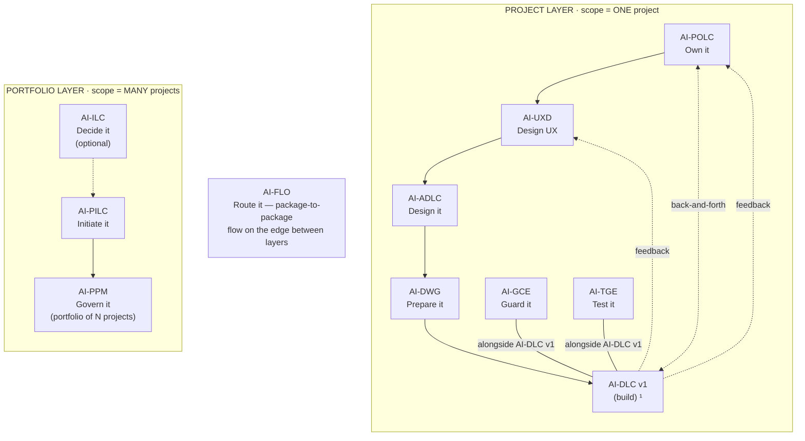

# AI-ADLC (AI-Driven Architecture Design Life Cycle)

[](./LICENSE)

**Version:** 1.1.0
**Created By:** Maheri — [LinkedIn](https://www.linkedin.com/in/mohammad-maheri-8399565b)
**Inspired By:** [awslabs/aidlc-workflows](https://github.com/awslabs/aidlc-workflows) (MIT-0)
**License:** Apache 2.0 with Attribution Addendum — See `LICENSE` and `NOTICE`

---

## The AI-* PDLC Family

AI-ADLC is part of **AIFLC** (AI Full Life Cycle) — the AI-* PDLC Family of injectable workflow packages.


  ¹ AI-DLC v1 = Amazon's open-source build lifecycle (not ours; we feed it).

| Layer | Package | Type | Input | Output |
|-------|---------|------|-------|--------|
| Portfolio | **AI-ILC** ² | Interactive workflow (lifecycle) | Raw idea | Approved Idea Brief / Feature Brief |
| Portfolio | **AI-PILC** | Interactive workflow (lifecycle) | Raw requirement | Project Initiation Package (PIP) |
| Portfolio | **AI-PPM** ³ | Adaptive portfolio engine | Multiple PIPs + Approved Idea Briefs | Portfolio register + cross-project prioritization & governance |
| Edge | **AI-FLO** ³ | Router / orchestration engine | Any package output marker | Routing decision + handoff to next package/layer |
| Project | **AI-POLC** ³ | Interactive workflow (lifecycle) | PIP | Product Backlog Package (PBP) |
| Project | **AI-UXD** ³ | Interactive workflow (lifecycle) | PIP + PBP | UX Design Package (UXP): personas/journeys, IA, user flows, design system + tokens, accessibility baseline |
| Project | **AI-ADLC** | Interactive workflow (lifecycle) | PIP + PBP + UXP | Architecture Package (AP) |
| Project | **AI-DWG** | One-time generator | AP + PBP + UXP | Ready-to-code development workspace (DW) |
| Project | **AI-GCE** | Adaptive governance engine | DW (AI-DWG output) | Compliance enforcement layer |
| Project | **AI-TGE** | Test governance engine | DW / build artifacts | Test governance & quality layer |
| Project | **AI-DLC v1** ¹ | Interactive workflow (lifecycle) | DW + GCE + User Stories (from AI-POLC) | Working Software |

> ¹ **AI-DLC v1** ([awslabs/aidlc-workflows](https://github.com/awslabs/aidlc-workflows)) is NOT our product. Our chain produces the workspace AI-DLC v1 consumes.
> ² **AI-ILC** is an **optional pre-stage** (the funnel before the funnel). The chain still works without it for users who start at AI-PILC. `⇢` denotes the optional link.
> ³ All packages in this table are **built**. AI-PPM (portfolio engine), AI-FLO (router), AI-POLC (product ownership lifecycle), and AI-UXD (UX design lifecycle) were the last four — completed June 2026. Within the Project layer, **AI-POLC, AI-UXD, and AI-ADLC run sequentially** (POLC→UXD→ADLC) — each feeds the next, culminating at AI-DWG which receives all three outputs (AP + PBP + UXP). **AI-GCE and AI-TGE run alongside AI-DLC v1** as continuous quality engines; **AI-POLC ⇄ AI-DLC v1** exchange backlog/acceptance throughout delivery; and **AI-DLC v1 runtime feedback flows back to both AI-UXD and AI-POLC**. Feedback loops (ADLC→POLC cost/risk, ADLC→UXD constraints) provide iterative refinement without changing the forward sequence.

> **AI-DFE** ([Data Fabric Engine](../ai-dfe/)) is a family-scoped **companion** — it gathers data from all packages and distributes structured JSON for dashboards and status roll-ups. It runs alongside the chain rather than as a linear step, so it is not shown as a chain row above.

---

## What is AI-ADLC?

AI-ADLC is an injectable workflow that guides an AI assistant (acting as CTO/Chief Architect) and a human user through the complete process of designing a solution architecture — from receiving project requirements to delivering a professional, development-ready Architecture Package.

It is general-purpose, reusable, and contains zero project-specific content. Drop it into any workspace, point it at requirements, and it walks you through 5 phases and 13 stages of structured architecture design.

---

## Key Features

| Feature | Description |
|---------|-------------|
| **CTO Perspective** | AI acts as an experienced Chief Architect — pragmatic, team-aware, constraint-respectful |
| **Adaptive Intake** | Handles full PIP, raw PRD, verbal description, or brownfield extension |
| **ADR-Driven** | Every major decision produces a formal Architecture Decision Record |
| **C4 Model** | Progressive decomposition: System Context → Containers → Components |
| **Constraint-Aware** | Never recommends outside stated boundaries |
| **Resumable** | State file enables multi-session architecture work |
| **Platform-Agnostic** | Works with Kiro, Q Developer, Cursor, Cline, Claude Code, Copilot |

---

## What It Produces

A complete Architecture Package containing:

- Architecture Vision & Principles
- System Context Diagram (C4 Level 1)
- Container Diagram (C4 Level 2)
- Technology Stack Document (with ADRs)
- Multi-Tenancy Architecture (if applicable)
- Security & Identity Architecture
- Data Architecture & Schema Strategy
- API Architecture & Contracts
- Integration Architecture
- Infrastructure & Deployment Architecture
- Component Design (C4 Level 3)
- Architecture Decision Records (ADR-001, ADR-002, ...)
- Architecture Workbook
- Package README (summary and reading guide)

---

## The Five Phases

```
🔵 FOUNDATION       →  Load context, assess complexity, define vision & principles
🟠 DECOMPOSITION    →  Define system boundaries, containers (C4 L1 + L2)
🟡 DECISIONS        →  Select technology, isolation patterns, security model
🟢 DESIGN           →  Detail data, API, integrations, infrastructure, components (C4 L3)
🚀 ASSEMBLY         →  Consolidate, cross-check, produce final package
```

---

## Activation

**Explicit key:** type `_ADLC_` in any prompt to activate AI-ADLC unambiguously — even when other AI-* packages share the workspace. The status key `_ACTIVE_` reports which package is currently active. A package switch never happens without your explicit key or confirmation, and any switch is announced on the first line of the response (`Active package: AI-ADLC`). See [`../TRIGGER_KEYS_REFERENCE.md`](../TRIGGER_KEYS_REFERENCE.md) for the full family key table.

---

## Installation

1. Download or clone this repository
2. The package contains two key directories:
   - `ai-adlc-rules/` — the core workflow (always loaded by the AI)
   - `ai-adlc-rule-details/` — stage details, extensions, and templates (loaded on demand)
3. Follow the platform-specific instructions in [setup/INSTALL.md](./setup/INSTALL.md)

---

## Output Directory Structure

AI-ADLC outputs into the standard multi-project layout. Architecture artifacts land in `architecture/` within the project folder:

```
pdlc-ws/projects/
├── PROJECTS.md                          ← workspace registry
└── PRJ-{ABBREV}-{slug}/                  ← one project
    ├── management_framework/             ← shared governance spine
    └── architecture/                     ← AI-ADLC output
        ├── adlc-state.md                 ← progress marker
        ├── architecture-vision.md
        ├── system-context.md
        ├── container-diagram.md
        ├── technology-stack.md
        ├── security-architecture.md
        ├── data-architecture.md
        ├── api-architecture.md
        ├── integration-architecture.md
        ├── component-design.md
        ├── architecture-workbook.md
        ├── ADR-001.md … ADR-NNN.md
        └── AP_README.md
```

> The `projects/` structure is always-on — solo, single-project, and multi-project alike. See `OUTPUT_AND_STATE_CONTRACT.md` for full details.

---

## Usage

1. Open your workspace with the AI assistant active
2. Start a chat:
   ```
   Using AI-ADLC, design the architecture for this system: [provide source]
   ```
3. The workflow activates and guides you through progressive design
4. Approve each stage's output at gates
5. All artifacts are produced in your configured output folder

---

## File Structure

```
ai-adlc/
├── README.md
├── LICENSE
├── ROADMAP.md
├── ai-adlc-rules/
│   └── core-workflow.md
└── ai-adlc-rule-details/
    ├── common/
    │   ├── process-overview.md
    │   ├── session-continuity.md
    │   ├── question-format-guide.md
    │   ├── content-validation.md
    │   ├── diagram-standards.md
    │   └── welcome-message.md
    ├── foundation/
    │   ├── workspace-detection.md
    │   ├── requirements-ingestion.md
    │   └── architecture-vision.md
    ├── decomposition/
    │   ├── system-context.md
    │   └── container-design.md
    ├── decisions/
    │   ├── technology-stack.md
    │   ├── multi-tenancy.md
    │   └── security-identity.md
    ├── design/
    │   ├── data-architecture.md
    │   ├── api-architecture.md
    │   ├── integration-infrastructure.md
    │   └── component-design.md
    ├── assembly/
    │   └── package-assembly.md
    ├── extensions/
    │   ├── README.md
    │   ├── ddd-tactical/
    │   │   ├── ddd-tactical.opt-in.md
    │   │   └── ddd-tactical.md
    │   ├── microservices/
    │   │   ├── microservices.opt-in.md
    │   │   └── microservices.md
    │   ├── bff-pattern/
    │   │   ├── bff-pattern.opt-in.md
    │   │   └── bff-pattern.md
    │   ├── event-sourcing-cqrs/
    │   │   ├── event-sourcing-cqrs.opt-in.md
    │   │   └── event-sourcing-cqrs.md
    │   ├── resilience-patterns/
    │   │   ├── resilience-patterns.opt-in.md
    │   │   └── resilience-patterns.md
    │   └── feature-flags/
    │       ├── feature-flags.opt-in.md
    │       └── feature-flags.md
    └── templates/
        ├── adr-template.md
        ├── architecture-vision.md
        ├── system-context.md
        ├── container-diagram.md
        ├── technology-stack.md
        ├── security-architecture.md
        ├── data-architecture.md
        ├── api-architecture.md
        ├── integration-architecture.md
        ├── component-design.md
        ├── multi-tenancy.md
        └── architecture-workbook.md
```

---

## Tenets

1. **CTO pragmatism** — Proven patterns over novel experiments; team-aware recommendations
2. **Decision transparency** — Every major choice has a recorded ADR with alternatives analysis
3. **Progressive detail** — C4 L1 → L2 → L3; never detail internals before boundaries are set
4. **Constraint-first** — Never recommend outside stated boundaries, no matter how "better" it seems
5. **Adaptive** — Scale rigor to complexity; don't over-architect simple systems
6. **Resumable** — Multi-session work with full state preservation
7. **Agnostic** — Works with any IDE, agent, or model

---

## Extensions (v1.1 — Delivered)

AI-ADLC supports an extension system for advanced architectural patterns. Extensions activate via opt-in during the workflow when your system needs them. Once activated, extension rules are blocking constraints — enforced and verified at stage completion.

### Available Extensions (v1.1 — Complete)

| Extension | Pattern | Rules | When Needed |
|-----------|---------|:-----:|-------------|
| `ddd-tactical/` | DDD Tactical Patterns | DDD-01 → DDD-12 | Complex domain logic with aggregates, domain events, ACLs |
| `microservices/` | Microservices Deep-Dive | MS-01 → MS-12 | Service mesh, distributed tracing, saga patterns |
| `bff-pattern/` | Backend-for-Frontend | BFF-01 → BFF-10 | Multiple client types needing different API shapes |
| `event-sourcing-cqrs/` | Event Sourcing + CQRS | ES-01 → ES-12 | Full audit trail, temporal queries, event-driven state |
| `resilience-patterns/` | Resilience Catalog | RES-01 → RES-12 | Circuit breaker, bulkhead, graceful degradation |
| `feature-flags/` | Feature Flags & Progressive Delivery | FF-01 → FF-11 | Controlled rollout, A/B testing, kill switches |

Each extension provides: numbered rules with verification criteria, anti-patterns, ADR triggers, stage-completion checklists, and reusable templates.

### Future Extensions (see ROADMAP.md)

Serverless, AI/ML Integration, Micro-Frontends, GraphQL Federation, Multi-Region, Zero Trust, Kubernetes-Native, Edge Computing, Data Mesh, Chaos Engineering, and more.

---

## Author

Created by **Maheri** — [LinkedIn](https://www.linkedin.com/in/mohammad-maheri-8399565b)

Designed from real-world CTO architecture practice, combining structured design methodology with AI-driven interactive workflows.

---

## License

**Apache License 2.0 with Attribution Addendum**

- **Free to use:** Personal, commercial, educational, and organizational use — all permitted
- **Modify and distribute:** Create derivative works, redistribute, sublicense — all permitted
- **Attribution required:** Any distributed product substantially based on this work must include:

> *"Built on AIFLC by Mohammad Maheri — [LinkedIn](https://www.linkedin.com/in/mohammad-maheri-8399565b)"*

- **No warranty:** Provided "AS IS" without warranties of any kind

See `LICENSE` and `NOTICE` in this directory for full terms.

**Copyright:** © 2026 Mohammad Maheri

> **Note:** AI-DLC v1 (Development Life Cycle) is NOT part of the AI-* Family — it is a separate AWS product ([awslabs/aidlc-workflows](https://github.com/awslabs/aidlc-workflows)) licensed under MIT-0.

---

*Part of [AIFLC](../README.md) — the AI-* PDLC Family*
