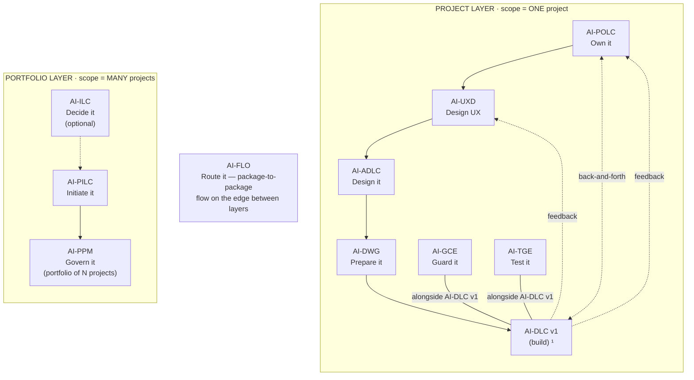
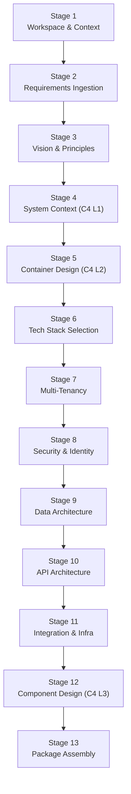

<!-- Copyright (c) 2026 Mohammad Maheri. Licensed under Apache 2.0. See LICENSE. Attribution required - see NOTICE. -->
# AI-ADLC Process Overview

## What is AI-ADLC?

AI-ADLC (AI-Driven Architecture Design Life Cycle) is a structured, interactive workflow that guides an AI assistant (acting as CTO/Chief Architect) and a human user through the complete process of designing a solution architecture — from receiving project requirements to delivering a professional, development-ready Architecture Package.

---

## The AI-* Family


  ¹ AI-DLC v1 = Amazon's open-source build lifecycle (not ours; we feed it).

| Layer | Package | Type | Input | Output |
|-------|---------|------|-------|--------|
| Portfolio | **AI-ILC** ² | Interactive workflow (lifecycle) | Raw idea | Approved Idea Brief / Feature Brief |
| Portfolio | **AI-PILC** | Interactive workflow (lifecycle) | Raw requirement | Project Initiation Package (PIP) |
| Portfolio | **AI-PPM** ³ | Adaptive portfolio engine | Multiple PIPs + Approved Idea Briefs | Portfolio register + cross-project prioritization & governance |
| Edge | **AI-FLO** ³ | Router / orchestration engine | Any package output marker | Routing decision + handoff to next package/layer |
| Project | **AI-POLC** ³ | Interactive workflow (lifecycle) | PIP | Product Backlog Package (PBP) |
| Project | **AI-UXD** ³ | Interactive workflow (lifecycle) | PIP + PBP | UX Design Package (UXP): personas/journeys, IA, user flows, design system + tokens, accessibility baseline |
| Project | **AI-ADLC** | Interactive workflow (lifecycle) | PIP + PBP + UXP | Architecture Package (AP) |
| Project | **AI-DWG** | One-time generator | AP + PBP + UXP | Ready-to-code development workspace (DW) |
| Project | **AI-GCE** | Adaptive governance engine | DW (AI-DWG output) | Compliance enforcement layer |
| Project | **AI-TGE** | Test governance engine | DW / build artifacts | Test governance & quality layer |
| Project | **AI-DLC v1** ¹ | Interactive workflow (lifecycle) | DW + GCE + User Stories (from AI-POLC) | Working Software |

> ¹ **AI-DLC v1** ([awslabs/aidlc-workflows](https://github.com/awslabs/aidlc-workflows)) is NOT our product. Our chain produces the workspace AI-DLC v1 consumes.
> ² **AI-ILC** is an **optional pre-stage** (the funnel before the funnel). The chain still works without it for users who start at AI-PILC. `⇢` denotes the optional link.
> ³ All packages in this table are **built**. AI-PPM (portfolio engine), AI-FLO (router), AI-POLC (product ownership lifecycle), and AI-UXD (UX design lifecycle) were the last four — completed June 2026. Within the Project layer, **AI-POLC, AI-UXD, and AI-ADLC run sequentially** (POLC→UXD→ADLC) — each feeds the next, culminating at AI-DWG which receives all three outputs (AP + PBP + UXP). **AI-GCE and AI-TGE run alongside AI-DLC v1** as continuous quality engines; **AI-POLC ⇄ AI-DLC v1** exchange backlog/acceptance throughout delivery; and **AI-DLC v1 runtime feedback flows back to both AI-UXD and AI-POLC**. Feedback loops (ADLC→POLC cost/risk, ADLC→UXD constraints) provide iterative refinement without changing the forward sequence.

AI-ADLC sits between initiation and construction. It takes the "what" and "why" from AI-PILC and produces the "how" that AI-DWG transforms into a development workspace and AI-DLC v1 builds against.

---

## The Five Phases

```
┌─────────────────────────────────────────────────────────────────────────────┐
│                        AI-ADLC WORKFLOW                                       │
├─────────────────────────────────────────────────────────────────────────────┤
│                                                                              │
│  🔵 FOUNDATION       →  Load context, assess complexity, define vision       │
│  🟠 DECOMPOSITION    →  Define system boundaries and major containers        │
│  🟡 DECISIONS        →  Select technology and key architectural patterns     │
│  🟢 DESIGN           →  Detail internal architecture per concern             │
│  🚀 ASSEMBLY         →  Consolidate, cross-check, produce final package      │
│                                                                              │
├─────────────────────────────────────────────────────────────────────────────┤
│  ↕ THROUGHOUT: ADRs produced at every decision point                         │
│  ↕ THROUGHOUT: Architecture Workbook maintained continuously                 │
└─────────────────────────────────────────────────────────────────────────────┘
```

---

## Phase-Stage Mapping

| Phase | Stage # | Stage Name | Execution | Key Output |
|-------|:-------:|------------|:---------:|------------|
| 🔵 FOUNDATION | 1 | Workspace Detection & Context Loading | ALWAYS | State file, output structure |
| | 2 | Requirements Ingestion | ALWAYS (adaptive) | Architecture Requirements Summary |
| | 3 | Architecture Vision & Principles | ALWAYS | Vision document, principles, constraints |
| 🟠 DECOMPOSITION | 4 | System Context (C4 L1) | ALWAYS | Context diagram + document |
| | 5 | Container Design (C4 L2) | ALWAYS | Container diagram + document |
| 🟡 DECISIONS | 6 | Technology Stack Selection | ALWAYS | Tech stack doc + ADRs |
| | 7 | Multi-Tenancy & Data Isolation | CONDITIONAL | Multi-tenancy doc + ADR |
| | 8 | Security & Identity Architecture | ALWAYS | Security doc + ADRs |
| 🟢 DESIGN | 9 | Data Architecture & Schema | ALWAYS | Data architecture doc |
| | 10 | API Architecture & Contracts | ALWAYS | API architecture doc |
| | 11 | Integration & Infrastructure | ALWAYS | Integration + Infrastructure docs |
| | 12 | Component Design (C4 L3) | ALWAYS | Component diagram + document |
| 🚀 ASSEMBLY | 13 | Architecture Package Assembly | ALWAYS | Package README + quality report |

---

## Adaptive Depth Model

| Depth Level | When Applied | Behavior |
|-------------|-------------|----------|
| **Minimal** | Small system, proven patterns, clear requirements, <5 components | Brief documents; fewer ADRs; 1 iteration per stage |
| **Standard** | Normal complexity, some design challenges, 5-15 components | Full document set; ADRs for key decisions; 1-2 iterations per stage |
| **Comprehensive** | High complexity, novel patterns, strict constraints, >15 components | Detailed design with sequence diagrams; extensive ADRs; deep options analysis; multiple iterations |

**Depth indicators (assessed at Stage 2):**

| Factor | Minimal | Standard | Comprehensive |
|--------|---------|----------|---------------|
| Component count | <5 | 5-15 | >15 |
| Integration points | 0-2 | 3-6 | >6 |
| Multi-tenancy | No | Simple isolation | Complex isolation model |
| Security requirements | Standard | Elevated (PII, compliance) | Strict (regulated, classified) |
| Scale targets | <1K users | 1K-100K users | >100K users |
| Team familiarity | Known patterns | Some new patterns | Novel/unproven approaches |
| Deployment model | Standard cloud/on-prem | Hybrid or constrained | Air-gapped, compliance-heavy |

---

## The CTO Perspective

Throughout the workflow, the AI operates as an experienced CTO/Chief Architect:

| CTO Principle | What It Means in Practice |
|---------------|--------------------------|
| **Pragmatic over perfect** | Recommend what works reliably, not what's theoretically elegant |
| **Team-aware** | Consider: "Can this team build and maintain this for 5 years?" |
| **Operable first** | A system that can't be monitored, debugged, and scaled is a bad architecture |
| **Proven patterns** | Prefer patterns with production track records; novel only when justified |
| **Constraint-respectful** | Never recommend what violates stated constraints (budget, on-prem, team size) |
| **Decision transparency** | Every choice has recorded rationale; future CTOs can understand "why" |
| **Progressive detail** | Start big (C4 L1) and zoom in (C4 L3); don't detail internals before boundaries are set |

---

## Interaction Model

### Gate Behavior

```
[AI produces architecture artifact] → [Presents to user] → [User reviews]
                                                                 │
                                                    ┌────────────┼────────────┐
                                                    ▼            ▼            ▼
                                                Approve     Challenge     Stop/
                                              (proceed)    Decision      Pause
                                                    │            │            │
                                                    ▼            ▼            ▼
                                              Next Stage    Discuss &     Save State
                                                           Re-decide
```

### ADR Trigger

An ADR is produced when:
- 2+ viable technology options were evaluated
- A pattern choice has long-term implications
- The decision would not be obvious to a future reader
- The user asks "why not X?" — that's a signal an ADR is needed

### User Commands (Available at Any Time)

| Command | Effect |
|---------|--------|
| "Skip this stage" | Logs skip; moves on |
| "Go back to stage {n}" | Revisits; state updated |
| "Show progress" | Displays current state |
| "Show ADRs" | Lists all ADRs with status |
| "Show workbook" | Displays open questions |
| "Add a stage for {topic}" | Inserts custom design stage |
| "Change depth" | Adjusts remaining workflow |
| "Stop here" | Saves state; generates partial package |
| "Why did we choose X?" | Shows ADR rationale |

---

## Architecture Workbook

A living document maintained throughout:

| Section | Purpose |
|---------|---------|
| **Decision Backlog** | Questions that need answers (prioritized) |
| **Open Questions** | Design issues not yet resolved |
| **Discussion Notes** | Key conversation points captured |
| **Resolved Items** | Decisions made — cross-referenced to ADRs |
| **Architecture Sessions** | Log of what was covered in each session |

The Workbook is the "thinking trail" — it shows not just WHAT was decided but HOW we got there.

---

## Session Continuity

AI-ADLC supports multi-session work:

1. **State file** (`adlc-state.md`) persists all progress
2. On session start, workflow detects state and offers to resume
3. ADR register is preserved across sessions
4. Architecture Workbook accumulates across all sessions
5. C4 diagrams build progressively (L1 → L2 → L3 across sessions)

---

## What AI-ADLC Does NOT Do

- ❌ Write code (that's AI-DLC v1's job)
- ❌ Produce project management artifacts (that's AI-PILC's job)
- ❌ Generate developer handoff packages or steering files (separate activity)
- ❌ Make final decisions without user approval
- ❌ Recommend technologies it can't justify with evidence
- ❌ Ignore stated constraints because a "better" option exists outside them
- ❌ Design in isolation — always references requirements as the source of truth


## Stage Flow (visual)

> The stage sequence at a glance. The table above stays authoritative.


