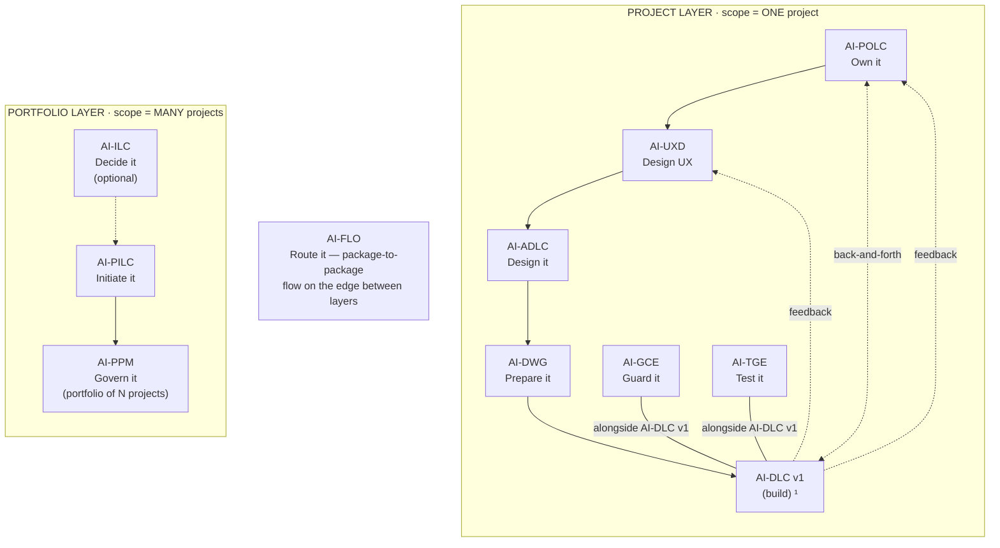

# AI-DWG — AI-Driven Workspace Generator

[](./LICENSE)

**Version:** 1.0.0

**Transform architecture into a ready-to-code development workspace.**

---

## What It Does

AI-DWG composes a complete development workspace from one or more design-time peer inputs — Architecture Package (from AI-ADLC), Product Backlog Package (from AI-POLC), and/or UX Design Package (from AI-UXD). Any non-empty combination is valid; none is privileged. It generates Kiro steering files, project instructions, repository structure, configuration files, and operational documents — scoped to the input clusters actually present.

**Input:** Any non-empty subset of {Architecture Package (AI-ADLC), Product Backlog Package (AI-POLC), UX Design Package (AI-UXD)} — all structured markdown documents. At least one is required; the more you provide, the richer the workspace.
**Output:** Ready-to-code workspace with governance, structure, and rules

---

## The AI-* PDLC Family

AI-DWG is part of **AIFLC** (AI Full Life Cycle) — the AI-* PDLC Family of injectable workflow packages.


  ¹ AI-DLC v1 = Amazon's open-source build lifecycle (not ours; we feed it).

| Layer | Package | Type | Input | Output |
|-------|---------|------|-------|--------|
| Portfolio | **AI-ILC** ² | Interactive workflow (lifecycle) | Raw idea | Approved Idea Brief / Feature Brief |
| Portfolio | **AI-PILC** | Interactive workflow (lifecycle) | Raw requirement | Project Initiation Package (PIP) |
| Portfolio | **AI-PPM** ³ | Adaptive portfolio engine | Multiple PIPs + Approved Idea Briefs | Portfolio register + cross-project prioritization & governance |
| Edge | **AI-FLO** ³ | Router / orchestration engine | Any package output marker | Routing decision + handoff to next package/layer |
| Project | **AI-POLC** ³ | Interactive workflow (lifecycle) | PIP | Product Backlog Package (PBP) |
| Project | **AI-UXD** ³ | Interactive workflow (lifecycle) | PIP + PBP | UX Design Package (UXP): personas/journeys, IA, user flows, design system + tokens, accessibility baseline |
| Project | **AI-ADLC** | Interactive workflow (lifecycle) | PIP + PBP + UXP | Architecture Package (AP) |
| Project | **AI-DWG** | One-time generator | AP + PBP + UXP | Ready-to-code development workspace (DW) |
| Project | **AI-GCE** | Adaptive governance engine | DW (AI-DWG output) | Compliance enforcement layer |
| Project | **AI-TGE** | Test governance engine | DW / build artifacts | Test governance & quality layer |
| Project | **AI-DLC v1** ¹ | Interactive workflow (lifecycle) | DW + GCE + User Stories (from AI-POLC) | Working Software |

> ¹ **AI-DLC v1** ([awslabs/aidlc-workflows](https://github.com/awslabs/aidlc-workflows)) is NOT our product. Our chain produces the workspace AI-DLC v1 consumes.
> ² **AI-ILC** is an **optional pre-stage** (the funnel before the funnel). The chain still works without it for users who start at AI-PILC. `⇢` denotes the optional link.
> ³ All packages in this table are **built**. AI-PPM (portfolio engine), AI-FLO (router), AI-POLC (product ownership lifecycle), and AI-UXD (UX design lifecycle) were the last four — completed June 2026. Within the Project layer, **AI-POLC, AI-UXD, and AI-ADLC run sequentially** (POLC→UXD→ADLC) — each feeds the next, culminating at AI-DWG which receives all three outputs (AP + PBP + UXP). **AI-GCE and AI-TGE run alongside AI-DLC v1** as continuous quality engines; **AI-POLC ⇄ AI-DLC v1** exchange backlog/acceptance throughout delivery; and **AI-DLC v1 runtime feedback flows back to both AI-UXD and AI-POLC**. Feedback loops (ADLC→POLC cost/risk, ADLC→UXD constraints) provide iterative refinement without changing the forward sequence.

> **AI-DFE** ([Data Fabric Engine](../ai-dfe/)) is a family-scoped **companion** — it gathers data from all packages and distributes structured JSON for dashboards and status roll-ups. It runs alongside the chain rather than as a linear step, so it is not shown as a chain row above.

---

## Features

- **Full Generation** — one-shot workspace creation from architecture docs
- **Delta Reconciliation** — incremental updates when architecture changes
- **Extension-Aware** — detects AI-ADLC v1.1 extensions (DDD, Microservices, BFF, Event Sourcing, Resilience, Feature Flags)
- **Conditional Generation** — only produces steering files justified by the architecture
- **Provenance Tracking** — every generated rule traces to its AP source
- **Non-Destructive Updates** — reconciliation preserves team customizations
- **Technology-Adaptive** — generates stack-appropriate configs (Node, Python, .NET, Java, Generic)
- **Prescriptive Output** — steering files say "MUST/MUST NOT", not "should/consider"

---

## What It Generates

| Category | Files |
|----------|:-----:|
| Steering files (always) | 19 |
| Steering files (conditional) | Up to 8 |
| Operational documents | 6 |
| Planning templates | 3 |
| Config files | 5 |
| Source structure | Per C4 L3 modules |

---

## Output Directory Structure

AI-DWG generates a self-contained dev workspace within the project folder. It reads peer inputs (AP, PBP, UXP) from the same project and outputs a workspace meant to be opened separately in its own IDE:

```
pdlc-ws/projects/
├── PROJECTS.md                          ← workspace registry
└── PRJ-{ABBREV}-{slug}/                  ← one project
    ├── management_framework/             ← shared governance spine
    ├── pip/                              ← AI-PILC output (read by DWG)
    ├── architecture/                     ← AI-ADLC output (read by DWG)
    ├── ux/                               ← AI-UXD output (read by DWG)
    ├── backlog/                          ← AI-POLC output (read by DWG)
    │
    └── {slug}-workspace/                 ← AI-DWG output (dev workspace)
        ├── rules/               ← generated steering files
        ├── .kiro/hooks/                  ← AI-GCE governs here
        ├── management_framework/         ← spine carried forward
        ├── src/                          ← code structure per C4 L3
        ├── tests/                        ← test structure
        └── configs …                     ← CI/CD, linting, etc.
```

> The dev workspace is opened **separately** in its own IDE instance. AI-GCE and AI-TGE operate inside it. The `projects/` structure is always-on — see `OUTPUT_AND_STATE_CONTRACT.md`.

---

## Activation

**Explicit key:** type `_DWG_` in any prompt to activate AI-DWG unambiguously — even when other AI-* packages share the workspace. The status key `_ACTIVE_` reports which package is currently active. A package switch never happens without your explicit key or confirmation, and any switch is announced on the first line of the response (`Active package: AI-DWG`). See [`../TRIGGER_KEYS_REFERENCE.md`](../TRIGGER_KEYS_REFERENCE.md) for the full family key table.

---

## Installation

See [setup/INSTALL.md](./setup/INSTALL.md)

---

## Usage

```
# First time
Using #ai-dwg-rules, generate the development workspace from my architecture package.

# After architecture changes
Using #ai-dwg-rules, reconcile the workspace — {what changed}.
```

---

## File Structure

```
ai-dwg/
├── README.md                    ← You are here
├── LICENSE                      ← Apache 2.0 + Attribution
├── PLAN.md                      ← Design plan
├── ai-dwg-rules/
│   └── core-generator.md       ← Master generation logic
├── ai-dwg-rule-details/
│   ├── common/                  ← Process overview, AP reading guide, validation
│   ├── mapping/                 ← 36 transformation rule files
│   ├── reconciliation/          ← Diff, merge, provenance, signaling
│   └── templates/               ← Output file templates (48 files)
└── setup/
    └── INSTALL.md               ← Installation instructions
```

---

## Tenets

1. **AP is the source of truth** — every rule traces to architecture
2. **Prescriptive over descriptive** — "MUST" not "should"
3. **Day-1 productivity** — developers start contributing immediately
4. **Non-destructive reconciliation** — team work is never lost
5. **Conditional generation** — no bloat; only what architecture justifies
6. **Detection by marker** — works regardless of folder structure
7. **Standalone capable** — works with or without the full AI-* chain

---

## Compatibility

- AI-ADLC v1.0 (core workflow)
- AI-ADLC v1.1 (6 extensions)
- Standalone Architecture Package (any structured markdown)

---

## Author

**Created By:** Maheri — [LinkedIn](https://www.linkedin.com/in/mohammad-maheri-8399565b)
**Inspired By:** [awslabs/aidlc-workflows](https://github.com/awslabs/aidlc-workflows) (MIT-0)

---

## License

**Apache License 2.0 with Attribution Addendum**

- **Free to use:** Personal, commercial, educational, and organizational use — all permitted
- **Modify and distribute:** Create derivative works, redistribute, sublicense — all permitted
- **Attribution required:** Any distributed product substantially based on this work must include:

> *"Built on AIFLC by Mohammad Maheri — [LinkedIn](https://www.linkedin.com/in/mohammad-maheri-8399565b)"*

- **No warranty:** Provided "AS IS" without warranties of any kind

See [LICENSE](./LICENSE) and [NOTICE](./NOTICE) in this directory for full terms.

**Copyright:** © 2026 Mohammad Maheri

---

*Part of [AIFLC](../README.md) — the AI-* PDLC Family*
