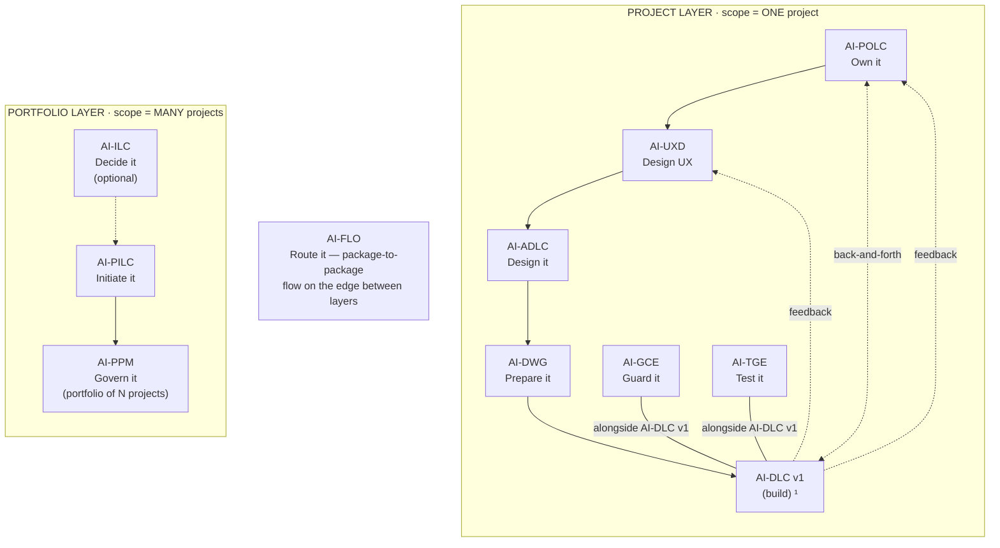
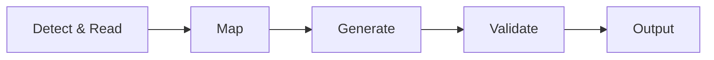

<!-- Copyright (c) 2026 Mohammad Maheri. Licensed under Apache 2.0. See LICENSE. Attribution required - see NOTICE. -->
# AI-DWG Process Overview

## What is AI-DWG?

AI-DWG (AI-Driven Workspace Generator) is a **convergence-point generator** that composes a complete, ready-to-code development workspace from one or more design-time peer inputs: Architecture Package (from AI-ADLC), Product Backlog Package (from AI-POLC), and/or UX Design Package (from AI-UXD). Any non-empty subset of these three is a valid starting point.

It produces Kiro steering files, project instructions, repository structure, configuration files, planning templates, and operational documents — **scoped to the input clusters actually present.** Each input unlocks its own output cluster; absent inputs mean that cluster is simply not generated (with quality-impact disclosure to the user).

Unlike AI-PILC and AI-ADLC (interactive lifecycles with stages and gates), AI-DWG is a **transformation engine**: Peer inputs in → Development Workspace out.

---

## The AI-* Family


  ¹ AI-DLC v1 = Amazon's open-source build lifecycle (not ours; we feed it).

AI-DWG is the **convergence point** between design and construction. It receives peer inputs from up to three design-time packages (AI-ADLC, AI-POLC, AI-UXD) — any non-empty subset — and composes the operational environment that AI-DLC v1 builds within and AI-GCE enforces against.

---

## Three Operating Modes

```
┌─────────────────────────────────────────────────────────────────────────────┐
│                        AI-DWG OPERATING MODES                                │
├─────────────────────────────────────────────────────────────────────────────┤
│                                                                              │
│  MODE 1: FULL GENERATION                                                     │
│  ─────────────────────────                                                   │
│  When: Workspace doesn't exist yet (first time)                              │
│  Flow: READ AP → MAP → GENERATE → VALIDATE → OUTPUT                         │
│  Result: Complete development workspace, ready for git init + team start     │
│                                                                              │
│  MODE 2: DELTA RECONCILIATION                                                │
│  ─────────────────────────────                                               │
│  When: Architecture changed after initial generation                         │
│  Flow: READ CHANGES → DIFF → PROPOSE → MERGE → SIGNAL DOWNSTREAM            │
│  Result: Workspace updated incrementally, team customizations preserved      │
│                                                                              │
│  MODE 3: BROWNFIELD OVERLAY                                                  │
│  ──────────────────────────                                                  │
│  When: Existing codebase without AI-DWG governance                           │
│  Flow: DETECT EXISTING → READ AP → GENERATE MISSING → MERGE CONFIGS         │
│  Result: Steering + governance layered onto existing project, code untouched │
│                                                                              │
└─────────────────────────────────────────────────────────────────────────────┘
```

### Mode Detection (Automatic)

| Condition | Mode Selected |
|-----------|:-------------:|
| Target workspace does NOT exist OR has no `rules/` folder | Mode 1: Full Generation |
| User explicitly says "generate workspace" / "full generation" | Mode 1: Full Generation |
| Workspace EXISTS and `rules/` has content | Mode 2: Delta Reconciliation |
| User says "architecture changed" / "reconcile" / points to updated ADR | Mode 2: Delta Reconciliation |
| Workspace EXISTS with code but NO `rules/` (or partial) | Mode 3: Brownfield Overlay |
| User says "add governance" / "overlay" / "retrofit steering" / "brownfield" | Mode 3: Brownfield Overlay |

### Pre-Mode Gate: Input Selection & Conflict Surfacing

After mode is determined but **before** execution begins, DWG runs a mandatory two-phase gate:

```
Phase A: PEER-INPUT SELECTION
──────────────────────────────
• Scan for markers (adlc-state.md, polc-state.md, uxd-state.md)
• If zero found → BLOCK, ask user
• If <3 found → quality-impact disclosure → user approves
• Record {present_inputs} set

Phase B: CROSS-INPUT CONFLICT SURFACING (if 2+ inputs present)
───────────────────────────────────────────────────────────────
• Scan for contradictions between present inputs (frontier overlap zones)
• If conflict detected → surface with root-cause analysis + suggested fix
• HARD GATE: DWG does NOT proceed until all conflicts resolved
• If no conflicts → proceed silently
```

This gate applies to **all three modes**. Full protocol details (quality-impact disclosure, installed-package completion offer, cross-input conflict surfacing) live in `flows/input-selection-and-conflict.md`.

---

## Full Generation Pipeline (Mode 1)

```
┌──────────┐     ┌──────────┐     ┌──────────────┐     ┌──────────────┐     ┌──────────┐
│ DETECT & │ ──► │   MAP    │ ──► │   GENERATE   │ ──► │   VALIDATE   │ ──► │  OUTPUT  │
│  READ    │     │(Per-Clust)│    │  (Produce)   │     │ (Cross-check)│     │(Summary) │
└──────────┘     └──────────┘     └──────────────┘     └──────────────┘     └──────────┘
     │                │                   │                    │                    │
     ▼                ▼                   ▼                    ▼                    ▼
Scan markers,    Present input →     Files with real     Input↔Workspace      Present to
load present     workspace           content (not        consistency          user; signal
peers, quality   artifact(s)         placeholders)       verified per         AI-GCE
impact disclose  mapping rules       per cluster         cluster
```

### Step Details

| Step | What Happens | Guided By |
|------|-------------|-----------|
| **DETECT & READ** | Scan for all three peer markers. Load present inputs. Quality-impact disclosure for absent inputs. If ADLC present: load AP artifacts, detect extensions via `adlc-state.md`. If POLC present: load PBP. If UXD present: load UXP. | `common/ap-reading-guide.md` |
| **MAP** | Transform each present input into workspace artifact(s) using per-cluster mapping rules. Extension-enrichment mappings loaded if ADLC present with extensions. | `mapping/*.md` files |
| **GENERATE** | Produce steering files, operational docs, configs, folder structure — only for clusters whose input is present. Content is populated from input decisions — NOT placeholders. | `templates/*.md` files |
| **VALIDATE** | Cross-check per cluster: principles encoded? Constraints reflected? No contradictions? Folder structure matches C4 L3 (if ADLC)? | `common/validation-rules.md` |
| **OUTPUT** | Present summary (input coverage, file count, conditional files generated/skipped, next steps). Signal AI-GCE if applicable. | Core generator |

---

## Delta Reconciliation Pipeline (Mode 2)

```
┌─────────────┐   ┌─────────────┐   ┌──────────┐   ┌─────────┐   ┌──────────┐   ┌──────────┐
│ READ STATE  │►  │ READ CHANGE │►  │   DIFF   │►  │ PROPOSE │►  │  MERGE   │►  │  SIGNAL  │
│ (workspace) │   │  (updated   │   │(identify │   │(changes │   │(preserve │   │(AI-GCE)  │
│             │   │   AP art.)  │   │ affected)│   │ to user)│   │ customs) │   │          │
└─────────────┘   └─────────────┘   └──────────┘   └─────────┘   └──────────┘   └──────────┘
```

### Reconciliation Principles

| Principle | Description |
|-----------|-------------|
| **Never overwrite blindly** | Always diff → propose → user approves |
| **Preserve team customizations** | Only update AP-sourced sections; leave team additions untouched |
| **Additive preferred** | Adding content is safe; removing/changing requires confirmation |
| **Track provenance** | Sections marked `<!-- source: AP -->` vs. team additions |
| **Don't delete modules** | Flag module removals; don't auto-delete (may have code) |
| **Signal downstream** | After update, notify AI-GCE to re-derive affected rules |

---

## Brownfield Overlay Pipeline (Mode 3)

```
┌─────────────┐   ┌──────────┐   ┌──────────────┐   ┌──────────┐   ┌──────────┐   ┌──────────┐
│   DETECT    │►  │   READ   │►  │   GENERATE   │►  │  MERGE   │►  │ VALIDATE │►  │  OUTPUT  │
│  EXISTING   │   │   (AP)   │   │   MISSING    │   │ CONFIGS  │   │          │   │          │
│ (workspace) │   │          │   │(steering+docs)│  │(additive)│   │          │   │          │
└─────────────┘   └──────────┘   └──────────────┘   └──────────┘   └──────────┘   └──────────┘
```

### Key Differences from Mode 1

| Aspect | Mode 1 (Greenfield) | Mode 3 (Brownfield Overlay) |
|--------|---------------------|----------------------------|
| Source folders | Created from C4 L3 | NEVER created (code exists) |
| Steering files | Generated fresh | Generated fresh (safe — .kiro/ is new) |
| Config files | Generated fresh | MERGED (additive only) |
| Operational docs | Generated fresh | Only if missing (skip existing) |
| README.md | Generated | NEVER overwritten |
| brownfield-patterns.md | Not generated (greenfield) | Generated if AP has brownfield context |

### Brownfield Overlay Principles

| Principle | Description |
|-----------|-------------|
| **Never modify source code** | Mode 3 touches ONLY .kiro/, configs, and docs — never source files |
| **Steering is always safe** | rules/ is a new directory — no conflict with existing code |
| **Config merges are additive** | Only ADD entries to .gitignore, CODEOWNERS — never remove |
| **Respect existing docs** | If README.md, CONTRIBUTING.md exist, they belong to the team |
| **Ask about conventions** | Before generating, detect what the team already does |

---

## What Gets Generated (Output Inventory — Per Cluster)

### ADLC Cluster — Tech Steering (IF `adlc-state.md` present)

| Category | Files | Always/Conditional (within cluster) |
|----------|:-----:|:------------------:|
| Core Rules | `workspace-rules.md`, `architecture-principles.md` | Always |
| Technology | `tech-stack.md`, `coding-standards.md`, `naming-conventions.md` | Always |
| Governance | `project-governance.md`, `session-governance.md`, `role-isolation.md` | Always |
| Domain | `domain-context.md`, `module-structure.md` | Always |
| API | `api-standards.md` | Always |
| API (extended) | `api-versioning.md` | Conditional |
| Security | `security-rules.md` | Always |
| Data | `database-rules.md` | Always |
| Quality | `testing-strategy.md` | Always (unless TGE activated — delegation rule) |
| Error Handling | `error-handling.md` | Always |
| Observability | `observability-logging.md`, `observability-sensitive.md` | Always |
| Observability (extended) | `observability-tracing.md` | Conditional |
| Infrastructure | `git-workflow.md` | Always |
| Multi-tenancy | `multi-tenancy.md` | Conditional |
| Resilience | `resilience-standards.md` | Conditional |
| Performance | `performance-standards.md` | Conditional |
| Workflow | `workflow-engine.md` | Conditional |
| Frontend | `frontend-standards.md` | Conditional |
| Event Sourcing | `event-sourcing.md` | Conditional (ADLC extension) |
| Feature Flags | `feature-flags.md` | Conditional (ADLC extension) |
| Brownfield | `brownfield-patterns.md` | Conditional (ADLC brownfield mode) |
| AI-DLC v1 Input | `technical-environment.md` | Always |

Plus: **src folder structure** (derived from C4 L3), config files (`.gitignore`, `.editorconfig`, `CODEOWNERS`), and **`architecture/`** reference folder (`architecture/technical-environment.md`, `architecture/docker-compose.yml`, `architecture/constraint-register.md` if present, `architecture/architecture-decision-records.md` if present)

### POLC Cluster — Product Governance (IF `polc-state.md` present)

| Output | Purpose | Location |
|--------|---------|----------|
| `info/vision.md` | AI-DLC v1 Vision Document (executive summary, problem, success metrics, MVP IN/OUT, personas/journeys from UXD if present) | `info/` |
| `backlog/DEFINITION_OF_DONE.md` | Quality criteria with product acceptance bar | `backlog/` |
| `backlog/DEFINITION_OF_READY.md` | Sprint entry gate criteria | `backlog/` |
| `backlog/scope-and-risks.md` | Scope boundary + risk register + assumptions | `backlog/` |
| `backlog/traceability-matrix.md` | Requirements traceability | `backlog/` |
| `backlog/value-metrics.md` | KPI register | `backlog/` |
| `backlog/epics-and-backlog.md` | Prioritized epic backbone | `backlog/` |
| `backlog/epics/` | Full story files per epic (IF Tier 2) | `backlog/epics/` |
| `backlog/user-stories.md` | Story index/entry-point (IF Tier 2) | `backlog/` |
| `backlog/po-charter.md` | PO authority/escalation reference (if in PBP) | `backlog/` |
| `backlog/prioritization-register.md` | Build order rationale (if in PBP) | `backlog/` |
| `templates/session-planning.md` | AI-DLC v1 session planning | `templates/` |
| `templates/sprint-planning.md` | Sprint structure and capacity | `templates/` |
| `templates/estimation-guide.md` | Size estimation (S/M/L/XL) with multipliers | `templates/` |

### UXD Cluster — UX Governance (IF `uxd-state.md` present)

| Output | Purpose | Location |
|--------|---------|----------|
| `design-system.md` | Steering file: design tokens, component rules, pattern inventory | `rules/` |
| `frontend-standards.md` | Prescriptive UI patterns (or enriches ADLC-generated version if both present) | `rules/` |
| `ux/ui-implementation-spec.md` | AI-DLC v1 UI codegen input (wireframes + components + flows) | `ux/` |
| `ux/wireframes/` | Per-screen wireframe specifications (if present in UXP) | `ux/wireframes/` |
| `ux/user-flows/` | Multi-step interaction choreography (if present in UXP) | `ux/user-flows/` |
| `ux/personas/` | User profiles for implementation context (if present in UXP) | `ux/personas/` |
| `ux/journey-maps/` | End-to-end experience maps (if present in UXP) | `ux/journey-maps/` |
| Accessibility baseline relay | Signaled to AI-GCE for enforcement | (signal) |

### Always Generated (Regardless of Which Inputs)

| Document | Purpose | Location |
|----------|---------|----------|
| `info/PROJECT_INSTRUCTIONS.md` | Master developer guide — single entry point | `info/` |
| `info/CONTRIBUTING.md` | Commit strategy, PR process, branching model | `info/` |
| `info/ONBOARDING.md` | New developer checklist | `info/` |
| `info/CICD_GUIDE.md` | CI/CD pipeline setup, quality gates, deployment, rollback | `info/` |
| `info/TEAM_AGREEMENTS.md` | Operating rules, ownership, review standards | `info/` |
| `.github/pull_request_template.md` | PR checklist template | `.github/` |
| `README.md` | Project skeleton + master pointer | Root |

---

## Extension-Aware Generation (AI-ADLC v1.1+)

When AI-ADLC extensions were active during architecture design, AI-DWG detects them and enriches output:

```
┌─────────────────────────────────────────────────────────────────┐
│  EXTENSION DETECTION FLOW                                        │
├─────────────────────────────────────────────────────────────────┤
│                                                                   │
│  1. Read adlc-state.md → check "Enabled Extensions" section      │
│                                                                   │
│  2. For each active extension:                                    │
│     • Load extension-enrichment mapping file                      │
│     • Override conditional triggers (force-generate if needed)    │
│     • Enrich relevant steering files with pattern-specific rules  │
│                                                                   │
│  3. Extension enrichments are ADDITIVE — they add rules,          │
│     they don't replace core generation logic                      │
│                                                                   │
└─────────────────────────────────────────────────────────────────┘
```

| Extension | Enriches | Forces Generation Of |
|-----------|----------|---------------------|
| DDD Tactical | `domain-context.md`, `module-structure.md`, `naming-conventions.md` | — |
| Microservices | `module-structure.md` | `resilience-standards.md`, `observability-tracing.md` |
| BFF Pattern | `api-standards.md` | `frontend-standards.md` |
| Event Sourcing/CQRS | `database-rules.md` | `event-sourcing.md` |
| Resilience Patterns | — | `resilience-standards.md` (full catalog) |
| Feature Flags | — | `feature-flags.md` |

---

## Adaptive Depth Model

AI-DWG adapts output scope and detail based on **which peer inputs are present** and (for the tech cluster) AP complexity:

| Depth Level | Indicators | Generation Behavior |
|-------------|-----------|---------------------|
| **Minimal** | Single peer input; or ADLC present with ≤5 components, single-stack, no multi-tenancy, ≤2 integrations | Core cluster files only, basic operational docs, standard layout |
| **Standard** | 2-3 peer inputs; or ADLC present with 5-15 components, moderate integrations, typical security | Full cluster sets (+ applicable conditional), complete operational docs, detailed layout |
| **Comprehensive** | All 3 peer inputs + ADLC has >15 components, polyglot, multi-tenant, >5 integrations, compliance-heavy | All clusters in full, extended operational docs, granular layout with sub-module structure |

**Depth is determined automatically** from the present inputs and their content — not from user configuration. The peer inputs already encode complexity through their artifacts.

---

## Interaction Model

### Mode 1: Initial Generation

```
User: "Generate the development workspace from my design packages"
  │
  ▼
AI scans for peer input markers (adlc-state.md, polc-state.md, uxd-state.md)
  │
  ▼ (if < 3 found)
AI discloses quality impact of absent inputs:
  "Present: {list}. Absent: {list}. Impact: {cluster details}. Proceed?"
  │
  ▼ (user approves)
AI asks 2-4 config questions:
  • Workspace root path? (default: ./)
  • Project display name? (default: from AP system name or POLC product name)
  • Team size? (affects operational doc depth)
  • Target Kiro autonomy mode? (affects session-governance)
  │
  ▼
AI generates files for all present clusters in one pass
  │
  ▼
AI presents summary:
  "✅ Generated from {n}/3 inputs: {m} steering files, {p} config files, {q} operational docs"
  │
  ▼
Done. User verifies and starts working.
```

### Mode 2: Delta Reconciliation

```
User: "Architecture changed — reconcile the workspace"
  │
  ▼
AI reads updated AP artifact(s) + current workspace state
  │
  ▼
AI presents proposed changes:
  "Affected workspace files:
   • {file 1} — {what changes}
   • {file 2} — {what changes}
   Apply? (a) All (b) Review each (c) Skip"
  │
  ├── User picks (a) → Apply all; signal AI-GCE
  ├── User picks (b) → Show each change; user approves/rejects per file
  └── User picks (c) → Skip; no changes applied
```

### User Commands (Available at Any Time)

| Command | Effect |
|---------|--------|
| "Generate workspace" / "Full generation" | Trigger Mode 1 |
| "Architecture changed" / "Reconcile" | Trigger Mode 2 |
| "What extensions were active?" | Show detected AI-ADLC extensions |
| "Why was {file} generated?" | Show provenance (which AP artifact triggered it) |
| "Why was {file} skipped?" | Show conditional trigger that wasn't met |
| "Show conditional files" | List which conditional files were generated/skipped and why |
| "Regenerate {file}" | Re-derive a single steering file from current AP |
| "Add governance" / "Overlay" / "Brownfield" | Trigger Mode 3 |

---

## Mapping Logic (How Peer Inputs → Workspace)

Each present peer input maps to specific workspace artifacts through its cluster:

### ADLC Cluster (Tech) — IF `adlc-state.md` present

| AP Artifact | Produces (Workspace) | Mapping File |
|-------------|---------------------|--------------|
| Architecture Vision & Principles | `workspace-rules.md`, `architecture-principles.md` | `mapping/vision-to-workspace-rules.md` |
| Technology Stack + ADRs | `tech-stack.md`, `.gitignore`, `docker-compose.yml`, `.editorconfig` | `mapping/techstack-to-config.md` |
| Component Design (C4 L3) | Folder structure, `module-structure.md`, `CODEOWNERS` | `mapping/components-to-structure.md` |
| C4 L3 Bounded Contexts | `domain-context.md` | `mapping/components-to-domain-context.md` |
| Security Architecture | `security-rules.md` | `mapping/security-to-steering.md` |
| API Architecture | `api-standards.md`, `api-versioning.md` | `mapping/api-to-steering.md` |
| Data Architecture | `database-rules.md` | `mapping/data-to-steering.md` |
| Multi-Tenancy Architecture | `multi-tenancy.md` | `mapping/tenancy-to-steering.md` |
| Infrastructure & Deployment | `git-workflow.md`, `docker-compose.yml` | `mapping/infra-to-config.md` |
| Infrastructure (CI/CD) | `info/CICD_GUIDE.md` | `mapping/infra-to-cicd.md` |
| Infrastructure (observability) | `observability-*.md` | `mapping/infra-to-observability.md` |
| Component Design (errors) | `error-handling.md` | `mapping/components-to-error-handling.md` |
| Integration Architecture | `resilience-standards.md` | `mapping/integration-to-resilience.md` |
| Quality Attributes (latency) | `performance-standards.md` | `mapping/quality-to-performance.md` |
| Container Design (UI) | `frontend-standards.md` | `mapping/containers-to-frontend.md` |
| AP + UXP (combined) | `architecture/technical-environment.md` | `mapping/ap-uxp-to-tech-environment.md` |
| AP Constraint Register | `architecture/constraint-register.md` | `mapping/adlc-to-constraint-register.md` |
| AP ADRs | `architecture/architecture-decision-records.md` | `mapping/adlc-to-adrs.md` |
| Brownfield context (conditional) | `brownfield-patterns.md` | `mapping/brownfield-to-steering.md` |

### POLC Cluster (Product) — IF `polc-state.md` present

| PBP Artifact | Produces (Workspace) | Mapping File |
|-------------|---------------------|--------------|
| Product Vision + UXD personas | `info/vision.md` | `mapping/polc-uxd-to-vision-document.md` |
| Quality Attributes + DoR/DoD | `backlog/DEFINITION_OF_DONE.md` + `backlog/DEFINITION_OF_READY.md` | `mapping/quality-to-dod.md` |
| Epic decomposition + stories | `backlog/epics-and-backlog.md` + `backlog/epics/` | `mapping/polc-to-epics-backlog.md` |
| Tier 2 INVEST stories | `backlog/user-stories.md` (index) + `examples/acceptance/` | `mapping/polc-to-user-stories.md` |
| Value metrics / KPIs | `backlog/value-metrics.md` | `mapping/polc-to-value-metrics.md` |
| Traceability matrix | `backlog/traceability-matrix.md` | `mapping/polc-to-traceability.md` |
| PO Charter | `backlog/po-charter.md` | `mapping/governance-derivation.md` |
| Prioritization Register | `backlog/prioritization-register.md` | `mapping/governance-derivation.md` |
| Team Context + Methodology | `info/TEAM_AGREEMENTS.md`, `role-isolation.md`, templates/ | `mapping/team-to-agreements.md` |
| Governance context | `info/CONTRIBUTING.md`, `info/ONBOARDING.md`, `info/PROJECT_INSTRUCTIONS.md`, PR template | `mapping/governance-derivation.md` |
| Risk register + assumptions | `backlog/scope-and-risks.md` | (product-cluster scope derivation) |

### UXD Cluster (UX) — IF `uxd-state.md` present

| UXP Artifact | Produces (Workspace) | Mapping File |
|-------------|---------------------|--------------|
| Design system + tokens | `design-system.md` | `mapping/uxd-to-design-system.md` |
| Component/pattern inventory | `frontend-standards.md` (UI patterns) | `mapping/containers-to-frontend.md` |
| Wireframes + user flows | `ux/ui-implementation-spec.md` | (ux-cluster derivation) |
| Wireframe Specifications | `ux/wireframes/` | `mapping/uxd-to-wireframes.md` |
| User Flows | `ux/user-flows/` | `mapping/uxd-to-user-flows.md` |
| Personas | `ux/personas/` | `mapping/uxd-to-personas.md` |
| Journey Maps | `ux/journey-maps/` | `mapping/uxd-to-journey-maps.md` |
| Accessibility baseline | Relay to GCE + `frontend-standards.md` a11y | (accessibility relay logic) |

### Discovery Layer (Cross-Cutting) — makes the workspace navigable

| Concern | Produces | Detail File |
|---------|----------|-------------|
| Root discovery index | `WORKSPACE_CONTEXT_MAP.md` + `backlog/README.md` + `ux/README.md` + `architecture/README.md` | `mapping/context-map-generation.md` |
| Code-area → reference mapping | `rules/relevance-map.md` | `mapping/relevance-map-generation.md` |

> The discovery layer is a **derived index** — auto-regenerated on every generation and re-baseline, NOT a governed element (GCE doesn't drift-scan it). The relevance map is the source each platform adapter reads to wire contextual loading (Kiro fileMatch, Claude per-module CLAUDE.md, Cursor globs).

### Baseline & Manifest Layer (Cross-Cutting) — versioning + discovery contract

| Concern | Produces | Detail File |
|---------|----------|-------------|
| Governed surface + versioning | `baselines/v{N}/baseline-manifest.yaml` (planning side) | `baseline/baseline-generation.md` |
| Discovery contract | `.governance/workspace-manifest.yaml` (consumers read paths by role) | `baseline/workspace-manifest-generation.md` |
| Per-document version stamp + obsolescence | Approach C stamp on every file; `obsolete/` soft-delete | `baseline/document-stamping.md` |
| Re-baseline on delta | version bump, stamp refresh, obsolescence | `reconciliation/re-baseline.md` |

> **DWG is the sole baseline writer.** The `workspace-manifest.yaml` is the decoupling contract — GCE/TGE/FLO read paths by semantic role, never hardcode. `buildProfile` is PARKED (build-method-agnostic); `storyStyle` + `platformTargets` are active.

---

## What AI-DWG Does NOT Do

- ❌ Generate application code (AI-DLC v1's job)
- ❌ Set up CI/CD pipelines fully (produces skeleton; team configures)
- ❌ Install dependencies (produces dependency file skeleton; team runs install)
- ❌ Make architecture decisions (already made in AI-ADLC)
- ❌ Create governance enforcement hooks (AI-GCE's job)
- ❌ Overwrite team customizations during reconciliation
- ❌ Delete modules/folders during reconciliation
- ❌ Require full regeneration for small architecture changes
- ❌ Ask questions the peer inputs already answer
- ❌ Generate steering for patterns the inputs don't justify
- ❌ Silently degrade when inputs are missing (quality-impact disclosure is mandatory)
- ❌ Resolve conflicts between peer inputs (DWG surfaces them; user decides)
- ❌ Treat any single input as "required" or "dominant" (all peers are equal)

---

## Key Principle: Peer Inputs, No Master — Per-Cluster Generation

AI-DWG treats {ADLC, POLC, UXD} as **equal-impact peer inputs**. None dominates. Each unlocks its own output cluster:

| ❌ Old Model (AP-Anchored) | ✅ Correct Model (Peer) |
|----------------------------|------------------------|
| "AP is required; PBP and UXP are optional enrichment" | "Any non-empty subset of {ADLC, POLC, UXD} is valid. Each has its own output cluster." |
| "Generation blocks without AP" | "Generation proceeds with whatever inputs are present (with quality-impact disclosure)" |
| "PBP/UXP sharpen specific AP-derived outputs" | "PBP/UXD produce their OWN outputs; they don't merely enrich ADLC outputs" |

### Prescriptive Over Descriptive (Unchanged)

Generated steering files are **rules**, not documentation:

| ❌ Descriptive (Avoid) | ✅ Prescriptive (Do This) |
|------------------------|--------------------------|
| "We use PostgreSQL for data storage" | "ALL persistent data MUST use PostgreSQL. Do NOT introduce alternative databases without an ADR." |
| "The project follows REST conventions" | "All endpoints MUST use kebab-case URLs, return JSON envelope format, and use standard HTTP status codes. See api-standards.md for the complete contract." |
| "Tenants are isolated" | "Every database query MUST include `tenant_id` in WHERE clause. NEVER query across tenants. Tenant context is propagated via middleware — do NOT access it directly from request." |

This makes steering files **enforceable** by AI-GCE and **unambiguous** for developers.


## Stage Flow (visual)

> The stage sequence at a glance. The table above stays authoritative.


