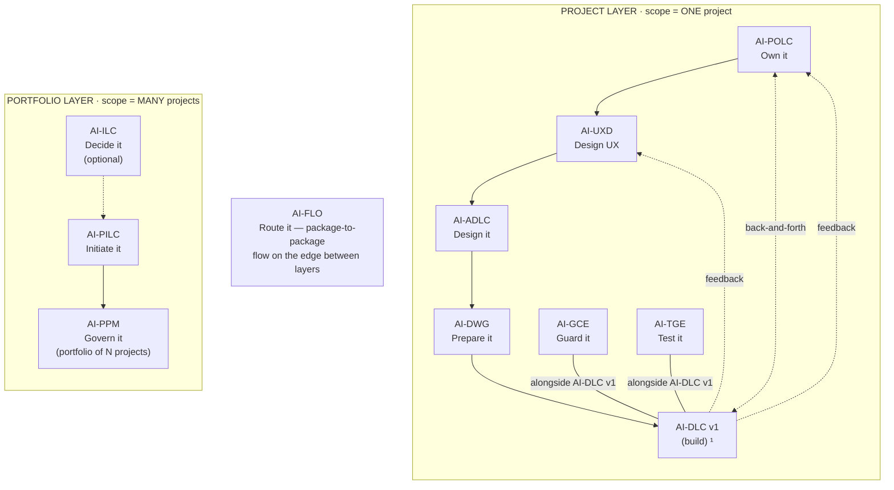

# AI-GCE — AI-Driven Governance & Compliance Engine

[](./LICENSE)

**Created By:** Maheri — [LinkedIn](https://www.linkedin.com/in/mohammad-maheri-8399565b)
**Inspired By:** [awslabs/aidlc-workflows](https://github.com/awslabs/aidlc-workflows) (MIT-0)
**Version:** 1.0.0

---

## What Is AI-GCE?

A **full project governance engine** that reads an AI-DWG development workspace and derives a tailored compliance enforcement layer — rules, hooks, agents, and logging infrastructure specific to that project's architecture, technology, team structure, and methodology.

**Not just architecture compliance.** AI-GCE enforces team topology, role segregation, session discipline, sprint governance, PR process, CI/CD gates, DevOps standards, and change management — all derived automatically from the workspace.

---

## The AI-* PDLC Family

AI-GCE is part of **AIFLC** (AI Full Life Cycle) — the AI-* PDLC Family of injectable workflow packages.


  ¹ AI-DLC v1 = Amazon's open-source build lifecycle (not ours; we feed it).

| Layer | Package | Type | Input | Output |
|-------|---------|------|-------|--------|
| Portfolio | **AI-ILC** ² | Interactive workflow (lifecycle) | Raw idea | Approved Idea Brief / Feature Brief |
| Portfolio | **AI-PILC** | Interactive workflow (lifecycle) | Raw requirement | Project Initiation Package (PIP) |
| Portfolio | **AI-PPM** ³ | Adaptive portfolio engine | Multiple PIPs + Approved Idea Briefs | Portfolio register + cross-project prioritization & governance |
| Edge | **AI-FLO** ³ | Router / orchestration engine | Any package output marker | Routing decision + handoff to next package/layer |
| Project | **AI-POLC** ³ | Interactive workflow (lifecycle) | PIP | Product Backlog Package (PBP) |
| Project | **AI-UXD** ³ | Interactive workflow (lifecycle) | PIP + PBP | UX Design Package (UXP): personas/journeys, IA, user flows, design system + tokens, accessibility baseline |
| Project | **AI-ADLC** | Interactive workflow (lifecycle) | PIP + PBP + UXP | Architecture Package (AP) |
| Project | **AI-DWG** | One-time generator | AP + PBP + UXP | Ready-to-code development workspace (DW) |
| Project | **AI-GCE** | Adaptive governance engine | DW (AI-DWG output) | Compliance enforcement layer |
| Project | **AI-TGE** | Test governance engine | DW / build artifacts | Test governance & quality layer |
| Project | **AI-DLC v1** ¹ | Interactive workflow (lifecycle) | DW + GCE + User Stories (from AI-POLC) | Working Software |

> ¹ **AI-DLC v1** ([awslabs/aidlc-workflows](https://github.com/awslabs/aidlc-workflows)) is NOT our product. Our chain produces the workspace AI-DLC v1 consumes.
> ² **AI-ILC** is an **optional pre-stage** (the funnel before the funnel). The chain still works without it for users who start at AI-PILC. `⇢` denotes the optional link.
> ³ All packages in this table are **built**. AI-PPM (portfolio engine), AI-FLO (router), AI-POLC (product ownership lifecycle), and AI-UXD (UX design lifecycle) were the last four — completed June 2026. Within the Project layer, **AI-POLC, AI-UXD, and AI-ADLC run sequentially** (POLC→UXD→ADLC) — each feeds the next, culminating at AI-DWG which receives all three outputs (AP + PBP + UXP). **AI-GCE and AI-TGE run alongside AI-DLC v1** as continuous quality engines; **AI-POLC ⇄ AI-DLC v1** exchange backlog/acceptance throughout delivery; and **AI-DLC v1 runtime feedback flows back to both AI-UXD and AI-POLC**. Feedback loops (ADLC→POLC cost/risk, ADLC→UXD constraints) provide iterative refinement without changing the forward sequence.

> **AI-DFE** ([Data Fabric Engine](../ai-dfe/)) is a family-scoped **companion** — it gathers data from all packages and distributes structured JSON for dashboards and status roll-ups. It runs alongside the chain rather than as a linear step, so it is not shown as a chain row above.

---

## Key Features

- **Zero configuration** — reads the workspace; derives everything from steering files
- **Two-source derivation** — built-in methodology baseline + steering-enriched project specifics
- **Four operating modes** — Full Generation, Re-Derivation, Brownfield Adoption, Tier Activation
- **Three-tier progressive compliance** — Day 0 (60-70%) → Sprint 2+ (80-90%) → Pre-Release (92%+)
- **Dual enforcement model** — 9 hooks (automatic, real-time) + 6 process agents (manual, milestone-triggered)
- **Hook debounce strategy** — security-critical on fileEdited; advisory on agentStop
- **Process agent shortcuts** — `SDC__`, `SGV__`, `CRV__`, `SQC__`, `CMG__`, `DOD__` invoke governance at milestones
- **Agent Process Guide** — generated user manual documents when to call, consequences of skipping, recovery procedures
- **Phase-aware enforcement** — rules only fire when applicable to current project phase
- **Silent when passing** — no output unless something is wrong
- **Technology-specific** — hooks use actual file patterns derived from tech-stack.md
- **Brownfield first-class** — baseline existing violations, enforce new code from day 1
- **Full audit trail** — every hook writes JSONL compliance events; Git-committed evidence
- **Package territory segregation** — three-layer isolation prevents hooks from firing on AI-* family infrastructure files (pattern scoping + runtime preamble + territory registry)

---

## How to Use

### Quick Start

In a workspace that has `rules/` populated (by AI-DWG):

```
Using AI-GCE, generate the compliance engine for this workspace
```

AI-GCE asks 1-2 questions, then generates everything in one pass.

### Four Modes

| Say This | Mode Triggered |
|----------|:-------------:|
| "Generate compliance engine" | Mode 1: Full Generation |
| "Steering changed — re-derive" | Mode 2: Re-Derivation |
| "Brownfield adoption" / "Baseline scan" | Mode 3: Brownfield |
| "Activate next compliance tier" | Mode 4: Tier Activation |

---

## What It Produces

Installed into the development workspace:

```
.governance/hooks/              ← 9 always-generated + up to 6 conditional enforcement hooks (JSON)
.governance/agents/             ← 6 process/audit governance agents (milestone-triggered)
.compliance-state.json    ← Tier tracking + readiness criteria
management_framework/dashboards/compliance-dashboard.md  ← Visual compliance overview (Dashboard Framework Convention)
.governance/
├── COMPLIANCE_README.md  ← Developer-facing guide
├── AGENT-GUIDE.md        ← Process agent user manual (when to call, consequences)
├── AGENT_REGISTRY.md     ← Single-source agent lookup
├── rules/                ← 18+ always rules + conditionals
├── agents/               ← Audit agent + init agent specs (legacy location)
└── compliance-log/       ← JSONL schema + workflows
```

**Enforcement model:** Hooks handle real-time code enforcement (automatic, on file save or session end). Agents handle governance milestones (manual, user-triggered at process boundaries). See `.governance/AGENT-GUIDE.md` for when to call each agent.

---

## Standalone Usage

AI-GCE works on **any workspace** that has `rules/` files — it does NOT require AI-DWG to have generated those files. You can:

- Create steering files manually and run AI-GCE against them
- Use AI-GCE on an existing project that already has its own steering setup
- Run AI-GCE without any predecessor package installed

Even if your workspace has minimal or no steering files, the **built-in baseline** provides universal governance rules (author ≠ approver, no direct-push to main, spec before code, session discipline, etc.) that apply to any project. Steering files enrich and specialize — their absence doesn't block.

**Graceful degradation (OR-input):** AI-GCE never blocks on missing steering. It degrades gracefully from full-enriched enforcement (every steering file produces tailored rules) to baseline-only governance (universal rules from the built-in set). Start wherever you are — bring what you have.

---

## Platform Capabilities

AI-GCE generates the same rules, hooks, and agents on every platform. But **hook execution and agent triggers are Kiro-specific** — they depend on Kiro's event system (`fileEdited`, `agentStop`, `preToolUse`).

| What You Get | Kiro | Claude Code / Cursor / Cline / Others |
|--------------|:----:|:-------------------------------------:|
| `.governance/rules/*.md` (readable rules) | ✅ | ✅ |
| Hook JSON files generated | ✅ | ✅ (generated but inert) |
| Agent files generated | ✅ | ✅ (generated but inert) |
| **Hooks auto-fire on events** | ✅ | ❌ |
| **Agent shortcuts (`SDC__`, etc.)** | ✅ | ❌ |
| **Compliance logging (automatic)** | ✅ | ❌ (manual) |

**On non-Kiro platforms:** Governance rules are fully available as documentation. The AI reads and follows them if instructed — but enforcement is advisory rather than automatic. Teams can bridge the gap via CI/CD checks or periodic manual audits.

For the full cross-platform matrix, see `PLATFORM_CAPABILITIES.md`.

---

## Activation

**Explicit key:** type `_GCE_` in any prompt to activate AI-GCE unambiguously — even when other AI-* packages share the workspace. The status key `_ACTIVE_` reports which package is currently active. A package switch never happens without your explicit key or confirmation, and any switch is announced on the first line of the response (`Active package: AI-GCE`). See [`../TRIGGER_KEYS_REFERENCE.md`](../TRIGGER_KEYS_REFERENCE.md) for the full family key table.

---

## Installation

See `setup/INSTALL.md` for platform-specific installation instructions.

---

## Package Structure

```
ai-gce/
├── README.md                          ← This file
├── LICENSE                            ← Apache 2.0 + Attribution
├── PLAN.md                            ← Design rationale + gap analysis
├── ai-gce-rules/
│   └── core-engine.md             ← Master derivation logic (4 modes)
├── ai-gce-rule-details/
│   ├── common/                        ← Cross-cutting docs (5 files)
│   ├── generators/                    ← Derivation logic per rule category (24 files, incl. agents-from-steering)
│   ├── re-derivation/                 ← Incremental update logic (3 files)
│   └── templates/                     ← Hook, agent, and log templates
│       ├── hooks/                     ← 9 hook JSON templates + enforcement guide
│       ├── agents/                    ← 8 agent templates + agent-guide + agent-registry
│       └── compliance-log/            ← Schema + workflows + dashboard template
└── setup/
    └── INSTALL.md
```

---

## Tenets

1. **Derive, don't configure.** The workspace already has the answers — read them.
2. **Governance is broader than architecture.** Roles, sessions, sprints, PRs, DevOps — all enforced.
3. **Progressive, not big-bang.** Three tiers. Teams adopt at their pace.
4. **Silent when compliant.** Noise kills adoption. Only speak when wrong.
5. **Every action logged.** Audit trail is non-negotiable. Every hook writes.
6. **Brownfield is normal.** Most projects have existing code. Baseline and improve.
7. **Rules are enforceable.** MUST/NEVER, not "consider." Binary pass/fail.
8. **Customizations survive.** Team additions marked `<!-- custom -->` persist through re-derivation.

---

## Author

**Maheri** — [LinkedIn](https://www.linkedin.com/in/mohammad-maheri-8399565b)

AI-GCE is part of the AI-* injectable package family. Inspired by [awslabs/aidlc-workflows](https://github.com/awslabs/aidlc-workflows) (MIT-0 license).

---

## License

**Apache License 2.0 with Attribution Addendum**

- **Free to use:** Personal, commercial, educational, and organizational use — all permitted
- **Modify and distribute:** Create derivative works, redistribute, sublicense — all permitted
- **Attribution required:** Any distributed product substantially based on this work must include:

> *"Built on AIFLC by Mohammad Maheri — [LinkedIn](https://www.linkedin.com/in/mohammad-maheri-8399565b)"*

- **No warranty:** Provided "AS IS" without warranties of any kind

See [LICENSE](./LICENSE) and [NOTICE](./NOTICE) in this directory for full terms.

**Copyright:** © 2026 Mohammad Maheri

---

*Part of [AIFLC](../README.md) — the AI-* PDLC Family*
