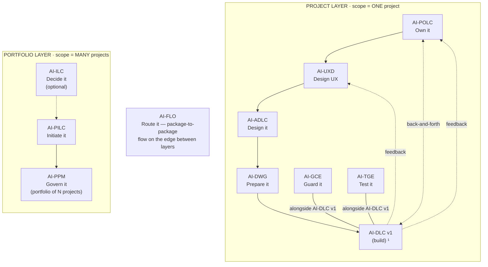
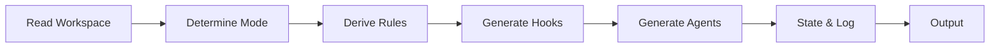

<!-- Copyright (c) 2026 Mohammad Maheri. Licensed under Apache 2.0. See LICENSE. Attribution required - see NOTICE. -->
# AI-GCE Process Overview

## What is AI-GCE?

AI-GCE (AI-Driven Governance & Compliance Engine) is a **full project governance engine** that reads an AI-DWG development workspace — which encodes architecture decisions, team topology, role agreements, session methodology, and operational governance — and produces a tailored compliance enforcement layer: rules, hooks, agents, state tracking, and logging infrastructure.

Unlike AI-PILC and AI-ADLC (interactive lifecycles with stages and gates), AI-GCE is a **derivation engine**: Development Workspace in → Compliance Enforcement Layer out. Unlike AI-DWG (one-shot generator), AI-GCE also has a **continuous presence** — it maintains enforcement as the project evolves through tiers, re-derivations, and brownfield adoption.

---

## The AI-* Family


  ¹ AI-DLC v1 = Amazon's open-source build lifecycle (not ours; we feed it).

AI-GCE sits at the **end of the preparation chain**. It reads what AI-DWG encoded — architecture AND governance — and converts that intent into automated, continuous enforcement. A developer working inside AI-DLC v1 should never manually check project rules. AI-GCE ensures the workspace enforces them automatically.

---

## Four Operating Modes

```
┌─────────────────────────────────────────────────────────────────────────────┐
│                        AI-GCE OPERATING MODES                                │
├─────────────────────────────────────────────────────────────────────────────┤
│                                                                              │
│  MODE 1: FULL GENERATION                                                     │
│  ─────────────────────────                                                   │
│  When: No compliance layer exists yet (first time)                           │
│  Flow: READ → DETERMINE → RULES → HOOKS → AGENTS → STATE → LOG → OUTPUT    │
│  Result: Full compliance engine installed at Tier 1                           │
│                                                                              │
│  MODE 2: RE-DERIVATION                                                       │
│  ──────────────────────                                                      │
│  When: Steering files changed (after AI-DWG reconciliation or manual edit)   │
│  Flow: IDENTIFY CHANGES → MAP IMPACT → REGENERATE AFFECTED → LOG → OUTPUT   │
│  Result: Affected rules/hooks updated; unaffected preserved with customs     │
│                                                                              │
│  MODE 3: BROWNFIELD INCREMENTAL ADOPTION                                     │
│  ─────────────────────────────────────────                                   │
│  When: brownfield-patterns.md exists, no baseline yet established            │
│  Flow: READ → BASELINE SCAN → ACKNOWLEDGE DEBT → GENERATE (new-code-only)   │
│  Result: Existing violations baselined; new code enforced from day 1         │
│                                                                              │
│  MODE 4: TIER ACTIVATION                                                     │
│  ─────────────────────────                                                   │
│  When: Team ready for next compliance tier (readiness criteria met)           │
│  Flow: CHECK READINESS → ASK Qs → ACTIVATE RULES+HOOKS → RE-AUDIT           │
│  Result: New enforcement layer active; score dips then recovers              │
│                                                                              │
└─────────────────────────────────────────────────────────────────────────────┘
```

### Mode Detection (Automatic)

| Condition | Mode Selected |
|-----------|:-------------:|
| `.governance/hooks/` does NOT exist or is empty | Mode 1: Full Generation |
| User says "generate compliance" / "install governance" / "derive rules" | Mode 1: Full Generation |
| `.governance/hooks/` EXISTS with content AND user says "steering changed" / "re-derive" | Mode 2: Re-Derivation |
| AI-DWG sends downstream signal: "Steering files updated: {list}" | Mode 2: Re-Derivation |
| `brownfield-patterns.md` EXISTS AND `.governance/brownfield-baseline.md` does NOT | Mode 3: Brownfield |
| User says "baseline scan" / "brownfield adoption" / "incremental enforcement" | Mode 3: Brownfield |
| `.compliance-state.json` EXISTS AND user says "activate tier" / "next tier" | Mode 4: Tier Activation |
| `nextTierReadiness` criteria all met in state file | Mode 4: Tier Activation |

---

## Discovery & Ownership (Manifest-Driven, Read-Only)

**Discovery:** AI-GCE locates everything via `.governance/workspace-manifest.yaml` (the discovery contract DWG writes) — paths by semantic role (`paths.rules`, `files.definitionOfDone`, `platformTargets`, `storyStyle`), never hardcoded. Legacy fallback (no manifest) → warn + hardcoded scan.

**P1 — Read-only on DWG output:** GCE reads DWG's workspace (`rules/`, `backlog/`, `ux/`, `architecture/`, `info/`) to derive governance. GCE NEVER modifies what DWG created — DWG owns and re-baselines those. GCE writes ONLY its own governance surface (`.governance/` + platform-appropriate hooks/agents).

**P2 — GCE output is AI-agnostic:** GCE's governance layer (rules, hooks, agents, drift) renders per `manifest.platformTargets` — canonical governance + per-platform adapters (see `rendering/governance-rendering.md`).

**Reads canonical, not adapter:** GCE reads `manifest.paths.rules` (canonical `rules/`), NOT `.kiro/steering/` (the Kiro adapter DWG also produced).

---

## The Two-Source Derivation Model

AI-GCE generates rules from TWO sources that combine:

```
┌─────────────────────────────────────────────────────────────────┐
│  SOURCE 1: STEERING FILES (project-specific)                     │
│  ─────────────────────────────────────────                       │
│  What: rules/ + operational docs from AI-DWG            │
│  Covers: Architecture, team topology, methodology, governance    │
│  If silent: Category gets baseline-only rules                    │
│  If contradicts baseline: Steering WINS                          │
├─────────────────────────────────────────────────────────────────┤
│  SOURCE 2: BUILT-IN BASELINE (AI-DLC v1 methodology floor)          │
│  ─────────────────────────────────────────────────               │
│  What: 10 universal rules that apply to ANY AI-DLC v1 project       │
│  Covers: Spec-before-code, never-vibe-code, author≠approver,    │
│          no secrets, migration rollback, append-only log, etc.   │
│  If steering enriches: Baseline PLUS steering-specific detail    │
│  If no steering at all: Baseline stands alone (minimum viable)   │
└─────────────────────────────────────────────────────────────────┘
```

**Resolution rule:** Steering enriches baseline → Steering can override baseline → Silent steering = baseline-only → No steering at all = still get 10 universal rules.

---

## Three-Tier Progressive Compliance

AI-GCE does NOT activate all rules on Day 0. Enforcement grows with the project:

```
┌─────────────────────────────────────────────────────────────────────────┐
│  Tier 1 (Day 0)          Tier 2 (Sprint 2+)       Tier 3 (Pre-Release) │
│  ──────────────          ──────────────────        ─────────────────── │
│  Structure & naming      Governance & roles        Audit & security     │
│  Basic phase gates       Steering quality          Change management    │
│  Session discipline      DevOps rules              Full phase gates     │
│  Init agent active       Code-spec enforcement     Compliance report    │
│                                                                         │
│  Score target: 60-70%    Score target: 80-90%      Score target: 92%+  │
└─────────────────────────────────────────────────────────────────────────┘
```

### Tier Readiness Criteria

| To Activate | Criteria |
|-------------|----------|
| **Tier 2** | Tier 1 active, ≥1 sprint completed, CI pipeline exists, multiple contributors, ≥4 steering files, Tier 1 score ≥ 70% |
| **Tier 3** | Tier 2 active, release candidate exists, deployment target defined, external stakeholders identified, Tier 2 score ≥ 85%, no open 🔴 Critical remediations |

---

## What AI-GCE Reads (Input)

### From AI-DWG Workspace (Primary)

| Category | Steering Files Read | Rule Categories Derived |
|----------|--------------------|-----------------------|
| **Architecture** | workspace-rules, architecture-principles, tech-stack, coding-standards, api-standards, security-rules, module-structure, database-rules, naming-conventions, error-handling, observability-logging, observability-sensitive, domain-context | Architecture compliance, API-first, Security, Data governance, Module boundaries, Naming, Error handling, Logging, Sensitive data, Domain context |
| **Governance** | role-isolation, session-governance, project-governance, git-workflow, testing-strategy, scope-and-risks | Role isolation (GOV-ROLE), Session methodology (GOV-SESSION), Phase gates (PG-*), Sprint governance (GOV-SPRINT), PR governance (GOV-PR), CI/CD gates (GOV-CICD), DevOps (GOV-DEVOPS), Team topology (GOV-TT), Steering quality (GOV-STEER) |
| **Conditional** | multi-tenancy, api-versioning, resilience-standards, observability-tracing, performance-standards, workflow-engine, frontend-standards, event-sourcing, feature-flags, brownfield-patterns | Tenant isolation, API versioning, Resilience, Tracing, Performance, Workflow, Frontend, Event sourcing, Feature flags, Brownfield adoption |

### Operational Documents Read

| Document | Used For |
|----------|---------|
| `PROJECT_INSTRUCTIONS.md` | Project identity, autonomy mode |
| `DEFINITION_OF_DONE.md` | Phase gate criteria, post-task hook |
| `TEAM_AGREEMENTS.md` | PR process, segregation agreements |
| `CODEOWNERS` | Module ownership, GOV-ROLE/GOV-TT rules |
| `docker-compose.yml` | Infrastructure, migration paths |
| Folder structure | Actual module paths for hook file patterns |

---

## What AI-GCE Produces (Output)

All output is installed INTO the development workspace:

| Output | Path | Purpose |
|--------|------|---------|
| **Hooks** (15+) | `.governance/hooks/*.json` | Real-time enforcement on IDE events |
| **Hook Enforcement Guide** | `.governance/hooks/ENFORCEMENT-GUIDE.md` | Tier-based adoption roadmap |
| **Rules** (18+ always, 9 conditional) | `.governance/rules/*.md` | Compliance rule definitions |
| **Audit Agent** | `.governance/agents/compliance-audit-agent.md` | 9-step scoring audit |
| **Init Agent** | `.governance/agents/project-init-agent.md` | 5-question project scaffolding |
| **Compliance Log Schema** | `.governance/compliance-log/` | JSONL event schema + workflows |
| **COMPLIANCE_README** | `.governance/COMPLIANCE_README.md` | Developer-facing guide |
| **State File** | `.compliance-state.json` | Tier tracking, readiness, scores |
| **Dashboard** | `management_framework/dashboards/compliance-dashboard.md` | 30+ variable compliance dashboard |
| **Phase/Role Steering** | `rules/compliance-*.md` | Optional enforcement steering (Step 4b) |
| **Brownfield Baseline** | `.governance/brownfield-baseline.md` | IF brownfield — acknowledged violations |
| **Adoption Plan** | `.governance/incremental-adoption-plan.md` | IF brownfield — progressive timeline |

---

## Four Enforcement Layers

```
LAYER 1: PREVENTIVE (Steering — from AI-DWG, enriched by AI-GCE Step 4b)
  → Kiro reads these BEFORE writing any code → violations never created

LAYER 2: DETECTIVE (Hooks — generated by AI-GCE)
  → Fire on IDE events → catch violations in real-time → warn/block
  → Tier A (fileEdited): security-critical, immediate
  → Tier B (agentStop): advisory, final-state-only

LAYER 3: CORRECTIVE (Audit Agent — generated by AI-GCE)
  → On-demand full scan → scores against all applicable rules
  → Produces report, updates dashboard, tracks MTTR

LAYER 4: TRANSPARENT (Compliance Logging — always active)
  → Every hook writes to compliance-log/ after every fire
  → Append-only JSONL, Git-committed, feeds dashboard + auditors
```

---

## Hook Design Principles

| Principle | Description |
|-----------|-------------|
| **Silent if passing** | If all rules pass, produce no output. Only speak when something is wrong. |
| **Phase-aware** | Check `.compliance-state.json` → only enforce rules applicable to current phase |
| **Every hook logs** | Non-negotiable: compliance logging block at end of every prompt |
| **Debounce-tiered** | Tier A (fileEdited): security-critical. Tier B (agentStop): advisory. |
| **Noise-classified** | 🔴 Essential (never remove) / 🟠 High-value (remove last) / 🟡 Advisory (remove first if noisy) |
| **Technology-specific patterns** | File globs derived from tech-stack.md (*.controller.ts for NestJS, views.py for Django) |
| **Rule ID referenced** | Every hook prompt cites the specific rule IDs it checks |

---

## Adaptive Depth Model

| Depth Level | Workspace Indicators | Enforcement Behavior |
|-------------|---------------------|---------------------|
| **Minimal** | ≤5 steering files, single module | Built-in baseline (10 rules) + core hooks (5) + whatever steering provides |
| **Standard** | 10-19 steering files, moderate module count | Full hook set (8-10), complete rule categories (baseline + enriched), audit agent |
| **Comprehensive** | 20+ steering files, multi-tenant, multi-module, distributed | All hooks + conditional, full rule set, brownfield support, tier model fully active |

Depth is determined automatically from workspace content — not from user configuration.

---

## User Commands (Available at Any Time)

| Command | Effect |
|---------|--------|
| "Generate compliance engine" / "Install governance" | Trigger Mode 1 |
| "Re-derive compliance" / "Steering changed" | Trigger Mode 2 |
| "Brownfield adoption" / "Baseline scan" | Trigger Mode 3 |
| "Activate next tier" / "Activate Tier 2" | Trigger Mode 4 |
| "Run compliance audit" | Full audit scan with scoring |
| "Show compliance score" | Current score + trend |
| "Show tier readiness" | Next tier criteria + blockers |
| "Why does this hook fire?" | Explain rule source + steering derivation |
| "Request exception for {rule}" | Start exception workflow |
| "Show compliance dashboard" | Open management_framework/dashboards/compliance-dashboard.md |

---

## What AI-GCE Does NOT Do

- ❌ Require manual configuration — derives everything from workspace
- ❌ Hardcode any technology — all derived from `tech-stack.md`
- ❌ Generate architecture steering files — that's AI-DWG's job (exception: Step 4b enforcement steering)
- ❌ Make architecture decisions — those were made in AI-ADLC
- ❌ Generate application code
- ❌ Activate all rules on Day 0 — uses 3-tier progressive model
- ❌ Block day 1 on brownfield violations — baselines existing violations
- ❌ Fire advisory hooks on every intermediate save — debounce strategy applies
- ❌ Produce output when nothing is wrong — silence = compliance
- ❌ Only enforce architecture — covers team topology, roles, sessions, sprints, PRs, DevOps, change management

---

## Key Principle: Rules Are Enforceable, Not Aspirational

Generated rules are **concrete verification criteria**, not guidelines:

| ❌ Aspirational (Avoid) | ✅ Enforceable (Do This) |
|------------------------|--------------------------|
| "Code should be reviewed" | "PR author MUST NOT be the PR approver. CODEOWNERS assigns a different reviewer per module." |
| "Tests are important" | "CI pipeline MUST report 0 test failures before merge. Coverage ≥ 80% at PR gate." |
| "Follow naming conventions" | "Controllers: `{Entity}Controller.ts`. Services: `{Entity}Service.ts`. File patterns checked by naming-check hook." |
| "Security matters" | "Every endpoint MUST have `[Authorize]` or explicit `[AllowAnonymous]`. Checked by security-gate-check on fileEdited." |

This makes rules **checkable by hooks**, **scorable by the audit agent**, and **unambiguous for developers**.

---

## Key Principles (Full List)

These 14 numbered principles govern all AI-GCE derivation. They consolidate and extend the "Hook Design Principles" and "Rules Are Enforceable" guidance above into the canonical operating doctrine.

1. **Read before generating.** Never assume file patterns, module paths, or technology. Read `tech-stack.md` and `module-structure.md` first.

2. **Specificity beats generality.** A hook that watches `src/modules/incident/presentation/**/*.controller.ts` is infinitely more useful than one watching `**/*.ts`.

3. **Every architectural rule traces to a steering file.** Rules without a source can't be justified to the team. Governance rules may trace to built-in baseline OR steering file (both are valid sources).

4. **Warn before blocking.** All hooks start in `askAgent` mode. Teams adopt compliance gradually. Build trust before building blockers.

5. **Brownfield is not an edge case.** Most real projects have existing code. Mode 3 is a first-class path, not an afterthought.

6. **Preserve customizations.** Manual rule additions tagged `<!-- custom -->` survive re-derivation. Teams own their compliance engine after it's generated.

7. **The compliance engine must explain itself.** COMPLIANCE_README.md is mandatory — developers must understand why hooks exist and how to respond to them.

8. **Conditional means conditional.** Never generate enforcement for patterns the architecture doesn't use. A team that doesn't use multi-tenancy should never see a tenant-isolation hook.

9. **Re-derivation is not full regeneration.** When one steering file changes, only the affected rules and hooks update. The rest stay as-is, preserving any team customizations.

10. **Score what you measure.** The compliance audit agent tracks a score. That score must be meaningful — based on applicable rules only, not a fixed total.

11. **Silence is compliance.** If all rules pass, produce no output. Hooks that report "everything is fine" on every fire train developers to ignore them. Only speak when something is wrong.

12. **Phase-aware enforcement.** Rules have phases where they become applicable. Don't fire a change-management gate during Setup phase — that's noise, not governance. Check `.compliance-state.json` before enforcing.

13. **Every hook writes to the log.** No exceptions. The compliance log is the audit trail. A hook that fires but doesn't log is invisible to the audit agent, the dashboard, and external auditors.

14. **Respect the context budget.** AI-GCE generates steering files (Step 4b). The total always-inclusion budget is ≤300 lines. If AI-GCE's generated files push over that limit, convert them to fileMatch. The compliance engine must not degrade Kiro's performance.


## Stage Flow (visual)

> The stage sequence at a glance. The table above stays authoritative.


