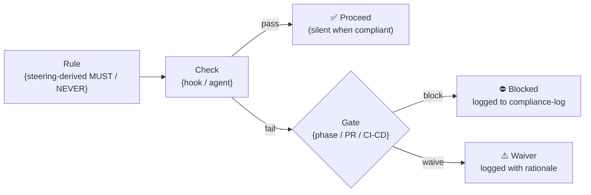

<!-- Copyright (c) 2026 Mohammad Maheri. Licensed under Apache 2.0. See LICENSE. Attribution required - see NOTICE. -->
# GOVERNANCE_INDEX Template + Generation Rule

## Purpose

Defines `.governance/GOVERNANCE_INDEX.md` — the **AI's entry point to discover ALL governance + test machinery** in the workspace. Any AI agent, on any platform, reads this to find GCE's rules/agents/hooks/engine and TGE's test artifacts/agents/engine. It is the human+AI-readable companion to the machine-readable `workspace-manifest.yaml` `governance:` section.

**Output:** `{workspace-root}/.governance/GOVERNANCE_INDEX.md`

**Maintained by:** GCE (creates + owns) and TGE (appends its section). Both update it when they add/remove governance artifacts.

**Grounding:** Layout design Part 3E principle P3 (`.governance/` single home).

---

## Why This Exists

`.governance/` is the single canonical home for all GCE + TGE content (P3). Platform adapters are thin pointers into it. But an AI landing in the workspace needs ONE place that says "here is all the governance, and here's how to use it." That is `GOVERNANCE_INDEX.md`. It makes the consolidated `.governance/` **discoverable** regardless of platform.

---

## Enforcement Flow (visual)

> How a governance rule reaches a gate — rule → check → gate. The machinery tables in the template below stay authoritative (engines, rules, hooks, drift, gates — DFE-extracted for the governance dashboard); this diagram is the human view of the derive-check-enforce pipeline every generated rule follows.



---

## Template

```markdown
<!-- DWG-BASELINE: v{N} (confirmed v{M}) | {projectId} | {timestamp} -->
# Governance Index

> Single entry point to all governance + test machinery in this workspace.
> Home: `.governance/` · Discovery contract: `.governance/workspace-manifest.yaml`
> Platform adapters ({platformTargets}) reference the canonical content below.

## Core Engines (canonical workflows)
| Package | Location | Purpose |
|---------|----------|---------|
| AI-GCE  | `.governance/engine/ai-gce/`  | Compliance & governance derivation + drift detection |
| AI-TGE  | `.governance/engine/ai-tge/`  | Test governance (strategy, register, coverage, debt) |

## Compliance (AI-GCE)
| Artifact | Location |
|----------|----------|
| Compliance rules | `.governance/rules/` |
| Canonical hooks | `.governance/hooks/` |
| Audit trail | `.governance/compliance-log/` |
| State | `.compliance-state.json` |

## Drift Governance (AI-GCE)
| Artifact | Location | Trigger |
|----------|----------|---------|
| Drift register | `.governance/drift-register.md` | `DFT__` |
| Baseline (current) | `.governance/baseline-manifest.yaml` | (DWG-owned) |

## Test Governance (AI-TGE)
| Artifact | Location | Trigger |
|----------|----------|---------|
| Test strategy · register · coverage · debt · defect-log · state | `.governance/test/` | `TGV__` · `CVR__` |

## Agents (all — GCE + TGE)
| Agent | Shortcut | Spec |
|-------|----------|------|
| compliance-audit | `CAA__` | `.governance/agents/compliance-audit-agent.md` |
| drift-detect | `DFT__` | `.governance/agents/drift-detect-agent.md` |
| test-governance | `TGV__` | `.governance/agents/test-governance-agent.md` |
| coverage-review | `CVR__` | `.governance/agents/coverage-review-agent.md` |
| … | … | … |

Registry: `.governance/AGENT_REGISTRY.md` · Guide: `.governance/AGENT-GUIDE.md`

## Platform Wiring
Adapters for {platformTargets} point into `.governance/`:
- Kiro: `.kiro/hooks/*.json` + `.kiro/agents/*.md` → reference `.governance/`
- Claude Code: `.claude/agents/*/` + `settings.json` → reference `.governance/`
- Cursor/Codex/Generic: advisory docs + CI → reference `.governance/`
See `PLATFORM_NOTES.md` for enforcement capability per platform.
```

---

## Generation Rules

1. **GCE creates it** on first generation; **TGE appends** its Test Governance + agents section (marker-guarded, like AGENT_REGISTRY).
2. **Derive from actual content** — list only artifacts that exist (skip absent clusters/agents).
3. **Regenerate on re-derivation** — refresh when governance content changes.
4. **Baseline-stamped** — carries the Approach C stamp (first line).
5. **Points, never duplicates** — an index of locations + triggers, not content.
6. **Platform-aware** — the Platform Wiring section reflects the actual `manifest.platformTargets`.

---

## Interaction

| Related | Relationship |
|---------|--------------|
| `workspace-manifest.yaml` `governance:` | Machine-readable paths; this index is the human/AI-readable companion |
| `rendering/governance-rendering.md` | Adapters that this index describes as "pointing into `.governance/`" |
| TGE (appends) | Adds its Test Governance + agent rows |

---

## Output Validation

- [ ] `.governance/GOVERNANCE_INDEX.md` created by GCE
- [ ] Engines, rules, hooks, drift, test, agents sections present (only for what exists)
- [ ] TGE section appended (marker-guarded) when TGE present
- [ ] Platform Wiring reflects actual `platformTargets`
- [ ] Baseline stamp present; points (no content duplication)
