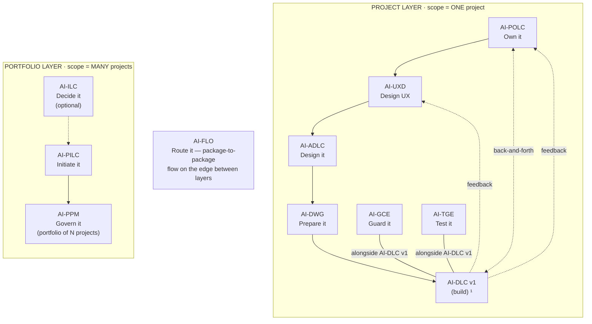

# AI-ILC — AI-Driven Idea Life Cycle

[](./LICENSE)

**Created By:** Maheri — [LinkedIn](https://www.linkedin.com/in/mohammad-maheri-8399565b)
**Version:** 1.0.0
**Package Type:** Interactive workflow (lifecycle)

---

## What It Does

AI-ILC takes a raw idea — from anyone, in any format — through a governed pipeline to a defensible go/no-go decision, then routes the approved idea to the right next step with zero context loss.

**Input:** A raw idea (verbal, one-liner, document, feature request)
**Output:** Approved Idea Brief / Change Request Brief / Feature Brief + Go/No-Go Decision Record

---

## The AI-* PDLC Family

AI-ILC is part of **AIFLC** (AI Full Life Cycle) — the AI-* PDLC Family of injectable workflow packages.


  ¹ AI-DLC v1 = Amazon's open-source build lifecycle (not ours; we feed it).

| Layer | Package | Type | Input | Output |
|-------|---------|------|-------|--------|
| Portfolio | **AI-ILC** ² | Interactive workflow (lifecycle) | Raw idea | Approved Idea Brief / Feature Brief |
| Portfolio | **AI-PILC** | Interactive workflow (lifecycle) | Raw requirement | Project Initiation Package (PIP) |
| Portfolio | **AI-PPM** ³ | Adaptive portfolio engine | Multiple PIPs + Approved Idea Briefs | Portfolio register + cross-project prioritization & governance |
| Edge | **AI-FLO** ³ | Router / orchestration engine | Any package output marker | Routing decision + handoff to next package/layer |
| Project | **AI-POLC** ³ | Interactive workflow (lifecycle) | PIP | Product Backlog Package (PBP) |
| Project | **AI-UXD** ³ | Interactive workflow (lifecycle) | PIP + PBP | UX Design Package (UXP): personas/journeys, IA, user flows, design system + tokens, accessibility baseline |
| Project | **AI-ADLC** | Interactive workflow (lifecycle) | PIP + PBP + UXP | Architecture Package (AP) |
| Project | **AI-DWG** | One-time generator | AP + PBP + UXP | Ready-to-code development workspace (DW) |
| Project | **AI-GCE** | Adaptive governance engine | DW (AI-DWG output) | Compliance enforcement layer |
| Project | **AI-TGE** | Test governance engine | DW / build artifacts | Test governance & quality layer |
| Project | **AI-DLC v1** ¹ | Interactive workflow (lifecycle) | DW + GCE + User Stories (from AI-POLC) | Working Software |

> ¹ **AI-DLC v1** ([awslabs/aidlc-workflows](https://github.com/awslabs/aidlc-workflows)) is NOT our product. Our chain produces the workspace AI-DLC v1 consumes.
> ² **AI-ILC** is an **optional pre-stage** (the funnel before the funnel). The chain still works without it for users who start at AI-PILC. `⇢` denotes the optional link.
> ³ All packages in this table are **built**. AI-PPM (portfolio engine), AI-FLO (router), AI-POLC (product ownership lifecycle), and AI-UXD (UX design lifecycle) were the last four — completed June 2026. Within the Project layer, **AI-POLC, AI-UXD, and AI-ADLC run sequentially** (POLC→UXD→ADLC) — each feeds the next, culminating at AI-DWG which receives all three outputs (AP + PBP + UXP). **AI-GCE and AI-TGE run alongside AI-DLC v1** as continuous quality engines; **AI-POLC ⇄ AI-DLC v1** exchange backlog/acceptance throughout delivery; and **AI-DLC v1 runtime feedback flows back to both AI-UXD and AI-POLC**. Feedback loops (ADLC→POLC cost/risk, ADLC→UXD constraints) provide iterative refinement without changing the forward sequence.

> **AI-DFE** ([Data Fabric Engine](../ai-dfe/)) is a family-scoped **companion** — it gathers data from all packages and distributes structured JSON for dashboards and status roll-ups. It runs alongside the chain rather than as a linear step, so it is not shown as a chain row above.

---

## Features

- **6-stage governed pipeline** — Capture → Shape → Evaluate → Scope → Approve → Route & Handoff
- **Gates at every stage** — human-in-the-loop; you decide, AI advises
- **Consistent evaluation** — 7-criterion scoring with configurable rubric (two-source model)
- **Value analysis** — articulates WHY an idea matters, not just whether it passes
- **Impact-driven routing** — determines whether an approved idea is a new project, a big change, or a small feature
- **Three brief types** — Approved Idea Brief (→ AI-PILC), Change Request Brief (→ AI-PILC change mgmt), Feature Brief (→ AI-DLC v1 backlog)
- **Audit trail from day one** — Decision Log + Idea Register; every choice recorded with rationale
- **Adaptive depth** — Minimal / Standard / Comprehensive based on idea complexity
- **Dynamic stage-based personas** — each stage activates the right expert voice with specialist sub-roles
- **Session continuity** — state file enables resume after interruption
- **Standalone + chain** — delivers full value without the rest of the AI-* family

---

## Who Uses It

- **Anyone** can submit an idea (democratic intake)
- **Innovation / Product / Portfolio Manager** governs the pipeline (evaluation, go/no-go, routing)

---

## How It Routes

```
┌─────────────────────────────────────────────┐
│  Does a project exist for this idea?         │
├──── NO ─────────────────────────────────────▶ AI-PILC (new project)
├──── YES + BIG change ───────────────────────▶ AI-PILC change management
└──── YES + SMALL change ─────────────────────▶ AI-DLC v1 backlog (feature)
```

"Big" = impacts scope, architecture, resources, or stakeholders beyond the team.
"Small" = bounded feature within existing project boundaries.

### Forward-Compatible Routing

Routes are **intent-based, not package-dependent.** AI-ILC writes a semantic intent — not a hard requirement on a specific package being installed. Resolution happens on the consuming side.

| Route Intent | Preferred Target | Fallback (if preferred absent) |
|--------------|-----------------|-------------------------------|
| `new-project` | AI-PILC | Brief is a portable document — usable with any project initiation process |
| `change-request` | AI-PILC change management | Brief is a portable change request — usable with any change control process |
| `feature` | AI-POLC (product backlog) | AI-DLC v1 backlog (or any backlog tool) |

**You are never blocked.** If a target package isn't installed, the brief still works as a standalone document you can feed into whatever process you use. The routing intent is metadata — the brief itself carries all the context.

---

## Activation

**Explicit key:** type `_ILC_` in any prompt to activate AI-ILC unambiguously — even when other AI-* packages share the workspace. The status key `_ACTIVE_` reports which package is currently active. A package switch never happens without your explicit key or confirmation, and any switch is announced on the first line of the response (`Active package: AI-ILC`). See [`../TRIGGER_KEYS_REFERENCE.md`](../TRIGGER_KEYS_REFERENCE.md) for the full family key table.

---

## Installation

### Kiro IDE (Recommended)

See `setup/INSTALL.md` for step-by-step instructions.

### Manual Setup

1. Copy `ai-ilc-rules/` and `ai-ilc-rule-details/` into the uniform home `.aiflc/pdlc/`
2. Copy `session-orchestrator.md` into `.kiro/steering/` (the only always-loaded file; it `Read`s the core on demand)
3. Start a conversation with: "I have an idea"

### Standalone (No AI-* Family)

AI-ILC works independently. You don't need AI-PILC, AI-ADLC, or any other package installed. The briefs it produces are portable documents usable with any methodology.

---

## Usage

1. Open your workspace in your IDE with the AI assistant active
2. Start a chat and say:
   ```
   Using AI-ILC, help me evaluate this idea: [describe your idea or problem]
   ```
3. The workflow guides you through capture → shape → evaluate → scope → approve
4. Answer the structured questions at each stage and approve at the gates
5. On approval, an Approved Idea Brief is produced and routed onward (AI-PILC for projects, AI-POLC for features)

## File Structure

```
ai-ilc/
├── README.md                           ← This file
├── LICENSE                             ← Apache 2.0 with Attribution
├── PLAN.md                             ← Design rationale + build summary
├── ai-ilc-rules/
│   └── core-workflow.md                ← Master orchestration (the heart)
├── ai-ilc-rule-details/
│   ├── common/
│   │   ├── process-overview.md         ← High-level workflow map
│   │   ├── session-continuity.md       ← State file spec + resume logic
│   │   ├── question-format-guide.md    ← How decisions are collected
│   │   ├── content-validation.md       ← Quality rules for outputs
│   │   └── welcome-message.md          ← First-time greeting
│   ├── idea-lifecycle/
│   │   ├── capture.md                  ← Stage 1: Log the idea fast
│   │   ├── shape.md                    ← Stage 2: Structure the problem
│   │   ├── evaluate.md                 ← Stage 3: Score + value analysis
│   │   ├── scope.md                    ← Stage 4: Define boundaries
│   │   ├── approve.md                  ← Stage 5: Go/no-go decision
│   │   └── route-handoff.md            ← Stage 6: Route + produce brief
│   ├── connectors/
│   │   └── portfolio-connector.md      ← Interface stub (v1.0 = single project)
│   └── templates/
│       ├── idea-register.md            ← Portfolio funnel register
│       ├── idea-entry.md               ← Structured idea statement
│       ├── decision-record.md          ← Decision log format
│       ├── approved-idea-brief.md      ← Brief for new projects
│       ├── change-request-brief.md     ← Brief for big changes
│       ├── feature-brief.md            ← Brief for small features
│       └── ilc-state.md                ← State file schema
└── setup/
    └── INSTALL.md                      ← Platform installation guide
```

---

## Tenets

1. **Every idea deserves a fair hearing.** The pipeline evaluates, not dismisses.
2. **Go/No-Go is always explicit.** No idea drifts into limbo — Approved, Parked, or Rejected.
3. **Context carries forward.** The brief carries everything learned — no cold starts for successors.
4. **The user decides, the AI advises.** Recommendations with rationale; the human makes the call.
5. **Audit trail from day one.** Every score, decision, and routing choice is logged.
6. **Standalone is first-class.** Full value without the AI-* family; chain integration is a bonus.
7. **Parked is not dead.** Parked ideas have a revisit date and re-enter when conditions change.

---

## What AI-ILC Does NOT Do

- Initiate projects (that's AI-PILC)
- Design architecture (that's AI-ADLC)
- Write code or tests
- Manage a multi-project portfolio (v1.0 = single project per workspace)
- Perform full feasibility studies (lightweight impact assessment only)

---

## Author

**Maheri** — [LinkedIn](https://www.linkedin.com/in/mohammad-maheri-8399565b)

Builder of the AI-* family of injectable workflow packages. AI-ILC is the optional front door — governing the decision to start before the work begins.

---

*Version 1.0.0 | AI-ILC — AI-Driven Idea Life Cycle*

---

## License

**Apache License 2.0 with Attribution Addendum**

- **Free to use:** Personal, commercial, educational, and organizational use — all permitted
- **Modify and distribute:** Create derivative works, redistribute, sublicense — all permitted
- **Attribution required:** Any distributed product substantially based on this work must include:

> *"Built on AIFLC by Mohammad Maheri — [LinkedIn](https://www.linkedin.com/in/mohammad-maheri-8399565b)"*

- **No warranty:** Provided "AS IS" without warranties of any kind

See `LICENSE` and `NOTICE` in this directory for full terms.

**Copyright:** © 2026 Mohammad Maheri

---

*Part of [AIFLC](../README.md) — the AI-* PDLC Family*
