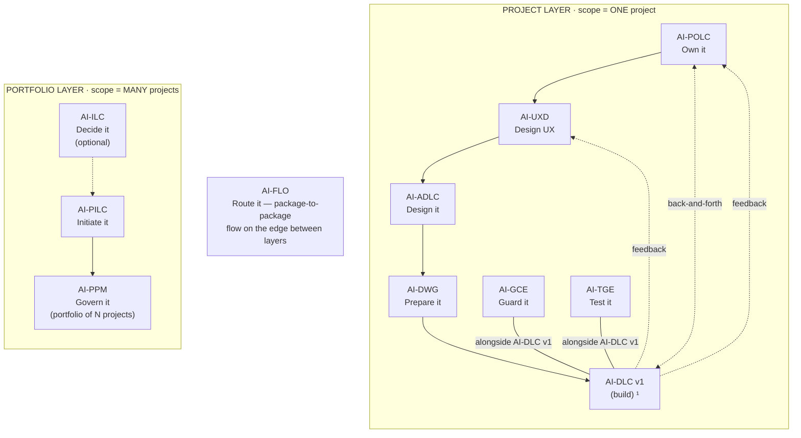
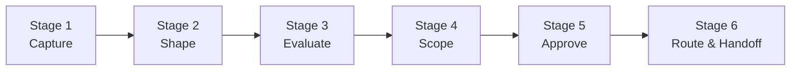

<!-- Copyright (c) 2026 Mohammad Maheri. Licensed under Apache 2.0. See LICENSE. Attribution required - see NOTICE. -->
# AI-ILC — Process Overview

**Purpose:** High-level map of the entire AI-ILC workflow. Reference this to understand where you are, what comes next, and how the stages connect.

---

## The AI-* Family


  ¹ AI-DLC v1 = Amazon's open-source build lifecycle (not ours; we feed it).

| Layer | Package | Type | Input | Output |
|-------|---------|------|-------|--------|
| Portfolio | **AI-ILC** ² | Interactive workflow (lifecycle) | Raw idea | Approved Idea Brief / Feature Brief |
| Portfolio | **AI-PILC** | Interactive workflow (lifecycle) | Raw requirement | Project Initiation Package (PIP) |
| Portfolio | **AI-PPM** ³ | Adaptive portfolio engine | Multiple PIPs + Approved Idea Briefs | Portfolio register + cross-project prioritization & governance |
| Edge | **AI-FLO** ³ | Router / orchestration engine | Any package output marker | Routing decision + handoff to next package/layer |
| Project | **AI-POLC** ³ | Interactive workflow (lifecycle) | PIP | Product Backlog Package (PBP) |
| Project | **AI-UXD** ³ | Interactive workflow (lifecycle) | PIP + PBP | UX Design Package (UXP): personas/journeys, IA, user flows, design system + tokens, accessibility baseline |
| Project | **AI-ADLC** | Interactive workflow (lifecycle) | PIP + PBP + UXP | Architecture Package (AP) |
| Project | **AI-DWG** | One-time generator | AP + PBP + UXP | Ready-to-code development workspace (DW) |
| Project | **AI-GCE** | Adaptive governance engine | DW (AI-DWG output) | Compliance enforcement layer |
| Project | **AI-TGE** | Test governance engine | DW / build artifacts | Test governance & quality layer |
| Project | **AI-DLC v1** ¹ | Interactive workflow (lifecycle) | DW + GCE + User Stories (from AI-POLC) | Working Software |

> ¹ **AI-DLC v1** ([awslabs/aidlc-workflows](https://github.com/awslabs/aidlc-workflows)) is NOT our product. Our chain produces the workspace AI-DLC v1 consumes.
> ² **AI-ILC** is an **optional pre-stage** (the funnel before the funnel). The chain still works without it for users who start at AI-PILC. `⇢` denotes the optional link.
> ³ All packages in this table are **built**. AI-PPM (portfolio engine), AI-FLO (router), AI-POLC (product ownership lifecycle), and AI-UXD (UX design lifecycle) were the last four — completed June 2026. Within the Project layer, **AI-POLC, AI-UXD, and AI-ADLC run sequentially** (POLC→UXD→ADLC) — each feeds the next, culminating at AI-DWG which receives all three outputs (AP + PBP + UXP). **AI-GCE and AI-TGE run alongside AI-DLC v1** as continuous quality engines; **AI-POLC ⇄ AI-DLC v1** exchange backlog/acceptance throughout delivery; and **AI-DLC v1 runtime feedback flows back to both AI-UXD and AI-POLC**. Feedback loops (ADLC→POLC cost/risk, ADLC→UXD constraints) provide iterative refinement without changing the forward sequence.

---

## Workflow at a Glance

```
┌──────────┐    ┌──────────┐    ┌──────────┐    ┌──────────┐    ┌──────────┐    ┌──────────────┐
│ 1.CAPTURE│───▶│ 2. SHAPE │───▶│3.EVALUATE│───▶│ 4. SCOPE │───▶│5. APPROVE│───▶│6. ROUTE &    │
│          │    │          │    │          │    │          │    │          │    │   HANDOFF    │
│ Log idea │    │ Structure│    │ Score &  │    │ Boundary │    │ Go/No-Go │    │ Where does   │
│ fast     │    │ the      │    │ value    │    │ & effort │    │ decision │    │ it go?       │
│          │    │ problem  │    │ analysis │    │          │    │          │    │              │
└──────────┘    └──────────┘    └──────────┘    └──────────┘    └──────────┘    └──────────────┘
     │               │               │               │               │               │
     ▼               ▼               ▼               ▼               ▼               ▼
  Register        Idea            Score +        Scope          Decision         Brief +
  entry +         Statement       Value          definition     Record           Route
  state file                      Analysis                      (always)         (conditional)
```

---

## Stage Summary Table

| # | Stage | Always/Conditional | Gate | Output |
|---|-------|:------------------:|------|--------|
| 1 | **Capture** | Always | User confirms capture | Idea registered + state file created |
| 2 | **Shape** | Always | User approves structured statement | Idea Statement (working doc) |
| 3 | **Evaluate** | Always | User confirms Proceed / Park / Reject | Score + Value Analysis |
| 4 | **Scope** | Conditional (if Evaluate = Proceed) | User agrees on scope | Boundary + effort estimate |
| 5 | **Approve** | Conditional (if Scoped) | Explicit go/no-go | Go/No-Go Decision Record |
| 6 | **Route & Handoff** | Conditional (if Approved) | User confirms route | Approved Idea Brief / Change Request Brief / Feature Brief |

---

## Depth Model

AI-ILC adapts its depth to the idea's complexity:

| Level | When | Behavior |
|-------|------|----------|
| **Minimal** | Idea is clear, small scope, low risk | Fast pipeline: 3 shaping questions, quick score, lightweight scope, rapid handoff |
| **Standard** | Normal complexity, some ambiguity | Full pipeline: structured shaping, 7-criterion scoring + value analysis, full scope |
| **Comprehensive** | High stakes, ambiguous, multi-stakeholder | Deep pipeline: extensive shaping with prior art, competitive analysis, detailed value case, explicit trade-offs |

Depth is **recommended at Capture** (based on clarity + scale signals) and **confirmed by the user**. It can be adjusted at any stage gate.

---

## Routing Model (Stage 6)

After approval, an **impact-driven** routing determines the handoff destination:

```
┌─────────────────────────────────────────────────────────────┐
│                    ROUTING DECISION                           │
├─────────────────────────────────────────────────────────────┤
│                                                              │
│  Q1: Does a project exist for this idea?                     │
│      ├── NO  → Route: NEW PROJECT (→ AI-PILC)               │
│      └── YES → Q2: Is the impact BIG?                        │
│                    (changes scope, criteria, or architecture) │
│                    ├── YES → Route: CHANGE REQUEST            │
│                    │         (→ AI-PILC change management)    │
│                    └── NO  → Route: FEATURE BACKLOG           │
│                              (→ AI-DLC v1 backlog)               │
│                                                              │
└─────────────────────────────────────────────────────────────┘
```

| Route | Brief Produced | Destination |
|-------|---------------|-------------|
| New Project | `{NNN}-{slug}/..._Approved_Idea_Brief.md` | AI-PILC (initiates a new project) |
| Change Request | `{NNN}-{slug}/..._Change_Request_Brief.md` | AI-PILC change management (on existing project) |
| Feature Backlog | `{NNN}-{slug}/..._Feature_Brief.md` | AI-DLC v1 backlog (small feature, direct to build queue) |

> Briefs are written into the idea's per-idea subfolder (`{NNN}-{idea-slug}/`); shared state/register/spine stay flat at `{output_root}/`. See `core-workflow.md` → "MANDATORY: Output Folder Structure".

---

## Interaction Model

**Human-in-the-loop at every gate.** The AI advises; the user decides.

| Interaction Pattern | Description |
|-------------------|-------------|
| **Structured questions** | Formatted per `question-format-guide.md` — always with recommendation + rationale |
| **Stage gates** | User must approve before moving to next stage |
| **Depth adjustment** | User can increase or decrease depth at any gate |
| **Early exit** | User can Park or Reject at any Evaluate/Approve gate — clean close with audit trail |
| **Resume** | If interrupted, state file captures exactly where to continue (see `session-continuity.md`) |

---

## User Commands

At any point during the workflow, the user can say:

| Command | Effect |
|---------|--------|
| "Capture a new idea" | Start Stage 1 (new idea entry) |
| "Shape this idea" | Continue from Stage 2 if captured |
| "Evaluate" | Jump to scoring (if shaped) |
| "What's the status?" | Show current stage, pending decisions, depth level |
| "Park this" | Move idea to Parked status (with revisit date), close workflow cleanly |
| "Reject this" | Move idea to Rejected status (with rationale), close workflow cleanly |
| "Change depth to {level}" | Adjust depth level for remaining stages |
| "Resume" | Load state file and continue from last completed stage |
| "Show the register" | Display the Idea Register (all ideas, all statuses) |

---

## Dynamic Persona Model

No fixed persona for the whole workflow. Each stage activates the right expert voice with a specialist sub-role lens:

| Stage | Lead Primary | Sub-Role Layered | Why |
|-------|-------------|-----------------|-----|
| Capture | `#persona-product-manager` | — | Fast capture, no specialist needed |
| Shape | `#persona-product-manager` | `#persona-subrole-business-analyst` | Requirements decomposition, ambiguity detection |
| Evaluate | `#persona-product-manager` | `#persona-subrole-financial-analyst` | Value scoring, investment framing |
| Scope | `#persona-process-designer` | `#persona-subrole-resource-planner` | Boundary setting, effort estimation |
| Approve | `#persona-product-manager` | `#persona-subrole-risk-analyst` | Risk-aware go/no-go challenge |
| Route & Handoff | `#persona-product-manager` | `#persona-subrole-change-manager` | Impact assessment (big vs. small change) |

At the **Approve** and **Route** stages, the idea's subject domain may override the default sub-role with a domain-specific one (e.g., if the idea is about security, `#persona-subrole-security-architect` layers instead). Resolution: primary + one sub-role max per stage.

---

## Registers

| Register | Purpose | Created At |
|----------|---------|-----------|
| **Idea Register** | Portfolio funnel view — every idea's status, score, decision, dates | First Capture |
| **Decision Log** | Audit trail — every go/no-go, routing decision, park/reject rationale | First Approve |

---

## What AI-ILC Does NOT Do

- Does NOT initiate projects (that's AI-PILC)
- Does NOT design architecture (that's AI-ADLC)
- Does NOT write code or tests
- Does NOT manage a multi-project portfolio (v1.0 = single project per workspace)
- Does NOT perform full feasibility studies (lightweight impact assessment only — AI-PILC handles deep analysis)

---

## Key Principles

1. **Every idea deserves a fair hearing.** The pipeline exists to evaluate, not to dismiss. Even rejected ideas get a recorded rationale.
2. **Go/No-Go is always explicit.** Never let an idea drift into limbo. It is Approved, Parked (with a revisit date), or Rejected (with rationale). All three are valid, governed outcomes.
3. **Context carries forward.** The brief handed to the successor contains everything learned during shaping, evaluation, and scoping. No "cold start" for the next step.
4. **The user decides, the AI advises.** Every gate presents a recommendation with rationale — but the user makes the call.
5. **Audit trail from day one.** Every score, every decision, every routing choice is logged. This is governance, not a suggestion box.
6. **Standalone is first-class.** This package delivers full value without the rest of the AI-* family. The chain integration is a bonus, not a requirement.
7. **Dynamic expertise.** The right persona leads each stage; the idea's domain pulls in the right support. No one-size-fits-all voice.
8. **Parked is not dead.** Parked ideas have a revisit date and stay in the register. They re-enter the pipeline when conditions change.

## Checkpoint Enforcement

- **Never pass a gate without explicit user approval.** Each stage gate requires a confirmed decision before proceeding.
- **Update the state file (`ilc-state.md`) immediately after EVERY stage completion** — current stage, completed stages, score, route, pending decisions.
- **Log every decision** (go/no-go, routing, park/reject rationale) in the Decision Log in real-time, with ISO-8601 timestamps — never batched.

---

*Version: 1.0.0 | Part of AI-ILC — AI-Driven Idea Life Cycle*


## Stage Flow (visual)

> The stage sequence at a glance. The table above stays authoritative.


