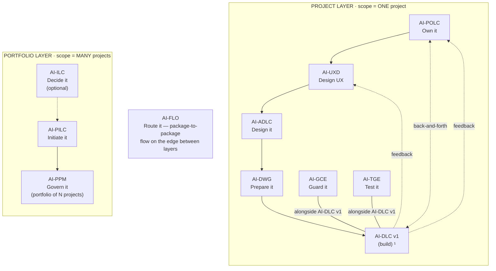

# AI-PILC (AI-Driven Project Initiation Life Cycle)

[](./LICENSE)

**Version:** 1.0.0
**Created By:** Maheri — [LinkedIn](https://www.linkedin.com/in/mohammad-maheri-8399565b)
**License:** Apache 2.0 with Attribution Addendum — See `LICENSE` and `NOTICE`

---

## The AI-* PDLC Family

AI-PILC is part of **AIFLC** (AI Full Life Cycle) — the AI-* PDLC Family of injectable workflow packages.


  ¹ AI-DLC v1 = Amazon's open-source build lifecycle (not ours; we feed it).

| Layer | Package | Type | Input | Output |
|-------|---------|------|-------|--------|
| Portfolio | **AI-ILC** ² | Interactive workflow (lifecycle) | Raw idea | Approved Idea Brief / Feature Brief |
| Portfolio | **AI-PILC** | Interactive workflow (lifecycle) | Raw requirement | Project Initiation Package (PIP) |
| Portfolio | **AI-PPM** ³ | Adaptive portfolio engine | Multiple PIPs + Approved Idea Briefs | Portfolio register + cross-project prioritization & governance |
| Edge | **AI-FLO** ³ | Router / orchestration engine | Any package output marker | Routing decision + handoff to next package/layer |
| Project | **AI-POLC** ³ | Interactive workflow (lifecycle) | PIP | Product Backlog Package (PBP) |
| Project | **AI-UXD** ³ | Interactive workflow (lifecycle) | PIP + PBP | UX Design Package (UXP): personas/journeys, IA, user flows, design system + tokens, accessibility baseline |
| Project | **AI-ADLC** | Interactive workflow (lifecycle) | PIP + PBP + UXP | Architecture Package (AP) |
| Project | **AI-DWG** | One-time generator | AP + PBP + UXP | Ready-to-code development workspace (DW) |
| Project | **AI-GCE** | Adaptive governance engine | DW (AI-DWG output) | Compliance enforcement layer |
| Project | **AI-TGE** | Test governance engine | DW / build artifacts | Test governance & quality layer |
| Project | **AI-DLC v1** ¹ | Interactive workflow (lifecycle) | DW + GCE + User Stories (from AI-POLC) | Working Software |

> ¹ **AI-DLC v1** ([awslabs/aidlc-workflows](https://github.com/awslabs/aidlc-workflows)) is NOT our product. Our chain produces the workspace AI-DLC v1 consumes.
> ² **AI-ILC** is an **optional pre-stage** (the funnel before the funnel). The chain still works without it for users who start at AI-PILC. `⇢` denotes the optional link.
> ³ All packages in this table are **built**. AI-PPM (portfolio engine), AI-FLO (router), AI-POLC (product ownership lifecycle), and AI-UXD (UX design lifecycle) were the last four — completed June 2026. Within the Project layer, **AI-POLC, AI-UXD, and AI-ADLC run sequentially** (POLC→UXD→ADLC) — each feeds the next, culminating at AI-DWG which receives all three outputs (AP + PBP + UXP). **AI-GCE and AI-TGE run alongside AI-DLC v1** as continuous quality engines; **AI-POLC ⇄ AI-DLC v1** exchange backlog/acceptance throughout delivery; and **AI-DLC v1 runtime feedback flows back to both AI-UXD and AI-POLC**. Feedback loops (ADLC→POLC cost/risk, ADLC→UXD constraints) provide iterative refinement without changing the forward sequence.

> **AI-DFE** ([Data Fabric Engine](../ai-dfe/)) is a family-scoped **companion** — it gathers data from all packages and distributes structured JSON for dashboards and status roll-ups. It runs alongside the chain rather than as a linear step, so it is not shown as a chain row above.

---

## What is AI-PILC?

AI-PILC is an injectable workflow that guides an AI assistant and a human user through the complete process of initiating a project — from receiving a raw requirement to delivering a professional, execution-ready **Project Initiation Package (PIP)**.

It is designed as a general-purpose, reusable framework with zero project-specific content. Drop it into any workspace, point it at a requirement, and it will walk you through 6 phases and 16 stages of structured project initiation — producing industry-standard, governance-grade deliverables at every step.

---

## Key Features

| Feature | Description |
|---------|-------------|
| **Injectable** | Drop into any workspace and activate — no project-specific setup |
| **Interactive** | Human-in-the-loop at every gate; you decide, AI recommends |
| **Adaptive** | Depth adjusts to project complexity (Minimal / Standard / Comprehensive) |
| **Resumable** | State file tracks progress; resume across sessions seamlessly |
| **Platform-Agnostic** | Works with Kiro, Amazon Q Developer, Cursor, Cline, Claude Code, GitHub Copilot |
| **Template-Based** | Consistent, professional deliverables via reusable templates |
| **Register-Driven** | Management registers (decisions, changes, risks, actions, assumptions, lessons) maintained automatically |
| **Source-Driven** | Never invents scope; always references the user's input document |

---

## What It Produces

A complete Project Initiation Package containing:

- Requirement Intake Form
- Requirements Analysis Report
- Clarification Questionnaire & Responses
- Feasibility Assessment & Prioritization
- Business Case
- Project Charter
- Stakeholder Register
- Scope Statement & WBS
- Resource & Budget Plan
- Risk Register
- RACI Matrix & Governance Plan
- Kickoff Agenda & Materials
- 6 Management Registers (Decision, Change, Issue, Action, Assumptions, Lessons)
- Package README (summary and handoff guide)

---

## The Six Phases

```
🔵 INCEPTION        →  Receive, validate, structure the requirement
🟠 ASSESSMENT       →  Analyze feasibility, resolve gaps, prioritize
🟡 JUSTIFICATION    →  Build the investment case
🟣 AUTHORIZATION    →  Formalize authority and boundaries
🟢 PLANNING         →  Plan scope, resources, risks, governance
🚀 MOBILIZATION     →  Prepare kickoff, assemble final package
```

---

## Activation

**Explicit key:** type `_PILC_` in any prompt to activate AI-PILC unambiguously — even when other AI-* packages share the workspace. The status key `_ACTIVE_` reports which package is currently active. A package switch never happens without your explicit key or confirmation, and any switch is announced on the first line of the response (`Active package: AI-PILC`). See [`../TRIGGER_KEYS_REFERENCE.md`](../TRIGGER_KEYS_REFERENCE.md) for the full family key table.

---

## Installation

1. Download or clone this repository
2. The package contains two key directories:
   - `ai-pilc-rules/` — the core workflow (always loaded by the AI)
   - `ai-pilc-rule-details/` — phase details and templates (loaded on demand)
3. Follow the platform-specific instructions in [setup/INSTALL.md](./setup/INSTALL.md)

---

## Output Directory Structure

AI-PILC outputs into the standard multi-project layout. Each project gets its own folder under `projects/`, with PILC deliverables in a `pip/` subfolder and the shared governance spine at the project root:

```
pdlc-ws/projects/
├── PROJECTS.md                          ← workspace registry (active pointer ★)
└── PRJ-{ABBREV}-{slug}/                  ← one project
    ├── management_framework/             ← shared governance spine (Decision Log, etc.)
    └── pip/                              ← AI-PILC output
        ├── pilc-state.md                 ← progress marker
        ├── 01_Requirement_Submission/
        ├── 02_Screening_Prioritization/
        ├── 03_Business_Case/
        ├── 04_Project_Charter/
        ├── 05_Stakeholder_Management/
        ├── 06_Scope_Planning/
        ├── 07_Resource_Budget/
        ├── 08_Risk_Management/
        ├── 09_Governance_Communication/
        └── 10_Project_Kickoff/
```

> The `projects/` structure is always-on — solo, single-project, and multi-project alike. See `OUTPUT_AND_STATE_CONTRACT.md` for full details.

---

## Usage

1. Open your workspace in your IDE with the AI assistant active
2. Start a chat and say:

   ```
   Using AI-PILC, initiate a project from this requirement: [provide source]
   ```

3. The workflow activates and guides you from there
4. Answer structured questions when asked
5. Review and approve each deliverable at gates
6. All artifacts are generated in your configured output folder

---

## Adaptive Depth

AI-PILC automatically calibrates its depth based on your project's complexity:

| Depth | When Applied | Deliverable Detail |
|-------|-------------|-------------------|
| **Minimal** | Small scope, clear requirements, low risk | Streamlined; fewer interaction cycles |
| **Standard** | Normal complexity, some gaps to resolve | Full deliverable set; standard gates |
| **Comprehensive** | High complexity, many unknowns, large investment | Detailed analysis; multiple iterations |

You can override the depth at any time: "Change depth to Comprehensive"

---

## Session Continuity

AI-PILC supports multi-session workflows:

- Progress is saved in `pilc-state.md` after every stage
- On new session start, the workflow detects existing state and offers to resume
- You can safely close and return at any time
- All decisions and context are preserved

---

## File Structure

```
ai-pilc/
├── README.md                          ← This file
├── ai-pilc-rules/
│   └── core-workflow.md               ← Master orchestration (always loaded)
└── ai-pilc-rule-details/
    ├── common/
    │   ├── process-overview.md        ← High-level process map
    │   ├── session-continuity.md      ← Resume/state management rules
    │   ├── question-format-guide.md   ← Structured question formatting
    │   ├── content-validation.md      ← Deliverable quality checks
    │   └── welcome-message.md         ← One-time welcome display
    ├── inception/
    │   ├── workspace-detection.md     ← Stage 1: Setup
    │   ├── source-ingestion.md        ← Stage 2: Receive requirements
    │   └── requirement-structuring.md ← Stage 3: Structure into Intake Form
    ├── assessment/
    │   ├── requirements-analysis.md   ← Stage 4: Gap/ambiguity analysis
    │   ├── clarification-cycle.md     ← Stage 5: Structured Q&A
    │   ├── feasibility-assessment.md  ← Stage 6: 4-dimension scoring
    │   └── prioritization.md          ← Stage 7: Strategic alignment + MoSCoW
    ├── justification/
    │   └── business-case.md           ← Stage 8: Investment case
    ├── authorization/
    │   └── project-charter.md         ← Stage 9: Formal authority
    ├── planning/
    │   ├── stakeholder-management.md  ← Stage 10: Stakeholder register
    │   ├── scope-definition.md        ← Stage 11: WBS + boundaries
    │   ├── resource-budget.md         ← Stage 12: Team + costs
    │   ├── risk-management.md         ← Stage 13: Risk register
    │   └── governance-communication.md← Stage 14: RACI + comms
    ├── mobilization/
    │   ├── kickoff-preparation.md     ← Stage 15: Kickoff agenda
    │   └── package-assembly.md        ← Stage 16: Final consolidation
    └── templates/                     ← Reusable deliverable skeletons
        ├── requirement-intake-form.md
        ├── feasibility-assessment.md
        ├── business-case.md
        ├── project-charter.md
        ├── stakeholder-register.md
        ├── scope-statement.md
        ├── resource-plan.md
        ├── risk-register.md
        ├── raci-matrix.md
        ├── kickoff-agenda.md
        ├── decision-log.md
        ├── change-log.md
        ├── issue-log.md
        ├── action-items.md
        ├── assumptions-dependencies.md
        └── lessons-learned.md
```

---

## Tenets

1. **Human in the loop** — AI recommends; human decides. No autonomous progression past gates.
2. **Source-driven** — Never invent scope. Always reference the user's input.
3. **Adaptive** — Scale rigor to complexity. Don't over-process simple projects.
4. **Resumable** — Work across sessions without losing progress.
5. **Auditable** — Every decision logged with rationale. Full traceability.
6. **Agnostic** — No dependency on specific IDE, model, or vendor.
7. **Professional** — Industry-standard governance outputs. PMO-ready quality.

---

## Methodology Alignment

AI-PILC draws from established project-governance discipline:

- **Principles, performance domains, and process groups** — the standard vocabulary of modern project management
- **Business case-driven, stage-gated governance** — investment justification before authorization, staged delivery with management by exception
- **Service management context** — where applicable, for service-oriented initiatives

---

## Differences from AI-DLC v1

| Aspect | AI-DLC v1 | AI-PILC |
|--------|--------|---------|
| **Domain** | Software development | Project initiation (pre-execution) |
| **Output** | Code + documentation | Project management deliverables |
| **Phases** | Inception → Construction → Operations | Inception → Assessment → Justification → Authorization → Planning → Mobilization |
| **End State** | Working software | Execution-ready Project Initiation Package |
| **Audience** | Developers | Project Managers, PMOs, Business Analysts, Sponsors |

---

## Contributing

Contributions welcome. When modifying:

- Core workflow changes affect all users — test thoroughly
- Phase detail files can be enhanced independently
- Templates can be customized per organization
- Always maintain zero project-specific content in the framework

---

## Author

Created by **Maheri** — [LinkedIn](https://www.linkedin.com/in/mohammad-maheri-8399565b)

Conceptualized and designed based on real-world PPM/PMO practice, combining structured project governance methodology with AI-driven interactive workflows.

---

## License

**Apache License 2.0 with Attribution Addendum**

- **Free to use:** Personal, commercial, educational, and organizational use — all permitted
- **Modify and distribute:** Create derivative works, redistribute, sublicense — all permitted
- **Attribution required:** Any distributed product substantially based on this work must include:

> *"Built on AIFLC by Mohammad Maheri — [LinkedIn](https://www.linkedin.com/in/mohammad-maheri-8399565b)"*

- **No warranty:** Provided "AS IS" without warranties of any kind

See `LICENSE` and `NOTICE` in this directory for full terms.

**Copyright:** © 2026 Mohammad Maheri

> **Note:** AI-DLC v1 (Development Life Cycle) is NOT part of the AI-* Family — it is a separate AWS product ([awslabs/aidlc-workflows](https://github.com/awslabs/aidlc-workflows)) licensed under MIT-0.

---

*Part of [AIFLC](../README.md) — the AI-* PDLC Family*
