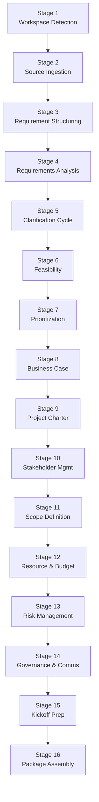

<!-- Copyright (c) 2026 Mohammad Maheri. Licensed under Apache 2.0. See LICENSE. Attribution required - see NOTICE. -->
# AI-PILC Process Overview

## What is AI-PILC?

AI-PILC (AI-Driven Project Initiation Life Cycle) is a structured, interactive workflow that guides an AI assistant and a human user through the complete process of initiating a project — from receiving a raw requirement to delivering a professional, ready-to-execute Project Initiation Package.

---

## The Six Phases

```
┌─────────────────────────────────────────────────────────────────────────────┐
│                        AI-PILC WORKFLOW                                       │
├─────────────────────────────────────────────────────────────────────────────┤
│                                                                              │
│  🔵 INCEPTION        →  Receive, validate, structure the requirement         │
│  🟠 ASSESSMENT       →  Analyze feasibility, resolve gaps, prioritize        │
│  🟡 JUSTIFICATION    →  Build the investment case                            │
│  🟣 AUTHORIZATION    →  Formalize authority and boundaries                   │
│  🟢 PLANNING         →  Plan scope, resources, risks, governance             │
│  🚀 MOBILIZATION     →  Prepare kickoff, assemble final package              │
│                                                                              │
├─────────────────────────────────────────────────────────────────────────────┤
│  ↕ THROUGHOUT: Management registers updated continuously                     │
└─────────────────────────────────────────────────────────────────────────────┘
```

---

## Phase-Stage Mapping

| Phase | Stage # | Stage Name | Execution | Key Output |
|-------|:-------:|------------|:---------:|------------|
| 🔵 INCEPTION | 1 | Workspace Detection | ALWAYS | State file, folder structure |
| | 2 | Source Document Ingestion | ALWAYS | Validated source, complexity assessment |
| | 3 | Requirement Structuring | ALWAYS | Requirement Intake Form |
| 🟠 ASSESSMENT | 4 | Requirements Analysis | ALWAYS (adaptive depth) | Analysis Report |
| | 5 | Clarification Cycle | ADAPTIVE | Questionnaire & Responses |
| | 6 | Feasibility Assessment | ALWAYS | Feasibility Score & Rating |
| | 7 | Prioritization | ALWAYS | MoSCoW + Priority Rank |
| 🟡 JUSTIFICATION | 8 | Business Case Development | ALWAYS | Business Case |
| 🟣 AUTHORIZATION | 9 | Project Charter | ALWAYS | Signed Charter (draft) |
| 🟢 PLANNING | 10 | Stakeholder Management | ALWAYS | Stakeholder Register |
| | 11 | Scope Definition | ALWAYS | Scope Statement & WBS |
| | 12 | Resource & Budget Planning | ALWAYS | Resource Plan & ROM Budget |
| | 13 | Risk Management | ALWAYS | Risk Register |
| | 14 | Governance & Communication | ALWAYS | RACI Matrix & Comms Plan |
| 🚀 MOBILIZATION | 15 | Kickoff Preparation | ALWAYS | Kickoff Agenda & Deck Structure |
| | 16 | Package Assembly | ALWAYS | Final PIP + README |

---

## Adaptive Depth Model

The workflow does NOT apply the same rigor to every project. Depth is determined at Stage 2 (Source Ingestion) and can be adjusted at any point.

| Depth Level | When Applied | Behavior |
|-------------|-------------|----------|
| **Minimal** | Clear source, small scope, low complexity, single stakeholder group | Streamlined deliverables; some stages produce brief outputs; fewer interaction cycles |
| **Standard** | Normal complexity, some gaps to resolve, multiple stakeholders, moderate risk | Full deliverable set; standard interaction at gates; complete register tracking |
| **Comprehensive** | High complexity, many unknowns, large stakeholder field, regulatory/compliance concerns, high investment | Detailed analysis with multiple iteration cycles; extended clarification; exhaustive risk treatment |

**Depth indicators (assessed automatically):**

| Factor | Minimal | Standard | Comprehensive |
|--------|---------|----------|---------------|
| Estimated team size | <5 FTE | 5-20 FTE | >20 FTE |
| Duration | <3 months | 3-12 months | >12 months |
| Stakeholder count | 1-3 | 4-10 | >10 |
| Technology risk | Low (known stack) | Medium (some new) | High (novel/unproven) |
| Regulatory exposure | None | Some | Significant |
| Budget range | <$100K | $100K-$1M | >$1M |
| Integration points | 0-2 | 3-5 | >5 |

---

## Interaction Model

### Gate Behavior

Every phase has at least one gate where the user must explicitly approve before proceeding:

```
[AI produces deliverable] → [Presents to user] → [User reviews]
                                                       │
                                          ┌────────────┼────────────┐
                                          ▼            ▼            ▼
                                      Approve     Request       Stop/
                                    (proceed)    Changes       Pause
                                          │            │            │
                                          ▼            ▼            ▼
                                    Next Stage    Iterate     Save State
```

### Question Format

When the workflow needs a decision from the user, it presents structured options:

- Multiple-choice with lettered options (a, b, c, d)
- A recommended answer with professional rationale
- Space for user's decision
- All decisions logged immediately in the Decision Log

### User Commands (Available at Any Time)

| Command | Effect |
|---------|--------|
| "Skip this stage" | Logs skip decision; moves to next stage |
| "Go back to stage {n}" | Returns to specified stage for revision |
| "Show progress" | Displays current state summary |
| "Change depth to {level}" | Adjusts remaining workflow depth |
| "Stop here" | Saves state; generates partial package report |
| "Show decisions" | Displays Decision Log summary |
| "Show risks" | Displays Risk Register summary |
| "What's next?" | Shows upcoming stages and expected effort |

---

## Management Registers

Six registers are maintained continuously throughout all phases:

| Register | Purpose | Updated When |
|----------|---------|--------------|
| Decision Log | Records all significant decisions with rationale | Every decision point |
| Change Log | Tracks changes to scope, approach, or timeline | When adjustments are made |
| Issue Log | Logs problems or blockers encountered | When issues arise |
| Action Items | Tasks requiring human follow-up | When actions are identified |
| Assumptions & Dependencies | Captures what's assumed true and what's needed | At every analysis stage |
| Lessons Learned | Insights and improvements | At each phase gate |

**Numbering:** Entries are project-qualified and sequentially numbered within each phase (`PILC-{ABBREV}-D-1`, `PILC-{ABBREV}-C-1`, `PILC-{ABBREV}-I-1`, `PILC-{ABBREV}-A-1`, `PILC-{ABBREV}-AD-1`, `PILC-{ABBREV}-L-1`) and never deleted — only status-updated. (Per `MANAGEMENT_FRAMEWORK_CONTRACT.md` v1.2.0.)

---

## Session Continuity

The workflow supports multi-session execution:

1. **State file** (`pilc-state.md`) persists all progress between sessions
2. On session start, the workflow checks for existing state and offers to resume
3. All context needed to resume is stored in the state file (project name, current stage, decisions made, configuration choices)
4. Users can safely close and return at any time without losing progress

---

## Quality Standards

All deliverables produced by the workflow:

- Follow professional PMO/PPM formatting (industry-standard governance alignment)
- Use consistent document structure (headers, tables, sections)
- Include version, date, status, and ownership metadata
- Reference source documents (traceability)
- Flag placeholders clearly with `_[TBD]_` or `_[Pending]_` markers
- Are saved to the configured output folder structure
- Are cross-referenced in the state file for package assembly

---

## What AI-PILC Does NOT Do

- ❌ Generate code or software artifacts
- ❌ Make final decisions (always recommends; user decides)
- ❌ Invent requirements not present in the source document
- ❌ Skip gates without explicit user permission
- ❌ Proceed after a "halt" recommendation without user override
- ❌ Delete or overwrite source/input documents
- ❌ Provide legal, financial, or regulatory advice (flags when expert input needed)

---

## Key Principles

- **Adaptive Execution:** Depth adjusts to project complexity; simple projects move fast
- **Transparent Planning:** Always show what's coming next before starting
- **User Control:** User can skip, revisit, reorder, or stop at any phase gate
- **Progress Tracking:** `pilc-state.md` updated after every stage
- **Complete Audit Trail:** All interactions, decisions, and rationale logged
- **Source-Driven:** Never invent scope not present in the source document
- **Register Hygiene:** Management registers maintained in real-time, not retroactively
- **Question-Driven:** Structured options with recommendations; user decides
- **Template-Based:** Consistent deliverable quality via reusable templates
- **Resumable:** Session continuity via state file; workflow resumes gracefully

---

## Checkpoint Enforcement (MANDATORY)

### Stage Completion Rules

1. NEVER proceed to the next stage without explicit user approval at gates
2. IMMEDIATELY update `pilc-state.md` after any stage completion
3. Log ALL decisions in the Decision Log as they occur (not batched)
4. If user requests to skip a stage, log it as a decision with rationale
5. If user requests to revisit a completed stage, update state and re-enter

### Interaction Logging

- Log every significant user input with timestamp in state file
- Capture decisions verbatim — never paraphrase user's choice
- Use ISO 8601 timestamps (YYYY-MM-DDTHH:MM:SSZ)


## Stage Flow (visual)

> The stage sequence at a glance. The table above stays authoritative.


