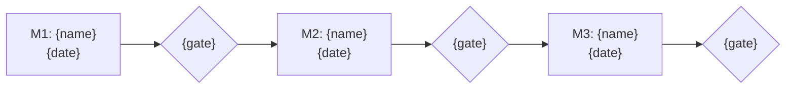

<!-- Copyright (c) 2026 Mohammad Maheri. Licensed under Apache 2.0. See LICENSE. Attribution required - see NOTICE. -->
# Project Charter

## Project: {project_name}
## Version: {version} | Date: {date}
## Request ID: {request_id}

---

## 1. Project Overview

| Field | Value |
|-------|-------|
| Project Name | {project_name} |
| Project ID | {project_id} |
| Project Manager | {pm_name} |
| Project Sponsor | {sponsor_name}, {sponsor_title} |
| Product Owner | {po_name}, {po_title} |
| Start Date | {start_date} |
| Target End Date | {end_date} |
| Priority | {MoSCoW} — {Pn} |

---

## 2. Project Purpose & Justification

{Why this project is being initiated — reference Business Case approval, feasibility score, strategic alignment}

---

## 3. Project Objectives

| # | Objective | Success Criteria | Measurement |
|---|-----------|-----------------|-------------|
| 1 | {objective} | {criteria} | {how measured} |
| 2 | {objective} | {criteria} | {how measured} |

---

## 4. High-Level Scope

### In Scope

1. {Item}
2. {Item}

### Out of Scope

1. {Item} — {reason}
2. {Item} — {reason}

---

## 5. Key Deliverables

| # | Deliverable | Target Phase | Owner |
|---|-------------|:------------:|-------|
| 1 | {deliverable} | {phase} | {role} |

---

## 6. High-Level Milestones

| Milestone | Target Date | Gate/Decision |
|-----------|:-----------:|---------------|
| M1: {name} | {date} | {gate} |

### Milestone Roadmap (visual)

> Milestone sequence and gate decisions at a glance. The milestone table above stays authoritative (DFE-extracted for the dashboard); this diagram is the human view. `flowchart` is used as the portable fallback for the roadmap (date-driven `gantt`/`timeline` renderers vary across platforms and placeholder dates do not parse).

---

## 7. Budget Summary

| Category | Amount |
|----------|--------|
| Total Budget | {$X or TBD} |
| Contingency | {$X} |

---

## 8. Key Stakeholders

| Name | Role | Responsibility | Influence |
|------|------|----------------|:---------:|
| {name} | {role} | {responsibility} | {H/M/L} |

---

## 9. Assumptions

1. {Assumption}
2. {Assumption}

---

## 10. Constraints

1. **{Type}:** {constraint}
2. **{Type}:** {constraint}

---

## 11. Key Risks (Initial)

| Risk | Impact | Probability | Response |
|------|:------:|:-----------:|----------|
| {risk} | {H/M/L} | {H/M/L} | {response} |

---

## 12. Project Approach

| Aspect | Approach |
|--------|----------|
| Methodology | {methodology} |
| Delivery Model | {model} |
| Testing | {approach} |
| Change Control | {process} |
| Reporting | {cadence} |

---

## 13. Authority & Governance

| Decision Type | Authority | Escalation Path |
|---------------|-----------|-----------------|
| {type} | {who} | {path} |

### Steering Committee

- {Role — Name}

---

## 14. Charter Approval

| Role | Name | Signature | Date |
|------|------|-----------|------|
| Project Sponsor | {name} | _[Pending]_ | |
| Product Owner | {name} | _[Pending]_ | |
| Project Manager | {name} | _[Pending]_ | |

---

*Project Charter v{version} | Prepared: {date} | Status: {status}*
