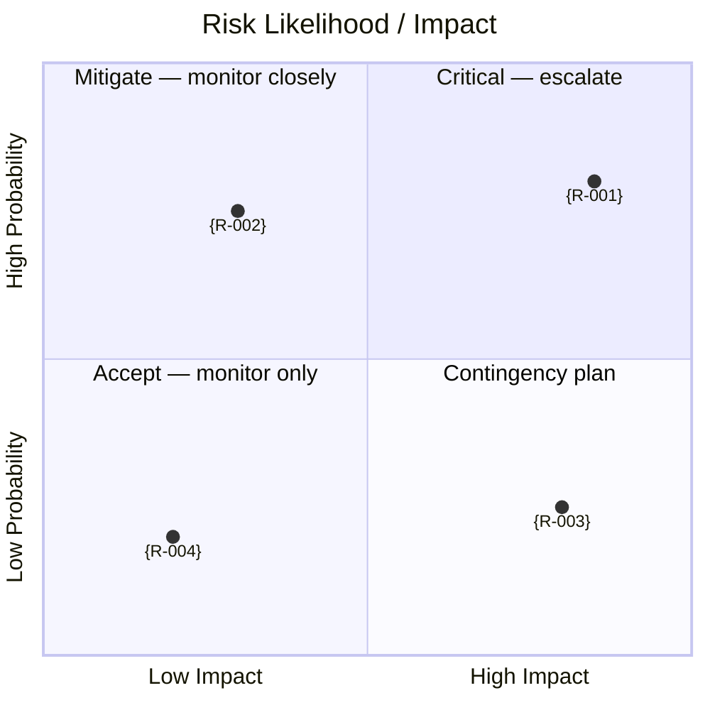

<!-- Copyright (c) 2026 Mohammad Maheri. Licensed under Apache 2.0. See LICENSE. Attribution required - see NOTICE. -->
# Risk Register

## Project: {project_name} — {project_id}
## Version: {version} | Date: {date}
## Risk Owner: {pm_role} | Reviewed By: {steering_committee}

---

## 1. Risk Assessment Matrix

```
              IMPACT
              Very Low(1) Low(2)   Medium(3)  High(4)  Very High(5)
             ┌──────────┬────────┬──────────┬────────┬────────────┐
Very High(5) │    5     │  10    │    15    │   20   │     25     │
             ├──────────┼────────┼──────────┼────────┼────────────┤
High(4)      │    4     │   8    │    12    │   16   │     20     │
PROBABILITY  ├──────────┼────────┼──────────┼────────┼────────────┤
Medium(3)    │    3     │   6    │     9    │   12   │     15     │
             ├──────────┼────────┼──────────┼────────┼────────────┤
Low(2)       │    2     │   4    │     6    │    8   │     10     │
             ├──────────┼────────┼──────────┼────────┼────────────┤
Very Low(1)  │    1     │   2    │     3    │    4   │      5     │
             └──────────┴────────┴──────────┴────────┴────────────┘

Score Thresholds:
  🔴 Very High (20-25): Immediate action; Steering escalation
  🟠 High (12-16):      Active mitigation; PM monitors weekly
  🟡 Medium (6-10):     Mitigation planned; PM monitors bi-weekly
  🟢 Low (1-5):         Accepted; monitor only
```

### Risk Matrix (visual)

> Risk exposure at a glance — probability (y) against impact (x). The scoring matrix above and the Risk Register table below stay authoritative (DFE-extracted for the dashboard); this diagram is the human view. Plot each risk by its assessed impact and probability.



---

## 2. Risk Register

| Risk ID | Category | Risk Description | Prob (1-5) | Impact (1-5) | Score | Priority | Response Strategy | Response Actions | Owner | Status | Trend |
|:-------:|:--------:|------------------|:----------:|:------------:|:-----:|:--------:|:-----------------:|-----------------|:-----:|:------:|:-----:|
| R-001 | {cat} | {description} | {n} | {n} | {score} | {🔴🟠🟡🟢} | {strategy} | {actions} | {role} | ☐ Open | → |

---

## 3. Risk Summary by Category

| Category | Count | Highest Score | Top Risk |
|----------|:-----:|:-------------:|----------|
| {category} | {n} | {score} (R-{nnn}) | {description} |

---

## 4. Top 5 Risks (for Steering Committee)

| # | Risk ID | Risk | Score | Owner | Key Action | Trend |
|---|:-------:|------|:-----:|:-----:|------------|:-----:|
| 1 | R-{nnn} | {description} | {n} | {role} | {action} | → |

---

## 5. Contingency Reserves

### Schedule Contingency

| Reserve | Amount | Trigger |
|---------|:------:|---------|
| {description} | {weeks} | {trigger condition} |

### Budget Contingency

| Reserve | Amount | Trigger |
|---------|:------:|---------|
| Contingency fund | {n}% ({$X}) | {trigger condition} |

### Scope Contingency (Descoping Candidates)

| Priority | Feature | Impact of Deferral |
|:--------:|---------|-------------------|
| 1 | {feature} | {impact} |

---

## 6. Risk Review Schedule

| Review Type | Frequency | Participants | Focus |
|-------------|:---------:|--------------|-------|
| {type} | {frequency} | {who} | {focus} |

---

## 7. Escalation Criteria

A risk must be escalated when:
- Score reaches 20+
- Risk materialized with no resolution path
- Two+ High risks trending upward simultaneously
- Decision required beyond PM authority

---

## 8. Brownfield Pre-Populated Risks (Brownfield Only)

> **Include IF:** Project Type is "Brownfield Extension". These risks are pre-populated because brownfield projects ALWAYS face these categories of risk. Assess probability and impact for THIS specific project.

| Risk ID | Category | Risk Description | Prob (1-5) | Impact (1-5) | Score | Priority | Response Strategy | Response Actions | Owner | Status | Trend |
|:-------:|:--------:|------------------|:----------:|:------------:|:-----:|:--------:|:-----------------:|-----------------|:-----:|:------:|:-----:|
| R-BF-01 | Integration | Existing system has undocumented behavior that breaks integration assumptions | {n} | {n} | {score} | {priority} | Mitigate | Characterization testing before any integration work; shadow traffic comparison | {role} | ☐ Open | → |
| R-BF-02 | Data | Data migration corrupts or loses records during transfer from legacy system | {n} | {n} | {score} | {priority} | Mitigate | Dry-run migrations; row-count validation; rollback plan with time limit; automated comparison | {role} | ☐ Open | → |
| R-BF-03 | Compatibility | Changes to existing system APIs break current consumers during transition | {n} | {n} | {score} | {priority} | Avoid | Anti-corruption layer; backward-compatible changes only; consumer notification protocol | {role} | ☐ Open | → |
| R-BF-04 | Schedule | Transition takes significantly longer than planned due to legacy complexity | {n} | {n} | {score} | {priority} | Mitigate | Phase-based delivery (each phase delivers value independently); buffer in schedule; early legacy assessment sprint | {role} | ☐ Open | → |
| R-BF-05 | Knowledge | Team lacks sufficient knowledge of legacy system to safely modify or integrate | {n} | {n} | {score} | {priority} | Mitigate | Knowledge transfer sessions; pair programming with legacy experts; characterization tests as learning tool | {role} | ☐ Open | → |
| R-BF-06 | Operational | Dual maintenance (old + new) increases operational burden beyond team capacity | {n} | {n} | {score} | {priority} | Mitigate | Clear decommission timeline per component; dedicated transition support role; automate monitoring for both systems | {role} | ☐ Open | → |
| R-BF-07 | Technical | Existing system technology constraints limit new system architecture choices | {n} | {n} | {score} | {priority} | Accept / Mitigate | Document constraints in Architecture Vision; use ACL to isolate; plan phased technology migration | {role} | ☐ Open | → |
| R-BF-08 | User | Users confused by partial transition (some features in old, some in new system) | {n} | {n} | {score} | {priority} | Mitigate | Feature flags hide WIP; single entry point (routing layer); clear user communication per phase | {role} | ☐ Open | → |

> **Note:** These are STARTING risks. Remove any that don't apply to this specific project. Add project-specific brownfield risks as identified during analysis.

---

*Risk Register v{version} | Prepared: {date} | Status: Active*
