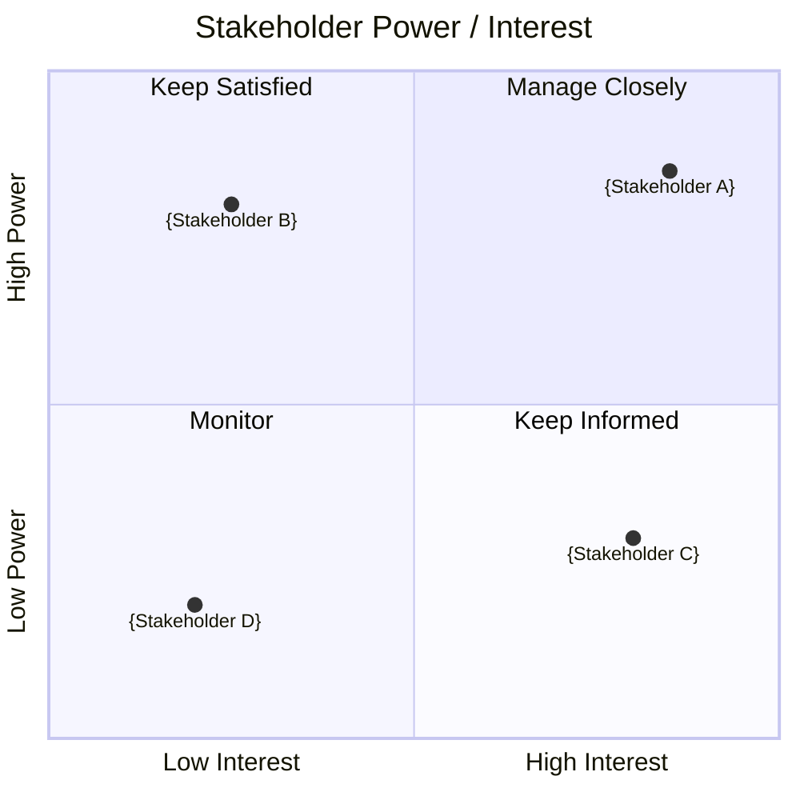

<!-- Copyright (c) 2026 Mohammad Maheri. Licensed under Apache 2.0. See LICENSE. Attribution required - see NOTICE. -->
# Stakeholder Register & Analysis

## Project: {project_name} — {project_id}
## Version: {version} | Date: {date}

---

## 1. Stakeholder Register

| # | Name | Role/Title | Department | Category | Project Role | Power | Interest |
|---|------|-----------|------------|:--------:|--------------|:-----:|:--------:|
| 1 | {name} | {title} | {dept} | {Internal/External} | {project_role} | {H/M/L} | {H/M/L} |

---

## 2. Power/Interest Matrix

```
              HIGH POWER
              ┌───────────────────────────┬───────────────────────────┐
              │                           │                           │
              │     KEEP SATISFIED        │     MANAGE CLOSELY        │
              │                           │                           │
              │  • {Name — Role}          │  • {Name — Role}          │
              │                           │                           │
              ├───────────────────────────┼───────────────────────────┤
              │                           │                           │
              │        MONITOR            │     KEEP INFORMED         │
              │                           │                           │
              │  • {Name — Role}          │  • {Name — Role}          │
              │                           │                           │
              └───────────────────────────┴───────────────────────────┘
              LOW INTEREST                          HIGH INTEREST
```

### Placement Detail

| Stakeholder | Power | Interest | Quadrant | Strategy |
|-------------|:-----:|:--------:|----------|----------|
| {name} | {H/M/L} | {H/M/L} | {quadrant} | {engagement approach} |

### Power/Interest Matrix (visual)

> Stakeholder power &amp; interest at a glance. The ASCII matrix and Placement Detail table above stay authoritative (DFE-extracted for the dashboard); this diagram is the human view. Plot each stakeholder by interest (x) and power (y).



---

## 3. Engagement Strategy

| Quadrant | Strategy | Communication Approach |
|----------|----------|----------------------|
| Manage Closely | Active engagement; involve in decisions | {frequency and method} |
| Keep Satisfied | High-level updates; engage when domain affected | {frequency and method} |
| Keep Informed | Regular updates; leverage expertise | {frequency and method} |
| Monitor | Major outcomes only | {frequency and method} |

---

*Stakeholder Register v{version} | Prepared: {date} | Status: {status}*
