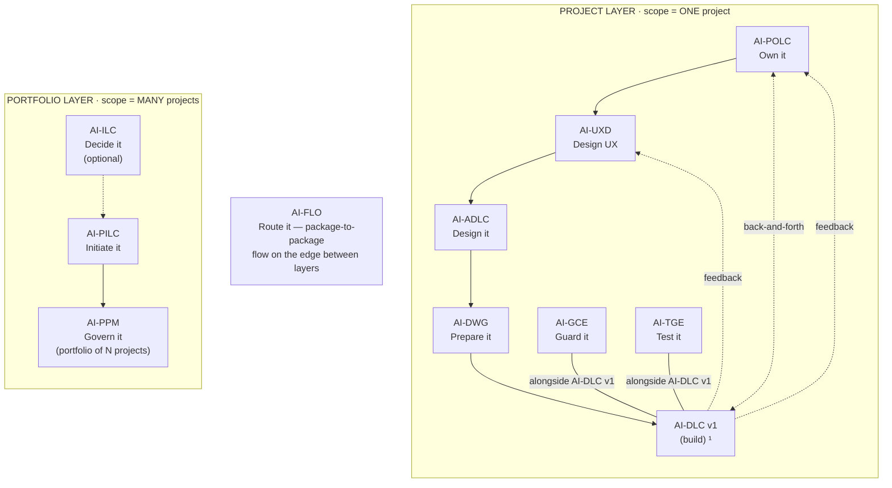

# AI-POLC — AI-Driven Product Ownership Life Cycle

[](./LICENSE)

**Version:** 1.0.0
**Created By:** Maheri — [LinkedIn](https://www.linkedin.com/in/mohammad-maheri-8399565b)
**License:** Apache 2.0 with Attribution

---

## What Is AI-POLC?

AI-POLC is an injectable workflow package that guides an AI assistant and a human Product Owner through establishing and operating disciplined product ownership — from business intent to a governed, prioritized Product Backlog Package (PBP) ready for development consumption.

**Identity:** AI-POLC turns business intent into a prioritized, value-justified product backlog, and is the single source of truth for *what gets built, in what order, and why*.

---

## The AI-* PDLC Family

AI-POLC is part of **AIFLC** (AI Full Life Cycle) — the AI-* PDLC Family of injectable workflow packages.


  ¹ AI-DLC v1 = Amazon's open-source build lifecycle (not ours; we feed it).

| Layer | Package | Type | Input | Output |
|-------|---------|------|-------|--------|
| Portfolio | **AI-ILC** ² | Interactive workflow (lifecycle) | Raw idea | Approved Idea Brief / Feature Brief |
| Portfolio | **AI-PILC** | Interactive workflow (lifecycle) | Raw requirement | Project Initiation Package (PIP) |
| Portfolio | **AI-PPM** ³ | Adaptive portfolio engine | Multiple PIPs + Approved Idea Briefs | Portfolio register + cross-project prioritization & governance |
| Edge | **AI-FLO** ³ | Router / orchestration engine | Any package output marker | Routing decision + handoff to next package/layer |
| Project | **AI-POLC** ³ | Interactive workflow (lifecycle) | PIP | Product Backlog Package (PBP) |
| Project | **AI-UXD** ³ | Interactive workflow (lifecycle) | PIP + PBP | UX Design Package (UXP): personas/journeys, IA, user flows, design system + tokens, accessibility baseline |
| Project | **AI-ADLC** | Interactive workflow (lifecycle) | PIP + PBP + UXP | Architecture Package (AP) |
| Project | **AI-DWG** | One-time generator | AP + PBP + UXP | Ready-to-code development workspace (DW) |
| Project | **AI-GCE** | Adaptive governance engine | DW (AI-DWG output) | Compliance enforcement layer |
| Project | **AI-TGE** | Test governance engine | DW / build artifacts | Test governance & quality layer |
| Project | **AI-DLC v1** ¹ | Interactive workflow (lifecycle) | DW + GCE + User Stories (from AI-POLC) | Working Software |

> ¹ **AI-DLC v1** ([awslabs/aidlc-workflows](https://github.com/awslabs/aidlc-workflows)) is NOT our product. Our chain produces the workspace AI-DLC v1 consumes.
> ² **AI-ILC** is an **optional pre-stage** (the funnel before the funnel). The chain still works without it for users who start at AI-PILC. `⇢` denotes the optional link.
> ³ All packages in this table are **built**. AI-PPM (portfolio engine), AI-FLO (router), AI-POLC (product ownership lifecycle), and AI-UXD (UX design lifecycle) were the last four — completed June 2026. Within the Project layer, **AI-POLC, AI-UXD, and AI-ADLC run sequentially** (POLC→UXD→ADLC) — each feeds the next, culminating at AI-DWG which receives all three outputs (AP + PBP + UXP). **AI-GCE and AI-TGE run alongside AI-DLC v1** as continuous quality engines; **AI-POLC ⇄ AI-DLC v1** exchange backlog/acceptance throughout delivery; and **AI-DLC v1 runtime feedback flows back to both AI-UXD and AI-POLC**. Feedback loops (ADLC→POLC cost/risk, ADLC→UXD constraints) provide iterative refinement without changing the forward sequence.

> **AI-DFE** ([Data Fabric Engine](../ai-dfe/)) is a family-scoped **companion** — it gathers data from all packages and distributes structured JSON for dashboards and status roll-ups. It runs alongside the chain rather than as a linear step, so it is not shown as a chain row above.

---

## Features

### Core (Tier 1 — Always Active)

- **Product Vision & Goals** — distill business intent into measurable goals
- **PO Charter & Authority** — define decision boundaries and RACI
- **Product Discovery & Roadmap** — Now/Next/Later strategic planning
- **Epic Decomposition** — goal→epic mapping with acceptance criteria
- **Value-Based Prioritization** — WSJF, MoSCoW, or value-effort with recorded rationale
- **Release & Increment Slicing** — MVP/MMP scope + delivery groupings
- **Definition of Ready / Done** — quality bar flowing to AI-DWG and AI-GCE
- **Product Risk & Assumptions** — product-level risk register
- **Traceability** — intent→epic→release linkage
- **Stakeholder Management** — power/interest matrix + communication cadence
- **Product Documentation** — release notes and changelog governance
- **Backlog Operations** — refinement, splitting criteria, tech-debt trade-offs
- **Acceptance & Feedback** — increment acceptance against DoD, DLC feedback loop

### Story Elaboration (Tier 2 — User-Activated)

- **INVEST-compliant stories** with Given/When/Then acceptance criteria
- Off by default in chain mode (AI-DLC v1 handles story creation)
- Activate for standalone use or PO-quality pre-elaboration

### Extensions (Opt-In)

- Advanced Discovery (OKRs, JTBD, opportunity scoring)
- Full Traceability (audit-grade matrix, compliance evidence)
- Full Risk Register (scoring, owners, response plans, trend tracking)
- Value & Metrics Engine (KPIs, benefits realization, experiments)
- Full Product Docs (PRD, feature briefs, wiki governance)
- Quality Review AI-Assist (automated backlog quality scanning)
- MVP/MMP for Mature Products (next-version scoping)

---

## Output Directory Structure

AI-POLC outputs into the standard multi-project layout. Product backlog artifacts land in `backlog/` within the project folder:

```
pdlc-ws/projects/
├── PROJECTS.md                          ← workspace registry
└── PRJ-{ABBREV}-{slug}/                  ← one project
    ├── management_framework/             ← shared governance spine
    └── backlog/                          ← AI-POLC output
        ├── polc-state.md                 ← progress marker
        ├── product-vision.md
        ├── po-charter.md
        ├── product-roadmap.md
        ├── epics/
        ├── release-plan.md
        ├── definition-of-ready.md
        ├── definition-of-done.md
        ├── product-risk-register.md
        ├── traceability-matrix.md
        └── PBP_README.md
```

> The `projects/` structure is always-on — solo, single-project, and multi-project alike. See `OUTPUT_AND_STATE_CONTRACT.md` for full details.

---

## Activation

**Explicit key:** type `_POLC_` in any prompt to activate AI-POLC unambiguously — even when other AI-* packages share the workspace. The status key `_ACTIVE_` reports which package is currently active. A package switch never happens without your explicit key or confirmation, and any switch is announced on the first line of the response (`Active package: AI-POLC`). See [`../TRIGGER_KEYS_REFERENCE.md`](../TRIGGER_KEYS_REFERENCE.md) for the full family key table.

---

## Installation

See `setup/INSTALL.md` for platform-specific installation instructions.

---

## File Structure

```
ai-polc/
├── README.md                           ← This file
├── LICENSE
├── PLAN.md                             ← Build plan and design rationale
├── ai-polc-rules/
│   └── core-workflow.md                ← Master orchestration (always loaded)
├── ai-polc-rule-details/
│   ├── common/                         ← Cross-cutting rules (5 files)
│   ├── foundation/                     ← Phase 1: Stages 1-3
│   ├── strategy/                       ← Phase 2: Stages 4-7
│   ├── governance/                     ← Phase 3: Stages 8-10
│   ├── stakeholders/                   ← Phase 4: Stages 11-12
│   ├── assembly/                       ← Phase 5: Stage 13
│   ├── operations/                     ← Phase 6: Stages 14-16
│   ├── tier2/                          ← Tier 2: Story elaboration
│   ├── extensions/                     ← 7 opt-in extensions (14 files)
│   └── templates/                      ← 12 output templates
└── setup/
    └── INSTALL.md
```

---

## Tenets

1. **Value-justified** — nothing enters the backlog without answering "why does this serve the product vision?"
2. **Traceable** — every item links upward to a goal and downward to an acceptance bar
3. **Governed** — decisions are logged, priorities have rationale, changes are tracked
4. **Adaptive** — depth adapts to product complexity; context factors shape behavior
5. **Workspace-mediated** — rules reach AI-DLC v1 through steering files, not direct integration
6. **Source-driven** — derive from user input; never fabricate scope

---

## Quick Start

```
You take the role of a high-skilled professional process designer/engineer.

Using the AI-POLC package, I want to establish product ownership governance
for my product.

Context:
- Product: {your product name}
- Input: {PIP available / Architecture Package / standalone vision}
- Mode: {chain with AI-DLC v1 / standalone}

Please start the AI-POLC workflow.
```

---

*Created: 2026-06-11 | Created By: Maheri*

---

## License

**Apache License 2.0 with Attribution Addendum**

- **Free to use:** Personal, commercial, educational, and organizational use — all permitted
- **Modify and distribute:** Create derivative works, redistribute, sublicense — all permitted
- **Attribution required:** Any distributed product substantially based on this work must include:

> *"Built on AIFLC by Mohammad Maheri — [LinkedIn](https://www.linkedin.com/in/mohammad-maheri-8399565b)"*

- **No warranty:** Provided "AS IS" without warranties of any kind

See `LICENSE` and `NOTICE` in this directory for full terms.

**Copyright:** © 2026 Mohammad Maheri

---

*Part of [AIFLC](../README.md) — the AI-* PDLC Family*
