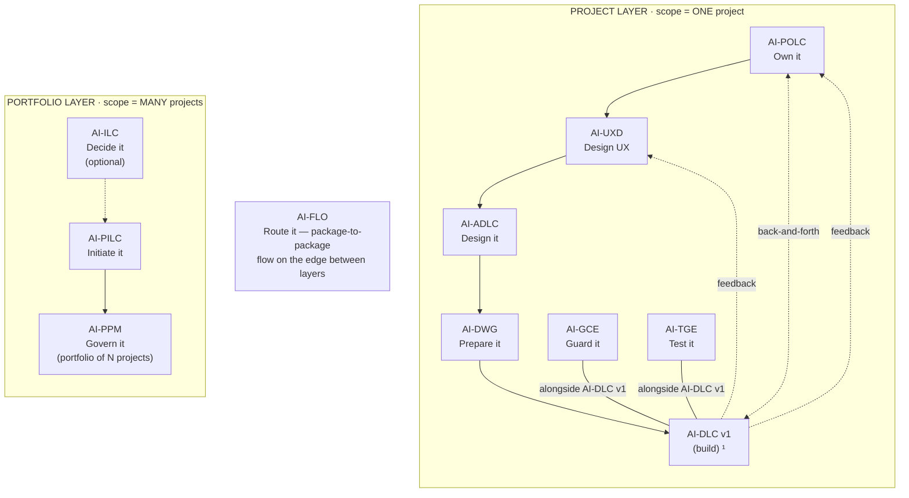
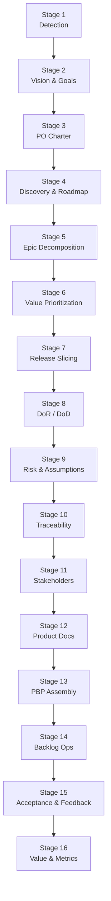

<!-- Copyright (c) 2026 Mohammad Maheri. Licensed under Apache 2.0. See LICENSE. Attribution required - see NOTICE. -->
# AI-POLC — Process Overview

**Purpose:** Quick-reference map of the entire AI-POLC workflow. Use this to understand where you are, what comes next, and how the phases connect.

---

## The AI-* Family (AI-POLC Position)


  ¹ AI-DLC v1 = Amazon's open-source build lifecycle (not ours; we feed it).

| Layer | Package | Type | Input | Output |
|-------|---------|------|-------|--------|
| Portfolio | **AI-ILC** ² | Interactive workflow (lifecycle) | Raw idea | Approved Idea Brief / Feature Brief |
| Portfolio | **AI-PILC** | Interactive workflow (lifecycle) | Raw requirement | Project Initiation Package (PIP) |
| Portfolio | **AI-PPM** ³ | Adaptive portfolio engine | Multiple PIPs + Approved Idea Briefs | Portfolio register + cross-project prioritization & governance |
| Edge | **AI-FLO** ³ | Router / orchestration engine | Any package output marker | Routing decision + handoff to next package/layer |
| Project | **AI-POLC** ³ | Interactive workflow (lifecycle) | PIP | Product Backlog Package (PBP) |
| Project | **AI-UXD** ³ | Interactive workflow (lifecycle) | PIP + PBP | UX Design Package (UXP): personas/journeys, IA, user flows, design system + tokens, accessibility baseline |
| Project | **AI-ADLC** | Interactive workflow (lifecycle) | PIP + PBP + UXP | Architecture Package (AP) |
| Project | **AI-DWG** | One-time generator | AP + PBP + UXP | Ready-to-code development workspace (DW) |
| Project | **AI-GCE** | Adaptive governance engine | DW (AI-DWG output) | Compliance enforcement layer |
| Project | **AI-TGE** | Test governance engine | DW / build artifacts | Test governance & quality layer |
| Project | **AI-DLC v1** ¹ | Interactive workflow (lifecycle) | DW + GCE + User Stories (from AI-POLC) | Working Software |

> ¹ **AI-DLC v1** ([awslabs/aidlc-workflows](https://github.com/awslabs/aidlc-workflows)) is NOT our product. Our chain produces the workspace AI-DLC v1 consumes.
> ² **AI-ILC** is an **optional pre-stage** (the funnel before the funnel). The chain still works without it for users who start at AI-PILC. `⇢` denotes the optional link.
> ³ All packages in this table are **built**. AI-PPM (portfolio engine), AI-FLO (router), AI-POLC (product ownership lifecycle), and AI-UXD (UX design lifecycle) were the last four — completed June 2026. Within the Project layer, **AI-POLC, AI-UXD, and AI-ADLC run sequentially** (POLC→UXD→ADLC) — each feeds the next, culminating at AI-DWG which receives all three outputs (AP + PBP + UXP). **AI-GCE and AI-TGE run alongside AI-DLC v1** as continuous quality engines; **AI-POLC ⇄ AI-DLC v1** exchange backlog/acceptance throughout delivery; and **AI-DLC v1 runtime feedback flows back to both AI-UXD and AI-POLC**. Feedback loops (ADLC→POLC cost/risk, ADLC→UXD constraints) provide iterative refinement without changing the forward sequence.

---

## Workflow Map

```
PHASE 1: FOUNDATION                    PHASE 2: STRATEGY
┌────────────────────────┐            ┌─────────────────────────────────────┐
│ Stage 1: Detection     │            │ Stage 4: Discovery & Roadmap        │
│ Stage 2: Vision & Goals│───gate───► │ Stage 5: Epic Decomposition         │
│ Stage 3: PO Charter    │            │ Stage 6: Value Prioritization       │
└────────────────────────┘            │ Stage 7: Release Slicing            │
                                      └──────────────────┬──────────────────┘
                                                         │ gate
                                                         ▼
PHASE 4: STAKEHOLDERS                  PHASE 3: GOVERNANCE
┌────────────────────────┐            ┌─────────────────────────────────────┐
│ Stage 11: Stakeholders │◄───gate────│ Stage 8: DoR / DoD                  │
│ Stage 12: Product Docs │            │ Stage 9: Risk & Assumptions         │
└───────────┬────────────┘            │ Stage 10: Traceability              │
            │ gate                    └─────────────────────────────────────┘
            ▼
PHASE 5: ASSEMBLY                      PHASE 6: OPERATIONS (repeating)
┌────────────────────────┐            ┌─────────────────────────────────────┐
│ Stage 13: PBP Assembly │───gate───► │ Stage 14: Backlog Ops               │
│     & Handoff          │            │ Stage 15: Acceptance & Feedback     │
└────────────────────────┘            │ Stage 16: Value & Metrics (ext)     │
                                      └─────────────────────────────────────┘
```

---

## Stage Quick Reference

| # | Stage | What Happens | Key Output |
|---|-------|-------------|------------|
| 1 | Workspace Detection | Detect mode (chain/standalone), scan upstream changes, establish context factors | Mode + context factors established |
| 2 | Product Vision & Goals | Distill business intent into vision + measurable goals | Vision statement, OKRs/KPIs |
| 3 | PO Charter & Authority | Define PO's decision boundaries and accountability | PO Charter, RACI |
| 4 | Product Discovery & Roadmap | Map strategic themes into Now/Next/Later horizons | Roadmap, value proposition |
| 5 | Epic Decomposition | Break goals into epics with acceptance criteria | Epic definitions (one per file) |
| 6 | Value-Based Prioritization | Rank epics using explicit model (WSJF/MoSCoW/value-effort) | Prioritization register |
| 7 | Release & Increment Slicing | Group prioritized epics into deliverable releases; define MVP/MMP | Release plan |
| 8 | Definition of Ready / Done | Set the quality bar for entering and exiting development | DoR + DoD checklists |
| 9 | Product Risk & Assumptions | Identify product-level risks and validate assumptions | Risk register, assumption log |
| 10 | Traceability Spine | Link intent → epic → (story) → acceptance | Traceability matrix |
| 11 | Stakeholder Management | Map stakeholders, define communication cadence | Stakeholder map |
| 12 | Product Documentation | Establish release notes and changelog governance | Release notes framework |
| 13 | PBP Assembly | Bundle all outputs, finalize polc-state.md | PBP_README.md, status=ready |
| 14 | Backlog Operations | Refinement, splitting, tech-debt trade-offs, pruning | Updated backlog |
| 15 | Acceptance & Feedback | Accept/reject DLC output, process feedback, reprioritize | Acceptance decisions |
| 16 | Value & Metrics | Track KPIs, benefits realization, experiments | Metrics report (extension) |

---

## Input Modes

AI-POLC supports multiple intake modes:

| Mode | Input Available | Behavior |
|------|----------------|----------|
| **Chain (full)** | PIP + AP + UXP | Full context — auto-detect upstream, minimal user questions |
| **Chain (partial)** | PIP only, or AP only | Detect what's available, ask for missing context |
| **Standalone (structured)** | Product brief / vision document | User provides product-level intent directly |
| **Standalone (verbal)** | Conversation | AI interviews user to extract vision, goals, scope |
| **Brownfield** | Existing ungoverned backlog | Audit → gap analysis → progressive adoption |

---

## Key Concepts

### Product Backlog Package (PBP)

The complete output of AI-POLC. Contains: vision, charter, roadmap, epics, prioritization, release plan, DoR/DoD, risks, traceability, stakeholder map, and governance spine entries. This is what AI-DWG reads for workspace generation and what AI-DLC v1's user references for development.

### Tier Model

- **Tier 1 (always active):** Full PO governance — everything except story elaboration
- **Tier 2 (user-activated):** Story elaboration — INVEST stories + Given/When/Then AC. Off by default in chain mode (AI-DLC v1 does this).

### Session-Based Operation

AI-POLC and AI-DLC v1 never run simultaneously in one session. The user alternates:
1. POLC session → refine backlog, reprioritize, accept last increment
2. DLC session → build the next priority item
3. POLC session → review what DLC built, accept/reject, update plan

All state is persisted in files. No session memory dependency.

---

## Sub-Roles (Stage-Layered)

The Product Owner persona is the primary lead for the entire workflow (+ 33 — additive, never replacing the primary). Specific stages activate a sub-role that layers a specialist lens on top:

| Stage / Activity | Sub-Role | Why |
|---|---|---|
| Stage 1 (Workspace Detection) | — | Primary persona sufficient |
| Stage 2 (Vision & Goals) | `#persona-subrole-product-strategist` | Strategic framing, OKR authoring |
| Stage 3 (PO Charter) | `#persona-subrole-change-manager` | Organizational authority, RACI design |
| Stage 4 (Discovery & Roadmap) | `#persona-subrole-product-strategist` | Roadmap planning, value proposition |
| Stage 5 (Epic Decomposition) | `#persona-subrole-business-analyst` | Requirement structuring, goal→epic mapping |
| Stage 6 (Prioritization) | `#persona-subrole-financial-analyst` | Value quantification, WSJF scoring |
| Stage 7 (Release Slicing) | `#persona-subrole-resource-planner` | Capacity-aware grouping, increment sizing |
| Stage 8 (DoR/DoD) | — | Primary persona sufficient (PO's core accountability) |
| Stage 9 (Risk & Assumptions) | `#persona-subrole-risk-analyst` | Risk scoring, assumption validation |
| Stage 10 (Traceability) | — | Primary persona sufficient |
| Stage 11 (Stakeholders) | `#persona-subrole-change-manager` | Stakeholder politics, communication design |
| Stage 12 (Product Docs) | — | Primary persona sufficient |
| Stage 13 (Assembly) | — | Primary persona sufficient |
| Stage 14 (Backlog Ops) | `#persona-subrole-business-analyst` | Refinement facilitation, splitting |
| Stage 15 (Acceptance) | — | Primary persona sufficient (PO's acceptance authority) |
| Stage 16 (Value & Metrics) | `#persona-subrole-financial-analyst` | Benefits realization, cost-of-delay |

Max two personas active per stage (primary + one sub-role).

---

## What AI-POLC Does NOT Do (Explicit Boundaries)

| Concern | Owner | AI-POLC's relationship |
|---------|-------|----------------------|
| Project initiation (charter, business case, budget) | AI-PILC | Consumes PIP; does not reproduce |
| Architecture & technical design | AI-ADLC | Consumes AP feasibility/cost-risk to (re)prioritize the backlog; does not decide the architecture |
| UX research, personas, journeys | AI-UXD | Consumes UXP; does not produce |
| Implementation (code, tests, deployment) | AI-DLC v1 | Sends epics + rules; does not build |
| Compliance enforcement (hooks, rules) | AI-GCE | Defines product governance rules; GCE enforces them |
| Sprint execution, velocity tracking | AI-DLC v1 / team | Receives feedback; does not run sprints |
| Workspace generation | AI-DWG | Produces PBP that DWG reads; does not generate workspace files |

**Inclusion rule:** If an artifact answers *what / why / in what order* → AI-POLC scope. If it answers *how / when-built / is-it-compliant* → out of scope (AI-DLC v1, AI-DWG, AI-GCE respectively).

---

*Reference this file at any point during the workflow for orientation.*


## Stage Flow (visual)

> The stage sequence at a glance. The table above stays authoritative.


