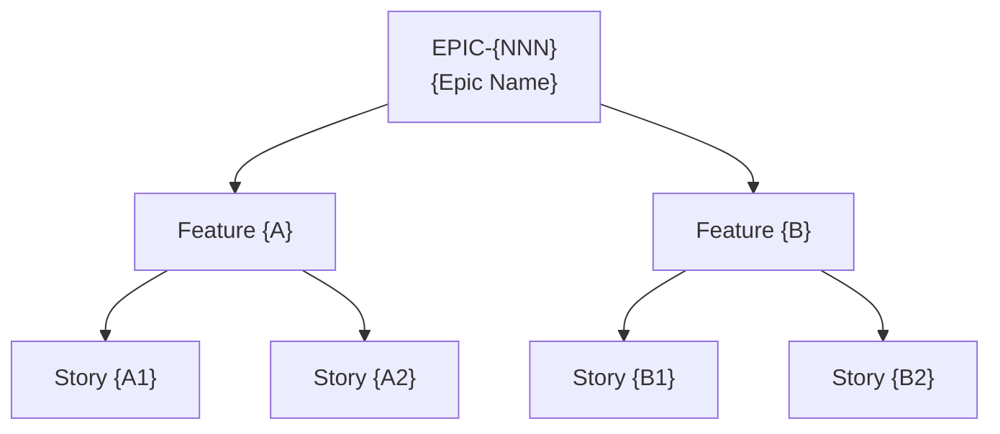

<!-- Copyright (c) 2026 Mohammad Maheri. Licensed under Apache 2.0. See LICENSE. Attribution required - see NOTICE. -->
---
generatedBy: AI-POLC
generatedVersion: 1.0.0
source: "{goal reference}"
generatedOn: "{ISO-date}"
ownership: hybrid
---

# EPIC-{NNN}: {Epic Name}

## Goal Linkage

- **Serves:** {Goal name + success metric}
- **Theme:** {Strategic theme}
- **Roadmap Horizon:** {Now | Next | Later}

---

## Description

{2-3 sentences: what this epic delivers, why it matters, who benefits from it.}

---

## Acceptance Criteria (Epic Level)

- [ ] {Criterion 1 — testable, measurable, unambiguous}
- [ ] {Criterion 2 — testable}
- [ ] {Criterion 3 — testable}
- [ ] {Criterion 4 — testable (if needed)}

---

## Dependencies

| Type | Item | Description |
|------|------|------------|
| Depends on | {EPIC-XXX or "none"} | {Why this dependency exists} |
| Blocks | {EPIC-YYY or "none"} | {What can't start until this is done} |
| External | {External dependency or "none"} | {Description} |

---

## Story Map (visual)

> Epic → feature → story decomposition at a glance. The epic description, acceptance criteria, and dependency table above stay authoritative (DFE-extracted for the backlog dashboard); this diagram is the human view. Add one branch per feature and its child stories.

---

## Size Estimate

- **Complexity:** {S | M | L | XL}
- **Rationale:** {One sentence explaining why this size}

---

## Context-Aware Notes

{Any notes derived from context factors — e.g., architecture alignment, compliance needs, team topology considerations. Remove this section if no context-specific notes apply.}

---

## Priority

- **Rank:** {Position in prioritization register}
- **Model Score:** {WSJF score / MoSCoW category / value-effort position}
- **Rationale:** {One sentence: why this rank}

---

## Release Assignment

- **Release:** R{N} — {Release name/goal}
- **Sprint target:** {If known, otherwise "TBD"}

---

*Generated by AI-POLC v1.0.0*
