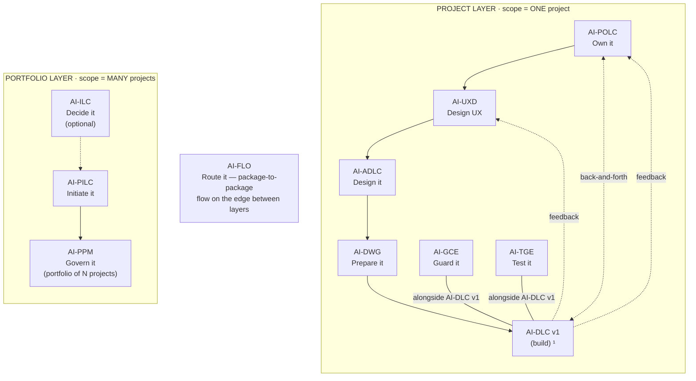

# AI-PPM: AI-Driven Project Portfolio Management

[](./LICENSE)

**Version:** 1.0.0

> **Govern the SET of projects — not just individual execution.**

AI-PPM is an injectable portfolio governance engine that manages multiple projects as a single governed portfolio. It registers, prioritizes, authorizes, monitors, and rebalances projects — answering the questions no single-project package can: *"Which projects should we run? In what order? Is the portfolio healthy? Should anything stop?"*

---

## The AI-* PDLC Family

AI-PPM is part of **AIFLC** (AI Full Life Cycle) — the AI-* PDLC Family of injectable workflow packages.


  ¹ AI-DLC v1 = Amazon's open-source build lifecycle (not ours; we feed it).

| Layer | Package | Type | Input | Output |
|-------|---------|------|-------|--------|
| Portfolio | **AI-ILC** ² | Interactive workflow (lifecycle) | Raw idea | Approved Idea Brief / Feature Brief |
| Portfolio | **AI-PILC** | Interactive workflow (lifecycle) | Raw requirement | Project Initiation Package (PIP) |
| Portfolio | **AI-PPM** ³ | Adaptive portfolio engine | Multiple PIPs + Approved Idea Briefs | Portfolio register + cross-project prioritization & governance |
| Edge | **AI-FLO** ³ | Router / orchestration engine | Any package output marker | Routing decision + handoff to next package/layer |
| Project | **AI-POLC** ³ | Interactive workflow (lifecycle) | PIP | Product Backlog Package (PBP) |
| Project | **AI-UXD** ³ | Interactive workflow (lifecycle) | PIP + PBP | UX Design Package (UXP): personas/journeys, IA, user flows, design system + tokens, accessibility baseline |
| Project | **AI-ADLC** | Interactive workflow (lifecycle) | PIP + PBP + UXP | Architecture Package (AP) |
| Project | **AI-DWG** | One-time generator | AP + PBP + UXP | Ready-to-code development workspace (DW) |
| Project | **AI-GCE** | Adaptive governance engine | DW (AI-DWG output) | Compliance enforcement layer |
| Project | **AI-TGE** | Test governance engine | DW / build artifacts | Test governance & quality layer |
| Project | **AI-DLC v1** ¹ | Interactive workflow (lifecycle) | DW + GCE + User Stories (from AI-POLC) | Working Software |

> ¹ **AI-DLC v1** ([awslabs/aidlc-workflows](https://github.com/awslabs/aidlc-workflows)) is NOT our product. Our chain produces the workspace AI-DLC v1 consumes.
> ² **AI-ILC** is an **optional pre-stage** (the funnel before the funnel). The chain still works without it for users who start at AI-PILC. `⇢` denotes the optional link.
> ³ All packages in this table are **built**. AI-PPM (portfolio engine), AI-FLO (router), AI-POLC (product ownership lifecycle), and AI-UXD (UX design lifecycle) were the last four — completed June 2026. Within the Project layer, **AI-POLC, AI-UXD, and AI-ADLC run sequentially** (POLC→UXD→ADLC) — each feeds the next, culminating at AI-DWG which receives all three outputs (AP + PBP + UXP). **AI-GCE and AI-TGE run alongside AI-DLC v1** as continuous quality engines; **AI-POLC ⇄ AI-DLC v1** exchange backlog/acceptance throughout delivery; and **AI-DLC v1 runtime feedback flows back to both AI-UXD and AI-POLC**. Feedback loops (ADLC→POLC cost/risk, ADLC→UXD constraints) provide iterative refinement without changing the forward sequence.

> **AI-DFE** ([Data Fabric Engine](../ai-dfe/)) is a family-scoped **companion** — it gathers data from all packages and distributes structured JSON for dashboards and status roll-ups. It runs alongside the chain rather than as a linear step, so it is not shown as a chain row above.

---

## What AI-PPM Does

| Capability | Stage | What It Produces |
|---|:---:|---|
| **Register projects** | 1-2 | Portfolio Register with every project's identity and state |
| **Align to strategy** | 3 | Strategic Alignment Map (objectives × projects scoring) |
| **Prioritize cross-project** | 4 | Prioritization Scorecard (project-vs-project ranking) |
| **Govern admission** | 5 | Governance Decision Records (admit/pause/retire with rationale) |
| **Authorize execution** | 6 | Dispatch Authorizations (FLO carries to Project layer) |
| **Monitor health** | 7-8 | Portfolio Health Dashboard (aggregate views) |
| **Rebalance** | 9 | Rebalancing Proposals (when reality changes) |
| **Retire projects** | 10 | Retirement Records (formal closure with lessons) |

---

## Key Design Principles

### Layered Communication Rule

> **Cross-layer = through FLO. Same-layer = direct marker read.**

- AI-PPM reads AI-PILC and AI-ILC directly (same Portfolio layer)
- AI-PPM talks to Project-layer packages ONLY via AI-FLO
- FLO carries dispatch DOWN and roll-up telemetry UP

### No Duplication

AI-PPM never recomputes what downstream packages already produce:
- Per-project value scoring → AI-POLC
- Per-project resource planning → AI-PILC
- Per-project risk assessment → AI-PILC/POLC
- Per-project compliance → AI-GCE/TGE

AI-PPM **aggregates** their data (via FLO) into portfolio-level views.

### Continuous Engine (Not One-Pass)

Unlike lifecycle packages that complete, AI-PPM operates continuously:
- Projects enter and exit over time
- Health is monitored on cadence
- Priorities shift as reality changes
- There is no "workflow complete" — only episodes (register, review, rebalance, retire)

---

## Extensions (Opt-In)

| ID | Extension | Trigger |
|:--:|-----------|---------|
| E1 | Portfolio Balancing & Visualization | "balance" / >10 projects |
| E2 | What-If Scenario Modeling | "what-if" / capacity constraints |
| E3 | Cross-Project Dependency Mapping | >5 projects / "dependencies" |
| E4 | Portfolio-Level Capacity & Demand | "capacity" / shared teams |
| E5 | Investment Themes / Strategic Buckets | "strategic buckets" / formal categories |
| E6 | Financial Governance | "budget" / "funding" / enterprise |
| E7 | Benefits Realization Aggregation | "benefits" / projects completing |

---

## Usage

1. Open your workspace (with one or more initiated projects) in your IDE
2. Start a chat and say:
   ```
   Using AI-PPM, register and prioritize my portfolio
   ```
3. The engine reads project state, registers projects, and runs prioritization, authorization, and health monitoring
4. Review the Portfolio Register and dashboards; approve governance-gate decisions
5. Re-run anytime as the portfolio changes — it is continuous, not one-pass

## File Structure

```
ai-ppm/
├── README.md                    ← This file
├── LICENSE                      ← Apache 2.0 + Attribution
├── PLAN.md                      ← Build plan + scope decisions
├── ai-ppm-rules/
│   └── core-engine.md           ← Master orchestration (load this)
├── ai-ppm-rule-details/
│   ├── common/                  ← Cross-cutting rules (5 files)
│   ├── intake/                  ← Stages 1-2
│   ├── prioritization/          ← Stages 3-4
│   ├── authorization/           ← Stages 5-6
│   ├── monitoring/              ← Stages 7-8
│   ├── optimization/            ← Stages 9-10
│   ├── extensions/              ← 7 opt-in extensions
│   └── templates/               ← 9 output templates + agent
└── setup/
    └── INSTALL.md               ← Multi-platform installation
```

---

## Activation

**Explicit key:** type `_PPM_` in any prompt to activate AI-PPM unambiguously — even when other AI-* packages share the workspace. The status key `_ACTIVE_` reports which package is currently active. A package switch never happens without your explicit key or confirmation, and any switch is announced on the first line of the response (`Active package: AI-PPM`). See [`../TRIGGER_KEYS_REFERENCE.md`](../TRIGGER_KEYS_REFERENCE.md) for the full family key table.

---

## Installation

See `setup/INSTALL.md` for detailed multi-platform instructions.

**Quick start (Kiro):**
1. Copy `ai-ppm-rules/` and `ai-ppm-rule-details/` into the uniform home `.aiflc/pdlc/`
2. Copy `session-orchestrator.md` into `.kiro/steering/` (the only always-loaded file; it `Read`s the core on demand)
3. Say: "I want to manage my project portfolio using AI-PPM"

---

## Tenets

1. **Portfolio over project** — every decision is about the SET, never one project in isolation
2. **Explicit over implicit** — all decisions recorded with rationale and conditions
3. **Data-driven over opinion** — scoring models with evidence, not gut feel
4. **Continuous over one-shot** — the portfolio is always being governed
5. **Additive over disruptive** — extensions add depth without changing core behavior
6. **Layered communication** — cross-layer via FLO, same-layer direct
7. **Fallback graceful** — works without FLO (manual mode), without PILC (manual entry), without extensions (core suffices)

---

## Methodology Alignment

- PMI Standard for Portfolio Management (4th Edition)
- MoP — Management of Portfolios (AXELOS)
- SAFe Lean Portfolio Management (patterns in extensions)
- Stage-Gate portfolio governance
- Benefits Realization Management (extension E7)

---

## Author

**Maheri** — [LinkedIn](https://www.linkedin.com/in/mohammad-maheri-8399565b)

Built with the AI-* Package Builder methodology.

---

*AI-PPM v1.0.0 | Created: 2026-06-11*

---

## License

**Apache License 2.0 with Attribution Addendum**

- **Free to use:** Personal, commercial, educational, and organizational use — all permitted
- **Modify and distribute:** Create derivative works, redistribute, sublicense — all permitted
- **Attribution required:** Any distributed product substantially based on this work must include:

> *"Built on AIFLC by Mohammad Maheri — [LinkedIn](https://www.linkedin.com/in/mohammad-maheri-8399565b)"*

- **No warranty:** Provided "AS IS" without warranties of any kind

See `LICENSE` and `NOTICE` in this directory for full terms.

**Copyright:** © 2026 Mohammad Maheri

---

*Part of [AIFLC](../README.md) — the AI-* PDLC Family*
