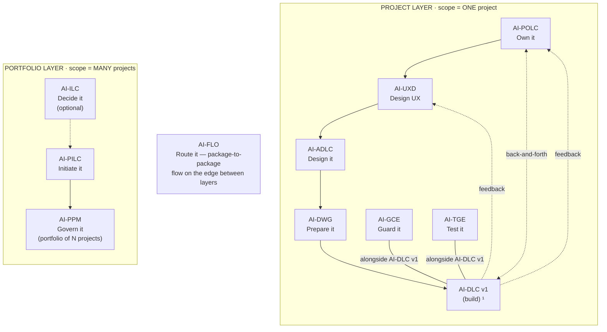
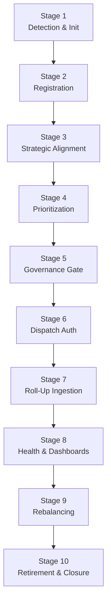

<!-- Copyright (c) 2026 Mohammad Maheri. Licensed under Apache 2.0. See LICENSE. Attribution required - see NOTICE. -->
# AI-PPM — Process Overview

**Purpose:** Quick-reference map of the entire AI-PPM engine. Use this to understand where you are, what comes next, and how the phases connect.

---

## The AI-* Family (AI-PPM Position)


  ¹ AI-DLC v1 = Amazon's open-source build lifecycle (not ours; we feed it).

| Layer | Package | Type | Input | Output |
|-------|---------|------|-------|--------|
| Portfolio | **AI-ILC** ² | Interactive workflow (lifecycle) | Raw idea | Approved Idea Brief / Feature Brief |
| Portfolio | **AI-PILC** | Interactive workflow (lifecycle) | Raw requirement | Project Initiation Package (PIP) |
| Portfolio | **AI-PPM** ³ | Adaptive portfolio engine | Multiple PIPs + Approved Idea Briefs | Portfolio register + cross-project prioritization & governance |
| Edge | **AI-FLO** ³ | Router / orchestration engine | Any package output marker | Routing decision + handoff to next package/layer |
| Project | **AI-POLC** ³ | Interactive workflow (lifecycle) | PIP | Product Backlog Package (PBP) |
| Project | **AI-UXD** ³ | Interactive workflow (lifecycle) | PIP + PBP | UX Design Package (UXP): personas/journeys, IA, user flows, design system + tokens, accessibility baseline |
| Project | **AI-ADLC** | Interactive workflow (lifecycle) | PIP + PBP + UXP | Architecture Package (AP) |
| Project | **AI-DWG** | One-time generator | AP + PBP + UXP | Ready-to-code development workspace (DW) |
| Project | **AI-GCE** | Adaptive governance engine | DW (AI-DWG output) | Compliance enforcement layer |
| Project | **AI-TGE** | Test governance engine | DW / build artifacts | Test governance & quality layer |
| Project | **AI-DLC v1** ¹ | Interactive workflow (lifecycle) | DW + GCE + User Stories (from AI-POLC) | Working Software |

> ¹ **AI-DLC v1** ([awslabs/aidlc-workflows](https://github.com/awslabs/aidlc-workflows)) is NOT our product. Our chain produces the workspace AI-DLC v1 consumes.
> ² **AI-ILC** is an **optional pre-stage** (the funnel before the funnel). The chain still works without it for users who start at AI-PILC. `⇢` denotes the optional link.
> ³ All packages in this table are **built**. AI-PPM (portfolio engine), AI-FLO (router), AI-POLC (product ownership lifecycle), and AI-UXD (UX design lifecycle) were the last four — completed June 2026. Within the Project layer, **AI-POLC, AI-UXD, and AI-ADLC run sequentially** (POLC→UXD→ADLC) — each feeds the next, culminating at AI-DWG which receives all three outputs (AP + PBP + UXP). **AI-GCE and AI-TGE run alongside AI-DLC v1** as continuous quality engines; **AI-POLC ⇄ AI-DLC v1** exchange backlog/acceptance throughout delivery; and **AI-DLC v1 runtime feedback flows back to both AI-UXD and AI-POLC**. Feedback loops (ADLC→POLC cost/risk, ADLC→UXD constraints) provide iterative refinement without changing the forward sequence.

---

## Layered Communication Rule

> **Cross-layer = through FLO. Same-layer = direct marker read.**

- AI-PPM reads AI-PILC and AI-ILC **directly** (all in Portfolio layer)
- AI-PPM communicates with Project-layer packages **only via AI-FLO**
- AI-FLO carries dispatch DOWN and roll-up UP across the layer boundary

---

## Engine Map

```
PHASE 1: INTAKE                        PHASE 2: PRIORITIZATION & ALIGNMENT
┌────────────────────────┐            ┌─────────────────────────────────┐
│ Stage 1: Detection &   │            │ Stage 3: Strategic Alignment    │
│   Initialization       │───gate───► │ Stage 4: Cross-Project          │
│ Stage 2: Project       │            │   Prioritization                │
│   Registration         │            └──────────────┬──────────────────┘
└────────────────────────┘                           │ gate
                                                     ▼
PHASE 4: MONITORING                    PHASE 3: AUTHORIZATION & DISPATCH
┌────────────────────────┐            ┌─────────────────────────────────┐
│ Stage 7: Roll-Up       │◄───event───│ Stage 5: Portfolio Governance   │
│   Ingestion            │            │   Gate                          │
│ Stage 8: Portfolio     │            │ Stage 6: Dispatch Authorization │
│   Health & Dashboards  │            └─────────────────────────────────┘
└───────────┬────────────┘
            │ threshold/review
            ▼
PHASE 5: OPTIMIZATION
┌────────────────────────┐
│ Stage 9: Portfolio     │
│   Rebalancing          │
│ Stage 10: Project      │
│   Retirement & Closure │
└────────────────────────┘
```

---

## Stage Quick Reference

| # | Stage | What Happens | Key Output |
|---|-------|-------------|------------|
| 1 | Portfolio Detection & Initialization | Detect existing portfolio, establish context, determine depth | ppm-state.md initialized |
| 2 | Project Registration | Admit new project from PIP or Idea Brief into Portfolio Register | Project Intake Card + Register entry |
| 3 | Strategic Alignment | Map org strategy → investment categories; score project alignment | Strategic Alignment Map |
| 4 | Cross-Project Prioritization | Rank project-vs-project with explicit model | Prioritization Scorecard |
| 5 | Portfolio Governance Gate | Admit / Pause / Resume / Retire decisions | Governance Decision Record |
| 6 | Dispatch Authorization | Produce authorization for FLO to carry to Project layer | Dispatch Authorization document |
| 7 | Roll-Up Ingestion | Read FLO-carried Project-layer snapshots; refresh register | Portfolio Register refreshed |
| 8 | Portfolio Health & Dashboards | Aggregate cross-project views; surface patterns & alerts | Portfolio Health Dashboard |
| 9 | Portfolio Rebalancing | Reassess priorities based on new data; adjust | Rebalancing Proposal |
| 10 | Project Retirement & Closure | Formal exit: close, archive, capture lessons | Retirement Record |

---

## Trigger Events (When PPM Activates)

| Event | Enters At | What Happens |
|-------|-----------|--------------|
| New PIP available (PILC completes) | Stage 2 | Register → prioritize → authorize |
| New Idea Brief approved (ILC completes) | Stage 2 | Register → prioritize |
| FLO delivers roll-up refresh | Stage 7 | Ingest → dashboard → health check |
| Scheduled portfolio review | Stage 7→8 | Full health assessment |
| User requests portfolio action | Varies | Direct entry to relevant stage |
| Health threshold breached | Stage 9 | Rebalancing triggered |
| Project completion signal | Stage 10 | Retirement workflow |

---

## Session Patterns

| Pattern | Stages | When |
|---------|--------|------|
| **Registration** | 1 → 2 → 3 → 4 → 5 → 6 | New project arrives |
| **Review** | 7 → 8 | Periodic check-in |
| **Rebalancing** | 7 → 8 → 9 → (5) | Something changed |
| **Retirement** | 10 | Project done/cancelled |
| **Full cycle** | 1 → 10 | Registration + review + optimize |

---

## Extensions (Opt-In)

| Extension | Trigger | Adds To |
|-----------|---------|---------|
| E1: Portfolio Balancing | "balance" / >10 projects | Stages 4, 8 |
| E2: What-If Scenarios | "what-if" / "scenario" | Stage 9 |
| E3: Dependency Mapping | >5 projects / "dependencies" | Stages 4, 7 |
| E4: Capacity & Demand | "capacity" / >3 shared teams | Stages 3, 8 |
| E5: Investment Themes | "strategic buckets" | Stage 3 |
| E6: Financial Governance | "budget" / "funding" | Stages 5, 8 |
| E7: Benefits Aggregation | "benefits" / projects completing | Stages 8, 10 |

---

## Governance Cadence (Recommended)

| Cadence | Activity | Stages |
|---------|----------|--------|
| On-demand | New project registration | 1–6 |
| Biweekly | Portfolio Sync (quick status) | 7–8 (light) |
| Monthly | Portfolio Health Review | 7–8–9 |
| Quarterly | Strategic Portfolio Review | 3–4–5–9 |
| On-completion | Project retirement | 10 |

---

*Reference this file at any point during the engine execution for orientation.*


## Stage Flow (visual)

> The stage sequence at a glance. The table above stays authoritative.


