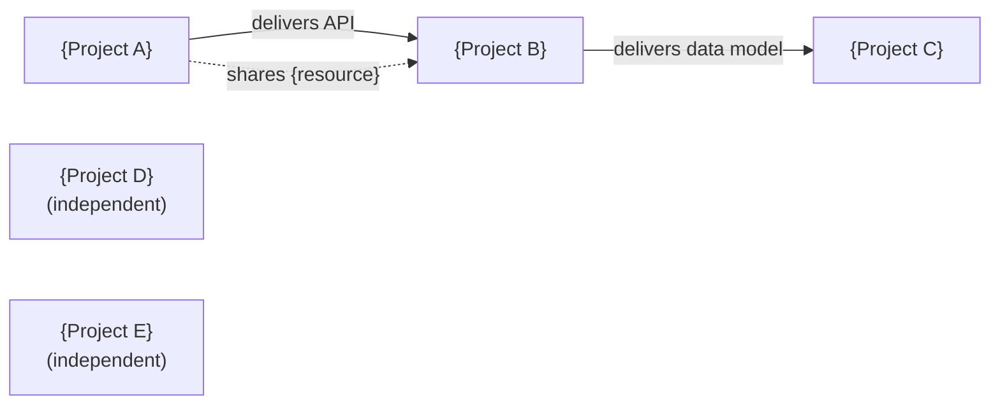

<!-- Copyright (c) 2026 Mohammad Maheri. Licensed under Apache 2.0. See LICENSE. Attribution required - see NOTICE. -->
# Extension E3: Cross-Project Dependency Mapping

**Stages affected:** 4 (Cross-Project Prioritization), 7 (Roll-Up Ingestion)
**Adds:** Dependency graph, critical path, shared resource map, blocked-by detection

---

## Additional Steps for Stage 4 (after Step 4.6)

### Step 4.E3.1: Identify Dependencies

For each project, ask or detect:

```
BQ-{NN}: Cross-project dependencies

For each project, identify if it depends on or is depended upon by other portfolio projects:

| Project | Depends On | Depended Upon By | Shared Resources |
|---------|-----------|-----------------|-----------------|
| {A} | — | {B needs A's API} | Platform Team |
| {B} | {A — API delivery} | {C needs B's data model} | Platform Team, DBA |
| {C} | {B — data model} | — | DBA |

Confirm or adjust: [Accept / Modify]
```

### Step 4.E3.2: Build Dependency Graph

```markdown
## Portfolio Dependency Graph

```
{A} ──delivers API──► {B} ──delivers data model──► {C}
         │                        │
         └── shares Platform Team ─┘

{D} ──── independent (no dependencies) ────
{E} ──── independent (no dependencies) ────
```

### Dependency Types
| Type | Symbol | Meaning |
|------|:------:|---------|
| Finish-to-Start | → | B cannot start until A delivers |
| Shared Resource | ⇌ | Both compete for same resource |
| Data Dependency | ⤳ | B needs A's output as input |
| Infrastructure | ⊡ | B needs infrastructure A is building |
```

### Step 4.E3.3: Identify Critical Path

The longest dependency chain determines the portfolio's minimum timeline:

```markdown
## Portfolio Critical Path

Longest chain: {A} → {B} → {C}
Total duration: {sum of sequential durations}
Impact: Even if {D} and {E} are higher priority, {A} must complete first for {B}/{C} to proceed.

Critical path projects: {list — these cannot be paused without cascading delays}
```

### Step 4.E3.4: Prioritization Impact

Flag where dependencies constrain the prioritization:

```
⚠️ Dependency constraint on ranking:
   • {B} is ranked #1 but depends on {A} (ranked #3) — {A} must execute first or in parallel
   • Recommendation: Elevate {A} priority or sequence them explicitly

Options:
(a) Adjust ranking to reflect dependencies (A before B)
(b) Keep ranking but add sequencing constraint to dispatch
(c) Accept risk: start B and plan for A's delivery to arrive in time
```

---

## Dependency Graph (visual)

> Inter-project dependencies at a glance. The dependency table (Step 4.E3.1) and the ASCII graph (Step 4.E3.2) stay authoritative (DFE-extracted for the portfolio dashboard); this diagram is the human view. Solid arrows = finish-to-start / data delivery; dotted = shared-resource contention; unconnected nodes are independent.



---

## Additional Steps for Stage 7 (after Step 7.4)

### Step 7.E3.1: Check Dependency Satisfaction

During roll-up ingestion, check if dependencies are being satisfied:

```markdown
## Dependency Status Check

| Dependency | Provider | Consumer | Status | Impact |
|---|---|---|:---:|---|
| {A} delivers API → {B} | {A}: 80% complete | {B}: waiting | 🟢 On track | {B} can start API work in 2 weeks |
| {B} delivers data model → {C} | {B}: 30% complete | {C}: waiting | 🟡 At risk | {C} start may slip 4 weeks |

Blocked projects: {list any projects blocked by undelivered dependencies}
```

### Step 7.E3.2: Cascade Alert

If a provider project deteriorates (🟢→🟡 or 🟡→🔴), alert for all consumers:

```
⚠️ Dependency cascade alert:
   {A} has slipped (now 🟡) — this affects:
   • {B}: blocked until {A} delivers API (was expected {date}, now {date})
   • {C}: indirectly blocked (depends on {B} which depends on {A})
   
   Portfolio impact: {C}'s timeline extends by {N} weeks
   Recommended: Investigate {A}'s blocker; consider resource injection
```

---

*This extension makes invisible inter-project dependencies visible — preventing the #1 cause of portfolio-level schedule failure.*
