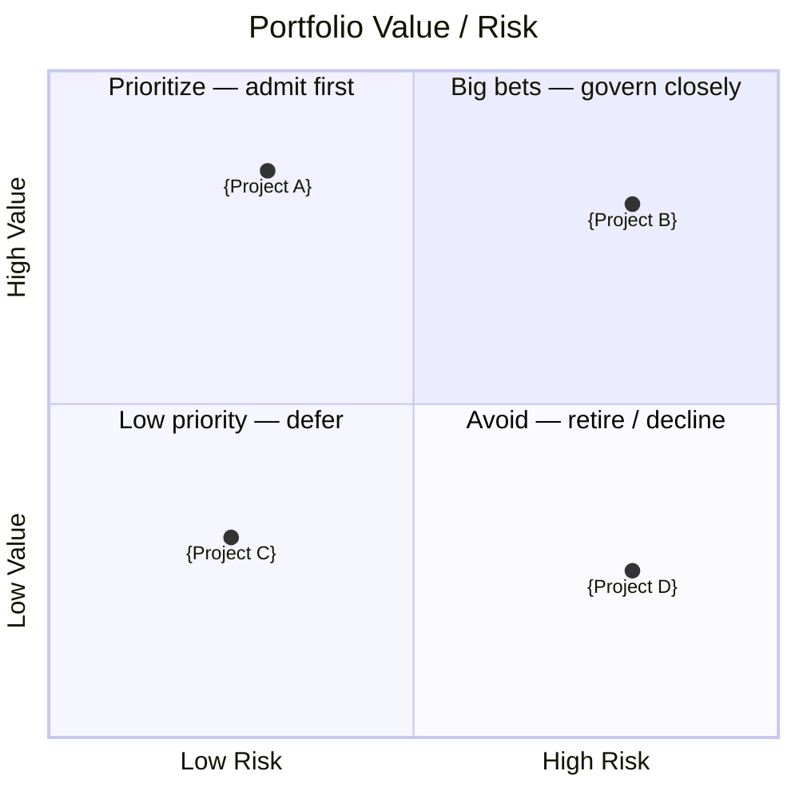

<!-- Copyright (c) 2026 Mohammad Maheri. Licensed under Apache 2.0. See LICENSE. Attribution required - see NOTICE. -->
# Portfolio Prioritization Scorecard

---
generatedBy: AI-PPM
generatedVersion: {version}
source: portfolio-governance
generatedOn: {ISO-date}
ownership: hybrid
---

## Model Configuration

| Field | Value |
|-------|-------|
| **Model Type** | {Value vs. Effort / Weighted Multi-Criteria / WSJF / Pairwise} |
| **Scored On** | {ISO-date} |
| **Projects Scored** | {N} |
| **Scoring Authority** | {user role/name} |

### Dimensions & Weights

| # | Dimension | Weight | Source |
|---|-----------|:------:|--------|
| 1 | {Strategic Alignment} | {30}% | Stage 3 score (auto) |
| 2 | {Business Value} | {25}% | PIP Business Case / user |
| 3 | {Urgency} | {20}% | Deadline / cost of delay |
| 4 | {Risk (inverted)} | {15}% | PIP Feasibility (lower risk = higher score) |
| 5 | {Feasibility} | {10}% | PIP Feasibility score |
| | **Total** | **100%** | |

---

## Results

| Rank | Project | ID | Dim 1 | Dim 2 | Dim 3 | Dim 4 | Dim 5 | Composite | Delta |
|:----:|---------|-----|:-----:|:-----:|:-----:|:-----:|:-----:|:---------:|:-----:|
| 1 | {Project A} | {ID} | {/10} | {/10} | {/10} | {/10} | {/10} | {/100} | — |
| 2 | {Project B} | {ID} | {/10} | {/10} | {/10} | {/10} | {/10} | {/100} | {-N} |
| 3 | {Project C} | {ID} | {/10} | {/10} | {/10} | {/10} | {/10} | {/100} | {-N} |

> **Delta** = gap from the project ranked above. Large gaps indicate natural cut lines.

## Value / Risk Matrix (visual)

> Portfolio positioning at a glance — business value (y) against risk (x). The scored Results table above stays authoritative (DFE-extracted for the portfolio dashboard); this diagram is the human view. Plot each project by its value and risk dimensions (risk is the inverse of the risk-reduction/feasibility scores).

---

## Key Observations

1. **Top ranked:** {Project name} — {why it's #1 in one sentence}
2. **Natural cut line:** Between #{N} and #{N+1} (gap of {points}) — projects below this line are significantly weaker
3. **Cluster:** Projects #{X}–#{Y} are within {N} points — effectively tied; governance override may be needed
4. **Resource conflict:** {any top-ranked projects competing for same resources}

---

## Governance Overrides

| Project | Score Rank | Actual Rank | Override Rationale |
|---------|:----------:|:-----------:|-------------------|
| — | — | — | _No overrides — scoring stands as ranked_ |

> Overrides are recorded when the portfolio manager adjusts a project's rank for reasons not captured in the scoring model (e.g., regulatory mandate, board directive, political necessity).

---

## Comparison to Previous Ranking

| Project | Previous Rank | Current Rank | Movement | Reason |
|---------|:------------:|:------------:|:--------:|--------|
| {A} | #{prev} | #{curr} | {↑↓→} | {what changed} |

---

## Next Actions

| Rank | Project | Recommended Governance Action |
|:----:|---------|-------------------------------|
| 1 | {A} | Admit — highest priority, no conflicts |
| 2 | {B} | Admit — strong case, within capacity |
| 3 | {C} | Hold — below cut line, limited capacity |

---

*This scorecard is the input to Stage 5 (Governance Gate). It provides the evidence basis for admission decisions.*
