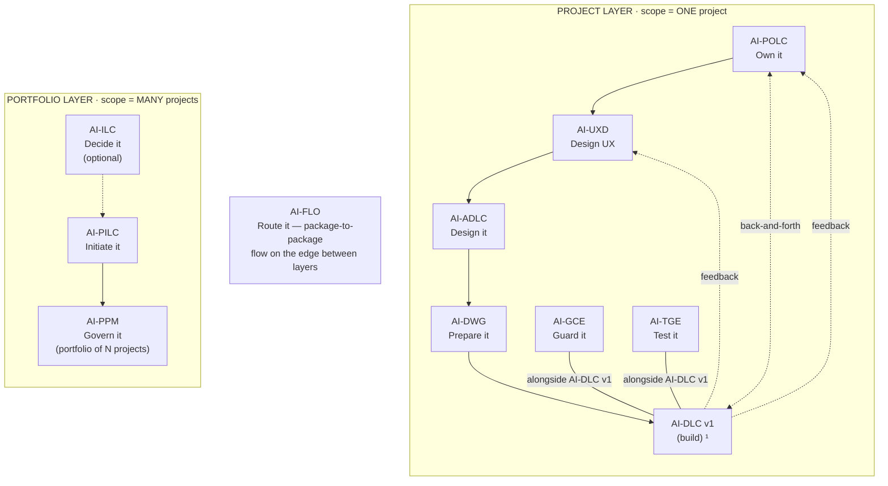
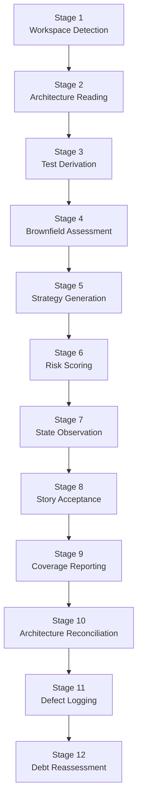

<!-- Copyright (c) 2026 Mohammad Maheri. Licensed under Apache 2.0. See LICENSE. Attribution required - see NOTICE. -->
# AI-TGE Process Overview

## What is AI-TGE?

AI-TGE (AI-Driven Test Governance Engine) is a hybrid package that derives test governance from architecture decisions and continuously observes the build process to maintain test accountability. Acting as a Senior QA Engineer / Test Architect, it reads everything the architecture promised — API contracts, security decisions, integration maps, component designs — and builds a register of tests that MUST exist to verify those promises were kept. Then it watches the build, tracking what gets tested and what doesn't, scoring the risk of every gap.

---

## The AI-* Family


  ¹ AI-DLC v1 = Amazon's open-source build lifecycle (not ours; we feed it).

| Layer | Package | Type | Input | Output |
|-------|---------|------|-------|--------|
| Portfolio | **AI-ILC** ² | Interactive workflow (lifecycle) | Raw idea | Approved Idea Brief / Feature Brief |
| Portfolio | **AI-PILC** | Interactive workflow (lifecycle) | Raw requirement | Project Initiation Package (PIP) |
| Portfolio | **AI-PPM** ³ | Adaptive portfolio engine | Multiple PIPs + Approved Idea Briefs | Portfolio register + cross-project prioritization & governance |
| Edge | **AI-FLO** ³ | Router / orchestration engine | Any package output marker | Routing decision + handoff to next package/layer |
| Project | **AI-POLC** ³ | Interactive workflow (lifecycle) | PIP | Product Backlog Package (PBP) |
| Project | **AI-UXD** ³ | Interactive workflow (lifecycle) | PIP + PBP | UX Design Package (UXP): personas/journeys, IA, user flows, design system + tokens, accessibility baseline |
| Project | **AI-ADLC** | Interactive workflow (lifecycle) | PIP + PBP + UXP | Architecture Package (AP) |
| Project | **AI-DWG** | One-time generator | AP + PBP + UXP | Ready-to-code development workspace (DW) |
| Project | **AI-GCE** | Adaptive governance engine | DW (AI-DWG output) | Compliance enforcement layer |
| Project | **AI-TGE** | Test governance engine | DW / build artifacts | Test governance & quality layer |
| Project | **AI-DLC v1** ¹ | Interactive workflow (lifecycle) | DW + GCE + User Stories (from AI-POLC) | Working Software |

> ¹ **AI-DLC v1** ([awslabs/aidlc-workflows](https://github.com/awslabs/aidlc-workflows)) is NOT our product. Our chain produces the workspace AI-DLC v1 consumes.
> ² **AI-ILC** is an **optional pre-stage** (the funnel before the funnel). The chain still works without it for users who start at AI-PILC. `⇢` denotes the optional link.
> ³ All packages in this table are **built**. AI-PPM (portfolio engine), AI-FLO (router), AI-POLC (product ownership lifecycle), and AI-UXD (UX design lifecycle) were the last four — completed June 2026. Within the Project layer, **AI-POLC, AI-UXD, and AI-ADLC run sequentially** (POLC→UXD→ADLC) — each feeds the next, culminating at AI-DWG which receives all three outputs (AP + PBP + UXP). **AI-GCE and AI-TGE run alongside AI-DLC v1** as continuous quality engines; **AI-POLC ⇄ AI-DLC v1** exchange backlog/acceptance throughout delivery; and **AI-DLC v1 runtime feedback flows back to both AI-UXD and AI-POLC**. Feedback loops (ADLC→POLC cost/risk, ADLC→UXD constraints) provide iterative refinement without changing the forward sequence.

### AI-TGE Position (Companion Pattern)

AI-TGE is a **companion package** in the family — it operates alongside the chain rather than within it, in the Project layer next to AI-GCE:

```
   ── PROJECT LAYER ────────────────────────────────────►

    AI-ADLC ─┐
    AI-UXD  ─┼─►  AI-DWG  ─►  AI-DLC v1 (build) ¹
    AI-POLC  ─┘                    ▲
                                  │ observes
    AI-GCE  +  AI-TGE  ── alongside AI-DLC v1 (continuous quality) ──►
    Guard it   Test it
                   ▲
                   └─ AI-TGE reads AP (AI-ADLC) + DW (AI-DWG); observes AI-DLC v1
  ¹ AI-DLC v1 = Amazon's open-source build lifecycle (not ours; we feed it).
```

- **Reads from:** AI-ADLC (Architecture Package) + AI-DWG (Development Workspace)
- **Observes:** AI-DLC v1 execution (aidlc-docs state)
- **Produces:** Test governance artifacts (strategy, register, coverage, debt scoring)
- **Runs:** as a continuous quality companion alongside AI-DLC v1 (with AI-GCE) — does NOT block the Project-layer build flow

---

## The Two Phases

```
┌─────────────────────────────────────────────────────────────────────────────┐
│                        AI-TGE ENGINE                                          │
├─────────────────────────────────────────────────────────────────────────────┤
│                                                                              │
│  🔵 STRATEGY PHASE    →  Determine WHAT must be tested and WHY               │
│  🟢 OBSERVATION PHASE →  Track WHAT gets tested as features are built        │
│                                                                              │
├─────────────────────────────────────────────────────────────────────────────┤
│  ↕ THROUGHOUT: Test Register maintained continuously                         │
│  ↕ THROUGHOUT: Risk scoring applied to every gap                             │
│  ↕ THROUGHOUT: Architecture reconciliation on AP changes                     │
└─────────────────────────────────────────────────────────────────────────────┘
```

---

## Phase-Stage Mapping

| Phase | Stage # | Stage Name | Execution | Key Output |
|-------|:-------:|------------|:---------:|------------|
| 🔵 STRATEGY | 1 | Workspace Detection | ALWAYS | State file, mode selection, depth level |
| | 2 | Architecture Reading | ALWAYS | Architecture Commitment Inventory |
| | 3 | Test Requirement Derivation | ALWAYS | Test Register (baseline) |
| | 4 | Brownfield Assessment | CONDITIONAL | Brownfield Gap Map |
| | 5 | Test Strategy Generation | ALWAYS | Test Strategy document |
| | 6 | Risk Scoring | ALWAYS | Debt Scorecard |
| 🟢 OBSERVATION | 7 | State Observation | ALWAYS | Updated register (test existence tracking) |
| | 8 | Story Acceptance Mapping | CONDITIONAL | Acceptance test register entries |
| | 9 | Coverage Reporting | ALWAYS | Multi-view coverage report |
| | 10 | Architecture Reconciliation | CONDITIONAL | Register delta (additions/deprecations) |
| | 11 | Defect Logging | CONDITIONAL | Structured defect entries |
| | 12 | Debt Reassessment | ALWAYS | Updated debt scorecard |

### Conditional Stage Triggers

| Stage | Condition to Execute | Condition to Skip |
|:-----:|---------------------|-------------------|
| 4 | Existing test directories detected in workspace | Greenfield project with no existing tests |
| 8 | User stories exist in `aidlc-docs/inception/user-stories/` | No user stories available |
| 10 | AP modified since last `tge-state.md` read | AP unchanged |
| 11 | User reports defect OR test failure detected | No defects reported |

---

## Adaptive Engine Principle — Four Input Modes

AI-TGE adapts to what exists. It does NOT require the full chain to have run.

| Mode | What Exists | Behavior |
|------|------------|----------|
| **Full Chain** | AP + DW + aidlc-docs (AI-DLC v1 running) | Full strategy + observation |
| **Architecture Only** | AP (from AI-ADLC) but no DW or DLC | Strategy mode only — derive register from AP |
| **Brownfield** | Existing project with existing tests (no AP) | Assessment mode — map existing tests, identify gaps |
| **Observation Only** | Active AI-DLC v1 with aidlc-docs but no prior TGE run | Jump to observation — register what should be tested as you go |

Detection order:
1. Check for `tge-state.md` (resume if found)
2. Check for AP marker (`adlc-state.md`) → full chain or architecture-only
3. Check for `aidlc-docs/` → observation possible
4. Check for existing test directories → brownfield assessment possible
5. None found → ask user what they have

---

## Depth Calibration

| Depth Level | When Applied | Behavior |
|-------------|-------------|----------|
| **Minimal** | Score 5-10 — small system, few integrations, simple auth | Strategy + register only. No brownfield. Basic risk buckets (H/M/L). |
| **Standard** | Score 11-18 — moderate complexity, multi-role auth, several integrations | + Coverage reports + detailed debt scoring + brownfield assessment |
| **Comprehensive** | Score 19-25 — high complexity, distributed, multi-tenant, >15 components | + Full traceability matrix + reconciliation + story-level mapping |

**Depth scoring factors (1-5 each):**

| Factor | Score 1 (Low) | Score 3 (Medium) | Score 5 (High) |
|--------|--------------|-----------------|----------------|
| Component count | ≤5 components | 6-15 components | >15 components |
| Integration count | ≤2 external | 3-7 external | >7 external |
| Security surface | Basic auth only | Multi-role, API keys | OAuth, multi-tenant, PII |
| Data complexity | Simple CRUD | Multiple schemas, migrations | Event sourcing, CQRS, distributed |
| Team size | Solo / pair | 3-8 developers | >8, multiple teams |

---

## Two-Source Derivation Model

AI-TGE derives test requirements from TWO sources:

| Source | What It Provides | When It Applies |
|--------|-----------------|-----------------|
| **Architecture Package** (project-specific) | Tailored test requirements linked to specific commitments (API contracts, security decisions, integration maps) | When AP exists (Full Chain or Architecture Only mode) |
| **Built-In Baseline** (universal minimums) | Universal test expectations that apply to ANY project regardless of AP content | Always — provides floor that AP enriches |

**Resolution rule:**
- AP provides specifics → enriched rules apply (additive to baseline)
- AP is silent → baseline provides minimum coverage
- Component doesn't fit any category → no auto-derived requirement

See `common/two-source-model.md` for complete derivation logic.

---

## Interaction Model

### Gate Behavior (Strategy Phase)

```
[AI derives test governance artifact] → [Presents to user] → [User reviews]
                                                                    │
                                                       ┌────────────┼────────────┐
                                                       ▼            ▼            ▼
                                                   Approve      Challenge     Modify
                                                 (proceed)     (discuss)   (adjust)
                                                       │            │            │
                                                       ▼            ▼            ▼
                                                 Next Stage    Re-derive    Apply edits
                                                              & present    & re-present
```

### Observation Phase (Continuous)

```
[AI-DLC v1 completes a unit] → [AI-TGE detects state change]
                                        │
                                        ▼
                            [Check: do required tests exist?]
                                        │
                              ┌─────────┼─────────┐
                              ▼                   ▼
                         Tests exist          Tests missing
                              │                   │
                              ▼                   ▼
                        Update register     Flag in debt
                        (Status: Exists)    scorecard
```

### User Commands (Available at Any Time)

| Command | Effect |
|---------|--------|
| "Show register" | Display current test register with status |
| "Show coverage" | Generate coverage report |
| "Show debt" | Display prioritized debt scorecard |
| "Check coverage now" | Trigger observation cycle manually |
| "Reconcile" | Re-read AP and update register for changes |
| "Log defect" | Enter defect logging flow |
| "Show strategy" | Display test strategy summary |
| "Show state" | Display current engine state |
| "Skip this stage" | Logs skip; moves on |
| "Go back to stage {n}" | Revisits stage; state updated |
| "Change depth" | Adjusts remaining workflow |

---

## The QA Engineer Perspective

Throughout the workflow, the AI operates as an experienced Senior QA Engineer / Test Architect:

| QA Principle | What It Means in Practice |
|--------------|--------------------------|
| **Risk-first** | Prioritize tests by architectural risk and blast radius, not by ease of writing |
| **Commitment-driven** | Every test requirement traces to a specific architectural promise |
| **Evidence-based** | Coverage claims are backed by register data, not assumptions |
| **Non-destructive** | Brownfield assessment maps without modifying; reconciliation proposes without auto-applying |
| **Architecture-aware** | Test types are derived from what was designed, not invented ad-hoc |
| **Silent when complete** | If all required tests exist and pass, AI-TGE has nothing to report |

---

## What AI-TGE Does NOT Do

- ❌ Write test code (governs what tests SHOULD exist, not how to write them)
- ❌ Execute tests (that's the CI/CD pipeline's job)
- ❌ Replace the testing framework (Jest, Pytest, etc. remain — TGE governs completeness)
- ❌ Make architecture decisions (reads them, doesn't produce them)
- ❌ Replace AI-GCE (GCE governs code compliance; TGE governs test completeness)
- ❌ Replace AI-DLC v1's Build-and-Test stage (that generates test instructions; TGE verifies sufficiency)
- ❌ Connect to CI/CD pipelines (no external integrations)
- ❌ Manage deployment or release decisions

---

## Session Continuity

AI-TGE supports multi-session work:

1. **State file** (`tge-state.md`) persists all progress
2. On session start, engine detects state and offers to resume
3. Test register accumulates across sessions
4. Coverage reports are regenerated (not stale snapshots)
5. Debt scorecard re-scores on each observation cycle

See `common/session-continuity.md` for full state management specification.

---

## Output Directory Structure

```
<workspace-root>/
└── .governance/test/
    ├── tge-state.md              ← Engine state + progress tracking (MARKER FILE)
    ├── test-strategy.md          ← Test approach, pyramid, tools, goals
    ├── test-register.md          ← Master list: commitment → test → status
    ├── coverage-report.md        ← Multi-view coverage analysis
    ├── debt-scorecard.md         ← Prioritized missing tests by risk
    └── defect-log.md             ← Structured defect tracking
```


## Stage Flow (visual)

> The stage sequence at a glance. The table above stays authoritative.


