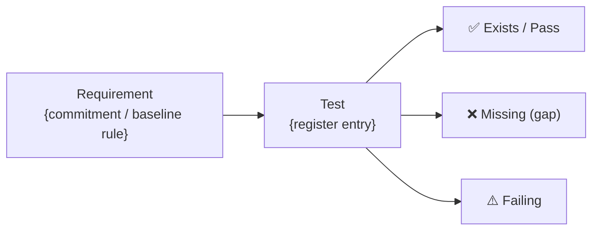

<!-- Copyright (c) 2026 Mohammad Maheri. Licensed under Apache 2.0. See LICENSE. Attribution required - see NOTICE. -->
# Coverage Report — Template

---
generatedBy: AI-TGE
generatedVersion: {version}
source: test-register
generatedOn: {ISO-date}
ownership: generated
---

**Type:** Coverage Report
**Generated:** {ISO-date}
**Engine:** AI-TGE v{version}
**Mode:** {Full Chain / Architecture Only / Brownfield / Observation Only}
**Depth:** {Minimal / Standard / Comprehensive}
**Project:** {project_name}

---

## Executive Summary

| Metric | Value |
|--------|:-----:|
| **Overall Coverage** | **{n}%** |
| Active register entries | {N} |
| Tests existing | {n} |
| Tests missing | {n} |
| Tests failing | {n} |
| Critical gaps remaining | {n} |
| Trend (vs. last report) | {↑ +n% / → stable / ↓ -n%} |
| Target (from strategy) | {n}% |
| Gap to target | {n}% |

---

## Coverage Traceability (visual)

> The coverage chain at a glance — requirement → test → result. The coverage tables (Views 1–6) and the linked register stay authoritative (DFE-extracted for the quality dashboard); this diagram is the human view of how each architectural commitment or baseline rule traces through a test to a verified result.

---

## View 1: Coverage by Commitment Category

| Category | Active | Covered | Missing | Failing | Coverage % | Target | Status |
|----------|:------:|:-------:|:-------:|:-------:|:----------:|:------:|:------:|
| API | {n} | {n} | {n} | {n} | {n}% | {n}% | {✅/⚠️/❌} |
| Security | {n} | {n} | {n} | {n} | {n}% | {n}% | {status} |
| Business Logic | {n} | {n} | {n} | {n} | {n}% | {n}% | {status} |
| Integration | {n} | {n} | {n} | {n} | {n}% | {n}% | {status} |
| Data | {n} | {n} | {n} | {n} | {n}% | {n}% | {status} |
| Performance/NFR | {n} | {n} | {n} | {n} | {n}% | {n}% | {status} |
| Workflow | {n} | {n} | {n} | {n} | {n}% | {n}% | {status} |
| Configuration | {n} | {n} | {n} | {n} | {n}% | {n}% | {status} |

**Legend:** ✅ At or above target | ⚠️ Within 10% of target | ❌ More than 10% below target

---

## View 2: Coverage by Component

| Component | Active | Covered | Missing | Coverage % | Risk Exposure | Priority |
|-----------|:------:|:-------:|:-------:|:----------:|:-------------:|:--------:|
| {ComponentName} | {n} | {n} | {n} | {n}% | {sum of missing risk scores} | {🔴🟠🟡🟢} |
| {ComponentName} | {n} | {n} | {n} | {n}% | {risk exposure} | {priority} |

**Most at-risk:** {component} — {n}% coverage, risk exposure {score}
**Best covered:** {component} — {n}% coverage

---

## View 3: Coverage by Test Level (Pyramid)

| Level | Required | Existing | Missing | Coverage % | Pyramid Target | Health |
|-------|:--------:|:--------:|:-------:|:----------:|:--------------:|:------:|
| Unit | {n} | {n} | {n} | {n}% | {n}% | {status} |
| Integration | {n} | {n} | {n} | {n}% | {n}% | {status} |
| System | {n} | {n} | {n} | {n}% | {n}% | {status} |
| Acceptance | {n} | {n} | {n} | {n}% | {n}% | {status} |

**Pyramid health:** {Assessment — balanced / unit-heavy / integration-gap / etc.}

---

## View 4: Coverage by Risk Level

| Risk Bucket | Active | Covered | Missing | Coverage % | Interpretation |
|-------------|:------:|:-------:|:-------:|:----------:|---------------|
| 🔴 Critical | {n} | {n} | {n} | {n}% | {comment} |
| 🟠 High | {n} | {n} | {n} | {n}% | {comment} |
| 🟡 Medium | {n} | {n} | {n} | {n}% | {comment} |
| 🟢 Low | {n} | {n} | {n} | {n}% | {comment} |

**Risk-weighted assessment:** {Key insight — e.g., "Critical coverage at 67% — 1 gap remains (SEC-003)"}

---

## View 5: Trend

| Report Date | Coverage % | Critical Gaps | Tests Added | Tests Deprecated | Net Change |
|:-----------:|:----------:|:-------------:|:-----------:|:----------------:|:----------:|
| {date} | {n}% | {n} | — | — | — |
| {date} | {n}% | {n} | +{n} | {n} | {±n} |
| {current} | {n}% | {n} | +{n} | {n} | {±n} |

**Velocity:** {n} tests added per observation cycle (average)
**Direction:** {Improving / Stable / Declining}

---

## View 6: Top Gaps (Immediate Attention)

| # | ID | Test Name | Component | Level | Type | Risk Score | Bucket |
|---|:--:|-----------|-----------|:-----:|:----:|:----------:|:------:|
| 1 | {id} | {name} | {comp} | {level} | {type} | {score} | 🔴 |
| 2 | {id} | {name} | {comp} | {level} | {type} | {score} | 🔴 |
| 3 | {id} | {name} | {comp} | {level} | {type} | {score} | 🟠 |
| 4 | {id} | {name} | {comp} | {level} | {type} | {score} | 🟠 |
| 5 | {id} | {name} | {comp} | {level} | {type} | {score} | 🟠 |

---

## Forecast (Comprehensive Depth)

At current velocity ({n} tests per cycle):
- {n}% coverage: ~{n} sprints
- {n}% coverage: ~{n} sprints
- {n}% coverage: ~{n} sprints

**Bottleneck:** {category/component with slowest progress}
**Recommendation:** {specific action to accelerate coverage}

---

## Calculation Notes

- **Active entries** = Total - Deprecated - Overridden
- **Coverage %** = (Exists + Failing) / Active × 100
- **Failing tests count as covered** (test exists, needs fixing — different from missing)
- **Risk Exposure** = sum of risk scores for all Missing entries in a component

---

*Generated by AI-TGE v{version} | Observation Phase Stage 9*
