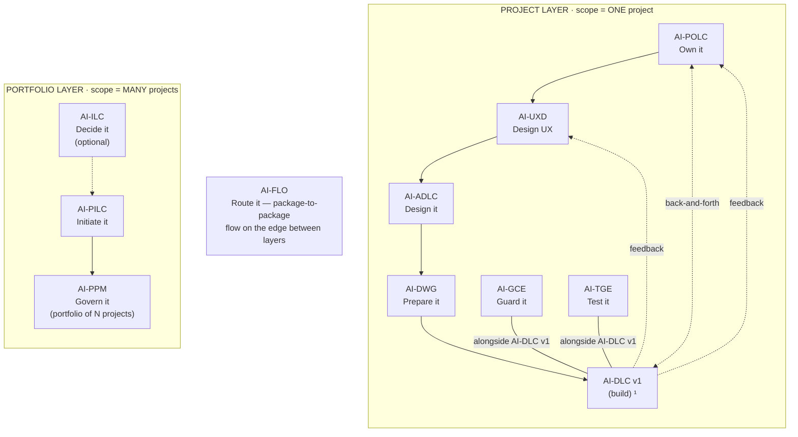

# AI-UXD — AI-Driven UX Design Life Cycle

[](./LICENSE)

**Version:** 1.0.0
**Created By:** Maheri — [LinkedIn](https://www.linkedin.com/in/mohammad-maheri-8399565b)
**Inspired By:** Double Diamond (UK Design Council), Atomic Design (Brad Frost), W3C Design Tokens
**License:** Apache 2.0 with Attribution

---

## What Is AI-UXD?

AI-UXD is an injectable UX design lifecycle that guides you from user research to a governed design system — producing artifacts that downstream development tools can consume directly. It reasons and writes as a senior UX designer, producing professional-grade deliverables without requiring prior UX expertise.

**In one sentence:** AI-UXD turns business intent and user research into a governed UX Design Package (UXP) — personas, journeys, information architecture, user flows, a complete design system with tokens and components, and an accessibility baseline.

---

## Family Position

AI-UXD is part of **AIFLC** (AI Full Life Cycle) — the AI-* PDLC Family of injectable workflow packages that feed each other:


  ¹ AI-DLC v1 = Amazon's open-source build lifecycle (not ours; we feed it).

| Layer | Package | Type | Input | Output |
|-------|---------|------|-------|--------|
| Portfolio | **AI-ILC** ² | Interactive workflow (lifecycle) | Raw idea | Approved Idea Brief / Feature Brief |
| Portfolio | **AI-PILC** | Interactive workflow (lifecycle) | Raw requirement | Project Initiation Package (PIP) |
| Portfolio | **AI-PPM** ³ | Adaptive portfolio engine | Multiple PIPs + Approved Idea Briefs | Portfolio register + cross-project prioritization & governance |
| Edge | **AI-FLO** ³ | Router / orchestration engine | Any package output marker | Routing decision + handoff to next package/layer |
| Project | **AI-POLC** ³ | Interactive workflow (lifecycle) | PIP | Product Backlog Package (PBP) |
| Project | **AI-UXD** ³ | Interactive workflow (lifecycle) | PIP + PBP | UX Design Package (UXP): personas/journeys, IA, user flows, design system + tokens, accessibility baseline |
| Project | **AI-ADLC** | Interactive workflow (lifecycle) | PIP + PBP + UXP | Architecture Package (AP) |
| Project | **AI-DWG** | One-time generator | AP + PBP + UXP | Ready-to-code development workspace (DW) |
| Project | **AI-GCE** | Adaptive governance engine | DW (AI-DWG output) | Compliance enforcement layer |
| Project | **AI-TGE** | Test governance engine | DW / build artifacts | Test governance & quality layer |
| Project | **AI-DLC v1** ¹ | Interactive workflow (lifecycle) | DW + GCE + User Stories (from AI-POLC) | Working Software |

> ¹ **AI-DLC v1** ([awslabs/aidlc-workflows](https://github.com/awslabs/aidlc-workflows)) is NOT our product. Our chain produces the workspace AI-DLC v1 consumes.
> ² **AI-ILC** is an **optional pre-stage** (the funnel before the funnel). The chain still works without it for users who start at AI-PILC. `⇢` denotes the optional link.
> ³ All packages in this table are **built**. AI-PPM (portfolio engine), AI-FLO (router), AI-POLC (product ownership lifecycle), and AI-UXD (UX design lifecycle) were the last four — completed June 2026. Within the Project layer, **AI-POLC, AI-UXD, and AI-ADLC run sequentially** (POLC→UXD→ADLC) — each feeds the next, culminating at AI-DWG which receives all three outputs (AP + PBP + UXP). **AI-GCE and AI-TGE run alongside AI-DLC v1** as continuous quality engines; **AI-POLC ⇄ AI-DLC v1** exchange backlog/acceptance throughout delivery; and **AI-DLC v1 runtime feedback flows back to both AI-UXD and AI-POLC**. Feedback loops (ADLC→POLC cost/risk, ADLC→UXD constraints) provide iterative refinement without changing the forward sequence.

> **AI-DFE** ([Data Fabric Engine](../ai-dfe/)) is a family-scoped **companion** — it gathers data from all packages and distributes structured JSON for dashboards and status roll-ups. It runs alongside the chain rather than as a linear step, so it is not shown as a chain row above.

---

## Features

- **5 phases, 16 stages** — Discover → Define → Design → Validate → Assemble
- **Evidence-backed personas** with JTBD framing and accessibility considerations
- **Journey mapping** with emotional tracking, error paths, and service blueprints
- **Information architecture** — organization, labeling, navigation, and search systems
- **User flows** — task flows, user flows, wireflows with error/edge-case paths
- **Full design system** — colors, typography, spatial grid, iconography, voice & tone
- **W3C-aligned design tokens** — three-tier architecture (global → semantic → component)
- **Component library** — every component with ALL states, interactions, accessibility, responsive behavior
- **Multi-brand theming** — dark mode, brand variants, token inheritance (conditional)
- **i18n/RTL** — text expansion, bidirectional layout, locale-aware tokens (conditional)
- **Accessibility-by-design** — WCAG 2.2 baseline embedded in every stage, not bolted on
- **Design QA framework** — governed drift detection for implementation fidelity
- **Usability validation** — heuristic evaluation + test plan + feedback intake
- **UXC__ governance agent** — on-demand consistency validation
- **Adaptive depth** — Minimal / Standard / Comprehensive based on project complexity
- **4 input modes** — Full chain (PIP+AP) / PIP only / Standalone / Brownfield
- **Gates at every stage** — nothing proceeds without your approval

---

## Activation

**Explicit key:** type `_UXD_` in any prompt to activate AI-UXD unambiguously — even when other AI-* packages share the workspace. The status key `_ACTIVE_` reports which package is currently active. A package switch never happens without your explicit key or confirmation, and any switch is announced on the first line of the response (`Active package: AI-UXD`). See [`../TRIGGER_KEYS_REFERENCE.md`](../TRIGGER_KEYS_REFERENCE.md) for the full family key table.

---

## Installation

See `setup/INSTALL.md` for full multi-platform installation instructions.

**Quick start (Kiro):**
1. Copy `ai-uxd-rules/` and `ai-uxd-rule-details/` into the uniform home `.aiflc/pdlc/`
2. Copy `session-orchestrator.md` into `.kiro/steering/` (the only always-loaded file; it `Read`s the core on demand)
3. Start a session — AI-UXD activates automatically

---

## Usage

1. Open your workspace in your IDE with the AI assistant active
2. Start a chat and say:
   ```
   Using AI-UXD, design the UX for [feature or product]
   ```
3. The workflow guides you through research, personas, journeys, information architecture, flows, design system, and an accessibility baseline
4. Answer structured questions and approve each deliverable at gates
5. A UX Design Package (UXP) is produced for AI-ADLC / AI-POLC to consume

## File Structure

```
ai-uxd/
├── README.md                          ← This file
├── LICENSE                            ← Apache 2.0 + Attribution
├── PLAN.md                            ← Design rationale
├── ai-uxd-rules/
│   └── core-workflow.md               ← Master orchestration (THE spec)
├── ai-uxd-rule-details/
│   ├── common/                        ← Cross-cutting (6 files)
│   ├── discover/                      ← Phase 1 stages (3 files)
│   ├── define/                        ← Phase 2 stages (3 files)
│   ├── design/                        ← Phase 3 stages (4 files)
│   ├── validate/                      ← Phase 4 stages (3 files)
│   ├── assemble/                      ← Phase 5 stages (3 files)
│   └── templates/                     ← Output templates (15 files)
│       └── agents/                    ← Governance agent (2 files)
└── setup/
    └── INSTALL.md                     ← Platform setup guide
```

---

## Tenets

1. **Systems over screens** — the design system generates consistent screens; individual pages are expressions of the system
2. **Accessibility is embedded** — every stage considers it; Stage 11 consolidates, doesn't start from zero
3. **Traceability is non-negotiable** — persona → journey → flow → screen → component → token → principle
4. **Artifact, not tool** — governs structure and specifications; doesn't replace Figma or design tools
5. **States are mandatory** — a component without all its states is incomplete
6. **Voice is design** — words are part of the experience and governed alongside visuals
7. **Responsive as constraint** — breakpoints and reflow are design system decisions, not developer discoveries

---

## Output Directory Structure

AI-UXD outputs into the standard multi-project layout. UX design artifacts land in `ux/` within the project folder:

```
pdlc-ws/projects/
├── PROJECTS.md                          ← workspace registry
└── PRJ-{ABBREV}-{slug}/                  ← one project
    ├── management_framework/             ← shared governance spine
    └── ux/                               ← AI-UXD output
        ├── uxd-state.md                  ← progress marker
        ├── 01_Research_Synthesis.md
        ├── 02_Personas/
        ├── 03_Journey_Maps/
        ├── 04_Information_Architecture.md
        ├── 05_User_Flows/
        ├── 06_Wireframe_Specifications/
        ├── 07_Design_System/
        ├── 08_Component_Library/
        ├── [09_Multi_Brand_Theming.md]   (conditional)
        ├── 10_Accessibility_Baseline.md
        ├── 11_Usability_Test_Plan.md
        ├── 12_Design_QA_Framework.md
        └── UXP_README.md
```

> The `projects/` structure is always-on — solo, single-project, and multi-project alike. See `OUTPUT_AND_STATE_CONTRACT.md` for full details.

---

## Author

**Mohammad Maheri** — Process designer specializing in injectable AI workflow packages.

AI-UXD was designed to fill the "missing producer" gap in the AI-* Family: downstream packages assumed design tokens, components, and accessibility baselines existed — but nothing produced them. AI-UXD is that producer.

---

*v1.0.0 | 2026-06-12*

---

## License

**Apache License 2.0 with Attribution Addendum**

- **Free to use:** Personal, commercial, educational, and organizational use — all permitted
- **Modify and distribute:** Create derivative works, redistribute, sublicense — all permitted
- **Attribution required:** Any distributed product substantially based on this work must include:

> *"Built on AIFLC by Mohammad Maheri — [LinkedIn](https://www.linkedin.com/in/mohammad-maheri-8399565b)"*

- **No warranty:** Provided "AS IS" without warranties of any kind

See `LICENSE` and `NOTICE` in this directory for full terms.

**Copyright:** © 2026 Mohammad Maheri

---

*Part of [AIFLC](../README.md) — the AI-* PDLC Family*
