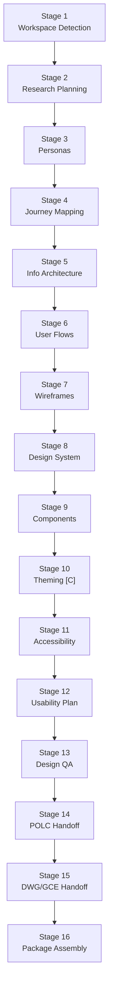

<!-- Copyright (c) 2026 Mohammad Maheri. Licensed under Apache 2.0. See LICENSE. Attribution required - see NOTICE. -->
# AI-UXD — Process Overview

**Purpose:** High-level map of the entire AI-UXD workflow. Reference this to understand where you are, what comes next, and how the pieces connect.

---

## Workflow at a Glance

```
Phase 1: DISCOVER          Phase 2: DEFINE           Phase 3: DESIGN
┌─────────────────┐       ┌─────────────────┐       ┌─────────────────┐
│ 1. Workspace    │       │ 4. Journey      │       │ 7. Wireframes   │
│    Detection    │       │    Mapping      │       │    & Screens    │
│ 2. Research     │──────▶│ 5. Information  │──────▶│ 8. Design System│
│    Planning     │       │    Architecture │       │ 9. Components   │
│ 3. Personas     │       │ 6. User Flows   │       │10. Theming [C]  │
└─────────────────┘       └─────────────────┘       └─────────────────┘
                                                              │
                    ┌─────────────────┐       ┌───────────────▼───┐
                    │14. POLC Handoff │       │11. Accessibility  │
                    │15. DWG/GCE      │◀──────│12. Usability Plan │
                    │    Handoff      │       │13. Design QA      │
                    │16. Package      │       └───────────────────┘
                    │    Assembly     │       Phase 4: VALIDATE
                    └─────────────────┘
                    Phase 5: ASSEMBLE

[C] = Conditional stage
```

---

## Phase Summary

| Phase | Name | Purpose | Stages | Key Output |
|-------|------|---------|--------|------------|
| 1 | **Discover** | Understand users and context | 1-3 | Personas + research synthesis |
| 2 | **Define** | Structure what was discovered | 4-6 | Journeys + IA + user flows |
| 3 | **Design** | Build the visual/interaction system | 7-10 | Wireframes + design system + components |
| 4 | **Validate** | Prove it works for everyone | 11-13 | Accessibility + usability + QA framework |
| 5 | **Assemble** | Package for downstream consumption | 14-16 | Handoffs + UXP README |

---

## Stage Detail

| # | Stage | Always/Conditional | Primary Deliverable | Sub-Role |
|---|-------|-------------------|---------------------|----------|
| 1 | Workspace Detection | Always | `uxd-state.md` | Business Analyst |
| 2 | Research Planning | Always | Research Synthesis | — |
| 3 | Persona Definition | Always | Persona Documents | — |
| 4 | Journey Mapping | Always | Journey Maps | — |
| 5 | Information Architecture | Always | IA Document | — |
| 6 | User Flow Design | Always | User Flows | — |
| 7 | Wireframe & Screen Inventory | Always | Screen Inventory + Wireframes | — |
| 8 | Design System Foundation | Always | Design System (tokens, spatial, voice) | — |
| 9 | Component Library | Always | Component Inventory + Specs | — |
| 10 | Multi-Brand Theming | Conditional | Multi-brand token architecture | — |
| 11 | Accessibility Baseline | Always | WCAG baseline + checklist | Audit Specialist |
| 12 | Usability Validation | Always | Test plan + heuristic checklist | — |
| 13 | Design QA Framework | Always | Drift detection governance | — |
| 14 | AI-POLC Handoff | Always | Personas/journeys package | Product Manager |
| 15 | AI-DWG/GCE Handoff | Always | Design system/accessibility package | Workspace Architect |
| 16 | Package Assembly | Always | UXP README + final state | — |

---

## Depth Model

| Level | When | Effect on Stages |
|-------|------|-----------------|
| **Minimal** | Simple app, ≤2 user types | 2-3 personas, 1-2 journeys, essential tokens |
| **Standard** | Typical product, 3-5 user types | Full set across all stages |
| **Comprehensive** | Complex platform, accessibility-critical | + empathy maps, service blueprints, extended components |

Depth is determined at Stage 1 and influences artifact quantity, not stage sequence.

---

## Conditional Features

| Feature | Trigger | Stages Affected |
|---------|---------|-----------------|
| Multi-Brand Theming | >1 brand OR color modes requested | Stage 10 executes |
| i18n/RTL/Localization | >1 locale in brief/PIP | Stage 8 adds i18n section |
| Service Blueprints | Comprehensive + service-oriented product | Stage 4 produces blueprints |
| Empathy Maps | Comprehensive depth | Stage 3 produces empathy maps |

---

## Interaction Model

- **Gates at every stage** — user approves before proceeding
- **One stage at a time** — detail file loaded per stage
- **Revision loops** — user can request changes before approving
- **No stage skipping** except Stage 10 (if conditional not met)

---

## Modes (Input Paths)

| Mode | Input | What Changes |
|------|-------|-------------|
| **A** | PIP + AP (full chain) | Reads business + technical context; constrained by architecture |
| **B** | PIP only | Reads business context; no technical constraints |
| **C** | Product/brand brief | Manual intake; full creative freedom |
| **D** | Brownfield (existing design) | Map → gap → augment existing system |

---

## User Commands

Available at any point during the workflow:

| Command | Effect |
|---------|--------|
| `status` | Show current phase, stage, progress percentage |
| `back` | Return to previous stage |
| `skip` | Skip Stage 10 only (if conditional not met) |
| `depth` | Adjust depth level |
| `help` | Show all commands |
| `export` | Show artifact inventory and structure |

---

## Downstream Consumers

| Consumer | What They Receive | When |
|----------|------------------|------|
| **AI-POLC** | Personas + journey maps + JTBD | Stage 14 |
| **AI-DWG** | Design system + tokens + component structure | Stage 15 |
| **AI-GCE** | Accessibility baseline + component standards | Stage 15 |
| **AI-DLC v1** (feedback) | Receives usability/accessibility signals | Post-implementation |

---

*Part of AI-UXD v1.0.0 | Reference: core-workflow.md for full orchestration logic*


## Stage Flow (visual)

> The stage sequence at a glance. The table above stays authoritative.


