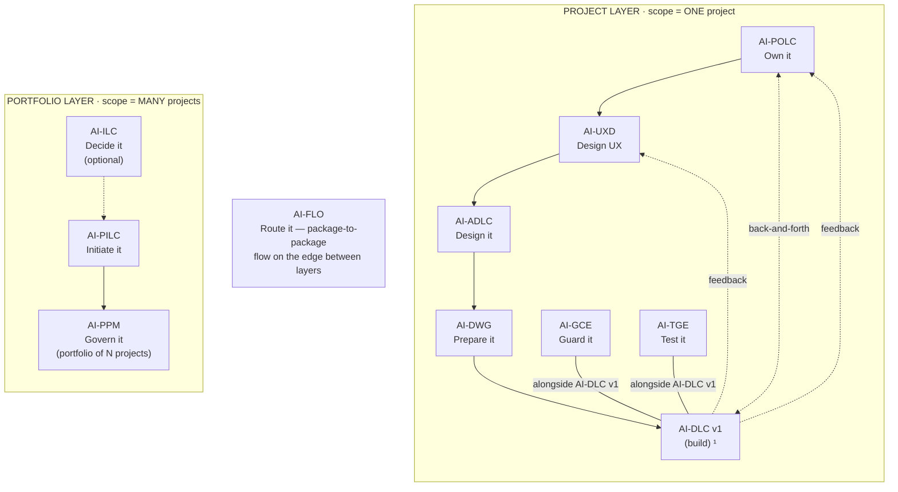

# AIFLC · The AI-* PDLC Family — Whitepaper

**From Raw Requirement to Governed Code: An AI-Driven Software Delivery Chain**

**Version:** 0.1.0-beta.1
**Author:** [Mohammad Maheri](https://www.linkedin.com/in/mohammad-maheri-8399565b)
**Date:** 2026-07-06

---

## The Problem

Enterprise software projects fail the same way, over and over:

1. **Chaotic initiation** — Requirements arrive as emails, verbal descriptions, or 50-page RFPs. Teams skip governance and jump straight to building. Six months later, scope is undefined and budgets are blown.

2. **Architecture that dies on paper** — Even when architecture is properly designed, it lives in documents that developers never read. Decisions made in week one are violated by week six.

3. **The "ready to code" gap** — Between an approved architecture and a developer's first commit lies an enormous translation problem. Who converts ADR decisions into coding standards? Who enforces API contracts across 12 microservices?

4. **Governance through willpower** — Standards exist in wikis nobody reads. Conventions exist in someone's head. Enforcement happens in code reviews that are already too late.

5. **AI without structure** — Teams adopt AI assistants for code generation, but without constraints those assistants produce confident work that violates the team's own architecture. The problem isn't AI capability — it's AI direction.

---

## The Solution

AIFLC (AI Full Life Cycle) delivers the **AI-* PDLC Family** — a chain of injectable workflow packages that solve these problems in sequence. Each package trains an AI assistant to perform one discipline of software delivery — with human oversight at every decision point.

The family spans **ten packages across two layers** — a Portfolio layer that reasons across many projects and a Project layer that executes one — joined by a router on the edge. Two of the ten are continuous engines rather than linear stages: **AI-FLO** (the router/orchestrator) and the quality companions **AI-GCE** and **AI-TGE**. Alongside the chain runs **AI-DFE**, a family-scoped data fabric that turns every package's output into a queryable data surface for dashboards and portfolio roll-ups.

  ¹ AI-DLC v1 = Amazon's open-source build lifecycle (not ours; we feed it).

| Layer | Package | Type | Input | Output |
|-------|---------|------|-------|--------|
| Portfolio | **AI-ILC** ² | Interactive workflow (lifecycle) | Raw idea | Approved Idea Brief / Feature Brief |
| Portfolio | **AI-PILC** | Interactive workflow (lifecycle) | Raw requirement | Project Initiation Package (PIP) |
| Portfolio | **AI-PPM** ³ | Adaptive portfolio engine | Multiple PIPs + Approved Idea Briefs | Portfolio register + cross-project prioritization & governance |
| Edge | **AI-FLO** ³ | Router / orchestration engine | Any package output marker | Routing decision + handoff to next package/layer |
| Project | **AI-POLC** ³ | Interactive workflow (lifecycle) | PIP | Product Backlog Package (PBP) |
| Project | **AI-UXD** ³ | Interactive workflow (lifecycle) | PIP + PBP | UX Design Package (UXP): personas/journeys, IA, user flows, design system + tokens, accessibility baseline |
| Project | **AI-ADLC** | Interactive workflow (lifecycle) | PIP + PBP + UXP | Architecture Package (AP) |
| Project | **AI-DWG** | One-time generator | AP + PBP + UXP | Ready-to-code development workspace (DW) |
| Project | **AI-GCE** | Adaptive governance engine | DW (AI-DWG output) | Compliance enforcement layer |
| Project | **AI-TGE** | Test governance engine | DW / build artifacts | Test governance & quality layer |
| Project | **AI-DLC v1** ¹ | Interactive workflow (lifecycle) | DW + GCE + User Stories (from AI-POLC) | Working Software |

> ¹ **AI-DLC v1** ([awslabs/aidlc-workflows](https://github.com/awslabs/aidlc-workflows)) is NOT our product. Our chain produces the workspace AI-DLC v1 consumes.
> ² **AI-ILC** is an **optional pre-stage** (the funnel before the funnel). The chain still works without it for users who start at AI-PILC. `⇢` denotes the optional link.
> ³ All packages in this table are **built**. AI-PPM (portfolio engine), AI-FLO (router), AI-POLC (product ownership lifecycle), and AI-UXD (UX design lifecycle) were the last four — completed June 2026. Within the Project layer, **AI-POLC, AI-UXD, and AI-ADLC run sequentially** (POLC→UXD→ADLC) — each feeds the next, culminating at AI-DWG which receives all three outputs (AP + PBP + UXP). **AI-GCE and AI-TGE run alongside AI-DLC v1** as continuous quality engines; **AI-POLC ⇄ AI-DLC v1** exchange backlog/acceptance throughout delivery; and **AI-DLC v1 runtime feedback flows back to both AI-UXD and AI-POLC**. Feedback loops (ADLC→POLC cost/risk, ADLC→UXD constraints) provide iterative refinement without changing the forward sequence.

> **AI-DFE** is a family-scoped **companion**, not a chain row. It gathers each package's markdown output, shapes it into structured JSON, and serves it from one read-point (`REGISTRY.json`) so dashboards and portfolio roll-ups get clean machine-readable data without knowing where the raw files live. Like AI-FLO, it runs alongside the whole family rather than as a linear step.

---

## How It Works

### The Chain Model

Each package's output becomes the next package's input. Decisions flow forward — never lost, never repeated, never re-asked.

A requirement captured in AI-PILC becomes a constraint in AI-ADLC. A technology decision in AI-ADLC becomes a steering rule in AI-DWG. A steering rule in AI-DWG becomes an enforcement hook in AI-GCE. By the time a developer opens their IDE, every constraint is alive — enforced by AI, traceable to its origin.

### Human-in-the-Loop at Every Stage

No package auto-progresses. Every stage has a gate. The human makes decisions; the AI produces structured output from those decisions. This is not autonomous AI — it's AI as a disciplined collaborator.

### Standalone or Chained

Each package works independently:
- Have requirements but no charter? Start with AI-PILC.
- Already have architecture docs from another process? Feed them to AI-DWG directly.
- Already have a workspace with steering files? Run AI-GCE to add compliance.

The chain is the optimal path. But each link stands alone.

---

## Key Differentiators

### 1. Methodology, Not Magic

Each package embeds proven methodology — industry-standard project-governance discipline for initiation, C4/ADR for architecture, prescriptive governance for compliance. The AI doesn't invent process; it executes established process consistently.

### 2. Injectable

These are not SaaS products or IDE plugins. They are markdown files — steering rules and templates — that inject into any AI-capable IDE. Kiro, Amazon Q Developer, Cursor, Cline, Claude Code, GitHub Copilot. The package doesn't own your toolchain; it augments it.

### 3. Traceable

Every output traces to its source. Every steering rule traces to an architecture decision. Every compliance hook traces to a steering rule. The chain provides full lineage from requirement to enforcement.

### 4. Progressive

Nothing is big-bang. AI-PILC has adaptive depth (Minimal/Standard/Comprehensive). AI-GCE has three compliance tiers (Day 0 → Sprint 2+ → Pre-Release). Teams adopt at their own pace.

### 5. Brownfield-Aware

Every package handles "what if something exists already?" — not as an afterthought, but as a first-class operating mode. Real enterprises extend existing systems; the chain respects that.

### 6. Non-Destructive

Reconciliation modes (AI-DWG, AI-GCE) detect and preserve team customizations. Re-derivation after architecture changes updates only what's affected. Human additions are never overwritten.

---

## Who It's For

| Role | Value |
|------|-------|
| **CTO / VP Engineering** | Consistent architectural governance across all projects without manual policing |
| **PMO / Project Manager** | Structured initiation that produces governance-board-ready documents in hours, not weeks |
| **Solution Architect** | Architecture decisions that flow into enforceable rules — not documents that get ignored |
| **Platform Engineer** | Ready-to-code workspaces generated from architecture, not hand-crafted per project |
| **Tech Lead / Staff Engineer** | Team compliance that's automated and traceable, not dependent on code review heroics |
| **Compliance Officer** | Audit trails, evidence collection, and progressive enforcement without blocking delivery |

---

## The Economics

Traditional approach:
- 2-4 weeks: Project initiation and governance setup
- 2-6 weeks: Architecture documentation
- 1-2 weeks: Workspace setup, coding standards, CI/CD config
- Ongoing: Manual compliance reviews, code review enforcement, wiki maintenance

With the AI-* PDLC Family:
- 1-3 days: AI-PILC produces a complete Project Initiation Package
- 2-5 days: AI-ADLC produces a comprehensive Architecture Package
- Minutes: AI-DWG generates the entire workspace
- Minutes: AI-GCE derives the entire compliance layer

The saving isn't just time. It's consistency, traceability, and zero drift between what was decided and what gets enforced.

---

## Getting Started

Each package is available independently. Pick the one that matches your starting point:

| Starting Point | Package to Use |
|----------------|----------------|
| "I have an idea to evaluate" | [AI-ILC](../ai-ilc/) |
| "I have a vague requirement" | [AI-PILC](../ai-pilc/) |
| "I'm managing multiple projects" | [AI-PPM](../ai-ppm/) |
| "I need a governed product backlog" | [AI-POLC](../ai-polc/) |
| "I need UX design that reaches the code" | [AI-UXD](../ai-uxd/) |
| "I have requirements, need architecture" | [AI-ADLC](../ai-adlc/) |
| "I have architecture, need a workspace" | [AI-DWG](../ai-dwg/) |
| "I have a workspace, need compliance" | [AI-GCE](../ai-gce/) |
| "I need test governance and coverage accountability" | [AI-TGE](../ai-tge/) |
| "I want my family output as queryable data" | [AI-DFE](../ai-dfe/) |

Each package includes platform-specific installation instructions for Kiro, Amazon Q Developer, Cursor, Cline, Claude Code, and GitHub Copilot.

---

## License

**Apache License 2.0 with Attribution Addendum.** Free to use for personal, commercial, educational, and organizational purposes. Modify and distribute freely. One requirement:

> Any distributed product substantially based on this work must include:
> *"Built on AIFLC by Mohammad Maheri — [LinkedIn](https://www.linkedin.com/in/mohammad-maheri-8399565b)"*

See [LICENSE](../LICENSE), [NOTICE](../NOTICE), and [LICENSING_FAQ](../LICENSING_FAQ.md) for full details.

**Copyright:** © 2026 Mohammad Maheri

---

*Created by Mohammad Maheri — because enterprise software deserves better than chaos.*
