<!-- GENERATED FILE: edit this narrative template and GAEP-REG-014, then run npm run render:guideline. -->

# GAEP Product-to-Operations Guideline

### Why use this Guide

Use this Guide to start a governed Product workspace, understand what GAEP needs from you now, and compare current evidence with the intended Product-to-Operations operating model without confusing candidates, plans, or market claims with approved truth.

It is for first-time users, Product leaders, practitioners, reviewers, and maintainers. **[Start here with the approximately three-minute route](#2-start-here)**; continue only when you need checkpoint, roadmap, market, methodology, or projection detail.

<!-- BEGIN GENERATED:PROJECTION_HEADER -->
> **Evidence boundary:** This Guide is generated from GAEP-REG-011 v0.4.0, GAEP-REG-013 v0.2.1, and the installed runtime presentation contract. Exact digests remain in the collapsed maintainer appendix.
>
> **Authority:** Proposed, not approved, and not published. This Guide does not accept GAEP, authorize rollout, or convert evidence into organizational authority.
<!-- END GENERATED:PROJECTION_HEADER -->

This is the maintained, human-facing GAEP Product surface bundled with the VS Code extension. It uses four progressive layers: stop after the layer that answers your question, or continue for evidence and maintenance detail.

## Contents

- [1. Executive orientation](#1-executive-orientation)
- [2. Start here](#2-start-here)
- [3. Practitioner guide](#3-practitioner-guide)
- [4. Methodology and maintainer appendix](#4-methodology-and-maintainer-appendix)

<!-- BEGIN HAND-AUTHORED NARRATIVE -->

## 1. Executive orientation

_For executives, Product leaders, and evaluation sponsors · about 5 minutes_

### What GAEP is — and is not

GAEP is a proposed evidence-governed Product-to-Operations decision system. It keeps Product intent, Initiative decisions, sources, architecture, design, delivery, and operating evidence connected while preserving explicit human authority.

GAEP is not a coding-agent leaderboard, an automatic approval system, a replacement for specialist tools, or evidence that an outcome has been achieved. Current repository behavior, Product Owner acceptance, organizational authorization, market evidence, and future plans are separate dimensions.

<!-- BEGIN GENERATED:EXECUTIVE_FACTS -->
**Evidence snapshot:** 15 evaluated Products/projects · 30 vendor-neutral capabilities · 450 evidence-bounded benchmark cells · 16 assessed methodology/reference sources · 7 adoption scenarios.

**Current GAEP repository maturity:**

- 6 implemented and automated-tested
- 11 implemented, awaiting Product Owner acceptance
- 11 partial
- 2 planned/deferred
- 0 approved or published by this projection
<!-- END GENERATED:EXECUTIVE_FACTS -->

### The operating model in one view

<!-- BEGIN GENERATED:EXECUTIVE_OPERATING_MODEL -->
<!-- GAEP-VISUAL:executive-operating-model -->

**Evidence-governed operating model**

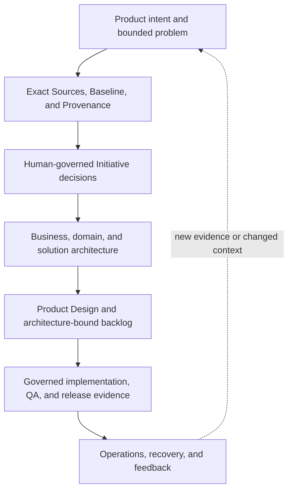
<!-- END GENERATED:EXECUTIVE_OPERATING_MODEL -->

The thread is intentionally vertical: evidence grounds a candidate; a human reviews and decides; committed truth constrains downstream work; runtime feedback can trigger a new governed change. Skipping a decision does not silently turn it into “not applicable.”

### Authority and evidence boundary

<!-- BEGIN GENERATED:AUTHORITY_LOOP -->
<!-- GAEP-VISUAL:authority-loop -->

**Human authority loop**

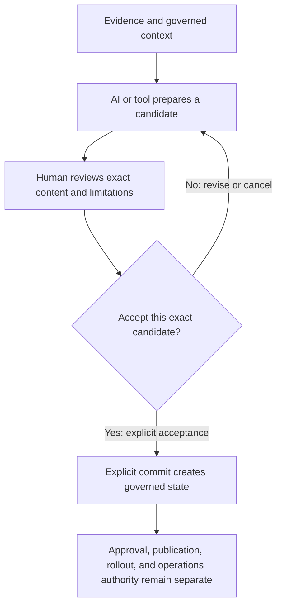
<!-- END GENERATED:AUTHORITY_LOOP -->

AI and tools may propose, challenge, summarize, compare, and prepare evidence. A human remains accountable for acceptance, commit, approval, publication, rollout, and organizational authority. “Implemented and automated-tested” is repository evidence—not Product Owner acceptance, enterprise readiness, security certification, compliance, production authorization, or outcome proof.

## 2. Start here

_For a first GAEP session · approximately 3 minutes_

### Your approximately three-minute first session

Open **GAEP: Open Guide** from the Command Palette at any time. In Chat, address `@gaep`; commands below are verified against the extension package during generation.

<!-- BEGIN GENERATED:QUICK_START_FLOW -->
<!-- GAEP-VISUAL:quick-start-flow -->

**First-session source-first path**

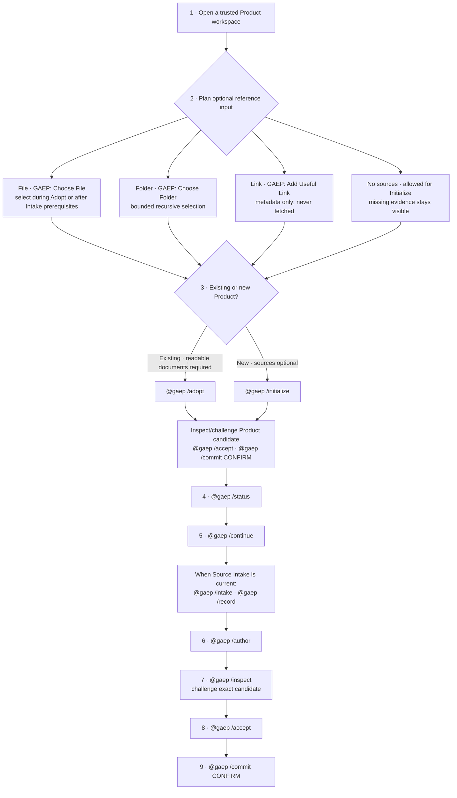

#### What the four source paths actually do

| Path | What it does | What it does not do |
|---|---|---|
| **File** · `GAEP: Choose File` | Stages one or more supported files for the active `/adopt` or `/intake` route; the route reads bounded content and reports extraction limits. | Selection alone does not reason over content, record a Source, approve truth, or create governed state. |
| **Folder** · `GAEP: Choose Folder` | Discovers supported files recursively within runtime limits for the active route. | It does not make every file relevant, authoritative, readable, or approved. |
| **Useful Link** · `GAEP: Add Useful Link` | Records a portable, non-governed HTTP(S) reference label, URL, note, and added-at metadata. | GAEP never fetches or reads it. Link-only input is not content evidence unless exact content is separately made available and reviewed. |
| **No sources** | Lets a new Product proceed through `@gaep /initialize`; missing evidence remains explicit. | Current `@gaep /adopt` cannot fast-start an existing Product without readable documents, and `@gaep /intake` waits for Product, Initiative, and applicability prerequisites. |

#### Do not conflate these boundaries

1. **Select/attach** — chooses bytes or records link metadata; no reasoning or governance occurs.
2. **Reason over exact attached content** — `@gaep /adopt` or, when prerequisites are current, `@gaep /intake`; this creates an advisory review, not a Source.
3. **Record reviewed candidate Sources** — `@gaep /record`, or the explicit post-Adopt binding route after an Initiative exists; candidates remain non-authoritative.
4. **Accept an exact proposal** — `@gaep /accept` records the human decision for the displayed candidate; it is not yet governed commit state.
5. **Commit governed state** — `@gaep /commit CONFIRM` persists the exact accepted proposal. Approval, publication, rollout, release, production, security, and compliance authority remain separate.
<!-- END GENERATED:QUICK_START_FLOW -->

AI-generated and document-derived candidates are not governed merely because they look complete. Review the exact displayed candidate and its limitations, challenge or revise it, accept it explicitly, and commit it explicitly. Missing evidence, blockers, and open questions remain visible.

### Previous, Current, and Next

<!-- BEGIN GENERATED:CHECKPOINT_POSITION_EXAMPLE -->
<!-- GAEP-VISUAL:checkpoint-position-example -->

**Previous, Current, and Next example — not live workspace state**

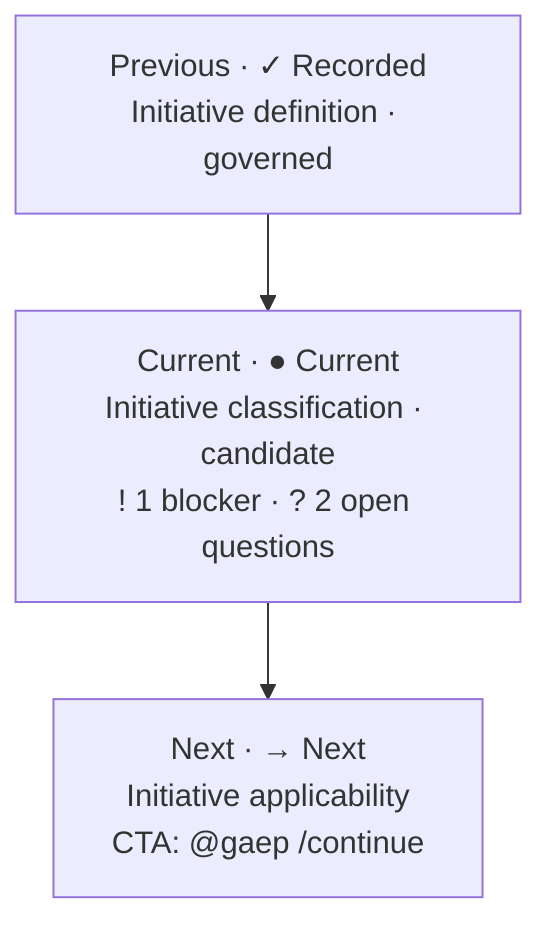

> **Static example, not live state.** Open Product Studio or run `@gaep /status` for the actual workspace position, candidate/governed status, blockers, attention count, open questions, and next valid CTA.
<!-- END GENERATED:CHECKPOINT_POSITION_EXAMPLE -->

### Checkpoint states and attention indicators

<!-- BEGIN GENERATED:STATE_LEGEND -->
Primary progression state and attention indicators are separate. For example, a governed **Recorded** checkpoint may also carry **Needs attention**; a candidate may carry **2 open questions** without becoming governed.

#### Primary progression states

<strong>✓ Recorded</strong> · `complete`

- **Meaning:** A governed checkpoint revision is recorded for the current Product context.
- **Content:** governed.
- **Your action:** Review the recorded values and revise them when evidence or context changes.
- **Progression:** possible-subject-to-downstream-prerequisites.
- **Persists:** The governed revision, evidence bindings, and audit history persist.
- **Does not authorize:** Recording does not grant approval, publication, readiness, rollout, release, or production authority.

<strong>◆ Candidate ready for review</strong> · `candidate-ready`

- **Meaning:** A bounded proposal exists, but it has not become governed state.
- **Content:** candidate.
- **Your action:** Inspect the exact candidate, challenge it, and either revise, reject, or explicitly accept it.
- **Progression:** review-required.
- **Persists:** Only candidate metadata and evidence bindings persist until an explicit governed commit.
- **Does not authorize:** A candidate does not approve itself and does not authorize downstream execution.

<strong>! Needs decisions</strong> · `needs-decisions`

- **Meaning:** A candidate is incomplete because one or more accountable human decisions remain open.
- **Content:** candidate.
- **Your action:** Resolve the named decisions or record them explicitly as unresolved with an owner.
- **Progression:** bounded-work-may-continue-when-runtime-allows.
- **Persists:** The candidate, missing-decision list, and evidence digests persist.
- **Does not authorize:** An unresolved decision is not an implied approval or waiver.

<strong>⏸ Waiting for prerequisite</strong> · `blocked-by-prerequisite`

- **Meaning:** The checkpoint cannot validly progress until a named governed prerequisite is satisfied.
- **Content:** candidate-or-empty.
- **Your action:** Open the prerequisite checkpoint and complete or explicitly resolve its required work.
- **Progression:** not-possible.
- **Persists:** Any bounded candidate and the exact prerequisite reason persist.
- **Does not authorize:** A blocked checkpoint cannot be treated as complete, approved, or ready.

<strong>● Current</strong> · `current`

- **Meaning:** This is the first currently actionable checkpoint in the live runtime projection.
- **Content:** not-yet-governed.
- **Your action:** Use the displayed next valid action to start or resume the checkpoint.
- **Progression:** possible.
- **Persists:** No governed checkpoint content persists until its workflow is explicitly committed.
- **Does not authorize:** Being current is navigation state, not approval or readiness.

<strong>→ Next</strong> · `next`

- **Meaning:** This is the next valid checkpoint selected by the live Product Journey projection.
- **Content:** not-yet-governed.
- **Your action:** Use the displayed CTA when you are ready to continue.
- **Progression:** possible.
- **Persists:** The navigation projection is recomputed from governed and candidate state.
- **Does not authorize:** Next does not mean approved, ready, or mandatory.

<strong>○ Not started</strong> · `not-started`

- **Meaning:** No governed revision or reviewable candidate exists for this checkpoint in the current context.
- **Content:** none.
- **Your action:** Complete earlier prerequisites, then start the checkpoint when it becomes the next valid action.
- **Progression:** not-currently-actionable.
- **Persists:** No checkpoint content is created merely by displaying this state.
- **Does not authorize:** Absence of work is not a negative finding, rejection, or waiver.

#### Attention indicators

<strong>! Needs attention</strong> · overlay `needs-attention`

- **Meaning:** Recorded or candidate content has a stale, incomplete, conflicting, or otherwise reviewable condition.
- **Your action:** Use the enabled resolution action and preserve the prior revision until a replacement is committed.
- **Progression:** depends-on-the-named-condition.
- **Persists:** The prior state and the attention reason persist.
- **Does not authorize:** Attention is not approval, rejection, or automatic invalidation.

<strong>⛔ Blocked</strong> · overlay `blocked`

- **Meaning:** A blocker prevents the named progression even if a candidate or earlier governed revision exists.
- **Your action:** Resolve the explicit blocker or record a scoped human decision; do not bypass it by relabeling state.
- **Progression:** not-possible.
- **Persists:** The blocker, affected checkpoint identity, and any prior revision persist.
- **Does not authorize:** Blocked work cannot be represented as ready, released, or complete.

<strong>? Unresolved / Open questions</strong> · overlay `open-questions`

- **Meaning:** One or more questions lack a reviewed answer or accountable disposition.
- **Your action:** Answer, defer with an owner and trigger, or explicitly exclude each question within scope.
- **Progression:** depends-on-question-materiality.
- **Persists:** Question text, owner, evidence basis, and disposition persist when recorded.
- **Does not authorize:** Silence, missing evidence, or an unresolved question never becomes consent or approval.

#### Exact runtime-to-presentation mapping

| Runtime machine state | Primary visible state | Attention overlay(s) |
|---|---|---|
| `complete` | ✓ Recorded | None |
| `attention-required` | ✓ Recorded | ! Needs attention |
| `candidate-ready` | ◆ Candidate ready for review | None |
| `needs-decisions` | ! Needs decisions | ? Unresolved / Open questions |
| `blocked-by-prerequisite` | ⏸ Waiting for prerequisite | ⛔ Blocked |
| `current` | ● Current | None |
| `next` | → Next | None |
| `not-started` | ○ Not started | None |

**Unknown rule:** Unknown means not assessed or not established; it never means No.

**Accessibility rule:** Every state uses text and an accessible marker; color is supplementary only.
<!-- END GENERATED:STATE_LEGEND -->

These labels are generated from the same presentation contract used by Product Studio. State is always text plus a marker; color is optional and never carries meaning alone.

## 3. Practitioner guide

_For Product, architecture, design, engineering, assurance, and operations practitioners · about 20 minutes_

### A. Current Runtime

This view contains only behavior and terminology that exist in the current repository/runtime. Its count and order are a versioned snapshot, not permanent architecture.

<!-- BEGIN GENERATED:CURRENT_RUNTIME -->
<!-- GAEP-VISUAL:current-runtime -->

**Current runtime checkpoint inventory**

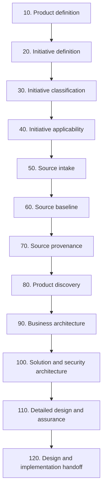

| Stable checkpoint ID | Order and current label | Current prerequisites | Implemented CTA, maturity, and limitation |
|---|---|---|---|
| `product-definition` | 10 · Product definition | None | @gaep /initialize; @gaep /adopt; Edit Product definition implemented-awaiting-product-owner-acceptance Records a Product boundary; it does not establish market need or approve investment. |
| `initiative-definition` | 20 · Initiative definition | product-definition | @gaep /continue; Edit Initiative definition implemented-awaiting-product-owner-acceptance Bounds a change; it does not authorize execution or funding. |
| `initiative-classification` | 30 · Initiative classification | initiative-definition | @gaep /classification; Resolve open questions implemented-awaiting-product-owner-acceptance Classification is scoped evidence, not an approval or risk waiver. |
| `initiative-applicability` | 40 · Initiative applicability | initiative-classification | @gaep /applicability; Resolve pending decisions implemented-awaiting-product-owner-acceptance Applicability records scoped decisions; it does not grant approval, readiness, or execution authority. |
| `source-intake` | 50 · Source intake | initiative-definition | @gaep /intake; @gaep /record; Bind reviewed Sources to Initiative implemented-awaiting-product-owner-acceptance Attachment and extraction do not establish Source correctness, authority, or Baseline membership. |
| `source-baseline` | 60 · Source baseline | source-intake | @gaep /baseline implemented-awaiting-product-owner-acceptance A Baseline freezes membership and revisions; it does not approve content or establish precedence. |
| `source-provenance` | 70 · Source provenance | source-intake | @gaep /provenance implemented-awaiting-product-owner-acceptance Provenance records lineage and limitations; it does not establish correctness, authority, or Baseline membership. |
| `product-discovery` | 80 · Product discovery | initiative-applicability, source-intake | @gaep /author; Review Product discovery implemented-awaiting-product-owner-acceptance Projects bounded discovery records; it does not prove user demand or business viability. |
| `business-architecture` | 90 · Business architecture | product-discovery | @gaep /author; Review Business architecture implemented-awaiting-product-owner-acceptance Recorded models remain bounded by evidence and do not certify organizational design. |
| `solution-security-architecture` | 100 · Solution and security architecture | business-architecture | @gaep /author; Review Solution and security architecture implemented-awaiting-product-owner-acceptance Architecture records do not create security, compliance, or deployment approval. |
| `detailed-design-assurance` | 110 · Detailed design and assurance | solution-security-architecture | @gaep /author; Review Detailed design and assurance implemented-awaiting-product-owner-acceptance Models and assurance evidence do not establish release, production, security, or compliance readiness. |
| `p0-p4-readiness` | 120 · P0–P4 readiness and P5 handoff | detailed-design-assurance | @gaep /author; Review P0–P4 readiness and P5 handoff implemented-awaiting-product-owner-acceptance Legacy runtime wording remains implemented. Product Design is the target tool-neutral abstraction; migration is not implemented. |

> **Compatibility — `p0-p4-readiness`:** Current runtime compatibility only: the legacy Pre-Figma/P0–P4 wording has not yet migrated to the target Product Design abstraction.
<!-- END GENERATED:CURRENT_RUNTIME -->

### B. Target Product-to-Operations Operating Model

The lifecycle is split into three linked vertical views so it remains readable in narrow and wide VS Code panes. Every status is derived conservatively from the exact capability maturity records in the bound P02 registry.

<!-- BEGIN GENERATED:TARGET_LIFECYCLE -->
**Conservative target maturity vocabulary:**

- [UN] Unknown / not assessed · `unknown-not-assessed`
- [PD] Planned / deferred · `planned-deferred-coming-soon`
- [CP] Candidate / proposed · `candidate-proposed`
- [PT] Partial · `partial`
- [IA] Implemented; awaiting Product Owner acceptance · `implemented-awaiting-product-owner-acceptance`
- [IT] Implemented and automated-tested · `implemented-and-automated-tested`

<!-- GAEP-VISUAL:lifecycle-discover-define -->

**Target lifecycle: discover and define**

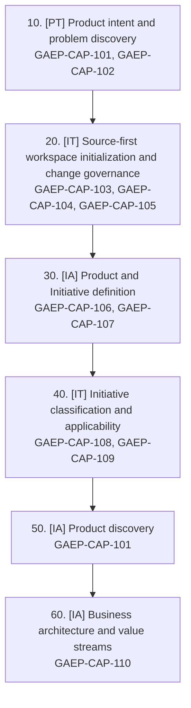

↓ Continue to the next target segment

<!-- GAEP-VISUAL:lifecycle-architecture-plan -->

**Target lifecycle: architecture and planning**

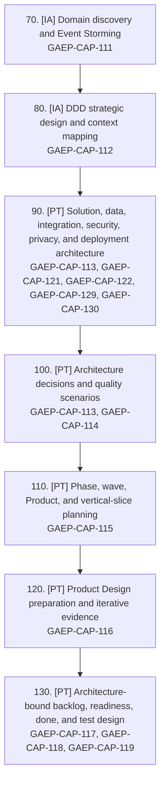

↓ Continue to the next target segment

<!-- GAEP-VISUAL:lifecycle-deliver-operate -->

**Target lifecycle: delivery and operations**

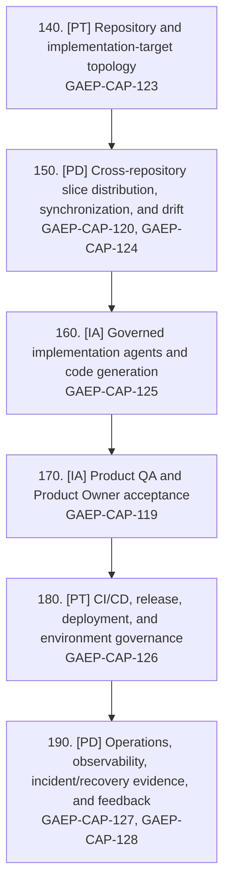

<strong>Exact capability-to-node derivation</strong>

| # | Target node | Conservative node state | Source capability states |
|---:|---|---|---|
| 10 | Product intent and problem discovery | [PT] Partial | GAEP-CAP-101 implemented-awaiting-product-owner-acceptance; GAEP-CAP-102 partial |
| 20 | Source-first workspace initialization and change governance | [IT] Implemented and automated-tested | GAEP-CAP-103 implemented-and-automated-tested; GAEP-CAP-104 implemented-and-automated-tested; GAEP-CAP-105 implemented-and-automated-tested |
| 30 | Product and Initiative definition | [IA] Implemented; awaiting Product Owner acceptance | GAEP-CAP-106 implemented-awaiting-product-owner-acceptance; GAEP-CAP-107 implemented-and-automated-tested |
| 40 | Initiative classification and applicability | [IT] Implemented and automated-tested | GAEP-CAP-108 implemented-and-automated-tested; GAEP-CAP-109 implemented-and-automated-tested |
| 50 | Product discovery | [IA] Implemented; awaiting Product Owner acceptance | GAEP-CAP-101 implemented-awaiting-product-owner-acceptance |
| 60 | Business architecture and value streams | [IA] Implemented; awaiting Product Owner acceptance | GAEP-CAP-110 implemented-awaiting-product-owner-acceptance |
| 70 | Domain discovery and Event Storming | [IA] Implemented; awaiting Product Owner acceptance | GAEP-CAP-111 implemented-awaiting-product-owner-acceptance |
| 80 | DDD strategic design and context mapping | [IA] Implemented; awaiting Product Owner acceptance | GAEP-CAP-112 implemented-awaiting-product-owner-acceptance |
| 90 | Solution, data, integration, security, privacy, and deployment architecture | [PT] Partial | GAEP-CAP-113 implemented-awaiting-product-owner-acceptance; GAEP-CAP-121 partial; GAEP-CAP-122 partial; GAEP-CAP-129 implemented-awaiting-product-owner-acceptance; GAEP-CAP-130 partial |
| 100 | Architecture decisions and quality scenarios | [PT] Partial | GAEP-CAP-113 implemented-awaiting-product-owner-acceptance; GAEP-CAP-114 partial |
| 110 | Phase, wave, Product, and vertical-slice planning | [PT] Partial | GAEP-CAP-115 partial |
| 120 | Product Design preparation and iterative evidence | [PT] Partial | GAEP-CAP-116 partial |
| 130 | Architecture-bound backlog, readiness, done, and test design | [PT] Partial | GAEP-CAP-117 partial; GAEP-CAP-118 partial; GAEP-CAP-119 implemented-awaiting-product-owner-acceptance |
| 140 | Repository and implementation-target topology | [PT] Partial | GAEP-CAP-123 partial |
| 150 | Cross-repository slice distribution, synchronization, and drift | [PD] Planned / deferred | GAEP-CAP-120 implemented-awaiting-product-owner-acceptance; GAEP-CAP-124 planned-deferred-coming-soon |
| 160 | Governed implementation agents and code generation | [IA] Implemented; awaiting Product Owner acceptance | GAEP-CAP-125 implemented-awaiting-product-owner-acceptance |
| 170 | Product QA and Product Owner acceptance | [IA] Implemented; awaiting Product Owner acceptance | GAEP-CAP-119 implemented-awaiting-product-owner-acceptance |
| 180 | CI/CD, release, deployment, and environment governance | [PT] Partial | GAEP-CAP-126 partial |
| 190 | Operations, observability, incident/recovery evidence, and feedback | [PD] Planned / deferred | GAEP-CAP-127 planned-deferred-coming-soon; GAEP-CAP-128 implemented-awaiting-product-owner-acceptance |

<!-- END GENERATED:TARGET_LIFECYCLE -->

Architecture and DDD precede architecture-bound backlog. Product Design is the canonical tool-neutral target stage. Repository distribution, CI/CD governance, and runtime feedback remain visibly partial or planned where the evidence says so.

### C. Transition Roadmap

<!-- BEGIN GENERATED:TRANSITION_ROADMAP -->
<!-- GAEP-VISUAL:transition-roadmap -->

**Current-to-target transition**

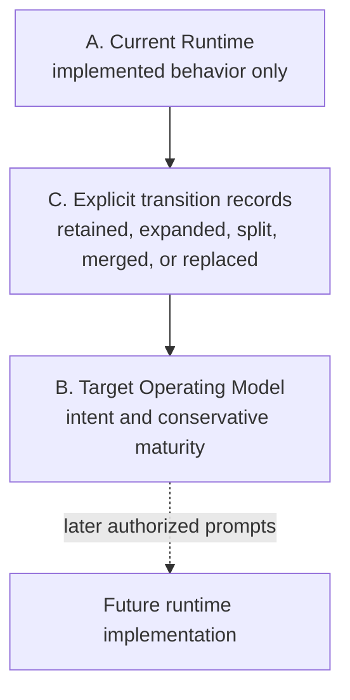

| Current stable ID | Transition and target | Current evidence | Target intent, dependency, and status |
|---|---|---|---|
| `product-definition` | expanded `lifecycle-01`, `lifecycle-03` | implemented-awaiting-product-owner-acceptance current-runtime-implemented-target-partial | Expand Product definition into evidence-bound intent, discovery, and durable Product context. Dependency: Product Owner acceptance and future runtime authorization Migration: planned; PO acceptance: unresolved |
| `initiative-definition` | retained `lifecycle-03` | implemented-awaiting-product-owner-acceptance current-runtime-implemented-target-partial | Retain stable Initiative identity while expanding context and migration metadata. Dependency: Product Owner acceptance Migration: planned; PO acceptance: unresolved |
| `initiative-classification` | retained `lifecycle-04` | implemented-awaiting-product-owner-acceptance current-runtime-implemented-target-partial | Retain classification and integrate it with target applicability governance. Dependency: Product Owner acceptance Migration: planned; PO acceptance: unresolved |
| `initiative-applicability` | expanded `lifecycle-04` | implemented-awaiting-product-owner-acceptance current-runtime-implemented-target-partial | Expand applicability into the complete target operating-model crosswalk. Dependency: Canonical coverage and Product Owner decisions Migration: planned; PO acceptance: unresolved |
| `source-intake` | expanded `lifecycle-02` | implemented-awaiting-product-owner-acceptance current-runtime-implemented-target-partial | Add explicit source-change lifecycle and downstream revalidation without inferring truth or supersession. Dependency: Source change/removal contract gap Migration: planned; PO acceptance: unresolved |
| `source-baseline` | merged `lifecycle-02` | implemented-awaiting-product-owner-acceptance current-runtime-implemented-target-partial | Remain a distinct governed record inside a unified target source-governance node. Dependency: Source lifecycle UX Migration: planned; PO acceptance: unresolved |
| `source-provenance` | merged `lifecycle-02` | implemented-awaiting-product-owner-acceptance current-runtime-implemented-target-partial | Remain a distinct governed record inside a unified target source-governance node. Dependency: Source lifecycle UX Migration: planned; PO acceptance: unresolved |
| `product-discovery` | expanded `lifecycle-05` | implemented-awaiting-product-owner-acceptance current-runtime-implemented-target-partial | Expand governed discovery records and iterative evidence review. Dependency: Product Owner acceptance Migration: planned; PO acceptance: unresolved |
| `business-architecture` | split `lifecycle-06`, `lifecycle-07`, `lifecycle-08` | implemented-awaiting-product-owner-acceptance current-runtime-implemented-target-partial | Separate business architecture, Event Storming/domain discovery, and DDD strategic design. Dependency: Target checkpoint implementation Migration: planned; PO acceptance: unresolved |
| `solution-security-architecture` | split `lifecycle-09`, `lifecycle-10` | implemented-awaiting-product-owner-acceptance current-runtime-implemented-target-partial | Separate architecture domains from architecture decisions and quality scenarios. Dependency: Target checkpoint implementation Migration: planned; PO acceptance: unresolved |
| `detailed-design-assurance` | split `lifecycle-10`, `lifecycle-11`, `lifecycle-12`, `lifecycle-13` | implemented-awaiting-product-owner-acceptance current-runtime-implemented-target-partial | Split planning, Product Design, backlog, readiness, done, test, and assurance concerns. Dependency: Target checkpoint implementation Migration: planned; PO acceptance: unresolved |
| `p0-p4-readiness` | replaced-by-tool-neutral-abstraction `lifecycle-12`, `lifecycle-13`, `lifecycle-14`, `lifecycle-15`, `lifecycle-16`, `lifecycle-17`, `lifecycle-18`, `lifecycle-19` | implemented-awaiting-product-owner-acceptance current-runtime-implemented-target-planned | Replace legacy handoff wording with tool-neutral Product Design and explicit delivery/operations nodes. Dependency: Compatibility migration and later authorized implementation prompts Migration: planned; PO acceptance: unresolved |
<!-- END GENERATED:TRANSITION_ROADMAP -->

The roadmap is not implementation evidence. “Planned” means later authorized work is required; it does not rename or replace current runtime terminology.

### Canonical roadmap coverage audit

<!-- BEGIN GENERATED:ROADMAP_COVERAGE -->
Every current canonical capability maps to at least one target node. Proposed Product Owner detail that exceeds accepted P01/P02 granularity remains an explicit, unaccepted gap.

<strong>Show all canonical capability mappings</strong>

| Capability | Target node(s) | Current checkpoint(s), if any | Current maturity and source |
|---|---|---|---|
| GAEP-CAP-101 Product intent and problem discovery | `lifecycle-01`, `lifecycle-05` | `product-definition`, `product-discovery` | [IA] Implemented; awaiting Product Owner acceptance Canonical source: GAEP-REG-013 |
| GAEP-CAP-102 Guided lifecycle navigation and user onboarding | `lifecycle-01` | `product-definition` | [PT] Partial Canonical source: GAEP-REG-013 |
| GAEP-CAP-103 Source intake and reference grounding | `lifecycle-02` | `source-intake`, `source-baseline`, `source-provenance` | [IT] Implemented and automated-tested Canonical source: GAEP-REG-013 |
| GAEP-CAP-104 Source baseline and version control | `lifecycle-02` | `source-intake`, `source-baseline`, `source-provenance` | [IT] Implemented and automated-tested Canonical source: GAEP-REG-013 |
| GAEP-CAP-105 Source provenance and lineage | `lifecycle-02` | `source-intake`, `source-baseline`, `source-provenance` | [IT] Implemented and automated-tested Canonical source: GAEP-REG-013 |
| GAEP-CAP-106 Human authority and propose/review/accept/commit separation | `lifecycle-03` | `product-definition`, `initiative-definition` | [IA] Implemented; awaiting Product Owner acceptance Canonical source: GAEP-REG-013 |
| GAEP-CAP-107 Initiative definition and change boundary | `lifecycle-03` | `product-definition`, `initiative-definition` | [IT] Implemented and automated-tested Canonical source: GAEP-REG-013 |
| GAEP-CAP-108 Initiative classification, risk and exposure | `lifecycle-04` | `initiative-classification`, `initiative-applicability` | [IT] Implemented and automated-tested Canonical source: GAEP-REG-013 |
| GAEP-CAP-109 Initiative applicability and lifecycle tailoring | `lifecycle-04` | `initiative-classification`, `initiative-applicability` | [IT] Implemented and automated-tested Canonical source: GAEP-REG-013 |
| GAEP-CAP-110 Business architecture, capabilities and value streams | `lifecycle-06` | `business-architecture` | [IA] Implemented; awaiting Product Owner acceptance Canonical source: GAEP-REG-013 |
| GAEP-CAP-111 Domain discovery and EventStorming | `lifecycle-07` | `business-architecture` | [IA] Implemented; awaiting Product Owner acceptance Canonical source: GAEP-REG-013 |
| GAEP-CAP-112 DDD strategic design, bounded contexts and context mapping | `lifecycle-08` | `business-architecture` | [IA] Implemented; awaiting Product Owner acceptance Canonical source: GAEP-REG-013 |
| GAEP-CAP-113 Architecture views, quality attributes and ADRs | `lifecycle-09`, `lifecycle-10` | `solution-security-architecture`, `detailed-design-assurance` | [IA] Implemented; awaiting Product Owner acceptance Canonical source: GAEP-REG-013 |
| GAEP-CAP-114 Architecture-before-slice implementation sequencing | `lifecycle-10` | `solution-security-architecture`, `detailed-design-assurance` | [PT] Partial Canonical source: GAEP-REG-013 |
| GAEP-CAP-115 Phase, wave and vertical-slice planning | `lifecycle-11` | `detailed-design-assurance` | [PT] Partial Canonical source: GAEP-REG-013 |
| GAEP-CAP-116 Tool-neutral Product Design preparation and handoff | `lifecycle-12` | `detailed-design-assurance`, `p0-p4-readiness` | [PT] Partial Canonical source: GAEP-REG-013 |
| GAEP-CAP-117 Architecture-bound backlog generation | `lifecycle-13` | `detailed-design-assurance`, `p0-p4-readiness` | [PT] Partial Canonical source: GAEP-REG-013 |
| GAEP-CAP-118 Acceptance criteria, Definition of Ready and Definition of Done | `lifecycle-13` | `detailed-design-assurance`, `p0-p4-readiness` | [PT] Partial Canonical source: GAEP-REG-013 |
| GAEP-CAP-119 Test design, test cases and quality assurance | `lifecycle-13`, `lifecycle-17` | `detailed-design-assurance`, `p0-p4-readiness` | [IA] Implemented; awaiting Product Owner acceptance Canonical source: GAEP-REG-013 |
| GAEP-CAP-120 Requirements-to-design-to-code-to-test traceability | `lifecycle-15` | `p0-p4-readiness` | [IA] Implemented; awaiting Product Owner acceptance Canonical source: GAEP-REG-013 |
| GAEP-CAP-121 Security, privacy, policy and compliance governance | `lifecycle-09` | `solution-security-architecture` | [PT] Partial Canonical source: GAEP-REG-013 |
| GAEP-CAP-122 Data, API, event and integration contract governance | `lifecycle-09` | `solution-security-architecture` | [PT] Partial Canonical source: GAEP-REG-013 |
| GAEP-CAP-123 Repository linking and implementation topology | `lifecycle-14` | `p0-p4-readiness` | [PT] Partial Canonical source: GAEP-REG-013 |
| GAEP-CAP-124 Cross-repository slice distribution, synchronization and drift detection | `lifecycle-15` | `p0-p4-readiness` | [PD] Planned / deferred Canonical source: GAEP-REG-013 |
| GAEP-CAP-125 Implementation agents and governed code generation | `lifecycle-16` | `p0-p4-readiness` | [IA] Implemented; awaiting Product Owner acceptance Canonical source: GAEP-REG-013 |
| GAEP-CAP-126 CI/CD, release and deployment governance | `lifecycle-18` | `p0-p4-readiness` | [PT] Partial Canonical source: GAEP-REG-013 |
| GAEP-CAP-127 Runtime operations, observability, recovery and reliability | `lifecycle-19` | `p0-p4-readiness` | [PD] Planned / deferred Canonical source: GAEP-REG-013 |
| GAEP-CAP-128 Audit trail, evidence records and decision history | `lifecycle-19` | `p0-p4-readiness` | [IA] Implemented; awaiting Product Owner acceptance Canonical source: GAEP-REG-013 |
| GAEP-CAP-129 Provider/tool neutrality, adapters and extensibility | `lifecycle-09` | `solution-security-architecture` | [IA] Implemented; awaiting Product Owner acceptance Canonical source: GAEP-REG-013 |
| GAEP-CAP-130 Enterprise administration, deployment control, data residency and portability | `lifecycle-09` | `solution-security-architecture` | [PT] Partial Canonical source: GAEP-REG-013 |

<strong>Show Product Owner requirement crosswalk</strong>

| Requirement | Target node(s) | Current checkpoint(s) | Disposition and unresolved decision |
|---|---|---|---|
| GAEP-P03-REQ-001 Source-first optional onboarding | `lifecycle-01`, `lifecycle-02`, `lifecycle-03` | `product-definition`, `source-intake` | partial expanded No-source onboarding is supported; complete source-change UX remains a target gap. |
| GAEP-P03-REQ-002 Source Intake, Baseline, Provenance, and change governance | `lifecycle-02` | `source-intake`, `source-baseline`, `source-provenance` | partial expanded Explicit removal, exclusion, and supersession runtime workflows are not implemented. |
| GAEP-P03-REQ-003 Product discovery through DDD and context mapping | `lifecycle-05`, `lifecycle-06`, `lifecycle-07`, `lifecycle-08` | `product-discovery`, `business-architecture` | partial split Target nodes are modeled; runtime split is planned. |
| GAEP-P03-REQ-004 Architecture before Product Design and backlog | `lifecycle-09`, `lifecycle-10`, `lifecycle-11`, `lifecycle-12`, `lifecycle-13` | `solution-security-architecture`, `detailed-design-assurance`, `p0-p4-readiness` | partial split Legacy runtime naming remains until a separately authorized migration. |
| GAEP-P03-REQ-005 Architecture-bound backlog, readiness, done, tests, and traceability | `lifecycle-13`, `lifecycle-15`, `lifecycle-17` | `detailed-design-assurance`, `p0-p4-readiness` | partial expanded Target mappings exist; end-to-end runtime orchestration remains later work. |
| GAEP-P03-REQ-006 Repository topology and multiple implementation targets | `lifecycle-14`, `lifecycle-15` | `p0-p4-readiness` | planned-deferred-coming-soon newly-planned Detailed target-form taxonomy needs a future P02 canonical correction. |
| GAEP-P03-REQ-007 Governed implementation, source scanning, and evidence | `lifecycle-16`, `lifecycle-17` | `p0-p4-readiness` | partial expanded Future implementation prompts must preserve agent and human authority boundaries. |
| GAEP-P03-REQ-008 CI/CD, release, deployment, environments, and operations feedback | `lifecycle-18`, `lifecycle-19` | None | planned-deferred-coming-soon newly-planned No current runtime checkpoint implements the complete target behavior. |
| GAEP-P03-REQ-009 ERP is illustrative, never a universal Product assumption | `lifecycle-06`, `lifecycle-14` | None | planned-deferred-coming-soon retained-boundary All generated target wording must remain Product-neutral. |
| GAEP-P03-REQ-010 Figma remains an optional Product Design adapter | `lifecycle-12` | `p0-p4-readiness` | partial replaced-by-tool-neutral-abstraction Runtime compatibility wording remains; canonical target wording is Product Design. |
| GAEP-P03-REQ-011 Initiative classification, applicability, and unresolved decision governance | `lifecycle-04` | `initiative-classification`, `initiative-applicability` | implemented-awaiting-product-owner-acceptance expanded Current runtime behavior remains awaiting Product Owner acceptance. |

#### Proposed canonical gaps — not accepted truth

- **GAEP-P03-GAP-001 · Implementation-target form taxonomy** — proposed-unaccepted; blocks acceptance: true. GAEP-REG-013 capability taxonomy or a Product Owner-approved successor must explicitly model web, mobile, PWA, dashboard, admin, API, event, worker, integration, and multi-project topology breadth.
- **GAEP-P03-GAP-002 · Source removal, exclusion, supersession, and temporary-unavailability workflow** — proposed-unaccepted; blocks acceptance: true. A future accepted Source-governance contract and runtime prompt must define human-scoped transitions, preserved revisions, and revalidation effects.
<!-- END GENERATED:ROADMAP_COVERAGE -->

### Source lifecycle

<!-- BEGIN GENERATED:SOURCE_LINEAGE -->
<!-- GAEP-VISUAL:source-lifecycle -->

**Source Intake, Baseline, Provenance, and change review**

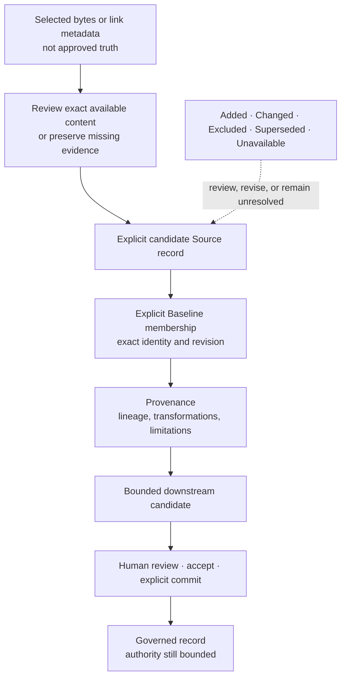

#### Three distinct records

<strong>Source Intake</strong>

- **What it means:** Reviews exact candidate material and records bounded Source metadata only when the human explicitly chooses to record it.
- **Review boundary:** Attachment metadata identifies selected bytes and extraction limits; reviewed content is the material actually made available to the advisor and human. Neither is automatically approved truth.
- **During Adopt:** Adopt reviews exact attachments to prepare a Product/Journey proposal. A committed Adopt plan preserves candidate metadata; Source records are created only after an Initiative exists and the human explicitly binds or records the candidates.
- **When it changes:** New content must remain a distinct reviewed candidate until an explicit identity/revision decision is supported and committed.
- **Does not authorize:** Selection, extraction, review, or Source recording does not establish correctness, ownership, rights, authority, Baseline membership, approval, or readiness.

<strong>Source Baseline</strong>

- **What it means:** Freezes exact Source identities, revisions, record digests, and content digests for one bounded Initiative/context.
- **Review boundary:** Membership says which exact revisions are in scope; it does not approve their content, establish precedence, or make the set complete.
- **During Adopt:** Adopt evidence does not create a Baseline. The current Candidate Source set must first be recorded and then proposed through the Baseline workflow.
- **When it changes:** Changed membership or a changed Source revision requires a reviewed revised Baseline before affected downstream work can rely on the new set.
- **Does not authorize:** A Baseline does not designate semantic authority, supersede another Source, approve a claim, or authorize downstream action.

<strong>Source Provenance</strong>

- **What it means:** Records exact lineage, locators, Source revisions, roles, transformations, derivations, omissions, uncertainty, and limitations for a bounded target.
- **Review boundary:** Provenance explains where a claim or record came from; Baseline membership only says which Source revisions were in the bounded set.
- **During Adopt:** Adopt evidence and Baseline membership do not create Provenance automatically.
- **When it changes:** Revise Source provenance means prepare and review a new lineage proposal when Sources, transformations, target revisions, limitations, or uncertainty change; preserve prior records.
- **Does not authorize:** Provenance does not establish correctness, authenticity, authority, approval, precedence, or transfer of rights.

#### Source-change matrix

| Event | Current runtime classification | Required user action | Record/revision consequence |
|---|---|---|---|
| Source added | implemented-awaiting-product-owner-acceptance | Choose File or Choose Folder during the valid Adopt/Intake route, review exact content with /adopt or /intake, then explicitly use /record or the reviewed Adopt binding action. | A new non-authoritative Source revision-one record is created, or an exact existing content digest is reused; prior Source records remain preserved. |
| Source content changed | partial | Reattach and review the changed bytes. Record them as a new candidate, keep the prior Source visible, and make the identity/revision relationship an explicit unresolved human decision. | The current Chat path creates a distinct Source candidate when the content digest is new; it does not silently revise or replace the prior Source identity. |
| Source removed or intentionally excluded | unsupported-unavailable | Keep the governed Source and history intact, record the intended exclusion and reason as an unresolved scoped decision, and pause affected progression until an authorized workflow exists. | No governed Source deletion or exclusion record is created by the installed Guide/Chat workflow; prior Source and Baseline revisions remain preserved. |
| Source superseded | unsupported-unavailable | Review and record the proposed replacement as a separate candidate, retain both Sources, and record supersession as an unresolved scoped human decision. | The proposed replacement may be recorded as a separate Source candidate; the prior Source is preserved and no supersession fact is created. |
| Source temporarily unavailable or inaccessible | partial | Keep the last reviewed revision, record the access problem as an open question/limitation, identify an owner and retry trigger, and avoid claims about unread content. | Unreadable candidate material is not recorded by Intake. Existing governed Source history remains unchanged unless a separately supported Source revision is committed. |

<strong>Source added</strong> · implemented-awaiting-product-owner-acceptance

- **What you see:** An attachment review manifest, exact content digest and extraction limitations, followed by recorded/reused Source counts after explicit recording.
- **What GAEP needs from you:** Choose File or Choose Folder during the valid Adopt/Intake route, review exact content with /adopt or /intake, then explicitly use /record or the reviewed Adopt binding action.
- **Record/revision effect:** A new non-authoritative Source revision-one record is created, or an exact existing content digest is reused; prior Source records remain preserved.
- **Baseline review:** Required before the added Source becomes a member of the bounded Initiative Source set.
- **Provenance review:** Required for claims or records that rely on the added Source.
- **Possible downstream revalidation:** Possible and expected wherever downstream evidence or decisions depend on the Source set.
- **Safe current workaround:** None required for the supported attachment path; keep missing evidence visible when a candidate cannot be read.
- **Not authorized:** Addition does not approve content, establish semantic authority, create a Baseline, or authorize downstream work.

<strong>Source content changed</strong> · partial

- **What you see:** A changed attachment produces a different content digest and can be recorded as another candidate; the engine can preserve Source revisions and detect stale Baselines, but Chat does not expose a complete identity-preserving Source revision chooser.
- **What GAEP needs from you:** Reattach and review the changed bytes. Record them as a new candidate, keep the prior Source visible, and make the identity/revision relationship an explicit unresolved human decision.
- **Record/revision effect:** The current Chat path creates a distinct Source candidate when the content digest is new; it does not silently revise or replace the prior Source identity.
- **Baseline review:** Required after a human establishes the intended current Source identity/revision set; current Chat Baseline generation includes all current Initiative Sources.
- **Provenance review:** Required where lineage, transformations, limitations, or relied-on content changed.
- **Possible downstream revalidation:** Required for affected records; prior revisions remain evidence of what earlier decisions used.
- **Safe current workaround:** Retain both candidates, mark the relationship and downstream effect unresolved, and do not claim the new bytes supersede the old Source.
- **Not authorized:** A newer filename, date, digest, or document statement does not authorize replacement or supersession.

<strong>Source removed or intentionally excluded</strong> · unsupported-unavailable

- **What you see:** No installed governed-Source removal/exclusion workflow. Removing a Useful Link affects candidate link metadata only and is not Source removal.
- **What GAEP needs from you:** Keep the governed Source and history intact, record the intended exclusion and reason as an unresolved scoped decision, and pause affected progression until an authorized workflow exists.
- **Record/revision effect:** No governed Source deletion or exclusion record is created by the installed Guide/Chat workflow; prior Source and Baseline revisions remain preserved.
- **Baseline review:** Required in the target model, but selective membership exclusion is not exposed by the current Chat Baseline workflow.
- **Provenance review:** Required in the target model for affected claims; no automatic rewrite is performed.
- **Possible downstream revalidation:** Potentially required for every dependent record and decision.
- **Safe current workaround:** Preserve history, keep the exclusion explicit and unresolved, and do not represent a stale Baseline as current.
- **Not authorized:** A file deletion, link removal, user omission, or inaccessible path does not erase governed evidence or authorize exclusion.

<strong>Source superseded</strong> · unsupported-unavailable

- **What you see:** No installed governed Source-supersession action or explicit Source supersedes relationship.
- **What GAEP needs from you:** Review and record the proposed replacement as a separate candidate, retain both Sources, and record supersession as an unresolved scoped human decision.
- **Record/revision effect:** The proposed replacement may be recorded as a separate Source candidate; the prior Source is preserved and no supersession fact is created.
- **Baseline review:** Required only after an explicit human supersession/membership decision is supported by a future authorized workflow.
- **Provenance review:** Required for every affected derivation after that decision; prior provenance stays intact.
- **Possible downstream revalidation:** Required for affected claims, decisions, architecture, design, backlog, and assurance evidence.
- **Safe current workaround:** Keep both Source candidates and the replacement intent visible; do not treat either as the current authoritative Source solely from document metadata.
- **Not authorized:** Supersession must never be inferred from filename, date, wording, location, newer content, or alleged replacement intent.

<strong>Source temporarily unavailable or inaccessible</strong> · partial

- **What you see:** The Source contract and engine can represent availability and preserve revisions, while the installed Intake flow reports unreadable attachments; Chat does not expose a complete guided revision that marks an existing Source unavailable.
- **What GAEP needs from you:** Keep the last reviewed revision, record the access problem as an open question/limitation, identify an owner and retry trigger, and avoid claims about unread content.
- **Record/revision effect:** Unreadable candidate material is not recorded by Intake. Existing governed Source history remains unchanged unless a separately supported Source revision is committed.
- **Baseline review:** Review is required if the bounded work can no longer rely on the exact member; do not silently remove it.
- **Provenance review:** Review limitations and availability wherever downstream claims depend on current access or freshness.
- **Possible downstream revalidation:** Possible when access, freshness, or content integrity affects the decision basis.
- **Safe current workaround:** Use the preserved exact revision and limitations only for claims it already supports; leave current-content conclusions Unknown until reviewed content is available.
- **Not authorized:** Temporary inaccessibility does not prove deletion, invalidity, supersession, approval, or non-support.

> **Supersession rule:** Supersession is an explicit, scoped human decision. GAEP must never infer it from filename, date, document wording, locator, content similarity, or replacement intent.
<!-- END GENERATED:SOURCE_LINEAGE -->

A Source is a reviewed reference candidate, not automatic truth. A Baseline fixes exact membership and revisions for a bounded context. Provenance records lineage and limitations. A downstream record should point to the exact evidence that informed it and preserve uncertainty that was not resolved.

For source-sensitive work, use `@gaep /intake` to reason over explicitly attached content after its runtime prerequisites are current, `@gaep /record` to preserve reviewed files as candidate Sources, `@gaep /baseline` to propose exact membership, and `@gaep /provenance` to propose conservative lineage. Each proposal still requires review, acceptance, and explicit commit.

### Market and capability decision support

<!-- BEGIN GENERATED:MARKET_GUIDE -->
Bound to **GAEP-REG-013 v0.2.1**, research snapshot **2026-08-08**. The benchmark has **15 Products/projects × 30 capabilities = 450 cells**.

#### Evaluated Products and projects

<!-- BEGIN GENERATED:MARKET_PRODUCTS -->
- **GAEP-PRD-001 · [Kiro](https://kiro.dev/docs/)** — GAEP-CAT-002, GAEP-CAT-003 · reviewed 2026-08-08 · active-current
- **GAEP-PRD-002 · [GitHub Spec Kit](https://github.github.com/spec-kit/index.html)** — GAEP-CAT-002 · reviewed 2026-08-08 · active-current
- **GAEP-PRD-003 · [OpenAI Codex](https://openai.com/index/introducing-the-codex-app/)** — GAEP-CAT-003 · reviewed 2026-08-08 · active-current
- **GAEP-PRD-004 · [Claude Code](https://code.claude.com/docs/en/overview)** — GAEP-CAT-003 · reviewed 2026-08-08 · active-current
- **GAEP-PRD-005 · [GitHub Copilot](https://docs.github.com/en/copilot/get-started/what-is-github-copilot)** — GAEP-CAT-003 · reviewed 2026-08-08 · active-current
- **GAEP-PRD-006 · [Amazon Q Developer](https://docs.aws.amazon.com/amazonq/latest/qdeveloper-ug/getting-started-q-dev.html)** — GAEP-CAT-003 · reviewed 2026-08-08 · active-current
- **GAEP-PRD-007 · [GitLab](https://docs.gitlab.com/devsecops/)** — GAEP-CAT-004 · reviewed 2026-08-08 · active-current
- **GAEP-PRD-008 · [Azure DevOps](https://learn.microsoft.com/en-us/azure/devops/project/navigation/go-to-service-page?view=azure-devops)** — GAEP-CAT-004 · reviewed 2026-08-08 · active-current
- **GAEP-PRD-009 · [Jira Product Discovery](https://www.atlassian.com/software/jira/product-discovery)** — GAEP-CAT-005 · reviewed 2026-08-08 · active-current
- **GAEP-PRD-010 · [Productboard](https://support.productboard.com/hc/en-us/articles/360058147693-What-is-Productboard)** — GAEP-CAT-005 · reviewed 2026-08-08 · active-current
- **GAEP-PRD-011 · [Ardoq](https://www.ardoq.com/platform-overview)** — GAEP-CAT-006 · reviewed 2026-08-08 · active-current
- **GAEP-PRD-012 · [IBM Engineering Lifecycle Management](https://www.ibm.com/docs/en/engineering-lifecycle-management-suite/lifecycle-management/7.1.0?topic=overview)** — GAEP-CAT-007 · reviewed 2026-08-08 · active-current
- **GAEP-PRD-013 · [Polarion ALM](https://www.siemens.com/en-gb/products/polarion/application-lifecycle-management-alm/)** — GAEP-CAT-007 · reviewed 2026-08-08 · active-current
- **GAEP-PRD-014 · [Figma](https://help.figma.com/hc/en-us/articles/15023124644247-Guide-to-Dev-Mode)** — GAEP-CAT-008 · reviewed 2026-08-08 · active-current
- **GAEP-PRD-016 · [Aha! Roadmaps](https://www.aha.io/roadmaps/overview)** — GAEP-CAT-006, GAEP-CAT-007 · reviewed 2026-08-08 · active-current
<!-- END GENERATED:MARKET_PRODUCTS -->

#### Methodologies and references kept outside Product scoring

<!-- BEGIN GENERATED:MARKET_METHODOLOGIES -->
- **GAEP-MTH-001 · AWS AI-Driven Development Life Cycle** — external-research-candidate. P02 records identity and market relevance only; methodology truth is not added to GAEP-REG-011 by this correction.
- **GAEP-MTH-002 · The TOGAF Standard, 10th Edition** — p01-catalog-reference · GAEP-XREF-021. Canonical methodology truth remains in GAEP-REG-011.
- **GAEP-MTH-003 · The C4 model for visualising software architecture** — p01-catalog-reference · GAEP-XREF-022. Canonical methodology truth remains in GAEP-REG-011.
- **GAEP-MTH-004 · Domain-Driven Design Reference** — p01-catalog-reference · GAEP-XREF-026. Canonical methodology truth remains in GAEP-REG-011.
- **GAEP-MTH-005 · Introducing EventStorming** — p01-catalog-reference · GAEP-XREF-027. Canonical methodology truth remains in GAEP-REG-011.
<!-- END GENERATED:MARKET_METHODOLOGIES -->

#### Exact 30-capability view

<strong>Show all capability and support/delivery summaries</strong>

- **GAEP-CAP-101 — Product intent and problem discovery** · GAEP [IA] Implemented; awaiting Product Owner acceptance · market evidence: 0 Verified / 3 Partial / 12 Unknown · delivery: 3 shipped / 12 not established as shipped
- **GAEP-CAP-102 — Guided lifecycle navigation and user onboarding** · GAEP [PT] Partial · market evidence: 0 Verified / 4 Partial / 11 Unknown · delivery: 4 shipped / 11 not established as shipped
- **GAEP-CAP-103 — Source intake and reference grounding** · GAEP [IT] Implemented and automated-tested · market evidence: 0 Verified / 0 Partial / 15 Unknown · delivery: 0 shipped / 15 not established as shipped
- **GAEP-CAP-104 — Source baseline and version control** · GAEP [IT] Implemented and automated-tested · market evidence: 0 Verified / 0 Partial / 15 Unknown · delivery: 0 shipped / 15 not established as shipped
- **GAEP-CAP-105 — Source provenance and lineage** · GAEP [IT] Implemented and automated-tested · market evidence: 0 Verified / 0 Partial / 15 Unknown · delivery: 0 shipped / 15 not established as shipped
- **GAEP-CAP-106 — Human authority and propose/review/accept/commit separation** · GAEP [IA] Implemented; awaiting Product Owner acceptance · market evidence: 0 Verified / 2 Partial / 13 Unknown · delivery: 2 shipped / 13 not established as shipped
- **GAEP-CAP-107 — Initiative definition and change boundary** · GAEP [IT] Implemented and automated-tested · market evidence: 0 Verified / 3 Partial / 12 Unknown · delivery: 3 shipped / 12 not established as shipped
- **GAEP-CAP-108 — Initiative classification, risk and exposure** · GAEP [IT] Implemented and automated-tested · market evidence: 0 Verified / 0 Partial / 15 Unknown · delivery: 0 shipped / 15 not established as shipped
- **GAEP-CAP-109 — Initiative applicability and lifecycle tailoring** · GAEP [IT] Implemented and automated-tested · market evidence: 0 Verified / 0 Partial / 15 Unknown · delivery: 0 shipped / 15 not established as shipped
- **GAEP-CAP-110 — Business architecture, capabilities and value streams** · GAEP [IA] Implemented; awaiting Product Owner acceptance · market evidence: 0 Verified / 1 Partial / 14 Unknown · delivery: 1 shipped / 14 not established as shipped
- **GAEP-CAP-111 — Domain discovery and EventStorming** · GAEP [IA] Implemented; awaiting Product Owner acceptance · market evidence: 0 Verified / 0 Partial / 15 Unknown · delivery: 0 shipped / 15 not established as shipped
- **GAEP-CAP-112 — DDD strategic design, bounded contexts and context mapping** · GAEP [IA] Implemented; awaiting Product Owner acceptance · market evidence: 0 Verified / 0 Partial / 15 Unknown · delivery: 0 shipped / 15 not established as shipped
- **GAEP-CAP-113 — Architecture views, quality attributes and ADRs** · GAEP [IA] Implemented; awaiting Product Owner acceptance · market evidence: 0 Verified / 3 Partial / 12 Unknown · delivery: 3 shipped / 12 not established as shipped
- **GAEP-CAP-114 — Architecture-before-slice implementation sequencing** · GAEP [PT] Partial · market evidence: 0 Verified / 0 Partial / 15 Unknown · delivery: 0 shipped / 15 not established as shipped
- **GAEP-CAP-115 — Phase, wave and vertical-slice planning** · GAEP [PT] Partial · market evidence: 0 Verified / 7 Partial / 8 Unknown · delivery: 7 shipped / 8 not established as shipped
- **GAEP-CAP-116 — Tool-neutral Product Design preparation and handoff** · GAEP [PT] Partial · market evidence: 0 Verified / 1 Partial / 14 Unknown · delivery: 1 shipped / 14 not established as shipped
- **GAEP-CAP-117 — Architecture-bound backlog generation** · GAEP [PT] Partial · market evidence: 0 Verified / 6 Partial / 9 Unknown · delivery: 6 shipped / 9 not established as shipped
- **GAEP-CAP-118 — Acceptance criteria, Definition of Ready and Definition of Done** · GAEP [PT] Partial · market evidence: 0 Verified / 6 Partial / 9 Unknown · delivery: 6 shipped / 9 not established as shipped
- **GAEP-CAP-119 — Test design, test cases and quality assurance** · GAEP [IA] Implemented; awaiting Product Owner acceptance · market evidence: 1 Verified / 6 Partial / 8 Unknown · delivery: 7 shipped / 8 not established as shipped
- **GAEP-CAP-120 — Requirements-to-design-to-code-to-test traceability** · GAEP [IA] Implemented; awaiting Product Owner acceptance · market evidence: 2 Verified / 4 Partial / 9 Unknown · delivery: 6 shipped / 9 not established as shipped
- **GAEP-CAP-121 — Security, privacy, policy and compliance governance** · GAEP [PT] Partial · market evidence: 0 Verified / 5 Partial / 10 Unknown · delivery: 5 shipped / 10 not established as shipped
- **GAEP-CAP-122 — Data, API, event and integration contract governance** · GAEP [PT] Partial · market evidence: 0 Verified / 0 Partial / 15 Unknown · delivery: 0 shipped / 15 not established as shipped
- **GAEP-CAP-123 — Repository linking and implementation topology** · GAEP [PT] Partial · market evidence: 0 Verified / 7 Partial / 8 Unknown · delivery: 7 shipped / 8 not established as shipped
- **GAEP-CAP-124 — Cross-repository slice distribution, synchronization and drift detection** · GAEP [PD] Planned / deferred · market evidence: 0 Verified / 0 Partial / 15 Unknown · delivery: 0 shipped / 15 not established as shipped
- **GAEP-CAP-125 — Implementation agents and governed code generation** · GAEP [IA] Implemented; awaiting Product Owner acceptance · market evidence: 0 Verified / 6 Partial / 9 Unknown · delivery: 6 shipped / 9 not established as shipped
- **GAEP-CAP-126 — CI/CD, release and deployment governance** · GAEP [PT] Partial · market evidence: 1 Verified / 1 Partial / 13 Unknown · delivery: 2 shipped / 13 not established as shipped
- **GAEP-CAP-127 — Runtime operations, observability, recovery and reliability** · GAEP [PD] Planned / deferred · market evidence: 0 Verified / 0 Partial / 15 Unknown · delivery: 0 shipped / 15 not established as shipped
- **GAEP-CAP-128 — Audit trail, evidence records and decision history** · GAEP [IA] Implemented; awaiting Product Owner acceptance · market evidence: 0 Verified / 5 Partial / 10 Unknown · delivery: 5 shipped / 10 not established as shipped
- **GAEP-CAP-129 — Provider/tool neutrality, adapters and extensibility** · GAEP [IA] Implemented; awaiting Product Owner acceptance · market evidence: 1 Verified / 3 Partial / 11 Unknown · delivery: 4 shipped / 11 not established as shipped
- **GAEP-CAP-130 — Enterprise administration, deployment control, data residency and portability** · GAEP [PT] Partial · market evidence: 0 Verified / 0 Partial / 15 Unknown · delivery: 0 shipped / 15 not established as shipped

**Interpretation:** Verified, Partial, Unknown, and unsupported-by-reviewed-evidence are evidence conclusions. Shipped, preview/beta, announced-roadmap, community-extension, inference, and not-assessed are delivery conclusions. They are never collapsed into a Yes/No score.
<!-- END GENERATED:MARKET_GUIDE -->

Use this landscape to narrow a job-to-be-done, not to manufacture a universal ranking. A Verified support cell is stronger than Partial; Unknown means the reviewed evidence did not establish the conclusion; delivery state is a separate fact. A GAEP maturity state describes repository evidence and never turns into market support or approval.

### Choose by scenario, never by a winner score

<!-- BEGIN GENERATED:SCENARIO_GUIDE -->
<!-- GAEP-VISUAL:scenario-choice -->

**Scenario-led adoption choice**

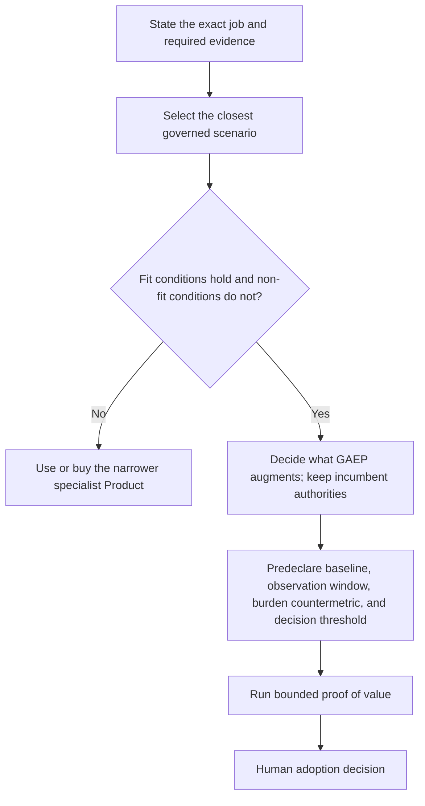

| Scenario | Fit condition | Non-fit boundary |
|---|---|---|
| GAEP-SCN-001 · Product and executive governance | Need durable Product/Initiative evidence and human decision separation | Need is only code completion |
| GAEP-SCN-002 · Product and business architecture | Need trace from discovery into capability/value/operating models | A simple roadmap is sufficient |
| GAEP-SCN-003 · Enterprise and software architecture | Need architecture decisions and cross-system impact | Static diagrams alone satisfy the need |
| GAEP-SCN-004 · Engineering delivery | Need implementation agents tied to upstream context | Team only needs a single coding assistant |
| GAEP-SCN-005 · Regulated or evidence-sensitive environments | Need exact evidence, audit history, and human authority boundaries | No organization can assign required authorities |
| GAEP-SCN-006 · Teams seeking only an AI coding assistant | Need code changes, tests, and review in existing repositories | Need a new Product governance operating model |
| GAEP-SCN-007 · Teams seeking a full Product-to-Operations governance system | Need cross-functional governed truth and evidence across the lifecycle | No capacity exists for stewardship, review, or explicit authority |

#### Proof-of-value measures remain proposals

- **GAEP-MET-001 · Time to decision-ready trusted context** — unmeasured-proposal. Elapsed and active human time from bounded intent to a reviewable evidence-linked decision package. Threshold: Must be set by an accountable human before observation; unset in P02.
- **GAEP-MET-002 · Post-decision rework and escaped gaps** — unmeasured-proposal. Count and severity of material corrections attributable to missing or inconsistent upstream context after a decision. Threshold: Must be predeclared with a countermetric for review burden; unset in P02.
- **GAEP-MET-003 · Author and reviewer burden** — unmeasured-proposal. Active author/reviewer minutes, queue delay, and mandatory interactions per governed change. Threshold: Must balance quality and trust outcomes; unset in P02.
<!-- END GENERATED:SCENARIO_GUIDE -->

Before adopting or buying, state the scenario, required evidence, non-fit boundary, stewardship capacity, incumbent systems that should remain authoritative, and a predeclared proof-of-value measure. No aggregate winner score is permitted because it would erase Unknowns, delivery states, and scenario-specific tradeoffs.

## 4. Methodology and maintainer appendix

_For methodology stewards, reviewers, and maintainers · about 25 minutes_

### Methodology and reference cards

<!-- BEGIN GENERATED:METHODOLOGY_GUIDE -->
Bound to **GAEP-REG-011 v0.4.0**, checked **2026-08-07**. It contains 25 GAEP concerns, 16 assessed references, 25 exact concern mappings, and 11 deferred candidates.

> Catalog presence records evidence and candidate mappings only. It does not establish GAEP or external-reference conformance, certification, endorsement, equivalence, safety, security, readiness, approval, or authorization.

<strong>GAEP-XREF-001 · Artificial Intelligence Risk Management Framework (AI RMF 1.0)</strong>

Official source: [https://www.nist.gov/publications/artificial-intelligence-risk-management-framework-ai-rmf-10](https://www.nist.gov/publications/artificial-intelligence-risk-management-framework-ai-rmf-10)

- **Type / authority:** framework · National Institute of Standards and Technology
- **Exact version:** NIST AI 100-1, Version 1.0 · evidence version-pending · reviewed 2026-08-07
- **GAEP concerns:** GAEP-MTH-CON-010
- **Use boundary:** NIST AI RMF 1.0 is an informative, voluntary AI-risk calibration source; GAEP does not claim NIST compliance, trustworthiness, safety or security.
- **Limitations:** NIST states that AI RMF 1.0 is being revised; exact successor impact is unknown. The official publication page and abstract were reviewed, not a complete function/category mapping.
- **Review trigger:** NIST publishes a revised AI RMF, changes the revision status, or GAEP proposes a function-level mapping.

<strong>GAEP-XREF-002 · Artificial Intelligence Risk Management Framework: Generative Artificial Intelligence Profile</strong>

Official source: [https://www.nist.gov/publications/artificial-intelligence-risk-management-framework-generative-artificial-intelligence](https://www.nist.gov/publications/artificial-intelligence-risk-management-framework-generative-artificial-intelligence)

- **Type / authority:** framework · National Institute of Standards and Technology
- **Exact version:** NIST AI 600-1 · evidence primary-source-verified · reviewed 2026-08-07
- **GAEP concerns:** GAEP-MTH-CON-010
- **Use boundary:** NIST AI 600-1 is an informative Generative-AI risk profile when applicable; GAEP does not claim NIST compliance or risk-outcome achievement.
- **Limitations:** The official publication page and abstract were reviewed, not a complete action-level mapping. The profile depends on AI RMF 1.0, which is under revision.
- **Review trigger:** NIST revises AI RMF 1.0, publishes a successor profile, or GAEP proposes an action-level mapping.

<strong>GAEP-XREF-004 · NIST SP 800-218 — Secure Software Development Framework (SSDF) Version 1.1: Recommendations for Mitigating the Risk of Software Vulnerabilities</strong>

Official source: [https://csrc.nist.gov/pubs/sp/800/218/final](https://csrc.nist.gov/pubs/sp/800/218/final)

- **Type / authority:** framework · National Institute of Standards and Technology
- **Exact version:** SP 800-218, SSDF Version 1.1 · evidence primary-source-verified · reviewed 2026-08-07
- **GAEP concerns:** GAEP-MTH-CON-009, GAEP-MTH-CON-019, GAEP-MTH-CON-023, GAEP-MTH-CON-025
- **Use boundary:** NIST SSDF 1.1 is an informative secure-development calibration source selected by applicability; GAEP does not claim NIST compliance or security outcomes from citation.
- **Limitations:** The official publication page and abstract were reviewed, not a complete requirement-by-requirement assessment. Use of SSDF practices does not prove that GAEP or a governed product is secure.
- **Review trigger:** NIST publishes a successor, material update, or GAEP proposes a practice-level mapping.

<strong>GAEP-XREF-005 · ISO/IEC 25010:2023 — Systems and software engineering — Systems and software Quality Requirements and Evaluation (SQuaRE) — Product quality model</strong>

Official source: [https://www.iso.org/standard/78176.html](https://www.iso.org/standard/78176.html)

- **Type / authority:** standard · ISO and IEC
- **Exact version:** 2023, Edition 2 · evidence partially-verified · reviewed 2026-08-07
- **GAEP concerns:** GAEP-MTH-CON-004, GAEP-MTH-CON-017, GAEP-MTH-CON-019
- **Use boundary:** GAEP's multidimensional product-quality concern is informed by the official abstract of ISO/IEC 25010:2023; no conformance is claimed.
- **Limitations:** Only the official ISO page and abstract were reviewed; the paid full standard was not reviewed. Specific characteristics, measures and acceptance mappings require licensed full-text review.
- **Review trigger:** ISO lifecycle status or edition changes; or GAEP selects characteristics for normative reliance.

<strong>GAEP-XREF-011 · ISO/IEC/IEEE 42010:2022 — Software, systems and enterprise — Architecture description</strong>

Official source: [https://www.iso.org/standard/74393.html](https://www.iso.org/standard/74393.html)

- **Type / authority:** standard · ISO, IEC and IEEE
- **Exact version:** 2022, Edition 2 · evidence partially-verified · reviewed 2026-08-07
- **GAEP concerns:** GAEP-MTH-CON-003, GAEP-MTH-CON-020, GAEP-MTH-CON-021
- **Use boundary:** GAEP architecture-description concerns are informed by the official abstract of ISO/IEC/IEEE 42010:2022; no conformance or equivalent architecture-description framework is claimed.
- **Limitations:** Only the official ISO page and abstract were reviewed; the paid full standard was not reviewed. The official abstract explicitly excludes architecting processes, methods, notations, techniques and tools.
- **Review trigger:** ISO lifecycle status or edition changes; or GAEP proposes a detailed conformance mapping.

<strong>GAEP-XREF-012 · ISO/IEC/IEEE 29148:2018 — Systems and software engineering — Life cycle processes — Requirements engineering</strong>

Official source: [https://www.iso.org/standard/72089.html](https://www.iso.org/standard/72089.html)

- **Type / authority:** standard · ISO, IEC and IEEE
- **Exact version:** 2018, Edition 2 · evidence version-pending · reviewed 2026-08-07
- **GAEP concerns:** GAEP-MTH-CON-002, GAEP-MTH-CON-018, GAEP-MTH-CON-023
- **Use boundary:** GAEP requirements concerns are calibrated against the official abstract of ISO/IEC/IEEE 29148:2018 while the edition is under revision; no conformance is claimed.
- **Limitations:** ISO marks the current edition as confirmed in 2024 but to be revised as of 2026-02-16. Only the official ISO page and abstract were reviewed; the paid full standard was not reviewed.
- **Review trigger:** Publication or cancellation of the successor revision; any GAEP normative requirements mapping.

<strong>GAEP-XREF-013 · ISO/IEC/IEEE 12207:2026 — Systems and software engineering — Software life cycle processes</strong>

Official source: [https://www.iso.org/standard/90219.html](https://www.iso.org/standard/90219.html)

- **Type / authority:** standard · ISO, IEC and IEEE
- **Exact version:** 2026, Edition 2 · evidence partially-verified · reviewed 2026-08-07
- **GAEP concerns:** GAEP-MTH-CON-001, GAEP-MTH-CON-005, GAEP-MTH-CON-012, GAEP-MTH-CON-025
- **Use boundary:** GAEP's software lifecycle concerns are informed by the official abstract of ISO/IEC/IEEE 12207:2026; no conformance or equivalence is claimed.
- **Limitations:** Only the official ISO page and abstract were reviewed; the paid full standard was not reviewed. This 2026 edition replaced the previously catalogued 2017 edition after the old registry was written.
- **Review trigger:** ISO lifecycle status, edition, or official abstract changes; or GAEP proposes normative reliance.

<strong>GAEP-XREF-015 · Web Content Accessibility Guidelines (WCAG) 2.2</strong>

Official source: [https://www.w3.org/TR/WCAG22/](https://www.w3.org/TR/WCAG22/)

- **Type / authority:** standard · World Wide Web Consortium
- **Exact version:** W3C Recommendation, 2024-12-12 · evidence primary-source-verified · reviewed 2026-08-07
- **GAEP concerns:** GAEP-MTH-CON-011, GAEP-MTH-CON-017, GAEP-MTH-CON-019
- **Use boundary:** WCAG 2.2 is the current candidate accessibility reference for applicable web scope; conformance requires a separate exact evaluation and claim.
- **Limitations:** The current official Recommendation and conformance sections were reviewed, not a criterion-by-criterion GAEP mapping. W3C says WCAG 2.2 does not supersede 2.0 or 2.1, though it advises use of 2.2 for future applicability.
- **Review trigger:** W3C issues a new Recommendation, substantive errata, or GAEP proposes a WCAG conformance claim.

<strong>GAEP-XREF-020 · ISO/IEC/IEEE 15288:2023 — Systems and software engineering — System life cycle processes</strong>

Official source: [https://www.iso.org/standard/81702.html](https://www.iso.org/standard/81702.html)

- **Type / authority:** standard · ISO, IEC and IEEE
- **Exact version:** 2023, Edition 2 · evidence partially-verified · reviewed 2026-08-07
- **GAEP concerns:** GAEP-MTH-CON-001, GAEP-MTH-CON-005, GAEP-MTH-CON-012
- **Use boundary:** GAEP's lifecycle coverage is informed by the official abstract of ISO/IEC/IEEE 15288:2023; no conformance or equivalence is claimed.
- **Limitations:** Detailed normative mappings are prohibited without licensed full-text review and an approved mapping case. Only the official ISO page and abstract were reviewed; the paid full standard was not reviewed.
- **Review trigger:** ISO lifecycle status, edition, or official abstract changes; or GAEP proposes normative reliance.

<strong>GAEP-XREF-021 · The TOGAF Standard, 10th Edition</strong>

Official source: [https://publications.opengroup.org/standards/togaf](https://publications.opengroup.org/standards/togaf)

- **Type / authority:** framework · The Open Group Architecture Forum
- **Exact version:** 10th Edition; Technical Corrigendum 1 listed separately · evidence partially-verified · reviewed 2026-08-07
- **GAEP concerns:** GAEP-MTH-CON-003, GAEP-MTH-CON-016, GAEP-MTH-CON-020 · P02 market binding GAEP-MTH-002
- **Use boundary:** TOGAF is an informative enterprise-architecture calibration source for applicable initiatives; GAEP is not represented as TOGAF-compliant.
- **Limitations:** Only current official catalog, overview and licensing pages were reviewed; the licensed full standard was not reviewed. The modular Series Guides and Technical Corrigendum require exact item-level selection before material reliance.
- **Review trigger:** A new edition, corrigendum, selected Series Guide, or proposed material TOGAF reliance.

<strong>GAEP-XREF-022 · The C4 model for visualising software architecture</strong>

Official source: [https://c4model.com/](https://c4model.com/)

- **Type / authority:** visualization-model · Simon Brown
- **Exact version:** living official website; no numbered edition · evidence primary-source-verified · reviewed 2026-08-07
- **GAEP concerns:** GAEP-MTH-CON-003, GAEP-MTH-CON-020 · P02 market binding GAEP-MTH-003
- **Use boundary:** GAEP may use C4 as an optional architecture-visualization method when applicable; C4 is not a mandatory lifecycle or architecture method.
- **Limitations:** C4 focuses primarily on software-system static structure and supporting views, not the full business, domain, data, workflow or governance model. The source is living and has no immutable numbered edition.
- **Review trigger:** Material change to official abstractions, diagram guidance, license, or GAEP representation mapping.

<strong>GAEP-XREF-023 · Manifesto for Agile Software Development and Principles behind the Agile Manifesto</strong>

Official source: [https://agilemanifesto.org/](https://agilemanifesto.org/)

- **Type / authority:** principle-set · The seventeen Manifesto authors
- **Exact version:** original 2001 publication · evidence primary-source-verified · reviewed 2026-08-07
- **GAEP concerns:** GAEP-MTH-CON-005, GAEP-MTH-CON-015, GAEP-MTH-CON-017, GAEP-MTH-CON-018
- **Use boundary:** GAEP is compatible with and informed by selected Agile values and principles; it is not an Agile framework or certification claim.
- **Limitations:** GAEP adapts the feedback orientation while retaining repository-visible trace and authority. Values and principles do not define GAEP governance, approval, evidence or authorization semantics.
- **Review trigger:** Official source or copyright notice changes; or a public Agile-alignment claim is proposed.

<strong>GAEP-XREF-024 · DORA's software delivery performance metrics</strong>

Official source: [https://dora.dev/guides/dora-metrics/](https://dora.dev/guides/dora-metrics/)

- **Type / authority:** metric-framework · DORA
- **Exact version:** living guidance; last updated 2026-01-05 · evidence primary-source-verified · reviewed 2026-08-07
- **GAEP concerns:** GAEP-MTH-CON-005, GAEP-MTH-CON-012, GAEP-MTH-CON-025
- **Use boundary:** DORA provides an informative operational-feedback calibration source; GAEP makes no performance outcome claim without measured, context-bound evidence.
- **Limitations:** GAEP has not measured or demonstrated DORA outcomes. The official guidance is a living source and now uses a five-metric model rather than the historic four-key presentation.
- **Review trigger:** DORA changes the metric model, guidance date, research basis, or GAEP proposes a delivery-performance claim.

<strong>GAEP-XREF-025 · Team Topologies: Organizing Business and Technology Teams for Fast Flow</strong>

Official source: [https://teamtopologies.com/book](https://teamtopologies.com/book)

- **Type / authority:** model · Matthew Skelton and Manuel Pais
- **Exact version:** Second Edition · evidence partially-verified · reviewed 2026-08-07
- **GAEP concerns:** GAEP-MTH-CON-006, GAEP-MTH-CON-021
- **Use boundary:** GAEP may use Team Topologies concepts as optional organizational-design inputs; it does not require the method or claim its outcomes.
- **Limitations:** Only official Second Edition summary and key-concept pages were reviewed; the full book was not reviewed. Organizational patterns require contextual evidence and accountable organizational authority.
- **Review trigger:** A new edition, official concept change, or GAEP organization-design claim.

<strong>GAEP-XREF-026 · Domain-Driven Design Reference: Definitions and Pattern Summaries</strong>

Official source: [https://www.domainlanguage.com/ddd/reference/](https://www.domainlanguage.com/ddd/reference/)

- **Type / authority:** methodology · Eric Evans / Domain Language, Inc.
- **Exact version:** 2015-03 reference edition · evidence primary-source-verified · reviewed 2026-08-07
- **GAEP concerns:** GAEP-MTH-CON-003, GAEP-MTH-CON-007, GAEP-MTH-CON-015, GAEP-MTH-CON-016, GAEP-MTH-CON-020, GAEP-MTH-CON-021 · P02 market binding GAEP-MTH-004
- **Use boundary:** DDD is GAEP's proposed default strategic domain approach for applicable enterprise software-intensive profiles, not a universal requirement and not a microservices mandate.
- **Limitations:** GAEP's default applies only after Initiative applicability selects the relevant enterprise software-intensive profile. The reference is a summary complement, not a complete teaching or implementation guide.
- **Review trigger:** Official reference or license changes; or GAEP changes DDD applicability/default language.

<strong>GAEP-XREF-027 · Introducing EventStorming</strong>

Official source: [https://www.eventstorming.com/book/](https://www.eventstorming.com/book/)

- **Type / authority:** method · Alberto Brandolini
- **Exact version:** living Leanpub book; incomplete · evidence partially-verified · reviewed 2026-08-07
- **GAEP concerns:** GAEP-MTH-CON-008, GAEP-MTH-CON-015, GAEP-MTH-CON-016 · P02 market binding GAEP-MTH-005
- **Use boundary:** EventStorming is a preferred collaborative behavioral-discovery option when applicable; it is not a universal GAEP ceremony or approval source.
- **Limitations:** GAEP adoption is limited to an optional preferred collaborative-discovery method when applicability and facilitation conditions fit. The official source says the book remains incomplete and under active writing.
- **Review trigger:** Book completion state, official source, or GAEP applicability language changes.

#### Deferred—not materially relied on

- **GAEP-XREF-003 · ISO/IEC 42001 artificial intelligence management system** — unresolved-not-assessed. A concrete GAEP AI-management-system concern requires assessment.
- **GAEP-XREF-006 · NIST Privacy Framework** — unresolved-not-assessed. A concrete privacy-profile mapping requires assessment.
- **GAEP-XREF-007 · NIST OSCAL** — unresolved-not-assessed. A machine-readable controls exchange requirement is selected.
- **GAEP-XREF-008 · OWASP Agentic Security Initiative** — unresolved-not-assessed. A concrete agentic-security profile mapping requires assessment.
- **GAEP-XREF-009 · ISO/IEC 27001 and NIST Cybersecurity Framework compound legacy candidate** — unresolved-must-split. A security-management concern selects each source separately.
- **GAEP-XREF-010 · ISO/IEC 27701 privacy information management** — unresolved-not-assessed. A privacy-management concern requires assessment.
- **GAEP-XREF-014 · ISO 31000 risk management** — unresolved-not-assessed. An enterprise-risk vocabulary or mapping requires assessment.
- **GAEP-XREF-016 · ISO 15489 records management family** — unresolved-must-select-family-member. A records-management concern selects an exact family member and edition.
- **GAEP-XREF-017 · SLSA and in-toto compound legacy candidate** — unresolved-must-split. A supply-chain provenance concern selects each source separately.
- **GAEP-XREF-018 · SPDX and CycloneDX compound legacy candidate** — unresolved-must-split. A component-transparency concern selects each source separately.
- **GAEP-XREF-019 · OpenTelemetry specifications** — unresolved-must-select-specification-set. An operational telemetry exchange requirement selects an exact specification set.
<!-- END GENERATED:METHODOLOGY_GUIDE -->

These sources calibrate exact GAEP concerns. Catalog presence does not mean wholesale adoption, conformance, certification, endorsement, equivalence, safety, security, readiness, approval, or authorization. Figma is a Product and optional design adapter in the market registry; it is not the canonical lifecycle name and is not a methodology.

### Claim-control ledger

<strong>Show claim-control records</strong>

<!-- BEGIN GENERATED:CLAIM_LEDGER -->
#### GAEP-CLM-001 · substantiated-bounded-fact

> GAEP currently implements exact candidate Source, Baseline, Provenance, traceability, revision-history, and local audit-chain behaviors; repository tests cover the Source, Baseline, and Provenance records.

- **Disposition:** allowed-internal
- **Authority:** not-approved; not-published; owner role GAEP Product Owner
- **Limitations:** Implementation evidence does not establish Product Owner acceptance, security certification, compliance, or production readiness.
- **Required qualifiers:** Say implemented and automated-tested; do not say approved or enterprise-ready.
- **Freshness trigger:** Relevant repository code/test or accepted baseline changes.

#### GAEP-CLM-002 · evidence-bounded-comparison

> The reviewed landscape is composite: coding agents, spec-driven tools, DevSecOps platforms, Product discovery tools, architecture platforms, ALM suites, and design tools cover different parts of GAEP's proposed scope.

- **Disposition:** allowed-internal
- **Authority:** not-approved; not-published; owner role GAEP Product Research Owner
- **Limitations:** This is a coverage observation from reviewed official sources, not a superiority or market-share claim.
- **Required qualifiers:** State the 2026-08-08 as-of date and reviewed-source limitations.
- **Freshness trigger:** Any product identity, category, capability, or reviewed evidence changes.

#### GAEP-CLM-003 · evidence-bounded-comparison

> A coding agent can be the better-scoped choice when the need is repository implementation assistance rather than governed Product-to-Operations decision management.

- **Disposition:** allowed-internal
- **Authority:** not-approved; not-published; owner role GAEP Product Research Owner
- **Limitations:** Better-scoped refers to narrower functional fit, not product quality or superiority.
- **Required qualifiers:** Describe the team's need and do not rank agent quality.
- **Freshness trigger:** Coding-agent or GAEP implementation scope changes.

#### GAEP-CLM-004 · positioning-hypothesis

> No single reviewed external Product was established as a complete direct substitute for GAEP's proposed combined category.

- **Disposition:** pending-human-decision
- **Authority:** not-approved; not-published; owner role GAEP Product Owner
- **Limitations:** Absence from reviewed evidence is not proof of market absence; broader research and Product Owner decision are required.
- **Required qualifiers:** Keep as a hypothesis; never state that competitors lack a capability.
- **Freshness trigger:** Landscape scope, evidence, or inclusion criteria changes.

#### GAEP-CLM-005 · customer-outcome-hypothesis

> GAEP reduces delivery time, improves accuracy, and lowers engineering cost.

- **Disposition:** prohibited
- **Authority:** not-approved; not-published; owner role GAEP Metric Integrity Owner
- **Limitations:** No controlled baseline, observation window, customer evidence, or decision threshold exists.
- **Required qualifiers:** Do not use until separately measured and approved.
- **Freshness trigger:** A valid outcome study and publication approval are created.

#### GAEP-CLM-006 · prohibited-claim

> GAEP is enterprise-ready, secure, compliant, and production-ready.

- **Disposition:** prohibited
- **Authority:** not-approved; not-published; owner role GAEP Assurance Authority
- **Limitations:** No exact organizational, security, compliance, certification, or readiness authority supports this statement.
- **Required qualifiers:** Do not use.
- **Freshness trigger:** Separate exact authorities and evidence are created and approved.

#### GAEP-CLM-007 · prohibited-claim

> GAEP is better than or superior to the evaluated alternatives.

- **Disposition:** prohibited
- **Authority:** not-approved; not-published; owner role GAEP Product Research Owner
- **Limitations:** No valid comparative study, agreed rubric, representative trials, or approved claim authority exists.
- **Required qualifiers:** Do not use or imply through ranking.
- **Freshness trigger:** A separately governed comparative study and approval exist.

#### GAEP-CLM-008 · substantiated-bounded-fact

> GAEP plans repository federation and a complete operations feedback loop as future capabilities.

- **Disposition:** allowed-internal
- **Authority:** not-approved; not-published; owner role GAEP Product Owner
- **Limitations:** Planned/deferred capabilities are not current or committed delivery promises.
- **Required qualifiers:** Always label planned/deferred and avoid release dates.
- **Freshness trigger:** Deferred-capability register or implementation state changes.
<!-- END GENERATED:CLAIM_LEDGER -->

The ledger is not marketing copy. It retains dispositions, qualifiers, limitations, and authority states so internal fact use cannot silently become an approved or public claim.

### Maintainer and projection details

<strong>Show generation commands, canonical paths, full digests, drift maintenance, and projection ownership</strong>

<!-- BEGIN GENERATED:MAINTENANCE_CONTRACT -->
**Projection contract:** GAEP-REG-014 v0.3.0 · schema 1.1.0 · not-approved · not-published.

| Source role | Exact identity | Repository path | SHA-256 |
|---|---|---|---|
| methodology-catalog | `GAEP-REG-011` v0.4.0 | `docs/next/99_Registries_and_References/011_METHODOLOGY_REFERENCE_CATALOG.json` | `6859769b56eeae9025dfff5407113dbc7b22ec7809e518d69a399effb156b209` |
| market-registry | `GAEP-REG-013` v0.2.1 | `docs/next/99_Registries_and_References/013_MARKET_EVIDENCE_AND_BENCHMARK_REGISTRY.json` | `3dcfe5531a1bb4630dc3afdb2990389728e2d39cac2ac915986badb9fe9e5c17` |
| terminology-index | `GAEP-REG-005` v0.3.0 | `docs/next/99_Registries_and_References/005_CANONICAL_TERMINOLOGY_INDEX.md` | `9e5765683133d3904742bd9a05be7a3323d83848b7015d06a864f5e37af6aca5` |
| runtime-presentation-contract | `runtime-product-journey-presentation` v1.0.0 | `apps/vscode/src/product-journey-presentation.ts` | `445797601923593b842041c02b630bbebdb4d9a16d9ccbf9540800ad6d192c54` |
| extension-package | `gaep-vscode-package` v0.1.0 | `apps/vscode/package.json` | `82d4235bea19ec54a4fd649261c37e8cb3a13f6c7823c169a88d66fc899a1e8b` |

**Required progressive layers:**

- **Executive orientation** — Executives, Product leaders, and evaluation sponsors; 5-minute route
- **Start here** — First-time GAEP users; 3-minute route
- **Practitioner guide** — Product, architecture, design, engineering, assurance, and operations practitioners; 20-minute route
- **Methodology and maintainer appendix** — Methodology stewards, reviewers, and maintainers; 25-minute route

**Required visual inventory:** executive-operating-model, authority-loop, quick-start-flow, checkpoint-position-example, current-runtime, lifecycle-discover-define, lifecycle-architecture-plan, lifecycle-deliver-operate, transition-roadmap, source-lifecycle, scenario-choice. All are vertical (TD/TB), use text labels, and rely on host light/dark Mermaid theming.

**Deterministic commands:**

- `npm run validate:guideline` — strict Schema, binding, lifecycle, authority, and command validation
- `npm run render:guideline` — regenerate the bundled Markdown from canonical inputs and this template
- `npm run check:guideline-projection` — fail on manual edits or stale generated facts
- `npm run test:guideline` — run Schema, hostile semantic, projection, packaging, and drift coverage
<!-- END GENERATED:MAINTENANCE_CONTRACT -->

To change generated facts, update their owning canonical source first. To change explanation or reading flow, edit this narrative template. To change projection structure, lifecycle mappings, required visuals, or bindings, update `GAEP-REG-014`. Then run `npm run render:guideline` and `npm run test:guideline`.

Do not edit the generated Guide directly. CI validates the strict manifest, exact source identities/versions/digests, runtime checkpoint and command projections, all required audience layers and visuals, semantic authority boundaries, and byte-for-byte output freshness.

<!-- END HAND-AUTHORED NARRATIVE -->
