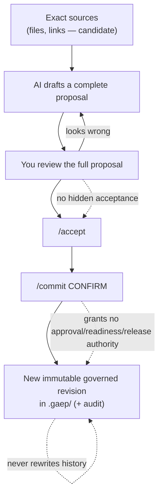
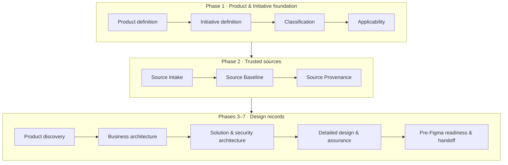

# GAEP — A visual guide

*Governed AI Engineering Platform*

This guide is for someone who has never used GAEP. By the end you should understand
**what GAEP is, what problem it solves, how a Product Journey flows, and — with a
referenced, side‑by‑side comparison — why a team might choose it alongside spec‑driven
build tools like AWS AI‑DLC, AWS Kiro, GitHub Spec Kit, Spec‑Flow, and Tessl.**

> **Maintainers:** this guide is part of the product surface. **Whenever a capability is
> added to or changed in GAEP, update this guide** — especially the process diagrams
> (section 4) and the competitive comparison (section 7).

---

## 1. What GAEP is, in one paragraph

GAEP is an **IDE‑native, vendor‑neutral, local‑first governance layer** for product and
engineering work done *with AI assistance*. When a consequential change is prepared with
AI across many fragmented sources and authorities, GAEP helps the responsible people
establish **trusted context, exact provenance, impact, uncertainty, and decision
boundaries** — so accountable decisions can be made now and *reconstructed later* without
redoing the work.

GAEP is **not** a chatbot, a document generator, or an auto‑approver. It does not replace
your source control, backlog, design tool, or CI. It **connects** intent, sources, AI
proposals, human review, and immutable decisions into one auditable thread.

---

## 2. The problem it solves

Modern AI‑assisted work produces plausible output fast. The hard part is no longer
*generating* a proposal — it is answering, months later:

- Which exact documents was this based on?
- What did a human actually review and accept, versus what the AI merely suggested?
- What was assumed, still unknown, or in conflict?
- Who was accountable, and what did that decision *not* authorize?

Without a governance layer these answers live in scattered chat logs and memories. GAEP
records them as durable, immutable state so a decision can always be replayed.

---

## 3. Five ideas that make GAEP trustworthy

1. **Local‑first truth.** Durable state lives in your workspace under `.gaep/`. Chat prose,
   previews, and AI output are *not* governed truth until committed.
2. **Candidate ≠ governed.** Attached documents, extracted facts, and AI proposals are
   *candidates* until a human independently reviews and explicitly commits them.
3. **See it before you accept it.** You always review a **complete** proposal before
   accepting. No hidden or silent acceptance.
4. **Accept and commit are separate.** `generate → review → /accept → /commit CONFIRM → new immutable revision`.
5. **No manufactured authority.** A committed record never *by itself* grants approval,
   readiness, release, or permission to act.

If anything is missing, stale, or tampered, GAEP **fails closed** with a clear recovery path.

---

## 4. How GAEP works — visually

### The governance loop (every record goes through this)

### The Product Journey (where you spend your time)

Each checkpoint shows one state:

| Marker | State | Meaning |
|---|---|---|
| ✓ | Recorded | A current governed record exists. |
| ◆ | Candidate ready | AI evidence supports a complete proposal, nothing governed yet. |
| ! | Needs decisions | Evidence is partial or human decisions remain. |
| ○ | Waiting / not started | A prerequisite isn't ready yet. |

### Why the "Trusted sources" phase exists

- **Source Intake** — point GAEP at the *real* documents (specs, tickets, policies). Everything downstream is grounded in these exact sources instead of guesses.
- **Source Baseline** — a *frozen snapshot* of exactly which source versions you reviewed.
- **Source Provenance** — links each accepted fact to the exact source version it came from.

Where key records are produced: **Bounded Context** in *Solution & security architecture*;
**Event Storming / Process Model** in *Detailed design & assurance*.

---

## 5. Adopt, upload, and add references

- `@gaep /adopt` proposes Product Definition fields and coverage from selected files, as
  non‑governed candidates — each checkpoint still needs its own review and commit.
- **Choose File / Choose Folder** (sidebar) upload documents into **Source Intake**; their
  content is available to advisor prompts as bounded, non‑authoritative candidate knowledge.
- **Add Useful Link** (sidebar) saves an http(s) reference GAEP may use as candidate context.
  GAEP never fetches it and stores no secrets.

---

## 6. Exporting and reviewing

- **Review Product Journey** opens a visual Markdown preview with rendered Mermaid diagrams
  (architecture, value streams, Event Storming) and a table of contents.
- **Export Product Journey** writes a folder — one subfolder per checkpoint, each section a
  Markdown file with YAML front‑matter — stopping at the Pre‑Figma boundary (no Figma MCP
  roundtrip, no implementation authority).

---

## 7. GAEP vs spec‑driven build tools — a referenced comparison

**Read this first.** AWS AI‑DLC, AWS Kiro, GitHub Spec Kit, Spec‑Flow and Tessl are all
excellent **spec‑driven / AI‑native _build_ approaches**: they make *"intent/spec the source
of truth,"* then plan and generate code faster and more reliably. They optimize **getting to
working software**. GAEP optimizes a **different job**: the **governance and provenance of
consequential decisions** made with AI across fragmented sources — trusted context, exact
provenance, impact, decision boundaries, and an immutable, reconstructable audit — and it is
deliberately **vendor‑, provider‑, and IDE‑neutral and local‑first**. They are largely
**complementary**: use a build tool to move fast, and keep the accountable decision thread in GAEP.

> **About the "metrics."** There is no neutral public head‑to‑head benchmark across these
> products. The table below is therefore a **capability scorecard** on governance dimensions
> that GAEP treats as first‑class, each verifiable against the referenced sources. Ratings:
> ● first‑class · ◐ partial / possible · ○ not a modeled concern / varies. Positioning
> reflects each product's public description as of August 2026 — re‑verify against the
> Sources before quoting.

| Capability (the "metric") | GAEP | AWS AI‑DLC | AWS Kiro | GitHub Spec Kit | Spec‑Flow | Tessl |
|---|:--:|:--:|:--:|:--:|:--:|:--:|
| Primary job | **Govern decisions** | Build lifecycle | Build (agentic IDE) | Build (spec toolkit) | Build (Claude Code flow) | Build (spec + registry) |
| Vendor / provider neutral | ● | ● | ○ (AWS Bedrock) | ● (multi‑agent) | ◐ (Claude Code) | ◐ |
| Local‑first source of truth you own | ● | ◐ | ◐ | ◐ | ◐ | ◐ |
| AI output is *candidate*, not truth, until committed | ● | ◐ (validate) | ○ (spec is truth) | ○ (spec is truth) | ◐ (quality gates) | ○ (spec is truth) |
| Explicit two‑step **accept → commit**, fail‑closed | ● | ○ | ○ | ○ | ◐ | ○ |
| Immutable governed revision history + audit chain | ● | ○ (git) | ○ (git) | ○ (git) | ◐ (auditable artifacts) | ◐ |
| Claim bound to **exact source revision + digest** | ● | ○ | ○ | ○ | ○ | ◐ (dependency specs) |
| Record grants **no** approval / readiness / release authority | ● | ○ | ○ | ○ | ○ | ○ |
| Scope | Intent → pre‑Figma decision governance | Inception → Construction → Operations | Prompt → production code | Spec → plan → tasks → code | Idea → production launch | Spec → tested code |

**One‑line pitch to a team that already knows these tools:** *the spec‑driven tools make the
AI build the right thing faster; GAEP makes the consequential decisions along the way
**trusted, portable, and reconstructable** — vendor‑neutral and local‑first — which is the
part a regulated or high‑stakes enterprise product (e.g. ERP) is actually accountable for.*

### Sources (verify the positioning yourself)

- AWS AI‑DLC — methodology and open‑sourced workflows: <https://github.com/awslabs/aidlc-workflows> · <https://aws.amazon.com/blogs/devops/>
- AWS Kiro — spec‑driven agentic IDE (specs as the unit of work): <https://builder.aws.com/content/3DbBI7LQgNIcs6UUj7IPPvqFHOp/aws-kiro-the-agentic-ide-that-makes-specs-the-unit-of-work>
- GitHub Spec Kit — open‑source spec‑driven toolkit: <https://github.github.com/spec-kit/> · <https://github.com/github/spec-kit>
- Spec‑Flow — Claude Code workflow with quality gates and auditable artifacts: <https://github.com/marcusgoll/Spec-Flow>
- Tessl — spec‑driven framework + spec registry: <https://tessl.io/blog/how-tessls-products-pioneer-spec-driven-development/>
- Spec‑driven development background: <https://developer.microsoft.com/blog/spec-driven-development-ai-native-engineering/>

---

## 8. Handy commands

`/initialize` · `/adopt` · `/continue` · `/initiative` · `/classification` ·
`/applicability` · `/intake` · `/baseline` · `/provenance` · `/author` · `/review` ·
`/accept` · `/commit CONFIRM` · `/revise` · `/inspect`

---

*This guide is documentation. Reading it grants no approval, readiness, release, or action
authority — exactly like every other record in GAEP.*
