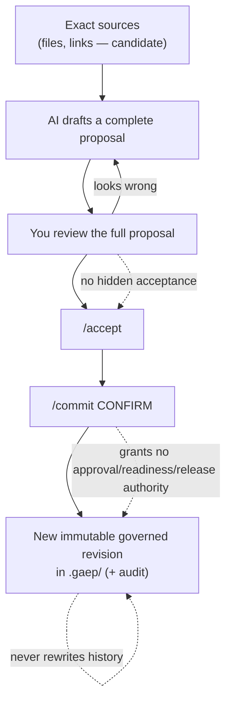
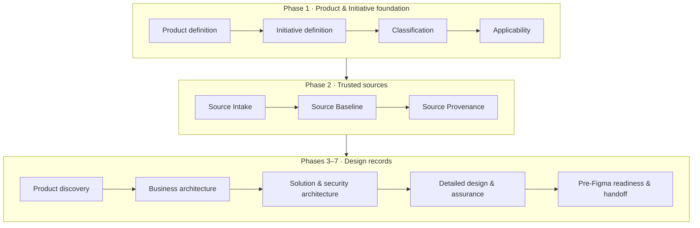

# GAEP — A visual guide

*Governed AI Engineering Platform*

This guide is for someone who has never used GAEP. By the end you should understand
**what GAEP is, what problem it solves, how a Product Journey flows, and — with a
referenced, side‑by‑side comparison — why a team might choose it alongside spec‑driven
build tools like AWS AI‑DLC, AWS Kiro, GitHub Spec Kit, Spec‑Flow, and Tessl.**

> **Maintainers:** this guide is part of the product surface. **Whenever a capability is
> added to or changed in GAEP, update this guide** — especially the process diagrams
> (section 4) and the competitive comparison (section 7).

---

## 1. What GAEP is, in one paragraph

GAEP is an **IDE‑native, vendor‑neutral, local‑first governance layer** for product and
engineering work done *with AI assistance*. When a consequential change is prepared with
AI across many fragmented sources and authorities, GAEP helps the responsible people
establish **trusted context, exact provenance, impact, uncertainty, and decision
boundaries** — so accountable decisions can be made now and *reconstructed later* without
redoing the work.

GAEP is **not** a chatbot, a document generator, or an auto‑approver. It does not replace
your source control, backlog, design tool, or CI. It **connects** intent, sources, AI
proposals, human review, and immutable decisions into one auditable thread.

---

## 2. The problem it solves

Modern AI‑assisted work produces plausible output fast. The hard part is no longer
*generating* a proposal — it is answering, months later:

- Which exact documents was this based on?
- What did a human actually review and accept, versus what the AI merely suggested?
- What was assumed, still unknown, or in conflict?
- Who was accountable, and what did that decision *not* authorize?

Without a governance layer these answers live in scattered chat logs and memories. GAEP
records them as durable, immutable state so a decision can always be replayed.

---

## 3. Five ideas that make GAEP trustworthy

1. **Local‑first truth.** Durable state lives in your workspace under `.gaep/`. Chat prose,
   previews, and AI output are *not* governed truth until committed.
2. **Candidate ≠ governed.** Attached documents, extracted facts, and AI proposals are
   *candidates* until a human independently reviews and explicitly commits them.
3. **See it before you accept it.** You always review a **complete** proposal before
   accepting. No hidden or silent acceptance.
4. **Accept and commit are separate.** `generate → review → /accept → /commit CONFIRM → new immutable revision`.
5. **No manufactured authority.** A committed record never *by itself* grants approval,
   readiness, release, or permission to act.

If anything is missing, stale, or tampered, GAEP **fails closed** with a clear recovery path.

---

## 4. How GAEP works — visually

### The governance loop (every record goes through this)

### The Product Journey (where you spend your time)

Each checkpoint shows one state:

| Marker | State | Meaning |
|---|---|---|
| ✓ | Recorded | A current governed record exists. |
| ◆ | Candidate ready | AI evidence supports a complete proposal, nothing governed yet. |
| ! | Needs decisions | Evidence is partial or human decisions remain. |
| ○ | Waiting / not started | A prerequisite isn't ready yet. |

### Why the "Trusted sources" phase exists

- **Source Intake** — point GAEP at the *real* documents (specs, tickets, policies). Everything downstream is grounded in these exact sources instead of guesses.
- **Source Baseline** — a *frozen snapshot* of exactly which source versions you reviewed.
- **Source Provenance** — links each accepted fact to the exact source version it came from.

Where key records are produced: **Bounded Context** in *Solution & security architecture*;
**Event Storming / Process Model** in *Detailed design & assurance*.

---

## 5. Adopt, upload, and add references

- `@gaep /adopt` proposes Product Definition fields and coverage from selected files, as
  non‑governed candidates — each checkpoint still needs its own review and commit.
- **Choose File / Choose Folder** (sidebar) upload documents into **Source Intake**; their
  content is available to advisor prompts as bounded, non‑authoritative candidate knowledge.
- **Add Useful Link** (sidebar) saves an http(s) reference GAEP may use as candidate context.
  GAEP never fetches it and stores no secrets.

---

## 6. Exporting and reviewing

- **Review Product Journey** opens a visual Markdown preview with rendered Mermaid diagrams
  (architecture, value streams, Event Storming) and a table of contents.
- **Export Product Journey** writes a folder — one subfolder per checkpoint, each section a
  Markdown file with YAML front‑matter — stopping at the Pre‑Figma boundary (no Figma MCP
  roundtrip, no implementation authority).

---

## 7. Market comparison authority

This bundled guide intentionally contains no independently maintained competitor table or
positioning copy. Current Proposed market identities, the exact 30-dimension capability taxonomy,
evidence-bound comparison cells, GAEP maturity states, claims, limitations, and research dates are
owned by `GAEP-REG-013` v0.2.0 and projected for human review in generated `GAEP-STR-004`.
Methodology and standards truth remains in `GAEP-REG-011`; the 17 retired capability identities
remain migration history and must not be reused as current dimensions.

Use the repository documents to inspect those records and their official evidence. The
extension must preserve Unknown rather than display it as No, distinguish shipped capability
from preview, extension, inference, and roadmap states, and keep every claim visibly
not-approved and not-published. Product counts, Evidence coverage, and maturity states are not a
winner score. This guide creates no independent benchmark, superiority, procurement, or
publication authority.

- **Evidence strength sets the ceiling of a conclusion.** Identity-only Evidence can identify a
  Product but cannot prove a feature; partial Evidence supports only a bounded Partial cell; a
  Verified cell needs a current, exact Product-and-capability assertion plus compatible official
  availability Evidence when shown as shipped.
- **Unknown protects the decision.** It means the reviewed Evidence does not establish a result,
  not that the Product lacks the capability. Turning it into No would manufacture a competitor
  absence claim.
- **No total winner score is produced.** Different executive scenarios value different
  capabilities, and aggregating Unknowns would create false precision. Inspect the scenario,
  exact Evidence, limitations, and freshness date instead.
- **GAEP maturity is separate from market support.** Implemented, partial, and planned/deferred
  repository states describe current code observation at a commit; none implies Product Owner
  acceptance, readiness, or that roadmap intent is already delivered.
- **Executive reading path:** select the relevant scenario in `GAEP-STR-004`, review its fit and
  non-fit conditions, inspect the capability rows and Unknowns, then define an unmeasured
  proof-of-value baseline, observation window, owner, confounders, and decision threshold before
  procurement or rollout.

---

## 8. Handy commands

`/initialize` · `/adopt` · `/continue` · `/initiative` · `/classification` ·
`/applicability` · `/intake` · `/baseline` · `/provenance` · `/author` · `/review` ·
`/accept` · `/commit CONFIRM` · `/revise` · `/inspect`

---

*This guide is documentation. Reading it grants no approval, readiness, release, or action
authority — exactly like every other record in GAEP.*
