<!-- GENERATED FILE: edit this narrative template and GAEP-REG-014, then run npm run render:guideline. -->

# GAEP Product-to-Operate Enterprise Guideline

### Why use this Guide

Use this Guide to start a governed Product workspace, understand what GAEP needs from you now, and compare current evidence with the intended Product-to-Operations operating model without confusing candidates, plans, or market claims with approved truth.

It is for first-time users, Product leaders, practitioners, reviewers, and maintainers. **[Start here with the approximately three-minute route](#2-start-here)**; continue only when you need checkpoint, roadmap, market, methodology, or projection detail.

<!-- BEGIN GENERATED:PROJECTION_HEADER -->
> **Evidence boundary:** This Guide is generated from GAEP-REG-011 v0.4.0, GAEP-REG-013 v0.2.1, and the installed runtime presentation contract. Exact digests remain in the collapsed maintainer appendix.
>
> **Authority:** Proposed, not approved, and not published. This Guide does not accept GAEP, authorize rollout, or convert evidence into organizational authority.
<!-- END GENERATED:PROJECTION_HEADER -->

<!-- BEGIN GENERATED:ENTERPRISE_OPENING -->
**GAEP is an evidence-governed Product-to-Operate decision system.** It exists because unmanaged AI-assisted Product and software work can turn stale context, plausible inference, missing accountability, and tool output into irreversible architecture, code, risk, release, or operational decisions.

GAEP is not an autonomous executive, a universal software-delivery platform, a standards-conformance claim, or a replacement for Product, architecture, engineering, security, privacy, risk, legal, quality, release, service, operations, assurance, or audit authority.

The mental model is: **exact evidence → bounded AI-assisted candidate → human challenge → accountable acceptance → explicit governed commit → separately authorized downstream work → operating evidence and feedback**. AI can inspect, propose, compare, and challenge. Humans decide scope, evidence sufficiency, exceptions, acceptance, risk, implementation, release, and operations within their actual organizational authority.

The installed runtime currently governs Product/Initiative definition through P0–P4 readiness and handoff. Product Design execution, architecture-bound backlog, repository allocation, implementation agents, CI/CD, release, deployment, and operations are target capabilities: planned or partial, non-executable here, and subject to later authorization.
<!-- END GENERATED:ENTERPRISE_OPENING -->

This is the maintained, human-facing GAEP Product surface bundled with the VS Code extension. It uses four progressive layers: stop after the layer that answers your question, or continue for evidence and maintenance detail.

## Contents

- [1. Executive orientation](#1-executive-orientation)
- [2. Start here](#2-start-here)
- [3. Practitioner guide](#3-practitioner-guide)
- [4. Methodology and maintainer appendix](#4-methodology-and-maintainer-appendix)

<!-- BEGIN HAND-AUTHORED NARRATIVE -->

## 1. Executive orientation

_For executives, Product leaders, and evaluation sponsors · about 5 minutes_

### What GAEP is — and is not

GAEP is a proposed evidence-governed Product-to-Operate decision system. It keeps Product intent, Initiative decisions, Sources, architecture, design, delivery, and operating evidence connected while preserving explicit human authority.

GAEP is not a coding-agent leaderboard, an automatic approval system, a replacement for specialist tools, or evidence that an outcome has been achieved. Current repository behavior, independent acceptance, organizational authorization, market evidence, and future plans are separate dimensions.

<!-- BEGIN GENERATED:EXECUTIVE_FACTS -->
**Evidence snapshot:** 15 evaluated Products/projects · 30 vendor-neutral capabilities · 450 evidence-bounded benchmark cells · 16 assessed methodology/reference sources · 7 adoption scenarios.

**Current GAEP repository maturity:**

- 6 implemented and automated-tested
- 11 implemented, awaiting independent P03 review
- 11 partial
- 2 planned/deferred
- 0 approved or published by this projection
<!-- END GENERATED:EXECUTIVE_FACTS -->

### The operating model in one view

<!-- BEGIN GENERATED:EXECUTIVE_OPERATING_MODEL -->
<!-- GAEP-VISUAL:executive-operating-model -->

**Evidence-governed operating model**

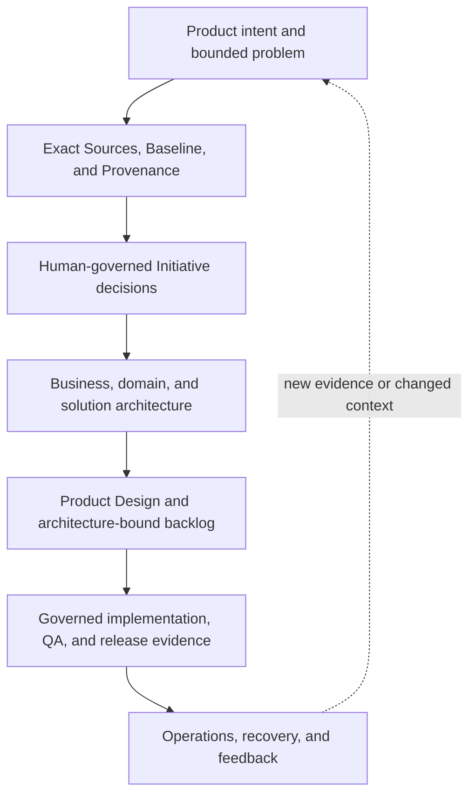
<!-- END GENERATED:EXECUTIVE_OPERATING_MODEL -->

The thread is intentionally vertical: evidence grounds a candidate; a human reviews and decides; committed truth constrains downstream work; runtime feedback can trigger a new governed change. Skipping a decision does not silently turn it into “not applicable.”

### Authority and evidence boundary

<!-- BEGIN GENERATED:AUTHORITY_LOOP -->
<!-- GAEP-VISUAL:authority-loop -->

**Human authority loop**

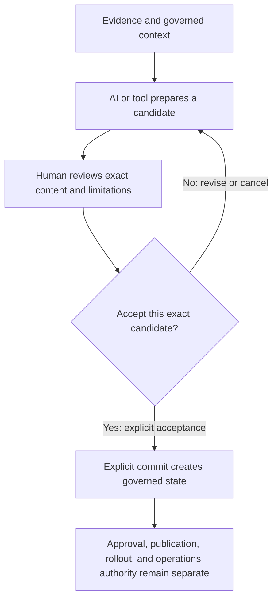
<!-- END GENERATED:AUTHORITY_LOOP -->

AI and tools may propose, challenge, summarize, compare, and prepare evidence. Named human role archetypes remain accountable for bounded decisions; actual organizational authority is separate. “Implemented and automated-tested” is repository evidence—not independent acceptance, enterprise readiness, security certification, compliance, production authorization, or outcome proof.

## 2. Start here

_For a first GAEP session · approximately 3 minutes_

### Your approximately three-minute first session

Open **GAEP: Open Guide** from the Command Palette at any time. In Chat, address `@gaep`; commands below are verified against the extension package during generation.

<!-- BEGIN GENERATED:QUICK_START_FLOW -->
<!-- GAEP-VISUAL:quick-start-flow -->

**First-session source-first path**

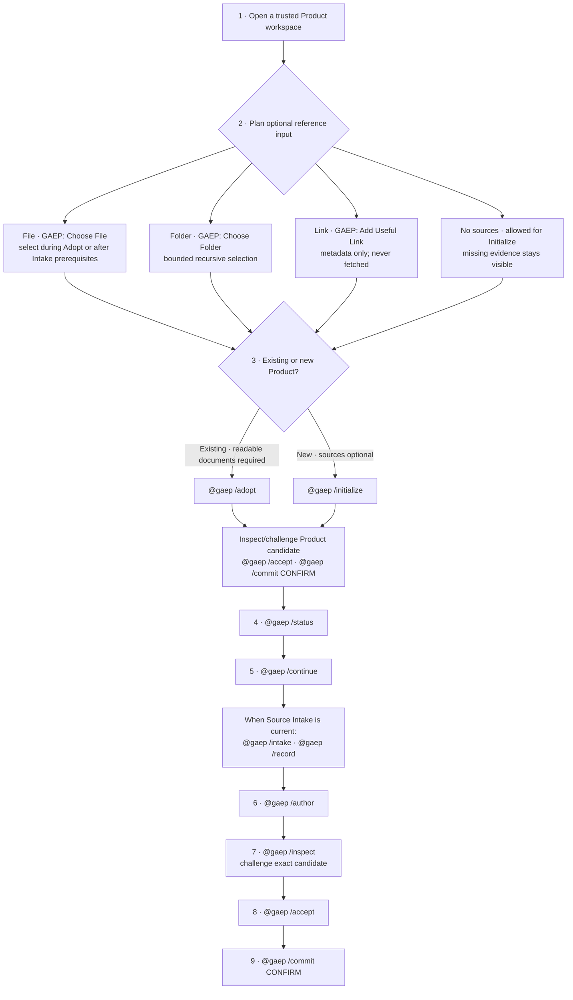

#### What the four source paths actually do

| Path | What it does | What it does not do |
|---|---|---|
| **File** · `GAEP: Choose File` | Stages one or more supported files for the active `/adopt` or `/intake` route; the route reads bounded content and reports extraction limits. | Selection alone does not reason over content, record a Source, approve truth, or create governed state. |
| **Folder** · `GAEP: Choose Folder` | Discovers supported files recursively within runtime limits for the active route. | It does not make every file relevant, authoritative, readable, or approved. |
| **Useful Link** · `GAEP: Add Useful Link` | Records a portable, non-governed HTTP(S) reference label, URL, note, and added-at metadata. | GAEP never fetches or reads it. Link-only input is not content evidence unless exact content is separately made available and reviewed. |
| **No sources** | Lets a new Product proceed through `@gaep /initialize`; missing evidence remains explicit. | Current `@gaep /adopt` cannot fast-start an existing Product without readable documents, and `@gaep /intake` waits for Product, Initiative, and applicability prerequisites. |

#### Do not conflate these boundaries

1. **Select/attach** — chooses bytes or records link metadata; no reasoning or governance occurs.
2. **Reason over exact attached content** — `@gaep /adopt` or, when prerequisites are current, `@gaep /intake`; this creates an advisory review, not a Source.
3. **Record reviewed candidate Sources** — `@gaep /record`, or the explicit post-Adopt binding route after an Initiative exists; candidates remain non-authoritative.
4. **Accept an exact proposal** — `@gaep /accept` records the human decision for the displayed candidate; it is not yet governed commit state.
5. **Commit governed state** — `@gaep /commit CONFIRM` persists the exact accepted proposal. Approval, publication, rollout, release, production, security, and compliance authority remain separate.
<!-- END GENERATED:QUICK_START_FLOW -->

AI-generated and document-derived candidates are not governed merely because they look complete. Review the exact displayed candidate and its limitations, challenge or revise it, accept it explicitly, and commit it explicitly. Missing evidence, blockers, and open questions remain visible.

### Choose the right entry path — do not restart by default

<!-- BEGIN GENERATED:ENTRY_PATHS -->
<!-- GAEP-VISUAL:enterprise-entry-paths -->

**Newcomer and mid-journey entry routes**

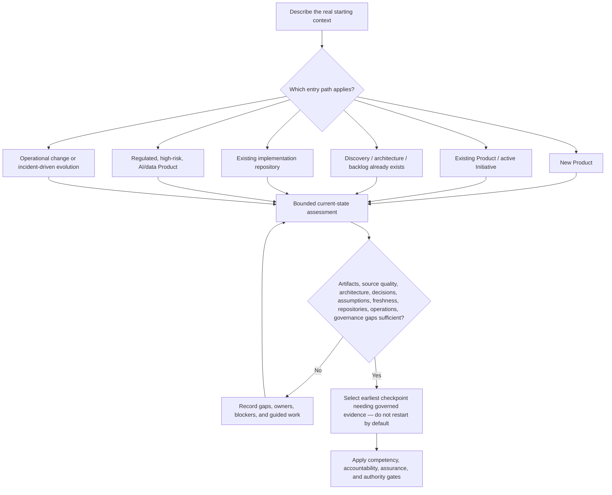

<!-- GAEP-SEQUENCE:entry-selection -->

**First session and entry-path selection**

```mermaid
%% First session and entry-path selection
sequenceDiagram
actor participant as Initiative lead
participant gaep as GAEP runtime
participant accountable as Accountable business owner
participant assurer as Independent assurance
participant->>gaep: Describe Product, Initiative, repository, risk, and operating context
gaep-->>participant: Request exact artifacts, source quality, decisions, freshness, and governance gaps
participant->>gaep: Supply available evidence or continue with named gaps
gaep-->>accountable: Candidate current-state assessment and proposed entry checkpoint
accountable->>assurer: Request independent review when risk/applicability requires it
assurer-->>accountable: Findings, limitations, or unresolved assurance requirement
accountable-->>gaep: Accept bounded entry decision or return for revision
gaep-->>participant: Current checkpoint, blockers, next valid action; no automatic restart
```

| Entry path | Required assessment evidence | Honest route |
|---|---|---|
| New Product | Problem/user/outcome evidence; optional Sources | Product definition via `@gaep /initialize` |
| Existing Product | Existing Product artifacts and readable evidence | Adopt/current-state assessment; `@gaep /adopt` where supported |
| Existing Product + active Initiative | Initiative identity, scope, decisions, Source state | Resume earliest stale/missing governed checkpoint |
| Already in discovery | Discovery evidence, assumptions, outcomes, Source lineage | Assess Product/Initiative/Source foundation; continue at discovery if sufficient |
| Already in architecture | Business/domain/solution decisions, alternatives, risks | Assess earlier evidence and enter at earliest ungoverned architecture dependency |
| Existing backlog | Backlog, criteria, dependencies, architecture and repository mappings | Current runtime can assess through handoff; backlog execution remains target-only |
| Existing repository | Topology, code, tests, pipelines, decisions, operational evidence | Current-state assessment; repository execution remains target-only |
| Regulated/high-risk or AI/data | Risk class, jurisdiction, data/model/provider, assurance and authority | Classification/applicability plus competency and independent-assurance gates |
| Operational change/incident | Service observations, incident/recovery evidence, prior decisions | Bound a new Initiative; operations execution remains target-only |

**Every mid-journey assessment covers:** available artifacts; Source quality and freshness; architectural knowledge; prior decisions; unresolved assumptions; repository state; operational evidence; and missing governance records. Missing evidence stays visible and does not force a fictitious restart or approval.
<!-- END GENERATED:ENTRY_PATHS -->

### Competency, RACI, authority, and independent assurance

<!-- BEGIN GENERATED:COMPETENCY_AUTHORITY -->
<!-- GAEP-VISUAL:competency-gateway -->

**Role- and risk-based competency gateway**

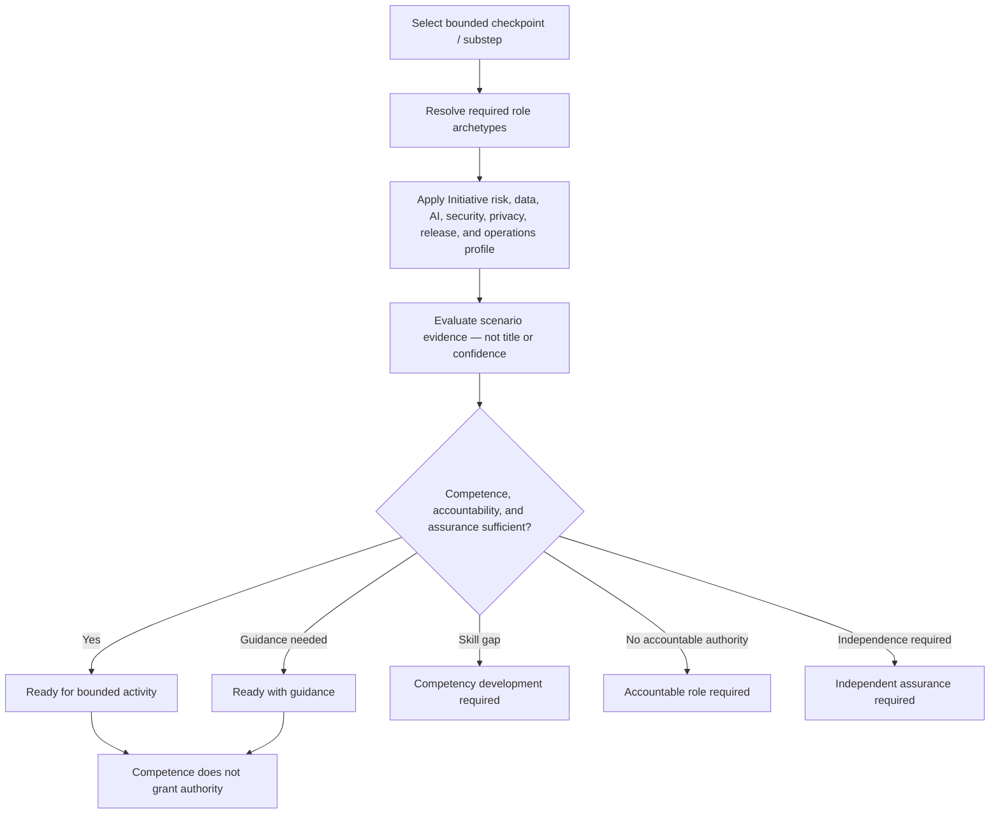

<!-- GAEP-SEQUENCE:competency-assessment -->

**Competency assessment and guided-participation decision**

```mermaid
%% Competency assessment and guided-participation decision
sequenceDiagram
actor participant as Candidate participant
participant gaep as GAEP competency projection
participant practitioner as Qualified practitioner
participant accountable as Accountable decision role
participant assurer as Independent assurance
participant->>gaep: Select bounded activity and declared role
gaep-->>participant: Required competencies and risk-based scenario evidence
participant->>practitioner: Demonstrate scenario handling, failure response, and evidence
practitioner-->>gaep: Observed evidence and guidance requirement
gaep-->>accountable: Gateway outcome; competence and authority shown separately
accountable->>assurer: Request independent review when required
assurer-->>accountable: Assurance disposition
accountable-->>participant: Authorized participation decision outside GAEP
```

> **Authority boundary:** Role assignment, RACI, and demonstrated competence do not appoint a person or grant recommendation, acceptance, risk, implementation, repository, release, operational, assurance, or audit authority.

#### Participation levels

| Level | Required scenario evidence |
|---|---|
| Aware | Can explain the relevant GAEP boundary and recognize when guided help is required. |
| Guided contributor | Completes a bounded scenario with a named Practitioner observing and correcting decisions. |
| Practitioner | Completes representative scenarios, handles failure/Unknown states, and produces reviewable evidence independently. |
| Assurer or accountable decision-maker | Demonstrates challenge, escalation, authority-bound decision documentation, and independence where applicable. |
| Enterprise steward | Maintains lifecycle policy, role separation, evidence quality, and cross-Initiative learning through scenario evidence. |

<details>
<summary><strong>Show all competency dimensions and scenario evidence</strong></summary>

| Competency | Demonstration evidence |
|---|---|
| `lifecycle-literacy` · GAEP lifecycle literacy | Given a mixed current/target roadmap, identify executable checkpoints and non-executable target nodes without conflation. |
| `product-initiative-reasoning` · Product and Initiative reasoning | Bound a Product and change Initiative, state outcomes/exclusions, and identify a misleading scope assumption. |
| `domain-business-analysis` · Domain and business analysis | Derive business rules/events from evidence and keep disputed domain language unresolved. |
| `evidence-provenance` · Evidence and provenance | Trace a candidate assertion to exact Source revision/locator and state its limitation. |
| `source-governance` · Source governance | Distinguish attachment, reviewed Source, Baseline, Provenance, change, and supersession decisions. |
| `candidate-accept-commit` · Candidate / accept / commit semantics | Detect a changed candidate digest and refuse commit until exact re-review and acceptance. |
| `architecture-ddd` · Architecture and DDD | Use DDD to reason about boundaries while selecting architecture style from evidence rather than assuming microservices. |
| `product-design` · Product Design | Reconcile tool-neutral Product Design evidence and treat Figma as an optional adapter. |
| `backlog-requirements-quality` · Backlog and requirements quality | Trace a backlog slice to architecture decisions, acceptance criteria, dependencies, and target repository. |
| `testing-assurance` · Testing and assurance | Design tests/TEVV from risks and distinguish test evidence from independent assurance. |
| `ai-literacy-limitations` · AI literacy and failure modes | Identify hallucination, stale context, automation bias, and unsafe delegation in a candidate workflow. |
| `prompt-context-governance` · Prompt/context governance | Bound prompt context, sensitive data, model/provider, tool access, and retained audit evidence. |
| `security` · Security | Threat-model an affected slice and connect mitigations to verification evidence without claiming security approval. |
| `privacy` · Privacy | Identify purpose, data categories, minimization, rights, transfer, and unresolved privacy authority. |
| `risk-compliance` · Risk and compliance | Decide applicability, preserve residual risk, and route risk acceptance to the authorized role. |
| `repository-governance` · Repository governance | Allocate a vertical slice across repositories and preserve merge/repository authority boundaries. |
| `delivery-release` · Delivery and release | Separate implementation evidence, readiness, change authorization, release, and deployment decisions. |
| `operations-resilience` · Operations, observability, incident, and recovery | Use operational evidence to detect, respond, recover, learn, and feed a governed change back into Product work. |
| `auditability` · Auditability | Reconstruct who decided what, from which exact evidence, under which scope and limitations. |
| `challenge-escalation` · Challenge, escalation, and decision documentation | Challenge conflicting evidence, block unsafe progression, escalate to the right accountable role, and record disposition. |

</details>

#### Current-checkpoint RACI overview

R = Responsible · A = Accountable · C = Consulted · I = Informed · IA = independent assurance. Exactly one A is required for each governed decision; this overview may show several A roles because a checkpoint contains several substeps.

| Checkpoint | R | A | C / I / independent assurance |
|---|---|---|---|
| `product-definition` · Product definition | product-manager | business-owner | business-owner, affected-user-stakeholder, initiative-lead |
| `initiative-definition` · Initiative definition | initiative-lead, product-manager | business-owner | business-owner, initiative-lead |
| `initiative-classification` · Initiative classification | initiative-lead, risk-compliance-specialist | business-owner | security-architect, privacy-specialist, initiative-lead, internal-audit-independent-assurance |
| `initiative-applicability` · Initiative applicability | initiative-lead, risk-compliance-specialist | business-owner | security-architect, privacy-specialist, legal-regulatory-specialist, initiative-lead, internal-audit-independent-assurance |
| `source-intake` · Source intake | initiative-lead, domain-expert | business-owner | risk-compliance-specialist, initiative-lead |
| `source-baseline` · Source baseline | initiative-lead | business-owner | domain-expert, risk-compliance-specialist, initiative-lead |
| `source-provenance` · Source provenance | initiative-lead, domain-expert | business-owner | internal-audit-independent-assurance, initiative-lead |
| `product-discovery` · Product discovery | product-manager, product-design-research | business-owner | domain-expert, affected-user-stakeholder, initiative-lead |
| `business-architecture` · Business architecture | business-architect, domain-expert | product-leadership | enterprise-architect, affected-user-stakeholder, initiative-lead |
| `solution-security-architecture` · Solution and security architecture | solution-architect, security-architect | enterprise-architect | data-ai-architect, privacy-specialist, platform-devops, initiative-lead, risk-compliance-specialist, internal-audit-independent-assurance |
| `detailed-design-assurance` · Detailed design and assurance | solution-architect, quality-engineering | engineering-leadership | security-architect, ai-evaluation-tevv, engineering-leadership, initiative-lead, internal-audit-independent-assurance |
| `p0-p4-readiness` · P0–P4 readiness and handoff | initiative-lead, quality-engineering | engineering-leadership | engineering-leadership, release-change-management, initiative-lead, internal-audit-independent-assurance |

<details>
<summary><strong>Role-to-lifecycle participation — current and target</strong></summary>

Target participation is proposed and non-executable. A role mapping does not appoint a person or grant authority.

| Role archetype | Current checkpoint participation | Target lifecycle participation |
|---|---|---|
| `governing-body` · Governing body | — | — |
| `executive-sponsor` · Executive sponsor | — | — |
| `product-leadership` · Product leadership | `business-architecture` (A) | `lifecycle-11` Phase, wave, Product, and vertical-slice planning (A)<br/>`lifecycle-12` Product Design preparation and iterative evidence (A)<br/>`lifecycle-13` Architecture-bound backlog, readiness, done, and test design (A) |
| `product-manager` · Product Manager | `product-definition` (R)<br/>`initiative-definition` (R)<br/>`product-discovery` (R) | `lifecycle-01` Product intent and problem discovery (R)<br/>`lifecycle-03` Product and Initiative definition (R)<br/>`lifecycle-05` Product discovery (R)<br/>`lifecycle-11` Phase, wave, Product, and vertical-slice planning (R)<br/>`lifecycle-12` Product Design preparation and iterative evidence (R)<br/>`lifecycle-13` Architecture-bound backlog, readiness, done, and test design (R)<br/>`lifecycle-19` Operations, observability, incident/recovery evidence, and feedback (C) |
| `product-owner` · Product Owner | — | — |
| `initiative-lead` · Initiative lead | `product-definition` (I)<br/>`initiative-definition` (R/I)<br/>`initiative-classification` (R/I)<br/>`initiative-applicability` (R/I)<br/>`source-intake` (R/I)<br/>`source-baseline` (R/I)<br/>`source-provenance` (R/I)<br/>`product-discovery` (I)<br/>`business-architecture` (I)<br/>`solution-security-architecture` (I)<br/>`detailed-design-assurance` (I)<br/>`p0-p4-readiness` (R/I) | `lifecycle-02` Source-first workspace initialization and change governance (R)<br/>`lifecycle-04` Initiative classification and applicability (R) |
| `business-owner` · Business owner | `product-definition` (C/A)<br/>`initiative-definition` (C/A)<br/>`initiative-classification` (A)<br/>`initiative-applicability` (A)<br/>`source-intake` (A)<br/>`source-baseline` (A)<br/>`source-provenance` (A)<br/>`product-discovery` (A) | `lifecycle-01` Product intent and problem discovery (A)<br/>`lifecycle-02` Source-first workspace initialization and change governance (A)<br/>`lifecycle-03` Product and Initiative definition (A)<br/>`lifecycle-04` Initiative classification and applicability (A)<br/>`lifecycle-05` Product discovery (A) |
| `domain-expert` · Domain expert | `source-intake` (R)<br/>`source-baseline` (C)<br/>`source-provenance` (R)<br/>`product-discovery` (C)<br/>`business-architecture` (R) | `lifecycle-01` Product intent and problem discovery (R)<br/>`lifecycle-03` Product and Initiative definition (R)<br/>`lifecycle-05` Product discovery (R) |
| `business-architect` · Business architect | `business-architecture` (R) | `lifecycle-06` Business architecture and value streams (R)<br/>`lifecycle-07` Domain discovery and Event Storming (R)<br/>`lifecycle-08` DDD strategic design and context mapping (R)<br/>`lifecycle-09` Solution, data, integration, security, privacy, and deployment architecture (R)<br/>`lifecycle-10` Architecture decisions and quality scenarios (R) |
| `enterprise-architect` · Enterprise architect | `business-architecture` (C/IA)<br/>`solution-security-architecture` (A) | `lifecycle-06` Business architecture and value streams (A)<br/>`lifecycle-07` Domain discovery and Event Storming (A)<br/>`lifecycle-08` DDD strategic design and context mapping (A)<br/>`lifecycle-09` Solution, data, integration, security, privacy, and deployment architecture (A)<br/>`lifecycle-10` Architecture decisions and quality scenarios (A) |
| `solution-architect` · Solution architect | `solution-security-architecture` (R)<br/>`detailed-design-assurance` (R) | `lifecycle-06` Business architecture and value streams (R)<br/>`lifecycle-07` Domain discovery and Event Storming (R)<br/>`lifecycle-08` DDD strategic design and context mapping (R)<br/>`lifecycle-09` Solution, data, integration, security, privacy, and deployment architecture (R)<br/>`lifecycle-10` Architecture decisions and quality scenarios (R)<br/>`lifecycle-11` Phase, wave, Product, and vertical-slice planning (C)<br/>`lifecycle-12` Product Design preparation and iterative evidence (C)<br/>`lifecycle-13` Architecture-bound backlog, readiness, done, and test design (C) |
| `data-ai-architect` · Data/AI architect | `solution-security-architecture` (C) | `lifecycle-06` Business architecture and value streams (C)<br/>`lifecycle-07` Domain discovery and Event Storming (C)<br/>`lifecycle-08` DDD strategic design and context mapping (C)<br/>`lifecycle-09` Solution, data, integration, security, privacy, and deployment architecture (C)<br/>`lifecycle-10` Architecture decisions and quality scenarios (C) |
| `security-architect` · Security architect | `initiative-classification` (C)<br/>`initiative-applicability` (C)<br/>`solution-security-architecture` (R)<br/>`detailed-design-assurance` (C) | `lifecycle-02` Source-first workspace initialization and change governance (C)<br/>`lifecycle-04` Initiative classification and applicability (C)<br/>`lifecycle-06` Business architecture and value streams (C/IA)<br/>`lifecycle-07` Domain discovery and Event Storming (C/IA)<br/>`lifecycle-08` DDD strategic design and context mapping (C/IA)<br/>`lifecycle-09` Solution, data, integration, security, privacy, and deployment architecture (C/IA)<br/>`lifecycle-10` Architecture decisions and quality scenarios (C/IA) |
| `privacy-specialist` · Privacy specialist | `initiative-classification` (C)<br/>`initiative-applicability` (C)<br/>`solution-security-architecture` (C) | `lifecycle-02` Source-first workspace initialization and change governance (C)<br/>`lifecycle-04` Initiative classification and applicability (C)<br/>`lifecycle-06` Business architecture and value streams (C)<br/>`lifecycle-07` Domain discovery and Event Storming (C)<br/>`lifecycle-08` DDD strategic design and context mapping (C)<br/>`lifecycle-09` Solution, data, integration, security, privacy, and deployment architecture (C)<br/>`lifecycle-10` Architecture decisions and quality scenarios (C) |
| `legal-regulatory-specialist` · Legal/regulatory specialist | `initiative-applicability` (C) | — |
| `risk-compliance-specialist` · Risk/compliance specialist | `initiative-classification` (R)<br/>`initiative-applicability` (R)<br/>`source-intake` (C)<br/>`source-baseline` (C)<br/>`solution-security-architecture` (IA) | `lifecycle-02` Source-first workspace initialization and change governance (R)<br/>`lifecycle-04` Initiative classification and applicability (R)<br/>`lifecycle-19` Operations, observability, incident/recovery evidence, and feedback (C) |
| `product-design-research` · User research and Product Design | `product-discovery` (R) | `lifecycle-01` Product intent and problem discovery (C)<br/>`lifecycle-03` Product and Initiative definition (C)<br/>`lifecycle-05` Product discovery (C)<br/>`lifecycle-11` Phase, wave, Product, and vertical-slice planning (R)<br/>`lifecycle-12` Product Design preparation and iterative evidence (R)<br/>`lifecycle-13` Architecture-bound backlog, readiness, done, and test design (R) |
| `engineering-leadership` · Engineering leadership | `detailed-design-assurance` (C/A)<br/>`p0-p4-readiness` (C/A) | `lifecycle-11` Phase, wave, Product, and vertical-slice planning (C/IA)<br/>`lifecycle-12` Product Design preparation and iterative evidence (C/IA)<br/>`lifecycle-13` Architecture-bound backlog, readiness, done, and test design (C/IA)<br/>`lifecycle-14` Repository and implementation-target topology (A)<br/>`lifecycle-15` Cross-repository slice distribution, synchronization, and drift (A)<br/>`lifecycle-16` Governed implementation agents and code generation (A)<br/>`lifecycle-17` Product QA and independent P03 review (A)<br/>`lifecycle-18` CI/CD, release, deployment, and environment governance (A) |
| `software-engineering` · Software engineering | — | `lifecycle-14` Repository and implementation-target topology (R)<br/>`lifecycle-15` Cross-repository slice distribution, synchronization, and drift (R)<br/>`lifecycle-16` Governed implementation agents and code generation (R)<br/>`lifecycle-17` Product QA and independent P03 review (R)<br/>`lifecycle-18` CI/CD, release, deployment, and environment governance (R) |
| `data-ai-engineering` · Data/AI engineering | — | `lifecycle-14` Repository and implementation-target topology (C)<br/>`lifecycle-15` Cross-repository slice distribution, synchronization, and drift (C)<br/>`lifecycle-16` Governed implementation agents and code generation (C)<br/>`lifecycle-17` Product QA and independent P03 review (C)<br/>`lifecycle-18` CI/CD, release, deployment, and environment governance (C) |
| `platform-devops` · Platform/DevOps | `solution-security-architecture` (C) | `lifecycle-14` Repository and implementation-target topology (R)<br/>`lifecycle-15` Cross-repository slice distribution, synchronization, and drift (R)<br/>`lifecycle-16` Governed implementation agents and code generation (R)<br/>`lifecycle-17` Product QA and independent P03 review (R)<br/>`lifecycle-18` CI/CD, release, deployment, and environment governance (R) |
| `quality-engineering` · Quality engineering | `detailed-design-assurance` (R)<br/>`p0-p4-readiness` (R) | `lifecycle-11` Phase, wave, Product, and vertical-slice planning (R)<br/>`lifecycle-12` Product Design preparation and iterative evidence (R)<br/>`lifecycle-13` Architecture-bound backlog, readiness, done, and test design (R)<br/>`lifecycle-14` Repository and implementation-target topology (R)<br/>`lifecycle-15` Cross-repository slice distribution, synchronization, and drift (R)<br/>`lifecycle-16` Governed implementation agents and code generation (R)<br/>`lifecycle-17` Product QA and independent P03 review (R)<br/>`lifecycle-18` CI/CD, release, deployment, and environment governance (R) |
| `ai-evaluation-tevv` · AI evaluation / TEVV | `detailed-design-assurance` (C/IA) | `lifecycle-14` Repository and implementation-target topology (IA)<br/>`lifecycle-15` Cross-repository slice distribution, synchronization, and drift (IA)<br/>`lifecycle-16` Governed implementation agents and code generation (IA)<br/>`lifecycle-17` Product QA and independent P03 review (IA)<br/>`lifecycle-18` CI/CD, release, deployment, and environment governance (IA) |
| `release-change-management` · Release/change management | `p0-p4-readiness` (C) | `lifecycle-14` Repository and implementation-target topology (C)<br/>`lifecycle-15` Cross-repository slice distribution, synchronization, and drift (C)<br/>`lifecycle-16` Governed implementation agents and code generation (C)<br/>`lifecycle-17` Product QA and independent P03 review (C)<br/>`lifecycle-18` CI/CD, release, deployment, and environment governance (C) |
| `service-management` · Service management | — | `lifecycle-19` Operations, observability, incident/recovery evidence, and feedback (R) |
| `sre-operations` · SRE/operations | — | `lifecycle-19` Operations, observability, incident/recovery evidence, and feedback (R) |
| `incident-recovery-leadership` · Incident/recovery leadership | — | `lifecycle-19` Operations, observability, incident/recovery evidence, and feedback (A) |
| `internal-audit-independent-assurance` · Internal audit or independent assurance | `initiative-classification` (IA)<br/>`initiative-applicability` (IA)<br/>`source-provenance` (C/IA)<br/>`solution-security-architecture` (IA)<br/>`detailed-design-assurance` (IA)<br/>`p0-p4-readiness` (IA) | `lifecycle-02` Source-first workspace initialization and change governance (IA)<br/>`lifecycle-04` Initiative classification and applicability (IA)<br/>`lifecycle-06` Business architecture and value streams (IA)<br/>`lifecycle-07` Domain discovery and Event Storming (IA)<br/>`lifecycle-08` DDD strategic design and context mapping (IA)<br/>`lifecycle-09` Solution, data, integration, security, privacy, and deployment architecture (IA)<br/>`lifecycle-10` Architecture decisions and quality scenarios (IA)<br/>`lifecycle-14` Repository and implementation-target topology (IA)<br/>`lifecycle-15` Cross-repository slice distribution, synchronization, and drift (IA)<br/>`lifecycle-16` Governed implementation agents and code generation (IA)<br/>`lifecycle-17` Product QA and independent P03 review (IA)<br/>`lifecycle-18` CI/CD, release, deployment, and environment governance (IA)<br/>`lifecycle-19` Operations, observability, incident/recovery evidence, and feedback (IA) |
| `affected-user-stakeholder` · Affected-user/stakeholder representative | `product-definition` (C)<br/>`product-discovery` (C)<br/>`business-architecture` (C) | `lifecycle-01` Product intent and problem discovery (C)<br/>`lifecycle-03` Product and Initiative definition (C)<br/>`lifecycle-05` Product discovery (C) |

</details>

#### Authority and assurance — separate from RACI

| Authority | Candidate decision-role archetypes | Boundary |
|---|---|---|
| Recommendation authority | `domain-expert`, `product-manager`, `solution-architect` | Separate from RACI and competence; actual appointment remains organizational. |
| Product/record acceptance authority | `business-owner`, `product-leadership`, `engineering-leadership` | Separate from RACI and competence; actual appointment remains organizational. |
| Risk-acceptance authority | `governing-body`, `executive-sponsor`, `business-owner` | Separate from RACI and competence; actual appointment remains organizational. |
| Implementation authority | `engineering-leadership` | Separate from RACI and competence; actual appointment remains organizational. |
| Repository mutation/merge authority | `engineering-leadership`, `platform-devops` | Separate from RACI and competence; actual appointment remains organizational. |
| Release/change authority | `release-change-management` | Separate from RACI and competence; actual appointment remains organizational. |
| Operational authority | `service-management`, `sre-operations`, `incident-recovery-leadership` | Separate from RACI and competence; actual appointment remains organizational. |
| Independent assurance | `internal-audit-independent-assurance`, `ai-evaluation-tevv` | Separate from RACI and competence; actual appointment remains organizational. |
| Audit responsibility | `internal-audit-independent-assurance` | Separate from RACI and competence; actual appointment remains organizational. |
<!-- END GENERATED:COMPETENCY_AUTHORITY -->

### Previous, Current, and Next

<!-- BEGIN GENERATED:CHECKPOINT_POSITION_EXAMPLE -->
<!-- GAEP-VISUAL:checkpoint-position-example -->

**Previous, Current, and Next example — not live workspace state**

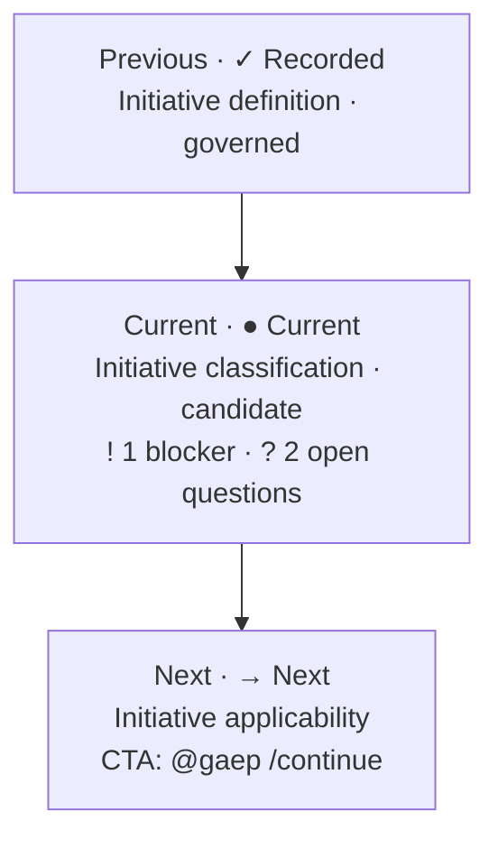

> **Static example, not live state.** Open Product Studio or run `@gaep /status` for the actual workspace position, candidate/governed status, blockers, attention count, open questions, and next valid CTA.
<!-- END GENERATED:CHECKPOINT_POSITION_EXAMPLE -->

### Checkpoint states and attention indicators

<!-- BEGIN GENERATED:STATE_LEGEND -->
Primary progression state and attention indicators are separate. For example, a governed **Recorded** checkpoint may also carry **Needs attention**; a candidate may carry **2 open questions** without becoming governed.

#### Primary progression states

<details><summary><strong>✓ Recorded</strong> · `complete`</summary>

- **Meaning:** A governed checkpoint revision is recorded for the current Product context.
- **Content:** governed.
- **Your action:** Review the recorded values and revise them when evidence or context changes.
- **Progression:** possible-subject-to-downstream-prerequisites.
- **Persists:** The governed revision, evidence bindings, and audit history persist.
- **Does not authorize:** Recording does not grant approval, publication, readiness, rollout, release, or production authority.

</details>

<details><summary><strong>◆ Candidate ready for review</strong> · `candidate-ready`</summary>

- **Meaning:** A bounded proposal exists, but it has not become governed state.
- **Content:** candidate.
- **Your action:** Inspect the exact candidate, challenge it, and either revise, reject, or explicitly accept it.
- **Progression:** review-required.
- **Persists:** Only candidate metadata and evidence bindings persist until an explicit governed commit.
- **Does not authorize:** A candidate does not approve itself and does not authorize downstream execution.

</details>

<details><summary><strong>! Needs decisions</strong> · `needs-decisions`</summary>

- **Meaning:** A candidate is incomplete because one or more accountable human decisions remain open.
- **Content:** candidate.
- **Your action:** Resolve the named decisions or record them explicitly as unresolved with an owner.
- **Progression:** bounded-work-may-continue-when-runtime-allows.
- **Persists:** The candidate, missing-decision list, and evidence digests persist.
- **Does not authorize:** An unresolved decision is not an implied approval or waiver.

</details>

<details><summary><strong>⏸ Waiting for prerequisite</strong> · `blocked-by-prerequisite`</summary>

- **Meaning:** The checkpoint cannot validly progress until a named governed prerequisite is satisfied.
- **Content:** candidate-or-empty.
- **Your action:** Open the prerequisite checkpoint and complete or explicitly resolve its required work.
- **Progression:** not-possible.
- **Persists:** Any bounded candidate and the exact prerequisite reason persist.
- **Does not authorize:** A blocked checkpoint cannot be treated as complete, approved, or ready.

</details>

<details><summary><strong>● Current</strong> · `current`</summary>

- **Meaning:** This is the first currently actionable checkpoint in the live runtime projection.
- **Content:** not-yet-governed.
- **Your action:** Use the displayed next valid action to start or resume the checkpoint.
- **Progression:** possible.
- **Persists:** No governed checkpoint content persists until its workflow is explicitly committed.
- **Does not authorize:** Being current is navigation state, not approval or readiness.

</details>

<details><summary><strong>→ Next</strong> · `next`</summary>

- **Meaning:** This is the next valid checkpoint selected by the live Product Journey projection.
- **Content:** not-yet-governed.
- **Your action:** Use the displayed CTA when you are ready to continue.
- **Progression:** possible.
- **Persists:** The navigation projection is recomputed from governed and candidate state.
- **Does not authorize:** Next does not mean approved, ready, or mandatory.

</details>

<details><summary><strong>○ Not started</strong> · `not-started`</summary>

- **Meaning:** No governed revision or reviewable candidate exists for this checkpoint in the current context.
- **Content:** none.
- **Your action:** Complete earlier prerequisites, then start the checkpoint when it becomes the next valid action.
- **Progression:** not-currently-actionable.
- **Persists:** No checkpoint content is created merely by displaying this state.
- **Does not authorize:** Absence of work is not a negative finding, rejection, or waiver.

</details>

#### Attention indicators

<details><summary><strong>! Needs attention</strong> · overlay `needs-attention`</summary>

- **Meaning:** Recorded or candidate content has a stale, incomplete, conflicting, or otherwise reviewable condition.
- **Your action:** Use the enabled resolution action and preserve the prior revision until a replacement is committed.
- **Progression:** depends-on-the-named-condition.
- **Persists:** The prior state and the attention reason persist.
- **Does not authorize:** Attention is not approval, rejection, or automatic invalidation.

</details>

<details><summary><strong>⛔ Blocked</strong> · overlay `blocked`</summary>

- **Meaning:** A blocker prevents the named progression even if a candidate or earlier governed revision exists.
- **Your action:** Resolve the explicit blocker or record a scoped human decision; do not bypass it by relabeling state.
- **Progression:** not-possible.
- **Persists:** The blocker, affected checkpoint identity, and any prior revision persist.
- **Does not authorize:** Blocked work cannot be represented as ready, released, or complete.

</details>

<details><summary><strong>? Unresolved / Open questions</strong> · overlay `open-questions`</summary>

- **Meaning:** One or more questions lack a reviewed answer or accountable disposition.
- **Your action:** Answer, defer with an owner and trigger, or explicitly exclude each question within scope.
- **Progression:** depends-on-question-materiality.
- **Persists:** Question text, owner, evidence basis, and disposition persist when recorded.
- **Does not authorize:** Silence, missing evidence, or an unresolved question never becomes consent or approval.

</details>

#### Exact runtime-to-presentation mapping

| Runtime machine state | Primary visible state | Attention overlay(s) |
|---|---|---|
| `complete` | ✓ Recorded | None |
| `attention-required` | ✓ Recorded | ! Needs attention |
| `candidate-ready` | ◆ Candidate ready for review | None |
| `needs-decisions` | ! Needs decisions | ? Unresolved / Open questions |
| `blocked-by-prerequisite` | ⏸ Waiting for prerequisite | ⛔ Blocked |
| `current` | ● Current | None |
| `next` | → Next | None |
| `not-started` | ○ Not started | None |

**Unknown rule:** Unknown means not assessed or not established; it never means No.

**Accessibility rule:** Every state uses text and an accessible marker; color is supplementary only.
<!-- END GENERATED:STATE_LEGEND -->

These labels are generated from the same presentation contract used by Product Studio. State is always text plus a marker; color is optional and never carries meaning alone.

## 3. Practitioner guide

_For Product, architecture, design, engineering, assurance, and operations practitioners · about 20 minutes_

### A. Current Runtime

This view contains only behavior and terminology that exist in the current repository/runtime. Its count and order are a versioned snapshot, not permanent architecture.

<!-- BEGIN GENERATED:CURRENT_RUNTIME -->
<!-- GAEP-VISUAL:current-runtime -->

**Current runtime checkpoint inventory**

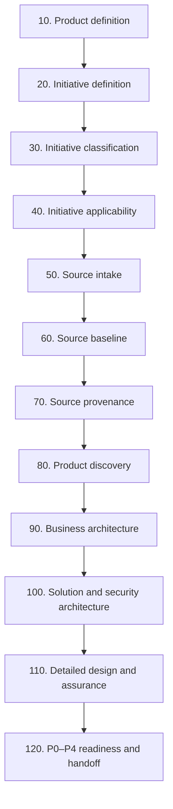

| Stable checkpoint ID | Order and current label | Current prerequisites | Implemented CTA, maturity, and limitation |
|---|---|---|---|
| `product-definition` | 10 · Product definition | None | @gaep /initialize; @gaep /adopt; Edit Product definition<br/>[IA] Implemented; awaiting independent P03 review<br/>Records a Product boundary; it does not establish market need, funding, or investment approval. |
| `initiative-definition` | 20 · Initiative definition | product-definition | @gaep /continue; Edit Initiative definition<br/>[IA] Implemented; awaiting independent P03 review<br/>Bounds a change; it does not authorize execution or funding. |
| `initiative-classification` | 30 · Initiative classification | initiative-definition | @gaep /classification; Resolve open questions<br/>[IA] Implemented; awaiting independent P03 review<br/>Classification is scoped evidence, not an approval, risk acceptance, or waiver. |
| `initiative-applicability` | 40 · Initiative applicability | initiative-classification | @gaep /applicability; Resolve pending decisions<br/>[IA] Implemented; awaiting independent P03 review<br/>Applicability records scoped decisions; it does not grant approval, readiness, or execution authority. |
| `source-intake` | 50 · Source intake | initiative-definition | @gaep /intake; @gaep /record; Bind reviewed Sources to Initiative<br/>[IA] Implemented; awaiting independent P03 review<br/>Attachment and extraction do not establish Source correctness, authority, rights, or Baseline membership. |
| `source-baseline` | 60 · Source baseline | source-intake | @gaep /baseline; Review details<br/>[IA] Implemented; awaiting independent P03 review<br/>A Baseline freezes membership; it does not approve content, establish precedence, or make evidence complete. |
| `source-provenance` | 70 · Source provenance | source-intake | @gaep /provenance; Revise Source provenance<br/>[IA] Implemented; awaiting independent P03 review<br/>Provenance records lineage; it does not establish correctness, authenticity, authority, or approval. |
| `product-discovery` | 80 · Product discovery | initiative-applicability, source-intake | @gaep /author; Review details; Edit Product discovery<br/>[IA] Implemented; awaiting independent P03 review<br/>Discovery records remain evidence-bounded; they do not prove demand, viability, desirability, or investment approval. |
| `business-architecture` | 90 · Business architecture | product-discovery | @gaep /author; Review details; Edit Business architecture<br/>[IA] Implemented; awaiting independent P03 review<br/>Recorded models do not certify organizational design or force microservices; DDD is a reasoning policy, not a deployment prescription. |
| `solution-security-architecture` | 100 · Solution and security architecture | business-architecture | @gaep /author; Review details; Edit solution and security architecture<br/>[IA] Implemented; awaiting independent P03 review<br/>Architecture records do not create security, privacy, compliance, risk-acceptance, deployment, or implementation authority. |
| `detailed-design-assurance` | 110 · Detailed design and assurance | solution-security-architecture | @gaep /author; Review details; Edit detailed design and assurance<br/>[IA] Implemented; awaiting independent P03 review<br/>Models and assurance evidence do not establish release, production, security, privacy, compliance, or operational readiness. |
| `p0-p4-readiness` | 120 · P0–P4 readiness and handoff | detailed-design-assurance | @gaep /author; Review details; Edit handoff inputs<br/>[IA] Implemented; awaiting independent P03 review<br/>This is the final current-runtime checkpoint. Product Design, backlog, implementation, CI/CD, release, deployment, and operations execution remain target-only. |

> **Compatibility — `p0-p4-readiness`:** The adoption alias remains accepted for historical plans; all current-runtime surfaces display one canonical P0–P4 readiness and handoff label.
<!-- END GENERATED:CURRENT_RUNTIME -->

<!-- BEGIN GENERATED:CHECKPOINT_EXECUTION -->
#### Executive phase-level RACI

| Phase | R | A | Independent assurance |
|---|---|---|---|
| 1 · Product and Initiative foundation | product-manager, initiative-lead, risk-compliance-specialist | business-owner | internal-audit-independent-assurance |
| 2 · Trusted sources | initiative-lead, domain-expert | business-owner | internal-audit-independent-assurance |
| 3 · Product discovery | product-manager, product-design-research | business-owner | — |
| 4 · Business architecture | business-architect, domain-expert | product-leadership | enterprise-architect |
| 5 · Solution and security architecture | solution-architect, security-architect | enterprise-architect | risk-compliance-specialist, internal-audit-independent-assurance |
| 6 · Detailed design and assurance | solution-architect, quality-engineering | engineering-leadership | ai-evaluation-tevv, internal-audit-independent-assurance |
| 7 · Readiness and handoff | initiative-lead, quality-engineering | engineering-leadership | internal-audit-independent-assurance |

#### Every current checkpoint — canonical substeps, RACI, sequence, and authority

<details>
<summary><strong>10 · Product definition</strong> · [IA] Implemented; awaiting independent P03 review</summary>

**Purpose:** Establish the bounded Product, problem, affected users, outcomes, success signals, and exclusions.

**Why it exists:** AI-assisted work needs a stable Product boundary so later decisions do not optimize an undefined or shifting object.

**When it starts / prerequisites:** Trusted Product workspace is open Entry-path and source availability are understood Prerequisites: none.

**Roles and competency:** roles `product-manager`, `business-owner`, `affected-user-stakeholder`; competencies `lifecycle-literacy`, `product-initiative-reasoning`, `candidate-accept-commit`.

**Inputs:** workspace-context, optional-reviewed-references. **Questions:** What Product and problem are in scope? Who is affected and what measurable outcome matters? What is explicitly excluded?

<!-- GAEP-VISUAL:checkpoint-product-definition-flow -->

**Product definition substeps and return path**

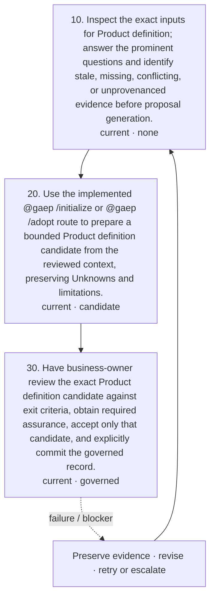

<!-- GAEP-SEQUENCE:checkpoint-product-definition -->

**Product definition — current canonical execution sequence**

```mermaid
%% Product definition — current canonical execution sequence
sequenceDiagram
participant role0 as product-manager
participant role1 as business-owner
participant gaep as GAEP runtime
role0->>gaep: 10. Inspect the exact inputs for Product definition; answer the prominent questions and identify stale, missing, conflicting, or unprovenanced evidence before proposal generation.
gaep-->>role0: review-context-ready; no authority created
role0->>gaep: 20. Use the implemented @gaep /initialize or @gaep /adopt route to prepare a bounded Product definition candidate from the reviewed context, preserving Unknowns and limitations. Action: @gaep /initialize or @gaep /adopt
gaep-->>role0: Candidate only · candidate-ready-for-review
role0->>role1: 30. Have business-owner review the exact Product definition candidate against exit criteria, obtain required assurance, accept only that candidate, and explicitly commit the governed record. Action: @gaep /commit CONFIRM
role1->>gaep: Exact acceptance / explicit commit or reject
gaep-->>role0: recorded-or-needs-decisions; authority remains bounded
```

**Ordered substeps**

- **10 · `product-definition-inspect`** — Inspect the exact inputs for Product definition; answer the prominent questions and identify stale, missing, conflicting, or unprovenanced evidence before proposal generation. **Before/after:** not-started-or-prerequisite-satisfied → review-context-ready. **Action:** none; inspect only. **Evidence:** consumes Reviewed Product references and stakeholder evidence; produces Bounded review context, named gaps, conflicts, assumptions, and freshness observations. **Criteria:** What Product and problem are in scope?; Who is affected and what measurable outcome matters?; What is explicitly excluded?; Every material assertion has exact evidence or remains Unknown. **Failure/blocker:** Required input cannot be identified; Evidence limitation prevents a bounded conclusion Expose the missing prerequisite/evidence and stop the affected proposal path without discarding prior records. **Retry:** Supply or revise the bounded input, preserve the prior review context, and inspect again. **Audit:** The current runtime records workflow/audit evidence only when its implemented action executes; this inspection description creates none by itself. **Authority:** Inspection creates no candidate, acceptance, governed state, or execution authority.
- **20 · `product-definition-propose`** — Use the implemented @gaep /initialize or @gaep /adopt route to prepare a bounded Product definition candidate from the reviewed context, preserving Unknowns and limitations. **Before/after:** review-context-ready → candidate-ready-for-review. **Action:** `@gaep /initialize or @gaep /adopt` (chat-command). **Evidence:** consumes Reviewed Product references and stakeholder evidence; Current governed prerequisite digests; produces Exact Product definition candidate, candidate digest, unresolved decisions, and evidence bindings. **Criteria:** Candidate is bounded to exact inputs; AI inference is visible; No missing evidence is converted to fact. **Failure/blocker:** Implemented action is unavailable; Candidate output is incomplete, stale, or exceeds its evidence Keep the candidate non-governed, show the failure, and require correction or cancellation. **Retry:** Challenge or revise exact inputs and rerun the same implemented action; never overwrite prior governed state. **Audit:** The runtime preserves candidate/run diagnostics and exact evidence digests where the implemented workflow supports them. **Authority:** AI assistance creates a candidate only; it cannot accept, approve, waive, commit, or authorize work.
- **30 · `product-definition-decide-commit`** — Have business-owner review the exact Product definition candidate against exit criteria, obtain required assurance, accept only that candidate, and explicitly commit the governed record. **Before/after:** candidate-ready-for-review → recorded-or-needs-decisions. **Action:** `@gaep /commit CONFIRM` (chat-command). **Evidence:** consumes Exact Product definition candidate and limitations; Challenge and assurance findings; produces Human acceptance disposition, governed revision, audit event, and retained candidate/input digests. **Criteria:** Exactly one accountable role is named; Required assurance findings are resolved or explicitly retained; The accepted digest equals the committed digest. **Failure/blocker:** Accountability is absent; Candidate changed after review; Material blocker or assurance finding remains undisposed Do not commit; preserve the candidate and blocker with an accountable owner and escalation path. **Retry:** Reject or revise the candidate, regenerate a new digest, repeat review, then accept and commit explicitly. **Audit:** The implemented commit records the exact accepted proposal and actor/context in governed audit history. **Authority:** Commit governs this bounded record only; separate authorities remain required for risk acceptance, implementation, repository mutation, release, deployment, and operations.

**AI activity:** Use the implemented @gaep /initialize or @gaep /adopt route to prepare a bounded Product definition candidate from the reviewed context, preserving Unknowns and limitations.

**Human activity:** Inspect the exact inputs for Product definition; answer the prominent questions and identify stale, missing, conflicting, or unprovenanced evidence before proposal generation. Have business-owner review the exact Product definition candidate against exit criteria, obtain required assurance, accept only that candidate, and explicitly commit the governed record.

**Candidate outputs:** governed-product-definition-candidate. **Governed outputs:** governed-product-definition. **Decision records:** product-definition-acceptance-decision.

**Evidence and Provenance:** Reviewed Product references and stakeholder evidence Exact input identities, revisions, digests, freshness, provenance, and declared limitations

**Substep RACI**

| Step | R | A | C / I / independent assurance |
|---|---|---|---|
| `product-definition-inspect` | product-manager | — (no decision) | C: business-owner, affected-user-stakeholder<br/>I: —<br/>Assurance: — |
| `product-definition-propose` | product-manager | — (no decision) | C: business-owner, affected-user-stakeholder<br/>I: —<br/>Assurance: — |
| `product-definition-decide-commit` | product-manager | business-owner | C: affected-user-stakeholder<br/>I: initiative-lead<br/>Assurance: — |

**Decision and authority:** Acceptance applies only to the exact candidate Commit creates governed state; it does not grant implementation, release, operational, security, privacy, compliance, or certification authority

**Blockers / exception / escalation:** A named prerequisite is absent or stale; Required evidence is unavailable or contradictory; The accountable role or required independent assurance is absent. Preserve prior governed records, mark the exception and scope explicitly, and continue only where the runtime and accountable authority permit bounded work. Escalate unresolved material decisions to business-owner; use independent assurance when the role/risk profile requires it.

**Exit / next:** The exact Product definition candidate is reviewed against declared evidence and limitations Open material decisions have an accountable disposition The governed-product-definition record is explicitly committed or the checkpoint remains visibly unresolved Next valid transitions: initiative-definition.

**Current limitations:** Records a Product boundary; it does not establish market need, funding, or investment approval.

**Target evolution:** Adds explicit entry assessment, operational-Product entry, and enterprise governance context.

</details>

<details>
<summary><strong>20 · Initiative definition</strong> · [IA] Implemented; awaiting independent P03 review</summary>

**Purpose:** Bound the proposed change, outcome, scope, constraints, and relationship to the governed Product.

**Why it exists:** A Product can contain many changes; evidence, decisions, and authority must be scoped to one Initiative.

**When it starts / prerequisites:** Governed Product definition exists Prerequisites: product-definition.

**Roles and competency:** roles `initiative-lead`, `product-manager`, `business-owner`; competencies `product-initiative-reasoning`, `evidence-provenance`, `candidate-accept-commit`.

**Inputs:** governed-product-definition, initiative-context. **Questions:** What change and outcome are bounded? What is included and excluded? Which constraints and dependencies apply?

<!-- GAEP-VISUAL:checkpoint-initiative-definition-flow -->

**Initiative definition substeps and return path**

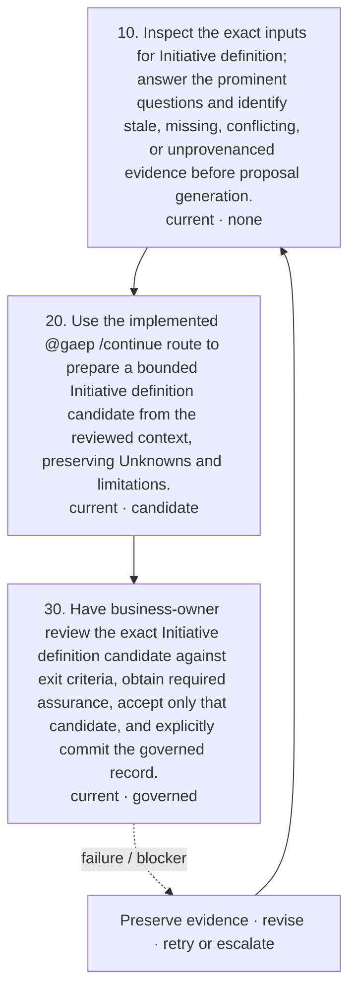

<!-- GAEP-SEQUENCE:checkpoint-initiative-definition -->

**Initiative definition — current canonical execution sequence**

```mermaid
%% Initiative definition — current canonical execution sequence
sequenceDiagram
participant role0 as initiative-lead
participant role1 as product-manager
participant role2 as business-owner
participant gaep as GAEP runtime
role0->>gaep: 10. Inspect the exact inputs for Initiative definition; answer the prominent questions and identify stale, missing, conflicting, or unprovenanced evidence before proposal generation.
gaep-->>role0: review-context-ready; no authority created
role0->>gaep: 20. Use the implemented @gaep /continue route to prepare a bounded Initiative definition candidate from the reviewed context, preserving Unknowns and limitations. Action: @gaep /continue
gaep-->>role0: Candidate only · candidate-ready-for-review
role0->>role2: 30. Have business-owner review the exact Initiative definition candidate against exit criteria, obtain required assurance, accept only that candidate, and explicitly commit the governed record. Action: @gaep /commit CONFIRM
role2->>gaep: Exact acceptance / explicit commit or reject
gaep-->>role0: recorded-or-needs-decisions; authority remains bounded
```

**Ordered substeps**

- **10 · `initiative-definition-inspect`** — Inspect the exact inputs for Initiative definition; answer the prominent questions and identify stale, missing, conflicting, or unprovenanced evidence before proposal generation. **Before/after:** not-started-or-prerequisite-satisfied → review-context-ready. **Action:** none; inspect only. **Evidence:** consumes Reviewed change request, objectives, constraints, and stakeholder context; produces Bounded review context, named gaps, conflicts, assumptions, and freshness observations. **Criteria:** What change and outcome are bounded?; What is included and excluded?; Which constraints and dependencies apply?; Every material assertion has exact evidence or remains Unknown. **Failure/blocker:** Required input cannot be identified; Evidence limitation prevents a bounded conclusion Expose the missing prerequisite/evidence and stop the affected proposal path without discarding prior records. **Retry:** Supply or revise the bounded input, preserve the prior review context, and inspect again. **Audit:** The current runtime records workflow/audit evidence only when its implemented action executes; this inspection description creates none by itself. **Authority:** Inspection creates no candidate, acceptance, governed state, or execution authority.
- **20 · `initiative-definition-propose`** — Use the implemented @gaep /continue route to prepare a bounded Initiative definition candidate from the reviewed context, preserving Unknowns and limitations. **Before/after:** review-context-ready → candidate-ready-for-review. **Action:** `@gaep /continue` (chat-command). **Evidence:** consumes Reviewed change request, objectives, constraints, and stakeholder context; Current governed prerequisite digests; produces Exact Initiative definition candidate, candidate digest, unresolved decisions, and evidence bindings. **Criteria:** Candidate is bounded to exact inputs; AI inference is visible; No missing evidence is converted to fact. **Failure/blocker:** Implemented action is unavailable; Candidate output is incomplete, stale, or exceeds its evidence Keep the candidate non-governed, show the failure, and require correction or cancellation. **Retry:** Challenge or revise exact inputs and rerun the same implemented action; never overwrite prior governed state. **Audit:** The runtime preserves candidate/run diagnostics and exact evidence digests where the implemented workflow supports them. **Authority:** AI assistance creates a candidate only; it cannot accept, approve, waive, commit, or authorize work.
- **30 · `initiative-definition-decide-commit`** — Have business-owner review the exact Initiative definition candidate against exit criteria, obtain required assurance, accept only that candidate, and explicitly commit the governed record. **Before/after:** candidate-ready-for-review → recorded-or-needs-decisions. **Action:** `@gaep /commit CONFIRM` (chat-command). **Evidence:** consumes Exact Initiative definition candidate and limitations; Challenge and assurance findings; produces Human acceptance disposition, governed revision, audit event, and retained candidate/input digests. **Criteria:** Exactly one accountable role is named; Required assurance findings are resolved or explicitly retained; The accepted digest equals the committed digest. **Failure/blocker:** Accountability is absent; Candidate changed after review; Material blocker or assurance finding remains undisposed Do not commit; preserve the candidate and blocker with an accountable owner and escalation path. **Retry:** Reject or revise the candidate, regenerate a new digest, repeat review, then accept and commit explicitly. **Audit:** The implemented commit records the exact accepted proposal and actor/context in governed audit history. **Authority:** Commit governs this bounded record only; separate authorities remain required for risk acceptance, implementation, repository mutation, release, deployment, and operations.

**AI activity:** Use the implemented @gaep /continue route to prepare a bounded Initiative definition candidate from the reviewed context, preserving Unknowns and limitations.

**Human activity:** Inspect the exact inputs for Initiative definition; answer the prominent questions and identify stale, missing, conflicting, or unprovenanced evidence before proposal generation. Have business-owner review the exact Initiative definition candidate against exit criteria, obtain required assurance, accept only that candidate, and explicitly commit the governed record.

**Candidate outputs:** governed-initiative-definition-candidate. **Governed outputs:** governed-initiative-definition. **Decision records:** initiative-definition-acceptance-decision.

**Evidence and Provenance:** Reviewed change request, objectives, constraints, and stakeholder context Exact input identities, revisions, digests, freshness, provenance, and declared limitations

**Substep RACI**

| Step | R | A | C / I / independent assurance |
|---|---|---|---|
| `initiative-definition-inspect` | initiative-lead, product-manager | — (no decision) | C: business-owner<br/>I: —<br/>Assurance: — |
| `initiative-definition-propose` | initiative-lead, product-manager | — (no decision) | C: business-owner<br/>I: —<br/>Assurance: — |
| `initiative-definition-decide-commit` | initiative-lead, product-manager | business-owner | C: —<br/>I: initiative-lead<br/>Assurance: — |

**Decision and authority:** Acceptance applies only to the exact candidate Commit creates governed state; it does not grant implementation, release, operational, security, privacy, compliance, or certification authority

**Blockers / exception / escalation:** A named prerequisite is absent or stale; Required evidence is unavailable or contradictory; The accountable role or required independent assurance is absent. Preserve prior governed records, mark the exception and scope explicitly, and continue only where the runtime and accountable authority permit bounded work. Escalate unresolved material decisions to business-owner; use independent assurance when the role/risk profile requires it.

**Exit / next:** The exact Initiative definition candidate is reviewed against declared evidence and limitations Open material decisions have an accountable disposition The governed-initiative-definition record is explicitly committed or the checkpoint remains visibly unresolved Next valid transitions: initiative-classification, source-intake.

**Current limitations:** Bounds a change; it does not authorize execution or funding.

**Target evolution:** Adds richer entry-point assessment and Initiative topology/applicability metadata.

</details>

<details>
<summary><strong>30 · Initiative classification</strong> · [IA] Implemented; awaiting independent P03 review</summary>

**Purpose:** Classify change, risk, data/AI, regulatory, delivery, and assurance characteristics without silently resolving them.

**Why it exists:** Classification selects applicable governance and competence requirements before irreversible design choices.

**When it starts / prerequisites:** Governed Initiative definition exists Prerequisites: initiative-definition.

**Roles and competency:** roles `initiative-lead`, `risk-compliance-specialist`, `security-architect`, `privacy-specialist`; competencies `risk-compliance`, `security`, `privacy`, `ai-literacy-limitations`.

**Inputs:** governed-initiative-definition, classification-evidence. **Questions:** Which risk, data, AI, regulatory, and delivery traits apply? Which classifications remain Unknown? Which assurance roles become mandatory?

<!-- GAEP-VISUAL:checkpoint-initiative-classification-flow -->

**Initiative classification substeps and return path**

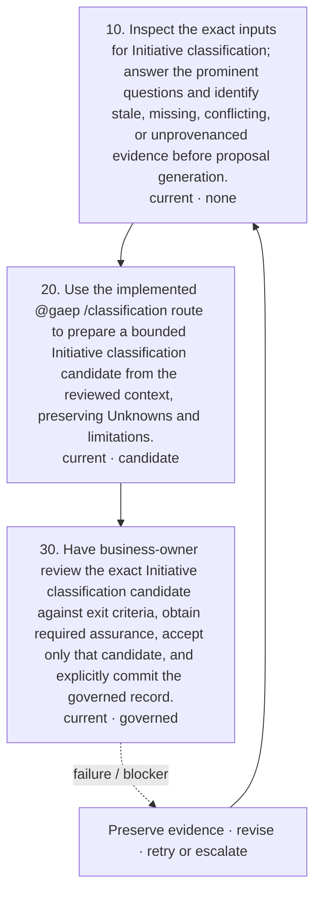

<!-- GAEP-SEQUENCE:checkpoint-initiative-classification -->

**Initiative classification — current canonical execution sequence**

```mermaid
%% Initiative classification — current canonical execution sequence
sequenceDiagram
participant role0 as initiative-lead
participant role1 as risk-compliance-specialist
participant role2 as business-owner
participant role3 as internal-audit-independent-assurance
participant gaep as GAEP runtime
role0->>gaep: 10. Inspect the exact inputs for Initiative classification; answer the prominent questions and identify stale, missing, conflicting, or unprovenanced evidence before proposal generation.
gaep-->>role0: review-context-ready; no authority created
role0->>gaep: 20. Use the implemented @gaep /classification route to prepare a bounded Initiative classification candidate from the reviewed context, preserving Unknowns and limitations. Action: @gaep /classification
gaep-->>role0: Candidate only · candidate-ready-for-review
role0->>role2: 30. Have business-owner review the exact Initiative classification candidate against exit criteria, obtain required assurance, accept only that candidate, and explicitly commit the governed record. Action: @gaep /commit CONFIRM
role2->>gaep: Exact acceptance / explicit commit or reject
gaep-->>role0: recorded-or-needs-decisions; authority remains bounded
```

**Ordered substeps**

- **10 · `initiative-classification-inspect`** — Inspect the exact inputs for Initiative classification; answer the prominent questions and identify stale, missing, conflicting, or unprovenanced evidence before proposal generation. **Before/after:** not-started-or-prerequisite-satisfied → review-context-ready. **Action:** none; inspect only. **Evidence:** consumes Applicable policies, data/AI characteristics, jurisdictions, and risk evidence; produces Bounded review context, named gaps, conflicts, assumptions, and freshness observations. **Criteria:** Which risk, data, AI, regulatory, and delivery traits apply?; Which classifications remain Unknown?; Which assurance roles become mandatory?; Every material assertion has exact evidence or remains Unknown. **Failure/blocker:** Required input cannot be identified; Evidence limitation prevents a bounded conclusion Expose the missing prerequisite/evidence and stop the affected proposal path without discarding prior records. **Retry:** Supply or revise the bounded input, preserve the prior review context, and inspect again. **Audit:** The current runtime records workflow/audit evidence only when its implemented action executes; this inspection description creates none by itself. **Authority:** Inspection creates no candidate, acceptance, governed state, or execution authority.
- **20 · `initiative-classification-propose`** — Use the implemented @gaep /classification route to prepare a bounded Initiative classification candidate from the reviewed context, preserving Unknowns and limitations. **Before/after:** review-context-ready → candidate-ready-for-review. **Action:** `@gaep /classification` (chat-command). **Evidence:** consumes Applicable policies, data/AI characteristics, jurisdictions, and risk evidence; Current governed prerequisite digests; produces Exact Initiative classification candidate, candidate digest, unresolved decisions, and evidence bindings. **Criteria:** Candidate is bounded to exact inputs; AI inference is visible; No missing evidence is converted to fact. **Failure/blocker:** Implemented action is unavailable; Candidate output is incomplete, stale, or exceeds its evidence Keep the candidate non-governed, show the failure, and require correction or cancellation. **Retry:** Challenge or revise exact inputs and rerun the same implemented action; never overwrite prior governed state. **Audit:** The runtime preserves candidate/run diagnostics and exact evidence digests where the implemented workflow supports them. **Authority:** AI assistance creates a candidate only; it cannot accept, approve, waive, commit, or authorize work.
- **30 · `initiative-classification-decide-commit`** — Have business-owner review the exact Initiative classification candidate against exit criteria, obtain required assurance, accept only that candidate, and explicitly commit the governed record. **Before/after:** candidate-ready-for-review → recorded-or-needs-decisions. **Action:** `@gaep /commit CONFIRM` (chat-command). **Evidence:** consumes Exact Initiative classification candidate and limitations; Challenge and assurance findings; produces Human acceptance disposition, governed revision, audit event, and retained candidate/input digests. **Criteria:** Exactly one accountable role is named; Required assurance findings are resolved or explicitly retained; The accepted digest equals the committed digest. **Failure/blocker:** Accountability is absent; Candidate changed after review; Material blocker or assurance finding remains undisposed Do not commit; preserve the candidate and blocker with an accountable owner and escalation path. **Retry:** Reject or revise the candidate, regenerate a new digest, repeat review, then accept and commit explicitly. **Audit:** The implemented commit records the exact accepted proposal and actor/context in governed audit history. **Authority:** Commit governs this bounded record only; separate authorities remain required for risk acceptance, implementation, repository mutation, release, deployment, and operations.

**AI activity:** Use the implemented @gaep /classification route to prepare a bounded Initiative classification candidate from the reviewed context, preserving Unknowns and limitations.

**Human activity:** Inspect the exact inputs for Initiative classification; answer the prominent questions and identify stale, missing, conflicting, or unprovenanced evidence before proposal generation. Have business-owner review the exact Initiative classification candidate against exit criteria, obtain required assurance, accept only that candidate, and explicitly commit the governed record.

**Candidate outputs:** governed-initiative-classification-candidate. **Governed outputs:** governed-initiative-classification. **Decision records:** initiative-classification-acceptance-decision.

**Evidence and Provenance:** Applicable policies, data/AI characteristics, jurisdictions, and risk evidence Exact input identities, revisions, digests, freshness, provenance, and declared limitations

**Substep RACI**

| Step | R | A | C / I / independent assurance |
|---|---|---|---|
| `initiative-classification-inspect` | initiative-lead, risk-compliance-specialist | — (no decision) | C: security-architect, privacy-specialist<br/>I: —<br/>Assurance: — |
| `initiative-classification-propose` | initiative-lead, risk-compliance-specialist | — (no decision) | C: security-architect, privacy-specialist<br/>I: —<br/>Assurance: — |
| `initiative-classification-decide-commit` | initiative-lead, risk-compliance-specialist | business-owner | C: security-architect, privacy-specialist<br/>I: initiative-lead<br/>Assurance: internal-audit-independent-assurance |

**Decision and authority:** Acceptance applies only to the exact candidate Commit creates governed state; it does not grant implementation, release, operational, security, privacy, compliance, or certification authority

**Blockers / exception / escalation:** A named prerequisite is absent or stale; Required evidence is unavailable or contradictory; The accountable role or required independent assurance is absent. Preserve prior governed records, mark the exception and scope explicitly, and continue only where the runtime and accountable authority permit bounded work. Escalate unresolved material decisions to business-owner; use independent assurance when the role/risk profile requires it.

**Exit / next:** The exact Initiative classification candidate is reviewed against declared evidence and limitations Open material decisions have an accountable disposition The governed-initiative-classification record is explicitly committed or the checkpoint remains visibly unresolved Next valid transitions: initiative-applicability.

**Current limitations:** Classification is scoped evidence, not an approval, risk acceptance, or waiver.

**Target evolution:** Drives risk-based competency, assurance, and control applicability gateways.

</details>

<details>
<summary><strong>40 · Initiative applicability</strong> · [IA] Implemented; awaiting independent P03 review</summary>

**Purpose:** Decide which governed concerns, methods, controls, and assurance obligations apply to the Initiative.

**Why it exists:** Not every control applies equally, but exclusions require evidence and accountable disposition.

**When it starts / prerequisites:** Current governed classification exists Prerequisites: initiative-classification.

**Roles and competency:** roles `initiative-lead`, `risk-compliance-specialist`, `security-architect`, `privacy-specialist`, `legal-regulatory-specialist`; competencies `risk-compliance`, `security`, `privacy`, `challenge-escalation`.

**Inputs:** governed-initiative-classification, applicability-policy-set. **Questions:** What applies and why? What is excluded and who is accountable? Which missing decisions block progression?

<!-- GAEP-VISUAL:checkpoint-initiative-applicability-flow -->

**Initiative applicability substeps and return path**


<!-- GAEP-SEQUENCE:checkpoint-initiative-applicability -->

**Initiative applicability — current canonical execution sequence**

```mermaid
%% Initiative applicability — current canonical execution sequence
sequenceDiagram
participant role0 as initiative-lead
participant role1 as risk-compliance-specialist
participant role2 as business-owner
participant role3 as internal-audit-independent-assurance
participant gaep as GAEP runtime
role0->>gaep: 10. Inspect the exact inputs for Initiative applicability; answer the prominent questions and identify stale, missing, conflicting, or unprovenanced evidence before proposal generation.
gaep-->>role0: review-context-ready; no authority created
role0->>gaep: 20. Use the implemented @gaep /applicability route to prepare a bounded Initiative applicability candidate from the reviewed context, preserving Unknowns and limitations. Action: @gaep /applicability
gaep-->>role0: Candidate only · candidate-ready-for-review
role0->>role2: 30. Have business-owner review the exact Initiative applicability candidate against exit criteria, obtain required assurance, accept only that candidate, and explicitly commit the governed record. Action: @gaep /commit CONFIRM
role2->>gaep: Exact acceptance / explicit commit or reject
gaep-->>role0: recorded-or-needs-decisions; authority remains bounded
```

**Ordered substeps**

- **10 · `initiative-applicability-inspect`** — Inspect the exact inputs for Initiative applicability; answer the prominent questions and identify stale, missing, conflicting, or unprovenanced evidence before proposal generation. **Before/after:** not-started-or-prerequisite-satisfied → review-context-ready. **Action:** none; inspect only. **Evidence:** consumes Classification, policy, jurisdiction, risk, and explicit inclusion/exclusion rationale; produces Bounded review context, named gaps, conflicts, assumptions, and freshness observations. **Criteria:** What applies and why?; What is excluded and who is accountable?; Which missing decisions block progression?; Every material assertion has exact evidence or remains Unknown. **Failure/blocker:** Required input cannot be identified; Evidence limitation prevents a bounded conclusion Expose the missing prerequisite/evidence and stop the affected proposal path without discarding prior records. **Retry:** Supply or revise the bounded input, preserve the prior review context, and inspect again. **Audit:** The current runtime records workflow/audit evidence only when its implemented action executes; this inspection description creates none by itself. **Authority:** Inspection creates no candidate, acceptance, governed state, or execution authority.
- **20 · `initiative-applicability-propose`** — Use the implemented @gaep /applicability route to prepare a bounded Initiative applicability candidate from the reviewed context, preserving Unknowns and limitations. **Before/after:** review-context-ready → candidate-ready-for-review. **Action:** `@gaep /applicability` (chat-command). **Evidence:** consumes Classification, policy, jurisdiction, risk, and explicit inclusion/exclusion rationale; Current governed prerequisite digests; produces Exact Initiative applicability candidate, candidate digest, unresolved decisions, and evidence bindings. **Criteria:** Candidate is bounded to exact inputs; AI inference is visible; No missing evidence is converted to fact. **Failure/blocker:** Implemented action is unavailable; Candidate output is incomplete, stale, or exceeds its evidence Keep the candidate non-governed, show the failure, and require correction or cancellation. **Retry:** Challenge or revise exact inputs and rerun the same implemented action; never overwrite prior governed state. **Audit:** The runtime preserves candidate/run diagnostics and exact evidence digests where the implemented workflow supports them. **Authority:** AI assistance creates a candidate only; it cannot accept, approve, waive, commit, or authorize work.
- **30 · `initiative-applicability-decide-commit`** — Have business-owner review the exact Initiative applicability candidate against exit criteria, obtain required assurance, accept only that candidate, and explicitly commit the governed record. **Before/after:** candidate-ready-for-review → recorded-or-needs-decisions. **Action:** `@gaep /commit CONFIRM` (chat-command). **Evidence:** consumes Exact Initiative applicability candidate and limitations; Challenge and assurance findings; produces Human acceptance disposition, governed revision, audit event, and retained candidate/input digests. **Criteria:** Exactly one accountable role is named; Required assurance findings are resolved or explicitly retained; The accepted digest equals the committed digest. **Failure/blocker:** Accountability is absent; Candidate changed after review; Material blocker or assurance finding remains undisposed Do not commit; preserve the candidate and blocker with an accountable owner and escalation path. **Retry:** Reject or revise the candidate, regenerate a new digest, repeat review, then accept and commit explicitly. **Audit:** The implemented commit records the exact accepted proposal and actor/context in governed audit history. **Authority:** Commit governs this bounded record only; separate authorities remain required for risk acceptance, implementation, repository mutation, release, deployment, and operations.

**AI activity:** Use the implemented @gaep /applicability route to prepare a bounded Initiative applicability candidate from the reviewed context, preserving Unknowns and limitations.

**Human activity:** Inspect the exact inputs for Initiative applicability; answer the prominent questions and identify stale, missing, conflicting, or unprovenanced evidence before proposal generation. Have business-owner review the exact Initiative applicability candidate against exit criteria, obtain required assurance, accept only that candidate, and explicitly commit the governed record.

**Candidate outputs:** governed-initiative-applicability-candidate. **Governed outputs:** governed-initiative-applicability. **Decision records:** initiative-applicability-acceptance-decision.

**Evidence and Provenance:** Classification, policy, jurisdiction, risk, and explicit inclusion/exclusion rationale Exact input identities, revisions, digests, freshness, provenance, and declared limitations

**Substep RACI**

| Step | R | A | C / I / independent assurance |
|---|---|---|---|
| `initiative-applicability-inspect` | initiative-lead, risk-compliance-specialist | — (no decision) | C: security-architect, privacy-specialist, legal-regulatory-specialist<br/>I: —<br/>Assurance: — |
| `initiative-applicability-propose` | initiative-lead, risk-compliance-specialist | — (no decision) | C: security-architect, privacy-specialist, legal-regulatory-specialist<br/>I: —<br/>Assurance: — |
| `initiative-applicability-decide-commit` | initiative-lead, risk-compliance-specialist | business-owner | C: security-architect, privacy-specialist, legal-regulatory-specialist<br/>I: initiative-lead<br/>Assurance: internal-audit-independent-assurance |

**Decision and authority:** Acceptance applies only to the exact candidate Commit creates governed state; it does not grant implementation, release, operational, security, privacy, compliance, or certification authority

**Blockers / exception / escalation:** A named prerequisite is absent or stale; Required evidence is unavailable or contradictory; The accountable role or required independent assurance is absent. Preserve prior governed records, mark the exception and scope explicitly, and continue only where the runtime and accountable authority permit bounded work. Escalate unresolved material decisions to business-owner; use independent assurance when the role/risk profile requires it.

**Exit / next:** The exact Initiative applicability candidate is reviewed against declared evidence and limitations Open material decisions have an accountable disposition The governed-initiative-applicability record is explicitly committed or the checkpoint remains visibly unresolved Next valid transitions: source-intake, product-discovery.

**Current limitations:** Applicability records scoped decisions; it does not grant approval, readiness, or execution authority.

**Target evolution:** Connects applicability to competency, control, assurance, and exception requirements.

</details>

<details>
<summary><strong>50 · Source intake</strong> · [IA] Implemented; awaiting independent P03 review</summary>

**Purpose:** Review exact candidate material and record bounded Source identities without treating attachments as truth.

**Why it exists:** Downstream candidates require reconstructable evidence rather than untraceable context or link-only claims.

**When it starts / prerequisites:** Product and Initiative exist Applicability prerequisites are current for Chat Intake Prerequisites: initiative-definition.

**Roles and competency:** roles `initiative-lead`, `domain-expert`, `risk-compliance-specialist`; competencies `source-governance`, `evidence-provenance`, `candidate-accept-commit`.

**Inputs:** attachment-review-manifest, governed-initiative-definition. **Questions:** What exact content was reviewed? What are its identity, revision, freshness, limitations, and semantic standing? What remains link-only or unreadable?

<!-- GAEP-VISUAL:checkpoint-source-intake-flow -->

**Source intake substeps and return path**

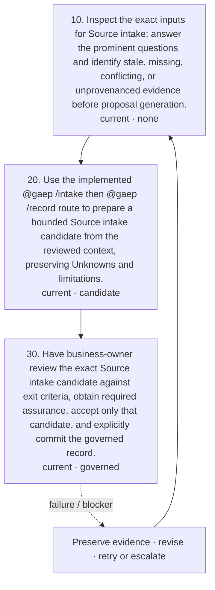

<!-- GAEP-SEQUENCE:checkpoint-source-intake -->

**Source intake — current canonical execution sequence**

```mermaid
%% Source intake — current canonical execution sequence
sequenceDiagram
participant role0 as initiative-lead
participant role1 as domain-expert
participant role2 as business-owner
participant gaep as GAEP runtime
role0->>gaep: 10. Inspect the exact inputs for Source intake; answer the prominent questions and identify stale, missing, conflicting, or unprovenanced evidence before proposal generation.
gaep-->>role0: review-context-ready; no authority created
role0->>gaep: 20. Use the implemented @gaep /intake then @gaep /record route to prepare a bounded Source intake candidate from the reviewed context, preserving Unknowns and limitations. Action: @gaep /intake
gaep-->>role0: Candidate only · candidate-ready-for-review
role0->>role2: 30. Have business-owner review the exact Source intake candidate against exit criteria, obtain required assurance, accept only that candidate, and explicitly commit the governed record. Action: @gaep /commit CONFIRM
role2->>gaep: Exact acceptance / explicit commit or reject
gaep-->>role0: recorded-or-needs-decisions; authority remains bounded
```

**Ordered substeps**

- **10 · `source-intake-inspect`** — Inspect the exact inputs for Source intake; answer the prominent questions and identify stale, missing, conflicting, or unprovenanced evidence before proposal generation. **Before/after:** not-started-or-prerequisite-satisfied → review-context-ready. **Action:** none; inspect only. **Evidence:** consumes Exact selected bytes, extraction report, content digest, locator, and human review; produces Bounded review context, named gaps, conflicts, assumptions, and freshness observations. **Criteria:** What exact content was reviewed?; What are its identity, revision, freshness, limitations, and semantic standing?; What remains link-only or unreadable?; Every material assertion has exact evidence or remains Unknown. **Failure/blocker:** Required input cannot be identified; Evidence limitation prevents a bounded conclusion Expose the missing prerequisite/evidence and stop the affected proposal path without discarding prior records. **Retry:** Supply or revise the bounded input, preserve the prior review context, and inspect again. **Audit:** The current runtime records workflow/audit evidence only when its implemented action executes; this inspection description creates none by itself. **Authority:** Inspection creates no candidate, acceptance, governed state, or execution authority.
- **20 · `source-intake-propose`** — Use the implemented @gaep /intake then @gaep /record route to prepare a bounded Source intake candidate from the reviewed context, preserving Unknowns and limitations. **Before/after:** review-context-ready → candidate-ready-for-review. **Action:** `@gaep /intake` (chat-command). **Evidence:** consumes Exact selected bytes, extraction report, content digest, locator, and human review; Current governed prerequisite digests; produces Exact Source intake candidate, candidate digest, unresolved decisions, and evidence bindings. **Criteria:** Candidate is bounded to exact inputs; AI inference is visible; No missing evidence is converted to fact. **Failure/blocker:** Implemented action is unavailable; Candidate output is incomplete, stale, or exceeds its evidence Keep the candidate non-governed, show the failure, and require correction or cancellation. **Retry:** Challenge or revise exact inputs and rerun the same implemented action; never overwrite prior governed state. **Audit:** The runtime preserves candidate/run diagnostics and exact evidence digests where the implemented workflow supports them. **Authority:** AI assistance creates a candidate only; it cannot accept, approve, waive, commit, or authorize work.
- **30 · `source-intake-decide-commit`** — Have business-owner review the exact Source intake candidate against exit criteria, obtain required assurance, accept only that candidate, and explicitly commit the governed record. **Before/after:** candidate-ready-for-review → recorded-or-needs-decisions. **Action:** `@gaep /commit CONFIRM` (chat-command). **Evidence:** consumes Exact Source intake candidate and limitations; Challenge and assurance findings; produces Human acceptance disposition, governed revision, audit event, and retained candidate/input digests. **Criteria:** Exactly one accountable role is named; Required assurance findings are resolved or explicitly retained; The accepted digest equals the committed digest. **Failure/blocker:** Accountability is absent; Candidate changed after review; Material blocker or assurance finding remains undisposed Do not commit; preserve the candidate and blocker with an accountable owner and escalation path. **Retry:** Reject or revise the candidate, regenerate a new digest, repeat review, then accept and commit explicitly. **Audit:** The implemented commit records the exact accepted proposal and actor/context in governed audit history. **Authority:** Commit governs this bounded record only; separate authorities remain required for risk acceptance, implementation, repository mutation, release, deployment, and operations.

**AI activity:** Use the implemented @gaep /intake then @gaep /record route to prepare a bounded Source intake candidate from the reviewed context, preserving Unknowns and limitations.

**Human activity:** Inspect the exact inputs for Source intake; answer the prominent questions and identify stale, missing, conflicting, or unprovenanced evidence before proposal generation. Have business-owner review the exact Source intake candidate against exit criteria, obtain required assurance, accept only that candidate, and explicitly commit the governed record.

**Candidate outputs:** governed-source-record-set-candidate. **Governed outputs:** governed-source-record-set. **Decision records:** source-intake-acceptance-decision.

**Evidence and Provenance:** Exact selected bytes, extraction report, content digest, locator, and human review Exact input identities, revisions, digests, freshness, provenance, and declared limitations

**Substep RACI**

| Step | R | A | C / I / independent assurance |
|---|---|---|---|
| `source-intake-inspect` | initiative-lead, domain-expert | — (no decision) | C: risk-compliance-specialist<br/>I: —<br/>Assurance: — |
| `source-intake-propose` | initiative-lead, domain-expert | — (no decision) | C: risk-compliance-specialist<br/>I: —<br/>Assurance: — |
| `source-intake-decide-commit` | initiative-lead, domain-expert | business-owner | C: risk-compliance-specialist<br/>I: initiative-lead<br/>Assurance: — |

**Decision and authority:** Acceptance applies only to the exact candidate Commit creates governed state; it does not grant implementation, release, operational, security, privacy, compliance, or certification authority

**Blockers / exception / escalation:** A named prerequisite is absent or stale; Required evidence is unavailable or contradictory; The accountable role or required independent assurance is absent. Preserve prior governed records, mark the exception and scope explicitly, and continue only where the runtime and accountable authority permit bounded work. Escalate unresolved material decisions to business-owner; use independent assurance when the role/risk profile requires it.

**Exit / next:** The exact Source intake candidate is reviewed against declared evidence and limitations Open material decisions have an accountable disposition The governed-source-record-set record is explicitly committed or the checkpoint remains visibly unresolved Next valid transitions: source-baseline, source-provenance, product-discovery.

**Current limitations:** Attachment and extraction do not establish Source correctness, authority, rights, or Baseline membership.

**Target evolution:** Adds explicit removal, exclusion, supersession, unavailability, and source-change governance; those transitions are not currently executable.

</details>

<details>
<summary><strong>60 · Source baseline</strong> · [IA] Implemented; awaiting independent P03 review</summary>

**Purpose:** Freeze exact Source identities and revisions for a bounded Initiative context.

**Why it exists:** A decision must remain reconstructable even after referenced material changes.

**When it starts / prerequisites:** At least one governed Initiative Source exists Prerequisites: source-intake.

**Roles and competency:** roles `initiative-lead`, `domain-expert`, `risk-compliance-specialist`; competencies `source-governance`, `evidence-provenance`, `auditability`.

**Inputs:** governed-source-record-set. **Questions:** Which exact Source revisions are in scope? Is membership complete enough for the bounded decision? What changes require revalidation?

<!-- GAEP-VISUAL:checkpoint-source-baseline-flow -->

**Source baseline substeps and return path**

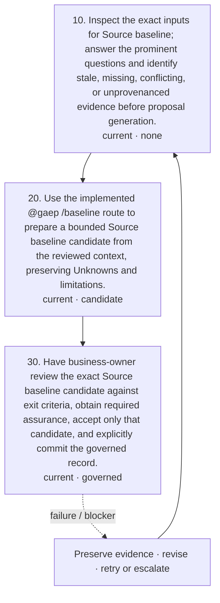

<!-- GAEP-SEQUENCE:checkpoint-source-baseline -->

**Source baseline — current canonical execution sequence**

```mermaid
%% Source baseline — current canonical execution sequence
sequenceDiagram
participant role0 as initiative-lead
participant role1 as business-owner
participant gaep as GAEP runtime
role0->>gaep: 10. Inspect the exact inputs for Source baseline; answer the prominent questions and identify stale, missing, conflicting, or unprovenanced evidence before proposal generation.
gaep-->>role0: review-context-ready; no authority created
role0->>gaep: 20. Use the implemented @gaep /baseline route to prepare a bounded Source baseline candidate from the reviewed context, preserving Unknowns and limitations. Action: @gaep /baseline
gaep-->>role0: Candidate only · candidate-ready-for-review
role0->>role1: 30. Have business-owner review the exact Source baseline candidate against exit criteria, obtain required assurance, accept only that candidate, and explicitly commit the governed record. Action: @gaep /commit CONFIRM
role1->>gaep: Exact acceptance / explicit commit or reject
gaep-->>role0: recorded-or-needs-decisions; authority remains bounded
```

**Ordered substeps**

- **10 · `source-baseline-inspect`** — Inspect the exact inputs for Source baseline; answer the prominent questions and identify stale, missing, conflicting, or unprovenanced evidence before proposal generation. **Before/after:** not-started-or-prerequisite-satisfied → review-context-ready. **Action:** none; inspect only. **Evidence:** consumes Exact Source IDs, revisions, record/content digests, membership rationale, and freshness; produces Bounded review context, named gaps, conflicts, assumptions, and freshness observations. **Criteria:** Which exact Source revisions are in scope?; Is membership complete enough for the bounded decision?; What changes require revalidation?; Every material assertion has exact evidence or remains Unknown. **Failure/blocker:** Required input cannot be identified; Evidence limitation prevents a bounded conclusion Expose the missing prerequisite/evidence and stop the affected proposal path without discarding prior records. **Retry:** Supply or revise the bounded input, preserve the prior review context, and inspect again. **Audit:** The current runtime records workflow/audit evidence only when its implemented action executes; this inspection description creates none by itself. **Authority:** Inspection creates no candidate, acceptance, governed state, or execution authority.
- **20 · `source-baseline-propose`** — Use the implemented @gaep /baseline route to prepare a bounded Source baseline candidate from the reviewed context, preserving Unknowns and limitations. **Before/after:** review-context-ready → candidate-ready-for-review. **Action:** `@gaep /baseline` (chat-command). **Evidence:** consumes Exact Source IDs, revisions, record/content digests, membership rationale, and freshness; Current governed prerequisite digests; produces Exact Source baseline candidate, candidate digest, unresolved decisions, and evidence bindings. **Criteria:** Candidate is bounded to exact inputs; AI inference is visible; No missing evidence is converted to fact. **Failure/blocker:** Implemented action is unavailable; Candidate output is incomplete, stale, or exceeds its evidence Keep the candidate non-governed, show the failure, and require correction or cancellation. **Retry:** Challenge or revise exact inputs and rerun the same implemented action; never overwrite prior governed state. **Audit:** The runtime preserves candidate/run diagnostics and exact evidence digests where the implemented workflow supports them. **Authority:** AI assistance creates a candidate only; it cannot accept, approve, waive, commit, or authorize work.
- **30 · `source-baseline-decide-commit`** — Have business-owner review the exact Source baseline candidate against exit criteria, obtain required assurance, accept only that candidate, and explicitly commit the governed record. **Before/after:** candidate-ready-for-review → recorded-or-needs-decisions. **Action:** `@gaep /commit CONFIRM` (chat-command). **Evidence:** consumes Exact Source baseline candidate and limitations; Challenge and assurance findings; produces Human acceptance disposition, governed revision, audit event, and retained candidate/input digests. **Criteria:** Exactly one accountable role is named; Required assurance findings are resolved or explicitly retained; The accepted digest equals the committed digest. **Failure/blocker:** Accountability is absent; Candidate changed after review; Material blocker or assurance finding remains undisposed Do not commit; preserve the candidate and blocker with an accountable owner and escalation path. **Retry:** Reject or revise the candidate, regenerate a new digest, repeat review, then accept and commit explicitly. **Audit:** The implemented commit records the exact accepted proposal and actor/context in governed audit history. **Authority:** Commit governs this bounded record only; separate authorities remain required for risk acceptance, implementation, repository mutation, release, deployment, and operations.

**AI activity:** Use the implemented @gaep /baseline route to prepare a bounded Source baseline candidate from the reviewed context, preserving Unknowns and limitations.

**Human activity:** Inspect the exact inputs for Source baseline; answer the prominent questions and identify stale, missing, conflicting, or unprovenanced evidence before proposal generation. Have business-owner review the exact Source baseline candidate against exit criteria, obtain required assurance, accept only that candidate, and explicitly commit the governed record.

**Candidate outputs:** governed-source-baseline-candidate. **Governed outputs:** governed-source-baseline. **Decision records:** source-baseline-acceptance-decision.

**Evidence and Provenance:** Exact Source IDs, revisions, record/content digests, membership rationale, and freshness Exact input identities, revisions, digests, freshness, provenance, and declared limitations

**Substep RACI**

| Step | R | A | C / I / independent assurance |
|---|---|---|---|
| `source-baseline-inspect` | initiative-lead | — (no decision) | C: domain-expert, risk-compliance-specialist<br/>I: —<br/>Assurance: — |
| `source-baseline-propose` | initiative-lead | — (no decision) | C: domain-expert, risk-compliance-specialist<br/>I: —<br/>Assurance: — |
| `source-baseline-decide-commit` | initiative-lead | business-owner | C: domain-expert, risk-compliance-specialist<br/>I: initiative-lead<br/>Assurance: — |

**Decision and authority:** Acceptance applies only to the exact candidate Commit creates governed state; it does not grant implementation, release, operational, security, privacy, compliance, or certification authority

**Blockers / exception / escalation:** A named prerequisite is absent or stale; Required evidence is unavailable or contradictory; The accountable role or required independent assurance is absent. Preserve prior governed records, mark the exception and scope explicitly, and continue only where the runtime and accountable authority permit bounded work. Escalate unresolved material decisions to business-owner; use independent assurance when the role/risk profile requires it.

**Exit / next:** The exact Source baseline candidate is reviewed against declared evidence and limitations Open material decisions have an accountable disposition The governed-source-baseline record is explicitly committed or the checkpoint remains visibly unresolved Next valid transitions: source-provenance, product-discovery.

**Current limitations:** A Baseline freezes membership; it does not approve content, establish precedence, or make evidence complete.

**Target evolution:** Adds selective membership change workflow and explicit downstream revalidation graph.

</details>

<details>
<summary><strong>70 · Source provenance</strong> · [IA] Implemented; awaiting independent P03 review</summary>

**Purpose:** Record exact lineage, locators, transformations, derivations, uncertainty, and limitations.

**Why it exists:** Baseline membership cannot explain how a claim or model was derived from a Source.

**When it starts / prerequisites:** Governed Source record exists Prerequisites: source-intake.

**Roles and competency:** roles `initiative-lead`, `domain-expert`, `internal-audit-independent-assurance`; competencies `evidence-provenance`, `source-governance`, `auditability`.

**Inputs:** governed-source-record-set, candidate-derivation-targets. **Questions:** Which exact Source revision supports which target? What transformation or interpretation occurred? What uncertainty and limitations remain?

<!-- GAEP-VISUAL:checkpoint-source-provenance-flow -->

**Source provenance substeps and return path**

```mermaid
%% Source provenance substeps and return path
flowchart TD
  source_provenance_0["10. Inspect the exact inputs for Source provenance; answer the prominent questions and identify stale, missing, conflicting, or unprovenanced evidence before proposal generation.<br/>current · none"]
  source_provenance_1["20. Use the implemented @gaep /provenance route to prepare a bounded Source provenance candidate from the reviewed context, preserving Unknowns and limitations.<br/>current · candidate"]
  source_provenance_0 --> source_provenance_1
  source_provenance_2["30. Have business-owner review the exact Source provenance candidate against exit criteria, obtain required assurance, accept only that candidate, and explicitly commit the governed record.<br/>current · governed"]
  source_provenance_1 --> source_provenance_2
  source_provenance_2 -. "failure / blocker" .-> source_provenance_revise["Preserve evidence · revise · retry or escalate"]
  source_provenance_revise --> source_provenance_0
```

<!-- GAEP-SEQUENCE:checkpoint-source-provenance -->

**Source provenance — current canonical execution sequence**

```mermaid
%% Source provenance — current canonical execution sequence
sequenceDiagram
participant role0 as initiative-lead
participant role1 as domain-expert
participant role2 as business-owner
participant role3 as internal-audit-independent-assurance
participant gaep as GAEP runtime
role0->>gaep: 10. Inspect the exact inputs for Source provenance; answer the prominent questions and identify stale, missing, conflicting, or unprovenanced evidence before proposal generation.
gaep-->>role0: review-context-ready; no authority created
role0->>gaep: 20. Use the implemented @gaep /provenance route to prepare a bounded Source provenance candidate from the reviewed context, preserving Unknowns and limitations. Action: @gaep /provenance
gaep-->>role0: Candidate only · candidate-ready-for-review
role0->>role2: 30. Have business-owner review the exact Source provenance candidate against exit criteria, obtain required assurance, accept only that candidate, and explicitly commit the governed record. Action: @gaep /commit CONFIRM
role2->>gaep: Exact acceptance / explicit commit or reject
gaep-->>role0: recorded-or-needs-decisions; authority remains bounded
```

**Ordered substeps**

- **10 · `source-provenance-inspect`** — Inspect the exact inputs for Source provenance; answer the prominent questions and identify stale, missing, conflicting, or unprovenanced evidence before proposal generation. **Before/after:** not-started-or-prerequisite-satisfied → review-context-ready. **Action:** none; inspect only. **Evidence:** consumes Exact Source/target revisions, locators, derivation roles, transformations, and limitations; produces Bounded review context, named gaps, conflicts, assumptions, and freshness observations. **Criteria:** Which exact Source revision supports which target?; What transformation or interpretation occurred?; What uncertainty and limitations remain?; Every material assertion has exact evidence or remains Unknown. **Failure/blocker:** Required input cannot be identified; Evidence limitation prevents a bounded conclusion Expose the missing prerequisite/evidence and stop the affected proposal path without discarding prior records. **Retry:** Supply or revise the bounded input, preserve the prior review context, and inspect again. **Audit:** The current runtime records workflow/audit evidence only when its implemented action executes; this inspection description creates none by itself. **Authority:** Inspection creates no candidate, acceptance, governed state, or execution authority.
- **20 · `source-provenance-propose`** — Use the implemented @gaep /provenance route to prepare a bounded Source provenance candidate from the reviewed context, preserving Unknowns and limitations. **Before/after:** review-context-ready → candidate-ready-for-review. **Action:** `@gaep /provenance` (chat-command). **Evidence:** consumes Exact Source/target revisions, locators, derivation roles, transformations, and limitations; Current governed prerequisite digests; produces Exact Source provenance candidate, candidate digest, unresolved decisions, and evidence bindings. **Criteria:** Candidate is bounded to exact inputs; AI inference is visible; No missing evidence is converted to fact. **Failure/blocker:** Implemented action is unavailable; Candidate output is incomplete, stale, or exceeds its evidence Keep the candidate non-governed, show the failure, and require correction or cancellation. **Retry:** Challenge or revise exact inputs and rerun the same implemented action; never overwrite prior governed state. **Audit:** The runtime preserves candidate/run diagnostics and exact evidence digests where the implemented workflow supports them. **Authority:** AI assistance creates a candidate only; it cannot accept, approve, waive, commit, or authorize work.
- **30 · `source-provenance-decide-commit`** — Have business-owner review the exact Source provenance candidate against exit criteria, obtain required assurance, accept only that candidate, and explicitly commit the governed record. **Before/after:** candidate-ready-for-review → recorded-or-needs-decisions. **Action:** `@gaep /commit CONFIRM` (chat-command). **Evidence:** consumes Exact Source provenance candidate and limitations; Challenge and assurance findings; produces Human acceptance disposition, governed revision, audit event, and retained candidate/input digests. **Criteria:** Exactly one accountable role is named; Required assurance findings are resolved or explicitly retained; The accepted digest equals the committed digest. **Failure/blocker:** Accountability is absent; Candidate changed after review; Material blocker or assurance finding remains undisposed Do not commit; preserve the candidate and blocker with an accountable owner and escalation path. **Retry:** Reject or revise the candidate, regenerate a new digest, repeat review, then accept and commit explicitly. **Audit:** The implemented commit records the exact accepted proposal and actor/context in governed audit history. **Authority:** Commit governs this bounded record only; separate authorities remain required for risk acceptance, implementation, repository mutation, release, deployment, and operations.

**AI activity:** Use the implemented @gaep /provenance route to prepare a bounded Source provenance candidate from the reviewed context, preserving Unknowns and limitations.

**Human activity:** Inspect the exact inputs for Source provenance; answer the prominent questions and identify stale, missing, conflicting, or unprovenanced evidence before proposal generation. Have business-owner review the exact Source provenance candidate against exit criteria, obtain required assurance, accept only that candidate, and explicitly commit the governed record.

**Candidate outputs:** governed-source-provenance-candidate. **Governed outputs:** governed-source-provenance. **Decision records:** source-provenance-acceptance-decision.

**Evidence and Provenance:** Exact Source/target revisions, locators, derivation roles, transformations, and limitations Exact input identities, revisions, digests, freshness, provenance, and declared limitations

**Substep RACI**

| Step | R | A | C / I / independent assurance |
|---|---|---|---|
| `source-provenance-inspect` | initiative-lead, domain-expert | — (no decision) | C: internal-audit-independent-assurance<br/>I: —<br/>Assurance: — |
| `source-provenance-propose` | initiative-lead, domain-expert | — (no decision) | C: internal-audit-independent-assurance<br/>I: —<br/>Assurance: — |
| `source-provenance-decide-commit` | initiative-lead, domain-expert | business-owner | C: internal-audit-independent-assurance<br/>I: initiative-lead<br/>Assurance: internal-audit-independent-assurance |

**Decision and authority:** Acceptance applies only to the exact candidate Commit creates governed state; it does not grant implementation, release, operational, security, privacy, compliance, or certification authority

**Blockers / exception / escalation:** A named prerequisite is absent or stale; Required evidence is unavailable or contradictory; The accountable role or required independent assurance is absent. Preserve prior governed records, mark the exception and scope explicitly, and continue only where the runtime and accountable authority permit bounded work. Escalate unresolved material decisions to business-owner; use independent assurance when the role/risk profile requires it.

**Exit / next:** The exact Source provenance candidate is reviewed against declared evidence and limitations Open material decisions have an accountable disposition The governed-source-provenance record is explicitly committed or the checkpoint remains visibly unresolved Next valid transitions: product-discovery.

**Current limitations:** Provenance records lineage; it does not establish correctness, authenticity, authority, or approval.

**Target evolution:** Extends lineage across design, backlog, implementation, release, and operations evidence.

</details>

<details>
<summary><strong>80 · Product discovery</strong> · [IA] Implemented; awaiting independent P03 review</summary>

**Purpose:** Challenge and record business understanding, stakeholders, outcomes, needs, assumptions, and success measures.

**Why it exists:** Architecture and backlog choices need evidence about users, value, viability, and uncertainty.

**When it starts / prerequisites:** Initiative applicability and Source foundation are sufficient for bounded discovery Prerequisites: initiative-applicability, source-intake.

**Roles and competency:** roles `product-manager`, `domain-expert`, `product-design-research`, `affected-user-stakeholder`; competencies `domain-business-analysis`, `product-initiative-reasoning`, `evidence-provenance`, `product-design`.

**Inputs:** governed-initiative-applicability, governed-source-record-set. **Questions:** Which user and business problem is evidenced? Which outcomes and measures matter? What assumptions need testing?

<!-- GAEP-VISUAL:checkpoint-product-discovery-flow -->

**Product discovery substeps and return path**

```mermaid
%% Product discovery substeps and return path
flowchart TD
  product_discovery_0["10. Inspect the exact inputs for Product discovery; answer the prominent questions and identify stale, missing, conflicting, or unprovenanced evidence before proposal generation.<br/>current · none"]
  product_discovery_1["20. Use the implemented @gaep /author route to prepare a bounded Product discovery candidate from the reviewed context, preserving Unknowns and limitations.<br/>current · candidate"]
  product_discovery_0 --> product_discovery_1
  product_discovery_2["30. Have business-owner review the exact Product discovery candidate against exit criteria, obtain required assurance, accept only that candidate, and explicitly commit the governed record.<br/>current · governed"]
  product_discovery_1 --> product_discovery_2
  product_discovery_2 -. "failure / blocker" .-> product_discovery_revise["Preserve evidence · revise · retry or escalate"]
  product_discovery_revise --> product_discovery_0
```

<!-- GAEP-SEQUENCE:checkpoint-product-discovery -->

**Product discovery — current canonical execution sequence**

```mermaid
%% Product discovery — current canonical execution sequence
sequenceDiagram
participant role0 as product-manager
participant role1 as product-design-research
participant role2 as business-owner
participant gaep as GAEP runtime
role0->>gaep: 10. Inspect the exact inputs for Product discovery; answer the prominent questions and identify stale, missing, conflicting, or unprovenanced evidence before proposal generation.
gaep-->>role0: review-context-ready; no authority created
role0->>gaep: 20. Use the implemented @gaep /author route to prepare a bounded Product discovery candidate from the reviewed context, preserving Unknowns and limitations. Action: @gaep /author
gaep-->>role0: Candidate only · candidate-ready-for-review
role0->>role2: 30. Have business-owner review the exact Product discovery candidate against exit criteria, obtain required assurance, accept only that candidate, and explicitly commit the governed record. Action: @gaep /commit CONFIRM
role2->>gaep: Exact acceptance / explicit commit or reject
gaep-->>role0: recorded-or-needs-decisions; authority remains bounded
```

**Ordered substeps**

- **10 · `product-discovery-inspect`** — Inspect the exact inputs for Product discovery; answer the prominent questions and identify stale, missing, conflicting, or unprovenanced evidence before proposal generation. **Before/after:** not-started-or-prerequisite-satisfied → review-context-ready. **Action:** none; inspect only. **Evidence:** consumes User, stakeholder, business, outcome, and assumption evidence with provenance; produces Bounded review context, named gaps, conflicts, assumptions, and freshness observations. **Criteria:** Which user and business problem is evidenced?; Which outcomes and measures matter?; What assumptions need testing?; Every material assertion has exact evidence or remains Unknown. **Failure/blocker:** Required input cannot be identified; Evidence limitation prevents a bounded conclusion Expose the missing prerequisite/evidence and stop the affected proposal path without discarding prior records. **Retry:** Supply or revise the bounded input, preserve the prior review context, and inspect again. **Audit:** The current runtime records workflow/audit evidence only when its implemented action executes; this inspection description creates none by itself. **Authority:** Inspection creates no candidate, acceptance, governed state, or execution authority.
- **20 · `product-discovery-propose`** — Use the implemented @gaep /author route to prepare a bounded Product discovery candidate from the reviewed context, preserving Unknowns and limitations. **Before/after:** review-context-ready → candidate-ready-for-review. **Action:** `@gaep /author` (chat-command). **Evidence:** consumes User, stakeholder, business, outcome, and assumption evidence with provenance; Current governed prerequisite digests; produces Exact Product discovery candidate, candidate digest, unresolved decisions, and evidence bindings. **Criteria:** Candidate is bounded to exact inputs; AI inference is visible; No missing evidence is converted to fact. **Failure/blocker:** Implemented action is unavailable; Candidate output is incomplete, stale, or exceeds its evidence Keep the candidate non-governed, show the failure, and require correction or cancellation. **Retry:** Challenge or revise exact inputs and rerun the same implemented action; never overwrite prior governed state. **Audit:** The runtime preserves candidate/run diagnostics and exact evidence digests where the implemented workflow supports them. **Authority:** AI assistance creates a candidate only; it cannot accept, approve, waive, commit, or authorize work.
- **30 · `product-discovery-decide-commit`** — Have business-owner review the exact Product discovery candidate against exit criteria, obtain required assurance, accept only that candidate, and explicitly commit the governed record. **Before/after:** candidate-ready-for-review → recorded-or-needs-decisions. **Action:** `@gaep /commit CONFIRM` (chat-command). **Evidence:** consumes Exact Product discovery candidate and limitations; Challenge and assurance findings; produces Human acceptance disposition, governed revision, audit event, and retained candidate/input digests. **Criteria:** Exactly one accountable role is named; Required assurance findings are resolved or explicitly retained; The accepted digest equals the committed digest. **Failure/blocker:** Accountability is absent; Candidate changed after review; Material blocker or assurance finding remains undisposed Do not commit; preserve the candidate and blocker with an accountable owner and escalation path. **Retry:** Reject or revise the candidate, regenerate a new digest, repeat review, then accept and commit explicitly. **Audit:** The implemented commit records the exact accepted proposal and actor/context in governed audit history. **Authority:** Commit governs this bounded record only; separate authorities remain required for risk acceptance, implementation, repository mutation, release, deployment, and operations.

**AI activity:** Use the implemented @gaep /author route to prepare a bounded Product discovery candidate from the reviewed context, preserving Unknowns and limitations.

**Human activity:** Inspect the exact inputs for Product discovery; answer the prominent questions and identify stale, missing, conflicting, or unprovenanced evidence before proposal generation. Have business-owner review the exact Product discovery candidate against exit criteria, obtain required assurance, accept only that candidate, and explicitly commit the governed record.

**Candidate outputs:** governed-product-discovery-candidate. **Governed outputs:** governed-product-discovery. **Decision records:** product-discovery-acceptance-decision.

**Evidence and Provenance:** User, stakeholder, business, outcome, and assumption evidence with provenance Exact input identities, revisions, digests, freshness, provenance, and declared limitations

**Substep RACI**

| Step | R | A | C / I / independent assurance |
|---|---|---|---|
| `product-discovery-inspect` | product-manager, product-design-research | — (no decision) | C: domain-expert, affected-user-stakeholder<br/>I: —<br/>Assurance: — |
| `product-discovery-propose` | product-manager, product-design-research | — (no decision) | C: domain-expert, affected-user-stakeholder<br/>I: —<br/>Assurance: — |
| `product-discovery-decide-commit` | product-manager, product-design-research | business-owner | C: domain-expert, affected-user-stakeholder<br/>I: initiative-lead<br/>Assurance: — |

**Decision and authority:** Acceptance applies only to the exact candidate Commit creates governed state; it does not grant implementation, release, operational, security, privacy, compliance, or certification authority

**Blockers / exception / escalation:** A named prerequisite is absent or stale; Required evidence is unavailable or contradictory; The accountable role or required independent assurance is absent. Preserve prior governed records, mark the exception and scope explicitly, and continue only where the runtime and accountable authority permit bounded work. Escalate unresolved material decisions to business-owner; use independent assurance when the role/risk profile requires it.

**Exit / next:** The exact Product discovery candidate is reviewed against declared evidence and limitations Open material decisions have an accountable disposition The governed-product-discovery record is explicitly committed or the checkpoint remains visibly unresolved Next valid transitions: business-architecture.

**Current limitations:** Discovery records remain evidence-bounded; they do not prove demand, viability, desirability, or investment approval.

**Target evolution:** Adds iterative experiments, Product Design evidence ingestion, and outcome feedback loops.

</details>

<details>
<summary><strong>90 · Business architecture</strong> · [IA] Implemented; awaiting independent P03 review</summary>

**Purpose:** Model capabilities, value streams, operating model, business rules, events, domains, and candidate boundaries.

**Why it exists:** Solution architecture must trace to how the enterprise creates value and makes decisions.

**When it starts / prerequisites:** Bounded Product discovery record exists Prerequisites: product-discovery.

**Roles and competency:** roles `business-architect`, `domain-expert`, `enterprise-architect`, `affected-user-stakeholder`; competencies `domain-business-analysis`, `architecture-ddd`, `evidence-provenance`.

**Inputs:** governed-product-discovery, governed-source-baseline, governed-source-provenance. **Questions:** Which capabilities and value streams change? Which events, rules, domains, and ownership boundaries matter? Where are conflicts or unknowns?

<!-- GAEP-VISUAL:checkpoint-business-architecture-flow -->

**Business architecture substeps and return path**

```mermaid
%% Business architecture substeps and return path
flowchart TD
  business_architecture_0["10. Inspect the exact inputs for Business architecture; answer the prominent questions and identify stale, missing, conflicting, or unprovenanced evidence before proposal generation.<br/>current · none"]
  business_architecture_1["20. Use the implemented @gaep /author route to prepare a bounded Business architecture candidate from the reviewed context, preserving Unknowns and limitations.<br/>current · candidate"]
  business_architecture_0 --> business_architecture_1
  business_architecture_2["30. Have product-leadership review the exact Business architecture candidate against exit criteria, obtain required assurance, accept only that candidate, and explicitly commit the governed record.<br/>current · governed"]
  business_architecture_1 --> business_architecture_2
  business_architecture_2 -. "failure / blocker" .-> business_architecture_revise["Preserve evidence · revise · retry or escalate"]
  business_architecture_revise --> business_architecture_0
```

<!-- GAEP-SEQUENCE:checkpoint-business-architecture -->

**Business architecture — current canonical execution sequence**

```mermaid
%% Business architecture — current canonical execution sequence
sequenceDiagram
participant role0 as business-architect
participant role1 as domain-expert
participant role2 as product-leadership
participant role3 as enterprise-architect
participant gaep as GAEP runtime
role0->>gaep: 10. Inspect the exact inputs for Business architecture; answer the prominent questions and identify stale, missing, conflicting, or unprovenanced evidence before proposal generation.
gaep-->>role0: review-context-ready; no authority created
role0->>gaep: 20. Use the implemented @gaep /author route to prepare a bounded Business architecture candidate from the reviewed context, preserving Unknowns and limitations. Action: @gaep /author
gaep-->>role0: Candidate only · candidate-ready-for-review
role0->>role2: 30. Have product-leadership review the exact Business architecture candidate against exit criteria, obtain required assurance, accept only that candidate, and explicitly commit the governed record. Action: @gaep /commit CONFIRM
role2->>gaep: Exact acceptance / explicit commit or reject
gaep-->>role0: recorded-or-needs-decisions; authority remains bounded
```

**Ordered substeps**

- **10 · `business-architecture-inspect`** — Inspect the exact inputs for Business architecture; answer the prominent questions and identify stale, missing, conflicting, or unprovenanced evidence before proposal generation. **Before/after:** not-started-or-prerequisite-satisfied → review-context-ready. **Action:** none; inspect only. **Evidence:** consumes Discovery, business rules, capabilities, value streams, events, domain language, and ownership evidence; produces Bounded review context, named gaps, conflicts, assumptions, and freshness observations. **Criteria:** Which capabilities and value streams change?; Which events, rules, domains, and ownership boundaries matter?; Where are conflicts or unknowns?; Every material assertion has exact evidence or remains Unknown. **Failure/blocker:** Required input cannot be identified; Evidence limitation prevents a bounded conclusion Expose the missing prerequisite/evidence and stop the affected proposal path without discarding prior records. **Retry:** Supply or revise the bounded input, preserve the prior review context, and inspect again. **Audit:** The current runtime records workflow/audit evidence only when its implemented action executes; this inspection description creates none by itself. **Authority:** Inspection creates no candidate, acceptance, governed state, or execution authority.
- **20 · `business-architecture-propose`** — Use the implemented @gaep /author route to prepare a bounded Business architecture candidate from the reviewed context, preserving Unknowns and limitations. **Before/after:** review-context-ready → candidate-ready-for-review. **Action:** `@gaep /author` (chat-command). **Evidence:** consumes Discovery, business rules, capabilities, value streams, events, domain language, and ownership evidence; Current governed prerequisite digests; produces Exact Business architecture candidate, candidate digest, unresolved decisions, and evidence bindings. **Criteria:** Candidate is bounded to exact inputs; AI inference is visible; No missing evidence is converted to fact. **Failure/blocker:** Implemented action is unavailable; Candidate output is incomplete, stale, or exceeds its evidence Keep the candidate non-governed, show the failure, and require correction or cancellation. **Retry:** Challenge or revise exact inputs and rerun the same implemented action; never overwrite prior governed state. **Audit:** The runtime preserves candidate/run diagnostics and exact evidence digests where the implemented workflow supports them. **Authority:** AI assistance creates a candidate only; it cannot accept, approve, waive, commit, or authorize work.
- **30 · `business-architecture-decide-commit`** — Have product-leadership review the exact Business architecture candidate against exit criteria, obtain required assurance, accept only that candidate, and explicitly commit the governed record. **Before/after:** candidate-ready-for-review → recorded-or-needs-decisions. **Action:** `@gaep /commit CONFIRM` (chat-command). **Evidence:** consumes Exact Business architecture candidate and limitations; Challenge and assurance findings; produces Human acceptance disposition, governed revision, audit event, and retained candidate/input digests. **Criteria:** Exactly one accountable role is named; Required assurance findings are resolved or explicitly retained; The accepted digest equals the committed digest. **Failure/blocker:** Accountability is absent; Candidate changed after review; Material blocker or assurance finding remains undisposed Do not commit; preserve the candidate and blocker with an accountable owner and escalation path. **Retry:** Reject or revise the candidate, regenerate a new digest, repeat review, then accept and commit explicitly. **Audit:** The implemented commit records the exact accepted proposal and actor/context in governed audit history. **Authority:** Commit governs this bounded record only; separate authorities remain required for risk acceptance, implementation, repository mutation, release, deployment, and operations.

**AI activity:** Use the implemented @gaep /author route to prepare a bounded Business architecture candidate from the reviewed context, preserving Unknowns and limitations.

**Human activity:** Inspect the exact inputs for Business architecture; answer the prominent questions and identify stale, missing, conflicting, or unprovenanced evidence before proposal generation. Have product-leadership review the exact Business architecture candidate against exit criteria, obtain required assurance, accept only that candidate, and explicitly commit the governed record.

**Candidate outputs:** governed-business-architecture-candidate. **Governed outputs:** governed-business-architecture. **Decision records:** business-architecture-acceptance-decision.

**Evidence and Provenance:** Discovery, business rules, capabilities, value streams, events, domain language, and ownership evidence Exact input identities, revisions, digests, freshness, provenance, and declared limitations

**Substep RACI**

| Step | R | A | C / I / independent assurance |
|---|---|---|---|
| `business-architecture-inspect` | business-architect, domain-expert | — (no decision) | C: enterprise-architect, affected-user-stakeholder<br/>I: —<br/>Assurance: — |
| `business-architecture-propose` | business-architect, domain-expert | — (no decision) | C: enterprise-architect, affected-user-stakeholder<br/>I: —<br/>Assurance: — |
| `business-architecture-decide-commit` | business-architect, domain-expert | product-leadership | C: enterprise-architect, affected-user-stakeholder<br/>I: initiative-lead<br/>Assurance: enterprise-architect |

**Decision and authority:** Acceptance applies only to the exact candidate Commit creates governed state; it does not grant implementation, release, operational, security, privacy, compliance, or certification authority

**Blockers / exception / escalation:** A named prerequisite is absent or stale; Required evidence is unavailable or contradictory; The accountable role or required independent assurance is absent. Preserve prior governed records, mark the exception and scope explicitly, and continue only where the runtime and accountable authority permit bounded work. Escalate unresolved material decisions to product-leadership; use independent assurance when the role/risk profile requires it.

**Exit / next:** The exact Business architecture candidate is reviewed against declared evidence and limitations Open material decisions have an accountable disposition The governed-business-architecture record is explicitly committed or the checkpoint remains visibly unresolved Next valid transitions: solution-security-architecture.

**Current limitations:** Recorded models do not certify organizational design or force microservices; DDD is a reasoning policy, not a deployment prescription.

**Target evolution:** Separates discovery, Event Storming, DDD strategic design, and business architecture while preserving traceability.

</details>

<details>
<summary><strong>100 · Solution and security architecture</strong> · [IA] Implemented; awaiting independent P03 review</summary>

**Purpose:** Select and challenge solution, data, AI, integration, security, privacy, and deployment architecture for the affected slice.

**Why it exists:** Backlog finalization requires evidence-backed architecture sufficient to constrain the implementation slice.

**When it starts / prerequisites:** Business/domain architecture is current enough for the affected slice Prerequisites: business-architecture.

**Roles and competency:** roles `solution-architect`, `data-ai-architect`, `security-architect`, `privacy-specialist`, `platform-devops`; competencies `architecture-ddd`, `security`, `privacy`, `risk-compliance`, `repository-governance`.

**Inputs:** governed-business-architecture, architecture-constraints, applicable-control-outcomes. **Questions:** Which architecture style fits the evidence and constraints? How are security, privacy, data, AI, integration, and deployment risks handled? What decisions and alternatives remain?

<!-- GAEP-VISUAL:checkpoint-solution-security-architecture-flow -->

**Solution and security architecture substeps and return path**

```mermaid
%% Solution and security architecture substeps and return path
flowchart TD
  solution_security_architecture_0["10. Inspect the exact inputs for Solution and security architecture; answer the prominent questions and identify stale, missing, conflicting, or unprovenanced evidence before proposal generation.<br/>current · none"]
  solution_security_architecture_1["20. Use the implemented @gaep /author route to prepare a bounded Solution and security architecture candidate from the reviewed context, preserving Unknowns and limitations.<br/>current · candidate"]
  solution_security_architecture_0 --> solution_security_architecture_1
  solution_security_architecture_2["30. Have enterprise-architect review the exact Solution and security architecture candidate against exit criteria, obtain required assurance, accept only that candidate, and explicitly commit the governed record.<br/>current · governed"]
  solution_security_architecture_1 --> solution_security_architecture_2
  solution_security_architecture_2 -. "failure / blocker" .-> solution_security_architecture_revise["Preserve evidence · revise · retry or escalate"]
  solution_security_architecture_revise --> solution_security_architecture_0
```

<!-- GAEP-SEQUENCE:checkpoint-solution-security-architecture -->

**Solution and security architecture — current canonical execution sequence**

```mermaid
%% Solution and security architecture — current canonical execution sequence
sequenceDiagram
participant role0 as solution-architect
participant role1 as security-architect
participant role2 as enterprise-architect
participant role3 as risk-compliance-specialist
participant role4 as internal-audit-independent-assurance
participant gaep as GAEP runtime
role0->>gaep: 10. Inspect the exact inputs for Solution and security architecture; answer the prominent questions and identify stale, missing, conflicting, or unprovenanced evidence before proposal generation.
gaep-->>role0: review-context-ready; no authority created
role0->>gaep: 20. Use the implemented @gaep /author route to prepare a bounded Solution and security architecture candidate from the reviewed context, preserving Unknowns and limitations. Action: @gaep /author
gaep-->>role0: Candidate only · candidate-ready-for-review
role0->>role2: 30. Have enterprise-architect review the exact Solution and security architecture candidate against exit criteria, obtain required assurance, accept only that candidate, and explicitly commit the governed record. Action: @gaep /commit CONFIRM
role2->>gaep: Exact acceptance / explicit commit or reject
gaep-->>role0: recorded-or-needs-decisions; authority remains bounded
```

**Ordered substeps**

- **10 · `solution-security-architecture-inspect`** — Inspect the exact inputs for Solution and security architecture; answer the prominent questions and identify stale, missing, conflicting, or unprovenanced evidence before proposal generation. **Before/after:** not-started-or-prerequisite-satisfied → review-context-ready. **Action:** none; inspect only. **Evidence:** consumes Architecture alternatives, constraints, threats, privacy/data/AI impacts, decisions, and verification evidence; produces Bounded review context, named gaps, conflicts, assumptions, and freshness observations. **Criteria:** Which architecture style fits the evidence and constraints?; How are security, privacy, data, AI, integration, and deployment risks handled?; What decisions and alternatives remain?; Every material assertion has exact evidence or remains Unknown. **Failure/blocker:** Required input cannot be identified; Evidence limitation prevents a bounded conclusion Expose the missing prerequisite/evidence and stop the affected proposal path without discarding prior records. **Retry:** Supply or revise the bounded input, preserve the prior review context, and inspect again. **Audit:** The current runtime records workflow/audit evidence only when its implemented action executes; this inspection description creates none by itself. **Authority:** Inspection creates no candidate, acceptance, governed state, or execution authority.
- **20 · `solution-security-architecture-propose`** — Use the implemented @gaep /author route to prepare a bounded Solution and security architecture candidate from the reviewed context, preserving Unknowns and limitations. **Before/after:** review-context-ready → candidate-ready-for-review. **Action:** `@gaep /author` (chat-command). **Evidence:** consumes Architecture alternatives, constraints, threats, privacy/data/AI impacts, decisions, and verification evidence; Current governed prerequisite digests; produces Exact Solution and security architecture candidate, candidate digest, unresolved decisions, and evidence bindings. **Criteria:** Candidate is bounded to exact inputs; AI inference is visible; No missing evidence is converted to fact. **Failure/blocker:** Implemented action is unavailable; Candidate output is incomplete, stale, or exceeds its evidence Keep the candidate non-governed, show the failure, and require correction or cancellation. **Retry:** Challenge or revise exact inputs and rerun the same implemented action; never overwrite prior governed state. **Audit:** The runtime preserves candidate/run diagnostics and exact evidence digests where the implemented workflow supports them. **Authority:** AI assistance creates a candidate only; it cannot accept, approve, waive, commit, or authorize work.
- **30 · `solution-security-architecture-decide-commit`** — Have enterprise-architect review the exact Solution and security architecture candidate against exit criteria, obtain required assurance, accept only that candidate, and explicitly commit the governed record. **Before/after:** candidate-ready-for-review → recorded-or-needs-decisions. **Action:** `@gaep /commit CONFIRM` (chat-command). **Evidence:** consumes Exact Solution and security architecture candidate and limitations; Challenge and assurance findings; produces Human acceptance disposition, governed revision, audit event, and retained candidate/input digests. **Criteria:** Exactly one accountable role is named; Required assurance findings are resolved or explicitly retained; The accepted digest equals the committed digest. **Failure/blocker:** Accountability is absent; Candidate changed after review; Material blocker or assurance finding remains undisposed Do not commit; preserve the candidate and blocker with an accountable owner and escalation path. **Retry:** Reject or revise the candidate, regenerate a new digest, repeat review, then accept and commit explicitly. **Audit:** The implemented commit records the exact accepted proposal and actor/context in governed audit history. **Authority:** Commit governs this bounded record only; separate authorities remain required for risk acceptance, implementation, repository mutation, release, deployment, and operations.

**AI activity:** Use the implemented @gaep /author route to prepare a bounded Solution and security architecture candidate from the reviewed context, preserving Unknowns and limitations.

**Human activity:** Inspect the exact inputs for Solution and security architecture; answer the prominent questions and identify stale, missing, conflicting, or unprovenanced evidence before proposal generation. Have enterprise-architect review the exact Solution and security architecture candidate against exit criteria, obtain required assurance, accept only that candidate, and explicitly commit the governed record.

**Candidate outputs:** governed-solution-security-architecture-candidate. **Governed outputs:** governed-solution-security-architecture. **Decision records:** solution-security-architecture-acceptance-decision.

**Evidence and Provenance:** Architecture alternatives, constraints, threats, privacy/data/AI impacts, decisions, and verification evidence Exact input identities, revisions, digests, freshness, provenance, and declared limitations

**Substep RACI**

| Step | R | A | C / I / independent assurance |
|---|---|---|---|
| `solution-security-architecture-inspect` | solution-architect, security-architect | — (no decision) | C: data-ai-architect, privacy-specialist, platform-devops<br/>I: —<br/>Assurance: — |
| `solution-security-architecture-propose` | solution-architect, security-architect | — (no decision) | C: data-ai-architect, privacy-specialist, platform-devops<br/>I: —<br/>Assurance: — |
| `solution-security-architecture-decide-commit` | solution-architect, security-architect | enterprise-architect | C: data-ai-architect, privacy-specialist, platform-devops<br/>I: initiative-lead<br/>Assurance: risk-compliance-specialist, internal-audit-independent-assurance |

**Decision and authority:** Acceptance applies only to the exact candidate Commit creates governed state; it does not grant implementation, release, operational, security, privacy, compliance, or certification authority

**Blockers / exception / escalation:** A named prerequisite is absent or stale; Required evidence is unavailable or contradictory; The accountable role or required independent assurance is absent. Preserve prior governed records, mark the exception and scope explicitly, and continue only where the runtime and accountable authority permit bounded work. Escalate unresolved material decisions to enterprise-architect; use independent assurance when the role/risk profile requires it.

**Exit / next:** The exact Solution and security architecture candidate is reviewed against declared evidence and limitations Open material decisions have an accountable disposition The governed-solution-security-architecture record is explicitly committed or the checkpoint remains visibly unresolved Next valid transitions: detailed-design-assurance.

**Current limitations:** Architecture records do not create security, privacy, compliance, risk-acceptance, deployment, or implementation authority.

**Target evolution:** Adds explicit data/AI, integration, deployment, repository-topology, and independent assurance decisions.

</details>

<details>
<summary><strong>110 · Detailed design and assurance</strong> · [IA] Implemented; awaiting independent P03 review</summary>

**Purpose:** Complete process, data, authorization, integration, recovery, decisions, risks, evidence, and traceability for the affected slice.

**Why it exists:** Architecture intent must become testable, challengeable, and traceable before architecture-bound backlog finalization.

**When it starts / prerequisites:** Solution/security architecture decisions exist for the affected slice Prerequisites: solution-security-architecture.

**Roles and competency:** roles `solution-architect`, `security-architect`, `quality-engineering`, `ai-evaluation-tevv`, `engineering-leadership`; competencies `architecture-ddd`, `testing-assurance`, `security`, `risk-compliance`, `auditability`.

**Inputs:** governed-solution-security-architecture, assurance-criteria. **Questions:** Are detailed models mutually consistent and traceable? Which tests and assurance evidence are required? Which risks, decisions, and recovery paths remain open?

<!-- GAEP-VISUAL:checkpoint-detailed-design-assurance-flow -->

**Detailed design and assurance substeps and return path**

```mermaid
%% Detailed design and assurance substeps and return path
flowchart TD
  detailed_design_assurance_0["10. Inspect the exact inputs for Detailed design and assurance; answer the prominent questions and identify stale, missing, conflicting, or unprovenanced evidence before proposal generation.<br/>current · none"]
  detailed_design_assurance_1["20. Use the implemented @gaep /author route to prepare a bounded Detailed design and assurance candidate from the reviewed context, preserving Unknowns and limitations.<br/>current · candidate"]
  detailed_design_assurance_0 --> detailed_design_assurance_1
  detailed_design_assurance_2["30. Have engineering-leadership review the exact Detailed design and assurance candidate against exit criteria, obtain required assurance, accept only that candidate, and explicitly commit the governed record.<br/>current · governed"]
  detailed_design_assurance_1 --> detailed_design_assurance_2
  detailed_design_assurance_2 -. "failure / blocker" .-> detailed_design_assurance_revise["Preserve evidence · revise · retry or escalate"]
  detailed_design_assurance_revise --> detailed_design_assurance_0
```

<!-- GAEP-SEQUENCE:checkpoint-detailed-design-assurance -->

**Detailed design and assurance — current canonical execution sequence**

```mermaid
%% Detailed design and assurance — current canonical execution sequence
sequenceDiagram
participant role0 as solution-architect
participant role1 as quality-engineering
participant role2 as engineering-leadership
participant role3 as ai-evaluation-tevv
participant role4 as internal-audit-independent-assurance
participant gaep as GAEP runtime
role0->>gaep: 10. Inspect the exact inputs for Detailed design and assurance; answer the prominent questions and identify stale, missing, conflicting, or unprovenanced evidence before proposal generation.
gaep-->>role0: review-context-ready; no authority created
role0->>gaep: 20. Use the implemented @gaep /author route to prepare a bounded Detailed design and assurance candidate from the reviewed context, preserving Unknowns and limitations. Action: @gaep /author
gaep-->>role0: Candidate only · candidate-ready-for-review
role0->>role2: 30. Have engineering-leadership review the exact Detailed design and assurance candidate against exit criteria, obtain required assurance, accept only that candidate, and explicitly commit the governed record. Action: @gaep /commit CONFIRM
role2->>gaep: Exact acceptance / explicit commit or reject
gaep-->>role0: recorded-or-needs-decisions; authority remains bounded
```

**Ordered substeps**

- **10 · `detailed-design-assurance-inspect`** — Inspect the exact inputs for Detailed design and assurance; answer the prominent questions and identify stale, missing, conflicting, or unprovenanced evidence before proposal generation. **Before/after:** not-started-or-prerequisite-satisfied → review-context-ready. **Action:** none; inspect only. **Evidence:** consumes Detailed models, threats, decisions, risks, tests, assurance findings, and end-to-end traceability; produces Bounded review context, named gaps, conflicts, assumptions, and freshness observations. **Criteria:** Are detailed models mutually consistent and traceable?; Which tests and assurance evidence are required?; Which risks, decisions, and recovery paths remain open?; Every material assertion has exact evidence or remains Unknown. **Failure/blocker:** Required input cannot be identified; Evidence limitation prevents a bounded conclusion Expose the missing prerequisite/evidence and stop the affected proposal path without discarding prior records. **Retry:** Supply or revise the bounded input, preserve the prior review context, and inspect again. **Audit:** The current runtime records workflow/audit evidence only when its implemented action executes; this inspection description creates none by itself. **Authority:** Inspection creates no candidate, acceptance, governed state, or execution authority.
- **20 · `detailed-design-assurance-propose`** — Use the implemented @gaep /author route to prepare a bounded Detailed design and assurance candidate from the reviewed context, preserving Unknowns and limitations. **Before/after:** review-context-ready → candidate-ready-for-review. **Action:** `@gaep /author` (chat-command). **Evidence:** consumes Detailed models, threats, decisions, risks, tests, assurance findings, and end-to-end traceability; Current governed prerequisite digests; produces Exact Detailed design and assurance candidate, candidate digest, unresolved decisions, and evidence bindings. **Criteria:** Candidate is bounded to exact inputs; AI inference is visible; No missing evidence is converted to fact. **Failure/blocker:** Implemented action is unavailable; Candidate output is incomplete, stale, or exceeds its evidence Keep the candidate non-governed, show the failure, and require correction or cancellation. **Retry:** Challenge or revise exact inputs and rerun the same implemented action; never overwrite prior governed state. **Audit:** The runtime preserves candidate/run diagnostics and exact evidence digests where the implemented workflow supports them. **Authority:** AI assistance creates a candidate only; it cannot accept, approve, waive, commit, or authorize work.
- **30 · `detailed-design-assurance-decide-commit`** — Have engineering-leadership review the exact Detailed design and assurance candidate against exit criteria, obtain required assurance, accept only that candidate, and explicitly commit the governed record. **Before/after:** candidate-ready-for-review → recorded-or-needs-decisions. **Action:** `@gaep /commit CONFIRM` (chat-command). **Evidence:** consumes Exact Detailed design and assurance candidate and limitations; Challenge and assurance findings; produces Human acceptance disposition, governed revision, audit event, and retained candidate/input digests. **Criteria:** Exactly one accountable role is named; Required assurance findings are resolved or explicitly retained; The accepted digest equals the committed digest. **Failure/blocker:** Accountability is absent; Candidate changed after review; Material blocker or assurance finding remains undisposed Do not commit; preserve the candidate and blocker with an accountable owner and escalation path. **Retry:** Reject or revise the candidate, regenerate a new digest, repeat review, then accept and commit explicitly. **Audit:** The implemented commit records the exact accepted proposal and actor/context in governed audit history. **Authority:** Commit governs this bounded record only; separate authorities remain required for risk acceptance, implementation, repository mutation, release, deployment, and operations.

**AI activity:** Use the implemented @gaep /author route to prepare a bounded Detailed design and assurance candidate from the reviewed context, preserving Unknowns and limitations.

**Human activity:** Inspect the exact inputs for Detailed design and assurance; answer the prominent questions and identify stale, missing, conflicting, or unprovenanced evidence before proposal generation. Have engineering-leadership review the exact Detailed design and assurance candidate against exit criteria, obtain required assurance, accept only that candidate, and explicitly commit the governed record.

**Candidate outputs:** governed-detailed-design-assurance-candidate. **Governed outputs:** governed-detailed-design-assurance. **Decision records:** detailed-design-assurance-acceptance-decision.

**Evidence and Provenance:** Detailed models, threats, decisions, risks, tests, assurance findings, and end-to-end traceability Exact input identities, revisions, digests, freshness, provenance, and declared limitations

**Substep RACI**

| Step | R | A | C / I / independent assurance |
|---|---|---|---|
| `detailed-design-assurance-inspect` | solution-architect, quality-engineering | — (no decision) | C: security-architect, ai-evaluation-tevv, engineering-leadership<br/>I: —<br/>Assurance: — |
| `detailed-design-assurance-propose` | solution-architect, quality-engineering | — (no decision) | C: security-architect, ai-evaluation-tevv, engineering-leadership<br/>I: —<br/>Assurance: — |
| `detailed-design-assurance-decide-commit` | solution-architect, quality-engineering | engineering-leadership | C: security-architect, ai-evaluation-tevv<br/>I: initiative-lead<br/>Assurance: ai-evaluation-tevv, internal-audit-independent-assurance |

**Decision and authority:** Acceptance applies only to the exact candidate Commit creates governed state; it does not grant implementation, release, operational, security, privacy, compliance, or certification authority

**Blockers / exception / escalation:** A named prerequisite is absent or stale; Required evidence is unavailable or contradictory; The accountable role or required independent assurance is absent. Preserve prior governed records, mark the exception and scope explicitly, and continue only where the runtime and accountable authority permit bounded work. Escalate unresolved material decisions to engineering-leadership; use independent assurance when the role/risk profile requires it.

**Exit / next:** The exact Detailed design and assurance candidate is reviewed against declared evidence and limitations Open material decisions have an accountable disposition The governed-detailed-design-assurance record is explicitly committed or the checkpoint remains visibly unresolved Next valid transitions: p0-p4-readiness.

**Current limitations:** Models and assurance evidence do not establish release, production, security, privacy, compliance, or operational readiness.

**Target evolution:** Separates Product Design, architecture-bound backlog, test design, repository topology, and implementation assurance.

</details>

<details>
<summary><strong>120 · P0–P4 readiness and handoff</strong> · [IA] Implemented; awaiting independent P03 review</summary>

**Purpose:** Evaluate the exact current records and prepare a bounded handoff without claiming Product Design, implementation, release, or operational execution.

**Why it exists:** Downstream teams need a traceable readiness decision and explicit unresolved work before later lifecycle capabilities can activate.

**When it starts / prerequisites:** Detailed design and assurance records exist for the bounded slice Prerequisites: detailed-design-assurance.

**Roles and competency:** roles `initiative-lead`, `engineering-leadership`, `quality-engineering`, `release-change-management`; competencies `lifecycle-literacy`, `testing-assurance`, `delivery-release`, `challenge-escalation`.

**Inputs:** governed-detailed-design-assurance, p0-p4-readiness-criteria. **Questions:** Which P0–P4 evidence is complete, partial, stale, or missing? What unresolved work blocks later activation? Who owns the bounded handoff and next decision?

<!-- GAEP-VISUAL:checkpoint-p0-p4-readiness-flow -->

**P0–P4 readiness and handoff substeps and return path**

```mermaid
%% P0–P4 readiness and handoff substeps and return path
flowchart TD
  p0_p4_readiness_0["10. Inspect the exact inputs for P0–P4 readiness and handoff; answer the prominent questions and identify stale, missing, conflicting, or unprovenanced evidence before proposal generation.<br/>current · none"]
  p0_p4_readiness_1["20. Use the implemented @gaep /author route to prepare a bounded P0–P4 readiness and handoff candidate from the reviewed context, preserving Unknowns and limitations.<br/>current · candidate"]
  p0_p4_readiness_0 --> p0_p4_readiness_1
  p0_p4_readiness_2["30. Have engineering-leadership review the exact P0–P4 readiness and handoff candidate against exit criteria, obtain required assurance, accept only that candidate, and explicitly commit the governed record.<br/>current · governed"]
  p0_p4_readiness_1 --> p0_p4_readiness_2
  p0_p4_readiness_2 -. "failure / blocker" .-> p0_p4_readiness_revise["Preserve evidence · revise · retry or escalate"]
  p0_p4_readiness_revise --> p0_p4_readiness_0
```

<!-- GAEP-SEQUENCE:checkpoint-p0-p4-readiness -->

**P0–P4 readiness and handoff — current canonical execution sequence**

```mermaid
%% P0–P4 readiness and handoff — current canonical execution sequence
sequenceDiagram
participant role0 as initiative-lead
participant role1 as quality-engineering
participant role2 as engineering-leadership
participant role3 as internal-audit-independent-assurance
participant gaep as GAEP runtime
role0->>gaep: 10. Inspect the exact inputs for P0–P4 readiness and handoff; answer the prominent questions and identify stale, missing, conflicting, or unprovenanced evidence before proposal generation.
gaep-->>role0: review-context-ready; no authority created
role0->>gaep: 20. Use the implemented @gaep /author route to prepare a bounded P0–P4 readiness and handoff candidate from the reviewed context, preserving Unknowns and limitations. Action: @gaep /author
gaep-->>role0: Candidate only · candidate-ready-for-review
role0->>role2: 30. Have engineering-leadership review the exact P0–P4 readiness and handoff candidate against exit criteria, obtain required assurance, accept only that candidate, and explicitly commit the governed record. Action: @gaep /commit CONFIRM
role2->>gaep: Exact acceptance / explicit commit or reject
gaep-->>role0: recorded-or-needs-decisions; authority remains bounded
```

**Ordered substeps**

- **10 · `p0-p4-readiness-inspect`** — Inspect the exact inputs for P0–P4 readiness and handoff; answer the prominent questions and identify stale, missing, conflicting, or unprovenanced evidence before proposal generation. **Before/after:** not-started-or-prerequisite-satisfied → review-context-ready. **Action:** none; inspect only. **Evidence:** consumes Exact governed P0–P4 records, readiness criteria, challenge findings, unresolved decisions, and handoff contents; produces Bounded review context, named gaps, conflicts, assumptions, and freshness observations. **Criteria:** Which P0–P4 evidence is complete, partial, stale, or missing?; What unresolved work blocks later activation?; Who owns the bounded handoff and next decision?; Every material assertion has exact evidence or remains Unknown. **Failure/blocker:** Required input cannot be identified; Evidence limitation prevents a bounded conclusion Expose the missing prerequisite/evidence and stop the affected proposal path without discarding prior records. **Retry:** Supply or revise the bounded input, preserve the prior review context, and inspect again. **Audit:** The current runtime records workflow/audit evidence only when its implemented action executes; this inspection description creates none by itself. **Authority:** Inspection creates no candidate, acceptance, governed state, or execution authority.
- **20 · `p0-p4-readiness-propose`** — Use the implemented @gaep /author route to prepare a bounded P0–P4 readiness and handoff candidate from the reviewed context, preserving Unknowns and limitations. **Before/after:** review-context-ready → candidate-ready-for-review. **Action:** `@gaep /author` (chat-command). **Evidence:** consumes Exact governed P0–P4 records, readiness criteria, challenge findings, unresolved decisions, and handoff contents; Current governed prerequisite digests; produces Exact P0–P4 readiness and handoff candidate, candidate digest, unresolved decisions, and evidence bindings. **Criteria:** Candidate is bounded to exact inputs; AI inference is visible; No missing evidence is converted to fact. **Failure/blocker:** Implemented action is unavailable; Candidate output is incomplete, stale, or exceeds its evidence Keep the candidate non-governed, show the failure, and require correction or cancellation. **Retry:** Challenge or revise exact inputs and rerun the same implemented action; never overwrite prior governed state. **Audit:** The runtime preserves candidate/run diagnostics and exact evidence digests where the implemented workflow supports them. **Authority:** AI assistance creates a candidate only; it cannot accept, approve, waive, commit, or authorize work.
- **30 · `p0-p4-readiness-decide-commit`** — Have engineering-leadership review the exact P0–P4 readiness and handoff candidate against exit criteria, obtain required assurance, accept only that candidate, and explicitly commit the governed record. **Before/after:** candidate-ready-for-review → recorded-or-needs-decisions. **Action:** `@gaep /commit CONFIRM` (chat-command). **Evidence:** consumes Exact P0–P4 readiness and handoff candidate and limitations; Challenge and assurance findings; produces Human acceptance disposition, governed revision, audit event, and retained candidate/input digests. **Criteria:** Exactly one accountable role is named; Required assurance findings are resolved or explicitly retained; The accepted digest equals the committed digest. **Failure/blocker:** Accountability is absent; Candidate changed after review; Material blocker or assurance finding remains undisposed Do not commit; preserve the candidate and blocker with an accountable owner and escalation path. **Retry:** Reject or revise the candidate, regenerate a new digest, repeat review, then accept and commit explicitly. **Audit:** The implemented commit records the exact accepted proposal and actor/context in governed audit history. **Authority:** Commit governs this bounded record only; separate authorities remain required for risk acceptance, implementation, repository mutation, release, deployment, and operations.

**AI activity:** Use the implemented @gaep /author route to prepare a bounded P0–P4 readiness and handoff candidate from the reviewed context, preserving Unknowns and limitations.

**Human activity:** Inspect the exact inputs for P0–P4 readiness and handoff; answer the prominent questions and identify stale, missing, conflicting, or unprovenanced evidence before proposal generation. Have engineering-leadership review the exact P0–P4 readiness and handoff candidate against exit criteria, obtain required assurance, accept only that candidate, and explicitly commit the governed record.

**Candidate outputs:** governed-p0-p4-readiness-handoff-candidate. **Governed outputs:** governed-p0-p4-readiness-handoff. **Decision records:** p0-p4-readiness-acceptance-decision.

**Evidence and Provenance:** Exact governed P0–P4 records, readiness criteria, challenge findings, unresolved decisions, and handoff contents Exact input identities, revisions, digests, freshness, provenance, and declared limitations

**Substep RACI**

| Step | R | A | C / I / independent assurance |
|---|---|---|---|
| `p0-p4-readiness-inspect` | initiative-lead, quality-engineering | — (no decision) | C: engineering-leadership, release-change-management<br/>I: —<br/>Assurance: — |
| `p0-p4-readiness-propose` | initiative-lead, quality-engineering | — (no decision) | C: engineering-leadership, release-change-management<br/>I: —<br/>Assurance: — |
| `p0-p4-readiness-decide-commit` | initiative-lead, quality-engineering | engineering-leadership | C: release-change-management<br/>I: initiative-lead<br/>Assurance: internal-audit-independent-assurance |

**Decision and authority:** Acceptance applies only to the exact candidate Commit creates governed state; it does not grant implementation, release, operational, security, privacy, compliance, or certification authority

**Blockers / exception / escalation:** A named prerequisite is absent or stale; Required evidence is unavailable or contradictory; The accountable role or required independent assurance is absent. Preserve prior governed records, mark the exception and scope explicitly, and continue only where the runtime and accountable authority permit bounded work. Escalate unresolved material decisions to engineering-leadership; use independent assurance when the role/risk profile requires it.

**Exit / next:** The exact P0–P4 readiness and handoff candidate is reviewed against declared evidence and limitations Open material decisions have an accountable disposition The governed-p0-p4-readiness-handoff record is explicitly committed or the checkpoint remains visibly unresolved Next valid transitions: none in current runtime.

**Current limitations:** This is the final current-runtime checkpoint. Product Design, backlog, implementation, CI/CD, release, deployment, and operations execution remain target-only.

**Target evolution:** Expands into tool-neutral Product Design, architecture-bound backlog, implementation allocation, QA, release, deployment, and operations nodes; optional Figma remains an adapter only.

</details>
<!-- END GENERATED:CHECKPOINT_EXECUTION -->

#### Cross-checkpoint conflict, blocker, and exception sequences

<!-- BEGIN GENERATED:EXCEPTION_SEQUENCES -->
<!-- GAEP-SEQUENCE:source-review-commit -->

**Source selection, review, candidate recording, acceptance, and commit**

```mermaid
%% Source selection, review, candidate recording, acceptance, and commit
sequenceDiagram
actor contributor as Domain expert
participant gaep as GAEP runtime
participant accountable as Business owner
contributor->>gaep: Select exact File/Folder; link remains metadata only
gaep-->>contributor: Extraction limits, digest, reviewed content, Unknowns
contributor->>gaep: @gaep /intake then @gaep /record
gaep-->>accountable: Candidate Source records; not truth/Baseline/Provenance
accountable->>gaep: Review/challenge; @gaep /accept exact digest
accountable->>gaep: @gaep /commit CONFIRM
gaep-->>contributor: Governed Source revision and audit event; broader authority unchanged
```

<!-- GAEP-SEQUENCE:generic-checkpoint-loop -->

**Generic checkpoint execution loop**

```mermaid
%% Generic checkpoint execution loop
sequenceDiagram
actor responsible as Responsible role
participant gaep as GAEP runtime
participant accountable as Accountable role
participant assurer as Independent assurance
responsible->>gaep: Inspect exact prerequisites and evidence
gaep-->>responsible: Blockers, Unknowns, and valid current action
responsible->>gaep: Execute current action and prepare candidate
gaep-->>accountable: Exact candidate, digest, limitations, decisions
accountable->>assurer: Request required independent review
assurer-->>accountable: Findings
accountable->>gaep: Accept exact candidate or reject/revise
gaep-->>responsible: Explicit commit creates bounded governed state
```

<!-- GAEP-SEQUENCE:evidence-conflict -->

**Evidence conflict, revision, challenge, and resolution**

```mermaid
%% Evidence conflict, revision, challenge, and resolution
sequenceDiagram
actor expert as Domain expert
participant gaep as GAEP runtime
participant accountable as Accountable role
expert->>gaep: Supply conflicting exact Sources
gaep-->>expert: Preserve both identities, provenance, conflict, and Unknown conclusion
expert->>accountable: Challenge candidate against named criteria
accountable-->>gaep: Reject, request revision, or record scoped unresolved decision
gaep-->>expert: New candidate digest; prior evidence and decision history retained
```

<!-- GAEP-SEQUENCE:missing-prerequisite -->

**Missing prerequisite and blocked progression**

```mermaid
%% Missing prerequisite and blocked progression
sequenceDiagram
actor participant as Initiative lead
participant gaep as GAEP runtime
participant accountable as Accountable role
participant->>gaep: Request downstream action
gaep-->>participant: Waiting for prerequisite; named blocker and persisted prior state
participant->>accountable: Resolve evidence/decision or assign owner
accountable-->>gaep: Bounded disposition
gaep-->>participant: Recompute next valid action; never bypass prerequisite silently
```

<!-- GAEP-SEQUENCE:scoped-exception -->

**Decision escalation and scoped exception**

```mermaid
%% Decision escalation and scoped exception
sequenceDiagram
actor responsible as Responsible role
participant accountable as Accountable role
participant risk as Risk/compliance specialist
participant assurance as Independent assurance
responsible->>accountable: Escalate material blocker with exact evidence
accountable->>risk: Request applicability and residual-risk analysis
risk->>assurance: Request independent challenge when required
assurance-->>accountable: Findings and limitations
accountable-->>responsible: Reject, defer, or authorize only the bounded exception outside GAEP
responsible->>gaep: Record decision/evidence; no broader waiver inferred
```
<!-- END GENERATED:EXCEPTION_SEQUENCES -->

### B. Target Product-to-Operations Operating Model

The lifecycle is split into three linked vertical views so it remains readable in narrow and wide VS Code panes. Every status is derived conservatively from the exact capability maturity records in the bound P02 registry.

<!-- BEGIN GENERATED:TARGET_LIFECYCLE -->
**Conservative target maturity vocabulary:**

- [UN] Unknown / not assessed · `unknown-not-assessed`
- [PD] Planned / deferred · `planned-deferred-coming-soon`
- [CP] Candidate / proposed · `candidate-proposed`
- [PT] Partial · `partial`
- [IA] Implemented; awaiting independent P03 review · `implemented-awaiting-product-owner-acceptance`
- [IT] Implemented and automated-tested · `implemented-and-automated-tested`

<!-- GAEP-VISUAL:lifecycle-discover-define -->

**Target lifecycle: discover and define**

```mermaid
%% Target lifecycle: discover and define
flowchart TD
  lifecycle_01["10. [PT] Product intent and problem discovery<br/>GAEP-CAP-101, GAEP-CAP-102"]
  lifecycle_02["20. [IT] Source-first workspace initialization and change governance<br/>GAEP-CAP-103, GAEP-CAP-104, GAEP-CAP-105"]
  lifecycle_03["30. [IA] Product and Initiative definition<br/>GAEP-CAP-106, GAEP-CAP-107"]
  lifecycle_04["40. [IT] Initiative classification and applicability<br/>GAEP-CAP-108, GAEP-CAP-109"]
  lifecycle_05["50. [IA] Product discovery<br/>GAEP-CAP-101"]
  lifecycle_06["60. [IA] Business architecture and value streams<br/>GAEP-CAP-110"]
  lifecycle_01 --> lifecycle_02 --> lifecycle_03 --> lifecycle_04 --> lifecycle_05 --> lifecycle_06
```

↓ Continue to the next target segment

<!-- GAEP-VISUAL:lifecycle-architecture-plan -->

**Target lifecycle: architecture and planning**

```mermaid
%% Target lifecycle: architecture and planning
flowchart TD
  lifecycle_07["70. [IA] Domain discovery and Event Storming<br/>GAEP-CAP-111"]
  lifecycle_08["80. [IA] DDD strategic design and context mapping<br/>GAEP-CAP-112"]
  lifecycle_09["90. [PT] Solution, data, integration, security, privacy, and deployment architecture<br/>GAEP-CAP-113, GAEP-CAP-121, GAEP-CAP-122, GAEP-CAP-129, GAEP-CAP-130"]
  lifecycle_10["100. [PT] Architecture decisions and quality scenarios<br/>GAEP-CAP-113, GAEP-CAP-114"]
  lifecycle_11["110. [PT] Phase, wave, Product, and vertical-slice planning<br/>GAEP-CAP-115"]
  lifecycle_12["120. [PT] Product Design preparation and iterative evidence<br/>GAEP-CAP-116"]
  lifecycle_13["130. [PT] Architecture-bound backlog, readiness, done, and test design<br/>GAEP-CAP-117, GAEP-CAP-118, GAEP-CAP-119"]
  lifecycle_07 --> lifecycle_08 --> lifecycle_09 --> lifecycle_10 --> lifecycle_11 --> lifecycle_12 --> lifecycle_13
```

↓ Continue to the next target segment

<!-- GAEP-VISUAL:lifecycle-deliver-operate -->

**Target lifecycle: delivery and operations**

```mermaid
%% Target lifecycle: delivery and operations
flowchart TD
  lifecycle_14["140. [PT] Repository and implementation-target topology<br/>GAEP-CAP-123"]
  lifecycle_15["150. [PD] Cross-repository slice distribution, synchronization, and drift<br/>GAEP-CAP-120, GAEP-CAP-124"]
  lifecycle_16["160. [IA] Governed implementation agents and code generation<br/>GAEP-CAP-125"]
  lifecycle_17["170. [IA] Product QA and independent P03 review<br/>GAEP-CAP-119"]
  lifecycle_18["180. [PT] CI/CD, release, deployment, and environment governance<br/>GAEP-CAP-126"]
  lifecycle_19["190. [PD] Operations, observability, incident/recovery evidence, and feedback<br/>GAEP-CAP-127, GAEP-CAP-128"]
  lifecycle_14 --> lifecycle_15 --> lifecycle_16 --> lifecycle_17 --> lifecycle_18 --> lifecycle_19
```

<details>
<summary><strong>Exact capability-to-node derivation</strong></summary>

| # | Target node | Conservative node state | Source capability states |
|---:|---|---|---|
| 10 | Product intent and problem discovery | [PT] Partial | GAEP-CAP-101 implemented-awaiting-product-owner-acceptance; GAEP-CAP-102 partial |
| 20 | Source-first workspace initialization and change governance | [IT] Implemented and automated-tested | GAEP-CAP-103 implemented-and-automated-tested; GAEP-CAP-104 implemented-and-automated-tested; GAEP-CAP-105 implemented-and-automated-tested |
| 30 | Product and Initiative definition | [IA] Implemented; awaiting independent P03 review | GAEP-CAP-106 implemented-awaiting-product-owner-acceptance; GAEP-CAP-107 implemented-and-automated-tested |
| 40 | Initiative classification and applicability | [IT] Implemented and automated-tested | GAEP-CAP-108 implemented-and-automated-tested; GAEP-CAP-109 implemented-and-automated-tested |
| 50 | Product discovery | [IA] Implemented; awaiting independent P03 review | GAEP-CAP-101 implemented-awaiting-product-owner-acceptance |
| 60 | Business architecture and value streams | [IA] Implemented; awaiting independent P03 review | GAEP-CAP-110 implemented-awaiting-product-owner-acceptance |
| 70 | Domain discovery and Event Storming | [IA] Implemented; awaiting independent P03 review | GAEP-CAP-111 implemented-awaiting-product-owner-acceptance |
| 80 | DDD strategic design and context mapping | [IA] Implemented; awaiting independent P03 review | GAEP-CAP-112 implemented-awaiting-product-owner-acceptance |
| 90 | Solution, data, integration, security, privacy, and deployment architecture | [PT] Partial | GAEP-CAP-113 implemented-awaiting-product-owner-acceptance; GAEP-CAP-121 partial; GAEP-CAP-122 partial; GAEP-CAP-129 implemented-awaiting-product-owner-acceptance; GAEP-CAP-130 partial |
| 100 | Architecture decisions and quality scenarios | [PT] Partial | GAEP-CAP-113 implemented-awaiting-product-owner-acceptance; GAEP-CAP-114 partial |
| 110 | Phase, wave, Product, and vertical-slice planning | [PT] Partial | GAEP-CAP-115 partial |
| 120 | Product Design preparation and iterative evidence | [PT] Partial | GAEP-CAP-116 partial |
| 130 | Architecture-bound backlog, readiness, done, and test design | [PT] Partial | GAEP-CAP-117 partial; GAEP-CAP-118 partial; GAEP-CAP-119 implemented-awaiting-product-owner-acceptance |
| 140 | Repository and implementation-target topology | [PT] Partial | GAEP-CAP-123 partial |
| 150 | Cross-repository slice distribution, synchronization, and drift | [PD] Planned / deferred | GAEP-CAP-120 implemented-awaiting-product-owner-acceptance; GAEP-CAP-124 planned-deferred-coming-soon |
| 160 | Governed implementation agents and code generation | [IA] Implemented; awaiting independent P03 review | GAEP-CAP-125 implemented-awaiting-product-owner-acceptance |
| 170 | Product QA and independent P03 review | [IA] Implemented; awaiting independent P03 review | GAEP-CAP-119 implemented-awaiting-product-owner-acceptance |
| 180 | CI/CD, release, deployment, and environment governance | [PT] Partial | GAEP-CAP-126 partial |
| 190 | Operations, observability, incident/recovery evidence, and feedback | [PD] Planned / deferred | GAEP-CAP-127 planned-deferred-coming-soon; GAEP-CAP-128 implemented-awaiting-product-owner-acceptance |

</details>
<!-- END GENERATED:TARGET_LIFECYCLE -->

#### Target-node execution profiles

<!-- BEGIN GENERATED:TARGET_EXECUTION -->
#### Target-lifecycle RACI overview — planned, not executable

| Target node | R | A | C / independent assurance |
|---|---|---|---|
| `lifecycle-01` · Product intent and problem discovery | product-manager, domain-expert | business-owner | C: product-design-research, affected-user-stakeholder<br/>IA: context-dependent |
| `lifecycle-02` · Source-first workspace initialization and change governance | initiative-lead, risk-compliance-specialist | business-owner | C: security-architect, privacy-specialist<br/>IA: internal-audit-independent-assurance |
| `lifecycle-03` · Product and Initiative definition | product-manager, domain-expert | business-owner | C: product-design-research, affected-user-stakeholder<br/>IA: context-dependent |
| `lifecycle-04` · Initiative classification and applicability | initiative-lead, risk-compliance-specialist | business-owner | C: security-architect, privacy-specialist<br/>IA: internal-audit-independent-assurance |
| `lifecycle-05` · Product discovery | product-manager, domain-expert | business-owner | C: product-design-research, affected-user-stakeholder<br/>IA: context-dependent |
| `lifecycle-06` · Business architecture and value streams | solution-architect, business-architect | enterprise-architect | C: data-ai-architect, security-architect, privacy-specialist<br/>IA: security-architect, internal-audit-independent-assurance |
| `lifecycle-07` · Domain discovery and Event Storming | solution-architect, business-architect | enterprise-architect | C: data-ai-architect, security-architect, privacy-specialist<br/>IA: security-architect, internal-audit-independent-assurance |
| `lifecycle-08` · DDD strategic design and context mapping | solution-architect, business-architect | enterprise-architect | C: data-ai-architect, security-architect, privacy-specialist<br/>IA: security-architect, internal-audit-independent-assurance |
| `lifecycle-09` · Solution, data, integration, security, privacy, and deployment architecture | solution-architect, business-architect | enterprise-architect | C: data-ai-architect, security-architect, privacy-specialist<br/>IA: security-architect, internal-audit-independent-assurance |
| `lifecycle-10` · Architecture decisions and quality scenarios | solution-architect, business-architect | enterprise-architect | C: data-ai-architect, security-architect, privacy-specialist<br/>IA: security-architect, internal-audit-independent-assurance |
| `lifecycle-11` · Phase, wave, Product, and vertical-slice planning | product-design-research, product-manager, quality-engineering | product-leadership | C: solution-architect, engineering-leadership<br/>IA: engineering-leadership |
| `lifecycle-12` · Product Design preparation and iterative evidence | product-design-research, product-manager, quality-engineering | product-leadership | C: solution-architect, engineering-leadership<br/>IA: engineering-leadership |
| `lifecycle-13` · Architecture-bound backlog, readiness, done, and test design | product-design-research, product-manager, quality-engineering | product-leadership | C: solution-architect, engineering-leadership<br/>IA: engineering-leadership |
| `lifecycle-14` · Repository and implementation-target topology | software-engineering, platform-devops, quality-engineering | engineering-leadership | C: data-ai-engineering, release-change-management<br/>IA: ai-evaluation-tevv, internal-audit-independent-assurance |
| `lifecycle-15` · Cross-repository slice distribution, synchronization, and drift | software-engineering, platform-devops, quality-engineering | engineering-leadership | C: data-ai-engineering, release-change-management<br/>IA: ai-evaluation-tevv, internal-audit-independent-assurance |
| `lifecycle-16` · Governed implementation agents and code generation | software-engineering, platform-devops, quality-engineering | engineering-leadership | C: data-ai-engineering, release-change-management<br/>IA: ai-evaluation-tevv, internal-audit-independent-assurance |
| `lifecycle-17` · Product QA and independent P03 review | software-engineering, platform-devops, quality-engineering | engineering-leadership | C: data-ai-engineering, release-change-management<br/>IA: ai-evaluation-tevv, internal-audit-independent-assurance |
| `lifecycle-18` · CI/CD, release, deployment, and environment governance | software-engineering, platform-devops, quality-engineering | engineering-leadership | C: data-ai-engineering, release-change-management<br/>IA: ai-evaluation-tevv, internal-audit-independent-assurance |
| `lifecycle-19` · Operations, observability, incident/recovery evidence, and feedback | sre-operations, service-management | incident-recovery-leadership | C: product-manager, risk-compliance-specialist<br/>IA: internal-audit-independent-assurance |

<details>
<summary><strong>10 · Product intent and problem discovery</strong> · Target — planned, not executable</summary>

**Purpose / why:** Bound Product intent, problem evidence, affected users, outcomes, and success hypotheses.

**When/prerequisites:** Current/target transition and mapped capabilities GAEP-CAP-101, GAEP-CAP-102 must be sufficient; later authorized implementation is required.

**Roles / competency:** `product-manager`, `domain-expert`, `product-design-research`, `affected-user-stakeholder`; `product-initiative-reasoning`, `domain-business-analysis`, `evidence-provenance`.

**Inputs:** Product intent; problem/user evidence. **Questions:** What problem and outcome are evidenced? What remains assumption?

<!-- GAEP-VISUAL:target-lifecycle-01-flow -->

**Product intent and problem discovery planned substeps**

```mermaid
%% Product intent and problem discovery planned substeps
flowchart TD
  lifecycle_01_0["1. Inspect bounded user, business, domain, and Source evidence; keep unsupported assumptions Unknown.<br/>Target — planned, not executable"]
  lifecycle_01_1["2. Facilitate challenge and prepare a traceable candidate model or decision.<br/>Target — planned, not executable"]
  lifecycle_01_0 --> lifecycle_01_1
  lifecycle_01_2["3. Have the accountable business role review exact evidence, limitations, and exit criteria before a future governed commit.<br/>Target — planned, not executable"]
  lifecycle_01_1 --> lifecycle_01_2
```

<!-- GAEP-SEQUENCE:target-lifecycle-01 -->

**Product intent and problem discovery — Target — planned, not executable**

```mermaid
%% Product intent and problem discovery — Target — planned, not executable
sequenceDiagram
participant role0 as product-manager
participant role1 as domain-expert
participant role2 as business-owner
participant accountable as business-owner
participant gaep as GAEP target projection
role0->>gaep: Inspect bounded user, business, domain, and Source evidence; keep unsupported assumptions Unknown.
gaep-->>role0: Planned candidate/evidence projection only
role1->>gaep: Facilitate challenge and prepare a traceable candidate model or decision.
gaep-->>role1: Planned candidate/evidence projection only
role0->>accountable: Have the accountable business role review exact evidence, limitations, and exit criteria before a future governed commit.
accountable-->>role0: Planned decision or return for revision; no executable action
```

**Planned substeps:** 1. Inspect bounded user, business, domain, and Source evidence; keep unsupported assumptions Unknown. 2. Facilitate challenge and prepare a traceable candidate model or decision. 3. Have the accountable business role review exact evidence, limitations, and exit criteria before a future governed commit.

**AI / human boundary:** a future GAEP implementation may prepare candidates; product-manager, domain-expert perform work, business-owner owns the bounded decision, and no default independent role provides assurance when applicable. No command exists here.

**Candidate / governed outputs:** Product intent candidate; discovery hypothesis register; no current governed output exists.

**RACI:** R product-manager, domain-expert · A business-owner · C product-design-research, affected-user-stakeholder · I Initiative lead · independent assurance context-dependent.

**Blockers / exception:** No bounded Product/problem; No accountable business owner. No planned node may bypass current prerequisites or organizational authority.

**Exit / next:** Intent, outcomes, exclusions, assumptions, and evidence are reviewable The next transition remains planned and non-executable.

**Authority / limitation:** Every profile is Target — planned, not executable. It defines intended decision structure but creates no command, implementation, approval, release, operational, security, privacy, compliance, audit, or certification authority.

</details>

<details>
<summary><strong>20 · Source-first workspace initialization and change governance</strong> · Target — planned, not executable</summary>

**Purpose / why:** Support optional source setup, Intake, Baseline, Provenance, explicit change review, and visible missing evidence.

**When/prerequisites:** Current/target transition and mapped capabilities GAEP-CAP-103, GAEP-CAP-104, GAEP-CAP-105 must be sufficient; later authorized implementation is required.

**Roles / competency:** `initiative-lead`, `business-owner`, `risk-compliance-specialist`, `security-architect`, `privacy-specialist`; `risk-compliance`, `security`, `privacy`, `challenge-escalation`.

**Inputs:** Exact candidate Sources; Source-change event. **Questions:** What exact content and revision was reviewed? What Baseline/Provenance/revalidation changes are required?

<!-- GAEP-VISUAL:target-lifecycle-02-flow -->

**Source-first workspace initialization and change governance planned substeps**

```mermaid
%% Source-first workspace initialization and change governance planned substeps
flowchart TD
  lifecycle_02_0["1. Assess classification, applicability, policy, jurisdiction, and risk evidence.<br/>Target — planned, not executable"]
  lifecycle_02_1["2. Prepare explicit decisions, exclusions, open questions, assurance triggers, and escalation owners.<br/>Target — planned, not executable"]
  lifecycle_02_0 --> lifecycle_02_1
  lifecycle_02_2["3. Block the governed decision until one accountable role and required independent assurance review the exact scope.<br/>Target — planned, not executable"]
  lifecycle_02_1 --> lifecycle_02_2
```

<!-- GAEP-SEQUENCE:target-lifecycle-02 -->

**Source-first workspace initialization and change governance — Target — planned, not executable**

```mermaid
%% Source-first workspace initialization and change governance — Target — planned, not executable
sequenceDiagram
participant role0 as initiative-lead
participant role1 as risk-compliance-specialist
participant role2 as business-owner
participant role3 as internal-audit-independent-assurance
participant accountable as business-owner
participant gaep as GAEP target projection
role0->>gaep: Assess classification, applicability, policy, jurisdiction, and risk evidence.
gaep-->>role0: Planned candidate/evidence projection only
role1->>gaep: Prepare explicit decisions, exclusions, open questions, assurance triggers, and escalation owners.
gaep-->>role1: Planned candidate/evidence projection only
role0->>accountable: Block the governed decision until one accountable role and required independent assurance review the exact scope.
accountable-->>role0: Planned decision or return for revision; no executable action
```

**Planned substeps:** 1. Assess classification, applicability, policy, jurisdiction, and risk evidence. 2. Prepare explicit decisions, exclusions, open questions, assurance triggers, and escalation owners. 3. Block the governed decision until one accountable role and required independent assurance review the exact scope.

**AI / human boundary:** a future GAEP implementation may prepare candidates; initiative-lead, risk-compliance-specialist perform work, business-owner owns the bounded decision, and internal-audit-independent-assurance provides assurance when applicable. No command exists here.

**Candidate / governed outputs:** Source/and change-governance candidates; no current governed output exists.

**RACI:** R initiative-lead, risk-compliance-specialist · A business-owner · C security-architect, privacy-specialist · I Initiative lead · independent assurance internal-audit-independent-assurance.

**Blockers / exception:** Unreadable content; Inferred supersession. No planned node may bypass current prerequisites or organizational authority.

**Exit / next:** Source, Baseline, Provenance, and change effects remain distinct and explicit The next transition remains planned and non-executable.

**Authority / limitation:** Every profile is Target — planned, not executable. It defines intended decision structure but creates no command, implementation, approval, release, operational, security, privacy, compliance, audit, or certification authority.

</details>

<details>
<summary><strong>30 · Product and Initiative definition</strong> · Target — planned, not executable</summary>

**Purpose / why:** Define the durable Product boundary and a bounded Initiative/context.

**When/prerequisites:** Current/target transition and mapped capabilities GAEP-CAP-106, GAEP-CAP-107 must be sufficient; later authorized implementation is required.

**Roles / competency:** `product-manager`, `domain-expert`, `product-design-research`, `affected-user-stakeholder`; `product-initiative-reasoning`, `domain-business-analysis`, `evidence-provenance`.

**Inputs:** Product evidence; Initiative request. **Questions:** What durable Product and bounded change are in scope?

<!-- GAEP-VISUAL:target-lifecycle-03-flow -->

**Product and Initiative definition planned substeps**

```mermaid
%% Product and Initiative definition planned substeps
flowchart TD
  lifecycle_03_0["1. Inspect bounded user, business, domain, and Source evidence; keep unsupported assumptions Unknown.<br/>Target — planned, not executable"]
  lifecycle_03_1["2. Facilitate challenge and prepare a traceable candidate model or decision.<br/>Target — planned, not executable"]
  lifecycle_03_0 --> lifecycle_03_1
  lifecycle_03_2["3. Have the accountable business role review exact evidence, limitations, and exit criteria before a future governed commit.<br/>Target — planned, not executable"]
  lifecycle_03_1 --> lifecycle_03_2
```

<!-- GAEP-SEQUENCE:target-lifecycle-03 -->

**Product and Initiative definition — Target — planned, not executable**

```mermaid
%% Product and Initiative definition — Target — planned, not executable
sequenceDiagram
participant role0 as product-manager
participant role1 as domain-expert
participant role2 as business-owner
participant accountable as business-owner
participant gaep as GAEP target projection
role0->>gaep: Inspect bounded user, business, domain, and Source evidence; keep unsupported assumptions Unknown.
gaep-->>role0: Planned candidate/evidence projection only
role1->>gaep: Facilitate challenge and prepare a traceable candidate model or decision.
gaep-->>role1: Planned candidate/evidence projection only
role0->>accountable: Have the accountable business role review exact evidence, limitations, and exit criteria before a future governed commit.
accountable-->>role0: Planned decision or return for revision; no executable action
```

**Planned substeps:** 1. Inspect bounded user, business, domain, and Source evidence; keep unsupported assumptions Unknown. 2. Facilitate challenge and prepare a traceable candidate model or decision. 3. Have the accountable business role review exact evidence, limitations, and exit criteria before a future governed commit.

**AI / human boundary:** a future GAEP implementation may prepare candidates; product-manager, domain-expert perform work, business-owner owns the bounded decision, and no default independent role provides assurance when applicable. No command exists here.

**Candidate / governed outputs:** Product/Initiative candidates; no current governed output exists.

**RACI:** R product-manager, domain-expert · A business-owner · C product-design-research, affected-user-stakeholder · I Initiative lead · independent assurance context-dependent.

**Blockers / exception:** Ambiguous boundary. No planned node may bypass current prerequisites or organizational authority.

**Exit / next:** Stable identities, scope, outcomes, constraints, and exclusions are reviewable The next transition remains planned and non-executable.

**Authority / limitation:** Every profile is Target — planned, not executable. It defines intended decision structure but creates no command, implementation, approval, release, operational, security, privacy, compliance, audit, or certification authority.

</details>

<details>
<summary><strong>40 · Initiative classification and applicability</strong> · Target — planned, not executable</summary>

**Purpose / why:** Record classification, applicability, accountable decisions, and unresolved subjects.

**When/prerequisites:** Current/target transition and mapped capabilities GAEP-CAP-108, GAEP-CAP-109 must be sufficient; later authorized implementation is required.

**Roles / competency:** `initiative-lead`, `business-owner`, `risk-compliance-specialist`, `security-architect`, `privacy-specialist`; `risk-compliance`, `security`, `privacy`, `challenge-escalation`.

**Inputs:** Initiative definition; risk/policy context. **Questions:** Which classifications and controls apply? Who can decide exclusions and accept risk?

<!-- GAEP-VISUAL:target-lifecycle-04-flow -->

**Initiative classification and applicability planned substeps**

```mermaid
%% Initiative classification and applicability planned substeps
flowchart TD
  lifecycle_04_0["1. Assess classification, applicability, policy, jurisdiction, and risk evidence.<br/>Target — planned, not executable"]
  lifecycle_04_1["2. Prepare explicit decisions, exclusions, open questions, assurance triggers, and escalation owners.<br/>Target — planned, not executable"]
  lifecycle_04_0 --> lifecycle_04_1
  lifecycle_04_2["3. Block the governed decision until one accountable role and required independent assurance review the exact scope.<br/>Target — planned, not executable"]
  lifecycle_04_1 --> lifecycle_04_2
```

<!-- GAEP-SEQUENCE:target-lifecycle-04 -->

**Initiative classification and applicability — Target — planned, not executable**

```mermaid
%% Initiative classification and applicability — Target — planned, not executable
sequenceDiagram
participant role0 as initiative-lead
participant role1 as risk-compliance-specialist
participant role2 as business-owner
participant role3 as internal-audit-independent-assurance
participant accountable as business-owner
participant gaep as GAEP target projection
role0->>gaep: Assess classification, applicability, policy, jurisdiction, and risk evidence.
gaep-->>role0: Planned candidate/evidence projection only
role1->>gaep: Prepare explicit decisions, exclusions, open questions, assurance triggers, and escalation owners.
gaep-->>role1: Planned candidate/evidence projection only
role0->>accountable: Block the governed decision until one accountable role and required independent assurance review the exact scope.
accountable-->>role0: Planned decision or return for revision; no executable action
```

**Planned substeps:** 1. Assess classification, applicability, policy, jurisdiction, and risk evidence. 2. Prepare explicit decisions, exclusions, open questions, assurance triggers, and escalation owners. 3. Block the governed decision until one accountable role and required independent assurance review the exact scope.

**AI / human boundary:** a future GAEP implementation may prepare candidates; initiative-lead, risk-compliance-specialist perform work, business-owner owns the bounded decision, and internal-audit-independent-assurance provides assurance when applicable. No command exists here.

**Candidate / governed outputs:** Classification/applicability decisions; no current governed output exists.

**RACI:** R initiative-lead, risk-compliance-specialist · A business-owner · C security-architect, privacy-specialist · I Initiative lead · independent assurance internal-audit-independent-assurance.

**Blockers / exception:** Missing accountable role; Material Unknown risk. No planned node may bypass current prerequisites or organizational authority.

**Exit / next:** Applicability, exceptions, assurance triggers, and open questions have accountable dispositions The next transition remains planned and non-executable.

**Authority / limitation:** Every profile is Target — planned, not executable. It defines intended decision structure but creates no command, implementation, approval, release, operational, security, privacy, compliance, audit, or certification authority.

</details>

<details>
<summary><strong>50 · Product discovery</strong> · Target — planned, not executable</summary>

**Purpose / why:** Develop evidence-bound business understanding, stakeholder, outcome, and discovery records.

**When/prerequisites:** Current/target transition and mapped capabilities GAEP-CAP-101 must be sufficient; later authorized implementation is required.

**Roles / competency:** `product-manager`, `domain-expert`, `product-design-research`, `affected-user-stakeholder`; `product-initiative-reasoning`, `domain-business-analysis`, `evidence-provenance`.

**Inputs:** Governed Initiative; user/business evidence. **Questions:** What user/business outcomes and assumptions require discovery?

<!-- GAEP-VISUAL:target-lifecycle-05-flow -->

**Product discovery planned substeps**

```mermaid
%% Product discovery planned substeps
flowchart TD
  lifecycle_05_0["1. Inspect bounded user, business, domain, and Source evidence; keep unsupported assumptions Unknown.<br/>Target — planned, not executable"]
  lifecycle_05_1["2. Facilitate challenge and prepare a traceable candidate model or decision.<br/>Target — planned, not executable"]
  lifecycle_05_0 --> lifecycle_05_1
  lifecycle_05_2["3. Have the accountable business role review exact evidence, limitations, and exit criteria before a future governed commit.<br/>Target — planned, not executable"]
  lifecycle_05_1 --> lifecycle_05_2
```

<!-- GAEP-SEQUENCE:target-lifecycle-05 -->

**Product discovery — Target — planned, not executable**

```mermaid
%% Product discovery — Target — planned, not executable
sequenceDiagram
participant role0 as product-manager
participant role1 as domain-expert
participant role2 as business-owner
participant accountable as business-owner
participant gaep as GAEP target projection
role0->>gaep: Inspect bounded user, business, domain, and Source evidence; keep unsupported assumptions Unknown.
gaep-->>role0: Planned candidate/evidence projection only
role1->>gaep: Facilitate challenge and prepare a traceable candidate model or decision.
gaep-->>role1: Planned candidate/evidence projection only
role0->>accountable: Have the accountable business role review exact evidence, limitations, and exit criteria before a future governed commit.
accountable-->>role0: Planned decision or return for revision; no executable action
```

**Planned substeps:** 1. Inspect bounded user, business, domain, and Source evidence; keep unsupported assumptions Unknown. 2. Facilitate challenge and prepare a traceable candidate model or decision. 3. Have the accountable business role review exact evidence, limitations, and exit criteria before a future governed commit.

**AI / human boundary:** a future GAEP implementation may prepare candidates; product-manager, domain-expert perform work, business-owner owns the bounded decision, and no default independent role provides assurance when applicable. No command exists here.

**Candidate / governed outputs:** Discovery model and outcome measures; no current governed output exists.

**RACI:** R product-manager, domain-expert · A business-owner · C product-design-research, affected-user-stakeholder · I Initiative lead · independent assurance context-dependent.

**Blockers / exception:** Untraceable need statement. No planned node may bypass current prerequisites or organizational authority.

**Exit / next:** Discovery claims trace to evidence and unresolved assumptions remain visible The next transition remains planned and non-executable.

**Authority / limitation:** Every profile is Target — planned, not executable. It defines intended decision structure but creates no command, implementation, approval, release, operational, security, privacy, compliance, audit, or certification authority.

</details>

<details>
<summary><strong>60 · Business architecture and value streams</strong> · Target — planned, not executable</summary>

**Purpose / why:** Model capabilities, value streams, operating context, and business rules without assuming an ERP Product.

**When/prerequisites:** Current/target transition and mapped capabilities GAEP-CAP-110 must be sufficient; later authorized implementation is required.

**Roles / competency:** `business-architect`, `enterprise-architect`, `solution-architect`, `data-ai-architect`, `security-architect`, `privacy-specialist`; `architecture-ddd`, `security`, `privacy`, `testing-assurance`, `evidence-provenance`.

**Inputs:** Discovery evidence; enterprise operating context. **Questions:** Which capabilities/value streams/rules change?

<!-- GAEP-VISUAL:target-lifecycle-06-flow -->

**Business architecture and value streams planned substeps**

```mermaid
%% Business architecture and value streams planned substeps
flowchart TD
  lifecycle_06_0["1. Inspect domain, architecture, quality, risk, deployment, and evidence constraints for the affected slice.<br/>Target — planned, not executable"]
  lifecycle_06_1["2. Compare alternatives and prepare traceable models, decisions, quality scenarios, and assurance requirements.<br/>Target — planned, not executable"]
  lifecycle_06_0 --> lifecycle_06_1
  lifecycle_06_2["3. Obtain accountable architecture decision and required independent challenge; preserve rejected alternatives and residual risks.<br/>Target — planned, not executable"]
  lifecycle_06_1 --> lifecycle_06_2
```

<!-- GAEP-SEQUENCE:target-lifecycle-06 -->

**Business architecture and value streams — Target — planned, not executable**

```mermaid
%% Business architecture and value streams — Target — planned, not executable
sequenceDiagram
participant role0 as solution-architect
participant role1 as business-architect
participant role2 as enterprise-architect
participant role3 as security-architect
participant role4 as internal-audit-independent-assurance
participant accountable as enterprise-architect
participant gaep as GAEP target projection
role0->>gaep: Inspect domain, architecture, quality, risk, deployment, and evidence constraints for the affected slice.
gaep-->>role0: Planned candidate/evidence projection only
role1->>gaep: Compare alternatives and prepare traceable models, decisions, quality scenarios, and assurance requirements.
gaep-->>role1: Planned candidate/evidence projection only
role0->>accountable: Obtain accountable architecture decision and required independent challenge; preserve rejected alternatives and residual risks.
accountable-->>role0: Planned decision or return for revision; no executable action
```

**Planned substeps:** 1. Inspect domain, architecture, quality, risk, deployment, and evidence constraints for the affected slice. 2. Compare alternatives and prepare traceable models, decisions, quality scenarios, and assurance requirements. 3. Obtain accountable architecture decision and required independent challenge; preserve rejected alternatives and residual risks.

**AI / human boundary:** a future GAEP implementation may prepare candidates; solution-architect, business-architect perform work, enterprise-architect owns the bounded decision, and security-architect, internal-audit-independent-assurance provides assurance when applicable. No command exists here.

**Candidate / governed outputs:** Business architecture candidate; no current governed output exists.

**RACI:** R solution-architect, business-architect · A enterprise-architect · C data-ai-architect, security-architect, privacy-specialist · I Initiative lead · independent assurance security-architect, internal-audit-independent-assurance.

**Blockers / exception:** Missing business ownership. No planned node may bypass current prerequisites or organizational authority.

**Exit / next:** Business model and decisions support domain/solution work The next transition remains planned and non-executable.

**Authority / limitation:** Every profile is Target — planned, not executable. It defines intended decision structure but creates no command, implementation, approval, release, operational, security, privacy, compliance, audit, or certification authority.

</details>

<details>
<summary><strong>70 · Domain discovery and Event Storming</strong> · Target — planned, not executable</summary>

**Purpose / why:** Capture domain events and collaborative domain discovery evidence.

**When/prerequisites:** Current/target transition and mapped capabilities GAEP-CAP-111 must be sufficient; later authorized implementation is required.

**Roles / competency:** `business-architect`, `enterprise-architect`, `solution-architect`, `data-ai-architect`, `security-architect`, `privacy-specialist`; `architecture-ddd`, `security`, `privacy`, `testing-assurance`, `evidence-provenance`.

**Inputs:** Business evidence; domain participants. **Questions:** Which domain events, commands, policies, actors, and hotspots matter?

<!-- GAEP-VISUAL:target-lifecycle-07-flow -->

**Domain discovery and Event Storming planned substeps**

```mermaid
%% Domain discovery and Event Storming planned substeps
flowchart TD
  lifecycle_07_0["1. Inspect domain, architecture, quality, risk, deployment, and evidence constraints for the affected slice.<br/>Target — planned, not executable"]
  lifecycle_07_1["2. Compare alternatives and prepare traceable models, decisions, quality scenarios, and assurance requirements.<br/>Target — planned, not executable"]
  lifecycle_07_0 --> lifecycle_07_1
  lifecycle_07_2["3. Obtain accountable architecture decision and required independent challenge; preserve rejected alternatives and residual risks.<br/>Target — planned, not executable"]
  lifecycle_07_1 --> lifecycle_07_2
```

<!-- GAEP-SEQUENCE:target-lifecycle-07 -->

**Domain discovery and Event Storming — Target — planned, not executable**

```mermaid
%% Domain discovery and Event Storming — Target — planned, not executable
sequenceDiagram
participant role0 as solution-architect
participant role1 as business-architect
participant role2 as enterprise-architect
participant role3 as security-architect
participant role4 as internal-audit-independent-assurance
participant accountable as enterprise-architect
participant gaep as GAEP target projection
role0->>gaep: Inspect domain, architecture, quality, risk, deployment, and evidence constraints for the affected slice.
gaep-->>role0: Planned candidate/evidence projection only
role1->>gaep: Compare alternatives and prepare traceable models, decisions, quality scenarios, and assurance requirements.
gaep-->>role1: Planned candidate/evidence projection only
role0->>accountable: Obtain accountable architecture decision and required independent challenge; preserve rejected alternatives and residual risks.
accountable-->>role0: Planned decision or return for revision; no executable action
```

**Planned substeps:** 1. Inspect domain, architecture, quality, risk, deployment, and evidence constraints for the affected slice. 2. Compare alternatives and prepare traceable models, decisions, quality scenarios, and assurance requirements. 3. Obtain accountable architecture decision and required independent challenge; preserve rejected alternatives and residual risks.

**AI / human boundary:** a future GAEP implementation may prepare candidates; solution-architect, business-architect perform work, enterprise-architect owns the bounded decision, and security-architect, internal-audit-independent-assurance provides assurance when applicable. No command exists here.

**Candidate / governed outputs:** Event Storming evidence; no current governed output exists.

**RACI:** R solution-architect, business-architect · A enterprise-architect · C data-ai-architect, security-architect, privacy-specialist · I Initiative lead · independent assurance security-architect, internal-audit-independent-assurance.

**Blockers / exception:** Key domain voices absent. No planned node may bypass current prerequisites or organizational authority.

**Exit / next:** Events/hotspots are traceable and contested interpretations explicit The next transition remains planned and non-executable.

**Authority / limitation:** Every profile is Target — planned, not executable. It defines intended decision structure but creates no command, implementation, approval, release, operational, security, privacy, compliance, audit, or certification authority.

</details>

<details>
<summary><strong>80 · DDD strategic design and context mapping</strong> · Target — planned, not executable</summary>

**Purpose / why:** Define bounded contexts, relationships, ownership, and context maps.

**When/prerequisites:** Current/target transition and mapped capabilities GAEP-CAP-112 must be sufficient; later authorized implementation is required.

**Roles / competency:** `business-architect`, `enterprise-architect`, `solution-architect`, `data-ai-architect`, `security-architect`, `privacy-specialist`; `architecture-ddd`, `security`, `privacy`, `testing-assurance`, `evidence-provenance`.

**Inputs:** Domain events; business rules. **Questions:** Which bounded contexts, ownership, and relationships fit the evidence?

<!-- GAEP-VISUAL:target-lifecycle-08-flow -->

**DDD strategic design and context mapping planned substeps**

```mermaid
%% DDD strategic design and context mapping planned substeps
flowchart TD
  lifecycle_08_0["1. Inspect domain, architecture, quality, risk, deployment, and evidence constraints for the affected slice.<br/>Target — planned, not executable"]
  lifecycle_08_1["2. Compare alternatives and prepare traceable models, decisions, quality scenarios, and assurance requirements.<br/>Target — planned, not executable"]
  lifecycle_08_0 --> lifecycle_08_1
  lifecycle_08_2["3. Obtain accountable architecture decision and required independent challenge; preserve rejected alternatives and residual risks.<br/>Target — planned, not executable"]
  lifecycle_08_1 --> lifecycle_08_2
```

<!-- GAEP-SEQUENCE:target-lifecycle-08 -->

**DDD strategic design and context mapping — Target — planned, not executable**

```mermaid
%% DDD strategic design and context mapping — Target — planned, not executable
sequenceDiagram
participant role0 as solution-architect
participant role1 as business-architect
participant role2 as enterprise-architect
participant role3 as security-architect
participant role4 as internal-audit-independent-assurance
participant accountable as enterprise-architect
participant gaep as GAEP target projection
role0->>gaep: Inspect domain, architecture, quality, risk, deployment, and evidence constraints for the affected slice.
gaep-->>role0: Planned candidate/evidence projection only
role1->>gaep: Compare alternatives and prepare traceable models, decisions, quality scenarios, and assurance requirements.
gaep-->>role1: Planned candidate/evidence projection only
role0->>accountable: Obtain accountable architecture decision and required independent challenge; preserve rejected alternatives and residual risks.
accountable-->>role0: Planned decision or return for revision; no executable action
```

**Planned substeps:** 1. Inspect domain, architecture, quality, risk, deployment, and evidence constraints for the affected slice. 2. Compare alternatives and prepare traceable models, decisions, quality scenarios, and assurance requirements. 3. Obtain accountable architecture decision and required independent challenge; preserve rejected alternatives and residual risks.

**AI / human boundary:** a future GAEP implementation may prepare candidates; solution-architect, business-architect perform work, enterprise-architect owns the bounded decision, and security-architect, internal-audit-independent-assurance provides assurance when applicable. No command exists here.

**Candidate / governed outputs:** Context map and boundary decisions; no current governed output exists.

**RACI:** R solution-architect, business-architect · A enterprise-architect · C data-ai-architect, security-architect, privacy-specialist · I Initiative lead · independent assurance security-architect, internal-audit-independent-assurance.

**Blockers / exception:** DDD treated as automatic microservices prescription. No planned node may bypass current prerequisites or organizational authority.

**Exit / next:** Boundaries and alternatives are explicit without deployment-style inflation The next transition remains planned and non-executable.

**Authority / limitation:** Every profile is Target — planned, not executable. It defines intended decision structure but creates no command, implementation, approval, release, operational, security, privacy, compliance, audit, or certification authority.

</details>

<details>
<summary><strong>90 · Solution, data, integration, security, privacy, and deployment architecture</strong> · Target — planned, not executable</summary>

**Purpose / why:** Bind solution, data, API/event/integration, security, privacy, quality, and deployment concerns.

**When/prerequisites:** Current/target transition and mapped capabilities GAEP-CAP-113, GAEP-CAP-121, GAEP-CAP-122, GAEP-CAP-129, GAEP-CAP-130 must be sufficient; later authorized implementation is required.

**Roles / competency:** `business-architect`, `enterprise-architect`, `solution-architect`, `data-ai-architect`, `security-architect`, `privacy-specialist`; `architecture-ddd`, `security`, `privacy`, `testing-assurance`, `evidence-provenance`.

**Inputs:** Context map; quality/security/privacy/data/integration constraints. **Questions:** Which architecture style and deployment model fit?

<!-- GAEP-VISUAL:target-lifecycle-09-flow -->

**Solution, data, integration, security, privacy, and deployment architecture planned substeps**

```mermaid
%% Solution, data, integration, security, privacy, and deployment architecture planned substeps
flowchart TD
  lifecycle_09_0["1. Inspect domain, architecture, quality, risk, deployment, and evidence constraints for the affected slice.<br/>Target — planned, not executable"]
  lifecycle_09_1["2. Compare alternatives and prepare traceable models, decisions, quality scenarios, and assurance requirements.<br/>Target — planned, not executable"]
  lifecycle_09_0 --> lifecycle_09_1
  lifecycle_09_2["3. Obtain accountable architecture decision and required independent challenge; preserve rejected alternatives and residual risks.<br/>Target — planned, not executable"]
  lifecycle_09_1 --> lifecycle_09_2
```

<!-- GAEP-SEQUENCE:target-lifecycle-09 -->

**Solution, data, integration, security, privacy, and deployment architecture — Target — planned, not executable**

```mermaid
%% Solution, data, integration, security, privacy, and deployment architecture — Target — planned, not executable
sequenceDiagram
participant role0 as solution-architect
participant role1 as business-architect
participant role2 as enterprise-architect
participant role3 as security-architect
participant role4 as internal-audit-independent-assurance
participant accountable as enterprise-architect
participant gaep as GAEP target projection
role0->>gaep: Inspect domain, architecture, quality, risk, deployment, and evidence constraints for the affected slice.
gaep-->>role0: Planned candidate/evidence projection only
role1->>gaep: Compare alternatives and prepare traceable models, decisions, quality scenarios, and assurance requirements.
gaep-->>role1: Planned candidate/evidence projection only
role0->>accountable: Obtain accountable architecture decision and required independent challenge; preserve rejected alternatives and residual risks.
accountable-->>role0: Planned decision or return for revision; no executable action
```

**Planned substeps:** 1. Inspect domain, architecture, quality, risk, deployment, and evidence constraints for the affected slice. 2. Compare alternatives and prepare traceable models, decisions, quality scenarios, and assurance requirements. 3. Obtain accountable architecture decision and required independent challenge; preserve rejected alternatives and residual risks.

**AI / human boundary:** a future GAEP implementation may prepare candidates; solution-architect, business-architect perform work, enterprise-architect owns the bounded decision, and security-architect, internal-audit-independent-assurance provides assurance when applicable. No command exists here.

**Candidate / governed outputs:** Solution/data/security/privacy/integration/deployment models; no current governed output exists.

**RACI:** R solution-architect, business-architect · A enterprise-architect · C data-ai-architect, security-architect, privacy-specialist · I Initiative lead · independent assurance security-architect, internal-audit-independent-assurance.

**Blockers / exception:** Material constraint or threat unresolved. No planned node may bypass current prerequisites or organizational authority.

**Exit / next:** Affected-slice architecture is sufficient before backlog finalization The next transition remains planned and non-executable.

**Authority / limitation:** Every profile is Target — planned, not executable. It defines intended decision structure but creates no command, implementation, approval, release, operational, security, privacy, compliance, audit, or certification authority.

</details>

<details>
<summary><strong>100 · Architecture decisions and quality scenarios</strong> · Target — planned, not executable</summary>

**Purpose / why:** Record decisions, alternatives, constraints, quality scenarios, assurance needs, and review triggers.

**When/prerequisites:** Current/target transition and mapped capabilities GAEP-CAP-113, GAEP-CAP-114 must be sufficient; later authorized implementation is required.

**Roles / competency:** `business-architect`, `enterprise-architect`, `solution-architect`, `data-ai-architect`, `security-architect`, `privacy-specialist`; `architecture-ddd`, `security`, `privacy`, `testing-assurance`, `evidence-provenance`.

**Inputs:** Architecture alternatives; quality scenarios. **Questions:** What decision, alternative, tradeoff, assurance, and review trigger are required?

<!-- GAEP-VISUAL:target-lifecycle-10-flow -->

**Architecture decisions and quality scenarios planned substeps**

```mermaid
%% Architecture decisions and quality scenarios planned substeps
flowchart TD
  lifecycle_10_0["1. Inspect domain, architecture, quality, risk, deployment, and evidence constraints for the affected slice.<br/>Target — planned, not executable"]
  lifecycle_10_1["2. Compare alternatives and prepare traceable models, decisions, quality scenarios, and assurance requirements.<br/>Target — planned, not executable"]
  lifecycle_10_0 --> lifecycle_10_1
  lifecycle_10_2["3. Obtain accountable architecture decision and required independent challenge; preserve rejected alternatives and residual risks.<br/>Target — planned, not executable"]
  lifecycle_10_1 --> lifecycle_10_2
```

<!-- GAEP-SEQUENCE:target-lifecycle-10 -->

**Architecture decisions and quality scenarios — Target — planned, not executable**

```mermaid
%% Architecture decisions and quality scenarios — Target — planned, not executable
sequenceDiagram
participant role0 as solution-architect
participant role1 as business-architect
participant role2 as enterprise-architect
participant role3 as security-architect
participant role4 as internal-audit-independent-assurance
participant accountable as enterprise-architect
participant gaep as GAEP target projection
role0->>gaep: Inspect domain, architecture, quality, risk, deployment, and evidence constraints for the affected slice.
gaep-->>role0: Planned candidate/evidence projection only
role1->>gaep: Compare alternatives and prepare traceable models, decisions, quality scenarios, and assurance requirements.
gaep-->>role1: Planned candidate/evidence projection only
role0->>accountable: Obtain accountable architecture decision and required independent challenge; preserve rejected alternatives and residual risks.
accountable-->>role0: Planned decision or return for revision; no executable action
```

**Planned substeps:** 1. Inspect domain, architecture, quality, risk, deployment, and evidence constraints for the affected slice. 2. Compare alternatives and prepare traceable models, decisions, quality scenarios, and assurance requirements. 3. Obtain accountable architecture decision and required independent challenge; preserve rejected alternatives and residual risks.

**AI / human boundary:** a future GAEP implementation may prepare candidates; solution-architect, business-architect perform work, enterprise-architect owns the bounded decision, and security-architect, internal-audit-independent-assurance provides assurance when applicable. No command exists here.

**Candidate / governed outputs:** Architecture decisions and assurance plan; no current governed output exists.

**RACI:** R solution-architect, business-architect · A enterprise-architect · C data-ai-architect, security-architect, privacy-specialist · I Initiative lead · independent assurance security-architect, internal-audit-independent-assurance.

**Blockers / exception:** No accountable architecture decision. No planned node may bypass current prerequisites or organizational authority.

**Exit / next:** Decision rationale, alternatives, residual risks, and verification criteria are governed The next transition remains planned and non-executable.

**Authority / limitation:** Every profile is Target — planned, not executable. It defines intended decision structure but creates no command, implementation, approval, release, operational, security, privacy, compliance, audit, or certification authority.

</details>

<details>
<summary><strong>110 · Phase, wave, Product, and vertical-slice planning</strong> · Target — planned, not executable</summary>

**Purpose / why:** Plan phases, waves, Products, dependencies, and demonstrable vertical slices.

**When/prerequisites:** Current/target transition and mapped capabilities GAEP-CAP-115 must be sufficient; later authorized implementation is required.

**Roles / competency:** `product-manager`, `product-design-research`, `solution-architect`, `quality-engineering`, `engineering-leadership`; `product-design`, `backlog-requirements-quality`, `testing-assurance`, `architecture-ddd`.

**Inputs:** Governed architecture; outcomes/dependencies. **Questions:** Which phases, waves, Products, and vertical slices deliver evidence safely?

<!-- GAEP-VISUAL:target-lifecycle-11-flow -->

**Phase, wave, Product, and vertical-slice planning planned substeps**

```mermaid
%% Phase, wave, Product, and vertical-slice planning planned substeps
flowchart TD
  lifecycle_11_0["1. Inspect current architecture, Product evidence, constraints, dependencies, and readiness criteria.<br/>Target — planned, not executable"]
  lifecycle_11_1["2. Prepare tool-neutral Product Design, vertical-slice, backlog, acceptance, dependency, and test candidates with traceability.<br/>Target — planned, not executable"]
  lifecycle_11_0 --> lifecycle_11_1
  lifecycle_11_2["3. Reconcile challenge evidence and obtain the bounded accountable product/engineering decision without granting implementation authority.<br/>Target — planned, not executable"]
  lifecycle_11_1 --> lifecycle_11_2
```

<!-- GAEP-SEQUENCE:target-lifecycle-11 -->

**Phase, wave, Product, and vertical-slice planning — Target — planned, not executable**

```mermaid
%% Phase, wave, Product, and vertical-slice planning — Target — planned, not executable
sequenceDiagram
participant role0 as product-design-research
participant role1 as product-manager
participant role2 as quality-engineering
participant role3 as product-leadership
participant role4 as engineering-leadership
participant accountable as product-leadership
participant gaep as GAEP target projection
role0->>gaep: Inspect current architecture, Product evidence, constraints, dependencies, and readiness criteria.
gaep-->>role0: Planned candidate/evidence projection only
role1->>gaep: Prepare tool-neutral Product Design, vertical-slice, backlog, acceptance, dependency, and test candidates with traceability.
gaep-->>role1: Planned candidate/evidence projection only
role2->>accountable: Reconcile challenge evidence and obtain the bounded accountable product/engineering decision without granting implementation authority.
accountable-->>role2: Planned decision or return for revision; no executable action
```

**Planned substeps:** 1. Inspect current architecture, Product evidence, constraints, dependencies, and readiness criteria. 2. Prepare tool-neutral Product Design, vertical-slice, backlog, acceptance, dependency, and test candidates with traceability. 3. Reconcile challenge evidence and obtain the bounded accountable product/engineering decision without granting implementation authority.

**AI / human boundary:** a future GAEP implementation may prepare candidates; product-design-research, product-manager, quality-engineering perform work, product-leadership owns the bounded decision, and engineering-leadership provides assurance when applicable. No command exists here.

**Candidate / governed outputs:** Phase/wave/vertical-slice plan; no current governed output exists.

**RACI:** R product-design-research, product-manager, quality-engineering · A product-leadership · C solution-architect, engineering-leadership · I Initiative lead · independent assurance engineering-leadership.

**Blockers / exception:** Slice cannot demonstrate bounded value/evidence. No planned node may bypass current prerequisites or organizational authority.

**Exit / next:** Sequence and dependencies are traceable to outcomes and architecture The next transition remains planned and non-executable.

**Authority / limitation:** Every profile is Target — planned, not executable. It defines intended decision structure but creates no command, implementation, approval, release, operational, security, privacy, compliance, audit, or certification authority.

</details>

<details>
<summary><strong>120 · Product Design preparation and iterative evidence</strong> · Target — planned, not executable</summary>

**Purpose / why:** Prepare tool-neutral Product Design work, ingest iterative evidence, and support replaceable adapters such as optional Figma.

**When/prerequisites:** Current/target transition and mapped capabilities GAEP-CAP-116 must be sufficient; later authorized implementation is required.

**Roles / competency:** `product-manager`, `product-design-research`, `solution-architect`, `quality-engineering`, `engineering-leadership`; `product-design`, `backlog-requirements-quality`, `testing-assurance`, `architecture-ddd`.

**Inputs:** Architecture and discovery evidence; design constraints. **Questions:** What Product Design evidence is needed and how will adapters reconcile?

<!-- GAEP-VISUAL:target-lifecycle-12-flow -->

**Product Design preparation and iterative evidence planned substeps**

```mermaid
%% Product Design preparation and iterative evidence planned substeps
flowchart TD
  lifecycle_12_0["1. Inspect current architecture, Product evidence, constraints, dependencies, and readiness criteria.<br/>Target — planned, not executable"]
  lifecycle_12_1["2. Prepare tool-neutral Product Design, vertical-slice, backlog, acceptance, dependency, and test candidates with traceability.<br/>Target — planned, not executable"]
  lifecycle_12_0 --> lifecycle_12_1
  lifecycle_12_2["3. Reconcile challenge evidence and obtain the bounded accountable product/engineering decision without granting implementation authority.<br/>Target — planned, not executable"]
  lifecycle_12_1 --> lifecycle_12_2
```

<!-- GAEP-SEQUENCE:target-lifecycle-12 -->

**Product Design preparation and iterative evidence — Target — planned, not executable**

```mermaid
%% Product Design preparation and iterative evidence — Target — planned, not executable
sequenceDiagram
participant role0 as product-design-research
participant role1 as product-manager
participant role2 as quality-engineering
participant role3 as product-leadership
participant role4 as engineering-leadership
participant accountable as product-leadership
participant gaep as GAEP target projection
role0->>gaep: Inspect current architecture, Product evidence, constraints, dependencies, and readiness criteria.
gaep-->>role0: Planned candidate/evidence projection only
role1->>gaep: Prepare tool-neutral Product Design, vertical-slice, backlog, acceptance, dependency, and test candidates with traceability.
gaep-->>role1: Planned candidate/evidence projection only
role2->>accountable: Reconcile challenge evidence and obtain the bounded accountable product/engineering decision without granting implementation authority.
accountable-->>role2: Planned decision or return for revision; no executable action
```

**Planned substeps:** 1. Inspect current architecture, Product evidence, constraints, dependencies, and readiness criteria. 2. Prepare tool-neutral Product Design, vertical-slice, backlog, acceptance, dependency, and test candidates with traceability. 3. Reconcile challenge evidence and obtain the bounded accountable product/engineering decision without granting implementation authority.

**AI / human boundary:** a future GAEP implementation may prepare candidates; product-design-research, product-manager, quality-engineering perform work, product-leadership owns the bounded decision, and engineering-leadership provides assurance when applicable. No command exists here.

**Candidate / governed outputs:** Tool-neutral Product Design candidate and reconciliation evidence; no current governed output exists.

**RACI:** R product-design-research, product-manager, quality-engineering · A product-leadership · C solution-architect, engineering-leadership · I Initiative lead · independent assurance engineering-leadership.

**Blockers / exception:** Figma treated as lifecycle stage or authority. No planned node may bypass current prerequisites or organizational authority.

**Exit / next:** Design evidence is tool-neutral, reviewed, traceable, and iterative The next transition remains planned and non-executable.

**Authority / limitation:** Every profile is Target — planned, not executable. It defines intended decision structure but creates no command, implementation, approval, release, operational, security, privacy, compliance, audit, or certification authority.

</details>

<details>
<summary><strong>130 · Architecture-bound backlog, readiness, done, and test design</strong> · Target — planned, not executable</summary>

**Purpose / why:** Generate Epics, Features, User Stories, acceptance criteria, dependencies, Definition of Ready, Definition of Done, test cases, assurance, and traceability.

**When/prerequisites:** Current/target transition and mapped capabilities GAEP-CAP-117, GAEP-CAP-118, GAEP-CAP-119 must be sufficient; later authorized implementation is required.

**Roles / competency:** `product-manager`, `product-design-research`, `solution-architect`, `quality-engineering`, `engineering-leadership`; `product-design`, `backlog-requirements-quality`, `testing-assurance`, `architecture-ddd`.

**Inputs:** Architecture decisions; Product Design evidence. **Questions:** Which Epics/Features/Stories/tests/dependencies/DoR/DoD form an architecture-bound slice?

<!-- GAEP-VISUAL:target-lifecycle-13-flow -->

**Architecture-bound backlog, readiness, done, and test design planned substeps**

```mermaid
%% Architecture-bound backlog, readiness, done, and test design planned substeps
flowchart TD
  lifecycle_13_0["1. Inspect current architecture, Product evidence, constraints, dependencies, and readiness criteria.<br/>Target — planned, not executable"]
  lifecycle_13_1["2. Prepare tool-neutral Product Design, vertical-slice, backlog, acceptance, dependency, and test candidates with traceability.<br/>Target — planned, not executable"]
  lifecycle_13_0 --> lifecycle_13_1
  lifecycle_13_2["3. Reconcile challenge evidence and obtain the bounded accountable product/engineering decision without granting implementation authority.<br/>Target — planned, not executable"]
  lifecycle_13_1 --> lifecycle_13_2
```

<!-- GAEP-SEQUENCE:target-lifecycle-13 -->

**Architecture-bound backlog, readiness, done, and test design — Target — planned, not executable**

```mermaid
%% Architecture-bound backlog, readiness, done, and test design — Target — planned, not executable
sequenceDiagram
participant role0 as product-design-research
participant role1 as product-manager
participant role2 as quality-engineering
participant role3 as product-leadership
participant role4 as engineering-leadership
participant accountable as product-leadership
participant gaep as GAEP target projection
role0->>gaep: Inspect current architecture, Product evidence, constraints, dependencies, and readiness criteria.
gaep-->>role0: Planned candidate/evidence projection only
role1->>gaep: Prepare tool-neutral Product Design, vertical-slice, backlog, acceptance, dependency, and test candidates with traceability.
gaep-->>role1: Planned candidate/evidence projection only
role2->>accountable: Reconcile challenge evidence and obtain the bounded accountable product/engineering decision without granting implementation authority.
accountable-->>role2: Planned decision or return for revision; no executable action
```

**Planned substeps:** 1. Inspect current architecture, Product evidence, constraints, dependencies, and readiness criteria. 2. Prepare tool-neutral Product Design, vertical-slice, backlog, acceptance, dependency, and test candidates with traceability. 3. Reconcile challenge evidence and obtain the bounded accountable product/engineering decision without granting implementation authority.

**AI / human boundary:** a future GAEP implementation may prepare candidates; product-design-research, product-manager, quality-engineering perform work, product-leadership owns the bounded decision, and engineering-leadership provides assurance when applicable. No command exists here.

**Candidate / governed outputs:** Architecture-bound backlog and test design; no current governed output exists.

**RACI:** R product-design-research, product-manager, quality-engineering · A product-leadership · C solution-architect, engineering-leadership · I Initiative lead · independent assurance engineering-leadership.

**Blockers / exception:** Backlog precedes sufficient architecture; Acceptance criteria untestable. No planned node may bypass current prerequisites or organizational authority.

**Exit / next:** Backlog, tests, traceability, repository target, and readiness criteria align The next transition remains planned and non-executable.

**Authority / limitation:** Every profile is Target — planned, not executable. It defines intended decision structure but creates no command, implementation, approval, release, operational, security, privacy, compliance, audit, or certification authority.

</details>

<details>
<summary><strong>140 · Repository and implementation-target topology</strong> · Target — planned, not executable</summary>

**Purpose / why:** Define monorepo or polyrepo topology and backend, frontend, web, mobile, PWA, dashboard, admin, API, event, worker, and integration targets.

**When/prerequisites:** Current/target transition and mapped capabilities GAEP-CAP-123 must be sufficient; later authorized implementation is required.

**Roles / competency:** `engineering-leadership`, `software-engineering`, `data-ai-engineering`, `platform-devops`, `quality-engineering`, `release-change-management`; `repository-governance`, `delivery-release`, `testing-assurance`, `security`.

**Inputs:** Architecture-bound slice; enterprise repository constraints. **Questions:** Which mono/polyrepo and implementation targets own each change?

<!-- GAEP-VISUAL:target-lifecycle-14-flow -->

**Repository and implementation-target topology planned substeps**

```mermaid
%% Repository and implementation-target topology planned substeps
flowchart TD
  lifecycle_14_0["1. Resolve repository topology, implementation targets, dependencies, authority, and protected evidence boundaries.<br/>Target — planned, not executable"]
  lifecycle_14_1["2. Execute only authorized bounded changes and collect code, scan, test, traceability, and drift evidence.<br/>Target — planned, not executable"]
  lifecycle_14_0 --> lifecycle_14_1
  lifecycle_14_2["3. Separate product acceptance, implementation/repository authority, release/change authorization, and deployment evidence.<br/>Target — planned, not executable"]
  lifecycle_14_1 --> lifecycle_14_2
```

<!-- GAEP-SEQUENCE:target-lifecycle-14 -->

**Repository and implementation-target topology — Target — planned, not executable**

```mermaid
%% Repository and implementation-target topology — Target — planned, not executable
sequenceDiagram
participant role0 as software-engineering
participant role1 as platform-devops
participant role2 as quality-engineering
participant role3 as engineering-leadership
participant role4 as ai-evaluation-tevv
participant role5 as internal-audit-independent-assurance
participant accountable as engineering-leadership
participant gaep as GAEP target projection
role0->>gaep: Resolve repository topology, implementation targets, dependencies, authority, and protected evidence boundaries.
gaep-->>role0: Planned candidate/evidence projection only
role1->>gaep: Execute only authorized bounded changes and collect code, scan, test, traceability, and drift evidence.
gaep-->>role1: Planned candidate/evidence projection only
role2->>accountable: Separate product acceptance, implementation/repository authority, release/change authorization, and deployment evidence.
accountable-->>role2: Planned decision or return for revision; no executable action
```

**Planned substeps:** 1. Resolve repository topology, implementation targets, dependencies, authority, and protected evidence boundaries. 2. Execute only authorized bounded changes and collect code, scan, test, traceability, and drift evidence. 3. Separate product acceptance, implementation/repository authority, release/change authorization, and deployment evidence.

**AI / human boundary:** a future GAEP implementation may prepare candidates; software-engineering, platform-devops, quality-engineering perform work, engineering-leadership owns the bounded decision, and ai-evaluation-tevv, internal-audit-independent-assurance provides assurance when applicable. No command exists here.

**Candidate / governed outputs:** Repository and implementation-target topology; no current governed output exists.

**RACI:** R software-engineering, platform-devops, quality-engineering · A engineering-leadership · C data-ai-engineering, release-change-management · I Initiative lead · independent assurance ai-evaluation-tevv, internal-audit-independent-assurance.

**Blockers / exception:** GAEP-P03-GAP-001 unresolved for required target type. No planned node may bypass current prerequisites or organizational authority.

**Exit / next:** Each slice maps to explicit projects/repositories/owners without granting mutation authority The next transition remains planned and non-executable.

**Authority / limitation:** Every profile is Target — planned, not executable. It defines intended decision structure but creates no command, implementation, approval, release, operational, security, privacy, compliance, audit, or certification authority.

</details>

<details>
<summary><strong>150 · Cross-repository slice distribution, synchronization, and drift</strong> · Target — planned, not executable</summary>

**Purpose / why:** Map each backlog slice to implementation targets and repositories, synchronize governed references, and detect drift.

**When/prerequisites:** Current/target transition and mapped capabilities GAEP-CAP-120, GAEP-CAP-124 must be sufficient; later authorized implementation is required.

**Roles / competency:** `engineering-leadership`, `software-engineering`, `data-ai-engineering`, `platform-devops`, `quality-engineering`, `release-change-management`; `repository-governance`, `delivery-release`, `testing-assurance`, `security`.

**Inputs:** Backlog slice; repository topology. **Questions:** How will cross-repository distribution, synchronization, traceability, and drift work?

<!-- GAEP-VISUAL:target-lifecycle-15-flow -->

**Cross-repository slice distribution, synchronization, and drift planned substeps**

```mermaid
%% Cross-repository slice distribution, synchronization, and drift planned substeps
flowchart TD
  lifecycle_15_0["1. Resolve repository topology, implementation targets, dependencies, authority, and protected evidence boundaries.<br/>Target — planned, not executable"]
  lifecycle_15_1["2. Execute only authorized bounded changes and collect code, scan, test, traceability, and drift evidence.<br/>Target — planned, not executable"]
  lifecycle_15_0 --> lifecycle_15_1
  lifecycle_15_2["3. Separate product acceptance, implementation/repository authority, release/change authorization, and deployment evidence.<br/>Target — planned, not executable"]
  lifecycle_15_1 --> lifecycle_15_2
```

<!-- GAEP-SEQUENCE:target-lifecycle-15 -->

**Cross-repository slice distribution, synchronization, and drift — Target — planned, not executable**

```mermaid
%% Cross-repository slice distribution, synchronization, and drift — Target — planned, not executable
sequenceDiagram
participant role0 as software-engineering
participant role1 as platform-devops
participant role2 as quality-engineering
participant role3 as engineering-leadership
participant role4 as ai-evaluation-tevv
participant role5 as internal-audit-independent-assurance
participant accountable as engineering-leadership
participant gaep as GAEP target projection
role0->>gaep: Resolve repository topology, implementation targets, dependencies, authority, and protected evidence boundaries.
gaep-->>role0: Planned candidate/evidence projection only
role1->>gaep: Execute only authorized bounded changes and collect code, scan, test, traceability, and drift evidence.
gaep-->>role1: Planned candidate/evidence projection only
role2->>accountable: Separate product acceptance, implementation/repository authority, release/change authorization, and deployment evidence.
accountable-->>role2: Planned decision or return for revision; no executable action
```

**Planned substeps:** 1. Resolve repository topology, implementation targets, dependencies, authority, and protected evidence boundaries. 2. Execute only authorized bounded changes and collect code, scan, test, traceability, and drift evidence. 3. Separate product acceptance, implementation/repository authority, release/change authorization, and deployment evidence.

**AI / human boundary:** a future GAEP implementation may prepare candidates; software-engineering, platform-devops, quality-engineering perform work, engineering-leadership owns the bounded decision, and ai-evaluation-tevv, internal-audit-independent-assurance provides assurance when applicable. No command exists here.

**Candidate / governed outputs:** Cross-repository allocation and drift contract; no current governed output exists.

**RACI:** R software-engineering, platform-devops, quality-engineering · A engineering-leadership · C data-ai-engineering, release-change-management · I Initiative lead · independent assurance ai-evaluation-tevv, internal-audit-independent-assurance.

**Blockers / exception:** Unowned dependency or unsynchronized contract. No planned node may bypass current prerequisites or organizational authority.

**Exit / next:** Slice/dependency/evidence mappings survive repository boundaries The next transition remains planned and non-executable.

**Authority / limitation:** Every profile is Target — planned, not executable. It defines intended decision structure but creates no command, implementation, approval, release, operational, security, privacy, compliance, audit, or certification authority.

</details>

<details>
<summary><strong>160 · Governed implementation agents and code generation</strong> · Target — planned, not executable</summary>

**Purpose / why:** Run bounded implementation agents, code generation, source scanning, and evidence capture under explicit authority.

**When/prerequisites:** Current/target transition and mapped capabilities GAEP-CAP-125 must be sufficient; later authorized implementation is required.

**Roles / competency:** `engineering-leadership`, `software-engineering`, `data-ai-engineering`, `platform-devops`, `quality-engineering`, `release-change-management`; `repository-governance`, `delivery-release`, `testing-assurance`, `security`.

**Inputs:** Authorized slice; repository/tool/model boundaries. **Questions:** Which agents may change what, under whose repository authority, with which evidence?

<!-- GAEP-VISUAL:target-lifecycle-16-flow -->

**Governed implementation agents and code generation planned substeps**

```mermaid
%% Governed implementation agents and code generation planned substeps
flowchart TD
  lifecycle_16_0["1. Resolve repository topology, implementation targets, dependencies, authority, and protected evidence boundaries.<br/>Target — planned, not executable"]
  lifecycle_16_1["2. Execute only authorized bounded changes and collect code, scan, test, traceability, and drift evidence.<br/>Target — planned, not executable"]
  lifecycle_16_0 --> lifecycle_16_1
  lifecycle_16_2["3. Separate product acceptance, implementation/repository authority, release/change authorization, and deployment evidence.<br/>Target — planned, not executable"]
  lifecycle_16_1 --> lifecycle_16_2
```

<!-- GAEP-SEQUENCE:target-lifecycle-16 -->

**Governed implementation agents and code generation — Target — planned, not executable**

```mermaid
%% Governed implementation agents and code generation — Target — planned, not executable
sequenceDiagram
participant role0 as software-engineering
participant role1 as platform-devops
participant role2 as quality-engineering
participant role3 as engineering-leadership
participant role4 as ai-evaluation-tevv
participant role5 as internal-audit-independent-assurance
participant accountable as engineering-leadership
participant gaep as GAEP target projection
role0->>gaep: Resolve repository topology, implementation targets, dependencies, authority, and protected evidence boundaries.
gaep-->>role0: Planned candidate/evidence projection only
role1->>gaep: Execute only authorized bounded changes and collect code, scan, test, traceability, and drift evidence.
gaep-->>role1: Planned candidate/evidence projection only
role2->>accountable: Separate product acceptance, implementation/repository authority, release/change authorization, and deployment evidence.
accountable-->>role2: Planned decision or return for revision; no executable action
```

**Planned substeps:** 1. Resolve repository topology, implementation targets, dependencies, authority, and protected evidence boundaries. 2. Execute only authorized bounded changes and collect code, scan, test, traceability, and drift evidence. 3. Separate product acceptance, implementation/repository authority, release/change authorization, and deployment evidence.

**AI / human boundary:** a future GAEP implementation may prepare candidates; software-engineering, platform-devops, quality-engineering perform work, engineering-leadership owns the bounded decision, and ai-evaluation-tevv, internal-audit-independent-assurance provides assurance when applicable. No command exists here.

**Candidate / governed outputs:** Implementation and scan evidence; no current governed output exists.

**RACI:** R software-engineering, platform-devops, quality-engineering · A engineering-leadership · C data-ai-engineering, release-change-management · I Initiative lead · independent assurance ai-evaluation-tevv, internal-audit-independent-assurance.

**Blockers / exception:** Missing implementation/repository authority; Unsafe tool/model boundary. No planned node may bypass current prerequisites or organizational authority.

**Exit / next:** Authorized changes and evidence are traceable; no agent self-approves The next transition remains planned and non-executable.

**Authority / limitation:** Every profile is Target — planned, not executable. It defines intended decision structure but creates no command, implementation, approval, release, operational, security, privacy, compliance, audit, or certification authority.

</details>

<details>
<summary><strong>170 · Product QA and independent P03 review</strong> · Target — planned, not executable</summary>

**Purpose / why:** Bind test evidence, Product QA, traceability, and a separate independent P03 review decision.

**When/prerequisites:** Current/target transition and mapped capabilities GAEP-CAP-119 must be sufficient; later authorized implementation is required.

**Roles / competency:** `engineering-leadership`, `software-engineering`, `data-ai-engineering`, `platform-devops`, `quality-engineering`, `release-change-management`; `repository-governance`, `delivery-release`, `testing-assurance`, `security`.

**Inputs:** Implementation/test/TEVV evidence; product acceptance criteria. **Questions:** Does the stated Product slice meet bounded acceptance criteria and who can accept it?

<!-- GAEP-VISUAL:target-lifecycle-17-flow -->

**Product QA and independent P03 review planned substeps**

```mermaid
%% Product QA and independent P03 review planned substeps
flowchart TD
  lifecycle_17_0["1. Resolve repository topology, implementation targets, dependencies, authority, and protected evidence boundaries.<br/>Target — planned, not executable"]
  lifecycle_17_1["2. Execute only authorized bounded changes and collect code, scan, test, traceability, and drift evidence.<br/>Target — planned, not executable"]
  lifecycle_17_0 --> lifecycle_17_1
  lifecycle_17_2["3. Separate product acceptance, implementation/repository authority, release/change authorization, and deployment evidence.<br/>Target — planned, not executable"]
  lifecycle_17_1 --> lifecycle_17_2
```

<!-- GAEP-SEQUENCE:target-lifecycle-17 -->

**Product QA and independent P03 review — Target — planned, not executable**

```mermaid
%% Product QA and independent P03 review — Target — planned, not executable
sequenceDiagram
participant role0 as software-engineering
participant role1 as platform-devops
participant role2 as quality-engineering
participant role3 as engineering-leadership
participant role4 as ai-evaluation-tevv
participant role5 as internal-audit-independent-assurance
participant accountable as engineering-leadership
participant gaep as GAEP target projection
role0->>gaep: Resolve repository topology, implementation targets, dependencies, authority, and protected evidence boundaries.
gaep-->>role0: Planned candidate/evidence projection only
role1->>gaep: Execute only authorized bounded changes and collect code, scan, test, traceability, and drift evidence.
gaep-->>role1: Planned candidate/evidence projection only
role2->>accountable: Separate product acceptance, implementation/repository authority, release/change authorization, and deployment evidence.
accountable-->>role2: Planned decision or return for revision; no executable action
```

**Planned substeps:** 1. Resolve repository topology, implementation targets, dependencies, authority, and protected evidence boundaries. 2. Execute only authorized bounded changes and collect code, scan, test, traceability, and drift evidence. 3. Separate product acceptance, implementation/repository authority, release/change authorization, and deployment evidence.

**AI / human boundary:** a future GAEP implementation may prepare candidates; software-engineering, platform-devops, quality-engineering perform work, engineering-leadership owns the bounded decision, and ai-evaluation-tevv, internal-audit-independent-assurance provides assurance when applicable. No command exists here.

**Candidate / governed outputs:** QA findings and product acceptance decision; no current governed output exists.

**RACI:** R software-engineering, platform-devops, quality-engineering · A engineering-leadership · C data-ai-engineering, release-change-management · I Initiative lead · independent assurance ai-evaluation-tevv, internal-audit-independent-assurance.

**Blockers / exception:** Missing accountable product acceptance; Unresolved test/assurance failure. No planned node may bypass current prerequisites or organizational authority.

**Exit / next:** QA and acceptance are explicit and separate from release authority The next transition remains planned and non-executable.

**Authority / limitation:** Every profile is Target — planned, not executable. It defines intended decision structure but creates no command, implementation, approval, release, operational, security, privacy, compliance, audit, or certification authority.

</details>

<details>
<summary><strong>180 · CI/CD, release, deployment, and environment governance</strong> · Target — planned, not executable</summary>

**Purpose / why:** Govern pipelines, releases, deployments, environment evidence, and explicit production authority boundaries.

**When/prerequisites:** Current/target transition and mapped capabilities GAEP-CAP-126 must be sufficient; later authorized implementation is required.

**Roles / competency:** `engineering-leadership`, `software-engineering`, `data-ai-engineering`, `platform-devops`, `quality-engineering`, `release-change-management`; `repository-governance`, `delivery-release`, `testing-assurance`, `security`.

**Inputs:** Accepted slice; pipeline/environment/change evidence. **Questions:** Who authorizes release/deployment and what rollback/evidence is required?

<!-- GAEP-VISUAL:target-lifecycle-18-flow -->

**CI/CD, release, deployment, and environment governance planned substeps**

```mermaid
%% CI/CD, release, deployment, and environment governance planned substeps
flowchart TD
  lifecycle_18_0["1. Resolve repository topology, implementation targets, dependencies, authority, and protected evidence boundaries.<br/>Target — planned, not executable"]
  lifecycle_18_1["2. Execute only authorized bounded changes and collect code, scan, test, traceability, and drift evidence.<br/>Target — planned, not executable"]
  lifecycle_18_0 --> lifecycle_18_1
  lifecycle_18_2["3. Separate product acceptance, implementation/repository authority, release/change authorization, and deployment evidence.<br/>Target — planned, not executable"]
  lifecycle_18_1 --> lifecycle_18_2
```

<!-- GAEP-SEQUENCE:target-lifecycle-18 -->

**CI/CD, release, deployment, and environment governance — Target — planned, not executable**

```mermaid
%% CI/CD, release, deployment, and environment governance — Target — planned, not executable
sequenceDiagram
participant role0 as software-engineering
participant role1 as platform-devops
participant role2 as quality-engineering
participant role3 as engineering-leadership
participant role4 as ai-evaluation-tevv
participant role5 as internal-audit-independent-assurance
participant accountable as engineering-leadership
participant gaep as GAEP target projection
role0->>gaep: Resolve repository topology, implementation targets, dependencies, authority, and protected evidence boundaries.
gaep-->>role0: Planned candidate/evidence projection only
role1->>gaep: Execute only authorized bounded changes and collect code, scan, test, traceability, and drift evidence.
gaep-->>role1: Planned candidate/evidence projection only
role2->>accountable: Separate product acceptance, implementation/repository authority, release/change authorization, and deployment evidence.
accountable-->>role2: Planned decision or return for revision; no executable action
```

**Planned substeps:** 1. Resolve repository topology, implementation targets, dependencies, authority, and protected evidence boundaries. 2. Execute only authorized bounded changes and collect code, scan, test, traceability, and drift evidence. 3. Separate product acceptance, implementation/repository authority, release/change authorization, and deployment evidence.

**AI / human boundary:** a future GAEP implementation may prepare candidates; software-engineering, platform-devops, quality-engineering perform work, engineering-leadership owns the bounded decision, and ai-evaluation-tevv, internal-audit-independent-assurance provides assurance when applicable. No command exists here.

**Candidate / governed outputs:** Release/change/deployment decisions and evidence; no current governed output exists.

**RACI:** R software-engineering, platform-devops, quality-engineering · A engineering-leadership · C data-ai-engineering, release-change-management · I Initiative lead · independent assurance ai-evaluation-tevv, internal-audit-independent-assurance.

**Blockers / exception:** Missing release/change authority; Failed gate or rollback evidence. No planned node may bypass current prerequisites or organizational authority.

**Exit / next:** Release and deployment decisions are scoped, auditable, and reversible The next transition remains planned and non-executable.

**Authority / limitation:** Every profile is Target — planned, not executable. It defines intended decision structure but creates no command, implementation, approval, release, operational, security, privacy, compliance, audit, or certification authority.

</details>

<details>
<summary><strong>190 · Operations, observability, incident/recovery evidence, and feedback</strong> · Target — planned, not executable</summary>

**Purpose / why:** Capture runtime observations, incidents, recovery evidence, and feedback into Product governance.

**When/prerequisites:** Current/target transition and mapped capabilities GAEP-CAP-127, GAEP-CAP-128 must be sufficient; later authorized implementation is required.

**Roles / competency:** `service-management`, `sre-operations`, `incident-recovery-leadership`, `product-manager`, `risk-compliance-specialist`; `operations-resilience`, `delivery-release`, `auditability`, `challenge-escalation`.

**Inputs:** Deployed service; observability/incident/recovery/user evidence. **Questions:** What happened, what authority governs response, and what Product change is now justified?

<!-- GAEP-VISUAL:target-lifecycle-19-flow -->

**Operations, observability, incident/recovery evidence, and feedback planned substeps**

```mermaid
%% Operations, observability, incident/recovery evidence, and feedback planned substeps
flowchart TD
  lifecycle_19_0["1. Observe service, environment, user, incident, recovery, risk, and outcome evidence with exact scope and freshness.<br/>Target — planned, not executable"]
  lifecycle_19_1["2. Respond and recover under operational authority while preserving material decisions and evidence.<br/>Target — planned, not executable"]
  lifecycle_19_0 --> lifecycle_19_1
  lifecycle_19_2["3. Feed validated observations into a newly bounded Product/Initiative change; never rewrite prior governed intent silently.<br/>Target — planned, not executable"]
  lifecycle_19_1 --> lifecycle_19_2
```

<!-- GAEP-SEQUENCE:target-lifecycle-19 -->

**Operations, observability, incident/recovery evidence, and feedback — Target — planned, not executable**

```mermaid
%% Operations, observability, incident/recovery evidence, and feedback — Target — planned, not executable
sequenceDiagram
participant role0 as sre-operations
participant role1 as service-management
participant role2 as incident-recovery-leadership
participant role3 as internal-audit-independent-assurance
participant accountable as incident-recovery-leadership
participant gaep as GAEP target projection
role0->>gaep: Observe service, environment, user, incident, recovery, risk, and outcome evidence with exact scope and freshness.
gaep-->>role0: Planned candidate/evidence projection only
role1->>gaep: Respond and recover under operational authority while preserving material decisions and evidence.
gaep-->>role1: Planned candidate/evidence projection only
role0->>accountable: Feed validated observations into a newly bounded Product/Initiative change; never rewrite prior governed intent silently.
accountable-->>role0: Planned decision or return for revision; no executable action
```

**Planned substeps:** 1. Observe service, environment, user, incident, recovery, risk, and outcome evidence with exact scope and freshness. 2. Respond and recover under operational authority while preserving material decisions and evidence. 3. Feed validated observations into a newly bounded Product/Initiative change; never rewrite prior governed intent silently.

**AI / human boundary:** a future GAEP implementation may prepare candidates; sre-operations, service-management perform work, incident-recovery-leadership owns the bounded decision, and internal-audit-independent-assurance provides assurance when applicable. No command exists here.

**Candidate / governed outputs:** Operational evidence and bounded feedback Initiative; no current governed output exists.

**RACI:** R sre-operations, service-management · A incident-recovery-leadership · C product-manager, risk-compliance-specialist · I Initiative lead · independent assurance internal-audit-independent-assurance.

**Blockers / exception:** Missing operational authority or evidence retention. No planned node may bypass current prerequisites or organizational authority.

**Exit / next:** Response/recovery is documented and learning re-enters Product governance explicitly The next transition remains planned and non-executable.

**Authority / limitation:** Every profile is Target — planned, not executable. It defines intended decision structure but creates no command, implementation, approval, release, operational, security, privacy, compliance, audit, or certification authority.

</details>
<!-- END GENERATED:TARGET_EXECUTION -->

Architecture and DDD precede architecture-bound backlog. Product Design is the canonical tool-neutral target stage. Repository distribution, CI/CD governance, and runtime feedback remain visibly partial or planned where the evidence says so.

### C. Transition Roadmap

<!-- BEGIN GENERATED:TRANSITION_ROADMAP -->
<!-- GAEP-VISUAL:transition-roadmap -->

**Current-to-target transition**

```mermaid
%% Current-to-target transition
flowchart TD
  current["A. Current Runtime<br/>implemented behavior only"] --> mapping["C. Explicit transition records<br/>retained, expanded, split, merged, or replaced"]
  mapping --> target["B. Target Operating Model<br/>intent and conservative maturity"]
  target -. "later authorized prompts" .-> future["Future runtime implementation"]
```

| Current stable ID | Transition and target | Current evidence | Target intent, dependency, and status |
|---|---|---|---|
| `product-definition` | expanded<br/>`lifecycle-01`, `lifecycle-03` | [IA] Implemented; awaiting independent P03 review<br/>current-runtime-implemented-target-partial | Expand Product definition into evidence-bound intent, discovery, and durable Product context.<br/>Dependency: independent P03 review and future runtime authorization<br/>Migration: planned; independent acceptance decision: unresolved |
| `initiative-definition` | retained<br/>`lifecycle-03` | [IA] Implemented; awaiting independent P03 review<br/>current-runtime-implemented-target-partial | Retain stable Initiative identity while expanding context and migration metadata.<br/>Dependency: independent P03 review<br/>Migration: planned; independent acceptance decision: unresolved |
| `initiative-classification` | retained<br/>`lifecycle-04` | [IA] Implemented; awaiting independent P03 review<br/>current-runtime-implemented-target-partial | Retain classification and integrate it with target applicability governance.<br/>Dependency: independent P03 review<br/>Migration: planned; independent acceptance decision: unresolved |
| `initiative-applicability` | expanded<br/>`lifecycle-04` | [IA] Implemented; awaiting independent P03 review<br/>current-runtime-implemented-target-partial | Expand applicability into the complete target operating-model crosswalk.<br/>Dependency: Canonical coverage and accountable stakeholder decisions<br/>Migration: planned; independent acceptance decision: unresolved |
| `source-intake` | expanded<br/>`lifecycle-02` | [IA] Implemented; awaiting independent P03 review<br/>current-runtime-implemented-target-partial | Add explicit source-change lifecycle and downstream revalidation without inferring truth or supersession.<br/>Dependency: Source change/removal contract gap<br/>Migration: planned; independent acceptance decision: unresolved |
| `source-baseline` | merged<br/>`lifecycle-02` | [IA] Implemented; awaiting independent P03 review<br/>current-runtime-implemented-target-partial | Remain a distinct governed record inside a unified target source-governance node.<br/>Dependency: Source lifecycle UX<br/>Migration: planned; independent acceptance decision: unresolved |
| `source-provenance` | merged<br/>`lifecycle-02` | [IA] Implemented; awaiting independent P03 review<br/>current-runtime-implemented-target-partial | Remain a distinct governed record inside a unified target source-governance node.<br/>Dependency: Source lifecycle UX<br/>Migration: planned; independent acceptance decision: unresolved |
| `product-discovery` | expanded<br/>`lifecycle-05` | [IA] Implemented; awaiting independent P03 review<br/>current-runtime-implemented-target-partial | Expand governed discovery records and iterative evidence review.<br/>Dependency: independent P03 review<br/>Migration: planned; independent acceptance decision: unresolved |
| `business-architecture` | split<br/>`lifecycle-06`, `lifecycle-07`, `lifecycle-08` | [IA] Implemented; awaiting independent P03 review<br/>current-runtime-implemented-target-partial | Separate business architecture, Event Storming/domain discovery, and DDD strategic design.<br/>Dependency: Target checkpoint implementation<br/>Migration: planned; independent acceptance decision: unresolved |
| `solution-security-architecture` | split<br/>`lifecycle-09`, `lifecycle-10` | [IA] Implemented; awaiting independent P03 review<br/>current-runtime-implemented-target-partial | Separate architecture domains from architecture decisions and quality scenarios.<br/>Dependency: Target checkpoint implementation<br/>Migration: planned; independent acceptance decision: unresolved |
| `detailed-design-assurance` | split<br/>`lifecycle-10`, `lifecycle-11`, `lifecycle-12`, `lifecycle-13` | [IA] Implemented; awaiting independent P03 review<br/>current-runtime-implemented-target-partial | Split planning, Product Design, backlog, readiness, done, test, and assurance concerns.<br/>Dependency: Target checkpoint implementation<br/>Migration: planned; independent acceptance decision: unresolved |
| `p0-p4-readiness` | replaced-by-tool-neutral-abstraction<br/>`lifecycle-12`, `lifecycle-13`, `lifecycle-14`, `lifecycle-15`, `lifecycle-16`, `lifecycle-17`, `lifecycle-18`, `lifecycle-19` | [IA] Implemented; awaiting independent P03 review<br/>current-runtime-implemented-target-planned | Replace legacy handoff wording with tool-neutral Product Design and explicit delivery/operations nodes.<br/>Dependency: Compatibility migration and later authorized implementation prompts<br/>Migration: planned; independent acceptance decision: unresolved |
<!-- END GENERATED:TRANSITION_ROADMAP -->

The roadmap is not implementation evidence. “Planned” means later authorized work is required; it does not rename or replace current runtime terminology.

### Canonical roadmap coverage audit

<!-- BEGIN GENERATED:ROADMAP_COVERAGE -->
Every current canonical capability maps to at least one target node. Proposed stakeholder detail that exceeds accepted P01/P02 granularity remains an explicit, unaccepted gap.

<details>
<summary><strong>Show all canonical capability mappings</strong></summary>

| Capability | Target node(s) | Current checkpoint(s), if any | Current maturity and source |
|---|---|---|---|
| GAEP-CAP-101<br/>Product intent and problem discovery | `lifecycle-01`, `lifecycle-05` | `product-definition`, `product-discovery` | [IA] Implemented; awaiting independent P03 review<br/>Canonical source: GAEP-REG-013 |
| GAEP-CAP-102<br/>Guided lifecycle navigation and user onboarding | `lifecycle-01` | `product-definition` | [PT] Partial<br/>Canonical source: GAEP-REG-013 |
| GAEP-CAP-103<br/>Source intake and reference grounding | `lifecycle-02` | `source-intake`, `source-baseline`, `source-provenance` | [IT] Implemented and automated-tested<br/>Canonical source: GAEP-REG-013 |
| GAEP-CAP-104<br/>Source baseline and version control | `lifecycle-02` | `source-intake`, `source-baseline`, `source-provenance` | [IT] Implemented and automated-tested<br/>Canonical source: GAEP-REG-013 |
| GAEP-CAP-105<br/>Source provenance and lineage | `lifecycle-02` | `source-intake`, `source-baseline`, `source-provenance` | [IT] Implemented and automated-tested<br/>Canonical source: GAEP-REG-013 |
| GAEP-CAP-106<br/>Human authority and propose/review/accept/commit separation | `lifecycle-03` | `product-definition`, `initiative-definition` | [IA] Implemented; awaiting independent P03 review<br/>Canonical source: GAEP-REG-013 |
| GAEP-CAP-107<br/>Initiative definition and change boundary | `lifecycle-03` | `product-definition`, `initiative-definition` | [IT] Implemented and automated-tested<br/>Canonical source: GAEP-REG-013 |
| GAEP-CAP-108<br/>Initiative classification, risk and exposure | `lifecycle-04` | `initiative-classification`, `initiative-applicability` | [IT] Implemented and automated-tested<br/>Canonical source: GAEP-REG-013 |
| GAEP-CAP-109<br/>Initiative applicability and lifecycle tailoring | `lifecycle-04` | `initiative-classification`, `initiative-applicability` | [IT] Implemented and automated-tested<br/>Canonical source: GAEP-REG-013 |
| GAEP-CAP-110<br/>Business architecture, capabilities and value streams | `lifecycle-06` | `business-architecture` | [IA] Implemented; awaiting independent P03 review<br/>Canonical source: GAEP-REG-013 |
| GAEP-CAP-111<br/>Domain discovery and EventStorming | `lifecycle-07` | `business-architecture` | [IA] Implemented; awaiting independent P03 review<br/>Canonical source: GAEP-REG-013 |
| GAEP-CAP-112<br/>DDD strategic design, bounded contexts and context mapping | `lifecycle-08` | `business-architecture` | [IA] Implemented; awaiting independent P03 review<br/>Canonical source: GAEP-REG-013 |
| GAEP-CAP-113<br/>Architecture views, quality attributes and ADRs | `lifecycle-09`, `lifecycle-10` | `solution-security-architecture`, `detailed-design-assurance` | [IA] Implemented; awaiting independent P03 review<br/>Canonical source: GAEP-REG-013 |
| GAEP-CAP-114<br/>Architecture-before-slice implementation sequencing | `lifecycle-10` | `solution-security-architecture`, `detailed-design-assurance` | [PT] Partial<br/>Canonical source: GAEP-REG-013 |
| GAEP-CAP-115<br/>Phase, wave and vertical-slice planning | `lifecycle-11` | `detailed-design-assurance` | [PT] Partial<br/>Canonical source: GAEP-REG-013 |
| GAEP-CAP-116<br/>Tool-neutral Product Design preparation and handoff | `lifecycle-12` | `detailed-design-assurance`, `p0-p4-readiness` | [PT] Partial<br/>Canonical source: GAEP-REG-013 |
| GAEP-CAP-117<br/>Architecture-bound backlog generation | `lifecycle-13` | `detailed-design-assurance`, `p0-p4-readiness` | [PT] Partial<br/>Canonical source: GAEP-REG-013 |
| GAEP-CAP-118<br/>Acceptance criteria, Definition of Ready and Definition of Done | `lifecycle-13` | `detailed-design-assurance`, `p0-p4-readiness` | [PT] Partial<br/>Canonical source: GAEP-REG-013 |
| GAEP-CAP-119<br/>Test design, test cases and quality assurance | `lifecycle-13`, `lifecycle-17` | `detailed-design-assurance`, `p0-p4-readiness` | [IA] Implemented; awaiting independent P03 review<br/>Canonical source: GAEP-REG-013 |
| GAEP-CAP-120<br/>Requirements-to-design-to-code-to-test traceability | `lifecycle-15` | `p0-p4-readiness` | [IA] Implemented; awaiting independent P03 review<br/>Canonical source: GAEP-REG-013 |
| GAEP-CAP-121<br/>Security, privacy, policy and compliance governance | `lifecycle-09` | `solution-security-architecture` | [PT] Partial<br/>Canonical source: GAEP-REG-013 |
| GAEP-CAP-122<br/>Data, API, event and integration contract governance | `lifecycle-09` | `solution-security-architecture` | [PT] Partial<br/>Canonical source: GAEP-REG-013 |
| GAEP-CAP-123<br/>Repository linking and implementation topology | `lifecycle-14` | `p0-p4-readiness` | [PT] Partial<br/>Canonical source: GAEP-REG-013 |
| GAEP-CAP-124<br/>Cross-repository slice distribution, synchronization and drift detection | `lifecycle-15` | `p0-p4-readiness` | [PD] Planned / deferred<br/>Canonical source: GAEP-REG-013 |
| GAEP-CAP-125<br/>Implementation agents and governed code generation | `lifecycle-16` | `p0-p4-readiness` | [IA] Implemented; awaiting independent P03 review<br/>Canonical source: GAEP-REG-013 |
| GAEP-CAP-126<br/>CI/CD, release and deployment governance | `lifecycle-18` | `p0-p4-readiness` | [PT] Partial<br/>Canonical source: GAEP-REG-013 |
| GAEP-CAP-127<br/>Runtime operations, observability, recovery and reliability | `lifecycle-19` | `p0-p4-readiness` | [PD] Planned / deferred<br/>Canonical source: GAEP-REG-013 |
| GAEP-CAP-128<br/>Audit trail, evidence records and decision history | `lifecycle-19` | `p0-p4-readiness` | [IA] Implemented; awaiting independent P03 review<br/>Canonical source: GAEP-REG-013 |
| GAEP-CAP-129<br/>Provider/tool neutrality, adapters and extensibility | `lifecycle-09` | `solution-security-architecture` | [IA] Implemented; awaiting independent P03 review<br/>Canonical source: GAEP-REG-013 |
| GAEP-CAP-130<br/>Enterprise administration, deployment control, data residency and portability | `lifecycle-09` | `solution-security-architecture` | [PT] Partial<br/>Canonical source: GAEP-REG-013 |

</details>

<details>
<summary><strong>Show stakeholder requirement crosswalk</strong></summary>

| Requirement | Target node(s) | Current checkpoint(s) | Disposition and unresolved decision |
|---|---|---|---|
| GAEP-P03-REQ-001<br/>Source-first optional onboarding | `lifecycle-01`, `lifecycle-02`, `lifecycle-03` | `product-definition`, `source-intake` | [PT] Partial<br/>expanded<br/>No-source onboarding is supported; complete source-change UX remains a target gap. |
| GAEP-P03-REQ-002<br/>Source Intake, Baseline, Provenance, and change governance | `lifecycle-02` | `source-intake`, `source-baseline`, `source-provenance` | [PT] Partial<br/>expanded<br/>Explicit removal, exclusion, and supersession runtime workflows are not implemented. |
| GAEP-P03-REQ-003<br/>Product discovery through DDD and context mapping | `lifecycle-05`, `lifecycle-06`, `lifecycle-07`, `lifecycle-08` | `product-discovery`, `business-architecture` | [PT] Partial<br/>split<br/>Target nodes are modeled; runtime split is planned. |
| GAEP-P03-REQ-004<br/>Architecture before Product Design and backlog | `lifecycle-09`, `lifecycle-10`, `lifecycle-11`, `lifecycle-12`, `lifecycle-13` | `solution-security-architecture`, `detailed-design-assurance`, `p0-p4-readiness` | [PT] Partial<br/>split<br/>Legacy runtime naming remains until a separately authorized migration. |
| GAEP-P03-REQ-005<br/>Architecture-bound backlog, readiness, done, tests, and traceability | `lifecycle-13`, `lifecycle-15`, `lifecycle-17` | `detailed-design-assurance`, `p0-p4-readiness` | [PT] Partial<br/>expanded<br/>Target mappings exist; end-to-end runtime orchestration remains later work. |
| GAEP-P03-REQ-006<br/>Repository topology and multiple implementation targets | `lifecycle-14`, `lifecycle-15` | `p0-p4-readiness` | [PD] Planned / deferred<br/>newly-planned<br/>Detailed target-form taxonomy needs a future P02 canonical correction. |
| GAEP-P03-REQ-007<br/>Governed implementation, source scanning, and evidence | `lifecycle-16`, `lifecycle-17` | `p0-p4-readiness` | [PT] Partial<br/>expanded<br/>Future implementation prompts must preserve agent and human authority boundaries. |
| GAEP-P03-REQ-008<br/>CI/CD, release, deployment, environments, and operations feedback | `lifecycle-18`, `lifecycle-19` | None | [PD] Planned / deferred<br/>newly-planned<br/>No current runtime checkpoint implements the complete target behavior. |
| GAEP-P03-REQ-009<br/>ERP is illustrative, never a universal Product assumption | `lifecycle-06`, `lifecycle-14` | None | [PD] Planned / deferred<br/>retained-boundary<br/>All generated target wording must remain Product-neutral. |
| GAEP-P03-REQ-010<br/>Figma remains an optional Product Design adapter | `lifecycle-12` | `p0-p4-readiness` | [PT] Partial<br/>replaced-by-tool-neutral-abstraction<br/>Runtime compatibility wording remains; canonical target wording is Product Design. |
| GAEP-P03-REQ-011<br/>Initiative classification, applicability, and unresolved decision governance | `lifecycle-04` | `initiative-classification`, `initiative-applicability` | [IA] Implemented; awaiting independent P03 review<br/>expanded<br/>Current runtime behavior remains awaiting independent P03 review. |

</details>

#### Proposed canonical gaps — not accepted truth

- **GAEP-P03-GAP-001 · Implementation-target form taxonomy** — proposed-unaccepted; P03 projection: non-blocking-when-honestly-projected; capability impact: Blocks repository-topology and implementation-target capability activation.; current runtime: Does not remove any current-runtime checkpoint.; roadmap: P11, P23; executable state: proposed-non-executable. GAEP-REG-013 capability taxonomy or an accountable-governance-approved successor must explicitly model web, mobile, PWA, dashboard, admin, API, event, worker, integration, and multi-project topology breadth.
- **GAEP-P03-GAP-002 · Source removal, exclusion, supersession, and temporary-unavailability workflow** — proposed-unaccepted; P03 projection: non-blocking-when-honestly-projected; capability impact: Blocks complete Source-change capability activation.; current runtime: Current Intake, Baseline, and Provenance remain available within documented limits.; roadmap: P04; executable state: proposed-non-executable. A future accepted Source-governance contract and runtime prompt must define human-scoped transitions, preserved revisions, and revalidation effects.
<!-- END GENERATED:ROADMAP_COVERAGE -->

### Source lifecycle

<!-- BEGIN GENERATED:SOURCE_LINEAGE -->
<!-- GAEP-VISUAL:source-lifecycle -->

**Source Intake, Baseline, Provenance, and change review**

```mermaid
%% Source Intake, Baseline, Provenance, and change review
flowchart TD
  material["Selected bytes or link metadata<br/>not approved truth"] --> review["Review exact available content<br/>or preserve missing evidence"]
  review --> source["Explicit candidate Source record"]
  source --> baseline["Explicit Baseline membership<br/>exact identity and revision"]
  baseline --> provenance["Provenance<br/>lineage, transformations, limitations"]
  provenance --> candidate["Bounded downstream candidate"]
  candidate --> human["Human review · accept · explicit commit"]
  human --> governed["Governed record<br/>authority still bounded"]
  change["Added · Changed · Excluded · Superseded · Unavailable"] -. "review, revise, or remain unresolved" .-> source
```

#### Three distinct records

<details><summary><strong>Source Intake</strong></summary>

- **What it means:** Reviews exact candidate material and records bounded Source metadata only when the human explicitly chooses to record it.
- **Review boundary:** Attachment metadata identifies selected bytes and extraction limits; reviewed content is the material actually made available to the advisor and human. Neither is automatically approved truth.
- **During Adopt:** Adopt reviews exact attachments to prepare a Product/Journey proposal. A committed Adopt plan preserves candidate metadata; Source records are created only after an Initiative exists and the human explicitly binds or records the candidates.
- **When it changes:** New content must remain a distinct reviewed candidate until an explicit identity/revision decision is supported and committed.
- **Does not authorize:** Selection, extraction, review, or Source recording does not establish correctness, ownership, rights, authority, Baseline membership, approval, or readiness.

</details>

<details><summary><strong>Source Baseline</strong></summary>

- **What it means:** Freezes exact Source identities, revisions, record digests, and content digests for one bounded Initiative/context.
- **Review boundary:** Membership says which exact revisions are in scope; it does not approve their content, establish precedence, or make the set complete.
- **During Adopt:** Adopt evidence does not create a Baseline. The current Candidate Source set must first be recorded and then proposed through the Baseline workflow.
- **When it changes:** Changed membership or a changed Source revision requires a reviewed revised Baseline before affected downstream work can rely on the new set.
- **Does not authorize:** A Baseline does not designate semantic authority, supersede another Source, approve a claim, or authorize downstream action.

</details>

<details><summary><strong>Source Provenance</strong></summary>

- **What it means:** Records exact lineage, locators, Source revisions, roles, transformations, derivations, omissions, uncertainty, and limitations for a bounded target.
- **Review boundary:** Provenance explains where a claim or record came from; Baseline membership only says which Source revisions were in the bounded set.
- **During Adopt:** Adopt evidence and Baseline membership do not create Provenance automatically.
- **When it changes:** Revise Source provenance means prepare and review a new lineage proposal when Sources, transformations, target revisions, limitations, or uncertainty change; preserve prior records.
- **Does not authorize:** Provenance does not establish correctness, authenticity, authority, approval, precedence, or transfer of rights.

</details>

#### Source-change matrix

| Event | Current runtime classification | Required user action | Record/revision consequence |
|---|---|---|---|
| Source added | [IA] Implemented; awaiting independent P03 review<br/>compatibility machine state: `implemented-awaiting-product-owner-acceptance` | Choose File or Choose Folder during the valid Adopt/Intake route, review exact content with /adopt or /intake, then explicitly use /record or the reviewed Adopt binding action. | A new non-authoritative Source revision-one record is created, or an exact existing content digest is reused; prior Source records remain preserved. |
| Source content changed | [PT] Partial<br/>compatibility machine state: `partial` | Reattach and review the changed bytes. Record them as a new candidate, keep the prior Source visible, and make the identity/revision relationship an explicit unresolved human decision. | The current Chat path creates a distinct Source candidate when the content digest is new; it does not silently revise or replace the prior Source identity. |
| Source removed or intentionally excluded | unsupported unavailable<br/>compatibility machine state: `unsupported-unavailable` | Keep the governed Source and history intact, record the intended exclusion and reason as an unresolved scoped decision, and pause affected progression until an authorized workflow exists. | No governed Source deletion or exclusion record is created by the installed Guide/Chat workflow; prior Source and Baseline revisions remain preserved. |
| Source superseded | unsupported unavailable<br/>compatibility machine state: `unsupported-unavailable` | Review and record the proposed replacement as a separate candidate, retain both Sources, and record supersession as an unresolved scoped human decision. | The proposed replacement may be recorded as a separate Source candidate; the prior Source is preserved and no supersession fact is created. |
| Source temporarily unavailable or inaccessible | [PT] Partial<br/>compatibility machine state: `partial` | Keep the last reviewed revision, record the access problem as an open question/limitation, identify an owner and retry trigger, and avoid claims about unread content. | Unreadable candidate material is not recorded by Intake. Existing governed Source history remains unchanged unless a separately supported Source revision is committed. |

<details><summary><strong>Source added</strong> · [IA] Implemented; awaiting independent P03 review · compatibility machine state: <code>implemented-awaiting-product-owner-acceptance</code></summary>

- **What you see:** An attachment review manifest, exact content digest and extraction limitations, followed by recorded/reused Source counts after explicit recording.
- **What GAEP needs from you:** Choose File or Choose Folder during the valid Adopt/Intake route, review exact content with /adopt or /intake, then explicitly use /record or the reviewed Adopt binding action.
- **Record/revision effect:** A new non-authoritative Source revision-one record is created, or an exact existing content digest is reused; prior Source records remain preserved.
- **Baseline review:** Required before the added Source becomes a member of the bounded Initiative Source set.
- **Provenance review:** Required for claims or records that rely on the added Source.
- **Possible downstream revalidation:** Possible and expected wherever downstream evidence or decisions depend on the Source set.
- **Safe current workaround:** None required for the supported attachment path; keep missing evidence visible when a candidate cannot be read.
- **Not authorized:** Addition does not approve content, establish semantic authority, create a Baseline, or authorize downstream work.

</details>

<details><summary><strong>Source content changed</strong> · [PT] Partial · compatibility machine state: <code>partial</code></summary>

- **What you see:** A changed attachment produces a different content digest and can be recorded as another candidate; the engine can preserve Source revisions and detect stale Baselines, but Chat does not expose a complete identity-preserving Source revision chooser.
- **What GAEP needs from you:** Reattach and review the changed bytes. Record them as a new candidate, keep the prior Source visible, and make the identity/revision relationship an explicit unresolved human decision.
- **Record/revision effect:** The current Chat path creates a distinct Source candidate when the content digest is new; it does not silently revise or replace the prior Source identity.
- **Baseline review:** Required after a human establishes the intended current Source identity/revision set; current Chat Baseline generation includes all current Initiative Sources.
- **Provenance review:** Required where lineage, transformations, limitations, or relied-on content changed.
- **Possible downstream revalidation:** Required for affected records; prior revisions remain evidence of what earlier decisions used.
- **Safe current workaround:** Retain both candidates, mark the relationship and downstream effect unresolved, and do not claim the new bytes supersede the old Source.
- **Not authorized:** A newer filename, date, digest, or document statement does not authorize replacement or supersession.

</details>

<details><summary><strong>Source removed or intentionally excluded</strong> · unsupported unavailable · compatibility machine state: <code>unsupported-unavailable</code></summary>

- **What you see:** No installed governed-Source removal/exclusion workflow. Removing a Useful Link affects candidate link metadata only and is not Source removal.
- **What GAEP needs from you:** Keep the governed Source and history intact, record the intended exclusion and reason as an unresolved scoped decision, and pause affected progression until an authorized workflow exists.
- **Record/revision effect:** No governed Source deletion or exclusion record is created by the installed Guide/Chat workflow; prior Source and Baseline revisions remain preserved.
- **Baseline review:** Required in the target model, but selective membership exclusion is not exposed by the current Chat Baseline workflow.
- **Provenance review:** Required in the target model for affected claims; no automatic rewrite is performed.
- **Possible downstream revalidation:** Potentially required for every dependent record and decision.
- **Safe current workaround:** Preserve history, keep the exclusion explicit and unresolved, and do not represent a stale Baseline as current.
- **Not authorized:** A file deletion, link removal, user omission, or inaccessible path does not erase governed evidence or authorize exclusion.

</details>

<details><summary><strong>Source superseded</strong> · unsupported unavailable · compatibility machine state: <code>unsupported-unavailable</code></summary>

- **What you see:** No installed governed Source-supersession action or explicit Source supersedes relationship.
- **What GAEP needs from you:** Review and record the proposed replacement as a separate candidate, retain both Sources, and record supersession as an unresolved scoped human decision.
- **Record/revision effect:** The proposed replacement may be recorded as a separate Source candidate; the prior Source is preserved and no supersession fact is created.
- **Baseline review:** Required only after an explicit human supersession/membership decision is supported by a future authorized workflow.
- **Provenance review:** Required for every affected derivation after that decision; prior provenance stays intact.
- **Possible downstream revalidation:** Required for affected claims, decisions, architecture, design, backlog, and assurance evidence.
- **Safe current workaround:** Keep both Source candidates and the replacement intent visible; do not treat either as the current authoritative Source solely from document metadata.
- **Not authorized:** Supersession must never be inferred from filename, date, wording, location, newer content, or alleged replacement intent.

</details>

<details><summary><strong>Source temporarily unavailable or inaccessible</strong> · [PT] Partial · compatibility machine state: <code>partial</code></summary>

- **What you see:** The Source contract and engine can represent availability and preserve revisions, while the installed Intake flow reports unreadable attachments; Chat does not expose a complete guided revision that marks an existing Source unavailable.
- **What GAEP needs from you:** Keep the last reviewed revision, record the access problem as an open question/limitation, identify an owner and retry trigger, and avoid claims about unread content.
- **Record/revision effect:** Unreadable candidate material is not recorded by Intake. Existing governed Source history remains unchanged unless a separately supported Source revision is committed.
- **Baseline review:** Review is required if the bounded work can no longer rely on the exact member; do not silently remove it.
- **Provenance review:** Review limitations and availability wherever downstream claims depend on current access or freshness.
- **Possible downstream revalidation:** Possible when access, freshness, or content integrity affects the decision basis.
- **Safe current workaround:** Use the preserved exact revision and limitations only for claims it already supports; leave current-content conclusions Unknown until reviewed content is available.
- **Not authorized:** Temporary inaccessibility does not prove deletion, invalidity, supersession, approval, or non-support.

</details>

> **Supersession rule:** Supersession is an explicit, scoped human decision. GAEP must never infer it from filename, date, document wording, locator, content similarity, or replacement intent.
<!-- END GENERATED:SOURCE_LINEAGE -->

A Source is a reviewed reference candidate, not automatic truth. A Baseline fixes exact membership and revisions for a bounded context. Provenance records lineage and limitations. A downstream record should point to the exact evidence that informed it and preserve uncertainty that was not resolved.

For source-sensitive work, use `@gaep /intake` to reason over explicitly attached content after its runtime prerequisites are current, `@gaep /record` to preserve reviewed files as candidate Sources, `@gaep /baseline` to propose exact membership, and `@gaep /provenance` to propose conservative lineage. Each proposal still requires review, acceptance, and explicit commit.

### Market and capability decision support

<!-- BEGIN GENERATED:MARKET_GUIDE -->
Bound to **GAEP-REG-013 v0.2.1**, research snapshot **2026-08-08**. The complete projection contains **15 Products/projects × 30 capabilities = 450 cells**, including every Unknown.

**Executive frame:** compare Products by the job-to-be-done, category, scenario, support evidence, delivery state, limitations, and freshness. There is no universal winner. GAEP repository maturity remains a separate axis and never increases a Product's market support.

**Evidence distribution:** 5 Verified · 73 Partial · 372 Unknown. **Delivery distribution:** 78 shipped · 372 not established as shipped.

**[Open the complete generated Product × capability decision guide](./GAEP_MARKET_DECISION_GUIDE.md)** — all cells, exact assertion/evidence links, review and as-of dates, limitations, category/scenario context, and separate methodology identities.

**Interpretation:** support and delivery remain separate. For an Unknown cell, reviewed support is not established; it never means No. Preview, beta, roadmap, inference, community extension, or not-assessed delivery must never be shown as shipped.
<!-- END GENERATED:MARKET_GUIDE -->

Use this landscape to narrow a job-to-be-done, not to manufacture a universal ranking. A Verified support cell is stronger than Partial; Unknown means the reviewed evidence did not establish the conclusion; delivery state is a separate fact. A GAEP maturity state describes repository evidence and never turns into market support or approval.

### Choose by scenario, never by a winner score

<!-- BEGIN GENERATED:SCENARIO_GUIDE -->
<!-- GAEP-VISUAL:scenario-choice -->

**Scenario-led adoption choice**

```mermaid
%% Scenario-led adoption choice
flowchart TD
  need["State the exact job and required evidence"] --> scenario["Select the closest governed scenario"]
  scenario --> fit{"Fit conditions hold and non-fit conditions do not?"}
  fit -- "No" --> narrow["Use or buy the narrower specialist Product"]
  fit -- "Yes" --> augment["Decide what GAEP augments; keep incumbent authorities"]
  augment --> measure["Predeclare baseline, observation window, burden countermetric, and decision threshold"]
  measure --> pilot["Run bounded proof of value"] --> human["Human adoption decision"]
```

| Scenario | Fit condition | Non-fit boundary |
|---|---|---|
| GAEP-SCN-001 · Product and executive governance | Need durable Product/Initiative evidence and human decision separation | Need is only code completion |
| GAEP-SCN-002 · Product and business architecture | Need trace from discovery into capability/value/operating models | A simple roadmap is sufficient |
| GAEP-SCN-003 · Enterprise and software architecture | Need architecture decisions and cross-system impact | Static diagrams alone satisfy the need |
| GAEP-SCN-004 · Engineering delivery | Need implementation agents tied to upstream context | Team only needs a single coding assistant |
| GAEP-SCN-005 · Regulated or evidence-sensitive environments | Need exact evidence, audit history, and human authority boundaries | No organization can assign required authorities |
| GAEP-SCN-006 · Teams seeking only an AI coding assistant | Need code changes, tests, and review in existing repositories | Need a new Product governance operating model |
| GAEP-SCN-007 · Teams seeking a full Product-to-Operations governance system | Need cross-functional governed truth and evidence across the lifecycle | No capacity exists for stewardship, review, or explicit authority |

#### Proof-of-value measures remain proposals

- **GAEP-MET-001 · Time to decision-ready trusted context** — unmeasured-proposal. Elapsed and active human time from bounded intent to a reviewable evidence-linked decision package. Threshold: Must be set by an accountable human before observation; unset in P02.
- **GAEP-MET-002 · Post-decision rework and escaped gaps** — unmeasured-proposal. Count and severity of material corrections attributable to missing or inconsistent upstream context after a decision. Threshold: Must be predeclared with a countermetric for review burden; unset in P02.
- **GAEP-MET-003 · Author and reviewer burden** — unmeasured-proposal. Active author/reviewer minutes, queue delay, and mandatory interactions per governed change. Threshold: Must balance quality and trust outcomes; unset in P02.
<!-- END GENERATED:SCENARIO_GUIDE -->

Before adopting or buying, state the scenario, required evidence, non-fit boundary, stewardship capacity, incumbent systems that should remain authoritative, and a predeclared proof-of-value measure. No aggregate winner score is permitted because it would erase Unknowns, delivery states, and scenario-specific tradeoffs.

## 4. Methodology and maintainer appendix

_For methodology stewards, reviewers, and maintainers · about 25 minutes_

### Enterprise evidence-depth and control-assurance model

<!-- BEGIN GENERATED:ENTERPRISE_ASSURANCE -->
| Depth | Required evidence | Permitted use | Prohibited use |
|---|---|---|---|
| ED0 · Identity only | Known title or URL | Candidate identity | Scope conclusion; Normative mapping; Conformance; Implementation claim; Enterprise selection conclusion |
| ED1 · Official metadata or abstract reviewed | Official identity, edition, status, scope, and abstract/metadata | Identity; Scope signal; Candidate classification; Revision watch | Normative control mapping; Conformance assessment; Detailed methodology claim; GAEP implementation claim; Enterprise selection conclusion |
| ED2 · Substantive authoritative content reviewed | Legitimate access basis; Exact edition; Clause/section locators; Review coverage; Reviewer; Limitations | Bounded substantive interpretation; Candidate control outcomes | Automatic GAEP implementation claim; Automatic conformance |
| ED3 · GAEP control mapping established | ED2; Mapped lifecycle behavior; Canonical contract; Expected repository/runtime evidence; Explicit gaps | Design/control mapping; Implementation verification plan | Claim that mapped behavior exists; Conformance |
| ED4 · Implementation evidence verified | ED3; Code/tests/generated artifact or controlled runtime evidence; Verification method/date; Limitations/counter-evidence | Bounded test-verified or runtime-verified GAEP claim | Universal assurance; Certification; Conformance |
| ED5 · Independently assured in a bounded context | ED4; Independent reviewer; Defined scope; Assurance criteria; Findings/disposition | Bounded independently verified claim | Universal conformance; Certification unless separately authorized |

> **Abstract-only rejection rule:** ED1 can identify scope, edition, status, and revision watch. It cannot support normative mappings, conformance assessment, detailed implementation claims, or an enterprise selection conclusion.

<details>
<summary><strong>Show evidence-depth and control-assurance assessment for every P01 reference</strong></summary>

| Reference / edition | Evidence depth / reviewed coverage | GAEP mapping / implementation evidence | Assurance, gap, and adoption consequence |
|---|---|---|---|
| GAEP-XREF-001 · Artificial Intelligence Risk Management Framework (AI RMF 1.0)<br/>NIST AI 100-1, Version 1.0 · current-under-revision | ED2<br/>Official publication reviewed; current edition is under revision. | Concern calibration only; no normative control crosswalk.<br/>Implementation: Not established through this reference. | not-independently-assured<br/>Gap: Clause-level GAEP mapping and successor review remain absent.<br/>Adoption: Use for bounded AI risk framing; verify successor before enterprise reliance. |
| GAEP-XREF-002 · Artificial Intelligence Risk Management Framework: Generative Artificial Intelligence Profile<br/>NIST AI 600-1 · current | ED2<br/>Official generative-AI profile publication reviewed. | Concern calibration; detailed control mapping remains proposed.<br/>Implementation: Not established through this reference. | not-independently-assured<br/>Gap: No ED3 lifecycle/control mapping.<br/>Adoption: Pilot must validate GenAI risk controls against actual GAEP evidence. |
| GAEP-XREF-004 · NIST SP 800-218 — Secure Software Development Framework (SSDF) Version 1.1: Recommendations for Mitigating the Risk of Software Vulnerabilities<br/>SP 800-218, SSDF Version 1.1 · current | ED2<br/>Official SSDF publication reviewed. | Secure-development concern calibration; not a practice-by-practice mapping.<br/>Implementation: Not established through this reference. | not-independently-assured<br/>Gap: ED3/ED4 secure-development mapping absent.<br/>Adoption: Do not infer SSDF conformance; require repository/pipeline evidence in pilot. |
| GAEP-XREF-005 · ISO/IEC 25010:2023 — Systems and software engineering — Systems and software Quality Requirements and Evaluation (SQuaRE) — Product quality model<br/>2023, Edition 2 · current | ED1<br/>Official metadata and abstract only. | No normative product-quality mapping established.<br/>Implementation: Not established. | insufficient-evidence<br/>Gap: Licensed substantive review and control mapping absent.<br/>Adoption: Identity/scope signal only; insufficient for enterprise quality conclusion. |
| GAEP-XREF-011 · ISO/IEC/IEEE 42010:2022 — Software, systems and enterprise — Architecture description<br/>2022, Edition 2 · current | ED1<br/>Official metadata and abstract only. | No normative architecture-description mapping established.<br/>Implementation: Not established. | insufficient-evidence<br/>Gap: Licensed substantive review and ED3 mapping absent.<br/>Adoption: Do not claim architecture-description conformance. |
| GAEP-XREF-012 · ISO/IEC/IEEE 29148:2018 — Systems and software engineering — Life cycle processes — Requirements engineering<br/>2018, Edition 2 · current-under-revision | ED1<br/>Official metadata and abstract only; 2018 Edition 2 is current at lifecycle stage 90.92 and marked to be revised; Edition 3 DIS is a distinct successor draft under development. | Normative GAEP requirements mapping not established.<br/>Implementation: Not established. | insufficient-evidence<br/>Gap: Paid substantive content was not accessed; current and successor must be reviewed separately.<br/>Adoption: Permitted only for identity, scope/applicability signal, and revision watch; insufficient decision evidence. |
| GAEP-XREF-013 · ISO/IEC/IEEE 12207:2026 — Systems and software engineering — Software life cycle processes<br/>2026, Edition 2 · current | ED1<br/>Official metadata and abstract only. | No lifecycle-process control mapping established.<br/>Implementation: Not established. | insufficient-evidence<br/>Gap: Licensed substantive review absent.<br/>Adoption: Cannot support a lifecycle conformance or maturity claim. |
| GAEP-XREF-015 · Web Content Accessibility Guidelines (WCAG) 2.2<br/>W3C Recommendation, 2024-12-12 · current | ED2<br/>Full official Recommendation and conformance sections reviewed; not criterion-by-criterion mapped. | Accessibility concern calibration only.<br/>Implementation: Repository accessibility tests are separate evidence and require exact mapping. | not-independently-assured<br/>Gap: Criterion-level ED3 mapping and scoped assurance absent.<br/>Adoption: Require product-specific accessibility evaluation; do not claim WCAG conformance. |
| GAEP-XREF-020 · ISO/IEC/IEEE 15288:2023 — Systems and software engineering — System life cycle processes<br/>2023, Edition 2 · current | ED1<br/>Official metadata and abstract only. | No normative system-lifecycle mapping established.<br/>Implementation: Not established. | insufficient-evidence<br/>Gap: Licensed substantive review absent.<br/>Adoption: Identity/scope signal only. |
| GAEP-XREF-021 · The TOGAF Standard, 10th Edition<br/>10th Edition; Technical Corrigendum 1 listed separately · current | ED1<br/>Official summary/metadata reviewed, not complete licensed standard content. | Architecture-governance concepts remain bounded adaptations.<br/>Implementation: Not established through TOGAF reference. | insufficient-evidence<br/>Gap: Detailed method/control mapping absent.<br/>Adoption: Do not infer TOGAF implementation or conformance. |
| GAEP-XREF-022 · The C4 model for visualising software architecture<br/>living official website; no numbered edition · current | ED2<br/>Full official living source reviewed. | Visual architecture concern calibration; no mandated diagram set.<br/>Implementation: Generated diagrams/tests are separate repository evidence. | not-independently-assured<br/>Gap: No ED3 formal control mapping required unless relied on for an enterprise claim.<br/>Adoption: Use as a visualization approach, not an authority framework. |
| GAEP-XREF-023 · Manifesto for Agile Software Development and Principles behind the Agile Manifesto<br/>original 2001 publication · current | ED2<br/>Full primary manifesto and principles reviewed. | Adapted collaboration/change principles only.<br/>Implementation: Not established through reference. | not-independently-assured<br/>Gap: No implementation outcome assurance.<br/>Adoption: Do not equate reference with agility or delivery performance. |
| GAEP-XREF-024 · DORA's software delivery performance metrics<br/>living guidance; last updated 2026-01-05 · current | ED2<br/>Official living delivery-performance guidance reviewed. | Target operational measurement concern only.<br/>Implementation: Current runtime does not implement DORA measurement. | not-established<br/>Gap: Target-only measurement/operations implementation.<br/>Adoption: Pilot may define DORA-like measures; Guide must not claim current capability. |
| GAEP-XREF-025 · Team Topologies: Organizing Business and Technology Teams for Fast Flow<br/>Second Edition · current | ED1<br/>Official summary/metadata; complete paid book not reviewed. | Team interaction concepts are illustrative only.<br/>Implementation: Not established. | insufficient-evidence<br/>Gap: Substantive review and enterprise operating-model mapping absent.<br/>Adoption: Do not prescribe organization design from this record. |
| GAEP-XREF-026 · Domain-Driven Design Reference: Definitions and Pattern Summaries<br/>2015-03 reference edition · current | ED2<br/>Full primary reference definitions/pattern summaries reviewed. | DDD is a durable reasoning policy for domain/boundary decisions; it does not imply microservices.<br/>Implementation: Current business/solution modeling code and tests are separate evidence. | not-independently-assured<br/>Gap: No universal architecture outcome follows from DDD adoption.<br/>Adoption: Validate boundary quality in the actual Product context. |
| GAEP-XREF-027 · Introducing EventStorming<br/>living Leanpub book; incomplete · candidate | ED2<br/>Authoritative living publication reviewed within available access; source itself is incomplete. | Event Storming informs target/current process discovery, not a certified method implementation.<br/>Implementation: Current process-model records are separate repository evidence. | not-independently-assured<br/>Gap: Incomplete source and no independently assured GAEP method mapping.<br/>Adoption: Use as facilitated discovery evidence with explicit limitations. |

</details>

#### Enterprise concern sufficiency

| Concern / required decision | Reference family / minimum depth | Current mapping / implementation evidence | Assurance, residual gap, adoption consequence |
|---|---|---|---|
| ai-management-governance-risk<br/>Which AI risks and governance obligations apply? | GAEP-XREF-001, GAEP-XREF-002<br/>minimum ED2 | Concern calibration<br/>Partial repository controls; claim-by-claim verification required | not-independently-assured<br/>ED3 control crosswalk and contextual assurance<br/>Mandatory pilot gate for AI/data Products |
| security-privacy<br/>Which secure-development, security, and privacy outcomes are required? | GAEP-XREF-004<br/>minimum ED2 | Security architecture concern calibration; privacy reference family incomplete<br/>Current architecture records do not grant security/privacy approval | not-independently-assured<br/>Privacy and control-specific crosswalk<br/>Enterprise must supply applicable policies and assurance |
| architecture-domain<br/>How should business/domain/solution architecture be reasoned and documented? | GAEP-XREF-011, GAEP-XREF-021, GAEP-XREF-022, GAEP-XREF-026, GAEP-XREF-027<br/>minimum ED2 | Mixed ED1/ED2; DDD/Event Storming/C4 bounded concepts<br/>Current architecture checkpoint code/tests exist; outcomes unassured | not-independently-assured<br/>Licensed standards mapping and contextual architecture assurance<br/>Use evidence-based style selection; do not assume microservices |
| requirements-quality-accessibility<br/>What requirement/product-quality/accessibility criteria apply? | GAEP-XREF-005, GAEP-XREF-012, GAEP-XREF-015<br/>minimum ED2 | ISO records ED1; WCAG ED2 without criterion mapping<br/>Requirements/backlog target capability is planned | insufficient-evidence<br/>ED2/ED3 requirements and quality mapping<br/>Do not use abstract-only standards as decision evidence |
| delivery-operations-resilience<br/>How will delivery, release, service, resilience, records, and audit be governed? | GAEP-XREF-013, GAEP-XREF-020, GAEP-XREF-024<br/>minimum ED2 | Lifecycle standards ED1; DORA ED2 target signal<br/>Release/operations capabilities target-only | not-established<br/>Service management, resilience, records, audit, and operations reference/control coverage<br/>Pilot must retain incumbent delivery/operations authorities |
| competency-operating-model<br/>Which roles, competence, separation, and team interactions are required? | GAEP-XREF-025<br/>minimum ED2 | Team Topologies only ED1; GAEP competency/RACI model is candidate<br/>Contract/test evidence only; no organizational adoption evidence | not-established<br/>Authoritative competency and operating-model evidence<br/>Use scenario-based gateway and enterprise role assignment in pilot |
<!-- END GENERATED:ENTERPRISE_ASSURANCE -->

#### P01 reference identities and bounded source detail

<!-- BEGIN GENERATED:METHODOLOGY_GUIDE -->
Bound to **GAEP-REG-011 v0.4.0**, checked **2026-08-07**. It contains 25 GAEP concerns, 16 assessed references, 25 exact concern mappings, and 11 deferred candidates.

> Catalog presence records evidence and candidate mappings only. It does not establish GAEP or external-reference conformance, certification, endorsement, equivalence, safety, security, readiness, approval, or authorization.

<details><summary><strong>GAEP-XREF-001 · Artificial Intelligence Risk Management Framework (AI RMF 1.0)</strong></summary>

Official source: [https://www.nist.gov/publications/artificial-intelligence-risk-management-framework-ai-rmf-10](https://www.nist.gov/publications/artificial-intelligence-risk-management-framework-ai-rmf-10)

- **Type / authority:** framework · National Institute of Standards and Technology
- **Exact version:** NIST AI 100-1, Version 1.0 · evidence version-pending · reviewed 2026-08-07
- **GAEP concerns:** GAEP-MTH-CON-010
- **Use boundary:** NIST AI RMF 1.0 is an informative, voluntary AI-risk calibration source; GAEP does not claim NIST compliance, trustworthiness, safety or security.
- **Limitations:** NIST states that AI RMF 1.0 is being revised; exact successor impact is unknown. The official publication page and abstract were reviewed, not a complete function/category mapping.
- **Review trigger:** NIST publishes a revised AI RMF, changes the revision status, or GAEP proposes a function-level mapping.

</details>

<details><summary><strong>GAEP-XREF-002 · Artificial Intelligence Risk Management Framework: Generative Artificial Intelligence Profile</strong></summary>

Official source: [https://www.nist.gov/publications/artificial-intelligence-risk-management-framework-generative-artificial-intelligence](https://www.nist.gov/publications/artificial-intelligence-risk-management-framework-generative-artificial-intelligence)

- **Type / authority:** framework · National Institute of Standards and Technology
- **Exact version:** NIST AI 600-1 · evidence primary-source-verified · reviewed 2026-08-07
- **GAEP concerns:** GAEP-MTH-CON-010
- **Use boundary:** NIST AI 600-1 is an informative Generative-AI risk profile when applicable; GAEP does not claim NIST compliance or risk-outcome achievement.
- **Limitations:** The official publication page and abstract were reviewed, not a complete action-level mapping. The profile depends on AI RMF 1.0, which is under revision.
- **Review trigger:** NIST revises AI RMF 1.0, publishes a successor profile, or GAEP proposes an action-level mapping.

</details>

<details><summary><strong>GAEP-XREF-004 · NIST SP 800-218 — Secure Software Development Framework (SSDF) Version 1.1: Recommendations for Mitigating the Risk of Software Vulnerabilities</strong></summary>

Official source: [https://csrc.nist.gov/pubs/sp/800/218/final](https://csrc.nist.gov/pubs/sp/800/218/final)

- **Type / authority:** framework · National Institute of Standards and Technology
- **Exact version:** SP 800-218, SSDF Version 1.1 · evidence primary-source-verified · reviewed 2026-08-07
- **GAEP concerns:** GAEP-MTH-CON-009, GAEP-MTH-CON-019, GAEP-MTH-CON-023, GAEP-MTH-CON-025
- **Use boundary:** NIST SSDF 1.1 is an informative secure-development calibration source selected by applicability; GAEP does not claim NIST compliance or security outcomes from citation.
- **Limitations:** The official publication page and abstract were reviewed, not a complete requirement-by-requirement assessment. Use of SSDF practices does not prove that GAEP or a governed product is secure.
- **Review trigger:** NIST publishes a successor, material update, or GAEP proposes a practice-level mapping.

</details>

<details><summary><strong>GAEP-XREF-005 · ISO/IEC 25010:2023 — Systems and software engineering — Systems and software Quality Requirements and Evaluation (SQuaRE) — Product quality model</strong></summary>

Official source: [https://www.iso.org/standard/78176.html](https://www.iso.org/standard/78176.html)

- **Type / authority:** standard · ISO and IEC
- **Exact version:** 2023, Edition 2 · evidence partially-verified · reviewed 2026-08-07
- **GAEP concerns:** GAEP-MTH-CON-004, GAEP-MTH-CON-017, GAEP-MTH-CON-019
- **Use boundary:** GAEP's multidimensional product-quality concern is informed by the official abstract of ISO/IEC 25010:2023; no conformance is claimed.
- **Limitations:** Only the official ISO page and abstract were reviewed; the paid full standard was not reviewed. Specific characteristics, measures and acceptance mappings require licensed full-text review.
- **Review trigger:** ISO lifecycle status or edition changes; or GAEP selects characteristics for normative reliance.

</details>

<details><summary><strong>GAEP-XREF-011 · ISO/IEC/IEEE 42010:2022 — Software, systems and enterprise — Architecture description</strong></summary>

Official source: [https://www.iso.org/standard/74393.html](https://www.iso.org/standard/74393.html)

- **Type / authority:** standard · ISO, IEC and IEEE
- **Exact version:** 2022, Edition 2 · evidence partially-verified · reviewed 2026-08-07
- **GAEP concerns:** GAEP-MTH-CON-003, GAEP-MTH-CON-020, GAEP-MTH-CON-021
- **Use boundary:** GAEP architecture-description concerns are informed by the official abstract of ISO/IEC/IEEE 42010:2022; no conformance or equivalent architecture-description framework is claimed.
- **Limitations:** Only the official ISO page and abstract were reviewed; the paid full standard was not reviewed. The official abstract explicitly excludes architecting processes, methods, notations, techniques and tools.
- **Review trigger:** ISO lifecycle status or edition changes; or GAEP proposes a detailed conformance mapping.

</details>

<details><summary><strong>GAEP-XREF-012 · ISO/IEC/IEEE 29148:2018 — Systems and software engineering — Life cycle processes — Requirements engineering</strong></summary>

Official source: [https://www.iso.org/standard/72089.html](https://www.iso.org/standard/72089.html)

- **Type / authority:** standard · ISO, IEC and IEEE
- **Exact version:** 2018, Edition 2 · evidence version-pending · reviewed 2026-08-07
- **GAEP concerns:** GAEP-MTH-CON-002, GAEP-MTH-CON-018, GAEP-MTH-CON-023
- **Use boundary:** GAEP requirements concerns are calibrated against the official abstract of ISO/IEC/IEEE 29148:2018 while the edition is under revision; no conformance is claimed.
- **Limitations:** ISO marks the current edition as confirmed in 2024 but to be revised as of 2026-02-16. Only the official ISO page and abstract were reviewed; the paid full standard was not reviewed.
- **Review trigger:** Publication or cancellation of the successor revision; any GAEP normative requirements mapping.

</details>

<details><summary><strong>GAEP-XREF-013 · ISO/IEC/IEEE 12207:2026 — Systems and software engineering — Software life cycle processes</strong></summary>

Official source: [https://www.iso.org/standard/90219.html](https://www.iso.org/standard/90219.html)

- **Type / authority:** standard · ISO, IEC and IEEE
- **Exact version:** 2026, Edition 2 · evidence partially-verified · reviewed 2026-08-07
- **GAEP concerns:** GAEP-MTH-CON-001, GAEP-MTH-CON-005, GAEP-MTH-CON-012, GAEP-MTH-CON-025
- **Use boundary:** GAEP's software lifecycle concerns are informed by the official abstract of ISO/IEC/IEEE 12207:2026; no conformance or equivalence is claimed.
- **Limitations:** Only the official ISO page and abstract were reviewed; the paid full standard was not reviewed. This 2026 edition replaced the previously catalogued 2017 edition after the old registry was written.
- **Review trigger:** ISO lifecycle status, edition, or official abstract changes; or GAEP proposes normative reliance.

</details>

<details><summary><strong>GAEP-XREF-015 · Web Content Accessibility Guidelines (WCAG) 2.2</strong></summary>

Official source: [https://www.w3.org/TR/WCAG22/](https://www.w3.org/TR/WCAG22/)

- **Type / authority:** standard · World Wide Web Consortium
- **Exact version:** W3C Recommendation, 2024-12-12 · evidence primary-source-verified · reviewed 2026-08-07
- **GAEP concerns:** GAEP-MTH-CON-011, GAEP-MTH-CON-017, GAEP-MTH-CON-019
- **Use boundary:** WCAG 2.2 is the current candidate accessibility reference for applicable web scope; conformance requires a separate exact evaluation and claim.
- **Limitations:** The current official Recommendation and conformance sections were reviewed, not a criterion-by-criterion GAEP mapping. W3C says WCAG 2.2 does not supersede 2.0 or 2.1, though it advises use of 2.2 for future applicability.
- **Review trigger:** W3C issues a new Recommendation, substantive errata, or GAEP proposes a WCAG conformance claim.

</details>

<details><summary><strong>GAEP-XREF-020 · ISO/IEC/IEEE 15288:2023 — Systems and software engineering — System life cycle processes</strong></summary>

Official source: [https://www.iso.org/standard/81702.html](https://www.iso.org/standard/81702.html)

- **Type / authority:** standard · ISO, IEC and IEEE
- **Exact version:** 2023, Edition 2 · evidence partially-verified · reviewed 2026-08-07
- **GAEP concerns:** GAEP-MTH-CON-001, GAEP-MTH-CON-005, GAEP-MTH-CON-012
- **Use boundary:** GAEP's lifecycle coverage is informed by the official abstract of ISO/IEC/IEEE 15288:2023; no conformance or equivalence is claimed.
- **Limitations:** Detailed normative mappings are prohibited without licensed full-text review and an approved mapping case. Only the official ISO page and abstract were reviewed; the paid full standard was not reviewed.
- **Review trigger:** ISO lifecycle status, edition, or official abstract changes; or GAEP proposes normative reliance.

</details>

<details><summary><strong>GAEP-XREF-021 · The TOGAF Standard, 10th Edition</strong></summary>

Official source: [https://publications.opengroup.org/standards/togaf](https://publications.opengroup.org/standards/togaf)

- **Type / authority:** framework · The Open Group Architecture Forum
- **Exact version:** 10th Edition; Technical Corrigendum 1 listed separately · evidence partially-verified · reviewed 2026-08-07
- **GAEP concerns:** GAEP-MTH-CON-003, GAEP-MTH-CON-016, GAEP-MTH-CON-020 · P02 market binding GAEP-MTH-002
- **Use boundary:** TOGAF is an informative enterprise-architecture calibration source for applicable initiatives; GAEP is not represented as TOGAF-compliant.
- **Limitations:** Only current official catalog, overview and licensing pages were reviewed; the licensed full standard was not reviewed. The modular Series Guides and Technical Corrigendum require exact item-level selection before material reliance.
- **Review trigger:** A new edition, corrigendum, selected Series Guide, or proposed material TOGAF reliance.

</details>

<details><summary><strong>GAEP-XREF-022 · The C4 model for visualising software architecture</strong></summary>

Official source: [https://c4model.com/](https://c4model.com/)

- **Type / authority:** visualization-model · Simon Brown
- **Exact version:** living official website; no numbered edition · evidence primary-source-verified · reviewed 2026-08-07
- **GAEP concerns:** GAEP-MTH-CON-003, GAEP-MTH-CON-020 · P02 market binding GAEP-MTH-003
- **Use boundary:** GAEP may use C4 as an optional architecture-visualization method when applicable; C4 is not a mandatory lifecycle or architecture method.
- **Limitations:** C4 focuses primarily on software-system static structure and supporting views, not the full business, domain, data, workflow or governance model. The source is living and has no immutable numbered edition.
- **Review trigger:** Material change to official abstractions, diagram guidance, license, or GAEP representation mapping.

</details>

<details><summary><strong>GAEP-XREF-023 · Manifesto for Agile Software Development and Principles behind the Agile Manifesto</strong></summary>

Official source: [https://agilemanifesto.org/](https://agilemanifesto.org/)

- **Type / authority:** principle-set · The seventeen Manifesto authors
- **Exact version:** original 2001 publication · evidence primary-source-verified · reviewed 2026-08-07
- **GAEP concerns:** GAEP-MTH-CON-005, GAEP-MTH-CON-015, GAEP-MTH-CON-017, GAEP-MTH-CON-018
- **Use boundary:** GAEP is compatible with and informed by selected Agile values and principles; it is not an Agile framework or certification claim.
- **Limitations:** GAEP adapts the feedback orientation while retaining repository-visible trace and authority. Values and principles do not define GAEP governance, approval, evidence or authorization semantics.
- **Review trigger:** Official source or copyright notice changes; or a public Agile-alignment claim is proposed.

</details>

<details><summary><strong>GAEP-XREF-024 · DORA's software delivery performance metrics</strong></summary>

Official source: [https://dora.dev/guides/dora-metrics/](https://dora.dev/guides/dora-metrics/)

- **Type / authority:** metric-framework · DORA
- **Exact version:** living guidance; last updated 2026-01-05 · evidence primary-source-verified · reviewed 2026-08-07
- **GAEP concerns:** GAEP-MTH-CON-005, GAEP-MTH-CON-012, GAEP-MTH-CON-025
- **Use boundary:** DORA provides an informative operational-feedback calibration source; GAEP makes no performance outcome claim without measured, context-bound evidence.
- **Limitations:** GAEP has not measured or demonstrated DORA outcomes. The official guidance is a living source and now uses a five-metric model rather than the historic four-key presentation.
- **Review trigger:** DORA changes the metric model, guidance date, research basis, or GAEP proposes a delivery-performance claim.

</details>

<details><summary><strong>GAEP-XREF-025 · Team Topologies: Organizing Business and Technology Teams for Fast Flow</strong></summary>

Official source: [https://teamtopologies.com/book](https://teamtopologies.com/book)

- **Type / authority:** model · Matthew Skelton and Manuel Pais
- **Exact version:** Second Edition · evidence partially-verified · reviewed 2026-08-07
- **GAEP concerns:** GAEP-MTH-CON-006, GAEP-MTH-CON-021
- **Use boundary:** GAEP may use Team Topologies concepts as optional organizational-design inputs; it does not require the method or claim its outcomes.
- **Limitations:** Only official Second Edition summary and key-concept pages were reviewed; the full book was not reviewed. Organizational patterns require contextual evidence and accountable organizational authority.
- **Review trigger:** A new edition, official concept change, or GAEP organization-design claim.

</details>

<details><summary><strong>GAEP-XREF-026 · Domain-Driven Design Reference: Definitions and Pattern Summaries</strong></summary>

Official source: [https://www.domainlanguage.com/ddd/reference/](https://www.domainlanguage.com/ddd/reference/)

- **Type / authority:** methodology · Eric Evans / Domain Language, Inc.
- **Exact version:** 2015-03 reference edition · evidence primary-source-verified · reviewed 2026-08-07
- **GAEP concerns:** GAEP-MTH-CON-003, GAEP-MTH-CON-007, GAEP-MTH-CON-015, GAEP-MTH-CON-016, GAEP-MTH-CON-020, GAEP-MTH-CON-021 · P02 market binding GAEP-MTH-004
- **Use boundary:** DDD is GAEP's proposed default strategic domain approach for applicable enterprise software-intensive profiles, not a universal requirement and not a microservices mandate.
- **Limitations:** GAEP's default applies only after Initiative applicability selects the relevant enterprise software-intensive profile. The reference is a summary complement, not a complete teaching or implementation guide.
- **Review trigger:** Official reference or license changes; or GAEP changes DDD applicability/default language.

</details>

<details><summary><strong>GAEP-XREF-027 · Introducing EventStorming</strong></summary>

Official source: [https://www.eventstorming.com/book/](https://www.eventstorming.com/book/)

- **Type / authority:** method · Alberto Brandolini
- **Exact version:** living Leanpub book; incomplete · evidence partially-verified · reviewed 2026-08-07
- **GAEP concerns:** GAEP-MTH-CON-008, GAEP-MTH-CON-015, GAEP-MTH-CON-016 · P02 market binding GAEP-MTH-005
- **Use boundary:** EventStorming is a preferred collaborative behavioral-discovery option when applicable; it is not a universal GAEP ceremony or approval source.
- **Limitations:** GAEP adoption is limited to an optional preferred collaborative-discovery method when applicability and facilitation conditions fit. The official source says the book remains incomplete and under active writing.
- **Review trigger:** Book completion state, official source, or GAEP applicability language changes.

</details>

#### Deferred—not materially relied on

- **GAEP-XREF-003 · ISO/IEC 42001 artificial intelligence management system** — unresolved-not-assessed. A concrete GAEP AI-management-system concern requires assessment.
- **GAEP-XREF-006 · NIST Privacy Framework** — unresolved-not-assessed. A concrete privacy-profile mapping requires assessment.
- **GAEP-XREF-007 · NIST OSCAL** — unresolved-not-assessed. A machine-readable controls exchange requirement is selected.
- **GAEP-XREF-008 · OWASP Agentic Security Initiative** — unresolved-not-assessed. A concrete agentic-security profile mapping requires assessment.
- **GAEP-XREF-009 · ISO/IEC 27001 and NIST Cybersecurity Framework compound legacy candidate** — unresolved-must-split. A security-management concern selects each source separately.
- **GAEP-XREF-010 · ISO/IEC 27701 privacy information management** — unresolved-not-assessed. A privacy-management concern requires assessment.
- **GAEP-XREF-014 · ISO 31000 risk management** — unresolved-not-assessed. An enterprise-risk vocabulary or mapping requires assessment.
- **GAEP-XREF-016 · ISO 15489 records management family** — unresolved-must-select-family-member. A records-management concern selects an exact family member and edition.
- **GAEP-XREF-017 · SLSA and in-toto compound legacy candidate** — unresolved-must-split. A supply-chain provenance concern selects each source separately.
- **GAEP-XREF-018 · SPDX and CycloneDX compound legacy candidate** — unresolved-must-split. A component-transparency concern selects each source separately.
- **GAEP-XREF-019 · OpenTelemetry specifications** — unresolved-must-select-specification-set. An operational telemetry exchange requirement selects an exact specification set.
<!-- END GENERATED:METHODOLOGY_GUIDE -->

These sources calibrate exact GAEP concerns. Catalog presence does not mean wholesale adoption, conformance, certification, endorsement, equivalence, safety, security, readiness, approval, or authorization. Figma is a Product and optional design adapter in the market registry; it is not the canonical lifecycle name and is not a methodology.

### Claim-control ledger

<!-- BEGIN GENERATED:CLAIM_ASSURANCE_DECISION -->
#### GAEP enterprise claim assurance

| Claim | Type, scope, state | Inspectable evidence | Independent state, limits, and prohibited interpretation |
|---|---|---|---|
| `GAEP-CLM-ENT-001`<br/>GAEP separates candidate, acceptance, commit, and broader organizational authorities. | current-runtime<br/>Current VS Code Product workflows<br/>**test-verified** | Contracts: GAEP-REG-015, GAEP-REG-016<br/>Repository: apps/vscode/src/product-chat-participant.ts<br/>apps/vscode/src/product-journey-presentation.ts<br/>Tests: guideline_enterprise_assurance.test.mjs<br/>product-chat source-foundation tests<br/>Runtime: none | Independent: not-reviewed<br/>Limitations: Independent contextual review not completed<br/>Counter-evidence: none<br/>Prohibited: Does not prove organizational authority assignment or acceptance. |
| `GAEP-CLM-ENT-002`<br/>The current Product Journey exposes a canonical typed checkpoint/substep contract used by sibling projections. | current-runtime<br/>VS Code Studio, Chat/adoption, export, protocol, Guideline projections<br/>**test-verified** | Contracts: GAEP-REG-015<br/>Repository: apps/vscode/src/product-journey-presentation.ts<br/>Tests: product-journey-contract.test.ts<br/>guideline_enterprise_assurance.test.mjs<br/>Runtime: none | Independent: not-reviewed<br/>Limitations: Business outcomes and independent assurance are not established<br/>Counter-evidence: none<br/>Prohibited: Does not mean target-only checkpoints are implemented. |
| `GAEP-CLM-ENT-003`<br/>GAEP provides current deterministic Source Intake, Baseline, and Provenance workflows with explicit authority boundaries. | current-runtime<br/>Installed VS Code extension<br/>**test-verified** | Contracts: GAEP-REG-015<br/>Repository: apps/vscode/src/product-chat-source-intake.ts<br/>packages/engine/src/source-governance.ts<br/>Tests: source-governance and Product Chat tests<br/>Runtime: none | Independent: not-reviewed<br/>Limitations: Removal, exclusion, supersession, and guided unavailability transitions are unavailable<br/>Counter-evidence: GAEP-P03-GAP-002<br/>Prohibited: Does not prove Source truth, authority, rights, completeness, or all source-change support. |
| `GAEP-CLM-ENT-004`<br/>GAEP currently supports end-to-end implementation, CI/CD, release, deployment, and operations governance. | target<br/>Target Product-to-Operate model<br/>**not-established** | Contracts: GAEP-REG-014<br/>Repository: none<br/>Tests: none<br/>Runtime: none | Independent: not-applicable<br/>Limitations: Target-only, planned, non-executable<br/>Counter-evidence: Current runtime ends at P0–P4 readiness and handoff<br/>Prohibited: Must never be presented as a current capability. |
| `GAEP-CLM-ENT-005`<br/>GAEP conforms to the standards referenced by its methodology catalog. | conformance<br/>All GAEP<br/>**not-established** | Contracts: none<br/>Repository: none<br/>Tests: none<br/>Runtime: none | Independent: not-applicable<br/>Limitations: Several references are ED1; no authorized conformance assessment exists<br/>Counter-evidence: GAEP-REG-011 blocked claims GAEP-REG-017 evidence-depth policy<br/>Prohibited: No conformance, certification, endorsement, compliance, or enterprise-readiness claim is permitted. |

#### Organization-specific decision profile

**State:** organization-input-required. The evaluator must supply: intended use cases; Product/delivery archetype; AI risk class; data sensitivity; jurisdictions; deployment model; identity/access; integrations; repository topology; model/provider constraints; audit requirements; operating model; competency constraints; support; exit/portability; budget/TCO; pilot success criteria.

**Mandatory gates stay separate:** authority and accountability assigned; required evidence depth met; security/privacy/risk questions dispositioned; competency gateway passed; exit/portability plan accepted.

**Equivalent comparison criteria for GAEP and alternatives:** lifecycle coverage; product/domain reasoning; architecture depth; evidence/provenance; governance/decision rights; AI risk controls; security/privacy; human oversight; competency enablement; traceability; testing/TEVV; repository integration; implementation control; auditability; drift reconciliation; release/operations; interoperability; portability; extensibility; deployment constraints; vendor/community maturity; supportability; adoption effort; demonstrated limitations.

**Weighting/sensitivity rules:** No default weights; Enterprise supplies weights explicitly; Mandatory gates stay separate; Unknown is not scored as No or zero; Evidence strength remains visible; Sensitivity analysis is required; No GAEP-favoring defaults.

#### Enterprise pilot decision dossier

**Current recommendation:** insufficient-evidence. No organization-specific profile, weights, gate evidence, or independently reviewed pilot results were supplied; only insufficient evidence is defensible.

**Allowed recommendation states:** insufficient-evidence; suitable-for-bounded-evaluation; pilot-candidate-with-conditions; pilot-evidence-accepted-for-stated-scope; not-suitable-for-stated-context.

**Required dossier sections:** executive problem statement; intended GAEP scope; current capability evidence; target dependencies; control/assurance crosswalk; security/privacy questions; architecture/integration; competency/roles; RACI; pilot plan; success criteria; failure/exit criteria; evidence collection; residual risks; known limitations; required decisions; recommendation state.

> No universal winner is produced. GAEP receives no favorable default. Unknown is not scored as No or zero. A weighted analysis is valid only after the enterprise supplies explicit weights, mandatory gates remain separate, evidence strength is visible, and sensitivity analysis is shown.
<!-- END GENERATED:CLAIM_ASSURANCE_DECISION -->

#### Accepted P02 market-claim ledger

<details>
<summary><strong>Show claim-control records</strong></summary>

<!-- BEGIN GENERATED:CLAIM_LEDGER -->
> Accepted P02 compatibility boundary: `ownerRole` and Product Owner wording below are historical canonical claim metadata. They do not assign universal journey accountability; the P03-C2 RACI contract governs the projected enterprise role view.

#### GAEP-CLM-001 · substantiated-bounded-fact

> GAEP currently implements exact candidate Source, Baseline, Provenance, traceability, revision-history, and local audit-chain behaviors; repository tests cover the Source, Baseline, and Provenance records.

- **Disposition:** allowed-internal
- **Authority (accepted P02 compatibility metadata):** not-approved; not-published; owner role GAEP Product Owner
- **Limitations:** Implementation evidence does not establish Product Owner acceptance, security certification, compliance, or production readiness.
- **Required qualifiers:** Say implemented and automated-tested; do not say approved or enterprise-ready.
- **Freshness trigger:** Relevant repository code/test or accepted baseline changes.

#### GAEP-CLM-002 · evidence-bounded-comparison

> The reviewed landscape is composite: coding agents, spec-driven tools, DevSecOps platforms, Product discovery tools, architecture platforms, ALM suites, and design tools cover different parts of GAEP's proposed scope.

- **Disposition:** allowed-internal
- **Authority (accepted P02 compatibility metadata):** not-approved; not-published; owner role GAEP Product Research Owner
- **Limitations:** This is a coverage observation from reviewed official sources, not a superiority or market-share claim.
- **Required qualifiers:** State the 2026-08-08 as-of date and reviewed-source limitations.
- **Freshness trigger:** Any product identity, category, capability, or reviewed evidence changes.

#### GAEP-CLM-003 · evidence-bounded-comparison

> A coding agent can be the better-scoped choice when the need is repository implementation assistance rather than governed Product-to-Operations decision management.

- **Disposition:** allowed-internal
- **Authority (accepted P02 compatibility metadata):** not-approved; not-published; owner role GAEP Product Research Owner
- **Limitations:** Better-scoped refers to narrower functional fit, not product quality or superiority.
- **Required qualifiers:** Describe the team's need and do not rank agent quality.
- **Freshness trigger:** Coding-agent or GAEP implementation scope changes.

#### GAEP-CLM-004 · positioning-hypothesis

> No single reviewed external Product was established as a complete direct substitute for GAEP's proposed combined category.

- **Disposition:** pending-human-decision
- **Authority (accepted P02 compatibility metadata):** not-approved; not-published; owner role GAEP Product Owner
- **Limitations:** Absence from reviewed evidence is not proof of market absence; broader research and Product Owner decision are required.
- **Required qualifiers:** Keep as a hypothesis; never state that competitors lack a capability.
- **Freshness trigger:** Landscape scope, evidence, or inclusion criteria changes.

#### GAEP-CLM-005 · customer-outcome-hypothesis

> GAEP reduces delivery time, improves accuracy, and lowers engineering cost.

- **Disposition:** prohibited
- **Authority (accepted P02 compatibility metadata):** not-approved; not-published; owner role GAEP Metric Integrity Owner
- **Limitations:** No controlled baseline, observation window, customer evidence, or decision threshold exists.
- **Required qualifiers:** Do not use until separately measured and approved.
- **Freshness trigger:** A valid outcome study and publication approval are created.

#### GAEP-CLM-006 · prohibited-claim

> GAEP is enterprise-ready, secure, compliant, and production-ready.

- **Disposition:** prohibited
- **Authority (accepted P02 compatibility metadata):** not-approved; not-published; owner role GAEP Assurance Authority
- **Limitations:** No exact organizational, security, compliance, certification, or readiness authority supports this statement.
- **Required qualifiers:** Do not use.
- **Freshness trigger:** Separate exact authorities and evidence are created and approved.

#### GAEP-CLM-007 · prohibited-claim

> GAEP is better than or superior to the evaluated alternatives.

- **Disposition:** prohibited
- **Authority (accepted P02 compatibility metadata):** not-approved; not-published; owner role GAEP Product Research Owner
- **Limitations:** No valid comparative study, agreed rubric, representative trials, or approved claim authority exists.
- **Required qualifiers:** Do not use or imply through ranking.
- **Freshness trigger:** A separately governed comparative study and approval exist.

#### GAEP-CLM-008 · substantiated-bounded-fact

> GAEP plans repository federation and a complete operations feedback loop as future capabilities.

- **Disposition:** allowed-internal
- **Authority (accepted P02 compatibility metadata):** not-approved; not-published; owner role GAEP Product Owner
- **Limitations:** Planned/deferred capabilities are not current or committed delivery promises.
- **Required qualifiers:** Always label planned/deferred and avoid release dates.
- **Freshness trigger:** Deferred-capability register or implementation state changes.
<!-- END GENERATED:CLAIM_LEDGER -->

The ledger is not marketing copy. It retains dispositions, qualifiers, limitations, and authority states so internal fact use cannot silently become an approved or public claim.

</details>

### Maintainer and projection details

<details>
<summary><strong>Show generation commands, canonical paths, full digests, drift maintenance, and projection ownership</strong></summary>

<!-- BEGIN GENERATED:MAINTENANCE_CONTRACT -->
**Projection contract:** GAEP-REG-014 v0.4.0 · schema 1.1.0 · not-approved · not-published.

| Source role | Exact identity | Repository path | SHA-256 |
|---|---|---|---|
| methodology-catalog | `GAEP-REG-011` v0.4.0 | `docs/next/99_Registries_and_References/011_METHODOLOGY_REFERENCE_CATALOG.json` | `6859769b56eeae9025dfff5407113dbc7b22ec7809e518d69a399effb156b209` |
| market-registry | `GAEP-REG-013` v0.2.1 | `docs/next/99_Registries_and_References/013_MARKET_EVIDENCE_AND_BENCHMARK_REGISTRY.json` | `3dcfe5531a1bb4630dc3afdb2990389728e2d39cac2ac915986badb9fe9e5c17` |
| terminology-index | `GAEP-REG-005` v0.3.0 | `docs/next/99_Registries_and_References/005_CANONICAL_TERMINOLOGY_INDEX.md` | `9e5765683133d3904742bd9a05be7a3323d83848b7015d06a864f5e37af6aca5` |
| runtime-presentation-contract | `runtime-product-journey-presentation` v1.0.0 | `apps/vscode/src/product-journey-presentation.ts` | `49c98d63ab74489503dc130ed4863d5e6a71edae8a78d99149e00e6414e6e584` |
| runtime-contract-schema | `current-runtime-journey-contract-schema` v1.0.0 | `docs/next/99_Registries_and_References/015_CURRENT_RUNTIME_JOURNEY_CONTRACT.schema.json` | `d3070aab3b88ca709caebc4fe6b96b827a722307f885d6e20d7385e1eadf911e` |
| responsibility-competency-registry | `GAEP-REG-016` v1.0.0 | `docs/next/99_Registries_and_References/016_ENTERPRISE_RESPONSIBILITY_COMPETENCY_REGISTRY.json` | `9cf4e1d0e5243d53f467edb7c84f79463bd69f5b22d64bf76f492b203e05e82c` |
| enterprise-assurance-registry | `GAEP-REG-017` v1.0.0 | `docs/next/99_Registries_and_References/017_ENTERPRISE_ASSURANCE_DECISION_REGISTRY.json` | `c6fbb89dacbbf6ea030b113fd040f19396a2e99ee9246a01dfea3dbe9b7f11e0` |
| target-execution-registry | `GAEP-REG-018` v1.0.0 | `docs/next/99_Registries_and_References/018_TARGET_LIFECYCLE_EXECUTION_REGISTRY.json` | `d7c8f2c048d894bbab690b032cb0f0ef1d41e4b28f974a92839445f56cf84cf4` |
| extension-package | `gaep-vscode-package` v0.1.0 | `apps/vscode/package.json` | `7c9fcd2afc58b29e3b97fa22cfad94e7f053e1f878748a1582bf31647d102eac` |

**Required progressive layers:**

- **Executive orientation** — Executives, Product leaders, and evaluation sponsors; 5-minute route
- **Start here** — First-time GAEP users; 3-minute route
- **Practitioner guide** — Product, architecture, design, engineering, assurance, and operations practitioners; 20-minute route
- **Methodology and maintainer appendix** — Methodology stewards, reviewers, and maintainers; 25-minute route

**Required visual inventory:** executive-operating-model, authority-loop, quick-start-flow, enterprise-entry-paths, competency-gateway, checkpoint-position-example, current-runtime, lifecycle-discover-define, lifecycle-architecture-plan, lifecycle-deliver-operate, transition-roadmap, source-lifecycle, scenario-choice. All are vertical (TD/TB), use text labels, and rely on host light/dark Mermaid theming.

**Deterministic commands:**

- `npm run validate:guideline` — strict Schema, binding, lifecycle, authority, and command validation
- `npm run render:guideline` — regenerate the bundled Markdown from canonical inputs and this template
- `npm run check:guideline-projection` — fail on manual edits or stale generated facts
- `npm run test:guideline` — run Schema, hostile semantic, projection, packaging, and drift coverage
<!-- END GENERATED:MAINTENANCE_CONTRACT -->

To change generated facts, update their owning canonical source first. To change explanation or reading flow, edit this narrative template. To change projection structure, lifecycle mappings, required visuals, or bindings, update `GAEP-REG-014`. Then run `npm run render:guideline` and `npm run test:guideline`.

Do not edit the generated Guide directly. CI validates the strict manifest, exact source identities/versions/digests, runtime checkpoint and command projections, all required audience layers and visuals, semantic authority boundaries, and byte-for-byte output freshness.

</details>

<!-- END HAND-AUTHORED NARRATIVE -->
