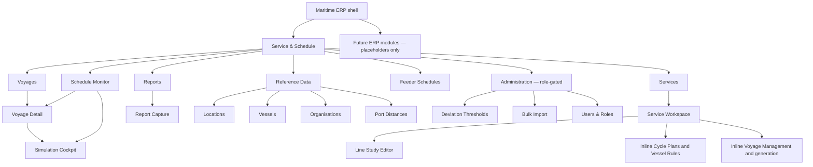

# Information Architecture

## Architecture principle

Service & Schedule is organized around two complementary mental models:

- **Plan:** Services → Line Studies → Cycle Plans / Vessel Rules → Generated Voyages.
- **Operate:** Schedule Monitor / Voyages → Actuals and deviations → Simulation recovery → Updated executable schedule.

Reference data and administration support these models but do not compete with them in the primary navigation.

## Navigation hierarchy



## Page hierarchy

| Level | Page | Notes |
|---|---|---|
| Module landing | Schedule Monitor | Evidence-backed operational landing; replaces an unsupported KPI dashboard |
| Primary lists | Services, Voyages, Reports entry, Feeder Schedules | Stable navigation anchors |
| Primary details | Service Workspace, Voyage Detail | Preserve identifiers, status, and return path |
| Dedicated editors | Line Study Editor, Simulation Cockpit, Report Capture, Feeder Voyage Form | Used when the task exceeds safe drawer complexity |
| Reference/admin | Reference Data, Port Distances, Thresholds, Import, Users | Supporting depth; role-aware |
| Overlays | Port Call Detail, Deviation Detail, Generate Voyages, Add Port, Phase In/Out, Apply Scenario | Preserve parent context |

## Entity relationships from the UX perspective

```mermaid
erDiagram
    SERVICE ||--o{ LINE_STUDY : contains
    SERVICE ||--o{ CYCLE_PLAN_DEFINITION : contains
    CYCLE_PLAN_DEFINITION }o--|| LINE_STUDY : prefers
    CYCLE_PLAN_DEFINITION ||--o{ VESSEL_RULE : assigns
    VESSEL_RULE }o--|| LINE_STUDY : uses
    SERVICE ||--o{ VOYAGE : produces
    LINE_STUDY ||--o{ VOYAGE : templates
    VOYAGE ||--|{ PORT_CALL : contains
    VOYAGE ||--o{ SIMULATION_SCENARIO : models
    VOYAGE ||--o{ REPORT : receives
    VOYAGE ||--o{ DEVIATION : detects
    VOYAGE ||--o{ FEEDER_VOYAGE : links
    FEEDER_VOYAGE ||--|{ FEEDER_PORT_CALL : contains
    LOCATION ||--o{ PORT_CALL : references
    VESSEL ||--o{ VESSEL_RULE : assigned
    ORGANISATION ||--o{ LINE_STUDY : operates
    ORGANISATION ||--o{ FEEDER_VOYAGE : operates
    PORT_DISTANCE }o--|| LOCATION : from
    PORT_DISTANCE }o--|| LOCATION : to
```

The ER diagram expresses navigation and reference relationships, not a database schema. Feeder linking cardinality is not fully specified in source and remains a gap.

## Parent–child record behavior

- A Line Study cannot exist without its Service. Breadcrumb and persistent service context must always be visible.
- A CPD belongs to a Service and references one preferred Line Study. It is edited inline in the Service Workspace.
- Vessel Rules are nested within a CPD. Replacements add time-phased rows at the same Cycle Position ID; history is never overwritten.
- A Voyage opens from the unified list, Service Workspace, Schedule Monitor, search, or notification.
- Port Calls appear in a voyage rotation and open a detail drawer. Schedule changes must redirect to or open the Simulation Cockpit.
- Scenarios belong to one Voyage and retain a clear “Draft—does not affect live schedule” banner until Apply.

## Navigation paths

### Planning path

`Services → Service Workspace → Line Studies → Line Study Editor → back to Service Workspace → Cycle Plans → Generate voyages → Voyage Detail`

### Operational path

`Schedule Monitor → deviation badge → Voyage Detail or Deviation drawer → Create recovery scenario → Simulation Cockpit → Apply → Schedule Monitor`

### Data-resolution path

`Line Study or Simulation blocker → Port Distance drawer/table → manual entry or API fetch → Admin approval when required → return to blocked context`

### Feeder path

`Feeder Schedules → Create/Edit Feeder Voyage → Voyage List → Schedule Monitor alongside toggle`

## Detail-to-edit transitions

- Service List opens Service Workspace. `Edit service` switches only the header form into edit mode; after first voyage, locked fields remain read-only and validity remains editable.
- Voyage Detail never becomes a schedule edit form. `Create scenario` opens Simulation Cockpit.
- Schedule Monitor is read-only. Port-call/deviation inspection uses a drawer; `Recover in Simulation` leaves the monitor with the selected voyage and future-call scope.
- Reference Data uses list-detail drawers for routine editing. Line Study and Simulation remain full-screen workspaces.

## Cross-screen links

- Service Code links to Service Workspace.
- Voyage Number links to Voyage Detail; CVN is not used alone as a link key.
- Vessel Name links to a read-only Vessel drawer.
- UN/LOCODE links to Location drawer.
- Missing distance errors link to the exact from/to pair in Port Distances.
- Scenario apply success links back to updated Voyage Detail and offers `View in Schedule Monitor`.
- Report ingestion result links to affected Voyage and detected deviation.

## Global vs module-level navigation

Global search, notifications, organization, help, and profile belong to the shell. Service/Voyage filters, scenario tabs, monitor time range, and report type are module-level. A module filter never changes organization context. Global notifications may deep-link to module records but do not create new business states.

## Search and filter architecture

- Global search: Service Code, Service Name, Voyage Number, CVN, vessel/IMO, location/UN/LOCODE.
- Services: code/name, trade lane, type, derived status, validity, active/deactivated.
- Voyages: voyage type, service/Line ID, vessel, CVN, lifecycle, start/end, cycle, port.
- Monitor: service, vessel, voyage type, lifecycle/operational health, time range; preserve filters in URL/prototype state.
- Port Distances: from/to location, source, approval status, distance type.

Advanced filters are panels within their lists, not a standalone screen.

## Deliberate IA exclusions

- No separate Schedule List: the unified Voyage List is the supported schedule index.
- No direct Create/Edit Schedule page: Simulation is the exclusive update path.
- No standalone Deviation Worklist: deviations surface in Monitor and Voyage Detail until a business lifecycle is defined.
- No standalone Audit History page: audit is confirmed as data, but an audit UI is not.
- No KPI Dashboard: no source-backed metrics are defined for day-to-day decisions.

