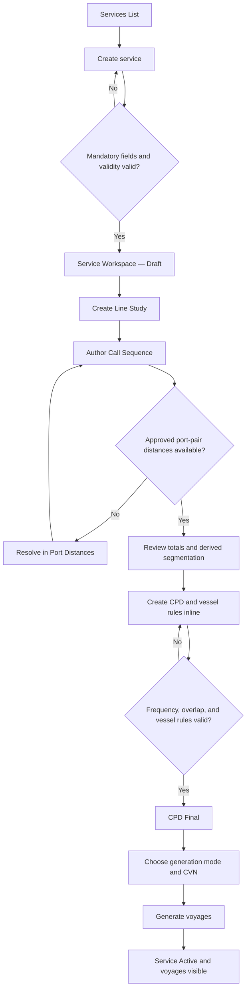
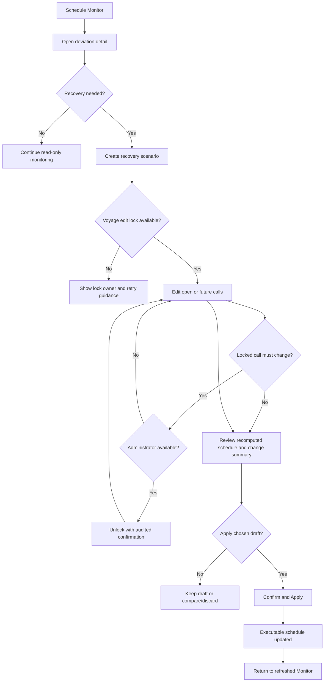

# User Flows

## Flow F-01 — Launch a service and generate voyages

- **Actor:** Schedule Editor with Viewer access.
- **Trigger:** A new liner service is approved for operational setup outside this system.
- **Prerequisites:** Required Locations, Organisations, Vessels, and Port Distances exist; the user is authenticated.
- **Entry point:** Services List → Create service.
- **Major steps:** Create mandatory service fields → open Service Workspace → create Line Study → author Call Sequence and milestones → review derived segmentation and totals → return to Service Workspace → create CPD and vessel rules → resolve validations → generate voyages → inspect created voyages.
- **Decisions:** With Frequency? Preferred Line Study? Generation mode? Existing voyage overlap? Missing approved distance?
- **Exceptions:** Missing mandatory fields; invalid validity; call-type/location mismatch; missing distance; CPD overlap; duration formula failure; vessel already deployed; rule-voyage overlap.
- **Success:** Generated voyages appear in inline Voyage Management and unified Voyage List; service status recomputes from Draft to Active when future voyages exist.
- **Failure:** No live data is created beyond valid saved parent records; blocker points to resolution.
- **Screens:** SCR-003, SCR-004, SCR-005, SCR-013, SCR-006, SCR-007.

## Flow F-02 — Detect and recover from a schedule deviation

- **Actor:** Operations/Line Management user with Viewer + Simulation roles.
- **Trigger:** A report produces a delay, early arrival, omission, or unplanned call deviation.
- **Prerequisites:** Voyage and retained baseline exist; actuals are recorded.
- **Entry point:** Schedule Monitor deviation badge or notification.
- **Major steps:** Filter/open affected voyage → inspect deviation and projected downstream layer → start recovery scenario → modify future calls → review recalculation/change summary → apply scenario → return to updated Monitor.
- **Decisions:** Is recovery required? Which scenario is best? Are calls locked? Does the user need Administrator unlock?
- **Exceptions:** Voyage edit lock held by another user; missing distance after add/reposition; invalid milestone chronology; vessel unavailable; locked call; apply failure.
- **Success:** Future executable estimates match the applied scenario; scenario is APPLIED and terminal; other drafts remain DRAFT; monitor projection refreshes.
- **Failure:** Live schedule remains unchanged and draft preserves work or clearly reports failure.
- **Screens:** SCR-002, SCR-007, SCR-008, SCR-013.

## Flow F-03 — Compare multiple scenarios

- **Actor:** Simulation Analyst.
- **Trigger:** One voyage has two or more DRAFT scenarios.
- **Prerequisites:** User holds voyage edit lock or comparison is allowed read-only.
- **Entry point:** Scenario tabs in SCR-008.
- **Steps:** Open Compare → select two or three drafts → compare rotation/time changes and change summaries → choose one → return to its edit state or Apply.
- **Decisions:** Which criteria matter? Source provides no ranking formula, so the UI presents factual differences only.
- **Exceptions:** Scenario already APPLIED/DISCARDED; stale baseline after another apply; edit lock lost.
- **Success:** User chooses a scenario with explicit differences; no automatic recommendation is claimed.
- **Screens:** SCR-008.

## Flow F-04 — Capture a report and detect deviation

- **Actor:** Schedule Editor.
- **Trigger:** Arrival, departure, or noon report received.
- **Prerequisites:** Target voyage/port call identifiable.
- **Entry point:** Reports → Capture report, or Voyage Detail action.
- **Steps:** Choose report type → choose File or Manual → for file choose Strict/Lenient → select voyage/port call → enter/upload source-supported fields → validate preview → submit → review imported/skipped/errors → open affected voyage/deviation.
- **Decisions:** Report type? Capture mode? Strict or lenient? Continue after partial result?
- **Exceptions:** Exact report fields are pending; unmatched voyage; invalid rows; duplicate report behavior undefined.
- **Success:** Actuals recorded, estimates retained, deviation detection runs, result links to voyage.
- **Failure:** Strict mode imports nothing; lenient mode clearly enumerates skipped rows; live estimates are not overwritten.
- **Screens:** SCR-009, SCR-007, SCR-002.

## Flow F-05 — Create or update a feeder voyage

- **Actor:** Schedule Editor.
- **Trigger:** External feeder operator supplies a schedule.
- **Prerequisites:** Feeder Organisation exists.
- **Entry point:** Feeder Schedules.
- **Steps:** Create feeder voyage → select operator → enter free-text vessel name and CVN → add multiple port calls with arrival/departure → save → optionally link to main voyage → verify unified list → enable alongside view in Monitor.
- **Decisions:** Main-voyage link and cardinality require confirmation.
- **Exceptions:** Invalid chronology, missing operator, duplicate/ambiguous link.
- **Success:** Feeder is visible in Feeder Schedules and unified Voyage List and can appear alongside when toggled.
- **Screens:** SCR-010, SCR-011, SCR-006, SCR-002.

## Flow F-06 — Resolve a missing port distance

- **Actor:** Schedule Editor; Administrator for API proposal approval.
- **Trigger:** Line Study, generation, or Simulation is blocked by a missing approved pair.
- **Prerequisites:** From and To locations exist.
- **Entry point:** Contextual blocker or Port Distance Table.
- **Steps:** Open exact pair → fetch from API or enter manually → if API succeeds, review PROPOSED value → Administrator approves/rejects → return to original task → recalculation resumes.
- **Decisions:** API or manual? Approve/reject? API unavailable?
- **Exceptions:** Timeout; existing pair record; invalid ECA distance; non-NM unit; insufficient permission.
- **Success:** One usable record per pair; source visible; dependent transit time recalculates.
- **Failure:** Clear same-screen manual fallback and preserved original task context.
- **Screens:** SCR-013, SCR-005, SCR-008.

## Flow F-07 — Govern access and privileged actions

- **Actor:** Schedule Administrator.
- **Trigger:** User onboarding/change, bulk update, threshold configuration, data deactivation, or locked-call correction.
- **Prerequisites:** Administrator role.
- **Entry point:** Administration group or contextual privileged action.
- **Steps:** Select task → review consequence → change users/roles, thresholds, import, approval, or unlock → validate → confirm → receive audited outcome.
- **Decisions:** Deactivate vs delete; role union; strict/lenient import if supported; self-approve distance allowed.
- **Exceptions:** Referenced master data blocks deletion; last-admin protection is not documented; import schema errors; unlock reason is not source-defined.
- **Success:** State change is visible and identifies affected object/user.
- **Screens:** SCR-014, SCR-015, SCR-016, SCR-013, SCR-008.

## Flow F-08 — Viewer finds and exports a voyage

- **Actor:** Schedule Viewer.
- **Trigger:** Stakeholder asks for current status or offline schedule.
- **Prerequisites:** Authenticated.
- **Entry point:** Global Search, Voyage List, or Monitor.
- **Steps:** Search/filter → inspect Voyage Detail → export current list or schedule as Excel/CSV/PDF → receive synchronous download feedback.
- **Exceptions:** Duplicate CVN results; export failure; no rows match.
- **Success:** User identifies the voyage by Voyage Number and downloads the requested representation.
- **Screens:** SCR-002, SCR-006, SCR-007.

