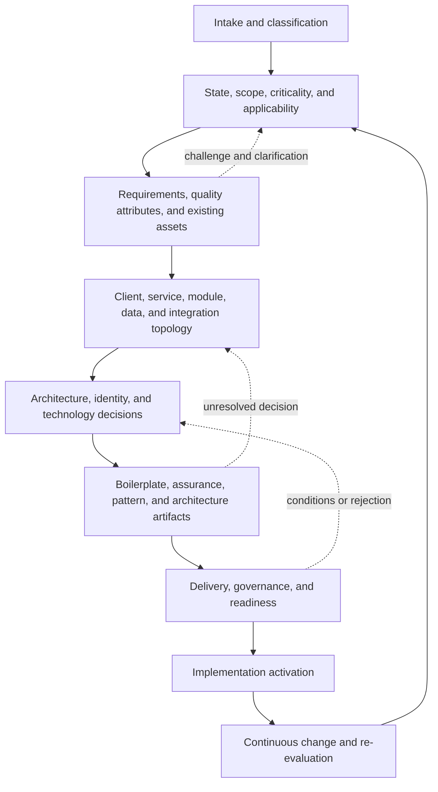
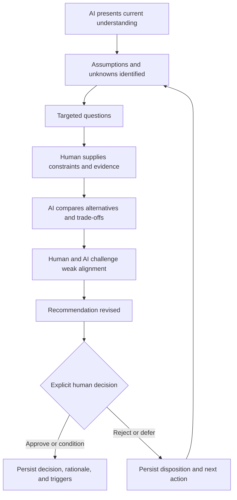
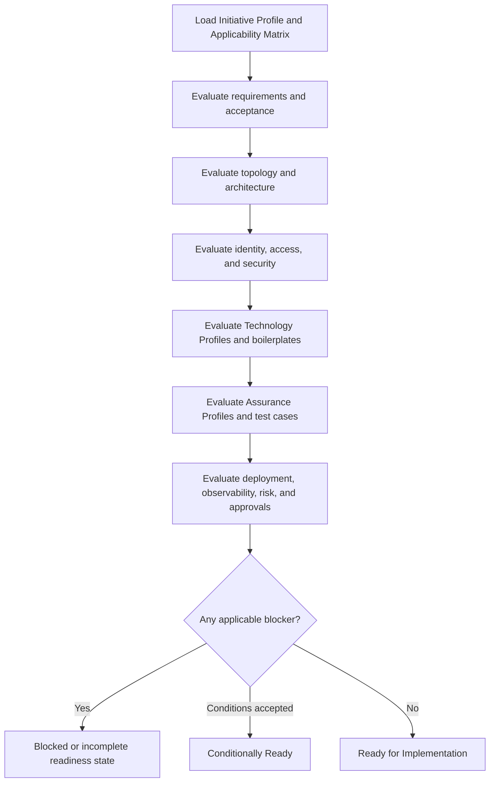
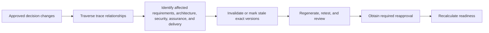

# Dynamic Engineering Model

**Governed AI Engineering Platform (GAEP)**\
**Document ID:** GAEP-PLT-019\
**Version:** 1.0\
**Status:** Draft\
**Authority:** Platform engineering-resolution model\
**Change Class:** Major\
**Audience:** Enterprise architects, engineering leaders, developers, quality leaders, security leaders, delivery teams, governance roles, and AI agents

## 1. Purpose

This document defines how GAEP converts an Engineering Initiative into an applicable, approved, repository-visible engineering path. It operationalizes adaptive engineering by resolving what work is needed, which existing assets remain valid, which implementation units exist, which decisions must precede implementation, what assurance is required, and when implementation may begin.

GAEP shall not route every initiative through one product-development pipeline. It shall determine the lifecycle, artifacts, architecture depth, security depth, technology, organizational baselines, tests, approvals, and execution path from the initiative's actual scope, state, constraints, dependencies, and risk.

The output of this model is not merely a plan. It is a governed set of decisions and records that commands, skills, agents, reviewers, and implementation tooling can consume without relying on conversation history.

## 2. Scope

This model applies to greenfield and brownfield Engineering Initiatives, including products, features, services, modules, clients, APIs, integrations, migrations, refactorings, defect fixes, infrastructure, security, observability, data, AI/ML, DevOps, experiments, and retirement work.

It governs the logical resolution of:

- initiative classification and current lifecycle state;
- phase, artifact, activity, method, capability, and approval applicability;
- existing systems, repositories, constraints, and reusable assets;
- requirements, quality attributes, clients, services, modules, data, integrations, and deployment units;
- architecture, identity, authentication, authorization, technology, boilerplate, pattern, and assurance decisions;
- architecture and assurance artifacts;
- explicit human decisions and implementation readiness;
- change impact, invalidation, and re-evaluation.

This model does not prescribe final repository schemas, one lifecycle, one architecture style, one tool, or one technology stack. Detailed artifact, metadata, execution, and approval semantics remain governed by their respective GAEP specifications. A Product is a valid initiative type, and the Product Lifecycle may be selected as an applicable lifecycle profile; neither is universal.

## 3. Relationship to Adaptive Engineering Principles

The [Adaptive Engineering Principles](../01_Foundation/006_ADAPTIVE_ENGINEERING_PRINCIPLES.md) establish foundational obligations: initiative neutrality, conditional lifecycle execution, architecture before implementation, assurance and security by design, contextual patterns, repository-native traceability, continuous Human–AI challenge, explicit approval, and risk-proportionate governance.

This document translates those obligations into platform behavior. It defines resolution stages, decision inputs and outputs, profile concepts, applicability states, readiness conditions, commands, and stop behavior. It shall be interpreted under the [GAEP Constitution](../01_Foundation/001_GAEP_CONSTITUTION.md). If a lower-level lifecycle, command, skill, agent, or artifact definition assumes a universal product-first path, this model's initiative-neutral and applicability-driven semantics govern the generic platform behavior.

The model preserves three separations:

1. **Foundation states what must remain true.**
2. **This model determines what applies and what must be resolved.**
3. **Runtime, repository, and product-engineering specifications define how approved resolutions are executed and stored.**

## 4. Dynamic Engineering Resolution Flow

### 4.1 Nature of the flow

The Dynamic Engineering Resolution Flow is a logical dependency model, not a rigid waterfall. A step may run iteratively, run in parallel with independent steps, be revisited, be skipped through a justified Applicability Decision, or be fulfilled by a current approved artifact. A step may become mandatory after new risk, policy, dependency, or change information is discovered.

Parallel work shall not violate decision dependencies. For example, client and service discovery may proceed together, but boilerplate binding cannot be finalized until the relevant implementation unit, architecture, and Technology Profile are known. Draft test cases may clarify requirements, but implementation may not activate until applicable acceptance conditions, assurance obligations, and architecture are sufficiently resolved and approved.

### 4.2 Logical steps

| Step | Resolution objective | Minimum governed result |
|---:|---|---|
| 1 | **Intake** | Objective, sponsor or owner, initial scope, urgency, known constraints, and target outcome. |
| 2 | **Initiative Classification** | Primary and secondary types plus classification attributes and confidence. |
| 3 | **Existing-System and Lifecycle-State Assessment** | Greenfield or brownfield facts, current baselines, active changes, and lifecycle position. |
| 4 | **Scope and Criticality Assessment** | Boundaries, stakeholders, exposure, blast radius, reversibility, criticality, and initial risk. |
| 5 | **Applicability Assessment** | Applicability Matrix for phases, activities, artifacts, capabilities, test levels, and approvals. |
| 6 | **Requirement and Quality-Attribute Discovery** | Applicable functional needs, acceptance conditions, constraints, and quality attributes. |
| 7 | **Human–AI Challenge and Clarification** | Material assumptions, questions, alternatives, dispositions, and unresolved issues. |
| 8 | **Existing Asset and Constraint Discovery** | Repositories, standards, ADRs, platforms, boilerplates, tests, delivery assets, and operational constraints. |
| 9 | **Domain and Capability Analysis, when applicable** | Relevant capabilities, domains, responsibilities, ownership, language, and boundary candidates. |
| 10 | **Client Landscape Discovery** | Client and interaction surfaces with client-level obligations and profile candidates. |
| 11 | **Service and Module Topology Discovery** | Backend and executable units, responsibilities, relationships, and ownership. |
| 12 | **Data and Integration Topology Discovery** | Data ownership, stores, flows, contracts, dependencies, transaction and consistency boundaries. |
| 13 | **Architecture Style Resolution** | Contextual style and topology decisions with alternatives and rationale. |
| 14 | **Identity, Authentication, and Authorization Resolution** | Explicit identity and access decisions, including justified Not Applicable results. |
| 15 | **Technology Decision Resolution** | Technology decisions at the correct hierarchy and per implementation unit. |
| 16 | **Boilerplate Binding** | Verified organizational baseline or an explicit block, exception, or authorization to create one. |
| 17 | **Test Methodology and Assurance Resolution** | Assurance Profile, test intent, levels, cases, coverage targets, gates, and evidence obligations. |
| 18 | **Contextual Pattern Resolution** | Pattern decisions tied to actual concerns, alternatives, tests, and operational obligations. |
| 19 | **Architecture Artifact Generation** | Applicable architecture drafts, reviews, approvals, versions, and regeneration triggers. |
| 20 | **Delivery and Deployment Resolution** | Repository, build, environment, release, rollout, rollback, deployment, and operational model. |
| 21 | **Governance and Approval Resolution** | Required reviewers, approvers, decisions, exceptions, conditions, and evidence. |
| 22 | **Readiness Validation** | Version-specific Implementation Readiness Record covering only applicable conditions. |
| 23 | **Implementation Activation** | Authorized implementation scope and context issued to implementation agents and teams. |
| 24 | **Continuous Change and Re-evaluation** | Impact traversal, invalidation, regeneration, reapproval, and updated readiness. |

The flow shall preserve the origin and status of every consequential result. A discovery result is not an approval; a generated artifact is not a baseline; and a completed step is not proof that its output remains current after change.

## 5. Initiative Classification

GAEP shall classify the Engineering Initiative before selecting a lifecycle or implementation path. Classification is multi-dimensional; one label cannot represent all relevant engineering conditions.

An **Initiative Profile** shall include, at minimum where known:

- primary and secondary initiative types;
- greenfield or brownfield status;
- new, existing, replacement, modernization, migration, retirement, or mixed change posture;
- business-driven, technical, regulatory, operational, security-driven, or mixed motivation;
- UI-bearing or non-UI;
- data-bearing or stateless;
- integration-heavy or isolated;
- synchronous, asynchronous, batch, streaming, interactive, or mixed interaction characteristics;
- internal, partner, public, or mixed exposure;
- regulated status and applicable policy domains;
- security, privacy, and data sensitivity;
- expected lifetime and maintenance horizon;
- blast radius, reversibility, urgency, and cost of failure;
- known dependencies and affected organizational assets;
- owner, accountable authority, classification confidence, and unresolved questions.

Supported initiative types may include product, platform, product increment, feature, epic, backlog item, service, module, client application, mobile application, API, integration, migration, modernization, refactoring, technical-debt remediation, security remediation, infrastructure, DevOps, observability, library, SDK, CLI, worker, event processor, defect fix, experiment, research, and data or AI capability.

Multiple classifications are permitted. A security remediation may also be a service change; a migration may include data, client, and operational work; a platform initiative may contain libraries and deployment capabilities. GAEP shall preserve primary and secondary types instead of forcing an artificial single category.

Classification selects candidate lifecycle profiles and discovery questions; it must not prejudge architecture or technology. Product Discovery, personas, journeys, visual design, and Figma shall be considered only when initiative characteristics make them applicable.

## 6. Applicability Engine

### 6.1 Responsibility

The **Applicability Engine** is the logical platform capability that evaluates which phases, artifacts, design activities, commands, skills, agents, architecture assets, security controls, test methods, test levels, approvals, and evidence obligations apply to a particular initiative or implementation unit.

The engine may combine deterministic policy, organization profiles, risk rules, existing-state evidence, trace relationships, and Human–AI judgment. It must expose how a result was reached. AI recommendation alone is not an authoritative applicability decision when approval is required.

### 6.2 Status model

Every evaluated subject shall receive one of these states:

- **Required** — a binding prerequisite for a defined transition or outcome;
- **Recommended** — expected to add material value; omission should be justified when consequential;
- **Optional** — permitted but not needed for readiness;
- **Not Applicable** — irrelevant to the assessed scope;
- **Deferred** — applicable but postponed under an owned, approved condition;
- **Conditionally Required** — required if a declared trigger occurs;
- **Already Satisfied** — fulfilled by a current approved initiative artifact or decision;
- **Reused** — fulfilled by a verified approved asset from another governed scope;
- **Blocked** — required but currently impossible to satisfy;
- **Awaiting Human Decision** — status or disposition requires accountable judgment.

An **Applicability Decision** shall record:

- decision ID, subject, subject type, and scope;
- status and rationale;
- rule, policy, evidence, requirement, dependency, or human decision that is the source;
- decision owner and accountable approver where required;
- timestamp and effective version;
- dependencies and conditions;
- review and invalidation triggers;
- approval state;
- related artifacts, risks, questions, and implementation units.

The collection of decisions forms an **Applicability Matrix**. Absence from the matrix shall not mean Not Applicable. Material Not Applicable decisions require rationale sufficient to prevent later users or agents from treating an omission as an oversight.

### 6.3 Examples

- Figma is **Not Applicable** for a headless event consumer with no visual interaction or visual asset requirement.
- Figma may be **Required** for a multi-persona customer portal when the approved design process and visual behavior require it.
- Gherkin may be **Recommended** for business-readable acceptance scenarios and **Not Applicable** for a low-level internal utility adequately specified through unit-level examples.
- Consumer contract testing is **Required** for a public service API with independently deployed consumers.
- A threat model is **Required** for a new identity service.
- LLD may be **Optional** for an isolated low-risk change and **Required** for a complex distributed workflow.
- Authorization tests are **Required** for protected business resources.

No GAEP capability becomes mandatory solely because it is available. The Applicability Engine shall evaluate its value and obligation in the current context.

## 7. Existing-System Discovery

Before recommending architecture, technology, or project initialization, GAEP shall establish whether relevant engineering state already exists. Brownfield work is the normal case for many initiatives and shall not be treated as incomplete greenfield work.

The discovery process shall inspect or request, as applicable:

- repositories, branches, modules, ownership, build files, dependency manifests, and current source structure;
- deployed clients, services, jobs, functions, infrastructure, and environments;
- current architecture, diagrams, ADRs, interfaces, contracts, and trust boundaries;
- databases, schemas, data ownership, migrations, caches, search, object storage, brokers, and event streams;
- authentication mechanisms, identity providers, claims, sessions, service identities, authorization policies, and enforcement boundaries;
- tests, test data, environments, coverage evidence, known quality gaps, and manual verification practices;
- CI/CD, release, rollout, rollback, deployment, observability, support, and incident constraints;
- enterprise standards, supported technologies, security policies, compatibility obligations, and approved exceptions;
- approved boilerplates, templates, libraries, reference implementations, and prior reusable decisions;
- technical debt, obsolete components, known risks, active changes, and pending migrations.

Discovery results shall distinguish observed facts, approved baselines, inferred conditions, and unresolved questions. Existing assets may satisfy applicability only after their authority, version, fitness, and freshness are verified. GAEP must not propose replacement architecture merely because an existing design differs from a preferred pattern.

## 8. Continuous Human–AI Decision Dialogue

### 8.1 Challenge loop

Consequential resolution uses a continuous, role-bounded Human–AI challenge loop:

The logical sequence is:

1. AI presents its current understanding.
2. AI identifies assumptions, uncertainty, and missing information.
3. AI asks targeted questions.
4. The human provides context, constraints, and evidence.
5. AI evaluates viable alternatives.
6. AI challenges inconsistency, unsupported assumptions, or weak alignment.
7. The human may challenge the recommendation, sources, or trade-offs.
8. Alternatives and consequences are revised.
9. AI proposes a decision and states residual risk.
10. The responsible human approves, conditionally approves, rejects, or defers.
11. The decision, version, rationale, evidence, and disposition are persisted.
12. Review and invalidation triggers are recorded.

### 8.2 Application and discipline

The loop applies, according to consequence, to requirements, scope, applicability, boundaries, topology, architecture, database, cache, broker, technology, security, authentication, authorization, test methodology, test cases, coverage, deployment, and change impact.

AI shall challenge from its assigned role. Architecture agents focus on topology and quality attributes; security agents on threat, identity, access, and trust; assurance agents on scenarios, evidence, and gaps; implementation agents on feasibility and conformance. An agent may route an out-of-role concern but must not silently override the accountable role.

Challenge shall be evidence-based and proportionate. AI must not manufacture objections to appear sophisticated, repeatedly reopen an approved decision without a trigger, or turn ordinary low-risk work into ceremonial debate. Material challenges and dispositions shall be stored as **Challenge Records** or incorporated into decision and review artifacts.

## 9. Client Landscape

GAEP shall discover all human and machine interaction surfaces rather than assuming one frontend. Possible clients include administrative, back-office, customer, partner, supplier, and employee portals; public websites; PWAs; mobile and desktop applications; kiosks; IoT clients; CLIs; API consumers; third-party integrations; and machine-to-machine clients.

Each significant client is an implementation unit and shall have a **Client Technology Profile** containing applicable fields:

- stable identifier, purpose, owner, personas or machine actors, and delivery target;
- rendering model, language, framework, runtime, and supported browsers or operating systems;
- accessibility, localization, offline, real-time, performance, and compatibility requirements;
- authentication model, session behavior, authorization expectations, and protected-resource dependencies;
- API, event, device, and third-party dependencies;
- deployment target, repository strategy, release independence, and operational ownership;
- selected organizational boilerplate and approved deviations;
- design-asset applicability, including whether Figma or another design source is Required, Recommended, Optional, or Not Applicable;
- test methodology, test levels, platform matrix, observability, and evidence obligations.

Different clients may legitimately use different technologies and assurance profiles. A customer application may use server rendering for discovery and performance needs, an administrative portal may use a client-side application model, and a mobile client may be native or cross-platform. None is a default. Client decisions shall be justified by experience, security, delivery, operational, team, and lifecycle requirements.

Figma applicability shall be decided per client or design artifact. A visual client may require interaction and design assets without requiring Figma specifically if another approved method is used. A CLI or machine client normally has no visual-design obligation, although it may still require usability, contract, accessibility, or documentation assurance.

## 10. Service and Module Topology

GAEP shall identify executable and structural backend units before assigning a common stack. Units may include modular-monolith modules, microservices, domain services, workers, event consumers, jobs, functions, gateways, backends for frontends, adapters, workflow services, reporting services, data-processing services, AI/ML services, and shared platform services.

For each significant unit, a **Service Technology Profile** shall resolve, as applicable:

- identifier, responsibility, bounded context, owner, and unit type;
- language, framework, runtime, packaging, repository, and build model;
- API style, contracts, communication model, dependencies, and supported consumers;
- data ownership, database, cache, broker, search, object storage, and schema lifecycle;
- authentication, service identity, authorization, trust boundaries, secrets, and audit obligations;
- consistency model, transaction boundaries, delivery semantics, concurrency, and failure behavior;
- scaling model, capacity assumptions, latency, availability, resilience, and recovery targets;
- deployment unit, topology, environments, release independence, and rollback model;
- approved boilerplate, extensions, compatibility, and exceptions;
- assurance methodology, required test levels, quality gates, evidence, and observability;
- operational ownership, support, alerts, runbooks, and service-level expectations.

The topology shall distinguish logical responsibility from deployment. A modular-monolith module may be a major implementation unit without an independently deployed process. A service boundary must not be invented from an organizational chart or selected technology alone. Shared databases, independent stores, synchronous calls, and asynchronous communication are decisions requiring explicit ownership and consequences.

One initiative may use multiple languages and frameworks. Technology diversity shall be justified by unit-specific needs and supportability, not novelty. Conversely, an enterprise preference for fewer stacks is a valid constraint, but it does not erase the requirement to record the per-unit Technology Profile.

## 11. Data and Integration Topology

The **Data and Integration Topology** shall identify where information is owned, transformed, transmitted, retained, reconciled, secured, and observed. GAEP shall not select a database, broker, cache, or integration protocol before the relevant need is understood.

Applicable resolution includes:

- authoritative data owners, data classifications, schemas, lifecycle, retention, residency, and lineage;
- system-of-record and derived-data responsibilities;
- transaction boundaries, consistency requirements, concurrency, reconciliation, and migration;
- query patterns, volume, throughput, latency, analytics, search, and archival needs;
- interfaces, producers, consumers, contracts, versioning, compatibility, and dependency ownership;
- synchronous calls, messaging, streams, webhooks, batch, files, and human handoffs;
- ordering, replay, retention, deduplication, delivery semantics, poison-message handling, and recovery;
- trust boundaries, encryption, secrets, access, auditing, privacy, and data minimization;
- external system constraints, rate limits, failure behavior, service levels, and test substitutes.

A store or integration product shall not become an architectural requirement by fashion. A stateless service may need no owned database. A migration may require source-to-target mapping, dual operation, reconciliation, cutover, rollback, and data-quality evidence. A headless consumer may require event contracts, idempotency decisions, and operational acceptance without any UI artifact.

Topology results shall be linked to implementation units, architecture decisions, security assessments, assurance profiles, deployment, and operational ownership.

## 12. Architecture Style Resolution

Architecture shall be resolved before applicable implementation to the depth necessary to prevent code from becoming accidental architecture. GAEP shall select no universal style.

Candidate decisions may include:

- system: modular monolith, microservices, service-oriented, event-driven, serverless, or hybrid;
- frontend: SPA, SSR, SSG, modular frontend, micro frontend, monorepo, or polyrepo;
- mobile: native, cross-platform, PWA, or responsive web;
- integration: REST, gRPC, GraphQL, messaging, event streaming, webhook, file, or batch;
- data: shared database, schema per module, database per service, polyglot persistence, read models, or analytics platform;
- deployment: co-deployed, independently deployed, regional, edge, on-premises, cloud, or hybrid.

Selection shall respond to functional need, quality attributes, constraints, scale, team topology, operational maturity, security, cost, reversibility, and expected evolution. For a consequential choice, the Architecture Decision Dialogue shall examine the problem, functional need, relevant quality attributes, constraints, scale, throughput, latency, availability, consistency, ordering, replay, delivery semantics, security, compliance, operational maturity, team capability, cost, reversibility, migration impact, alternatives, assumptions, rejected options, consequences, and review triggers.

### 12.1 Required decision challenges

**RabbitMQ versus Kafka:** first determine queueing versus durable streaming needs; replay and retention; ordering scope; routing; consumer independence; throughput; backpressure; delivery guarantees; transactional publication; operational complexity; existing competence; and recovery expectations. If neither is required, the decision may be to use neither.

**PostgreSQL versus MongoDB:** examine relational integrity, aggregate or document ownership, schema evolution, transactions, joins, query patterns, indexing, analytics, consistency, data lifecycle, operational expertise, and migration impact. Technology preference is not evidence of workload fit.

**Modular monolith versus microservices:** examine domain boundaries, independent deployment need, team ownership, scaling asymmetry, failure isolation, distributed transaction and consistency cost, contract maturity, observability, platform operations, release coupling, and delivery speed. Microservices shall not be treated as the mature default.

**Cache selection:** determine whether caching is necessary before choosing Redis or another cache. Identify the latency or load problem, source of truth, staleness tolerance, key ownership, invalidation, failure behavior, security, memory bounds, observability, and tests. A cache adds a consistency and operational problem even when it improves performance.

Architecture approval is version-specific. Implementation feedback may challenge an approved decision, but shall not contradict it silently.

## 13. Authentication and Authorization Resolution

Authentication and authorization assessment is mandatory for every initiative and each applicable implementation unit, even when the recorded result is Not Applicable.

The assessment shall resolve, where relevant:

- human, service, workload, machine, device, and external-system identity types;
- identity provider, federation, SSO, account lifecycle, and trust source;
- OAuth 2.0, OpenID Connect, SAML, mutual TLS, workload identity, API keys, or other justified mechanisms;
- token or credential validation, issuer and audience, lifetime, rotation, revocation, session model, and failure behavior;
- service-to-service identity and delegation;
- RBAC, ABAC, policy-based, resource-based, scope-, claim-, ownership-, or tenant-based authorization;
- roles, permissions, scopes, claims, policies, privileged operations, segregation of duties, and break-glass behavior;
- tenant and resource isolation, authoritative enforcement boundary, audit, privacy, secrets, and monitoring;
- negative, authentication, authorization, ownership, elevation, and cross-tenant test obligations.

Listed protocols and models are options, not defaults. A Not Applicable decision shall state the assessed boundary and rationale; for example, a pure local library may not authenticate identities but may operate inside a caller that does.

Authorization shall be enforced at the authoritative backend, service, data, infrastructure, or resource boundary. UI visibility, route guards, and hidden controls may improve experience but cannot be the only control. GAEP shall challenge claims that authentication is "handled by infrastructure" until identity propagation, validation, authorization, trust, failure, and audit behavior are explicit.

Identity and access decisions shall be completed before coding and linked to architecture, data classification, threats, contracts, test cases, deployment, observability, and approval.

## 14. Technology Decision Hierarchy

Technology decisions shall be evaluated in this order of authority and scope:

1. regulatory and mandatory constraints;
2. enterprise policies;
3. approved platform standards;
4. portfolio or product constraints where applicable;
5. existing-system and compatibility constraints;
6. initiative-specific Architecture Decisions;
7. service-, module-, client-, workload-, or deployment-unit Technology Profiles;
8. implementation-level decisions.

Each constraint or option shall declare whether it is **mandatory**, **preferred**, **approved**, **supported**, **experimental**, **exception**, or **prohibited**. Preferred is not mandatory; approved does not mean appropriate; supported does not mean recommended; and an exception does not establish a new default.

Lower-level decisions must comply with applicable higher authority, but higher-level preferences shall not hide unresolved component choices. When a mandatory standard is unsuitable, GAEP shall stop for exception or redesign rather than silently diverge. When no higher constraint applies, the initiative still requires an accountable, evidence-based decision.

## 15. Technology Option Registry

GAEP should maintain a governed **Technology Option Registry** for discoverable organizational choices, not a universal catalog embedded in this model. Registry domains may include backend languages, frontend and mobile frameworks, databases, caches, brokers, search, identity platforms, observability, deployment targets, test frameworks, and boilerplates.

Each option may declare:

- canonical identifier, category, status, owner, and supported versions;
- intended use, exclusions, maturity, lifecycle, and compatibility;
- security posture, supply-chain controls, and known vulnerabilities or risks;
- operational readiness, skills, support model, and cost considerations;
- approved boilerplate, reference architecture, validators, and assurance assets;
- known limitations, migration guidance, exception process, and review date.

Registry status constrains the candidate set; it does not replace initiative analysis. An approved broker still requires a delivery-semantic need. An approved database still requires a data model and operational fit. An experimental option requires the additional controls defined by policy.

## 16. Technology Profiles

A **Technology Profile** is the approved, versioned set of technology and operating decisions for one implementation unit. Every major implementation unit shall have an explicitly resolved profile before implementation.

Profiles may specialize into Client, Service, Data, Integration, Infrastructure, or Deployment Technology Profiles. A profile shall identify:

- implementation-unit ID, type, responsibility, owner, and affected architecture version;
- selected language, framework, runtime, platform, storage, communication, deployment, and tooling choices that apply;
- source constraints and registry status;
- considered alternatives and rationale;
- compatibility, interoperability, support, security, and operational implications;
- approved boilerplate or explicit absence;
- assurance and observability obligations;
- decision owner, review status, approval, effective version, and change triggers.

An initiative-level summary may show the technology landscape, but it must not collapse different unit decisions into an alleged single stack. For example, an administrative portal may use Angular, a customer application Next.js, a mobile client Flutter, an AI service Python, a high-throughput service Go, and a domain service .NET or Java when each choice is justified and supportable. These examples illustrate permitted diversity, not recommended defaults.

## 17. Boilerplate Binding

Organizational boilerplates, starter repositories, templates, and code foundations are governed assets. For each applicable implementation unit, GAEP shall:

1. resolve its language and framework;
2. resolve its relevant architecture style;
3. identify whether an organizational baseline is mandatory, preferred, or absent;
4. locate or request the approved boilerplate;
5. verify access, ownership, status, and provenance;
6. validate compatibility with the Technology Profile, architecture, security, assurance, deployment, and required capabilities;
7. record repository, path, artifact ID, version, tag, or commit;
8. bind the exact boilerplate version to the implementation unit;
9. block implementation when a mandatory boilerplate is missing or incompatible unless an authorized exception or replacement decision exists.

A **Boilerplate Binding Record** shall contain implementation-unit ID, Technology Profile reference, boilerplate identifier and source, exact version, compatibility assessment, approved extensions or modifications, owner, approval, validation result, and review triggers.

GAEP shall distinguish use, extension for one initiative, modification of the organizational asset, project generation from the asset, and creation of a new official boilerplate. AI must not invent or silently substitute an official baseline. It may draft a provisional candidate only when explicitly authorized; designation of a new official organizational boilerplate requires human authorization, ownership, reusable-asset review, versioning, evidence, and consumer-impact analysis.

Existing brownfield repositories may already embody an approved baseline. GAEP shall verify and record that lineage rather than reinitialize the project unnecessarily.

## 18. Test Methodology and Assurance Resolution

### 18.1 Assurance Profile

Before implementation, GAEP shall resolve an **Assurance Profile** for each applicable implementation unit and, where cross-unit behavior exists, for the relevant end-to-end workflow. The profile shall define:

- requirements, risks, quality attributes, and acceptance criteria under test;
- chosen test methodology and rationale;
- scenario or specification representation;
- applicable test levels and ownership;
- automation expectations and justified manual validation;
- positive, negative, boundary, failure, security, authentication, authorization, performance, resilience, accessibility, compatibility, migration, and operational scenarios as applicable;
- environments, test data, privacy controls, mocks, stubs, simulators, containers, and external dependencies;
- multidimensional coverage targets;
- entry, exit, and quality gates;
- required evidence, evidence location, freshness, and retention;
- reviewer and explicit approval requirements;
- dependencies, accepted gaps, conditions, and regeneration triggers.

Potential methodologies include example mapping, Gherkin, BDD, TDD, ATDD, specification by example, risk-based testing, and model-based testing. Potential levels include unit, component, integration, contract, API, end-to-end, UI, mobile, security, authentication, authorization, performance, load, stress, resilience, migration, data reconciliation, compatibility, accessibility, and operational acceptance. No method, representation, or level is universally mandatory.

GAEP shall ask whether Gherkin is appropriate. It should determine whether business stakeholders need to read and approve behavior, whether scenarios express business or low-level technical detail, whether executable specifications are required, whether automation will consume them, and whether Gherkin improves shared understanding or adds ceremony.

### 18.2 Coverage model

Coverage shall not be reduced to one code-coverage percentage. Applicable targets may include:

- requirement and acceptance-criteria coverage;
- behavior, branch, and condition coverage;
- mutation score;
- contract, consumer, and API endpoint coverage;
- authorization-rule, role, ownership, and tenant-boundary coverage;
- risk, threat, and failure-mode coverage;
- platform, browser, OS, device, or version coverage;
- migration and reconciliation coverage;
- observability and operational-control validation.

Targets shall be contextual, measurable where practical, approved, and linked to the claims they support. A high line percentage cannot compensate for missing contract, authorization, or failure-path evidence.

### 18.3 Test-first activation

Applicable acceptance criteria, test intent, and test cases shall exist before coding begins. This does not require every automated test implementation to be complete before the first production-code line; it requires sufficient approved scenarios and obligations to guide implementation and prevent assurance from being deferred to the end.

Implementation agents shall load approved requirements, acceptance criteria, test cases, the Assurance Profile, applicable architecture, and Technology Profile. They shall generate or update automated tests, implement against approved behavior, execute required suites, collect coverage and evidence, identify gaps, and stop when a mandatory quality gate fails.

Test cases, automated tests, results, coverage, accepted risks, and approval shall remain traceable to exact requirement and implementation versions. Manual approval shall not substitute for applicable repeatable automation, and unit tests alone shall not be accepted as sufficient evidence for distributed workflows unless the Assurance Profile justifies that conclusion.

## 19. Contextual Pattern Resolution

Patterns shall be considered only when a concrete concern triggers them. Candidate patterns include idempotency, Outbox, Inbox, Saga, orchestration, choreography, CQRS, Event Sourcing, retry, timeout, Circuit Breaker, Bulkhead, dead-letter handling, deduplication, ordering, distributed locking, optimistic concurrency, cache invalidation, rate limiting, backpressure, tracing, and audit logging.

A **Pattern Decision** shall record:

- triggering requirement, failure mode, consistency need, delivery semantic, topology, scale, transaction boundary, or operational risk;
- affected implementation unit and architecture version;
- selected pattern and rejected alternatives, including a simpler option;
- assumptions, failure behavior, limitations, and implementation constraints;
- test, security, recovery, and observability obligations;
- owner, approval, effective version, and re-evaluation triggers.

Retries require failure classification, limits, timeouts, and idempotency consideration. Outbox is relevant when local state and reliable publication must be coordinated. Saga is relevant only when a distributed business transaction and compensation semantics actually exist. CQRS is not justified merely because code has commands and queries. Distributed tracing is valuable only when topology and operational needs justify its cost.

Best practices are contextual engineering responses, not universal architectural decorations. GAEP shall challenge fashionable selection of Kafka, RabbitMQ, Redis, MongoDB, microservices, or distributed-system patterns without supporting forces.

## 20. Architecture Artifact Resolution

Before implementation, GAEP shall determine which architecture assets are needed and at what depth. Potential assets include context, system, container, component, service, client, data, integration, deployment, and trust-boundary diagrams; authentication flows; authorization models; sequence and state diagrams; ADRs; HLD; LLD; API and event contracts; data models; and failure-mode analyses.

An **Architecture Artifact Plan** shall record for each candidate asset:

- artifact type, scope, and applicability status;
- required depth and audience;
- owner, authoring capability or command, and repository location;
- source requirements, topology, decisions, and assumptions;
- linked implementation units, risks, contracts, and policies;
- review state, approver, approval, and exact version;
- format or notation and authoritative external reference when applicable;
- freshness expectation and regeneration triggers.

GAEP may generate Markdown, Mermaid, C4-style, UML, ADR, or approved-tool artifacts. Notation is contextual. Generated architecture remains a draft until reviewed and explicitly approved. HLD and LLD are applicability-driven: a small isolated change may need an ADR and focused component view, while a complex distributed, regulated, or high-risk workflow may require both at substantial depth.

Architecture capabilities shall be able to draft assets from resolved state, disclose unresolved assumptions, request human review, incorporate feedback, challenge proposed changes, update linked decisions and diagrams, and preserve versions. Relevant implementation changes shall trigger regeneration rather than leaving diagrams as stale snapshots.

## 21. Governance and Approval

Governance shall be proportional to criticality, security and data sensitivity, regulatory exposure, financial or reputational impact, architecture scope, blast radius, integration complexity, operational risk, irreversibility, and cost of failure.

For every consequential decision or readiness condition, GAEP shall identify the accountable owner, required reviewers, approver, evidence, allowed decision states, conditions, exception authority, and review triggers. Decisions may be Proposed, Challenged, Revised, Awaiting Review, Conditionally Approved, Approved, Rejected, Deferred, Superseded, or Exception Granted.

Approval shall be explicit, attributable, scoped, version-specific, and recorded. It must not be inferred from silence, file presence, a successful generation, a passing subset of tests, a merge, or an AI statement. AI may prepare, recommend, challenge, validate, and route a decision; it may not approve its own consequential output or accept risk on behalf of a human authority.

Conditional approval shall state the obligations, owner, due trigger, permitted work, and consequence of non-fulfilment. An exception shall identify the rule varied, scope, rationale, risk, compensating controls, approver, expiration, and re-evaluation condition.

## 22. Implementation Readiness

### 22.1 Readiness gate

The **Implementation Readiness Gate** evaluates only applicable conditions against exact artifact and decision versions.

Applicable conditions may include:

- initiative classified, owned, and bounded;
- lifecycle and applicability resolved;
- requirements and acceptance criteria approved;
- consequential Human–AI challenge completed and dispositioned;
- client, service, module, data, integration, and deployment topology resolved;
- architecture style and relevant constraints resolved;
- architecture artifacts generated, reviewed, versioned, and approved;
- HLD and LLD approved where required;
- authentication, authorization, trust, and security decisions resolved;
- per-unit Technology Profiles approved;
- required boilerplates bound and validated;
- test methodology, test levels, test cases, coverage expectations, gates, and evidence obligations approved;
- relevant Pattern Decisions and ADRs approved;
- observability, rollout, rollback, ownership, and operational acceptance resolved;
- blockers cleared, accepted through authorized exception, or explicitly conditioned;
- all required human approvals completed.

### 22.2 Readiness states

An **Implementation Readiness Record** shall use one of these states:

- Not Assessed;
- Discovery in Progress;
- Requirements Incomplete;
- Architecture Incomplete;
- Security Incomplete;
- Technology Incomplete;
- Assurance Incomplete;
- Test Cases Missing;
- Boilerplate Missing;
- Approval Pending;
- Conditionally Ready;
- Ready for Implementation;
- Blocked.

The record shall identify evaluated scope, exact input versions, satisfied and non-applicable conditions, blockers, conditions, approvals, expiration, and invalidation triggers. Only Ready for Implementation or an explicitly authorized Conditionally Ready state may activate coding. Readiness is not inherited by newly added scope.

## 23. Runtime State

GAEP shall make resolved engineering state repository-visible and machine-consumable where appropriate. The conceptual state set includes:

- Initiative Profile and classification evidence;
- Applicability Matrix and individual Applicability Decisions;
- current lifecycle and existing-system assessment;
- requirements, quality attributes, and acceptance criteria;
- Challenge Records and unresolved questions;
- client, service, module, data, integration, and deployment topology;
- Architecture Decisions, Architecture Artifact Plan, diagrams, HLD, LLD, contracts, and constraints;
- authentication, authorization, security, and trust profiles;
- Technology Option Registry references and per-unit Technology Profiles;
- Boilerplate Binding Records;
- Assurance Profiles, test-method decisions, test cases, coverage targets, quality gates, and evidence locations;
- Pattern Decisions, risks, exceptions, approvals, and rejected alternatives;
- Implementation Readiness Record and authorized implementation scope.

This list defines semantics, not a final folder or schema. Records may be Markdown plus governed metadata, structured files, registries, or references to approved external systems. They shall retain stable identity, owner, version, status, provenance, relationships, and authority. Conversation history may provide provisional evidence but shall not be the only location of resolved state.

## 24. Commands, Skills, and Agents

Commands shall read the current repository state, evaluate preconditions, write typed proposed or accepted results, and preserve run evidence. Candidate command intentions include:

- intake and classify initiative;
- assess applicability and discover existing system;
- resolve and challenge requirements;
- resolve clients, services, modules, data, and integrations;
- resolve and challenge architecture;
- resolve identity, authentication, and authorization;
- resolve per-unit technology and bind boilerplate;
- choose test methodology, generate test cases, and review assurance;
- generate or review HLD, LLD, diagrams, and ADRs;
- resolve patterns and deployment;
- validate readiness and activate implementation;
- analyze change impact and regenerate affected assets.

The [Command Model](014_COMMAND_MODEL.md) governs command contracts; the [Skill Model](015_SKILL_MODEL.md) governs reusable methods; the [Agent Model](016_AGENT_MODEL.md) governs role and authority; and the [Runtime Model](017_RUNTIME_MODEL.md) governs execution.

Skills shall declare applicability, inputs, outputs, evidence, and stop conditions. Agents shall act within assigned roles, use the smallest sufficient trusted context, disclose uncertainty, and produce draft or proposed decisions unless granted a narrower deterministic action. Coding agents shall load the approved initiative scope, architecture, Technology Profile, Assurance Profile, test cases, Boilerplate Binding Record, security constraints, and readiness authorization. They must not infer missing decisions from code-generation conventions or prior chat.

The runtime shall prevent an implementation command from bypassing a Blocked or incomplete readiness state, and shall require revalidation when relevant state changed after context assembly.

## 25. Change and Re-evaluation

Any consequential decision change shall trigger trace-based impact analysis before the new state is treated as ready. Examples include Node.js to .NET, React to Angular, RabbitMQ to Kafka, modular monolith to microservices, Flutter to native clients, identity-provider or authorization-policy change, API contract change, test-methodology change, and boilerplate replacement.

Impact analysis shall cover affected requirements, acceptance criteria, architecture, HLD, LLD, diagrams, ADRs, interfaces, data, security, authentication, authorization, tests, coverage, CI/CD, deployment, observability, risks, implementation plan, boilerplates, and approvals.

The platform shall distinguish unaffected, affected, stale, invalidated, and superseded state. It shall not regenerate every artifact mechanically; regeneration depth follows actual trace impact and applicability. A change to a service language may affect its boilerplate, build, deployment, observability, security tooling, tests, and operations without changing customer requirements. A broker change may alter delivery semantics, topology, failure handling, sequence diagrams, contract tests, resilience tests, and readiness.

Re-evaluation produces a new versioned readiness result. Prior approval does not silently extend to materially changed scope.

## 26. Failure and Stop Conditions

GAEP shall stop, block, or escalate when continued work would rely on unresolved consequential state. Stop conditions include:

- initiative ownership, scope, classification, or target cannot be established;
- authoritative existing state is inaccessible, contradictory, or stale beyond permitted use;
- a required Applicability Decision remains unresolved;
- material requirements, acceptance criteria, architecture, topology, identity, authorization, or assurance obligations are missing;
- a mandatory organizational boilerplate is absent, inaccessible, incompatible, or unauthorized;
- required test cases or quality gates are missing or failing;
- required architecture or human approval is pending, rejected, expired, or invalidated;
- a technology is prohibited or requires an ungranted exception;
- security, privacy, compliance, data ownership, or trust boundaries cannot be resolved;
- requested implementation exceeds approved readiness scope;
- a change invalidates the context, plan, approval, or readiness decision;
- an agent lacks authority, required tools, or permitted access.

A stop shall state the blocking condition, affected scope, evidence, responsible role, and safe next action. AI shall not fill missing authority with an invented default, treat a warning as approval, or weaken a mandatory control silently. Low-risk missing information may proceed only through an explicit documented assumption when policy permits and the assumption cannot determine a consequential decision.

## 27. Example Scenarios

### 27.1 Backend-only .NET microservice

An initiative adds a headless .NET service exposing an API to independently deployed internal consumers. Classification records service, backend-only, data-bearing, integration-heavy, brownfield, and medium security sensitivity.

The Applicability Matrix marks Figma, personas, visual design, UI testing, and Product Discovery **Not Applicable** with rationale. The existing-system assessment identifies enterprise identity, deployment, telemetry, API conventions, and an approved .NET service boilerplate. Architecture resolves service boundary, REST contract, database ownership, synchronous failure behavior, trust boundary, and deployment unit. Microservice is a justified existing topology constraint, not a GAEP default.

Gherkin is explicitly assessed. Business stakeholders do not consume scenarios and the behavior is primarily technical, so it is **Not Applicable**; structured acceptance examples and API specifications are used instead. Unit, component, integration, consumer contract, API, authorization, performance-smoke, and operational tests are resolved according to risk. The boilerplate binding records its exact version. Implementation remains blocked until API acceptance criteria, consumer contracts, authorization cases, Architecture Decision, Assurance Profile, and human approval are complete.

### 27.2 Multi-client solution with different profiles

An initiative has three clients: an Angular administrative portal, a Next.js customer application, and a Flutter mobile application. These technologies are existing approved constraints supported by separate teams and boilerplates; they are not generalized as one initiative stack.

Each client receives a Client Technology Profile. The administrative portal prioritizes role-rich workflows, browser accessibility, SSO, policy authorization, component and UI automation, and administrative audit scenarios. The customer application includes server-rendering and public-performance concerns, responsive interaction design, accessibility, API contract tests, browser coverage, and protected customer-resource tests. The mobile profile covers supported OS versions, secure token storage, offline behavior, network recovery, device integration, mobile UI automation, and distribution controls.

Figma is assessed per client and may be Required for shared visual journeys and design assets, while machine-to-machine consumers remain Not Applicable. Shared APIs have independent Service Technology Profiles and contract tests. The readiness gate evaluates each client and shared workflow; one client may be blocked by missing authorization scenarios without preventing unrelated approved implementation if scope and dependencies are separated explicitly.

### 27.3 Existing Node.js service refactoring

A brownfield initiative refactors an existing Node.js service to reduce technical debt without changing its public behavior. Discovery loads the repository, current architecture, package and runtime versions, production topology, tests, API contracts, security controls, telemetry, prior ADRs, and the existing approved boilerplate lineage.

GAEP does not create a new starter project or require product discovery. The existing boilerplate is recorded as **Already Satisfied** or **Reused** after version, authority, and suitability are confirmed. Architecture depth is focused on the affected components, dependency boundaries, and any obsolete inherited decisions. The Assurance Profile emphasizes characterization tests, unit and component tests, API and consumer contracts, regression, security, performance comparison, and observability equivalence.

If the refactor changes no external contract or trust boundary, affected artifacts are updated proportionally. If discovery shows the runtime or boilerplate is unsupported, that issue becomes a separate challenged decision or exception; AI must not silently migrate the service or replace its baseline.

### 27.4 RabbitMQ versus Kafka challenge

An event-processing initiative initially requests Kafka because it is perceived as the modern standard. The Architecture Agent asks whether the need is work queueing, durable event streaming, or both; how long replay is required; what ordering boundary exists; whether consumers progress independently; expected throughput and event size; routing needs; delivery guarantees; recovery and retention; transactional publication; operational maturity; and existing platform support.

Evidence shows moderate volume, competing consumers, complex routing, no replay beyond short recovery, and mature organizational RabbitMQ operations. RabbitMQ is recommended with explicit dead-letter, retry, idempotency, monitoring, and recovery decisions. Kafka remains a rejected alternative with rationale. If durable replay, independent consumer history, or throughput requirements later change, the decision's review trigger reopens the comparison.

The scenario demonstrates that the correct result may also be Kafka, another approved platform, or no broker. Product selection follows requirements and constraints, not fashion.

### 27.5 Protected API with SSO and service identity

An externally used business API is protected by enterprise SSO for human-driven clients and workload identity for service-to-service calls. The identity decision records the provider, protocol, issuer and audience, token validation, expiry, revocation assumptions, delegated versus application identity, secrets or certificate handling, and failure behavior.

Authorization uses approved RBAC plus resource and policy checks at the API and data ownership boundary. UI clients may hide unavailable operations, but the backend enforces roles, scopes, tenant, ownership, state-dependent rules, and privileged operations. Audit requirements identify actor, client, subject, resource, decision, and denied attempts without exposing secrets.

The Assurance Profile requires valid and invalid authentication, missing or malformed token, wrong issuer or audience, expired token, insufficient scope, wrong role, cross-tenant access, non-owner access, privilege escalation, service identity misuse, denied-operation audit, and policy-regression scenarios. Contract, integration, security, authorization-rule coverage, and operational monitoring evidence are required before approval.

### 27.6 Architecture change and regeneration

An approved modular-monolith design is later changed to separate two services because ownership, scaling, and release-independence requirements materially changed. The approved Architecture Decision is superseded rather than overwritten.

Trace impact identifies affected HLD, LLD, context and container diagrams, service and data topology, sequence diagrams, API and event contracts, transaction boundaries, authentication propagation, authorization enforcement, deployment, observability, rollback, and incident ownership. Existing tests are reassessed: in-process component tests no longer cover the distributed boundary, so contract, integration, resilience, failure, and authorization scenarios are added. Technology Profiles and boilerplate bindings are resolved for the new services.

Affected architecture assets and test cases are marked stale or invalidated, regenerated, reviewed, versioned, and explicitly reapproved. The prior Ready for Implementation state becomes Architecture Incomplete or Assurance Incomplete until applicable obligations are satisfied. Unaffected modules retain their state through explicit impact disposition rather than being regenerated mechanically.

## 28. Relationship to Other GAEP Documents

This model operates within and specializes the following documents:

- [GAEP Constitution](../01_Foundation/001_GAEP_CONSTITUTION.md) — highest-level law, human accountability, state, architecture, assurance, security, neutrality, and change obligations.
- [Adaptive Engineering Principles](../01_Foundation/006_ADAPTIVE_ENGINEERING_PRINCIPLES.md) — foundational initiative-neutral and applicability-driven principles operationalized here.
- [Engineering Assurance and Architecture Model](020_ENGINEERING_ASSURANCE_AND_ARCHITECTURE_MODEL.md) — detailed execution of Assurance Profiles, Test Cases, Test Evidence, Quality Gates, Architecture Assets, HLD, LLD, and living-architecture regeneration resolved by this model.
- [Platform Architecture](010_PLATFORM_ARCHITECTURE.md) — logical layers and platform boundaries; its product-oriented examples shall be interpreted through the Engineering Initiative abstraction.
- [Repository Philosophy](011_REPOSITORY_PHILOSOPHY.md) and [Context Engineering](012_CONTEXT_ENGINEERING.md) — durable engineering memory and bounded, authoritative context.
- [Governance Model](013_GOVERNANCE_MODEL.md) and [State Model](018_STATE_MODEL.md) — policy, decision rights, risk, approval, and state semantics. Product lifecycle state is one applicable profile, not the universal initiative state.
- [Command Model](014_COMMAND_MODEL.md), [Skill Model](015_SKILL_MODEL.md), [Agent Model](016_AGENT_MODEL.md), and [Runtime Model](017_RUNTIME_MODEL.md) — executable contracts and bounded participants that consume this model.
- [Product Lifecycle](../03_Product_Engineering/021_PRODUCT_LIFECYCLE.md) — a valid lifecycle profile when Product semantics and its phases apply.
- [Artifact Lifecycle](../03_Product_Engineering/022_ARTIFACT_LIFECYCLE.md), [Change Management](../03_Product_Engineering/023_CHANGE_MANAGEMENT.md), [Traceability Model](../03_Product_Engineering/024_TRACEABILITY_MODEL.md), and [Human Approval Model](../03_Product_Engineering/025_HUMAN_APPROVAL_MODEL.md) — downstream artifact, change, trace, and approval mechanics.
- [Repository Structure](../04_Repository/030_REPOSITORY_STRUCTURE.md), [Context Packs](../04_Repository/031_CONTEXT_PACKS.md), [Knowledge Model](../04_Repository/032_KNOWLEDGE_MODEL.md), [Artifact Model](../04_Repository/033_ARTIFACT_MODEL.md), and [Metadata Model](../04_Repository/034_METADATA_MODEL.md) — storage, identity, authority, metadata, and context realization.
- [Agent Execution Flow](../05_AI_Runtime/042_AGENT_EXECUTION_FLOW.md), [Context Loading](../05_AI_Runtime/043_CONTEXT_LOADING.md), [Decision Model](../05_AI_Runtime/044_DECISION_MODEL.md), and [Stop Conditions](../05_AI_Runtime/045_STOP_CONDITIONS.md) — runtime consumption, decision, evidence, and failure behavior.

Where these documents use Product as a generic platform boundary, future synchronization should introduce Engineering Initiative or explicitly identify the content as a Product-specific profile. This document does not invalidate valid product-specific concepts; it prevents their universal application.

## 29. Platform Rule

> GAEP shall activate implementation only from an explicitly classified Engineering Initiative whose applicable requirements, architecture, identity and authorization, per-unit technology, organizational baselines, assurance, risks, and human decisions are repository-visible, sufficiently resolved, and approved in proportion to risk.

No phase, artifact, tool, method, pattern, technology, or approval is mandatory solely because GAEP supports it. No consequential omission is acceptable merely because a fixed pipeline did not ask about it.
