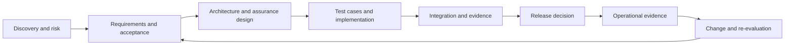
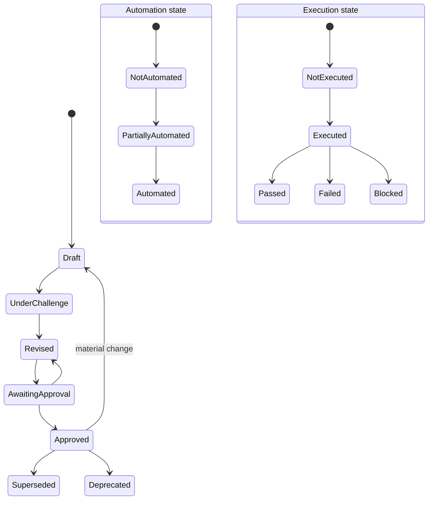
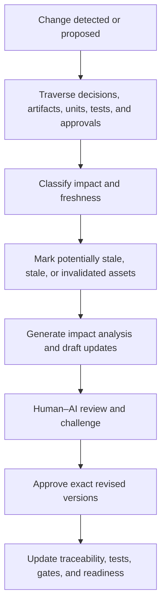
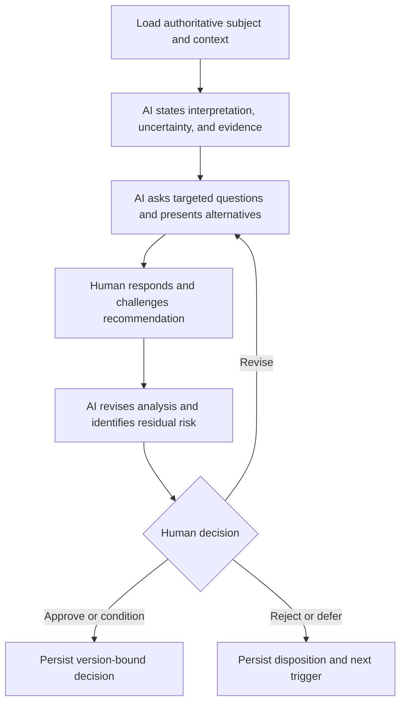
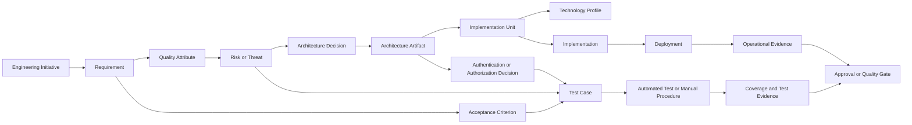

# Engineering Assurance and Architecture Model

**Governed AI Engineering Platform (GAEP)**\
**Document ID:** GAEP-PLT-020\
**Version:** 1.0\
**Status:** Draft\
**Authority:** Detailed assurance and architecture execution model\
**Change Class:** Major\
**Audience:** Quality leaders, architects, security leaders, developers, engineering managers, product owners, governance roles, and AI agents

## 1. Purpose

This document defines GAEP's operational model for engineering assurance and architecture execution. It governs how an Engineering Initiative turns applicable requirements, quality attributes, risks, topology, identity decisions, and technology constraints into approved architecture assets, test cases, executable checks, evidence, quality gates, and change-aware implementation and release decisions.

Assurance shall begin before implementation and continue through integration, release, operation, and change. Architecture shall be generated and maintained as governed engineering state rather than a one-time presentation. AI may accelerate discovery, analysis, generation, review, traceability, and regeneration, but consequential architecture, assurance adequacy, exceptions, and readiness decisions remain subject to explicit human authority where required.

The model is technology-neutral, architecture-neutral, tool-neutral, and test-methodology-neutral. It does not make Gherkin, Figma, microservices, a particular diagram notation, or any test framework universally mandatory.

## 2. Scope

This model applies to every Engineering Initiative and implementation unit for which assurance or architecture is Required, Recommended, Conditional, Reused, or otherwise governed through the [Dynamic Engineering Model](019_DYNAMIC_ENGINEERING_MODEL.md). It supports greenfield and brownfield work, user-facing and headless systems, code and non-code changes, small fixes, migrations, infrastructure, services, clients, data capabilities, and distributed systems.

It defines execution semantics for:

- Assurance Profiles and Test Methodology Decisions;
- test-case generation, challenge, approval, automation, execution, and supersession;
- dynamic test-level and coverage selection;
- authentication, authorization, security, performance, resilience, and operational assurance;
- Test Evidence and Quality Gates;
- architecture artifact planning, generation, review, approval, conformance, freshness, and regeneration;
- HLD and LLD depth and lifecycle;
- continuous Human–AI challenge and role-specific accountability;
- implementation and release activation;
- repository-visible state, stop conditions, traceability, and change propagation.

This document does not reclassify the initiative, select its lifecycle, decide which engineering activities apply, choose its technologies, or bind its boilerplates. Those resolutions belong to `019`. This document consumes those approved results and executes their assurance and architecture obligations. It defines conceptual records and behavior, not final schemas or physical folder structures.

## 3. Assurance Principles

### 3.1 Assurance is a lifecycle capability

Assurance is the continuous, evidence-producing capability by which GAEP establishes whether engineering claims are sufficiently supported for a defined scope and risk. It spans discovery, requirements, architecture, design, implementation, integration, release, operation, and change.

Assurance must not begin after coding. Early assurance identifies testability, ambiguous requirements, unsafe boundaries, missing negative behavior, unsuitable architecture, and evidence needs while decisions remain economical to change. Later assurance verifies implementation, integration, release, and operation against those decisions.

### 3.2 Claims require proportionate evidence

An **Assurance Claim** is a bounded statement that a requirement, quality attribute, security property, architecture constraint, operational behavior, or readiness condition is satisfied for an identified version and environment. A claim shall be supported by relevant Test Evidence, not AI confidence or an unqualified assertion.

Evidence strength shall be proportional to business criticality, security and data sensitivity, regulatory exposure, architecture impact, blast radius, operational risk, irreversibility, and cost of failure. A small reversible defect correction may use a focused evidence set. A payment, identity, safety, tenant-isolation, or high-volume migration initiative requires deeper and more independent evidence.

### 3.3 Assurance is contextual

No method, representation, test level, coverage metric, environment, or approval applies universally. Applicability shall come from the Initiative Profile, Applicability Matrix, requirements, risks, policies, architecture, and Assurance Profile. Not Applicable and reduced-path decisions shall be explicit when their absence could otherwise be mistaken for an omission.

### 3.4 Assurance is traceable and version-specific

Requirements, acceptance criteria, risks, architecture decisions, test cases, automated checks, execution results, coverage, exceptions, and approvals shall reference exact applicable versions. Evidence for one version, environment, identity model, or contract must not silently certify another.

### 3.5 Assurance and architecture co-evolve

Architecture decisions create test obligations, and test evidence may expose architecture defects. Changes shall propagate in both directions through governed trace links. An implementation deviation shall not remain hidden in code; it shall trigger conformance review, architecture revision, or correction.

## 4. Assurance Profile

An **Assurance Profile** is the approved, versioned assurance contract for an Engineering Initiative, implementation unit, interface, workflow, release, or other governed scope. It is the executable projection of the Foundation-level **Assurance Strategy** for a defined subject. `019` determines when a profile is required and its scope; this model defines its execution content and use.

An Assurance Profile should conceptually include:

- profile identifier, initiative or unit identifier, owner, version, and status;
- applicability source and risk classification;
- relevant requirements, acceptance criteria, quality attributes, risks, threats, and architecture decisions;
- selected test methodology or combination of methodologies;
- test-case representation and review expectations;
- applicable test levels, boundaries, responsibilities, and dependencies;
- automation strategy and justified manual activities;
- required environments, platform matrix, external-system substitutes, and readiness criteria;
- test-data strategy, classification, generation, masking, retention, isolation, and cleanup;
- coverage model, targets, calculation rules, and approved exclusions;
- security, authentication, authorization, performance, resilience, accessibility, compatibility, migration, and observability assurance as applicable;
- required Test Evidence, evidence location, integrity, freshness, and retention;
- implementation, merge, release, and operational Quality Gates;
- reviewer, approval owner, approval state, and segregation-of-duties requirements;
- exception or waiver state, compensating controls, expiration, and closure criteria;
- assumptions, unresolved items, dependencies, and review or invalidation triggers.

An initiative-level profile may define shared assurance policy. Each significant implementation unit shall inherit, specialize, or explicitly override applicable parts through a unit-level profile. Cross-unit workflows may require a separate profile because per-unit tests cannot establish end-to-end delivery, authorization propagation, consistency, or recovery claims.

Inheritance shall remain visible. A child profile shall identify its source version, adopted obligations, local additions, approved differences, and compatibility. It must not weaken a mandatory higher-level obligation without an authorized exception.

The profile lifecycle follows governed artifact semantics: Proposed, Draft, Under Challenge, Revised, Awaiting Approval, Approved, Baseline, Stale, Superseded, or Retired as applicable. Implementation readiness shall reference an exact approved profile version.

## 5. Dynamic Test Methodology

### 5.1 Test Methodology Decision

A **Test Methodology Decision** selects the methods and representations suited to a defined scope. It shall state the engineering behavior to understand, the stakeholders who need to collaborate, risks, automation intent, alternatives, rationale, applicability, owner, approval, and review triggers.

Candidate methods include:

- Gherkin and executable specifications;
- Behavior-Driven Development (BDD);
- Test-Driven Development (TDD);
- Acceptance Test-Driven Development (ATDD);
- specification by example and example mapping;
- exploratory testing;
- risk-based testing;
- model-based testing;
- property-based testing;
- consumer, provider, and event contract testing;
- conventional structured test-case design.

Methods may be combined at different scopes. Example mapping may clarify a business rule, Gherkin may communicate selected acceptance behavior, TDD may guide domain logic, property-based testing may explore invariants, contract testing may protect an independently deployed interface, and exploratory testing may investigate unknown behavior. Their coexistence is not duplication when each addresses a distinct claim.

### 5.2 Decision questions

Before recommending a methodology, the responsible AI role shall ask targeted questions:

- Who needs to understand, review, or approve the behavior?
- Is the subject business behavior, domain logic, an interface contract, a state machine, a data transformation, an operational property, or an exploratory unknown?
- Is the behavior stable enough to specify now?
- Must the representation be executable, human-readable, machine-generated, or all three?
- What risks and failure modes require systematic treatment?
- What feedback speed is needed?
- Which teams or independently deployed consumers depend on the result?
- Which tooling, skills, environments, data, and maintenance capacity exist?
- What evidence will the implementation and release gates require?
- Would the method improve understanding or introduce redundant ceremony?

For Gherkin, GAEP shall explicitly ask:

- Are scenarios business-readable?
- Do stakeholders need to review them?
- Will they serve as executable specifications?
- Are they stable enough to automate and maintain?
- Do they improve shared understanding?
- Would they duplicate lower-level tests or create unnecessary ceremony?

Gherkin is appropriate when shared behavioral language and scenario review add value. It is not automatically appropriate for low-level algorithms, infrastructure mechanics, or utilities whose behavior is clearer through unit examples, properties, contracts, or other representations.

### 5.3 Decision challenge

AI shall challenge weak selections: BDD without stakeholder collaboration, TDD presented as a complete system-assurance strategy, Gherkin used as an implementation script, exploratory testing with no mission or evidence, contract tests without identified consumers, or code-coverage targets substituted for risk analysis. The human may amend, reject, condition, or approve the recommendation. The final decision shall be repository-visible before implementation activation.

## 6. Test-Case Lifecycle

A **Test Case** is a versioned specification of preconditions, inputs or stimuli, expected behavior, expected evidence, and applicability for an identified assurance subject. A Test Case may be executable, manually executed, analytically verified, or retained as a non-executable review specification when that representation is justified.

Test definition, automation, and execution are independent state dimensions. GAEP shall not overload one status field to imply all three.

### 6.1 Definition state

- **Draft** — proposed content not yet challenged or accepted.
- **Under Challenge** — assumptions, coverage, and expected results are being reviewed.
- **Revised** — changed in response to findings or new context.
- **Awaiting Approval** — review is complete and an accountable decision is pending.
- **Approved** — exact test-case version is accepted for its scope.
- **Deprecated** — retained temporarily but discouraged or scheduled for removal.
- **Superseded** — replaced by an identified version or case.

### 6.2 Automation state

- **Not Automated** — manual, analytical, exploratory, or pending automation.
- **Partially Automated** — only part of the procedure or evidence collection is automated.
- **Automated** — executable through an identified harness with reproducible results.

### 6.3 Execution state

- **Not Executed** — no result exists for the target version and environment.
- **Executed** — an execution record exists and is awaiting or undergoing evaluation.
- **Passed** — actual result satisfied the approved expectation.
- **Failed** — expectation was not satisfied.
- **Blocked** — execution could not establish a result because a prerequisite failed.

Passed and Failed belong to a **Test Execution Record**, not permanently to the Test Case definition. A case approved yesterday may fail against today's implementation. Every execution shall identify case version, implementation or artifact version, environment, data, tool or human executor, time, result, evidence, and anomalies.

A Test Case shall trace to one or more applicable requirement, acceptance criterion, risk, architecture decision, quality attribute, API contract, event contract, authorization rule, threat, failure mode, state transition, or defect.

## 7. Test-Case Generation

AI may generate draft test cases from approved or clearly labelled provisional requirements, acceptance criteria, business rules, domain invariants, workflows, APIs, event contracts, data models, state transitions, threat models, authorization policies, Architecture Decisions, quality attributes, and failure modes.

Generation shall follow this sequence:

1. load source identities, versions, authority, and applicability;
2. identify the assurance claims and risks to be addressed;
3. choose the representation required by the Test Methodology Decision;
4. enumerate normal, negative, boundary, state, security, and failure partitions;
5. generate draft cases with trace links and explicit expected evidence;
6. identify assumptions, unavailable data, ambiguous expected results, and coverage gaps;
7. conduct role-appropriate Human–AI challenge;
8. revise and deduplicate cases;
9. obtain review and approval required by the Assurance Profile;
10. promote the approved set and create automation work where applicable.

Generated cases should cover, when relevant:

- positive paths and expected outcomes;
- negative paths, invalid inputs, and denied behavior;
- lower, upper, empty, null, overflow, and other boundary conditions;
- invalid state and prohibited transitions;
- concurrency, lost updates, ordering, and race behavior;
- duplicate commands or messages, idempotency, and deduplication;
- timeout, retry, exhaustion, backoff, and cancellation;
- authentication failure, token expiration, revocation, and invalid trust data;
- authorization denial, wrong role or scope, ownership, and tenant isolation;
- data inconsistency, migration errors, reconciliation, and partial completion;
- dependency failure, partial failure, recovery, compensation, and rollback;
- required logs, metrics, traces, alerts, and audit evidence.

AI-generated cases remain Draft until reviewed. They shall not become approved merely because they are syntactically valid or automatically committed. Review shall verify source correctness, expected results, risk coverage, feasibility, maintainability, duplication, test independence, data handling, and trace completeness.

Non-executable cases remain valid when their method and evidence are explicit, such as an exploratory charter, manual accessibility assessment, disaster-recovery exercise, architecture analysis, or regulated human inspection. Manual status must not conceal an automatable high-frequency control without rationale.

## 8. Test Levels

The Assurance Profile shall select test levels by boundary, risk, failure mode, deployment independence, feedback need, and evidence claim. No level applies universally.

| Test level | Applicability signal | Typical claim |
|---|---|---|
| Unit | Isolated logic, invariant, calculation, parser, or transformation | A small unit behaves correctly over defined inputs. |
| Component | A module or component can be exercised through a stable boundary | Internal collaboration satisfies component behavior. |
| Integration | Real adapters, stores, identity, brokers, or services interact | Integration assumptions and configuration hold. |
| API | A callable interface has behavioral and protocol obligations | Endpoints enforce contract, errors, security, and compatibility. |
| Consumer-driven contract | Independent consumers declare used behavior | Provider changes remain compatible with verified consumer expectations. |
| Provider contract | Provider publishes a normative interface | Provider implementation conforms to its published contract. |
| Event contract | Producers and consumers exchange versioned messages | Schema, semantics, compatibility, and delivery assumptions hold. |
| End-to-end | A critical workflow crosses several deployed boundaries | The integrated outcome works through representative paths. |
| UI | Visual or interaction behavior is material | User-facing flows, states, accessibility, and browser behavior work. |
| Mobile | Device, OS, network, storage, or distribution behavior is material | Supported mobile contexts and lifecycle transitions work. |
| Security | Threats or controls require adversarial evidence | Identified security properties resist applicable abuse. |
| Authentication | Identity establishment and credential behavior are in scope | Identity is established and rejected correctly. |
| Authorization | Protected resources and policies exist | Every material allow and deny rule is enforced authoritatively. |
| Performance | Latency or throughput objectives exist | The target workload meets approved performance expectations. |
| Load | Expected concurrent or volume demand is material | The system sustains representative demand. |
| Stress | Behavior beyond expected limits matters | Degradation and recovery are understood beyond capacity. |
| Soak | Time-dependent leakage or degradation is plausible | Long-duration operation remains acceptable. |
| Resilience | Dependency and partial failures are material | Failure isolation, retry, recovery, and compensation work. |
| Chaos | Controlled fault injection is justified and safe | Operational assumptions hold under selected faults. |
| Migration | State, schema, platform, or implementation changes | Transformation, cutover, compatibility, and rollback work. |
| Reconciliation | Source and target state must agree | Completeness, accuracy, duplication, and exception handling are proven. |
| Compatibility | Multiple clients, versions, devices, or environments coexist | Supported combinations remain interoperable. |
| Accessibility | Human-facing interaction has accessibility obligations | Applicable accessibility criteria are satisfied. |
| Operational acceptance | Monitoring, support, recovery, and runbooks are required | The capability can be operated safely and accountably. |

Unit tests alone do not establish a distributed workflow. End-to-end tests alone are usually too slow and opaque to localize all failures. Chaos testing is not a maturity decoration and shall not run without safe boundaries, observability, recovery, and approval. UI automation is Not Applicable for headless work unless a dependent UI is in the assessed scope.

## 9. Test-First Implementation

Before an implementation agent generates production code, it shall load and validate:

- approved requirements and acceptance criteria;
- the applicable Assurance Profile;
- approved Test Methodology Decision;
- approved test cases and identified outstanding cases permitted by condition;
- applicable Architecture Decisions and approved architecture artifacts;
- the implementation unit's Technology Profile;
- the verified Boilerplate Binding Record;
- identity, authorization, security, data, observability, and Quality Gate obligations;
- the current Implementation Readiness Record and exact authorized scope.

Depending on the methodology, the agent may generate tests first, produce executable Gherkin bindings, create consumer or provider contract tests, create unit specifications, construct an integration harness, create fixtures or simulators, and then implement production behavior. “Test first” means that behavior and evidence obligations guide implementation; it does not require one universal file-writing order.

The runtime shall reject coding activation when required context is missing, stale, contradictory, unapproved, or outside the readiness scope. Coding agents must not infer acceptance criteria from a prompt, invent an authorization rule, substitute a boilerplate, or lower a gate because implementation would otherwise be blocked.

During implementation, agents shall run the fastest applicable tests at useful feedback points, preserve failing evidence where valuable, and disclose unexecuted obligations. Implementation is incomplete until all applicable implementation gates pass or an authorized, time-bounded exception explicitly permits a narrower state. A generated test that only confirms the implementation's current behavior is not sufficient if it contradicts the approved expected behavior.

## 10. Coverage Model

**Coverage** is the degree to which approved assurance subjects have adequate Test Cases and accepted Test Evidence. It is multidimensional and must not be represented only as code-coverage percentage.

An Assurance Profile may define:

- requirement coverage;
- acceptance-criteria coverage;
- business-rule and domain-invariant coverage;
- behavior and scenario coverage;
- state-transition coverage;
- branch and condition coverage;
- mutation score;
- API operation, response, error, and version coverage;
- consumer, provider, and event contract coverage;
- event type, version, ordering, and delivery-semantic coverage;
- authorization-rule, role, scope, claim, ownership, tenant, and privileged-action coverage;
- threat and security-control coverage;
- risk and failure-mode coverage;
- data-migration, reconciliation, and rollback coverage;
- browser, device, operating-system, and compatibility coverage;
- observability signal, alert, audit, and diagnostic coverage.

A **Coverage Target** shall identify subject, scope, metric or qualitative criterion, calculation or evaluation method, threshold, rationale, owner, evidence source, exclusions, approval, and review trigger. Percentage targets shall state the denominator and exclusions. A target such as “80% coverage” is incomplete without specifying whether it means lines, branches, requirements, authorization rules, contracts, risks, or another dimension.

Coverage shall be interpreted with risk. One uncovered critical authorization rule may matter more than thousands of covered low-risk lines. Mutation results may reveal weak assertions even when line coverage is high. Contract coverage may be incomplete despite comprehensive unit tests. Approved exclusions shall be visible and must not silently remove difficult cases from the denominator.

Coverage evidence shall be recomputed or re-evaluated after relevant source, requirement, risk, contract, identity, or architecture change.

## 11. Test Evidence and Quality Gates

### 11.1 Test Evidence

**Test Evidence** is an attributable, integrity-protected record supporting or refuting an Assurance Claim for an exact subject version and context. It may include:

- approved test specifications and Test Cases;
- automated test results and execution logs;
- line, branch, condition, and behavior coverage reports;
- mutation results;
- consumer, provider, API, and event contract results;
- static analysis, dependency, supply-chain, and security-test results;
- authorization matrices and authorization-test results;
- authentication-flow and protocol-validation results;
- performance, load, stress, soak, resilience, and recovery reports;
- migration, reconciliation, cutover, and rollback evidence;
- screenshots or recordings when visual state is material;
- logs, metrics, traces, alerts, and audit records;
- qualified review, manual observation, exploratory notes, and approval records.

Evidence shall identify producer, time, source versions, environment, configuration, data set or data reference, tools and versions, result, integrity reference where required, retention, classification, and linked claims. A summary may improve review, but the underlying evidence shall remain reachable according to policy.

### 11.2 Quality Gates

A **Quality Gate** is a versioned decision contract that evaluates defined criteria and evidence before an implementation, merge, release, deployment, or operational transition. Its states are:

- **Not Assessed** — evaluation has not run for the target scope and versions;
- **Incomplete** — required evidence or criteria are missing;
- **Failed** — one or more blocking criteria are not satisfied;
- **Waiver Requested** — an exception request is pending and does not permit progression by itself;
- **Conditionally Passed** — progression is explicitly allowed with owned, time-bounded conditions;
- **Passed** — all applicable criteria are satisfied for the assessed versions;
- **Blocked** — the gate cannot be evaluated or a governing prohibition prevents progression.

A gate result shall contain gate definition and version, subject versions, applicable and non-applicable criteria, evidence references, evaluator, findings, exceptions, decision authority, time, expiration, and invalidation triggers. A tool's green indicator shall not become the gate result unless the governed gate contract maps that result to its criteria.

Failed evidence must not be deleted or reclassified as irrelevant without disposition. Flaky tests, unavailable environments, and inconclusive security scans are evidence-quality problems, not automatic passes.

## 12. Authentication Assurance

An **Authentication Profile** records the approved identity-establishment and credential-validation model for a defined boundary. Assurance shall verify applicable human, service, workload, machine, device, and external identities.

Applicable authentication assurance includes:

- identity-provider integration, configuration, trust metadata, and availability behavior;
- protocol flow and state validation;
- login, logout, SSO, step-up, account, and session behavior;
- issuer, audience, signature, key selection, algorithm, nonce, state, and token-type validation;
- token or credential expiration, refresh, rotation, revocation, replay, and clock behavior;
- session creation, renewal, fixation resistance, expiration, invalidation, and concurrent-session policy;
- service and workload identity issuance, binding, rotation, and delegation;
- machine credentials, API keys, certificates, or secrets where justified;
- secret storage, access, transmission, rotation, masking, and failure handling;
- unavailable, malformed, expired, revoked, untrusted, or incorrectly scoped credential behavior;
- security logging, privacy-preserving audit, alerts, and incident evidence.

Protocols such as OAuth 2.0, OpenID Connect, SAML, mutual TLS, workload identity, or API keys are assessed only when selected by the approved identity decision. GAEP shall not generate tests for a protocol that does not apply.

Authentication tests shall include positive and negative behavior at the actual validation boundary. A successful identity-provider login does not prove that every service validates issuer, audience, signature, token type, or expiry correctly. Test environments shall avoid production secrets and shall represent trust relationships faithfully enough to support the claim.

## 13. Authorization Assurance

An **Authorization Model** is the repository-visible definition of protected actions and authoritative policy. It shall represent, as applicable:

- subject and identity type;
- resource and resource owner;
- action or operation;
- decision context and resource state;
- tenant or organizational boundary;
- role, permission, scope, claim, and policy;
- attribute and relationship inputs;
- privileged or administrative action;
- enforcement point, policy decision point, and data boundary;
- default, explicit-deny, and failure behavior;
- audit and decision-evidence requirements.

The model may use RBAC, ABAC, policy-based, resource-based, relationship-based, or combined approaches when approved. The representation must be precise enough to generate an **Authorization Test Matrix** linking each material rule to allow and deny cases.

Applicable tests shall cover:

- expected allow scenarios;
- expected deny scenarios;
- missing or anonymous identity;
- insufficient role, permission, or scope;
- missing, malformed, conflicting, or manipulated claims;
- wrong tenant or organizational boundary;
- wrong owner or inaccessible resource;
- horizontal and vertical escalation attempts;
- direct API or resource access that bypasses client controls;
- token manipulation, confused-deputy, and delegation misuse where relevant;
- revoked or changed privileges and stale sessions or tokens;
- administrative, break-glass, and privileged actions;
- resource-state and context-dependent rules;
- deny, error, audit, alert, and privacy behavior.

Authorization shall be verified at the authoritative backend, service, data, infrastructure, or resource boundary. UI hiding and route guards are not authoritative evidence. Coverage shall show which rules, roles, scopes, ownership paths, tenants, and privileged operations were tested and which remain excluded.

## 14. Security Assurance

Security assurance shall begin with requirements and architecture. Its depth is determined by applicability, threats, data sensitivity, exposure, compliance, and blast radius.

Applicable activities include:

- threat modeling and abuse-case analysis;
- trust-boundary and data-flow review;
- attack-surface identification;
- input validation and canonicalization;
- output encoding and injection resistance;
- secrets and key management;
- encryption in transit and at rest;
- data classification, minimization, retention, and disposal;
- audit integrity, monitoring, and incident evidence;
- dependency vulnerability and provenance assessment;
- software supply-chain, artifact-signing, and build-integrity controls;
- tenant and resource isolation;
- rate limiting, abuse prevention, resource exhaustion, and backpressure;
- secure defaults, least authority, hardening, error handling, and failure behavior.

A **Threat Model** shall identify protected assets, actors, trust boundaries, threats or abuse cases, assumptions, controls, residual risk, verification method, owner, approval, and change triggers. Every material security control and security test shall trace to an identified threat, policy, standard, or accepted risk. A generic security checklist without system context is not sufficient.

AI may identify threats, propose controls, draft test cases, and compare evidence. Qualified human security ownership remains required for consequential threat acceptance, security exceptions, and claims whose failure carries material risk. Automated scanners provide evidence for their covered classes; they do not prove the absence of security defects.

## 15. Architecture Artifact Model

An **Architecture Artifact** is a versioned, governed representation of architecture scope, structure, behavior, decision, or constraint. `019` defines the Architecture Artifact Plan and applicability. This model defines how planned assets are produced, reviewed, approved, linked, maintained, and used by implementation.

### 15.1 High-level architecture categories

High-level assets may describe:

- architecture context, purpose, scope, and constraints;
- actors, personas where applicable, machine clients, and external systems;
- system and trust boundaries;
- containers, clients, major services, modules, and platform dependencies;
- primary data stores, ownership, and major information flows;
- major integrations, interaction styles, and contracts;
- deployment overview, zones, environments, and operational ownership;
- identity flows and authorization responsibility;
- key quality attributes, risks, assumptions, and decisions.

### 15.2 Low-level architecture categories

Low-level assets may describe:

- components, modules, responsibilities, dependencies, and interfaces;
- sequence flows, collaboration, state transitions, and algorithms where material;
- data models, schemas, invariants, mappings, and lifecycle;
- API and event contracts, versioning, errors, and compatibility;
- transaction boundaries, consistency, concurrency, and locking behavior;
- failure handling, timeout, retry, compensation, recovery, and idempotency;
- cache ownership, source of truth, invalidation, and staleness;
- authentication validation and authorization enforcement points;
- observability points, logs, metrics, traces, audit, alerts, and diagnostics;
- implementation constraints, patterns, extension points, and conformance rules.

Depth is applicability- and risk-driven. Architecture artifacts shall contain only the detail necessary to guide decisions, implementation, assurance, operation, and change. More diagrams do not necessarily mean better architecture.

Each artifact shall identify scope, audience, owner, status, version, authoritative sources, related decisions, assumptions, notation, review state, approval, freshness state, and regeneration triggers. External artifacts may remain in an approved tool when their stable identity, version, status, approval, and repository trace are preserved.

## 16. HLD and LLD

**High-Level Design (HLD)** is the architecture view of system context, major structures, responsibilities, boundaries, interactions, data ownership, deployment, trust, quality attributes, and key decisions. It communicates how the initiative or affected scope is organized without prescribing every implementation detail.

**Low-Level Design (LLD)** is the implementation-guiding design view needed to implement one or more units coherently. It details components, interfaces, sequences, states, contracts, transactions, failure behavior, security enforcement, observability, and implementation constraints to the depth required by complexity and risk.

HLD and LLD identify artifact kinds, not approval state. Generated or revised HLD and LLD remain Draft or in another applicable lifecycle state until an accountable human approves the exact artifact set where approval is required.

HLD and LLD may be compound artifact sets rather than single documents. An ADR, diagram, contract, model, and constraint file may collectively satisfy an HLD or LLD obligation when the Architecture Artifact Plan identifies the set and review scope.

Applicability examples:

- a small isolated defect may use an existing approved HLD and no new LLD, with a focused impact note;
- a backend service may require HLD for boundary, data, integration, trust, and deployment, plus targeted LLD for a complex workflow;
- a distributed transaction may require detailed sequences, consistency, recovery, and observability design;
- a visual-only content correction may require neither HLD nor LLD;
- an identity service, regulated data flow, or platform migration may require both with specialist review.

An HLD or LLD state shall distinguish Draft, Under Challenge, Revised, Awaiting Approval, Approved, Baseline, Potentially Stale, Stale, Invalidated, and Superseded. Approval binds an exact artifact set and source versions. A later implementation change does not inherit approval automatically.

## 17. Architecture Generation

### 17.1 Command capabilities

GAEP shall support governed command capabilities for architecture context, HLD, LLD, service topology, client topology, data topology, integration diagrams, deployment diagrams, trust-boundary diagrams, authentication flows, authorization models, sequence diagrams, ADRs, architecture review, challenge, authorized approval recording or approval requests, and impacted-architecture regeneration.

These are conceptual capability intentions, not finalized command names. Canonical commands shall follow the [Command Model](014_COMMAND_MODEL.md), including action-object lowercase kebab case, versioned contracts, context requirements, output disposition, validation, evidence, approval, and stop semantics. An approval capability may capture or route an accountable human decision; invocation by an AI agent does not itself grant approval.

### 17.2 Generation process

Architecture generation shall:

1. load approved requirements and acceptance criteria;
2. load applicable quality attributes, risks, threats, and policies;
3. load the Initiative Profile, classification, lifecycle, and Applicability Matrix;
4. load approved client, service, module, data, integration, and deployment topology;
5. load Technology Profiles and Boilerplate Binding Records;
6. load identity, authentication, authorization, data, security, and trust decisions;
7. load existing architecture, ADRs, constraints, implementation facts, and change scope;
8. generate draft architecture artifacts at the planned depth;
9. identify assumptions, contradictions, missing evidence, and unresolved decisions;
10. conduct Human–AI challenge with relevant roles;
11. revise and validate internal and cross-artifact consistency;
12. obtain explicit approval where required;
13. persist exact versions and trace links, then satisfy the relevant readiness condition;
14. monitor review and invalidation triggers.

If an authoritative input is unresolved, generation may produce an explicitly incomplete draft but must not invent the decision. A diagram generator shall not choose a broker, identity model, database, service boundary, or pattern merely to complete a picture.

### 17.3 Notation

Architecture may use Markdown, Mermaid, C4-oriented diagrams, UML, PlantUML, approved Figma or whiteboard exports, ADRs, contracts, tables, and other repository-approved forms. No notation or tool is universal.

Text-based repository-native formats should be preferred when machine consumption, diffability, review, traceability, automated validation, and regeneration matter. A visual tool may remain authoritative where it materially improves collaboration, but the repository shall retain a stable reference, exact version or snapshot, owner, status, approval, and enough context to prevent architecture from disappearing into an inaccessible canvas.

## 18. Architecture Review and Approval

Architecture review shall evaluate the artifact set against its declared scope and applicable concerns:

- requirements, acceptance criteria, and quality attributes;
- initiative classification, topology, Technology Profiles, and organizational constraints;
- boundaries, responsibilities, coupling, cohesion, ownership, and evolution;
- interfaces, data ownership, consistency, compatibility, and failure behavior;
- identity, authorization, trust, privacy, and security;
- deployment, operability, observability, recovery, and cost;
- testability and consistency with the Assurance Profile;
- assumptions, alternatives, rejected decisions, and residual risks;
- cross-artifact consistency and implementation feasibility.

Architecture review shall include challenge, not only proofreading. The Architecture Agent may identify topology or quality-attribute concerns; the Security Agent may challenge trust and access; the Test Agent may challenge untestable claims; the Implementation Agent may challenge feasibility; operational and data owners may challenge support or ownership assumptions.

AI review remains advisory unless a deterministic policy check is explicitly authoritative. Generated architecture is Draft until an accountable human approves the exact version where required. The authoring AI cannot approve its own work. Approval shall identify subject, version, scope, reviewers, evidence, conditions, risks, approver role, time, and re-evaluation triggers.

Approval outcomes may be Approved, Conditionally Approved, Changes Required, Rejected, or Deferred. A conditional approval shall identify owned obligations and permitted implementation scope. An approval does not certify implementation conformance or release; those require their own evidence and gates.

## 19. Living Architecture

Architecture is a living engineering asset. It shall be updated when relevant requirements, decisions, topology, implementation, identity, data, deployment, or operations change.

Triggers include service split or merge, new client, API or event-contract change, database or broker change, authentication-provider change, authorization-policy change, deployment change, new trust boundary, quality-attribute change, boilerplate change, discovered architecture drift, or operational evidence that contradicts an assumption.

The system shall:

1. detect or receive the change with scope and source versions;
2. map affected decisions, architecture artifacts, implementation units, Test Cases, evidence, gates, and approvals;
3. classify artifacts as Current, Potentially Stale, Stale, Invalidated, or Unaffected;
4. generate a Change Impact Record;
5. regenerate or revise drafts at the applicable depth;
6. run role-appropriate Human–AI review;
7. obtain approval for changed consequential assets;
8. update traceability and supersession;
9. reassess test cases, coverage, evidence, quality gates, and implementation readiness.

Potentially Stale indicates plausible impact awaiting assessment. Stale means the artifact no longer reflects the latest approved source. Invalidated means it must not guide implementation or approval. Superseded preserves history after a replacement is approved.

Implementation conformance shall be checked during development and before release when applicable. Detected divergence may require implementation correction, an Architecture Decision change, updated assets, additional tests, and reapproval. GAEP must not update diagrams automatically and silently when the underlying decision itself requires human judgment.

## 20. Continuous Human–AI Challenge

### 20.1 First-class interaction

Challenge is a governed platform interaction at every consequential assurance and architecture stage. The AI role shall explain its current interpretation, expose uncertainty, ask why, present alternatives, compare trade-offs, identify contradictions, request missing evidence, and recommend action. The human role may answer, challenge, amend, reject, approve, conditionally approve, or defer.

A **Challenge Record** shall contain:

- stage and subject, including exact version;
- AI role and human role;
- question or challenge and triggering context;
- rationale, evidence, assumptions, and uncertainty;
- considered options and trade-offs;
- AI recommendation;
- human response and additional evidence;
- final decision and approval state;
- unresolved items, owners, and conditions;
- review or invalidation trigger;
- related artifacts, tests, risks, and run.

Routine clarifications need not become separate durable records. Challenges that affect requirements, architecture, security, test adequacy, exceptions, or readiness shall not remain only in chat history.

### 20.2 Role-specific challenge

| Role | Challenge responsibility |
|---|---|
| Product/Requirement Agent | Ambiguity, value, actors, rules, acceptance conditions, and product assumptions where applicable. |
| Architecture Agent | Boundaries, topology, alternatives, quality attributes, coupling, failure, and evolution. |
| Security Agent | Threats, trust, identity, authorization, privacy, secrets, abuse, and residual risk. |
| Test Agent | Methodology, scenarios, negative paths, levels, environments, coverage, evidence, and gate adequacy. |
| Technology Advisor | Option fitness, lifecycle, support, interoperability, cost, capability, and exception implications. |
| Implementation Agent | Feasibility, existing-code constraints, conformance, maintainability, and executable-test practicality. |
| Review Agent | Independent consistency, omissions, unsupported claims, trace gaps, and conflicting evidence. |
| Governance Agent | Applicability, policy, authority, approval, exception, evidence, state, and stop conditions. |
| Human Product Owner | Value, business behavior, scope, and acceptance authority where Product semantics apply. |
| Human Architect | Consequential architecture coherence, trade-offs, risk, and approval. |
| Human Security Owner | Threat, security control, identity, authorization, exception, and residual-risk authority. |
| Human QA Owner | Assurance strategy, test adequacy, coverage, evidence, and quality-gate authority. |
| Human Engineering Owner | Feasibility, delivery, operational ownership, implementation risk, and execution authorization. |

AI agents do not own organizational accountability. An agent may route an out-of-role concern but shall not silently override another accountable role. Challenge must be relevant and proportionate; it must not become repetitive ceremony or a mechanism for pressuring a human to approve.

## 21. Approval Model

Consequential assurance and architecture artifacts require explicit, version-bound approval according to applicability and risk. Subjects may include requirements, acceptance criteria, architecture style, HLD, LLD, authentication model, Authorization Model, Test Methodology Decision, Test Cases, Coverage Targets, security exceptions, architecture risks, readiness overrides, and boilerplate exceptions.

Approval workflow states are:

- **Proposed**;
- **Challenged**;
- **Revised**;
- **Awaiting Approval**;
- **Conditionally Approved**;
- **Approved**;
- **Rejected**;
- **Deferred**;
- **Superseded**;
- **Exception Granted**.

These workflow states do not replace artifact, execution, or Quality Gate state. An approved Test Case may later have a Failed execution. An Approved architecture artifact may become Stale. An Exception Granted decision may coexist with a Conditionally Passed gate until its obligations close.

An approval record shall identify subject ID and version, scope, approver identity and exercised role, authority source, evidence reviewed, accepted risks, conditions, exclusions, effective time, expiration, and reopening triggers. Approval must not be inferred from silence, file presence, merge, AI output, or a passing tool result.

Conditional approval and Exception Granted shall identify obligation, owner, due trigger, compensating controls, validation, consequence, and expiration. Changed versions require reapproval when impact is material. Low-risk deterministic actions may use an A0 path under the [Human Approval Model](../03_Product_Engineering/025_HUMAN_APPROVAL_MODEL.md), but consequential architecture and assurance adequacy shall not be self-approved by AI.

## 22. Implementation and Release Gates

Gates are applicability-driven and risk-proportionate. A gate shall evaluate only criteria assigned by the Applicability Matrix and Assurance Profile, while preserving rationale for Not Applicable and waived criteria.

### 22.1 Before implementation

Applicable pre-implementation gates include:

- **Architecture Gate** — required Architecture Decisions, HLD, LLD, contracts, and constraints are approved and current;
- **Security Gate** — threats, trust boundaries, controls, residual risks, and security Test Cases are resolved;
- **Identity and Authorization Gate** — Authentication Profile, Authorization Model, enforcement points, and test matrix are approved;
- **Test-Design Gate** — methodology, test cases, levels, environments, data, Coverage Targets, and evidence obligations are approved;
- **Boilerplate Gate** — the exact mandatory organizational baseline is bound and compatible;
- **Human-Approval Gate** — all accountable decisions needed for implementation scope are valid.

These gates specialize the Implementation Readiness Gate in `019`. A coding command shall not bypass them.

Passed pre-implementation gates are evidence for readiness, not a substitute for it. Only a version-bound **Ready for Implementation** state, or an explicitly authorized **Conditionally Ready** state within the scope defined by `019`, may activate production-code generation.

### 22.2 Before merge, release, or deployment

Applicable criteria may include:

- required Test Case execution and disposition;
- approved coverage thresholds and gap analysis;
- static analysis, dependency, and supply-chain validation;
- API, consumer, provider, and event contract validation;
- security, authentication, and authorization testing;
- performance, load, stress, soak, or resilience validation;
- migration, reconciliation, cutover, and rollback validation;
- accessibility and compatibility evidence;
- observability, alert, audit, runbook, and operational-acceptance validation;
- architecture conformance and approved-deviation review;
- architecture and documentation freshness;
- accepted Test Evidence, closed or authorized findings, and explicit human approval.

Merge approval does not automatically authorize release. Release approval does not automatically authorize every deployment environment. Production transitions shall revalidate exact versions, evidence freshness, exceptions, approvals, and operational conditions.

## 23. Repository State

GAEP shall maintain repository-visible, machine-consumable references for the following conceptual records:

- Assurance Profile;
- Test Methodology Decision;
- Test Case and Test Case Set;
- Test Execution Record;
- Coverage Target and coverage evidence;
- Test Evidence and Assurance Claim;
- Authentication Profile;
- Authorization Model and Authorization Test Matrix;
- Threat Model;
- Architecture Artifact and Architecture Artifact Plan;
- HLD and LLD artifact sets;
- Architecture Approval and conformance finding;
- Challenge Record;
- Quality Gate definition and result;
- Exception or waiver;
- Change Impact Record;
- freshness, supersession, and readiness references.

This model does not prescribe final schemas, file names, folders, or storage technology. Each record shall have stable identity, type, scope, version, owner, status, provenance, classification, authority, relationships, and timestamps as applicable. External evidence or architecture may remain in approved systems when the repository retains a durable reference, exact version or integrity marker, owner, approval, access classification, and trace links.

AI context packs shall select these records by command, scope, state, applicability, authority, freshness, and risk. Coding agents shall consume approved baselines and current gate state; review agents shall receive sources, evidence, exceptions, and conflicts; regeneration agents shall receive changed nodes and affected trace relationships. Conversation memory alone is never sufficient execution state.

## 24. Stop Conditions

The runtime shall stop, block, or escalate when:

- no approved applicable acceptance criteria exist;
- the Test Methodology Decision is unresolved, stale, or contradictory;
- required Test Cases are missing, unreviewed, or unapproved;
- required architecture is absent, stale, invalidated, or inconsistent;
- required HLD or LLD approval is missing, rejected, expired, or out of scope;
- authentication applicability or design is unresolved;
- authorization rules, enforcement boundary, ownership, or test matrix are unresolved;
- a required security decision, Threat Model, control, or risk disposition is missing;
- a mandatory boilerplate is missing, inaccessible, incompatible, or unauthorized;
- a blocking Quality Gate is Failed, Incomplete, Blocked, or only Waiver Requested;
- architecture became stale after a relevant change;
- required Test Evidence is rejected, invalidated, inconclusive, or for the wrong version;
- accountable human approval is missing or cannot be verified;
- authoritative requirements, architecture, technology, security, or assurance decisions contradict each other;
- an exception is unjustified, expired, outside authority, missing compensating controls, or treated as a default;
- requested coding, merge, release, or deployment exceeds the approved scope;
- an agent lacks necessary authority, context, evidence, environment, or tool access.

A stop record shall state condition, affected subject and versions, evidence, responsible role, allowed next actions, and resume criteria. The runtime must not retry a semantic or approval failure as though it were transient. Resume shall revalidate state, context, policy, approvals, and freshness.

## 25. Traceability

GAEP shall preserve a navigable assurance and architecture trace spine:

The conceptual chain is:

Engineering Initiative → Requirement → Acceptance Criterion → Quality Attribute → Risk → Architecture Decision → Architecture Artifact → Implementation Unit → Technology Profile → Authentication or Authorization Decision → Test Case → Automated Test or governed manual procedure → Coverage Evidence → Implementation → Deployment → Operational Evidence → Approval.

Not every initiative uses every node. Trace links shall reflect applicability rather than creating empty artifacts. A defect may trace directly from defect and risk to a focused Test Case, implementation change, regression evidence, and approval while reusing current architecture. A migration may emphasize data model, reconciliation, rollback, operational evidence, and approval.

Trace validation shall detect orphan requirements, untested critical risks, architecture without decision sources, authorization rules without deny tests, tests without an approved expectation, evidence for stale versions, and approvals whose subject changed. Change analysis shall traverse both upstream justification and downstream effects.

## 26. Example Scenarios

### 26.1 Business feature using Gherkin and BDD

A Product feature contains business rules that the Product Owner, domain experts, developers, and testers must review together. The Test Methodology Decision selects example mapping during rule discovery and Gherkin for stable business-readable acceptance scenarios. BDD describes the collaboration practice; Gherkin is the selected representation, not the entire assurance strategy.

AI generates Draft positive, negative, boundary, and state-transition scenarios from approved requirements and acceptance criteria. The Product/Requirement Agent challenges ambiguous language; the Test Agent identifies missing denial and failure behavior. After revision, the Human Product Owner explicitly approves the exact acceptance scenario set. API tests automate service behavior, targeted unit tests cover domain logic, and an end-to-end test covers one critical path. Requirement, scenario, automated test, evidence, and approval remain linked. UI design or Figma is assessed separately and is not implied by BDD.

### 26.2 Backend service using TDD and contract tests

A headless backend service has independently deployed consumers and no visual surface. Figma and UI tests are Not Applicable. HLD is Required for service boundary, dependencies, data ownership, trust, deployment, and quality attributes. Targeted LLD is required for contract versioning and failure behavior.

The Assurance Profile selects TDD for domain logic, consumer-driven contract tests for used API behavior, provider contract validation, integration tests for the real database and identity adapter, and operational acceptance for telemetry and recovery. Gherkin is assessed but not selected because business-readable scenarios add no material collaboration value. Before production code, the agent loads approved cases, HLD, Technology Profile, and boilerplate binding, creates contract fixtures and unit specifications, then implements. The Quality Gate requires contract compatibility, integration evidence, authorization cases, approved coverage dimensions, and architecture conformance.

### 26.3 Protected microservice

A protected microservice accepts enterprise SSO identities from human-driven clients and workload identity from services. The Authentication Profile records issuer, audience, signatures, token types, expiration, revocation assumptions, delegation, service identity, secret handling, and failure behavior. The Authorization Model uses approved RBAC plus resource policies at the API and data boundary.

The Authorization Test Matrix covers allow, explicit and default deny, missing identity, wrong role, insufficient scope, wrong tenant, wrong owner, direct API bypass, token manipulation, revoked privilege, delegated identity misuse, and administrative operations. Security tests trace to threats and policies. Unit checks of policy logic, integration tests at the authoritative API boundary, and audit-evidence validation establish different claims. A UI hiding an action is not accepted as authorization evidence. Human Security and QA Owners approve the relevant model, cases, residual risks, and gate.

### 26.4 RabbitMQ-to-Kafka architecture change

An approved event workflow changes from RabbitMQ to Kafka after new replay, retention, throughput, and consumer-independence requirements are approved. The broker name is not changed only in configuration. The Change Impact Record identifies the ADR, HLD service topology, LLD sequence and failure diagrams, event contracts, delivery and ordering semantics, deployment, security, operational ownership, and observability.

Affected architecture assets become Stale; the prior approval and readiness state reopen. Test Cases are revised for partition ordering, replay, consumer offsets, duplicates, retention, recovery, schema compatibility, and operational alerts. Performance and resilience environments change. AI generates draft artifact revisions, relevant human roles challenge assumptions and migration risk, and the Human Architect approves exact replacements. Quality Gates and readiness remain incomplete until architecture, tests, observability, migration, rollback, and evidence are current.

### 26.5 Small defect fix with reduced assurance

A low-risk defect has a known cause in an isolated calculation, no contract, identity, data, deployment, or architecture effect, and a reversible release. Existing HLD, LLD, technology, boilerplate, and security state are verified as current and marked Already Satisfied. New visual design and broad product discovery are Not Applicable.

The reduced Assurance Profile requires a regression Test Case that fails on the prior behavior, focused unit and component evidence, a small impact analysis, static validation, and peer review. No new HLD or LLD is generated. AI challenges whether edge cases or consumers are affected; evidence confirms the bounded scope. Risk-proportionate governance avoids the full standard path without omitting explicit acceptance, test evidence, traceability, or approval required by policy.

### 26.6 Database migration with reconciliation and rollback

A database migration changes schema and transfers historical data while the service remains operational. The architecture set identifies source and target ownership, compatibility window, transaction and consistency boundaries, dual-read or dual-write behavior if used, cutover, trust, encryption, deployment, and rollback.

The Assurance Profile requires migration tests on representative volumes, schema and application compatibility, referential and business-rule validation, row and aggregate reconciliation, duplicate and missing-data detection, partial-failure recovery, idempotent rerun behavior, performance, backup restoration, rollback, monitoring, and operational acceptance. Test data is classified and masked. Coverage targets include migration mappings, reconciliation rules, failure modes, and rollback paths rather than only code lines. Release is blocked until reconciliation tolerances, exception handling, rollback evidence, architecture approval, and accountable data and engineering approvals are complete.

## 27. Relationship to Other Documents

This model shall be read with:

- [GAEP Constitution](../01_Foundation/001_GAEP_CONSTITUTION.md) — constitutional authority for assurance, architecture, evidence, human approval, security, neutrality, and change.
- [Adaptive Engineering Principles](../01_Foundation/006_ADAPTIVE_ENGINEERING_PRINCIPLES.md) — foundational obligations this document executes without redefining.
- [Dynamic Engineering Model](019_DYNAMIC_ENGINEERING_MODEL.md) — initiative classification, applicability, topology, technology, boilerplate, architecture planning, and readiness inputs consumed here.
- [Governance Model](013_GOVERNANCE_MODEL.md), [State Model](018_STATE_MODEL.md), and [Decision Model](../05_AI_Runtime/044_DECISION_MODEL.md) — policy, state dimensions, decision rights, exceptions, and reopening.
- [Command Model](014_COMMAND_MODEL.md), [Skill Model](015_SKILL_MODEL.md), [Agent Model](016_AGENT_MODEL.md), and [Runtime Model](017_RUNTIME_MODEL.md) — executable contracts, methods, roles, evidence, and enforcement.
- [Artifact Lifecycle](../03_Product_Engineering/022_ARTIFACT_LIFECYCLE.md), [Change Management](../03_Product_Engineering/023_CHANGE_MANAGEMENT.md), [Traceability Model](../03_Product_Engineering/024_TRACEABILITY_MODEL.md), and [Human Approval Model](../03_Product_Engineering/025_HUMAN_APPROVAL_MODEL.md) — artifact promotion, controlled change, semantic relationships, and accountable approval.
- [Repository Structure](../04_Repository/030_REPOSITORY_STRUCTURE.md), [Context Packs](../04_Repository/031_CONTEXT_PACKS.md), [Knowledge Model](../04_Repository/032_KNOWLEDGE_MODEL.md), [Artifact Model](../04_Repository/033_ARTIFACT_MODEL.md), and [Metadata Model](../04_Repository/034_METADATA_MODEL.md) — durable representation, authority, provenance, selection, and machine consumption.
- [Agent Execution Flow](../05_AI_Runtime/042_AGENT_EXECUTION_FLOW.md), [Context Loading](../05_AI_Runtime/043_CONTEXT_LOADING.md), and [Stop Conditions](../05_AI_Runtime/045_STOP_CONDITIONS.md) — runtime context, checkpoints, evidence capture, stopping, and resumption.

Where older documents use Product as a generic scope, assurance and architecture execution shall use the Engineering Initiative and implementation-unit semantics established by the Foundation and `019`. Product-specific acceptance and approval roles remain valid when Product is the applicable initiative type.

## 28. Platform Rule

> GAEP shall not activate, merge, release, or continue materially changed implementation on confidence alone: applicable architecture and assurance intent shall precede coding, consequential artifacts shall be explicitly approved and version-bound, quality claims shall be supported by traceable evidence, and relevant change shall regenerate and reapprove affected living engineering assets.

No method, test level, coverage percentage, diagram, HLD, LLD, tool, or approval is mandatory solely because the platform supports it. No applicable assurance, security, architecture, or human-authority obligation may be omitted merely because a reduced path is desired.
