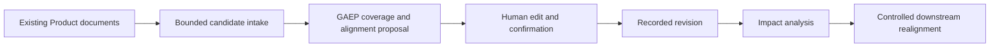

# GAEP Adaptive Product Journey UX

**Document ID:** GAEP-RDM-056  
**Status:** Active UX Decision Record  
**Last Updated:** 2026-08-03  
**Authority:** Product journey interaction and progressive-disclosure decisions  
**Source of truth boundary:** This document guides UX. Structured `.gaep` records and the audit chain remain authoritative.

## 1. Outcome

GAEP must be simple on the surface, structured underneath, and strict only where risk requires it.

The default Product experience is one visible journey that answers four questions:

1. Where am I?
2. What has been recorded?
3. What needs attention?
4. What should I do next?

Product Studio is the live dashboard. The Feature Delivery Tracker continues to track development of GAEP itself and must not be presented as the lifecycle state of a Product that GAEP manages.

## 2. Benchmark findings adopted by GAEP

| Benchmark | Useful pattern | GAEP decision |
|---|---|---|
| AWS AI-DLC | AI creates and refines lifecycle artifacts while humans validate consequential decisions | Keep AI challenge and human review, but do not show every internal record as a separate user journey |
| AWS adaptive workflows | One fixed workflow creates redundant approvals and excessive process depth | Add Quick, Guided, and Assured rigor; recommend a mode from Initiative context and expose exceptions |
| Kiro Specs | Requirements, design, and tasks form a visible progression; Quick Spec removes unnecessary intermediate gates | Present a single Product Journey and collapse internal detail; retain exact records underneath |
| GitHub Spec Kit | Explicit specification, plan, and task state; unresolved facts stay visible | Keep gaps and unresolved facts first-class; never interpret silence as not applicable |
| Specflow methodology | Intent, roadmap, tasks, execution, and refinement are time-boxed and continuously visible | Show current checkpoint, progress, attention, and one primary next action |

References:

- [AWS AI-Driven Development Life Cycle](https://aws.amazon.com/blogs/devops/ai-driven-development-life-cycle/)
- [AWS Adaptive Workflows for AI-DLC](https://aws.amazon.com/blogs/devops/open-sourcing-adaptive-workflows-for-ai-driven-development-life-cycle-ai-dlc/)
- [Kiro Specs](https://kiro.dev/docs/specs/)
- [GitHub Spec Kit methodology](https://github.com/github/spec-kit/blob/main/spec-driven.md)
- [Specflow methodology](https://www.specflow.com/getting-started.html)

## 3. Product Journey projection

The Overview page exposes the complete Phase 1 journey as twelve progressively disclosed checkpoints:

1. Product Definition
2. Initiative Definition
3. Initiative Classification
4. Initiative Applicability
5. Source Intake
6. Source Baseline
7. Source Provenance
8. Product Discovery
9. Business Architecture
10. Solution and Security Architecture
11. Detailed Design and Assurance
12. P0–P4 Readiness and P5 Handoff

The final five checkpoints are grouped user-facing projections over the exact canonical P1-07 through P1-36 records. A group is complete only when every required current record is present; it is never inferred from chat text, a draft, an attached file, or visual progress. Each checkpoint is `complete`, `attention-required`, `next`, or `not-started`. Phase 2 and later stages remain collapsed. The projection is read-only and cannot grant approval, readiness, implementation, source, or release authority.

## 4. Existing-product document intake

GAEP must support Products that began outside GAEP. The primary actions are **Choose File** and **Choose Folder**. Both open the operating-system picker without restricting browsing to the current Workspace. Folder selection recursively discovers supported text documents, DOCX documents, and XLSX workbooks under explicit depth, entry-count, file-count, per-file, compressed-expansion, extracted-text, and aggregate-byte limits; symlinks are never followed. Native VS Code Add Context and `#file` references remain optional alternatives. GAEP then:

1. reads only explicitly chosen or attached local resources within bounded size and type limits;
2. records portable labels and content digests, never machine-local absolute paths;
3. treats every attachment as a non-authoritative candidate;
4. asks the selected Codex or Claude Code advisor to perform the user's natural-language document task directly;
5. offers lifecycle alignment as a separate opt-in `/align` action;
6. when alignment is requested, shows coverage, candidate matches, conflicts, assumptions, missing evidence, and the proposed next checkpoint;
7. lets the user continue asking questions or edit and reject an alignment proposal;
8. records only the exact reviewed files as non-authoritative candidate Sources through one explicit `/record` action;
9. keeps candidate Baseline and Provenance creation as later independently testable checkpoints; and
10. never silently backfills an earlier checkpoint or claims that missing evidence is satisfied.

DOCX and XLSX are treated as bounded OOXML containers. GAEP verifies archive paths, entry counts, declared expansion sizes, decompression bounds, and CRC integrity before extracting content. DOCX paragraph and table-cell text may enter the candidate preview. XLSX sheet names, cell references, values, and formulas may enter as text, but formulas are never evaluated. Macros, embedded objects, images, charts, external links, automation, and visual-only formatting are not imported and are disclosed as extraction limitations. The content digest always covers the exact original file bytes rather than the extracted text.

The attachment mechanism is general. Initialization, Initiative work, Source Intake, design, architecture, backlog, and later lifecycle workflows may reuse the same bounded reference reader and review model.

## 5. Progressive disclosure

The default sidebar is organized around Product Journey, Agent, Attention, and Advanced. Detailed Product Studio routes, governance records, runs, evidence, and audit remain available under Advanced rather than competing with the primary next action.

Applicability is exception-first: users see decided coverage, attention, unresolved subjects, and suggested roles before the complete 49-row matrix. The full matrix remains inspectable and editable.

The Product Chat `/mode` command provides three presentation depths:

- **Quick** shows the next required group and material exceptions only.
- **Guided** is the recommended default and shows the focused sequence with explanatory context.
- **Assured** exposes every Phase 1 record family, evidence gap, and consequential review boundary.

Mode selection is machine-local presentation state. It never removes a canonical record, validation, approval, evidence obligation, or authority boundary.

## 6. Gate policy

Low-risk planning checkpoints should use one visible **Review and Record** interaction. Internally GAEP must still validate the exact proposal, revision, digest, actor, and audit transaction.

Separate confirmation remains mandatory for effectful execution, security exceptions, source authority changes, implementation authority, release, publication, destructive changes, and other high-consequence actions.

## 7. Recorded values, history, and editing

Every recorded checkpoint must be inspectable from Product Journey without requiring the user to reconstruct it from Chat history. A checkpoint drill-down must expose, as applicable:

| Information | UX requirement |
|---|---|
| Recorded fields | Show every accepted field and subsection as explicit field/value rows, not as an opaque completion badge |
| Record identity | Show the record type, stable identifier, revision, digest, recorded time, and lifecycle state |
| Source and authority | Distinguish user input, candidate evidence, accepted Product truth, AI proposal, and human approval |
| Revision history | List immutable prior revisions and allow inspection of the exact snapshot represented by each revision |
| Current gaps | Show unresolved questions, pending human decisions, stale dependencies, and review triggers beside the affected field |
| Available action | Offer a contextual Review, Edit, Resolve, or Inspect action instead of requiring the user to remember a slash command |

Editing a recorded value never rewrites history in place. It creates a new proposal and, after explicit review, a new revision. **Cancel** discards only an uncommitted draft. A recorded revision may be superseded or restored as a new revision, but it is never silently deleted. Chat is an interaction surface; `.gaep` records and their audit chain remain the source of truth.

Product Definition is the first complete implementation of this contract: all nine Product fields are inspectable and editable, and immutable Product revisions are visible in Product Studio. Initiative Classification and Applicability already use revisioned review workflows. The same contract must be applied progressively to Initiative Definition and all canonical Phase 1 record families rather than implemented as unrelated one-off screens.

## 8. Change impact and controlled realignment

Changing an earlier value starts a controlled realignment workflow:

1. GAEP creates an editable candidate revision and shows the exact before/after diff.
2. GAEP calculates affected upstream assumptions and downstream records.
3. Product Studio presents a table of affected records with `current`, `review-required`, `stale`, or `unaffected` state.
4. Chat presents a rendered Mermaid dependency view when the change affects three or more records or crosses checkpoint boundaries.
5. The user chooses which affected records to regenerate, revise, defer, or preserve with an explicit rationale.
6. GAEP revalidates the resulting chain and records every decision in the audit history.

No AI advisor may silently rewrite accepted downstream records, erase an earlier revision, invent an upstream prerequisite, or convert a detected impact into approval. Realignment remains a user-controlled proposal-and-review operation.

## 9. Existing Product fast-start

An uninitialized workspace offers **Adopt Existing Product** alongside **Initialize Product**. The fast-start journey is designed for Products that are partially designed, partially implemented, or already operating outside GAEP:

1. the user chooses one or more files or an entire folder from anywhere on the computer;
2. GAEP performs bounded extraction and treats the result as non-authoritative candidate evidence;
3. the selected advisor proposes the nine Product Definition fields and a checkpoint coverage map;
4. GAEP shows the proposal, supporting files, conflicts, assumptions, and missing evidence in editable tables;
5. the user edits or confirms the Product revision explicitly;
6. GAEP proposes alignment only for checkpoints genuinely supported by the supplied evidence;
7. unsupported or conflicting checkpoints become focused conversational questions rather than silent defaults; and
8. after each accepted checkpoint, Product Journey recalculates remaining coverage and the next valid action.

The fast-start path reduces repeated entry but does not bulk-authorize sources, approvals, baselines, readiness, implementation, or release. A high-coverage document set may advance the user quickly through review; it may not bypass review.

## 10. Presentation policy

GAEP uses the smallest visual form that makes the information easy to scan:

- use a table for three or more comparable records, field/value inspection, status matrices, role mappings, evidence coverage, revision history, and impact analysis;
- use a list for short sequences, warnings, and non-comparable actions;
- use prose for interpretation and challenge, not for encoding a large matrix;
- use a rendered Mermaid diagram for multi-checkpoint flows, architecture relationships, Event Storming flows, traceability, and change-impact propagation; and
- keep exact JSON and raw record views available as advanced inspection, not as the primary Product experience.

## 11. Delivery slices

| Slice | Outcome | Test boundary |
|---|---|---|
| UX-00 | Benchmark and adaptive-journey decisions are recorded | Documentation validation |
| UX-01 | Product Journey dashboard shows progress, attention, and the next action | Product Studio protocol, rendered accessibility, Extension Host, Product Owner UI review |
| UX-01B | Choose File, Choose Folder, and native Chat attachments become bounded candidate inputs for direct document work with an optional editable alignment preview | System-wide pickers, recursive folder bounds and symlink rejection, one-shot Product-bound selection, UTF-8/DOCX/XLSX extraction tests, OOXML expansion/integrity tests, selected-advisor test, no-path/no-authority test, Product Owner UI review |
| UX-01C1 | One explicit Review and Record action creates exact non-authoritative candidate Source records | Exact original-byte digest, idempotent retry, fail-closed metadata, authority-boundary, audit, and Product Owner UI tests |
| UX-01C2 | Reviewed candidate Sources form an exact candidate Baseline | Exact revision/membership-digest and Product Owner UI tests |
| UX-01C3 | Accepted lifecycle claims gain exact Source Provenance | Exact source/target/transformation binding and Product Owner UI tests |
| UX-01D | An uninitialized workspace can adopt an existing Product from files or folders and produce an editable nine-field proposal without creating authority | Exact nine-field contract, bounded extraction, coverage and gap tables, no-silent-persistence, advisor repair, and Product Owner UI tests |
| UX-01E | Every checkpoint exposes recorded values, status, source, revision history, and contextual review/edit actions through Product Journey and Product Studio | Protocol validation, field/value and revision tables, drill-down accessibility, immutable history, and Product Owner UI tests |
| UX-01F | Editing an accepted value produces an exact diff, impact projection, rendered dependency diagram, and user-controlled downstream realignment | Revision-staleness, no-silent-rewrite, restore-as-new-revision, cross-checkpoint impact, audit, and Product Owner UI tests |
| UX-01G | Repeated comparable information is table-first and multi-node flows are rendered as Mermaid in Chat | Markdown table, Mermaid rendering, accessibility, and visual Product Owner review |
| UX-02 | Applicability becomes exception-first | Real 49-subject Product Owner review |
| UX-03 | Product setup gains Quick, Guided, and Assured modes | Real new and existing Product examples |
| UX-04 | Initiative Definition, Classification, and Applicability appear as one Initiative Entry journey | End-to-end VS Code test |
| UX-05 | Low-risk checkpoints use Review and Record while high-risk gates remain explicit | Authority and audit regression tests |
| UX-06 | The next absent P1–P4 canonical record is generated from exact governed context, contract-validated, challenged, human-correctable, and recorded through one Review and Record action | All-schema enumeration, first-record real Engine integration, complete repository tests, packaged Extension Host, and Product Owner end-to-end review |

The UX-06 authoring loop covers all 23 canonical record families from Business Understanding through the P0–P4 Readiness Assessment and the pre-Figma P5 Handoff Package. It sends the selected advisor only the exact current Product, Initiative, Source references, optional reviewed Product Design draft, available non-authoritative document review cache, current upstream records, and the target JSON Schema. Contract-invalid output receives at most three bounded repair attempts and cannot be persisted. A natural-language correction creates another advisory round; `Review and Record` opens the exact `/commit CONFIRM` action. A separate `/accept` pause remains available for users who want an additional review boundary. This loop does not make AI output authoritative and does not synthesize missing approvals, appointments, baseline designations, readiness, implementation, release, or action authority.

## 12. Non-goals

- Chat history is not Product truth.
- AI output is not accepted evidence by itself.
- Attachment presence does not prove correctness, authority, freshness, ownership, or completeness.
- Alignment does not rewrite external documents.
- The dashboard does not replace `.gaep`, audit history, or the Feature Delivery Tracker.
