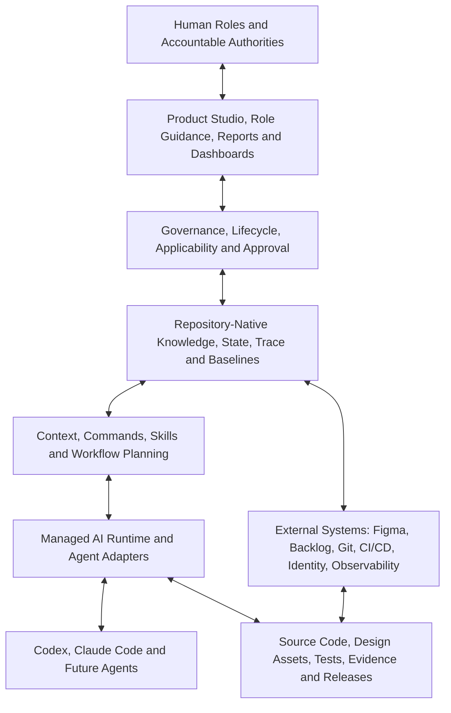
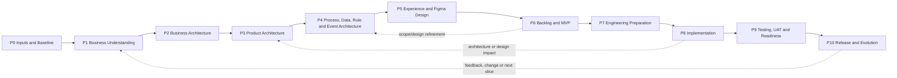
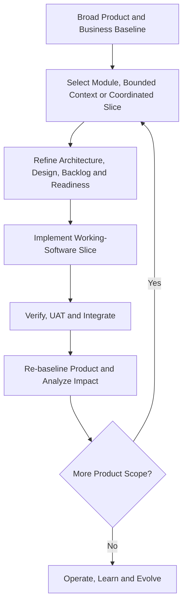

# GAEP Platform and Product Identity Manifest

**Product:** Governed AI Engineering Platform (GAEP)  
**Document ID:** GAEP-PID-001  
**Version:** 0.1.0  
**Status:** Draft — Shareable Product Identity  
**Last updated:** 2026-07-23  
**Intended audience:** Executives, product leaders, engineering leaders, architects, designers, quality and security leaders, software engineers, operators, governance participants, AI-platform evaluators, and AI agents  
**Intended use:** Product orientation, stakeholder alignment, independent product evaluation, partnership discussion, roadmap framing, role guidance, and AI context  
**Authority:** Informative Product-direction synthesis; it does not replace approved constitutional, governance, architecture, assurance, lifecycle, or implementation specifications  
**Distribution note:** This document is designed to be understandable without access to GAEP source code. It contains no credentials or source-code excerpts. It does not itself grant a software, documentation, trademark, or public-distribution license.

---

## 1. Purpose of This Manifest

This document is the portable identity card and product manifesto for the **Governed AI Engineering Platform (GAEP)**. It explains, in one self-contained source:

- why GAEP exists;
- the problems it addresses;
- what the platform is and is not;
- who uses it;
- how humans and AI collaborate through it;
- the engineering lifecycle it supports;
- its functional capability areas;
- its architectural, quality, security, and governance commitments;
- how design and Figma participate when applicable;
- how complex products are developed incrementally;
- how responsibilities, approvals, evidence, change, and drift are controlled;
- what dashboards and reports the platform should expose;
- how GAEP differs from a prompt library, AI coding assistant, fixed AI-DLC, or document generator;
- which capabilities are established foundations, which are under development, and which belong to the target product;
- how an external evaluator should assess the product.

This is not an implementation prompt. It is not a substitute for the detailed GAEP specification. It intentionally avoids internal source-code detail so that it can be shared with reviewers who need to understand and evaluate the product without receiving repository access.

When this document conflicts with an approved higher-authority GAEP document, the higher-authority document governs. The relevant authority model begins with the [GAEP Constitution](01_Foundation/001_GAEP_CONSTITUTION.md) and [Adaptive Engineering Principles](01_Foundation/006_ADAPTIVE_ENGINEERING_PRINCIPLES.md).

### 1.1 Semantic transition disclosure

The current Draft Foundation corpus describes Product as an Engineering Initiative type. The proposed GAEP Next model and current Product direction distinguish:

- **Product** as a durable Managed Asset; and
- **Initiative** as bounded governed work that creates or changes a Product or another Managed Asset.

This manifesto uses the proposed target distinction because it better represents the intended Product experience and long-term engineering memory. The distinction remains subject to formal decision effectiveness, constitutional reconciliation, migration, compatibility analysis, and Explicit Approval. This document does not perform that supersession.

---

## 2. Executive Identity

### 2.1 Product name

**Governed AI Engineering Platform (GAEP)**

### 2.2 Product category

GAEP is an **AI-enabled, repository-native, governed product and software engineering platform**.

It operates across product thinking, business architecture, product and software architecture, experience design, backlog engineering, implementation preparation, AI-assisted delivery, assurance, release, and continuous evolution.

### 2.3 One-sentence definition

> GAEP turns product and engineering intent into governed, traceable, architecture-aware, test-aware, human-approved, AI-assisted working software and durable organizational knowledge.

### 2.4 Core promise

GAEP preserves the full engineering reasoning chain:

```text
Intent
→ understanding
→ architecture
→ design
→ requirements and backlog
→ implementation readiness
→ working software
→ test evidence
→ release
→ operational learning
→ controlled evolution
```

The platform is intended to make this chain:

- explicit;
- persistent;
- reviewable;
- challengeable;
- versioned;
- traceable;
- adaptable;
- tool-independent;
- and governed by accountable humans.

### 2.5 Primary differentiator

Most AI engineering tools optimize one activity, such as chat, code generation, design generation, backlog generation, testing, or agent execution.

GAEP is intended to govern the **relationships and decision continuity between these activities**.

Its differentiator is not that it can generate more content. Its differentiator is that it seeks to preserve:

- why something is being built;
- which evidence and assumptions support it;
- which architecture and technology decisions govern it;
- which users, processes, rules, data, and events are affected;
- which requirements and tests validate it;
- who challenged, reviewed, and approved it;
- which AI and human actions changed it;
- and how later changes affect earlier and downstream decisions.

---

## 3. Product Manifesto

GAEP is founded on the following beliefs:

1. **AI acceleration without engineering governance increases the speed of inconsistency.**
2. **A conversation is not an engineering system of record.**
3. **Code is essential, but code alone is not the complete engineering memory.**
4. **Architecture must guide implementation and evolve with it.**
5. **Testing and assurance must be designed before applicable implementation, not attached only at the end.**
6. **Security, identity, authorization, privacy, and trust boundaries must be resolved deliberately.**
7. **Human accountability cannot be delegated to an AI agent.**
8. **Approval must be explicit, attributable, scoped, and bound to exact versions.**
9. **Technology and architecture choices must respond to context, not fashion.**
10. **Different components may legitimately use different technologies.**
11. **Product design and Figma are valuable when visual experience is relevant, but they are not universal prerequisites.**
12. **Large products should evolve through coherent working-software slices, not through an impractical all-at-once waterfall.**
13. **Changes must trigger proportionate impact analysis across affected upstream and downstream knowledge.**
14. **Dashboards are projections of governed state, not alternative sources of truth.**
15. **Organizational boilerplates, templates, patterns, and reference implementations are governed assets.**
16. **A useful platform must expose uncertainty, disagreement, missing evidence, and blocked decisions rather than hide them.**
17. **GAEP must remain portable across AI vendors, IDEs, programming languages, technology stacks, and delivery methods.**
18. **Progress is credible only when supported by applicable outcomes, evidence, and approval—not by document count or generated volume.**

---

## 4. The Problem GAEP Addresses

Organizations adopting AI in product and software engineering commonly experience:

- fragmented knowledge across meetings, documents, design tools, backlogs, repositories, chats, and people;
- repeated explanation of the same context to every AI assistant;
- different agents making incompatible assumptions;
- product intent becoming disconnected from implementation;
- architecture diagrams and decisions becoming stale;
- requirements, acceptance criteria, tests, and evidence losing traceability;
- Figma designs diverging from backlog, API, security, or frontend implementation;
- uncontrolled generation of new codebases and unofficial boilerplates;
- technology choices being made by model preference or trend rather than engineering context;
- authorization being treated as a frontend concern;
- tests being generated after implementation without prior assurance strategy;
- coverage being reduced to a percentage without risk interpretation;
- hidden changes propagating across artifacts without accountable review;
- approvals being inferred from silence, merge status, or generated output;
- engineering memory being lost when an employee, chat, IDE, or AI provider changes;
- increased output volume without a proportional increase in trust.

GAEP addresses these problems by making engineering state, applicability, decisions, evidence, roles, approvals, and impact relationships durable and actionable.

---

## 5. Vision

GAEP aims to create an engineering environment in which a team begins with governed intent rather than an empty prompt.

The platform should understand, to the degree established and approved:

- the initiative and its objective;
- the product or engineering asset being changed;
- the business and user context;
- the vocabulary and scope;
- the applicable lifecycle profile;
- the current phase, module, bounded context, release, and slice;
- the approved requirements and acceptance conditions;
- the architecture and implementation constraints;
- the technology choices per implementation unit;
- the identity, authorization, security, and data decisions;
- the applicable test methodology and test cases;
- the approved design baseline where relevant;
- the organizational boilerplate and reusable assets;
- the unresolved assumptions, risks, challenges, and approvals;
- the exact repository and external-artifact versions;
- and the stop conditions that prevent unsafe progress.

An AI agent working through GAEP should not begin by reconstructing the entire initiative from informal chat. It should receive the minimum relevant, current, authorized context for its assigned role and bounded task.

---

## 6. What GAEP Is

GAEP is intended to be:

- a governed engineering workspace;
- a product and engineering memory system;
- a lifecycle and applicability engine;
- a repository-native state and traceability platform;
- a human–AI collaboration and challenge environment;
- an architecture and assurance governance platform;
- a context-engineering system;
- an AI-agent integration and controlled-execution layer;
- a product-development profile host;
- a change-impact and drift-management system;
- a role-aware guidance and dashboard environment;
- a framework for reusable organizational engineering assets;
- a bridge between product intent, design, code, evidence, release, and learning.

---

## 7. What GAEP Is Not

GAEP is not:

- a chat interface with a product label;
- a prompt library;
- an autonomous product manager;
- an autonomous software architect;
- an autonomous approval authority;
- only a code generator;
- only a document generator;
- only a VS Code extension;
- a wrapper around Codex, Claude Code, Figma, or another vendor;
- a fixed AI-DLC that every initiative must follow;
- a universal mandate for Product Discovery or Figma;
- a universal microservices methodology;
- a mandate for one language, framework, cloud, database, cache, or broker;
- a replacement for source control, issue tracking, CI/CD, identity providers, design tools, or production observability;
- a guarantee that generated artifacts are correct;
- a substitute for accountable product, architecture, design, security, quality, engineering, or operational leadership.

---

## 8. Scope: Engineering Initiatives and Products

### 8.1 Generic work abstraction

GAEP's generic unit of engineering work is the **Engineering Initiative**.

An Engineering Initiative may represent:

- a product;
- a product increment;
- a feature;
- an epic or backlog item;
- a service or microservice;
- a modular-monolith module;
- a frontend or mobile application;
- an API or integration;
- a worker, batch process, or event consumer;
- an SDK, CLI, or shared library;
- infrastructure or DevOps capability;
- security or observability improvement;
- migration or modernization;
- refactoring or technical-debt remediation;
- defect correction;
- data or AI/ML capability;
- prototype;
- experiment;
- research activity.

### 8.2 Product as a managed asset

A **Product** is a durable managed asset that may be affected by multiple Initiatives over time.

An Initiative is bounded work. A Product survives the completion, cancellation, or replacement of an individual Initiative.

This is the target Product identity used by this manifesto. Its formal status is disclosed in Section 1.1 and must not be represented as an already effective constitutional amendment.

### 8.3 Product Development Profile

For an Initiative that creates or materially evolves a Product, GAEP can apply the **Product Development Profile** described in this document.

The profile contains eleven addressable phases. Every phase is evaluated, but the applicable work, depth, artifacts, methods, tools, and approvals remain contextual.

This resolves two requirements simultaneously:

- the complete product lifecycle remains visible and governed;
- irrelevant ceremony is not forced onto backend-only, non-visual, low-risk, or non-product work.

---

## 9. Foundational Operating Principles

### 9.1 Initiative neutrality

GAEP classifies the Initiative before selecting lifecycle, artifacts, roles, architecture depth, test methodology, design activities, agents, and approvals.

### 9.2 Applicability-driven execution

An activity may be:

- Required;
- Recommended;
- Optional;
- Not Applicable;
- Deferred;
- Conditionally Required;
- Already Satisfied;
- Reused;
- Blocked;
- Awaiting Human Decision.

No phase, artifact, method, tool, or approval is mandatory solely because GAEP supports it.

### 9.3 Risk-proportionate governance

Rigor is proportional to:

- business criticality;
- financial consequence;
- safety impact;
- security and privacy sensitivity;
- regulatory exposure;
- architectural impact;
- integration complexity;
- operational risk;
- blast radius;
- reversibility;
- cost of failure.

### 9.4 Architecture before implementation

Applicable architectural decisions must be resolved to the depth required for the selected implementation slice before coding begins.

### 9.5 Assurance by design

Test methodology, applicable test levels, acceptance conditions, test cases, evidence expectations, and approval needs are resolved before applicable coding.

### 9.6 Security by design

Authentication, authorization, data sensitivity, secrets, identity, trust boundaries, privileged operations, and failure behavior are explicitly assessed.

### 9.7 Repository-native state

Material engineering state is persisted in the repository or referenced from it through stable identity, version, status, ownership, and trace relationships.

### 9.8 Human authority

AI may analyze, recommend, challenge, simulate, validate, and generate proposals. Accountable humans make consequential decisions when human authority is required.

### 9.9 Small, verifiable progress

GAEP favors coherent, reviewable, evidence-producing slices over large opaque generation.

---

## 10. Conceptual Platform Architecture



The layers have distinct responsibilities:

- **Human roles** provide intent, expertise, judgment, challenge, authority, and approval.
- **Product Studio** presents governed state and actions.
- **Governance** decides what may happen, when, under which conditions, and with whose authority.
- **Repository state** preserves portable engineering memory.
- **Context and workflow planning** selects the minimum relevant knowledge and capability.
- **Managed runtime** controls agent execution, effects, evidence, and recovery.
- **Adapters** integrate replaceable AI and external tools.
- **Engineering artifacts** include design, architecture, requirements, code, tests, evidence, and release state.

---

## 11. Major Capability Areas

### 11.1 Initiative and product management

GAEP should support:

- Product identity and durable Product state;
- Initiative classification and scope;
- Changes and Work Items;
- current baseline or explicit genesis;
- owners and stakeholders;
- objectives, outcomes, constraints, assumptions, and exclusions;
- module, bounded-context, release, and slice scope;
- lifecycle-profile selection.

### 11.2 Business and product understanding

The platform should help teams establish:

- business problem and opportunity;
- objectives and measurable outcomes;
- stakeholder and user evidence;
- domain vocabulary;
- current and target state;
- business capabilities;
- value streams;
- operating model;
- business policies and constraints.

### 11.3 Architecture

GAEP should govern:

- Business Architecture;
- Product Architecture;
- Domain Architecture;
- Solution and Software Architecture;
- Data and Integration Architecture;
- Security Architecture;
- Experience Architecture;
- Deployment and Operational Architecture;
- HLD, LLD, ADRs, diagrams, interfaces, schemas, and topology.

### 11.4 Experience and product design

When applicable, GAEP should support:

- personas and user evidence;
- journeys and user flows;
- information architecture;
- experience surfaces;
- screen inventory and specifications;
- design systems, tokens, and component libraries;
- accessibility and responsive behavior;
- Figma Make and Figma Design workflows;
- design handoff and design-to-code;
- design review, approval, baseline, traceability, and drift.

### 11.5 Backlog and release planning

GAEP should connect upstream intent to:

- capabilities;
- epics;
- features;
- stories or other work-item forms;
- acceptance criteria;
- MVP and release slices;
- priority rationale;
- dependencies;
- Definition of Ready;
- Definition of Done.

### 11.6 Engineering readiness

Before applicable implementation, GAEP should resolve:

- implementation-unit boundaries;
- architecture decisions;
- Technology Profiles;
- authentication and authorization;
- organizational boilerplates;
- test methodology and test cases;
- observability, deployment, resilience, and operational constraints;
- implementation readiness and stop conditions.

### 11.7 Managed AI-assisted execution

GAEP should:

- detect available agents and truthful capabilities;
- distinguish selection from authorization;
- build bounded context packs;
- establish an execution charter;
- require a separate launch confirmation;
- isolate effectful work where applicable;
- normalize evidence;
- stage changes;
- support explicit review, apply, discard, cancellation, and safe recovery;
- distinguish provider success from governed engineering success.

### 11.8 Assurance and release

GAEP should manage:

- acceptance and test design;
- automated and manual test evidence;
- multidimensional coverage;
- quality gates;
- UAT;
- security and authorization evidence;
- performance and resilience;
- migration and compatibility;
- accessibility;
- deployment and rollback;
- release readiness and approval.

### 11.9 Change, drift, and learning

GAEP should:

- capture changes;
- calculate likely impact;
- route impact to responsible owners;
- preserve challenges and decisions;
- re-baseline approved state;
- regenerate affected derived assets;
- verify consistency;
- preserve lessons and operational feedback.

### 11.10 Dashboards and reporting

GAEP should expose role-specific, traceable projections of:

- phase progress;
- blockers;
- risks;
- decisions;
- architecture;
- design;
- backlog;
- tests and evidence;
- runs;
- readiness;
- change and drift;
- portfolio state;
- remaining work.

---

## 12. The Eleven-Phase Product Development Profile

The Product Development Profile uses phases `P0` through `P10`.

These are lifecycle phases executed by GAEP. They are not the same as internal milestones used to build or release the GAEP software itself.



The arrows show the principal reasoning order. They do not prohibit controlled parallel work, re-entry, reuse, or iteration.

### 12.1 P0 — Current Inputs and Source Baseline

**Purpose:** Establish the Initiative, source material, authority, scope hypothesis, and current state.

**Typical inputs:**

- stakeholder notes;
- voice-to-text material;
- whiteboards;
- feature lists;
- research;
- existing repositories;
- previous requirements;
- existing design files;
- architecture documents;
- production behavior;
- policies;
- organizational standards and boilerplates.

**Expected outputs:**

- Initiative identity and classification;
- source manifest with identity, version, digest, owner, and authority;
- confirmed, inferred, assumed, placeholder, deferred, and unknown classifications;
- stakeholder and authority map;
- initial risk and question register;
- initial applicability assessment;
- existing-system and asset inventory.

### 12.2 P1 — Business Understanding and Scope Alignment

**Purpose:** Align stakeholders on the problem, objectives, scope, vocabulary, evidence, constraints, and desired outcomes.

**Expected outputs:**

- problem and opportunity statement;
- scope and exclusions;
- objectives and outcome measures;
- stakeholder and user evidence;
- glossary;
- current and target state;
- business constraints;
- assumptions and unresolved questions.

### 12.3 P2 — Business Architecture

**Purpose:** Describe the applicable business capabilities, value streams, ecosystem, ownership, policy boundaries, and operating model.

**Expected outputs may include:**

- capability map;
- value streams;
- business-context view;
- stakeholder and organization model;
- responsibility boundaries;
- business policies;
- candidate domains and dependencies.

### 12.4 P3 — Product Architecture

**Purpose:** Translate business architecture into Product, domain, module, actor, experience-surface, access, and system-boundary decisions.

**Expected outputs may include:**

- Product decomposition;
- domain and module map;
- candidate bounded contexts;
- Product and system context;
- experience-surface inventory;
- actor and role model;
- authorization model;
- candidate implementation units;
- architecture alternatives;
- HLD scope and Architecture Asset Plan.

Product Architecture identifies what the Product is and how it is conceptually decomposed. It does not replace development-ready Software Architecture.

### 12.5 P4 — Process, Data, Rule and Event Architecture

**Purpose:** Make Product behavior, information, decisions, states, and interactions explicit.

**Expected outputs may include:**

- processes and workflows;
- commands and state transitions;
- business-rule catalog;
- conceptual and logical data models;
- data ownership and lifecycle;
- events and schemas;
- data flow;
- integration contracts;
- consistency and transaction boundaries;
- reconciliation and failure behavior;
- authorization and trust boundaries.

### 12.6 P5 — Experience and Figma Product Design

**Purpose:** Convert applicable Product, process, data, role, and authorization decisions into a coherent user experience and approved design baseline.

P5 is explicitly evaluated for every Product Development Profile. It may be Not Applicable for a backend engine, headless worker, API-only capability, library, or non-visual change.

When applicable, expected outputs may include:

- design brief and source analysis;
- information architecture;
- personas and access context;
- journeys and user flows;
- screen inventory;
- screen specifications;
- wireframes;
- design system;
- tokens and components;
- content guidance;
- responsive and accessibility rules;
- high-fidelity designs;
- clickable prototype;
- design traceability;
- assumptions and gaps;
- review evidence;
- approved Design Baseline.

GAEP should support both disconnected handoff and optional governed Figma integration. Figma is a design target and source, not the authority that approves Product behavior.

### 12.7 P6 — Backlog Structuring and MVP Definition

**Purpose:** Convert approved upstream knowledge into prioritized, traceable delivery scope.

**Expected outputs may include:**

- capability-to-feature mapping;
- scope classification;
- epics, features, stories, or other work items;
- acceptance criteria;
- MVP and release slices;
- dependencies;
- priority rationale;
- Definition of Ready and Definition of Done;
- estimation-ready backlog.

Backlog completion must not conceal unresolved architecture, design, security, or assurance decisions.

### 12.8 P7 — AI-Assisted Engineering Preparation

**Purpose:** Resolve development-ready Software Architecture, technology, security, assurance, organizational assets, and implementation constraints.

**Expected outputs may include:**

- implementation-unit inventory;
- Architecture Challenge Records;
- approved ADRs;
- development-ready HLD and applicable LLD;
- client, service, module, data, integration, and deployment topology;
- Technology Profile per major implementation unit;
- identity, authentication, authorization, SSO, secrets, and trust decisions;
- organizational boilerplate bindings;
- Test Methodology Decision;
- test cases;
- property-based testing applicability;
- multidimensional coverage expectations;
- implementation roadmap and vertical slices;
- context and prompt packs;
- implementation-readiness assessment.

### 12.9 P8 — Implementation

**Purpose:** Build testable working software through governed vertical slices.

**Expected outputs may include:**

- backend implementation;
- frontend implementation;
- mobile or client implementation;
- integrations;
- data and migration implementation;
- infrastructure;
- configuration;
- automated tests;
- staged changes;
- implementation evidence;
- updated living architecture.

P8 is not authorization for unconstrained generation. Every slice is bound to approved context, architecture, tests, technology, boilerplates, and effect permissions.

### 12.10 P9 — Testing, UAT and Release Readiness

**Purpose:** Determine whether the exact release candidate satisfies applicable Product, architecture, security, quality, operational, and acceptance obligations.

**Expected evidence may include:**

- unit and component tests;
- integration and contract tests;
- API and UI tests;
- end-to-end and workflow tests;
- security and authorization tests;
- performance and resilience tests;
- migration and compatibility tests;
- accessibility tests;
- property-based evidence where selected;
- UAT decisions;
- release, deployment, rollback, and operational readiness;
- residual-risk disposition;
- explicit release approval.

### 12.11 P10 — Release, Adoption and Continuous Improvement

**Purpose:** Release safely, support adoption, observe outcomes, learn, and trigger the next governed evolution.

**Expected outputs may include:**

- deployment and rollback evidence;
- training and operating procedures;
- support model;
- monitoring and observability;
- Product and operational metrics;
- incidents and defects;
- user feedback;
- lessons;
- accepted risks and follow-up actions;
- change-impact records;
- next Initiative, module, or vertical slice.

---

## 13. Iterative Development for Complex Products

GAEP must support complex products such as ERP platforms without forcing complete waterfall analysis and design of the entire system.

The recommended model is:

1. Establish broad P0–P2 baselines.
2. Identify candidate domains, modules, bounded contexts, and dependencies.
3. Select one coherent bounded context, subsystem, module, or coordinated slice.
4. Refine P3–P7 to the depth required for that scope.
5. Build and validate working software through P8–P9.
6. Release or integrate the increment.
7. Re-evaluate affected Product-wide state.
8. Update baselines and dashboards.
9. Select the next slice.



GAEP distinguishes:

- Product-level completion;
- phase-level completion;
- bounded-context completion;
- module completion;
- release completion;
- slice completion.

Completing one slice must not falsely mark the whole Product complete.

---

## 14. Experience Design and Figma Operating Model

### 14.1 Design applicability

GAEP asks:

- Does the Initiative include a visual or interactive experience?
- Which user or operational journeys are affected?
- Is there an existing approved design system or Figma library?
- Is new design work required?
- Is the design source repository-native, Figma Make, Figma Design, another approved tool, or a combination?
- Which design evidence and approvals are required?

### 14.2 Design Package

The GAEP Design Package should be a governed, reusable structure containing applicable:

- source analysis;
- design brief;
- scope and manifest;
- shell and information architecture;
- personas, roles, and permissions;
- journeys and flows;
- screen inventory;
- detailed screen specifications;
- design-system rules;
- tokens and components;
- visualization rules;
- content and UX-writing guidance;
- responsive and accessibility requirements;
- traceability;
- assumptions and unresolved gaps;
- Figma-ready persistent guidelines;
- shell, routing, per-screen, and final-integration prompts;
- review checklists;
- export/import manifest;
- design baseline and approval.

### 14.3 Manual or disconnected mode

When direct Figma connectivity is unavailable or undesired, GAEP should:

1. generate a deterministic design handoff bundle;
2. place it in a configured repository location;
3. preserve machine-readable identity and digests;
4. guide a designer or Product team through manual Figma execution;
5. accept returned file links, node identities, exports, screenshots, tokens, decisions, and review evidence;
6. compare the result to requirements and the source Design Package;
7. record an approved or rejected Design Baseline.

Absence of an MCP connection must not prevent applicable design work when manual handoff is permitted.

### 14.4 Governed Figma MCP mode

When an approved Figma MCP capability is available, GAEP should:

- detect and disclose its actual capability;
- ask whether the user wants to connect;
- separate read and write authority;
- bind work to exact files, pages, and nodes where possible;
- preview consequential changes;
- require explicit human approval before writing;
- preserve request, context, target, result, errors, and evidence;
- import stable references into repository state;
- prevent arbitrary Figma access from becoming an implicit capability of all AI runs.

The integration maturity path should be:

1. external link;
2. read-only metadata;
3. read-only semantic import;
4. draft export;
5. controlled write with preview;
6. governed bidirectional synchronization.

### 14.5 Design-to-code

Frontend implementation may use an approved Figma or repository Design Baseline. The implementation context should include only what the selected slice requires:

- exact screens and states;
- tokens and components;
- accessibility requirements;
- content rules;
- backend/API contracts;
- authorization rules;
- frontend Technology Profile;
- approved boilerplate;
- test cases;
- traceable requirements.

Generated UI code remains a proposal until reviewed and applied through the governed execution path.

---

## 15. Architecture and Technology Model

### 15.1 Progressive architecture

Architecture is resolved progressively:

- P2 establishes business structure.
- P3 establishes Product, domain, module, actor, access, and system context.
- P4 resolves behavioral, data, event, rule, and integration structure.
- P5 resolves experience architecture when applicable.
- P7 resolves development-ready Software Architecture, topology, HLD, LLD, technology, security, and operational constraints.
- P8–P10 validate conformance and keep architecture current.

### 15.2 Architecture challenge

GAEP should not merely ask a model to generate an architecture. It should support an explicit Human–AI Architecture Challenge:

1. State the decision question.
2. Load current evidence and constraints.
3. Present credible alternatives.
4. Compare trade-offs and failure modes.
5. Identify affected units and downstream consequences.
6. Record the AI recommendation and uncertainty.
7. Allow human challenge and new constraints.
8. Revise alternatives when required.
9. Record rejected options and rationale.
10. Obtain version-bound accountable approval.

Applicable questions may include:

- modular monolith, microservices, or another style;
- synchronous or asynchronous integration;
- request-driven or event-driven interaction;
- REST, gRPC, messaging, file exchange, or another contract;
- SPA, SSR, native, cross-platform, modular frontend, or micro frontend;
- monorepo or polyrepo;
- tenancy and isolation;
- consistency and transaction model;
- data ownership;
- service, module, and client boundaries;
- deployment topology;
- identity and trust boundaries.

### 15.3 Technology Profiles

GAEP does not assume one stack for an entire Product.

Each significant **Implementation Unit** receives a Technology Profile.

An Implementation Unit may be:

- administrative portal;
- customer application;
- mobile client;
- backend service;
- modular-monolith module;
- API;
- integration;
- worker;
- event consumer;
- shared library;
- data workload;
- AI/ML service;
- infrastructure or deployment unit.

A Technology Profile may record:

- responsibility and boundary;
- language and framework;
- runtime and material dependencies;
- storage and data ownership;
- cache and broker;
- API and contract style;
- authentication and authorization;
- observability;
- deployment and scaling;
- resilience and support;
- compatibility constraints;
- rationale and alternatives;
- organizational boilerplate;
- approver and version.

Different implementation units may use different technologies when justified.

### 15.4 Contextual patterns

Patterns such as DDD, CQRS, Event Sourcing, Saga, Outbox, Inbox, idempotency, retry, circuit breaker, cache-aside, distributed lock, dead-letter queue, rate limiting, backpressure, and distributed tracing are selected only in response to concrete needs.

> Best practices are contextual engineering responses, not universal architectural decorations.

### 15.5 HLD and LLD

**HLD** expresses system context, major boundaries, responsibilities, topology, integrations, trust, data ownership, deployment, and consequential constraints.

**LLD** provides implementation-guiding detail for the selected component, interaction, data structure, interface, state behavior, algorithm, or operational mechanism.

HLD and LLD may be document sets rather than single files.

Their required depth is determined by scope and risk. Both remain Draft until reviewed and approved, and both may become stale when relevant state changes.

---

## 16. Test-First Assurance Model

### 16.1 Method selection

Before applicable coding, GAEP establishes a **Test Methodology Decision**.

The platform may consider:

- example mapping;
- specification by example;
- Gherkin;
- BDD;
- TDD;
- ATDD;
- unit testing;
- component testing;
- integration testing;
- consumer-driven contracts;
- API testing;
- end-to-end testing;
- UI automation;
- security and authorization testing;
- performance and resilience testing;
- migration testing;
- accessibility testing;
- compatibility testing;
- operational acceptance;
- property-based testing.

No single methodology is universally mandatory.

Gherkin is appropriate when business-readable behavior improves shared understanding. It should not be imposed where it adds ceremony without clarity.

TDD may be selected for logic where test-first feedback is valuable. If TDD is not selected, tests still require an explicit implementation point and evidence.

### 16.2 Test cases before coding

Applicable acceptance criteria and test cases must be known before implementation begins.

The required trace is:

```text
Intent
→ requirement
→ acceptance criterion
→ test case
→ automated or manual test
→ execution evidence
→ coverage interpretation
→ approval
```

### 16.3 Multidimensional coverage

GAEP does not reduce quality to one code-coverage percentage.

Coverage may include:

- requirement coverage;
- behavior and scenario coverage;
- boundary and negative-case coverage;
- authorization coverage;
- contract coverage;
- state-transition coverage;
- failure-mode coverage;
- migration coverage;
- accessibility coverage;
- operational coverage;
- code coverage interpreted by risk.

### 16.4 Property-based testing

Property-based testing should be selected where meaningful invariants can be generated and challenged across a broad input space.

Potential applications include:

- lifecycle and state-machine invariants;
- serialization and migration round trips;
- trace-graph integrity;
- idempotency;
- path-containment and traversal safety;
- permission monotonicity;
- impact-graph closure;
- parsers and normalizers;
- scheduling and calculation properties;
- reconciliation;
- retry and deduplication behavior.

A Property Test definition should record:

- invariant;
- subject and scope;
- generator strategy;
- invalid-input behavior;
- preconditions;
- oracle;
- shrinking behavior;
- reproducible seed;
- execution budget;
- discovered counterexamples;
- retained regression tests;
- evidence and owner.

Property-based testing is not automatically useful for every UI or finite workflow. Applicability requires an explainable invariant and adequate oracle.

---

## 17. Security, Identity and Authorization

GAEP explicitly assesses, for each applicable implementation unit:

- whether authentication is required;
- identity source;
- user, service, workload, or machine identity;
- trust boundaries;
- SSO;
- protocols and token types;
- token validation;
- session model;
- service-to-service authentication;
- roles, permissions, claims, scopes, and policies;
- tenant isolation;
- resource ownership;
- privileged operations;
- audit;
- secrets;
- denial and failure behavior.

Technologies such as OAuth 2.0, OpenID Connect, SAML, mTLS, API keys, workload identity, RBAC, ABAC, policy-based authorization, and resource-based authorization are illustrative options.

Authorization is not a frontend concern. It must be enforced at the authoritative service, resource, data, or infrastructure boundary.

When authentication is not required, the decision is still recorded as Not Applicable with rationale when material.

---

## 18. Organizational Assets and Boilerplates

GAEP treats these as governed organizational assets:

- boilerplates;
- starter kits;
- framework repositories;
- templates;
- design systems;
- reference implementations;
- reusable patterns;
- commands;
- skills;
- policies;
- test harnesses.

Before implementation, GAEP should:

1. identify the implementation unit;
2. resolve architecture and Technology Profile;
3. request or locate the approved asset;
4. verify accessibility and suitability;
5. record repository, path, tag, version, commit, owner, and provenance;
6. identify missing capabilities or incompatibilities;
7. obtain the required decision;
8. bind the approved asset to the implementation slice.

AI must not silently invent an official organizational boilerplate. Creating a new official boilerplate requires explicit authorization.

---

## 19. Repository-Native Engineering Memory

GAEP's portable memory should contain or durably reference, as applicable:

- Product and Initiative identity;
- lifecycle profile and phase state;
- applicability decisions;
- source authority;
- business and Product understanding;
- capabilities, domains, modules, and bounded contexts;
- processes, rules, data, events, and integrations;
- design packages and baselines;
- requirements and backlog;
- architecture decisions and assets;
- HLD and LLD;
- Technology Profiles;
- authentication and authorization decisions;
- organizational boilerplates;
- Test Methodology Decisions and test cases;
- test evidence and coverage;
- risks, challenges, approvals, and exceptions;
- managed runs and effects;
- releases, operational evidence, incidents, and lessons;
- change impact and drift;
- rejected alternatives and supersession.

External systems may remain authoritative for specific assets, but GAEP records stable identity, version, status, ownership, and trace relationships.

Conversation memory is provisional until captured through a governed artifact.

---

## 20. Human–AI Collaboration

### 20.1 Human contributions

Humans contribute:

- purpose;
- values;
- domain expertise;
- evidence;
- strategic and ethical judgment;
- constraints;
- negotiation;
- accountability;
- risk acceptance;
- approval.

### 20.2 AI contributions

AI may contribute:

- synthesis;
- analysis;
- classification;
- ambiguity detection;
- alternative generation;
- consistency checking;
- impact discovery;
- architecture and assurance challenge;
- draft generation;
- trace construction;
- validation;
- implementation proposals;
- evidence normalization.

### 20.3 Role-bounded challenge

AI challenge must be relevant to the assigned role:

- Product Agent challenges value, scope, assumptions, and acceptance.
- Business Architecture Agent challenges capabilities, ownership, and operating-model coherence.
- Architecture Agent challenges boundaries, topology, technology, and trade-offs.
- Security Agent challenges identity, authorization, threat, privacy, and trust.
- Design Agent challenges journeys, states, accessibility, consistency, and traceability.
- Test Agent challenges methodology, negative cases, coverage, and evidence.
- Implementation Agent challenges feasibility, constraints, and code quality.
- Runtime Agent challenges missing state, authority, capabilities, and stop conditions.

An agent may surface a concern outside its role, but it should route the concern rather than silently override the accountable role.

---

## 21. RACI, Role Guidance and Authority

GAEP should provide an Initiative-specific **RACI matrix** for phases, artifacts, decisions, gates, and changes.

- **Responsible:** performs the work.
- **Accountable:** owns the decision or outcome for the defined scope.
- **Consulted:** provides required expertise or input.
- **Informed:** receives relevant status or decision information.

RACI is operational guidance. It does not itself grant legal, organizational, repository, runtime, or approval authority.

Every consequential activity should have at least one Responsible role. Every consequential decision should have exactly one Accountable role for the defined scope. Independent review requirements remain separate.

### 21.1 Illustrative phase-level RACI

The following is a starting point, not a universal staffing mandate:

| Phase | Typical Responsible roles | Typical Accountable role | Commonly Consulted | Commonly Informed |
|---|---|---|---|---|
| P0 | Product analyst, business analyst, Initiative coordinator | Initiative Owner | Domain experts, repository owners, governance | Stakeholders |
| P1 | Product owner, business analyst | Product Owner | Sponsor, users, domain experts, architecture | Delivery and governance |
| P2 | Business architect, domain experts | Business Architecture Authority | Product, operations, enterprise architecture | Engineering and design |
| P3 | Product architect, solution architect | Product or Solution Architecture Authority | Product, security, data, UX, engineering | Delivery stakeholders |
| P4 | Domain, data, integration and process architects | Solution Architecture Authority | Product, security, operations, QA | Engineering teams |
| P5 | Product/UX designer | Product Experience Authority | Product owner, accessibility, security, engineering | Delivery stakeholders |
| P6 | Product owner, business analyst | Product Owner | Architecture, design, QA, delivery leads | Engineering and governance |
| P7 | Software/solution architect, test lead, security architect | Engineering Architecture Authority | Product, DevOps, data, developers, governance | Delivery stakeholders |
| P8 | Engineering teams and implementation agents | Engineering Lead | Architecture, design, QA, security, operations | Product and governance |
| P9 | QA, security, UAT and release participants | Release or Quality Authority | Product, architecture, engineering, operations | Sponsor and stakeholders |
| P10 | Operations, Product, support and analytics | Product or Operational Owner | Engineering, security, governance, users | Portfolio stakeholders |

Organizations may combine roles for small initiatives. Role combination must not manufacture independent review or allow self-approval where separation is required.

### 21.2 Role guidance

For each role, GAEP should expose:

- the current phase and scope;
- required inputs;
- expected outputs;
- decisions the role owns;
- challenges the role should perform;
- artifacts to review;
- evidence required;
- available commands and agents;
- stop conditions;
- handoff obligations;
- help and examples.

---

## 22. Managed AI Runtime

GAEP separates:

- agent detection;
- agent selection;
- model and setting selection;
- capability truth;
- context preparation;
- authority;
- execution charter;
- launch confirmation;
- runtime execution;
- evidence;
- effect review;
- apply or discard.

Selecting an agent does not authorize a run.

A provider login does not establish GAEP authority.

A successful process exit does not prove governed success.

An AI-generated change does not automatically become authoritative Product state.

The intended runtime modes include:

- deterministic Manual/offline execution;
- Claude Code context-only execution without workspace effects;
- Codex staged execution with isolated change review;
- future adapters that satisfy the same governance contracts.

Effectful work should support:

- bounded context;
- least authority;
- timeouts and cancellation;
- normalized evidence;
- retries where approved;
- isolated staging;
- exact changed-file inventory;
- conflict detection;
- explicit apply/discard;
- recovery;
- audit.

---

## 23. Change, Impact and Drift Management

GAEP treats drift as a governance problem, not only a document-synchronization problem.

Potential drift includes:

- requirements versus design;
- design versus implementation;
- architecture versus implementation;
- tests versus acceptance criteria;
- Product scope versus backlog;
- API contracts versus clients;
- authorization model versus enforcement;
- baseline versus external artifact;
- approved boilerplate versus generated project;
- documentation versus operational reality.

### 23.1 Controlled change protocol

```text
Capture change
→ identify exact changed sources
→ analyze impact without mutation
→ route to accountable owners
→ challenge and revise
→ propose scoped updates
→ approve
→ apply through owning role
→ re-baseline
→ regenerate derived assets
→ verify
→ close or waive
```

GAEP should avoid expensive and noisy full-governance execution on every file save.

Better triggers include:

- completed change set;
- design baseline revision;
- architecture decision revision;
- schema or API change;
- slice completion;
- pre-review;
- pre-merge;
- pre-release;
- manual impact request;
- session-end light;
- session-end governance.

### 23.2 Session-end support

A light session-end check may capture:

- unfinished work;
- unresolved questions;
- ideas;
- lessons;
- changed artifacts;
- likely impacts.

A governance session-end check may additionally assess:

- traceability;
- approvals;
- risks;
- stale architecture or design;
- missing test evidence;
- handoff readiness;
- baseline consistency;
- stop conditions.

---

## 24. Dashboards and Reports

Dashboards are role-oriented read models derived from governed state.

They must not become a second source of truth.

### 24.1 Executive and portfolio view

Should answer:

- Which Products and Initiatives are active?
- What value, risk, cost, and readiness are visible?
- Which decisions or approvals block progress?
- Which releases and outcomes matter?
- Where is leadership action required?

### 24.2 Product and Initiative view

Should expose:

- Product and Initiative identity;
- objectives and scope;
- current baselines;
- bounded contexts, modules, releases, and slices;
- progress and blockers;
- next governed action.

### 24.3 Lifecycle view

Should expose:

- P0–P10;
- applicability;
- completion by Product, module, bounded context, or slice;
- Required, N/A, Deferred, Reused, Blocked, and Awaiting Decision state;
- phase owners;
- evidence and approval;
- re-entry and drift.

### 24.4 Product and backlog view

Should expose:

- capabilities;
- epics and features;
- requirements;
- release plan;
- dependencies;
- priority rationale;
- DoR/DoD;
- backlog health;
- traceability.

### 24.5 Architecture view

Should expose:

- domains and bounded contexts;
- clients, services, modules, workers, and integrations;
- HLD/LLD;
- ADRs;
- Technology Profiles;
- data and integration topology;
- identity and trust boundaries;
- stale or challenged decisions;
- architecture conformance.

### 24.6 Design and Figma view

Should expose:

- experience surfaces;
- journeys and flows;
- screens;
- design-system state;
- accessibility;
- manual or MCP mode;
- Figma file/node bindings;
- design coverage;
- review and approval;
- design drift.

### 24.7 Assurance view

Should expose:

- selected methodologies;
- test levels;
- test-case status;
- requirement and acceptance coverage;
- negative and authorization coverage;
- property-based test status;
- evidence;
- failed gates;
- release readiness.

### 24.8 Change and drift view

Should expose:

- changed sources;
- affected artifacts;
- responsible owners;
- pending decisions;
- proposed updates;
- baseline differences;
- waivers;
- stale state.

### 24.9 Runs and evidence view

Should expose:

- agent and runtime;
- model and settings where relevant;
- context and charter;
- attempts and lineage;
- selected capabilities;
- warnings and stop reasons;
- staged effects;
- evidence;
- apply/discard receipts.

### 24.10 Governance and management view

Should expose:

- Decisions;
- Risks;
- Actions;
- Changes;
- Issues;
- Lessons;
- approvals;
- exceptions;
- accountable roles.

### 24.11 Honest progress

Progress must not be an arbitrary model estimate or file count.

A progress value should disclose:

- scope;
- numerator;
- denominator;
- applicable required outcomes;
- excluded Not Applicable work;
- blocked items;
- missing evidence;
- approval status;
- freshness;
- confidence;
- calculation method.

Blocked is not the same as incomplete. Unknown is not zero. Not Applicable is not completed work.

Every chart should provide an accessible table or textual alternative.

---

## 25. External Integrations

GAEP may integrate with:

- Figma;
- GitHub, GitLab, or Azure DevOps;
- Jira, Linear, or another backlog platform;
- CI/CD;
- artifact registries;
- architecture repositories;
- identity providers;
- security scanners;
- observability platforms;
- deployment systems;
- policy engines;
- document systems;
- enterprise portfolios.

Every integration should define:

- source of truth;
- direction;
- identity and version;
- authorization;
- mapping and information loss;
- preview;
- conflict behavior;
- idempotency;
- retries and recovery;
- evidence;
- retention and deletion;
- provider exit.

Integrations should mature from references and read-only access toward controlled write and bidirectional synchronization. They should not begin with unrestricted external mutation.

---

## 26. Artifact and Decision States

Typical artifact or decision states may include:

- Proposed;
- Challenged;
- Revised;
- Awaiting Review;
- Conditionally Approved;
- Approved;
- Rejected;
- Deferred;
- Superseded;
- Exception Granted;
- Retired.

Approval:

- is explicit;
- identifies the approver and authority;
- binds to exact versions;
- states scope and conditions;
- may become stale when relevant inputs change;
- is never inferred from silence, merge, generation, or file presence.

AI does not approve its own consequential work.

---

## 27. GAEP User and Stakeholder Groups

### 27.1 Executive and portfolio leaders

Use GAEP to understand:

- value and risk;
- investment and outcome;
- readiness and blockers;
- cross-Product dependencies;
- decision and approval needs;
- governance burden and return.

### 27.2 Product leaders and Product Owners

Use GAEP to:

- frame Product intent;
- align scope and outcomes;
- challenge assumptions;
- govern Product architecture and design inputs;
- structure backlog and releases;
- approve Product decisions;
- evaluate adoption and learning.

### 27.3 Business analysts and business architects

Use GAEP to:

- establish evidence and vocabulary;
- model capabilities and value streams;
- clarify rules, processes, roles, and dependencies;
- preserve assumptions and conflicts;
- connect business intent to Product and engineering state.

### 27.4 Enterprise, solution, software, data, and security architects

Use GAEP to:

- challenge alternatives;
- govern boundaries and topology;
- create and maintain architecture assets;
- resolve Technology Profiles;
- govern identity and trust;
- review HLD/LLD;
- assess change impact and conformance.

### 27.5 Product and UX designers

Use GAEP to:

- receive authoritative Product and process context;
- produce traceable Design Packages;
- work manually or through governed Figma integration;
- preserve assumptions;
- obtain review and approval;
- hand off an exact Design Baseline.

### 27.6 QA and assurance leaders

Use GAEP to:

- select test methodology;
- ensure acceptance and tests precede coding;
- define coverage;
- govern test cases and evidence;
- challenge missing negative and authorization scenarios;
- assess release readiness.

### 27.7 Engineers

Use GAEP to:

- receive slice-specific context;
- understand approved architecture and tests;
- use approved boilerplates;
- work with controlled AI assistance;
- stage and review changes;
- produce traceable implementation evidence.

### 27.8 DevOps, SRE, operations, and release teams

Use GAEP to:

- resolve deployment and operational constraints;
- review observability, resilience, rollback, and support;
- preserve release and operational evidence;
- feed incidents and lessons into change.

### 27.9 Security, privacy, compliance, legal, and audit participants

Use GAEP to:

- identify applicable obligations;
- challenge risk and authority;
- review identity, access, data, suppliers, evidence, and exceptions;
- preserve accountable decisions.

### 27.10 AI agents

Use GAEP as a controlled operating environment that provides:

- role;
- objective;
- minimum trusted context;
- applicable policy;
- current state;
- allowed capability;
- stop conditions;
- expected artifact and evidence contract.

---

## 28. Target User Experience

A mature GAEP experience should allow a user to:

1. initialize or open a governed Product or Initiative;
2. understand current state without reading every file;
3. see applicable phases, roles, blockers, and next actions;
4. inspect source evidence and unresolved assumptions;
5. enter an interactive Human–AI challenge for Product, architecture, design, security, or testing;
6. generate controlled draft artifacts;
7. review changes and traceability;
8. approve exact versions where authorized;
9. prepare a slice with architecture, technology, boilerplate, tests, and design;
10. launch a bounded AI-assisted run;
11. inspect evidence and staged effects;
12. apply or discard safely;
13. verify readiness;
14. release and observe;
15. analyze impact and continue the next slice.

The user should not need to edit raw JSON to perform the normal first Product workflow.

---

## 29. Product Value and Expected Benefits

GAEP aims to improve:

- context reconstruction time;
- Product and engineering alignment;
- artifact consistency;
- architecture currency;
- test and evidence quality;
- change-impact discovery;
- design-to-implementation fidelity;
- reuse of approved organizational assets;
- onboarding;
- decision transparency;
- cross-role collaboration;
- AI-provider portability;
- auditability;
- release confidence;
- operational learning.

The expected business value is not “more generated text.” It is:

- less avoidable rework;
- fewer hidden assumptions;
- earlier risk detection;
- faster informed decisions;
- more reliable AI assistance;
- clearer ownership;
- better continuity when people and tools change.

---

## 30. Success Metrics

Potential Product metrics include:

- time to establish trusted Initiative context;
- percentage of material decisions with owner, rationale, alternatives, and approval;
- trace coverage from objective to release evidence;
- percentage of applicable test cases defined before coding;
- authorization and negative-case coverage;
- architecture-asset freshness;
- design-to-implementation drift;
- time to discover change impact;
- rework caused by missing upstream context;
- approved boilerplate reuse;
- review effort and defect escape;
- mean time to resolve blocked decisions;
- onboarding time;
- repeated voluntary use;
- facilitator dependence;
- governance effort versus avoided cost;
- Product outcome improvement;
- provider replacement without loss of engineering memory.

Countermetrics should detect:

- documentation burden;
- approval bottlenecks;
- false precision;
- dashboard gaming;
- unnecessary artifact production;
- excessive AI cost;
- over-engineering;
- hidden surveillance;
- user avoidance.

---

## 31. Product Risks

GAEP must actively manage risks including:

- becoming too complex before proving value;
- replacing judgment with ceremony;
- generating many artifacts without improving outcomes;
- treating repository state as correct merely because it is structured;
- stale or misleading dashboards;
- false confidence in AI-generated architecture or tests;
- overloading teams with approvals;
- mixing RACI with actual authority;
- forcing one lifecycle onto every Initiative;
- creating tool or vendor lock-in;
- uncontrolled MCP or external write access;
- privacy and workforce-surveillance misuse;
- unofficial boilerplates becoming de facto standards;
- context overloading and high model cost;
- status declarations without evidence;
- insufficient independent validation;
- under-tested adapters;
- intellectual-property or licensing mistakes when reusing external work.

Risk reduction depends on small implementation slices, real pilots, explicit non-goals, and evidence-based evolution.

---

## 32. Capability Maturity

This document describes the intended Product, not a claim that every capability is already complete.

### 32.1 Established implementation foundations

GAEP already has material foundations in areas such as:

- portable Product and delivery records;
- repository mutation and audit foundations;
- Product Studio;
- Initiative, Change, Work Item, Requirement, Decision, Risk, Architecture, Evidence, and Trace concepts;
- context and workflow records;
- agent capability and selection foundations;
- Codex, Claude Code, and Manual adapter foundations;
- managed staging, evidence, apply, discard, and recovery foundations;
- workspace trust, containment, redaction, and runtime safety mechanisms;
- automated contract, engine, adapter, Product Studio, and accessibility testing.

### 32.2 Specified or partially realized capabilities

These areas have strong conceptual and documentation foundations but require further integrated implementation:

- end-to-end managed execution through the primary IDE workflow;
- complete Product-to-run first-use journey;
- dynamic applicability and lifecycle-profile execution;
- full Architecture Challenge;
- Technology Profiles;
- HLD/LLD lifecycle;
- dynamic test-methodology and test-case enforcement;
- organizational boilerplate binding;
- design and Figma integration;
- cross-artifact drift orchestration;
- role-specific dashboards.

### 32.3 Target capabilities

Longer-term target areas include:

- complete P0–P10 Product Development execution;
- portfolio and organizational learning;
- multi-user collaboration;
- cross-repository trace;
- enterprise identity and policy;
- signed and governed third-party adapters;
- broader IDE and platform support;
- advanced but bounded multi-agent collaboration;
- federation and regulated profiles.

Any maturity claim should reference current release evidence rather than this manifesto alone.

---

## 33. Roadmap Shape

The intended delivery sequence is:

1. **Founder Runtime Foundation** — finish safe, usable, managed local execution.
2. **Lifecycle Kernel** — implement profiles, phases, applicability, baselines, RACI, and approvals.
3. **Product Understanding and Architecture** — operationalize P0–P4.
4. **Experience and Figma** — operationalize P5 with manual and MCP modes.
5. **Backlog and Readiness** — operationalize P6–P7.
6. **Working-Software Vertical Slice** — prove P8–P10 end to end.
7. **Controlled Dogfood and Independent Pilots** — measure value and burden.
8. **Drift, Dashboards, Collaboration, and Enterprise Hardening** — scale only after evidence.

The first complete vertical slice should precede claims that GAEP supports the complete Product lifecycle.

---

## 34. Benchmark Learning Position

GAEP may learn from AI-DLC, AI-PDLC, AIPDLC, AIFLC, and other external projects.

Potentially valuable patterns include:

- modular package families;
- fan-in and fan-out;
- flow orchestration;
- shared data exchange;
- package-specific quality agents;
- standalone package use;
- role-oriented dashboards;
- portfolio and project separation;
- lifecycle-chain visualization;
- Decisions/Risks/Actions/Changes/Issues/Lessons views;
- session-end governance;
- explicit drift detection and re-baselining;
- portable workspaces;
- simple installation and onboarding.

GAEP should adopt or adapt a benchmark concept only when:

- it strengthens the GAEP mission;
- it preserves GAEP terminology and authority;
- provenance and license permit reuse;
- it can be tested;
- it does not impose a fixed Product chain;
- it does not trust a textual completion status as approval;
- it does not allow one package to silently mutate another package's authoritative artifacts.

GAEP's identity must remain its own.

---

## 35. Anti-Patterns

GAEP rejects:

- assuming every Initiative is a Product;
- forcing Product Discovery into every change;
- forcing Figma into backend-only work;
- treating Figma output as approval;
- assuming one language or stack for the whole Product;
- choosing microservices, Kafka, Redis, MongoDB, or any technology by fashion;
- generating code before applicable architecture and tests are resolved;
- generating an unofficial organizational boilerplate;
- treating authentication as automatically solved by infrastructure;
- enforcing authorization only in the UI;
- defining coverage only as a percentage;
- omitting negative and authorization test cases;
- generating architecture once and allowing it to become stale;
- marking phases complete because files exist;
- treating dashboard progress as truth without a disclosed denominator;
- approving by silence;
- allowing AI to approve its own work;
- automatically rewriting every affected artifact without accountable owner review;
- running expensive governance hooks after every file save;
- treating conversation memory as authoritative;
- copying benchmark assets without provenance, license review, and semantic adaptation;
- claiming full lifecycle support before an end-to-end vertical slice is proven.

---

## 36. Controlled Terminology

| Term | Meaning |
|---|---|
| GAEP | Governed AI Engineering Platform. |
| Product | Durable managed asset that may be changed by many Initiatives. |
| Engineering Initiative | Generic bounded engineering effort. |
| Product Development Profile | GAEP profile containing P0–P10 for Product creation or material evolution. |
| Applicability Decision | Explicit decision establishing whether and how an activity or artifact applies. |
| Baseline | Exact approved state used as an authoritative reference. |
| Bounded Context | Explicit domain boundary with defined language, responsibility, and ownership. |
| Experience Surface | User- or operator-facing client or interaction channel. |
| Implementation Unit | Client, service, module, worker, integration, library, workload, or deployment unit governed as a technical unit. |
| Technology Profile | Approved technology and operational choices for one implementation unit. |
| Architecture Asset | Repository-visible or durably referenced architecture representation. |
| HLD | High-Level Design describing major context, boundaries, topology, responsibilities, and constraints. |
| LLD | Low-Level Design providing implementation-guiding detail for selected scope. |
| Design Package | Governed set of Product-design context, specifications, prompts, trace, and review material. |
| Design Baseline | Exact reviewed and approved design state. |
| Test Methodology Decision | Explicit selection of applicable test methods, representations, levels, and evidence expectations. |
| Property-Based Testing | Testing that evaluates generalized invariants across generated inputs. |
| Organizational Boilerplate | Approved, versioned implementation foundation governed as an organizational asset. |
| Human–AI Challenge | Evidence-based, role-bounded challenge between humans and AI. |
| Explicit Approval | Attributable, version-bound, scoped approval; never inferred from silence. |
| Context Pack | Bounded, purpose-specific set of trusted information supplied to an agent or workflow. |
| Execution Charter | Exact declaration of intended AI execution, inputs, authority, tools, effects, and conditions. |
| Evidence | Durable record supporting a claim, decision, test, action, or outcome. |
| Drift | Material misalignment between approved or expected states. |
| RACI | Responsible, Accountable, Consulted, and Informed responsibility mapping. |

---

## 37. Questions for Independent Evaluation

An external reviewer evaluating GAEP should consider:

### Product value

1. Is the problem important enough to justify a new platform?
2. Which user should use GAEP daily first?
3. Does GAEP replace existing work or add another administrative layer?
4. Which workflows create the earliest measurable value?
5. Are the benefits likely to exceed authoring, review, approval, and maintenance burden?

### Product identity

6. Is GAEP meaningfully different from an AI-DLC, prompt library, coding assistant, or document generator?
7. Is its repository-native engineering-memory model defensible?
8. Is Engineering Initiative neutrality preserved?
9. Is the Product Development Profile complete without becoming universally rigid?

### Architecture and feasibility

10. Can the platform remain vendor- and IDE-neutral while providing useful deep integrations?
11. Is the separation between Core semantics, profiles, adapters, and realizations clear?
12. Can phase, artifact, trace, approval, and baseline models scale without excessive complexity?
13. Is the proposed Figma integration appropriately staged and governed?
14. Are dashboards feasible as projections over structured state?

### Human and organizational behavior

15. Is explicit approval practical for real teams?
16. Can RACI and authority remain clear in small and large organizations?
17. Does GAEP support healthy challenge or create approval bottlenecks?
18. Can teams understand why work is blocked and what action resolves it?

### Assurance and trust

19. Does test-first assurance improve confidence without forcing one methodology?
20. Are architecture, design, security, and test freshness enforceable?
21. Does the platform expose uncertainty honestly?
22. Can AI execution remain bounded, reviewable, and recoverable?

### Adoption and market risk

23. What is the smallest credible vertical slice?
24. Which capabilities should be deferred?
25. What evidence would falsify the Product hypothesis?
26. What implementation or governance complexity is unjustified before pilots?
27. Which existing platform could absorb GAEP's value proposition?
28. What would make users voluntarily repeat the workflow?

The reviewer should identify strengths, weaknesses, contradictions, missing capabilities, unnecessary complexity, adoption risks, and recommended prioritization. Review feedback is input to accountable GAEP decision-making; it is not automatic approval or product authority.

---

## 38. Foundational Product Identity Rule

> GAEP is a governed engineering platform that preserves the relationship between intent, context, architecture, design, requirements, implementation, assurance, human authority, evidence, and evolution.
>
> It shall use AI to increase engineering capability without allowing speed, automation, vendor convenience, or generated volume to replace context, traceability, security, professional judgment, or explicit human accountability.

---

## 39. Related GAEP Documents

For deeper internal detail, see:

- [Read First](000_READ_FIRST.md)
- [GAEP Constitution](01_Foundation/001_GAEP_CONSTITUTION.md)
- [Project Vision](01_Foundation/002_PROJECT_VISION.md)
- [Platform Philosophy](01_Foundation/003_PLATFORM_PHILOSOPHY.md)
- [Core Principles](01_Foundation/004_CORE_PRINCIPLES.md)
- [Design Principles](01_Foundation/005_DESIGN_PRINCIPLES.md)
- [Adaptive Engineering Principles](01_Foundation/006_ADAPTIVE_ENGINEERING_PRINCIPLES.md)
- [Platform Architecture](02_Platform/010_PLATFORM_ARCHITECTURE.md)
- [Dynamic Engineering Model](02_Platform/019_DYNAMIC_ENGINEERING_MODEL.md)
- [Engineering Assurance and Architecture Model](02_Platform/020_ENGINEERING_ASSURANCE_AND_ARCHITECTURE_MODEL.md)
- [Package Strategy](03_Product_Engineering/020_PACKAGE_STRATEGY.md)
- [Product Lifecycle](03_Product_Engineering/021_PRODUCT_LIFECYCLE.md)
- [Artifact Lifecycle](03_Product_Engineering/022_ARTIFACT_LIFECYCLE.md)
- [Change Management](03_Product_Engineering/023_CHANGE_MANAGEMENT.md)
- [Traceability Model](03_Product_Engineering/024_TRACEABILITY_MODEL.md)
- [Human Approval Model](03_Product_Engineering/025_HUMAN_APPROVAL_MODEL.md)
- [Repository Structure](04_Repository/030_REPOSITORY_STRUCTURE.md)
- [Agent Execution Flow](05_AI_Runtime/042_AGENT_EXECUTION_FLOW.md)
- [Stop Conditions](05_AI_Runtime/045_STOP_CONDITIONS.md)
- [Platform Roadmap](06_Roadmap/050_PLATFORM_ROADMAP.md)
- [Implementation Strategy](06_Roadmap/051_IMPLEMENTATION_STRATEGY.md)
- [Glossary](99_References/991_GLOSSARY.md)
- [Terminology](99_References/992_TERMINOLOGY.md)
