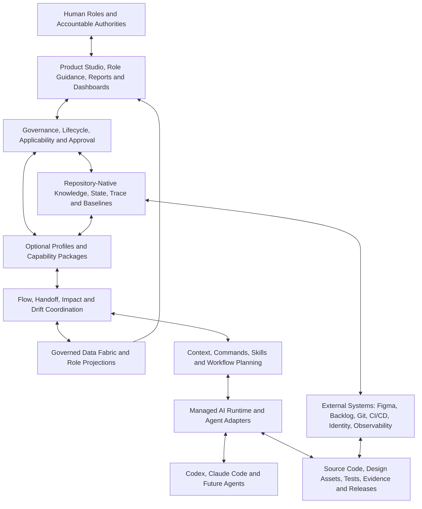
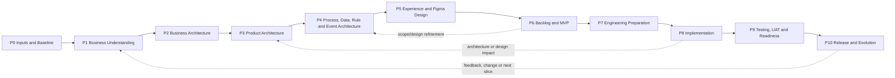
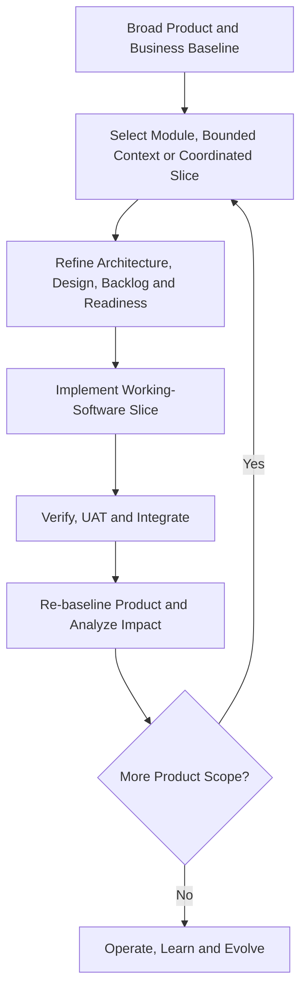
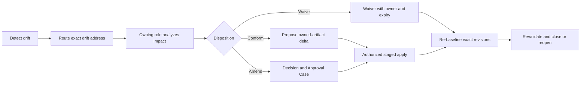

# GAEP Platform and Product Identity Manifest

**Product:** Governed AI Engineering Platform (GAEP)  
**Document ID:** GAEP-PID-001  
**Version:** 0.4.4<br>
**Status:** Draft — Shareable Product Identity  
**Last updated:** 2026-07-26  
**Intended audience:** Executives, product leaders, engineering leaders, architects, designers, quality and security leaders, software engineers, operators, governance participants, AI-platform evaluators, and AI agents  
**Intended use:** Product orientation, stakeholder alignment, independent product evaluation, partnership discussion, roadmap framing, role guidance, and AI context  
**Authority:** Informative Product-direction synthesis; it does not replace approved constitutional, governance, architecture, assurance, lifecycle, or implementation specifications  
**Distribution note:** This document is designed to be understandable without access to GAEP source code. It contains no credentials or source-code excerpts. It does not itself grant a software, documentation, trademark, or public-distribution license.

---

## 1. Purpose of This Manifest

This document is the portable identity card and product manifesto for the **Governed AI Engineering Platform (GAEP)**. It explains, in one self-contained source:

- why GAEP exists;
- the problems it addresses;
- what the platform is and is not;
- who uses it;
- how humans and AI collaborate through it;
- the engineering lifecycle it supports;
- its functional capability areas;
- its architectural, quality, security, and governance commitments;
- how design and Figma participate when applicable;
- how complex products are developed incrementally;
- how responsibilities, approvals, evidence, change, and drift are controlled;
- what dashboards and reports the platform should expose;
- how GAEP differs from a prompt library, AI coding assistant, fixed AI-DLC, or document generator;
- which capabilities are established foundations, which are under development, and which belong to the target product;
- how an external evaluator should assess the product.

This is not an implementation prompt. It is not a substitute for the detailed GAEP specification. It intentionally avoids internal source-code detail so that it can be shared with reviewers who need to understand and evaluate the product without receiving repository access.

When this document conflicts with an approved higher-authority GAEP document, the higher-authority document governs. The relevant authority model begins with the [GAEP Constitution](01_Foundation/001_GAEP_CONSTITUTION.md) and [Adaptive Engineering Principles](01_Foundation/006_ADAPTIVE_ENGINEERING_PRINCIPLES.md).

Capability statements in this manifesto use three planning horizons:

- **North-Star Product Identity (NS):** the durable Product purpose and non-negotiable engineering commitments;
- **Target Platform Architecture (TPA):** the intended platform capability model, whether or not every capability is implemented;
- **First Credible Release (FCR):** the smallest operational release that can produce falsifiable evidence for GAEP's central value proposition.

These horizons must not be conflated. A North-Star or Target Platform Architecture capability is not a claim of current availability. Current maturity is disclosed in Section 32, and delivery sequencing is disclosed in Section 33.

Delivery planning additionally distinguishes **Pilot**, **First Product Release (FPR)**, **Pre-Production**, **Enterprise Hardening**, **Later**, and **Target Platform Architecture (TPA)**. FCR identifies the smallest falsifiable proof; FPR identifies the first repeatable productized release. Capability claims must be resolved through the maturity and delivery register in Section 32.5. When a claim is excerpted for implementation planning, evaluation, or external communication, its horizon, release class where known, and current maturity must travel with it. Unknown baselines and targets must be marked `TBD by baseline study`, not invented.

### 1.1 Semantic transition disclosure

The current Draft Foundation corpus describes Product as an Engineering Initiative type. The proposed GAEP Next model and current Product direction distinguish:

- **Product** as a durable Managed Asset; and
- **Initiative** as bounded governed work that creates or changes a Product or another Managed Asset.

This manifesto uses the proposed target distinction because it better represents the intended Product experience and long-term engineering memory. The distinction remains subject to formal decision effectiveness, constitutional reconciliation, migration, compatibility analysis, and Explicit Approval. This document does not perform that supersession.

Until that decision becomes effective, Product-as-Managed-Asset must not be represented as the operative constitutional model, and a Lifecycle Kernel that depends on the new semantics must not be declared effective. A pilot may proceed using Engineering Initiative semantics alone, but any resulting limitation on Product continuity, neutrality, or portfolio claims must be disclosed.

---

## 2. Executive Identity

### 2.1 Product name

**Governed AI Engineering Platform (GAEP)**

### 2.2 Product category

GAEP is a **governed engineering control plane**: a repository-native system of record and control layer for AI-assisted product and software engineering, delivered as a layered platform consisting of Core Product, Platform Capabilities, Profiles, Capability Packages, Adapters, and Projections.

GAEP's intended category is a platform. Its current realization is a Founder implementation whose maturity is disclosed in Section 32. North-Star and Target Platform Architecture statements in this document must not be interpreted as current-availability claims without corresponding release evidence.

### 2.3 One-sentence definition

> GAEP is a governed engineering control plane that preserves decision continuity between intent, architecture, design, requirements, assurance, AI-assisted implementation, human authority, evidence, and change across the full engineering lifecycle.

### 2.4 Core promise

GAEP preserves the full engineering reasoning chain:

```text
Intent
→ understanding
→ architecture
→ design
→ requirements and backlog
→ implementation readiness
→ working software
→ test evidence
→ release
→ operational learning
→ controlled evolution
```

The platform is intended to make this chain:

- explicit;
- persistent;
- reviewable;
- challengeable;
- versioned;
- traceable;
- adaptable;
- tool-independent;
- and governed by accountable humans.

### 2.5 Primary differentiator

Most AI engineering tools optimize one activity, such as chat, code generation, design generation, backlog generation, testing, or agent execution.

GAEP is intended to govern the **relationships and decision continuity between these activities**.

Its differentiator is not that it can generate more content. Its differentiator is that it seeks to preserve:

- why something is being built;
- which evidence and assumptions support it;
- which architecture and technology decisions govern it;
- which users, processes, rules, data, and events are affected;
- which requirements and tests validate it;
- who challenged, reviewed, and approved it;
- which AI and human actions changed it;
- and how later changes affect earlier and downstream decisions.

The initial Product wedge is deliberately narrower than the North-Star scope: **governed change-impact discovery and fail-closed AI execution in existing repositories**. GAEP should prove this continuity-and-authority seam before claiming complete lifecycle execution.

---

## 3. Product Manifesto

GAEP is founded on the following beliefs:

1. **AI acceleration without engineering governance increases the speed of inconsistency.**
2. **A conversation is not an engineering system of record.**
3. **Code is essential, but code alone is not the complete engineering memory.**
4. **Architecture must guide implementation and evolve with it.**
5. **Testing and assurance must be designed before applicable implementation, not attached only at the end.**
6. **Security, identity, authorization, privacy, and trust boundaries must be resolved deliberately.**
7. **Human accountability cannot be delegated to an AI agent.**
8. **Approval must be explicit, attributable, scoped, and bound to exact versions.**
9. **Technology and architecture choices must respond to context, not fashion.**
10. **Different components may legitimately use different technologies.**
11. **Product design and Figma are valuable when visual experience is relevant, but they are not universal prerequisites.**
12. **Large products should evolve through coherent working-software slices, not through an impractical all-at-once waterfall.**
13. **Changes must trigger proportionate impact analysis across affected upstream and downstream knowledge.**
14. **Dashboards are projections of governed state, not alternative sources of truth.**
15. **Organizational boilerplates, templates, patterns, and reference implementations are governed assets.**
16. **A useful platform must expose uncertainty, disagreement, missing evidence, and blocked decisions rather than hide them.**
17. **GAEP must remain portable across AI vendors, IDEs, programming languages, technology stacks, and delivery methods.**
18. **Progress is credible only when supported by applicable outcomes, evidence, and approval—not by document count or generated volume.**

---

## 4. The Problem GAEP Addresses

Organizations adopting AI in product and software engineering commonly experience:

- fragmented knowledge across meetings, documents, design tools, backlogs, repositories, chats, and people;
- repeated explanation of the same context to every AI assistant;
- different agents making incompatible assumptions;
- product intent becoming disconnected from implementation;
- architecture diagrams and decisions becoming stale;
- requirements, acceptance criteria, tests, and evidence losing traceability;
- Figma designs diverging from backlog, API, security, or frontend implementation;
- uncontrolled generation of new codebases and unofficial boilerplates;
- technology choices being made by model preference or trend rather than engineering context;
- authorization being treated as a frontend concern;
- tests being generated after implementation without prior assurance strategy;
- coverage being reduced to a percentage without risk interpretation;
- hidden changes propagating across artifacts without accountable review;
- approvals being inferred from silence, merge status, or generated output;
- engineering memory being lost when an employee, chat, IDE, or AI provider changes;
- increased output volume without a proportional increase in trust.

GAEP addresses these problems by making engineering state, applicability, decisions, evidence, roles, approvals, and impact relationships durable and actionable.

---

## 5. Vision

GAEP aims to create an engineering environment in which a team begins with governed intent rather than an empty prompt.

The platform should understand, to the degree established and approved:

- the initiative and its objective;
- the product or engineering asset being changed;
- the business and user context;
- the vocabulary and scope;
- the applicable lifecycle profile;
- the current phase, module, bounded context, release, and slice;
- the approved requirements and acceptance conditions;
- the architecture and implementation constraints;
- the technology choices per implementation unit;
- the identity, authorization, security, and data decisions;
- the applicable test methodology and test cases;
- the approved design baseline where relevant;
- the organizational boilerplate and reusable assets;
- the unresolved assumptions, risks, challenges, and approvals;
- the exact repository and external-artifact versions;
- and the stop conditions that prevent unsafe progress.

An AI agent working through GAEP should not begin by reconstructing the entire initiative from informal chat. It should receive the minimum relevant, current, authorized context for its assigned role and bounded task.

---

## 6. What GAEP Is

GAEP is one Product—a governed engineering control plane—expressed through layers. The capabilities below are functions of that single Core, not separate products. They are delivered progressively according to the maturity disclosure in Section 32 and the evidence-gated roadmap in Section 33.

GAEP is intended to be:

- a governed engineering workspace;
- a product and engineering memory system;
- a lifecycle and applicability engine;
- a repository-native state and traceability platform;
- a human–AI collaboration and challenge environment;
- an architecture and assurance governance platform;
- a context-engineering system;
- an AI-agent integration and controlled-execution layer;
- a product-development profile host;
- a change-impact and drift-management system;
- a role-aware guidance and dashboard environment;
- a framework for reusable organizational engineering assets;
- a bridge between product intent, design, code, evidence, release, and learning.

---

## 7. What GAEP Is Not

GAEP is not:

- a chat interface with a product label;
- a prompt library;
- an autonomous product manager;
- an autonomous software architect;
- an autonomous approval authority;
- only a code generator;
- only a document generator;
- only a VS Code extension;
- a wrapper around Codex, Claude Code, Figma, or another vendor;
- a fixed AI-DLC that every initiative must follow;
- a universal mandate for Product Discovery or Figma;
- a universal microservices methodology;
- a mandate for one language, framework, cloud, database, cache, or broker;
- a replacement for source control, issue tracking, CI/CD, identity providers, design tools, or production observability;
- a guarantee that generated artifacts are correct;
- a substitute for accountable product, architecture, design, security, quality, engineering, or operational leadership.

---

## 8. Scope: Engineering Initiatives and Products

### 8.1 Generic work abstraction

GAEP's generic unit of engineering work is the **Engineering Initiative**.

An Engineering Initiative may represent:

- a product;
- a product increment;
- a feature;
- an epic or backlog item;
- a service or microservice;
- a modular-monolith module;
- a frontend or mobile application;
- an API or integration;
- a worker, batch process, or event consumer;
- an SDK, CLI, or shared library;
- infrastructure or DevOps capability;
- security or observability improvement;
- migration or modernization;
- refactoring or technical-debt remediation;
- defect correction;
- data or AI/ML capability;
- prototype;
- experiment;
- research activity.

### 8.2 Product as a managed asset

A **Product** is a durable managed asset that may be affected by multiple Initiatives over time.

An Initiative is bounded work. A Product survives the completion, cancellation, or replacement of an individual Initiative.

This is the target Product identity used by this manifesto. Its formal status is disclosed in Section 1.1 and must not be represented as an already effective constitutional amendment.

### 8.3 Product Development Profile

For an Initiative that creates or materially evolves a Product, GAEP can apply the **Product Development Profile** described in this document.

The profile contains eleven addressable phases. Every phase is evaluated, but the applicable work, depth, artifacts, methods, tools, and approvals remain contextual.

This resolves two requirements simultaneously:

- the complete product lifecycle remains visible and governed;
- irrelevant ceremony is not forced onto backend-only, non-visual, low-risk, or non-product work.

---

## 9. Foundational Operating Principles

### 9.1 Initiative neutrality

GAEP classifies the Initiative before selecting lifecycle, artifacts, roles, architecture depth, test methodology, design activities, agents, and approvals.

### 9.2 Applicability-driven execution

An activity may be:

- Required;
- Recommended;
- Optional;
- Not Applicable;
- Deferred;
- Conditionally Required;
- Already Satisfied;
- Reused;
- Blocked;
- Awaiting Human Decision.

No phase, artifact, method, tool, or approval is mandatory solely because GAEP supports it.

GAEP should provide opinionated, overridable applicability defaults for common Initiative types, including brownfield defect fixes, security remediation, migrations, backend services, libraries and SDKs, Product UI changes, data or AI/ML capabilities, and research or prototypes. Defaults should cover likely lifecycle depth, architecture and assurance expectations, approval needs, and whether Product Discovery, experience design, Figma, or other activities normally apply.

Defaults accelerate classification; they do not replace judgment. An override must record the accountable owner and rationale, and no user override may weaken a mandatory policy or external obligation.

### 9.3 Risk-proportionate governance

Rigor is proportional to:

- business criticality;
- financial consequence;
- safety impact;
- security and privacy sensitivity;
- regulatory exposure;
- architectural impact;
- integration complexity;
- operational risk;
- blast radius;
- reversibility;
- cost of failure.

GAEP should present three understandable governance modes while preserving the underlying risk and applicability semantics:

- **Starter** for low-risk, bounded work with the minimum safe controls;
- **Standard Governed** for normal organizational engineering work;
- **High-Assurance or Regulated** for elevated criticality, sensitivity, or external obligation.

The mode is a user-facing summary, not a shortcut around policy. Initiative type, risk, policy, applicability, and accountable authority determine the effective controls.

### 9.4 Architecture before implementation

Applicable architectural decisions must be resolved to the depth required for the selected implementation slice before coding begins.

### 9.5 Assurance by design

Test methodology, applicable test levels, acceptance conditions, test cases, evidence expectations, and approval needs are resolved before applicable coding.

### 9.6 Security by design

Authentication, authorization, data sensitivity, secrets, identity, trust boundaries, privileged operations, and failure behavior are explicitly assessed.

### 9.7 Repository-native state

Material engineering state is persisted in the repository or referenced from it through stable identity, version, status, ownership, and trace relationships.

### 9.8 Human authority

AI may analyze, recommend, challenge, simulate, validate, and generate proposals. Accountable humans make consequential decisions when human authority is required.

### 9.9 Small, verifiable progress

GAEP favors coherent, reviewable, evidence-producing slices over large opaque generation.

---

## 10. Conceptual Platform Architecture



The layers have distinct responsibilities:

- **Human roles** provide intent, expertise, judgment, challenge, authority, and approval.
- **Product Studio** presents governed state and actions.
- **Governance** decides what may happen, when, under which conditions, and with whose authority.
- **Repository state** preserves portable engineering memory.
- **Profiles and Capability Packages** provide optional, typed engineering workflows without imposing a universal chain.
- **Flow, handoff, impact, and drift coordination** moves governed references between owners; it does not take over their authority.
- **The governed data fabric** produces validated, freshness-aware read models while leaving authoritative artifacts with their owners.
- **Context and workflow planning** selects the minimum relevant knowledge and capability.
- **Managed runtime** controls agent execution, effects, evidence, and recovery.
- **Adapters** integrate replaceable AI and external tools.
- **Engineering artifacts** include design, architecture, requirements, code, tests, evidence, and release state.

The Product hierarchy is:

| Layer | Purpose |
|---|---|
| **Core Product** | Identity, applicability, policy, decision, approval, authority, evidence, trace, staging, and recovery |
| **Platform Capabilities** | Lifecycle kernel, managed runtime, change and impact coordination, and governed read models |
| **Profiles** | Applicability-driven operating models for Product and non-Product Initiative types |
| **Capability Packages** | Versioned, composable engineering capabilities activated only when applicable |
| **Adapters** | Replaceable integrations with AI agents, IDEs, design tools, repositories, CI/CD, identity, and other systems |
| **Projections** | Read-only, provenance-aware views for users, dashboards, reports, portfolios, and machine consumers |

This hierarchy is a responsibility model, not six separately marketable products.

GAEP's required first cross-host matrix consists of **Visual Studio Code, Microsoft Visual Studio, JetBrains Rider, and Kiro**. The local Engine, portable contracts, governance semantics, Agent and Model selection, evidence, trace, dashboards, and phase workflows must remain host-independent. A host may adapt presentation and native interaction patterns, but it must not redefine GAEP state, authority, readiness, or approval semantics.

- **VS Code** uses the native VS Code extension model and is the first reference host.
- **Kiro** may reuse compatible VS Code-extension foundations through its Open VSX ecosystem, but compatibility must be verified in Kiro itself; VS Code success is not Kiro evidence.
- **Visual Studio** uses a native Visual Studio extension and the shared versioned Engine Host protocol.
- **Rider** uses a native JetBrains plugin and the same Engine Host protocol.

The required operating-system support matrix is:

| IDE host | macOS | Windows | Linux |
|---|---:|---:|---:|
| VS Code | Required | Required | Required |
| Kiro | Required | Required | Required |
| Rider | Required | Required | Required |
| Visual Studio | Not applicable | Required | Not applicable |

This matrix is a validation matrix over one Product implementation, not permission to create separate Product behavior per operating system. GAEP capabilities must be implemented once in the shared Engine, contracts, provider adapters, evidence model, and dashboard projections. Operating-system-specific code is permitted only in thin bootstrap, process, path, native-host, and packaging adapters. A platform failure must be corrected in that adapter or build lane; the Feature must not be reimplemented for each operating system.

The minimum release-validation matrix for the first credible cross-platform release is macOS Apple silicon, Windows x64, and Linux x64, using the same source revision and versioned protocol. Additional architectures may be added when supported by the relevant IDE vendor and declared in the package manifest. IDE discovery must inspect standard application installations and configured locations as well as `PATH`; an installed macOS application bundle must not be reported absent solely because its command is not on `PATH`.

The Product Owner's primary manual acceptance environment may be macOS. Windows and Linux parity may be established by automated build, package-content, launch, protocol-conformance, and workflow smoke lanes for the same commit. Full manual testing on every operating system is a release-candidate activity, not a requirement for every Feature implementation pass. Visual Studio remains Windows-only.

Every stable phase or Change Set release must also be collectable into a local, shareable, Git-ignored release bundle beside the repository:

```text
local-release-bundles/<change-set-id>/<version>/
├── bundle-manifest.json
├── SHA256SUMS.txt
├── macos-arm64/
│   ├── vscode/
│   ├── kiro/
│   └── rider/
├── windows-x64/
│   ├── vscode/
│   ├── kiro/
│   ├── rider/
│   └── visual-studio/
├── linux-x64/
│   ├── vscode/
│   ├── kiro/
│   └── rider/
└── test-kits/
```

The bundle is a distributable test handoff, not authoritative source and not a tracked repository artifact. It must be excluded by `.gitignore`, contain only verified packages and target-local install/test runners, identify the exact source commit and workflow or local build evidence, and fail verification when an artifact is missing, stale, or digest-mismatched. Platform-neutral packages may be copied into each applicable operating-system directory for a self-contained handoff. Visual Studio is present only in the Windows directory.

The macOS release gate must install and smoke-test VS Code, Kiro, and Rider in isolated profiles or sandboxes before asking the Product Owner for manual acceptance. GitHub Actions may build and test Windows/Linux artifacts in hosted VMs, but their outputs become shareable only after they are downloaded or collected into the local release bundle and its manifest/checksums are verified.

Every phase release must produce installable, version-aligned artifacts for all four IDEs, exercise the applicable phase dashboard and example in each host, and prove Codex and Claude Code selection, Model selection, switching, handoff, capability truth, and evidence behavior. Platform-specific limitations must be visible and must fail closed; an inert command, hook, or view must not be reported as supported.

---

## 11. Major Capability Areas

### 11.1 Initiative and product management

GAEP should support:

- Product identity and durable Product state;
- Initiative classification and scope;
- Changes and Work Items;
- current baseline or explicit genesis;
- owners and stakeholders;
- objectives, outcomes, constraints, assumptions, and exclusions;
- module, bounded-context, release, and slice scope;
- lifecycle-profile selection.

### 11.2 Business and product understanding

The platform should help teams establish:

- business problem and opportunity;
- objectives and measurable outcomes;
- stakeholder and user evidence;
- domain vocabulary;
- current and target state;
- business capabilities;
- value streams;
- operating model;
- business policies and constraints.

### 11.3 Architecture

GAEP should govern:

- Business Architecture;
- Product Architecture;
- Domain Architecture;
- Solution and Software Architecture;
- Data and Integration Architecture;
- Security Architecture;
- Experience Architecture;
- Deployment and Operational Architecture;
- HLD, LLD, ADRs, diagrams, interfaces, schemas, and topology.

### 11.4 Experience and product design

When applicable, GAEP should support:

- personas and user evidence;
- journeys and user flows;
- information architecture;
- experience surfaces;
- screen inventory and specifications;
- design systems, tokens, and component libraries;
- accessibility and responsive behavior;
- Figma Make and Figma Design workflows;
- design handoff and design-to-code;
- design review, approval, baseline, traceability, and drift.

### 11.5 Backlog and release planning

GAEP should connect upstream intent to:

- capabilities;
- epics;
- features;
- stories or other work-item forms;
- acceptance criteria;
- MVP and release slices;
- priority rationale;
- dependencies;
- Definition of Ready;
- Definition of Done.

### 11.6 Engineering readiness

Before applicable implementation, GAEP should resolve:

- implementation-unit boundaries;
- architecture decisions;
- Technology Profiles;
- authentication and authorization;
- organizational boilerplates;
- test methodology and test cases;
- observability, deployment, resilience, and operational constraints;
- implementation readiness and stop conditions.

### 11.7 Managed AI-assisted execution

GAEP should:

- detect available agents and truthful capabilities;
- distinguish selection from authorization;
- build bounded context packs;
- establish an execution charter;
- require a separate launch confirmation;
- isolate effectful work where applicable;
- normalize evidence;
- stage changes;
- support explicit review, apply, discard, cancellation, and safe recovery;
- distinguish provider success from governed engineering success.

### 11.8 Assurance and release

GAEP should manage:

- acceptance and test design;
- automated and manual test evidence;
- multidimensional coverage;
- quality gates;
- UAT;
- security and authorization evidence;
- performance and resilience;
- migration and compatibility;
- accessibility;
- deployment and rollback;
- release readiness and approval.

### 11.9 Change, drift, and learning

GAEP should:

- capture changes;
- calculate likely impact;
- route impact to responsible owners;
- preserve challenges and decisions;
- re-baseline approved state;
- regenerate affected derived assets;
- verify consistency;
- preserve lessons and operational feedback.

### 11.10 Dashboards and reporting

GAEP should expose role-specific, traceable projections of:

- phase progress;
- blockers;
- risks;
- decisions;
- architecture;
- design;
- backlog;
- tests and evidence;
- runs;
- readiness;
- change and drift;
- portfolio state;
- remaining work.

### 11.11 Capability Package ecosystem

GAEP should support independently evolvable **Capability Packages** for recurring engineering work. A Capability Package is not merely a prompt folder.

GAEP defines two contract levels:

- The **Minimal Package Contract**, used by early releases, declares identity, version, supported Initiative scope, typed inputs and outputs, ownership, applicability, evidence, one entry gate, one exit or readiness result, stop conditions, and fail-closed required inputs.
- The **Full Target Package Contract** extends the minimal contract for ecosystem maturity, compatibility, migration, degradation, composition, conformance, and third-party trust.

A generalized public package ABI must not be published until meaningful variation across at least three real packages has been observed and documented. Early packages may use a stable internal minimal contract; GAEP must not freeze untested abstractions merely to present an ecosystem.

The Full Target Package Contract declares:

- package identity, version, owner, status, and license;
- supported Initiative and Managed Asset types;
- applicability predicates and risk constraints;
- required roles and accountable authority;
- typed inputs and outputs;
- artifact ownership and write boundaries;
- capability type and compatibility version;
- gate-in and gate-out conditions;
- mandatory, optional, and conditionally required fields;
- fan-in and fan-out relationships;
- required evidence, evaluations, approvals, and authorization;
- execution mode and effect class;
- stop conditions;
- degraded or standalone behavior;
- handoff and lineage behavior;
- migration, rollback, recovery, and deprecation policy;
- validation fixtures and conformance tests.

Potential packages include Ideation, Initiative Initiation, Portfolio, Product Ownership and Backlog, Experience Design, Architecture, Workspace Preparation, Governance, Assurance, Flow Coordination, Data Projection, Migration, Security, Reliability, and other specialized capabilities.

The presence of a package does not make it applicable. The Applicability and Profile Resolver decides whether it is Required, Recommended, Optional, Not Applicable, Deferred, Conditionally Required, Already Satisfied, Reused, Blocked, or Awaiting Human Decision for the current scope.

A package may operate with partial upstream context only when its contract permits it. Any degraded operation must disclose:

- which expected inputs are absent;
- why execution is still permitted;
- which questions must be asked;
- which outputs or claims are limited;
- the resulting uncertainty and confidence;
- which later validation is required.

GAEP must not silently convert a required dependency into an optional one.

### 11.12 Capability graph, seams, gates, and handoffs

Capability relationships should be represented as a typed graph rather than a fixed universal sequence.

- A **Gate** is a governed producer-to-consumer boundary.
- A **Seam** is a declared boundary through which one package, profile, family, repository, or external system may exchange governed references with another.
- **Fan-out** permits one resolved output to support several applicable downstream capabilities.
- **Fan-in** requires a consumer to declare which combination of inputs is sufficient for its current operation.
- A **Handoff** transfers an exact reference, revision, scope, lineage, limitations, and status; it does not transfer ownership of the source artifact.

Public seam contracts should be narrower than internal package structure. Binding by declared capability type and compatible version is preferred to coupling by folder name, provider, or implementation detail.

The graph should support:

- package discovery and registration;
- capability-type and version matching;
- cycle and ambiguity detection;
- entity and artifact lineage;
- branch and convergence tracking;
- hold, release, exception, supersession, and withdrawal;
- exact fan-in readiness;
- portfolio roll-up;
- delta handoff after revision;
- explicit operator or accountable-role intervention when routing is ambiguous.

The graph must distinguish a **possible route** from an **authorized route**. Discovery or compatibility does not grant authority to proceed.

Unbounded data-dependency cycles are prohibited. Governed feedback edges are permitted when they create a new revision through the controlled change process rather than recursively mutating an active dependency graph. Where fan-out branches later converge, fan-in must bind exact compatible revisions. A diamond or multi-source convergence with incompatible revisions must enter Hold and route to accountable resolution; it must not be auto-merged or silently choose a source.

Gate evaluation should distinguish outcomes such as Pass, Warn, Degrade, Hold, Block, Quarantine, and Awaiting Human Decision. The permitted outcome depends on field class, policy, risk, and downstream consequence; a package cannot unilaterally lower the strictness of an external obligation.

The Flow Coordinator carries, validates, records, and recommends routes. It must not make accountable product, architecture, security, assurance, risk, or authorization decisions. It must not infer approval from `complete`, file presence, or an AI statement.

### 11.13 Governed data fabric and projections

The governed Data Fabric is a **Target Platform Architecture** capability. The Pilot and FCR must render views by reading authoritative artifacts directly and must not introduce a projection store. Projections should be introduced only when direct reads demonstrably fail accountable, pilot-informed performance targets. The threshold remains an explicit architecture decision; a speculative scale forecast or unvalidated consumer request is not sufficient evidence.

When projections are introduced, every projected field must bind source identity and exact revision, carry a staleness classification, and render an explicit state rather than a stale value beyond its staleness service level. Schema evolution, invalidation, retention, access control, and redaction must be specified before the Data Fabric is treated as production-ready.

At target maturity, GAEP should provide a governed projection layer for Product Studio, reports, portfolio analysis, integrations, and machine consumers.

The data fabric should:

- discover declared artifact interfaces rather than guess source paths;
- preserve the authoritative source, revision, owner, provenance, and classification of every projected field;
- create typed per-capability projections before consumer-specific aggregation;
- validate projections against schemas;
- expose freshness, staleness, not-run, unavailable, redacted, invalid, and superseded states;
- refresh deltas when source revisions change;
- maintain a registry of available projections and registered consumer demands;
- support per-Initiative, per-Product, portfolio, and cross-repository views;
- retain safe history where policy permits;
- prevent consumer projections from becoming writable sources of truth.

A single-writer rule may be used for a generated projection surface. This does not give the data-fabric component authority over upstream artifacts.

Missing data must not be fabricated. `Unknown`, `Unavailable`, `Not Applicable`, and `Not Yet Evaluated` must remain semantically distinct. Graceful degradation is appropriate for an informational dashboard; it is not appropriate when a mandatory readiness, security, or authorization input is absent.

### 11.14 Package-specific quality evaluators

Specialized quality agents or deterministic evaluators may assess:

- idea and scope quality;
- Initiative readiness;
- backlog health;
- architecture coherence and freshness;
- experience-design consistency and accessibility;
- assurance coverage;
- workspace integrity;
- flow and lineage integrity;
- data-projection integrity;
- portfolio health;
- governance and session closure.

Every evaluator must declare its role, scope, checks, evidence, limitations, write permissions, and escalation behavior. A quality evaluator should be report-only by default. Where a repair mode exists, it must produce a proposed or staged delta and remain subject to the owning role, applicable review, and authorization.

An evaluator must not approve its own findings, invent missing evidence, or silently mutate artifacts owned by another role.

### 11.15 Context-efficient session orchestration

GAEP should minimize context overload by maintaining a small, stable orchestration layer and loading only the applicable package, role guidance, artifact subset, and stage detail needed for the current operation.

The session orchestrator should support:

- intent and active-scope detection;
- explicit package or capability activation;
- truthful reporting of the active Product, Initiative, package, role, and revision;
- cold resume from repository state;
- ambiguity detection when several scopes or packages are active;
- explicit confirmation before switching consequential context;
- one bounded working context at a time unless an approved multi-context workflow exists;
- lightweight and full session-end governance;
- unresolved-item, lesson, idea, impact, and handoff capture.

Convenient commands, aliases, or trigger keys may improve adoption. They are user-interface affordances, not authority. Every shortcut must resolve to a cataloged command with known permissions, preconditions, and effects.

Command contracts should distinguish report, analyze, propose, stage, mutate, and administer modes. A report-only or audit-only command must not write state. A mutate command must identify its target, required authority, confirmation, evidence, recovery behavior, and resulting revision.

### 11.16 Portfolio, workspace, and execution separation

GAEP should support both:

- a portfolio or management view over many Products and Initiatives; and
- a bounded execution view for one approved scope.

Where risk, scale, or context isolation justifies it, GAEP should generate or prepare a portable execution workspace containing the exact baseline, Context Pack, Execution Charter, approved organizational assets, required tests, and bounded working files for a slice.

Management and execution separation can:

- reduce accidental exposure of unrelated organizational state;
- reduce agent context and cost;
- prevent package and repository interference;
- make the execution unit portable and reproducible;
- preserve a higher-level supervisory view;
- enable staged review before changes return to the authoritative workspace.

Workspace generation must not become an unofficial project generator. It must bind to approved architecture, Technology Profiles, boilerplates, authority, and exact source revisions. Returning changes to the managed state requires impact analysis, validation, evidence, and explicit apply authority.

### 11.17 Installation, migration, and lifecycle of platform capabilities

GAEP should make adoption safe and understandable across supported IDEs, agents, and execution modes.

The required host delivery targets are VS Code, Visual Studio, Rider, and Kiro. Packaging and validation are host-specific even when code can be shared:

- VS Code requires a packaged VSIX, clean-profile installation, Extension Development Host or installed-profile smoke testing, upgrade, and rollback evidence;
- Kiro requires an Open VSX-compatible or directly installable package, installation in Kiro, compatibility and workspace-trust verification, command/view/dashboard smoke testing, upgrade, and rollback evidence;
- Visual Studio requires a native VSIX, a Windows build and test environment, Visual Studio extension-host validation, and shared Engine protocol conformance;
- Rider requires a native JetBrains plugin package, Rider sandbox or installed-profile validation, and shared Engine protocol conformance.

A phase is not cross-IDE complete merely because its Engine contract or one reference host works. Phase closure requires an artifact, installation evidence, phase-example execution, dashboard verification, Agent/Model switching verification, and a disclosed limitation matrix for every required host.

Installation and activation should include:

- environment and capability preflight;
- explicit selection of packages and adapters;
- minimum always-loaded instructions with on-demand detail;
- permission and effect disclosure;
- deterministic validation of installed artifacts;
- truthful reporting of unsupported or inert features;
- uninstall or disable guidance where supported;
- backup, rollback, and recovery;
- version compatibility and upgrade planning.

Capability and artifact migrations should be:

- detected from actual state, not solely from a version label;
- idempotent;
- ownership-aware;
- previewable;
- non-destructive by default;
- explicitly approved when they affect living or user-owned artifacts;
- traceable to a migration record and resulting evidence.

Tool-managed content may be updated through its governing process. Hybrid or team-adopted content requires a reviewed delta. User-locked content must not be rewritten without explicit authority.

---

## 12. The Eleven-Phase Product Development Profile

The Product Development Profile uses phases `P0` through `P10`.

These are lifecycle phases executed by GAEP. They are not the same as internal milestones used to build or release the GAEP software itself.

P0–P10 constitute one Product Development Profile among several Initiative profiles; they are not GAEP's universal lifecycle. Phases may be activated, revisited, repeated, or scoped to a single slice; applicability determines each phase's depth and artifacts. The diagram's back-edges, such as P8 to P3, are governed feedback edges, not invalid dependency cycles. A slice revisits only the decisions it affects. Completing a phase, module, bounded context, release, or slice does not mark the Product complete.



The arrows show the principal reasoning order. They do not prohibit controlled parallel work, re-entry, reuse, or iteration.

### 12.1 P0 — Current Inputs and Source Baseline

**Purpose:** Establish the Initiative, source material, authority, scope hypothesis, and current state.

**Typical inputs:**

- stakeholder notes;
- voice-to-text material;
- whiteboards;
- feature lists;
- research;
- existing repositories;
- previous requirements;
- existing design files;
- architecture documents;
- production behavior;
- policies;
- organizational standards and boilerplates.

**Expected outputs:**

- Initiative identity and classification;
- source manifest with identity, version, digest, owner, and authority;
- confirmed, inferred, assumed, placeholder, deferred, and unknown classifications;
- stakeholder and authority map;
- initial risk and question register;
- initial applicability assessment;
- existing-system and asset inventory.

### 12.2 P1 — Business Understanding and Scope Alignment

**Purpose:** Align stakeholders on the problem, objectives, scope, vocabulary, evidence, constraints, and desired outcomes.

**Expected outputs:**

- problem and opportunity statement;
- scope and exclusions;
- objectives and outcome measures;
- stakeholder and user evidence;
- glossary;
- current and target state;
- business constraints;
- assumptions and unresolved questions.

### 12.3 P2 — Business Architecture

**Purpose:** Describe the applicable business capabilities, value streams, ecosystem, ownership, policy boundaries, and operating model.

**Expected outputs may include:**

- capability map;
- value streams;
- business-context view;
- stakeholder and organization model;
- responsibility boundaries;
- business policies;
- candidate domains and dependencies.

### 12.4 P3 — Product Architecture

**Purpose:** Translate business architecture into Product, domain, module, actor, experience-surface, access, and system-boundary decisions.

**Expected outputs may include:**

- Product decomposition;
- domain and module map;
- candidate bounded contexts;
- Product and system context;
- experience-surface inventory;
- actor and role model;
- authorization model;
- candidate implementation units;
- architecture alternatives;
- HLD scope and Architecture Asset Plan.

Product Architecture identifies what the Product is and how it is conceptually decomposed. It does not replace development-ready Software Architecture.

### 12.5 P4 — Process, Data, Rule and Event Architecture

**Purpose:** Make Product behavior, information, decisions, states, and interactions explicit.

**Expected outputs may include:**

- processes and workflows;
- commands and state transitions;
- business-rule catalog;
- conceptual and logical data models;
- data ownership and lifecycle;
- events and schemas;
- data flow;
- integration contracts;
- consistency and transaction boundaries;
- reconciliation and failure behavior;
- authorization and trust boundaries.

### 12.6 P5 — Experience and Figma Product Design

**Purpose:** Convert applicable Product, process, data, role, and authorization decisions into a coherent user experience and approved design baseline.

P5 is explicitly evaluated for every Product Development Profile. It may be Not Applicable for a backend engine, headless worker, API-only capability, library, or non-visual change.

When applicable, expected outputs may include:

- design brief and source analysis;
- information architecture;
- personas and access context;
- journeys and user flows;
- screen inventory;
- screen specifications;
- wireframes;
- design system;
- tokens and components;
- content guidance;
- responsive and accessibility rules;
- high-fidelity designs;
- clickable prototype;
- design traceability;
- assumptions and gaps;
- review evidence;
- approved Design Baseline.

GAEP should support both disconnected handoff and optional governed Figma integration. Figma is a design target and source, not the authority that approves Product behavior.

### 12.7 P6 — Backlog Structuring and MVP Definition

**Purpose:** Convert approved upstream knowledge into prioritized, traceable delivery scope.

**Expected outputs may include:**

- capability-to-feature mapping;
- scope classification;
- epics, features, stories, or other work items;
- acceptance criteria;
- MVP and release slices;
- dependencies;
- priority rationale;
- Definition of Ready and Definition of Done;
- estimation-ready backlog.

Backlog completion must not conceal unresolved architecture, design, security, or assurance decisions.

### 12.8 P7 — AI-Assisted Engineering Preparation

**Purpose:** Resolve development-ready Software Architecture, technology, security, assurance, organizational assets, and implementation constraints.

**Expected outputs may include:**

- implementation-unit inventory;
- Architecture Challenge Records;
- approved ADRs;
- development-ready HLD and applicable LLD;
- client, service, module, data, integration, and deployment topology;
- Technology Profile per major implementation unit;
- identity, authentication, authorization, SSO, secrets, and trust decisions;
- organizational boilerplate bindings;
- Test Methodology Decision;
- test cases;
- property-based testing applicability;
- multidimensional coverage expectations;
- implementation roadmap and vertical slices;
- context and prompt packs;
- implementation-readiness assessment.

### 12.9 P8 — Implementation

**Purpose:** Build testable working software through governed vertical slices.

**Expected outputs may include:**

- backend implementation;
- frontend implementation;
- mobile or client implementation;
- integrations;
- data and migration implementation;
- infrastructure;
- configuration;
- automated tests;
- staged changes;
- implementation evidence;
- updated living architecture.

P8 is not authorization for unconstrained generation. Every slice is bound to approved context, architecture, tests, technology, boilerplates, and effect permissions.

### 12.10 P9 — Testing, UAT and Release Readiness

**Purpose:** Determine whether the exact release candidate satisfies applicable Product, architecture, security, quality, operational, and acceptance obligations.

**Expected evidence may include:**

- unit and component tests;
- integration and contract tests;
- API and UI tests;
- end-to-end and workflow tests;
- security and authorization tests;
- performance and resilience tests;
- migration and compatibility tests;
- accessibility tests;
- property-based evidence where selected;
- UAT decisions;
- release, deployment, rollback, and operational readiness;
- residual-risk disposition;
- explicit release approval.

### 12.11 P10 — Release, Adoption and Continuous Improvement

**Purpose:** Release safely, support adoption, observe outcomes, learn, and trigger the next governed evolution.

**Expected outputs may include:**

- deployment and rollback evidence;
- training and operating procedures;
- support model;
- monitoring and observability;
- Product and operational metrics;
- incidents and defects;
- user feedback;
- lessons;
- accepted risks and follow-up actions;
- change-impact records;
- next Initiative, module, or vertical slice.

---

## 13. Iterative Development for Complex Products

GAEP must support complex products such as ERP platforms without forcing complete waterfall analysis and design of the entire system.

The recommended model is:

1. Establish broad P0–P2 baselines.
2. Identify candidate domains, modules, bounded contexts, and dependencies.
3. Select one coherent bounded context, subsystem, module, or coordinated slice.
4. Refine P3–P7 to the depth required for that scope.
5. Build and validate working software through P8–P9.
6. Release or integrate the increment.
7. Re-evaluate affected Product-wide state.
8. Update baselines and dashboards.
9. Select the next slice.



GAEP distinguishes:

- Product-level completion;
- phase-level completion;
- bounded-context completion;
- module completion;
- release completion;
- slice completion.

Completing one slice must not falsely mark the whole Product complete.

---

## 14. Experience Design and Figma Operating Model

### 14.1 Design applicability

GAEP asks:

- Does the Initiative include a visual or interactive experience?
- Which user or operational journeys are affected?
- Is there an existing approved design system or Figma library?
- Is new design work required?
- Is the design source repository-native, Figma Make, Figma Design, another approved tool, or a combination?
- Which design evidence and approvals are required?

### 14.2 Design Package

The GAEP Design Package should be a governed, reusable structure containing applicable:

- source analysis;
- design brief;
- scope and manifest;
- shell and information architecture;
- personas, roles, and permissions;
- journeys and flows;
- screen inventory;
- detailed screen specifications;
- design-system rules;
- tokens and components;
- visualization rules;
- content and UX-writing guidance;
- responsive and accessibility requirements;
- traceability;
- assumptions and unresolved gaps;
- Figma-ready persistent guidelines;
- shell, routing, per-screen, and final-integration prompts;
- review checklists;
- export/import manifest;
- design baseline and approval.

### 14.3 Manual or disconnected mode

When direct Figma connectivity is unavailable or undesired, GAEP should:

1. generate a deterministic design handoff bundle;
2. place it in a configured repository location;
3. preserve machine-readable identity and digests;
4. guide a designer or Product team through manual Figma execution;
5. accept returned file links, node identities, exports, screenshots, tokens, decisions, and review evidence;
6. compare the result to requirements and the source Design Package;
7. record an approved or rejected Design Baseline.

Absence of an MCP connection must not prevent applicable design work when manual handoff is permitted.

### 14.4 Governed Figma MCP mode

Figma MCP integration must begin read-only. No write path may ship before the following are defined and tested:

- credential handling and least-scope token access;
- rate-limit, outage, and large-file behavior;
- node-identity stability across Figma edits;
- post-baseline concurrent-change and conflict resolution;
- PII, confidential-content, and branding classification for imported material;
- preview, recovery, audit, and failure evidence.

Manual or disconnected mode remains fully supported and is the default. Figma integration is optional whenever design or Figma applicability is not established.

When an approved Figma MCP capability is available, GAEP should:

- detect and disclose its actual capability;
- ask whether the user wants to connect;
- separate read and write authority;
- bind work to exact files, pages, and nodes where possible;
- preview consequential changes;
- require explicit human approval before writing;
- preserve request, context, target, result, errors, and evidence;
- import stable references into repository state;
- prevent arbitrary Figma access from becoming an implicit capability of all AI runs.

The integration maturity path should be:

1. external link;
2. read-only metadata;
3. read-only semantic import;
4. draft export;
5. controlled write with preview;
6. governed bidirectional synchronization.

### 14.5 Design-to-code

Frontend implementation may use an approved Figma or repository Design Baseline. The implementation context should include only what the selected slice requires:

- exact screens and states;
- tokens and components;
- accessibility requirements;
- content rules;
- backend/API contracts;
- authorization rules;
- frontend Technology Profile;
- approved boilerplate;
- test cases;
- traceable requirements.

Generated UI code remains a proposal until reviewed and applied through the governed execution path.

### 14.6 Controlled Platform–Figma–Frontend loop

GAEP should support an explicit, revision-bound round trip between governed Product state, Figma, and an approved frontend codebase. The loop is mediated by GAEP; an MCP server is an Adapter and transport, not an authority and not an unrestricted bridge between Figma and source code.

The outbound **GAEP-to-Figma** path should:

1. start from an applicable, reviewed P0–P4 baseline and Design Package;
2. bind the exact Product, Initiative, slice, requirements, architecture decisions, authorization rules, journeys, screens, design-system constraints, and unresolved limitations;
3. select the exact Figma file, page, node scope, MCP capability, permissions, and expected effects;
4. present a preview and require explicit human confirmation before any Figma write;
5. preserve the request, source revisions, target identities, result, errors, evidence, and recovery information.

The **Figma-to-GAEP return** path should begin only when the Product Designer or accountable design owner declares a bounded design revision ready for review. GAEP should import or reference the exact file, page, node, component, token, flow, screen, and revision identities; compare them with the outgoing Design Package and current Product state; identify missing, changed, conflicting, or stale elements; and route a scoped impact case to the responsible owners. An imported Figma revision is not automatically an approved Design Baseline. Human review, explicit version-bound approval, and re-baselining remain required.

If Product intent, architecture, requirements, design, backlog, or frontend state changes after handoff, GAEP should exchange the smallest exact delta rather than silently regenerate the entire design or codebase. Concurrent or incompatible revisions enter Hold and require accountable resolution.

The **approved-design-to-frontend** path may begin only after the applicable Design Baseline, slice backlog, acceptance criteria, architecture decisions, frontend Technology Profile, authorization model, test cases, and Organizational Boilerplate Binding are current and ready. GAEP should then:

1. bind exact Figma nodes, components, variables, tokens, assets, responsive states, and accessibility requirements to exact frontend implementation targets;
2. create a design-to-code binding manifest that maps design identity to requirements, backlog items, routes, components, implementation units, and tests;
3. retrieve only the applicable design context through the approved Figma MCP capability;
4. provide that bounded context to the selected Codex, Claude Code, or future conforming Adapter;
5. generate or modify code only in an isolated staging workspace based on the approved boilerplate and its rules;
6. prohibit the agent from replacing the approved boilerplate, inventing an official foundation, or weakening architecture, authorization, accessibility, or assurance constraints;
7. run applicable validation, visual, accessibility, contract, and regression tests;
8. present the design-to-code trace, changed-file inventory, preview, diff, evidence, and residual mismatches for human review;
9. apply or discard through explicit authority and record the resulting revision.

The loop should preserve traceability in both directions:

```text
Product intent and architecture
↔ requirements and backlog
↔ Figma file/page/node/component/token baseline
↔ approved boilerplate and frontend implementation unit
↔ code, tests, evidence, and change impact
```

GAEP dashboards should expose the loop's current source and target revisions, MCP mode, synchronization and approval state, drift, unresolved mappings, generated-code proposal state, test evidence, and accountable next action. Early releases may use direct reads and explicit refresh; they do not require the Data Fabric.

---

## 15. Architecture and Technology Model

### 15.1 Progressive architecture

Architecture is resolved progressively:

- P2 establishes business structure.
- P3 establishes Product, domain, module, actor, access, and system context.
- P4 resolves behavioral, data, event, rule, and integration structure.
- P5 resolves experience architecture when applicable.
- P7 resolves development-ready Software Architecture, topology, HLD, LLD, technology, security, and operational constraints.
- P8–P10 validate conformance and keep architecture current.

### 15.2 Architecture challenge

GAEP should not merely ask a model to generate an architecture. It should support an explicit Human–AI Architecture Challenge:

1. State the decision question.
2. Load current evidence and constraints.
3. Present credible alternatives.
4. Compare trade-offs and failure modes.
5. Identify affected units and downstream consequences.
6. Record the AI recommendation and uncertainty.
7. Allow human challenge and new constraints.
8. Revise alternatives when required.
9. Record rejected options and rationale.
10. Obtain version-bound accountable approval.

Applicable questions may include:

- modular monolith, microservices, or another style;
- synchronous or asynchronous integration;
- request-driven or event-driven interaction;
- REST, gRPC, messaging, file exchange, or another contract;
- SPA, SSR, native, cross-platform, modular frontend, or micro frontend;
- monorepo or polyrepo;
- tenancy and isolation;
- consistency and transaction model;
- data ownership;
- service, module, and client boundaries;
- deployment topology;
- identity and trust boundaries.

### 15.3 Technology Profiles

GAEP does not assume one stack for an entire Product.

Each significant **Implementation Unit** receives a Technology Profile.

An Implementation Unit may be:

- administrative portal;
- customer application;
- mobile client;
- backend service;
- modular-monolith module;
- API;
- integration;
- worker;
- event consumer;
- shared library;
- data workload;
- AI/ML service;
- infrastructure or deployment unit.

A Technology Profile may record:

- responsibility and boundary;
- language and framework;
- runtime and material dependencies;
- storage and data ownership;
- cache and broker;
- API and contract style;
- authentication and authorization;
- observability;
- deployment and scaling;
- resilience and support;
- compatibility constraints;
- rationale and alternatives;
- organizational boilerplate;
- approver and version.

Different implementation units may use different technologies when justified.

### 15.4 Contextual patterns

Patterns such as DDD, CQRS, Event Sourcing, Saga, Outbox, Inbox, idempotency, retry, circuit breaker, cache-aside, distributed lock, dead-letter queue, rate limiting, backpressure, and distributed tracing are selected only in response to concrete needs.

> Best practices are contextual engineering responses, not universal architectural decorations.

### 15.5 HLD and LLD

**HLD** expresses system context, major boundaries, responsibilities, topology, integrations, trust, data ownership, deployment, and consequential constraints.

**LLD** provides implementation-guiding detail for the selected component, interaction, data structure, interface, state behavior, algorithm, or operational mechanism.

HLD and LLD may be document sets rather than single files.

Their required depth is determined by scope and risk. Both remain Draft until reviewed and approved, and both may become stale when relevant state changes.

---

## 16. Test-First Assurance Model

### 16.1 Method selection

Before applicable coding, GAEP establishes a **Test Methodology Decision**.

The platform may consider:

- example mapping;
- specification by example;
- Gherkin;
- BDD;
- TDD;
- ATDD;
- unit testing;
- component testing;
- integration testing;
- consumer-driven contracts;
- API testing;
- end-to-end testing;
- UI automation;
- security and authorization testing;
- performance and resilience testing;
- migration testing;
- accessibility testing;
- compatibility testing;
- operational acceptance;
- property-based testing.

No single methodology is universally mandatory.

Gherkin is appropriate when business-readable behavior improves shared understanding. It should not be imposed where it adds ceremony without clarity.

TDD may be selected for logic where test-first feedback is valuable. If TDD is not selected, tests still require an explicit implementation point and evidence.

### 16.2 Test cases before coding

Applicable acceptance criteria and test cases must be known before implementation begins.

The required trace is:

```text
Intent
→ requirement
→ acceptance criterion
→ test case
→ automated or manual test
→ execution evidence
→ coverage interpretation
→ approval
```

Evidence for an executable test must come from a real test runner or CI path and retain enough command, environment, revision, result, and failure information to support reproduction. A prompt assertion, generated test description, or unchecked `passed` marker is not execution evidence. Coding agents must not bypass an applicable quality gate; any exception follows the governed Waive path.

### 16.3 Multidimensional coverage

GAEP does not reduce quality to one code-coverage percentage.

Coverage may include:

- requirement coverage;
- behavior and scenario coverage;
- boundary and negative-case coverage;
- authorization coverage;
- contract coverage;
- state-transition coverage;
- failure-mode coverage;
- migration coverage;
- accessibility coverage;
- operational coverage;
- code coverage interpreted by risk.

### 16.4 Property-based testing

Property-based testing should be selected where meaningful invariants can be generated and challenged across a broad input space.

Potential applications include:

- lifecycle and state-machine invariants;
- serialization and migration round trips;
- trace-graph integrity;
- idempotency;
- path-containment and traversal safety;
- permission monotonicity;
- impact-graph closure;
- parsers and normalizers;
- scheduling and calculation properties;
- reconciliation;
- retry and deduplication behavior.

A Property Test definition should record:

- invariant;
- subject and scope;
- generator strategy;
- invalid-input behavior;
- preconditions;
- oracle;
- shrinking behavior;
- reproducible seed;
- execution budget;
- discovered counterexamples;
- retained regression tests;
- evidence and owner.

Property-based testing is not automatically useful for every UI or finite workflow. Applicability requires an explainable invariant and adequate oracle.

---

## 17. Security, Identity and Authorization

GAEP explicitly assesses, for each applicable implementation unit:

- whether authentication is required;
- identity source;
- user, service, workload, or machine identity;
- trust boundaries;
- SSO;
- protocols and token types;
- token validation;
- session model;
- service-to-service authentication;
- roles, permissions, claims, scopes, and policies;
- tenant isolation;
- resource ownership;
- privileged operations;
- audit;
- secrets;
- denial and failure behavior.

Technologies such as OAuth 2.0, OpenID Connect, SAML, mTLS, API keys, workload identity, RBAC, ABAC, policy-based authorization, and resource-based authorization are illustrative options.

Authorization is not a frontend concern. It must be enforced at the authoritative service, resource, data, or infrastructure boundary.

When authentication is not required, the decision is still recorded as Not Applicable with rationale when material.

---

## 18. Organizational Assets and Boilerplates

GAEP treats these as governed organizational assets:

- boilerplates;
- starter kits;
- framework repositories;
- templates;
- design systems;
- reference implementations;
- reusable patterns;
- commands;
- skills;
- policies;
- test harnesses.

Before implementation, GAEP should:

1. identify the implementation unit;
2. resolve architecture and Technology Profile;
3. request or locate the approved asset;
4. verify accessibility and suitability;
5. record repository, path, tag, version, commit, owner, and provenance;
6. identify missing capabilities or incompatibilities;
7. obtain the required decision;
8. bind the approved asset to the implementation slice.
9. compare the approved Design Baseline, design-system tokens, components, accessibility rules, and target frontend surfaces with the boilerplate's actual capabilities;
10. record a version-bound design-to-code binding manifest, supported mappings, gaps, overrides, and required adapters before generation begins.

AI must not silently invent an official organizational boilerplate. Creating a new official boilerplate requires explicit authorization.

---

## 19. Repository-Native Engineering Memory

GAEP's portable memory should contain or durably reference, as applicable:

- Product and Initiative identity;
- lifecycle profile and phase state;
- applicability decisions;
- source authority;
- business and Product understanding;
- capabilities, domains, modules, and bounded contexts;
- processes, rules, data, events, and integrations;
- design packages and baselines;
- requirements and backlog;
- architecture decisions and assets;
- HLD and LLD;
- Technology Profiles;
- authentication and authorization decisions;
- organizational boilerplates;
- Test Methodology Decisions and test cases;
- test evidence and coverage;
- risks, challenges, approvals, and exceptions;
- managed runs and effects;
- releases, operational evidence, incidents, and lessons;
- change impact and drift;
- rejected alternatives and supersession.

External systems may remain authoritative for specific assets, but GAEP records stable identity, version, status, ownership, and trace relationships.

Conversation memory is provisional until captured through a governed artifact.

---

## 20. Human–AI Collaboration

### 20.1 Human contributions

Humans contribute:

- purpose;
- values;
- domain expertise;
- evidence;
- strategic and ethical judgment;
- constraints;
- negotiation;
- accountability;
- risk acceptance;
- approval.

### 20.2 AI contributions

AI may contribute:

- synthesis;
- analysis;
- classification;
- ambiguity detection;
- alternative generation;
- consistency checking;
- impact discovery;
- architecture and assurance challenge;
- draft generation;
- trace construction;
- validation;
- implementation proposals;
- evidence normalization.

### 20.3 Role-bounded challenge

AI challenge must be relevant to the assigned role:

- Product Agent challenges value, scope, assumptions, and acceptance.
- Business Architecture Agent challenges capabilities, ownership, and operating-model coherence.
- Architecture Agent challenges boundaries, topology, technology, and trade-offs.
- Security Agent challenges identity, authorization, threat, privacy, and trust.
- Design Agent challenges journeys, states, accessibility, consistency, and traceability.
- Test Agent challenges methodology, negative cases, coverage, and evidence.
- Implementation Agent challenges feasibility, constraints, and code quality.
- Runtime Agent challenges missing state, authority, capabilities, and stop conditions.

An agent may surface a concern outside its role, but it should route the concern rather than silently override the accountable role.

---

## 21. RACI, Role Guidance and Authority

GAEP should provide an Initiative-specific **RACI matrix** for phases, artifacts, decisions, gates, and changes.

- **Responsible:** performs the work.
- **Accountable:** owns the decision or outcome for the defined scope.
- **Consulted:** provides required expertise or input.
- **Informed:** receives relevant status or decision information.

RACI is operational guidance. It does not itself grant legal, organizational, repository, runtime, or approval authority.

Every consequential activity should have at least one Responsible role. Every consequential decision should have exactly one Accountable role for the defined scope. Independent review requirements remain separate.

### 21.1 Illustrative phase-level RACI

The following is a starting point, not a universal staffing mandate:

| Phase | Typical Responsible roles | Typical Accountable role | Commonly Consulted | Commonly Informed |
|---|---|---|---|---|
| P0 | Product analyst, business analyst, Initiative coordinator | Initiative Owner | Domain experts, repository owners, governance | Stakeholders |
| P1 | Product owner, business analyst | Product Owner | Sponsor, users, domain experts, architecture | Delivery and governance |
| P2 | Business architect, domain experts | Business Architecture Authority | Product, operations, enterprise architecture | Engineering and design |
| P3 | Product architect, solution architect | Product or Solution Architecture Authority | Product, security, data, UX, engineering | Delivery stakeholders |
| P4 | Domain, data, integration and process architects | Solution Architecture Authority | Product, security, operations, QA | Engineering teams |
| P5 | Product/UX designer | Product Experience Authority | Product owner, accessibility, security, engineering | Delivery stakeholders |
| P6 | Product owner, business analyst | Product Owner | Architecture, design, QA, delivery leads | Engineering and governance |
| P7 | Software/solution architect, test lead, security architect | Engineering Architecture Authority | Product, DevOps, data, developers, governance | Delivery stakeholders |
| P8 | Engineering teams and implementation agents | Engineering Lead | Architecture, design, QA, security, operations | Product and governance |
| P9 | QA, security, UAT and release participants | Release or Quality Authority | Product, architecture, engineering, operations | Sponsor and stakeholders |
| P10 | Operations, Product, support and analytics | Product or Operational Owner | Engineering, security, governance, users | Portfolio stakeholders |

Organizations may combine roles for small initiatives. Role combination must not manufacture independent review or allow self-approval where separation is required.

### 21.2 Role guidance

For each role, GAEP should expose:

- the current phase and scope;
- required inputs;
- expected outputs;
- decisions the role owns;
- challenges the role should perform;
- artifacts to review;
- evidence required;
- available commands and agents;
- stop conditions;
- handoff obligations;
- help and examples.

---

## 22. Managed AI Runtime

The runtime is delivered in tiers. The **minimum safe runtime** is required for the FCR and must provide:

- bounded context;
- least authority;
- fail-closed handling of missing mandatory inputs, authority, or evidence;
- isolated staging rather than direct authoritative mutation;
- an exact changed-file inventory;
- explicit apply or discard;
- audit and recovery;
- per-run provider, model, token or cost information where available, and effect class.

Context Pack and Execution Charter may be presented to users as a single **Run Envelope** while remaining separate, inspectable records internally. Agent selection is part of the Run Envelope, but does not grant execution authority. Full charter formalism, broad multi-adapter capability matrices, and approved-retry policy are Target runtime capabilities and are not prerequisites for the FCR.

GAEP separates:

- agent detection;
- agent selection;
- model and setting selection;
- capability truth;
- context preparation;
- authority;
- execution charter;
- launch confirmation;
- runtime execution;
- evidence;
- effect review;
- apply or discard.

Selecting an agent does not authorize a run.

A provider login does not establish GAEP authority.

A successful process exit does not prove governed success.

An AI-generated change does not automatically become authoritative Product state.

The intended runtime modes include:

- deterministic Manual/offline execution;
- Claude Code context-only execution without workspace effects;
- Codex staged execution with isolated change review;
- future adapters that satisfy the same governance contracts.

Beyond the minimum-safe tier, effectful work should also support:

- timeouts and cancellation;
- normalized evidence;
- retries where approved;
- conflict detection;
- richer adapter-specific capability truth;
- concurrency-aware effect review.

Provider success must remain distinct from governed success. If provider, model, token, or cost data cannot be obtained, the run record must say `Unknown` or `Unavailable`; it must not silently record zero.

---

## 23. Change, Impact and Drift Management

GAEP treats drift as a governance problem, not only a document-synchronization problem.

Potential drift includes:

- requirements versus design;
- design versus implementation;
- architecture versus implementation;
- tests versus acceptance criteria;
- Product scope versus backlog;
- API contracts versus clients;
- authorization model versus enforcement;
- baseline versus external artifact;
- approved boilerplate versus generated project;
- documentation versus operational reality.

### 23.1 Controlled change protocol

```text
Capture change
→ identify exact changed sources
→ analyze impact without mutation
→ route to accountable owners
→ challenge and revise
→ propose scoped updates
→ approve
→ apply through owning role
→ re-baseline
→ regenerate derived assets
→ verify
→ close or waive
```

GAEP should avoid expensive and noisy full-governance execution on every file save.

Better triggers include:

- completed change set;
- design baseline revision;
- architecture decision revision;
- schema or API change;
- slice completion;
- pre-review;
- pre-merge;
- pre-release;
- manual impact request;
- session-end light;
- session-end governance.

### 23.2 Session-end support

A light session-end check may capture:

- unfinished work;
- unresolved questions;
- ideas;
- lessons;
- changed artifacts;
- likely impacts.

A governance session-end check may additionally assess:

- traceability;
- approvals;
- risks;
- stale architecture or design;
- missing test evidence;
- handoff readiness;
- baseline consistency;
- stop conditions.

### 23.3 Change-amplification controls

GAEP must bound the review and revalidation cascades created by upstream change. The control model should provide:

- batching and debounce tied to meaningful change boundaries rather than every file save;
- grouping related downstream impacts into one review case;
- risk-tiered auto-conform for low-blast-radius drift where policy permits;
- attributable approval delegation and quorum where policy permits;
- approval-staleness policy that revalidates downstream work only at or above a configured risk threshold;
- an unavailable-owner timeout, escalation path, and safe Hold state;
- delta handoffs so an exact scoped change can be reevaluated without rerunning complete workflows.

Auto-conform must be prohibited for architecture, security, authorization, risk-acceptance, and release decisions. Those classes always require explicit, attributable, version-bound human approval. The risk and blast-radius threshold for any lower-risk auto-conform behavior is a controlled governance and security decision; until it is approved, the conservative default is no behavioral auto-conform.

---

## 24. Dashboards and Reports

Dashboards are role-oriented read models derived from governed state.

They must not become a second source of truth.

### 24.1 Executive and portfolio view

Should answer:

- Which Products and Initiatives are active?
- What value, risk, cost, and readiness are visible?
- Which decisions or approvals block progress?
- Which releases and outcomes matter?
- Where is leadership action required?

### 24.2 Product and Initiative view

Should expose:

- Product and Initiative identity;
- objectives and scope;
- current baselines;
- bounded contexts, modules, releases, and slices;
- progress and blockers;
- next governed action.

### 24.3 Lifecycle view

Should expose:

- P0–P10;
- applicability;
- completion by Product, module, bounded context, or slice;
- Required, N/A, Deferred, Reused, Blocked, and Awaiting Decision state;
- phase owners;
- evidence and approval;
- re-entry and drift.

### 24.4 Product and backlog view

Should expose:

- capabilities;
- epics and features;
- requirements;
- release plan;
- dependencies;
- priority rationale;
- DoR/DoD;
- backlog health;
- traceability.

### 24.5 Architecture view

Should expose:

- domains and bounded contexts;
- clients, services, modules, workers, and integrations;
- HLD/LLD;
- ADRs;
- Technology Profiles;
- data and integration topology;
- identity and trust boundaries;
- stale or challenged decisions;
- architecture conformance.

### 24.6 Design and Figma view

Should expose:

- experience surfaces;
- journeys and flows;
- screens;
- design-system state;
- accessibility;
- manual or MCP mode;
- Figma file/node bindings;
- design coverage;
- review and approval;
- design drift.

### 24.7 Assurance view

Should expose:

- selected methodologies;
- test levels;
- test-case status;
- requirement and acceptance coverage;
- negative and authorization coverage;
- property-based test status;
- evidence;
- failed gates;
- release readiness.

### 24.8 Change and drift view

Should expose:

- changed sources;
- affected artifacts;
- responsible owners;
- pending decisions;
- proposed updates;
- baseline differences;
- waivers;
- stale state.

### 24.9 Runs and evidence view

Should expose:

- agent and runtime;
- model and settings where relevant;
- context and charter;
- attempts and lineage;
- selected capabilities;
- warnings and stop reasons;
- staged effects;
- evidence;
- apply/discard receipts.

### 24.10 Governance and management view

Should expose:

- Decisions;
- Risks;
- Actions;
- Changes;
- Issues;
- Lessons;
- approvals;
- exceptions;
- accountable roles.

### 24.11 Honest progress

Progress must not be an arbitrary model estimate or file count.

A progress value should disclose:

- scope;
- numerator;
- denominator;
- applicable required outcomes;
- excluded Not Applicable work;
- blocked items;
- missing evidence;
- approval status;
- freshness;
- confidence;
- calculation method.

Blocked is not the same as incomplete. Unknown is not zero. Not Applicable is not completed work.

Every chart should provide an accessible table or textual alternative.

### 24.12 Phase-scoped dashboard delivery

Dashboards are a required part of each usable phase, not a final reporting add-on. A phase may close only when its applicable dashboard slice is implemented in each supported IDE, reads or derives from governed sources, exposes exact freshness and evidence boundaries, and is verified against that phase's executable example.

The minimum dashboard delivery by phase is:

| Phase | Required dashboard slice |
|---|---|
| **P0–P4 Product and Architecture** | Product/Initiative identity, source baselines, applicability, business understanding, capabilities, value streams, architecture boundaries, processes, data, rules, events, decisions, risks, trace, gaps, readiness, and next action |
| **P5 Experience and Figma** | Design applicability, journeys, flows, screens, design system, accessibility, Figma file/page/node bindings, MCP capability and synchronization state, review, approval, baseline, drift, and P6 handoff readiness |
| **P6–P7 Backlog and Engineering Readiness** | capabilities, epics/features/stories, priorities, dependencies, acceptance criteria, DoR/DoD, implementation units, Technology Profiles, boilerplate and design-to-code bindings, test readiness, blockers, and authorization readiness |
| **P8–P9 Implementation and Assurance** | selected agent/model, Context Pack, Run Envelope, workflow steps, staged effects, changed files, apply/discard, tests, multidimensional coverage, defects, UAT, design/code drift, recovery, and release readiness |
| **P10 Release and Learning** | release scope, approvals, deployment and rollback evidence, operational health, incidents, outcomes, lessons, residual risks, adoption, and next-Initiative impact |

Every phase dashboard should also include a bounded **Change and Impact** view and an **Agent and Model** view. The former shows changed sources, affected artifacts, owners, dispositions, stale state, and revalidation; the latter shows Codex and Claude Code capability truth, selected model and settings, limitations, switch history, handoff state, cost where available, and run evidence.

Early releases should build these views directly over authoritative repository artifacts and engine queries. Consumer-specific projections or a Data Fabric are introduced only under the evidence gate in Section 11.13.

---

## 25. External Integrations

GAEP may integrate with:

- Figma;
- GitHub, GitLab, or Azure DevOps;
- Jira, Linear, or another backlog platform;
- CI/CD;
- artifact registries;
- architecture repositories;
- identity providers;
- security scanners;
- observability platforms;
- deployment systems;
- policy engines;
- document systems;
- enterprise portfolios.

Every integration should define:

- source of truth;
- direction;
- identity and version;
- authorization;
- mapping and information loss;
- preview;
- conflict behavior;
- idempotency;
- retries and recovery;
- evidence;
- retention and deletion;
- provider exit.

Integrations should mature from references and read-only access toward controlled write and bidirectional synchronization. They should not begin with unrestricted external mutation.

---

## 26. Artifact and Decision States

Typical artifact or decision states may include:

- Proposed;
- Challenged;
- Revised;
- Awaiting Review;
- Conditionally Approved;
- Approved;
- Rejected;
- Deferred;
- Superseded;
- Exception Granted;
- Retired.

Approval:

- is explicit;
- identifies the approver and authority;
- binds to exact versions;
- states scope and conditions;
- may become stale when relevant inputs change;
- is never inferred from silence, merge, generation, or file presence.

AI does not approve its own consequential work.

---

## 27. GAEP User and Stakeholder Groups

### 27.1 Executive and portfolio leaders

Use GAEP to understand:

- value and risk;
- investment and outcome;
- readiness and blockers;
- cross-Product dependencies;
- decision and approval needs;
- governance burden and return.

### 27.2 Product leaders and Product Owners

Use GAEP to:

- frame Product intent;
- align scope and outcomes;
- challenge assumptions;
- govern Product architecture and design inputs;
- structure backlog and releases;
- approve Product decisions;
- evaluate adoption and learning.

### 27.3 Business analysts and business architects

Use GAEP to:

- establish evidence and vocabulary;
- model capabilities and value streams;
- clarify rules, processes, roles, and dependencies;
- preserve assumptions and conflicts;
- connect business intent to Product and engineering state.

### 27.4 Enterprise, solution, software, data, and security architects

Use GAEP to:

- challenge alternatives;
- govern boundaries and topology;
- create and maintain architecture assets;
- resolve Technology Profiles;
- govern identity and trust;
- review HLD/LLD;
- assess change impact and conformance.

### 27.5 Product and UX designers

Use GAEP to:

- receive authoritative Product and process context;
- produce traceable Design Packages;
- work manually or through governed Figma integration;
- preserve assumptions;
- obtain review and approval;
- hand off an exact Design Baseline.

### 27.6 QA and assurance leaders

Use GAEP to:

- select test methodology;
- ensure acceptance and tests precede coding;
- define coverage;
- govern test cases and evidence;
- challenge missing negative and authorization scenarios;
- assess release readiness.

### 27.7 Engineers

Use GAEP to:

- receive slice-specific context;
- understand approved architecture and tests;
- use approved boilerplates;
- work with controlled AI assistance;
- stage and review changes;
- produce traceable implementation evidence.

### 27.8 DevOps, SRE, operations, and release teams

Use GAEP to:

- resolve deployment and operational constraints;
- review observability, resilience, rollback, and support;
- preserve release and operational evidence;
- feed incidents and lessons into change.

### 27.9 Security, privacy, compliance, legal, and audit participants

Use GAEP to:

- identify applicable obligations;
- challenge risk and authority;
- review identity, access, data, suppliers, evidence, and exceptions;
- preserve accountable decisions.

### 27.10 AI agents

Use GAEP as a controlled operating environment that provides:

- role;
- objective;
- minimum trusted context;
- applicable policy;
- current state;
- allowed capability;
- stop conditions;
- expected artifact and evidence contract.

---

## 28. Target User Experience

A mature GAEP experience should allow a user to:

1. initialize or open a governed Product or Initiative;
2. understand current state without reading every file;
3. see applicable phases, roles, blockers, and next actions;
4. inspect source evidence and unresolved assumptions;
5. enter an interactive Human–AI challenge for Product, architecture, design, security, or testing;
6. generate controlled draft artifacts;
7. review changes and traceability;
8. approve exact versions where authorized;
9. prepare a slice with architecture, technology, boilerplate, tests, and design;
10. launch a bounded AI-assisted run;
11. inspect evidence and staged effects;
12. apply or discard safely;
13. verify readiness;
14. release and observe;
15. analyze impact and continue the next slice.

### 28.1 Minimal first-use vocabulary

A first-time user should need to learn no more than seven core concepts:

1. **Initiative** — the bounded engineering work being performed.
2. **Slice** — the coherent part being built and verified now.
3. **Decision** — a recorded choice with an owner and rationale.
4. **Approval** — an explicit sign-off bound to an exact version.
5. **Evidence** — durable proof supporting a claim, test, action, or outcome.
6. **Blocker** — a condition that stops safe progress until resolved.
7. **Impact** — what else a change affects and who must review it.

This limit governs first-use presentation, not the richness of GAEP's internal model.

### 28.2 Progressive disclosure

The Product experience should disclose concepts in three tiers:

- **Tier 1 — always visible:** Initiative, Slice, Decision, Approval, Evidence, Blocker, and Impact.
- **Tier 2 — role- or context-triggered:** Authorization, Handoff, Baseline, Conform, Amend, Waive, Run Envelope, and plain applicability badges such as Applies, Not Applicable, Deferred, Blocked, Already Done, and Awaiting Decision.
- **Tier 3 — internal or advanced:** Capability Type, Seam, Fan-In, Fan-Out, Projection, Consumer Demand, the internal distinction between Context Pack and Execution Charter, detailed gate outcomes, and the full artifact-state model.

Decision, Approval, Authorization, Evidence, Not Applicable, Blocked, Deferred, Conform, Amend, and Waive remain semantically distinct even when the interface presents them with plain labels. Progressive disclosure must not collapse their governance paths or allow UI simplification to weaken policy.

### 28.3 Reference journeys

A **Starter brownfield journey** should allow a user to open an Initiative on an existing repository, accept or override applicability defaults, define acceptance criteria and test cases, run a bounded staged AI change, inspect the diff, apply or discard it, and retain evidence and approval. Product Discovery, Figma, the Data Fabric, and the complete P0–P10 profile are not prerequisites.

A **Standard Governed Product-slice journey** may activate the Product Development Profile; resolve phase depth by applicability; challenge affected architecture decisions; establish a conditional manual design baseline; prepare backlog, technology, boilerplate, and test readiness; execute a bounded run; review evidence; analyze a changed upstream interface; disposition grouped impacts; and re-baseline the approved result.

Users must not need to read or edit raw internal state, including raw JSON, to complete normal work. Advanced concepts should appear only when the user's role, risk, or current decision requires them.

---

## 29. Product Value and Expected Benefits

GAEP aims to improve:

- context reconstruction time;
- Product and engineering alignment;
- artifact consistency;
- architecture currency;
- test and evidence quality;
- change-impact discovery;
- design-to-implementation fidelity;
- reuse of approved organizational assets;
- onboarding;
- decision transparency;
- cross-role collaboration;
- AI-provider portability;
- auditability;
- release confidence;
- operational learning.

The expected business value is not “more generated text.” It is:

- less avoidable rework;
- fewer hidden assumptions;
- earlier risk detection;
- faster informed decisions;
- more reliable AI assistance;
- clearer ownership;
- better continuity when people and tools change.

---

## 30. Success Metrics

### 30.1 Measurement contract

Every pilot metric must record its definition, baseline method, target, countermetric, collection method, review period, and kill/pivot/continue threshold. Baselines and targets remain `TBD by baseline study` until measured; GAEP must not manufacture precision to make the Product hypothesis appear validated.

The initial falsifiable scorecard is:

| Metric | Required measurement | Initial status |
|---|---|---|
| Ceremony time per slice | Median user time spent on GAEP-specific setup, governance, and closure versus the baseline workflow | `TBD by baseline study` |
| Impact discovery | Time plus precision and recall on seeded cross-artifact change scenarios versus manual analysis | `TBD by baseline study` |
| Escaped inconsistency | Drift that reaches release without prior detection | `TBD by baseline study` |
| Voluntary repeat use | Proportion of pilot users who repeat the workflow after four weeks without facilitation | `TBD by baseline study` |
| Reviewer burden | Review count, queue size, and elapsed review time per slice | `TBD by baseline study` |
| AI cost per slice | Provider, model, token, and monetary cost where available | `TBD by baseline study` |
| Major-correction rate | AI outputs requiring substantial human rework before acceptance | `TBD by baseline study` |
| Authority incidents | Self-approval or unauthorized-effect incidents | Target: `0` |

If ceremony time or voluntary repeat-use thresholds fail, the workflow must be narrowed or redesigned before broader lifecycle scope is added. If authority incidents are nonzero, effectful expansion must stop until the control failure is understood and corrected.

### 30.2 Broader Product metrics

Longer-horizon Product metrics include:

- time to establish trusted Initiative context;
- percentage of material decisions with owner, rationale, alternatives, and approval;
- trace coverage from objective to release evidence;
- percentage of applicable test cases defined before coding;
- authorization and negative-case coverage;
- architecture-asset freshness;
- design-to-implementation drift;
- time to discover change impact;
- rework caused by missing upstream context;
- approved boilerplate reuse;
- review effort and defect escape;
- mean time to resolve blocked decisions;
- onboarding time;
- repeated voluntary use;
- facilitator dependence;
- governance effort versus avoided cost;
- Product outcome improvement;
- provider replacement without loss of engineering memory.

Countermetrics should detect:

- documentation burden;
- approval bottlenecks;
- false precision;
- dashboard gaming;
- unnecessary artifact production;
- excessive AI cost;
- over-engineering;
- hidden surveillance;
- user avoidance.

Metric collection must be aggregate, purpose-limited, access-controlled, and designed for Product and process learning rather than employee surveillance. Individual-level data must not be repurposed for performance management without a separate lawful, transparent, accountable decision.

---

## 31. Product Risks

GAEP must actively manage risks including:

- becoming too complex before proving value;
- replacing judgment with ceremony;
- generating many artifacts without improving outcomes;
- treating repository state as correct merely because it is structured;
- stale or misleading dashboards;
- false confidence in AI-generated architecture or tests;
- overloading teams with approvals;
- mixing RACI with actual authority;
- forcing one lifecycle onto every Initiative;
- creating tool or vendor lock-in;
- uncontrolled MCP or external write access;
- privacy and workforce-surveillance misuse;
- unofficial boilerplates becoming de facto standards;
- context overloading and high model cost;
- status declarations without evidence;
- insufficient independent validation;
- under-tested adapters;
- unbounded approval and revalidation cascades after upstream change;
- conflicting concurrent updates without identity, attribution, or revision checks;
- freezing a public package ABI before real package variation is understood;
- creating a projection store before direct reads have failed measured targets;
- intellectual-property or licensing mistakes when reusing external work.

Risk reduction depends on small implementation slices, real pilots, explicit non-goals, and evidence-based evolution.

---

## 32. Capability Maturity

This document describes the intended Product, not a claim that every capability is already complete.

### 32.1 Established implementation foundations

GAEP already has material foundations in areas such as:

- portable Product and delivery records;
- repository mutation and audit foundations;
- Product Studio;
- Initiative, Change, Work Item, Requirement, Decision, Risk, Architecture, Evidence, and Trace concepts;
- context and workflow records;
- agent capability and selection foundations;
- Codex, Claude Code, and Manual adapter foundations;
- managed staging, evidence, apply, discard, and recovery foundations;
- workspace trust, containment, redaction, and runtime safety mechanisms;
- automated contract, engine, adapter, Product Studio, and accessibility testing.

### 32.2 Specified or partially realized capabilities

These areas have strong conceptual and documentation foundations but require further integrated implementation:

- end-to-end managed execution through the primary IDE workflow;
- complete Product-to-run first-use journey;
- dynamic applicability and lifecycle-profile execution;
- Capability Package contract, registry, compatibility, and conformance testing;
- typed capability graph, fan-in/fan-out, gate, seam, and delta-handoff execution;
- context-efficient session orchestration and cold resume;
- governed projection data fabric with schema, provenance, freshness, history, and consumer registration;
- management-versus-execution workspace separation;
- full Architecture Challenge;
- Technology Profiles;
- HLD/LLD lifecycle;
- dynamic test-methodology and test-case enforcement;
- organizational boilerplate binding;
- design and Figma integration;
- cross-artifact drift orchestration;
- role-specific dashboards and portfolio roll-ups;
- platform-capability installation, upgrade, migration, and rollback;
- attributed team identity and optimistic concurrency;
- backup, disaster recovery, and repository-corruption recovery;
- adapter and MCP threat modeling, secrets handling, and realistic impact-graph scale characterization.

### 32.3 Target capabilities

Longer-term target areas include:

- complete P0–P10 Product Development execution;
- a catalog of reusable Initiative-neutral and Product-profile Capability Packages;
- portfolio and organizational learning;
- multi-user collaboration;
- cross-repository trace;
- enterprise identity and policy;
- signed and governed third-party adapters;
- signed third-party Capability Packages with verified provenance;
- configurable tenancy, access control, residency, retention, and deletion;
- audit export and regulatory-evidence packaging;
- production support and incident-response operations;
- broader IDE and platform support;
- advanced but bounded multi-agent collaboration;
- federation and regulated profiles.

Any maturity claim should reference current release evidence rather than this manifesto alone.

### 32.4 Current realization boundaries

The current Founder realization must not be confused with the complete target identity:

- its primary working journey remains more Product-rooted than the generic Managed Asset and Engineering Initiative model;
- it does not yet provide an executable catalog equivalent to the complete Ideation, Initiative Initiation, Portfolio, Product Ownership, UX, Architecture, Workspace, Governance, Assurance, Flow, and Data Projection package set;
- its trace, revision, stale-dependency, and handoff foundations do not yet constitute complete cross-role impact and drift orchestration;
- it does not yet provide a complete operational Architecture Package covering applicable context, HLD, LLD, ADR, trust, data, integration, deployment, sequence, and freshness views;
- it does not yet provide the full managed-Initiative assurance workflow from methodology decision and pre-code test design through executable evidence and multidimensional coverage;
- Product Studio does not yet expose the complete role, portfolio, DRACIL, authority, evidence-freshness, and impact projections described here.
- VS Code is the most complete current host; Visual Studio and Rider remain host-client or plugin foundations rather than phase-complete experiences, and Kiro does not yet have an independently packaged and verified GAEP host artifact.
- current cross-host evidence does not yet prove phase workflow, dashboard, Codex/Claude Code execution, Agent/Model switching, installation, upgrade, rollback, or accessibility parity across VS Code, Visual Studio, Rider, and Kiro.

Authority guarantees must be disclosed by maturity tier:

- **Single-user Founder mode** can create governance and approval records, but cannot enforce separation of duties.
- **Attributed team mode** adds real actor identity, attribution, and optimistic concurrency, but must disclose any authority checks that remain procedural or advisory.
- **Multi-user enterprise mode** adds enforceable separation of duties and policy-bound authority checks at authoritative boundaries.

Even in Pilot or Founder mode, an approval record must identify the actual actor and exact revision. GAEP must not claim enforced separation of duties before multi-user identity and authoritative enforcement exist.

These are disclosed implementation gaps, not changes to GAEP's intended scope. They should be closed through tested vertical slices and evidence rather than documentation claims.

### 32.5 Capability maturity and delivery register

This register controls the interpretation of capability statements elsewhere in the manifesto. “Partial” or “Target” is not equivalent to available.

| Capability group | Horizon | Current maturity | Earliest delivery or gate |
|---|---|---|---|
| Core authority, evidence, repository trace, staging, apply/discard, and recovery | NS | Established foundations; incomplete integrated journey | Pilot and FCR evidence in Slice 1 |
| Minimum safe managed runtime | FCR | Specified or partially realized | Slice 1; SC-2 applies |
| Lifecycle and Applicability Kernel | NS / TPA | Specified or partially realized; proposed Product semantics unresolved | FPR after DG-1 |
| Complete P0–P10 Product Development Profile | NS / TPA | Defined profile; incomplete execution | Incremental after Slice 2 evidence |
| Minimal internal Capability Package Contract | FCR / FPR | Specified; ecosystem conformance incomplete | Slice 1, then hardening across real packages |
| Generalized public Capability Package ABI | TPA | Target only | Later, after EG-2 |
| Bounded impact and drift analysis | FCR | Foundations or partial realization | Slice 1 |
| Generalized Flow, impact, drift, and amplification control | TPA | Specified or partial | Later, after FCR evidence and DG-3 |
| Manual or disconnected design workflow | FPR | Specified; integrated journey incomplete | Slice 2 when design applies |
| Figma MCP read path / governed write path | TPA | Target; write preconditions unresolved | Read-only Later; write path last |
| Direct-read Initiative and Product views | FCR / FPR | Product Studio foundation exists; journey incomplete | Slice 1 and Slice 2 |
| Data Fabric and projections | TPA | Target architecture; not a Pilot or FCR store | Later, only after DG-4 |
| Attributed team identity and optimistic concurrency | FPR / Pre-Production | Specified or partial | Next |
| Enforced multi-user separation of duties and enterprise operations | TPA | Target only | Pre-Production and Enterprise Hardening |
| Portfolio, federation, cross-repository trace, regulated profiles, and advanced multi-agent collaboration | TPA | Target only | Deferred until independent evidence justifies scope |

---

## 33. Roadmap Shape

The roadmap is evidence-gated, not a promise that every target capability should be built in sequence. A **Decision Gate (DG)** requires an accountable human decision, an **Evidence Gate (EG)** requires recorded pilot evidence, and a **Stop Condition (SC)** prevents scope expansion.

### 33.1 Controlled decision gates

| Gate | Decision | Current direction | Consequence until resolved |
|---|---|---|---|
| **DG-1 — Product and Initiative semantics** | Ratify Product as a durable Managed Asset changed by Initiatives, retain Product as an Initiative type, or defer. | Ratify through constitutional reconciliation and Explicit Approval. | The neutral Lifecycle Kernel must not be declared effective; Slice 1 may proceed on Initiative semantics alone. |
| **DG-2 — Platform positioning** | Use “platform” with maturity disclosure, or use “framework/reference implementation” until a second realization exists. | Platform with explicit Founder-realization disclosure. | External positioning remains Draft and must not imply target availability. |
| **DG-3 — Auto-conform boundary** | Define which low-risk drift, if any, may auto-conform. | Policy-configurable with a conservative default and permanent prohibition for architecture, security, authorization, risk-acceptance, and release decisions. | Behavioral auto-conform remains disabled. |
| **DG-4 — Data Fabric entry threshold** | Define the measured direct-read performance threshold that justifies projections. | Use pilot evidence rather than an invented fixed threshold. | Views continue to read authoritative artifacts directly. |

### 33.2 Proof slices

**Slice 1 — Brownfield non-Product change — first.** This is the FCR and the cheapest falsifiable test of GAEP's continuity-and-authority thesis.

- **User and scope:** an engineering lead or senior developer performing a defect fix or bounded change in an existing repository; no Product Discovery or Figma.
- **Minimal packages:** Initiative Intake and Classification, Assurance, Managed Execution, and Impact and Drift, using fixed wiring and the Minimal Package Contract.
- **Required artifacts and evidence:** Initiative record; acceptance criteria and pre-code test cases; staged change set and exact changed-file inventory; executable test evidence; apply/discard receipt; real-actor, revision-bound approval; baseline and re-baseline; grouped impact case with no analysis-time mutation.
- **Success evidence:** ceremony time, impact-discovery time and accuracy, repeat use, cost, correction rate, reviewer burden, and zero self-approval or unauthorized-effect incidents.
- **Non-goals:** complete P0–P10 execution, Figma, Data Fabric, portfolio, multi-user enforcement, public ABI, and dashboards beyond a direct-read Initiative view.

**Slice 2 — Product change with conditional design, architecture, backlog, and assurance — second.** This tests the broader Product vision without forcing every P0–P10 phase to full depth.

- **User and scope:** Product Owner, architect, designer when applicable, and engineer evolving a Product Managed Asset after DG-1.
- **Additional capabilities:** Product Ownership and Backlog, Architecture Challenge for affected decisions, manual Experience Design when applicable, Workspace and Boilerplate Binding, and the Starter controls from Slice 1.
- **Required artifacts and evidence:** applicability decisions with owner and rationale; Product and conditional design baselines; slice backlog and acceptance criteria; ADRs and challenge records for affected decisions; Technology Profiles for affected implementation units; readiness assessment; end-to-end assurance trace; grouped downstream impact; explicit approval and re-baseline.
- **Success evidence:** most irrelevant phases default correctly to Not Applicable or Already Satisfied; ceremony remains proportionate; escaped inconsistency improves against baseline.
- **Non-goals:** complete Data Fabric, portfolio roll-ups, Figma write access, federation, and generalized public ABI.

### 33.3 Evidence-gated delivery sequence

**Now — Pilot and FCR**

- deliver the minimum safe runtime and Slice 1;
- expose the seven-concept first-use model and opinionated, overridable applicability defaults;
- run the baseline study and activate the falsifiable scorecard in Section 30;
- use direct reads of authoritative artifacts;
- keep early package wiring internal and intentionally narrow.

**SC-1:** if Slice 1 fails its ceremony-time or voluntary-repeat-use thresholds, stop lifecycle expansion and narrow or redesign the workflow. **SC-2:** if any self-approval or unauthorized-effect incident occurs, stop effectful expansion until the control failure is corrected and independently revalidated.

**Next — FPR, only after Now's evidence gates pass**

- resolve DG-1 before treating the Lifecycle and Applicability Kernel as effective;
- implement profiles, applicability, baselines, RACI, explicit approval, and Slice 2;
- harden the internal Minimal Package Contract across real, materially different packages without publishing a generalized ABI;
- add attributed team identity and optimistic concurrency;
- prove that Product phases are activated and revisited proportionately rather than executed as a mandatory waterfall.

**EG-1:** Slice 2 demonstrates proportionate P0–P10 activation and end-to-end trace without forcing irrelevant work. **EG-2:** a variation report across at least three real packages demonstrates which contract elements are stable enough for a public ABI.

**Later — only after relevant evidence gates pass**

- extract the generalized public Capability Package ABI from observed package variation;
- generalize Impact and Drift coordination with the amplification controls in Section 23.3;
- add read-only Figma integration while preserving the earlier manual workflow; governed write access remains last;
- introduce the Data Fabric only after DG-4 and measured direct-read failure, with provenance, freshness, invalidation, retention, redaction, and access controls;
- add role dashboards, DRACIL, portfolio roll-ups, and honest-progress projections.

**Enterprise Hardening**

- enforce multi-user separation of duties, identity, tenancy, and authoritative access control;
- provide backup, disaster recovery, corruption recovery, residency, retention, deletion, audit export, and incident response;
- sign third-party packages and adapters, verify provenance, characterize trace and impact scale, and harden secrets and MCP boundaries.

**Deferred until evidence justifies them**

- portfolio capacity and sequencing;
- cross-repository trace and federation;
- regulated profiles;
- governed bidirectional Figma synchronization;
- marketplace and third-party ecosystem governance;
- advanced multi-agent collaboration.

The generalized public ABI must follow real package variation, the Data Fabric must follow measured direct-read failure, and claims of complete Product-lifecycle support must follow a proven end-to-end Product slice.

---

## 34. Benchmark-Derived Capability Adoption Position

GAEP has been evaluated against AI-DLC, AI-PDLC, AIPDLC, AIFLC, and related lifecycle approaches. The comparison establishes a complementary relationship, not product equivalence:

- the benchmark is stronger in specialized workflow breadth, packaging, routing concepts, role experience, and adoption convenience;
- GAEP is stronger in authority semantics, explicit approval, evidence, uncertainty, execution staging, recovery, Initiative neutrality, and fail-closed runtime control.

The target is therefore not to reproduce the benchmark. GAEP should use independently designed, license-reviewed Capability Packages, Profiles, and Adapters to gain workflow breadth while retaining GAEP Core as the authority for identity, applicability, policy, evidence, approval, authorization, trace, staging, and recovery.

### 34.1 Evaluation rule

Every benchmark-derived concept shall receive one of four dispositions:

| Disposition | Meaning |
|---|---|
| **Adopt** | The concept fits GAEP with no material semantic conflict, but still requires independent implementation and verification. |
| **Adapt** | The concept is valuable only after connection to GAEP authority, applicability, evidence, ownership, and runtime controls. |
| **Defer** | The concept may be useful later but lacks priority, evidence, safety, or prerequisite maturity. |
| **Reject** | The concept conflicts with GAEP principles or would introduce unacceptable coupling, authority ambiguity, or false assurance. |

A benchmark feature is not accepted because it is visually impressive, frequently described, or represented by many Markdown files. Acceptance requires a GAEP use case, provenance and license review, architectural fit, testability, operational ownership, and an evidence-based decision.

### 34.2 Capability Package contract — Adapt

The benchmark's clearest transferable strength is a package contract that exposes input, output, marker, capability type, version, fan-in, fan-out, required and optional fields, standalone behavior, and gate-in/gate-out semantics.

GAEP shall extend this into the Capability Package contract defined in Section 11.11. In particular:

- `status: complete` is only package state; it is not Decision, Approval, Authorization, readiness, or successful effect evidence;
- every consumed artifact must be bound to exact identity and revision;
- required authority and separation of duties must be machine-evaluable;
- package outputs must distinguish facts, user statements, assumptions, AI inferences, recommendations, and approved decisions;
- package compatibility must include schema, semantic, policy, and runtime compatibility;
- standalone or degraded execution must disclose missing inputs and resulting uncertainty;
- mandatory inputs established by risk or policy must fail closed;
- package conformance must be validated by fixtures and executable tests, not prompt intention alone.

### 34.3 Specialized workflow packages — Adapt

GAEP should provide or integrate optional packages for:

- Ideation and opportunity shaping;
- Initiative initiation and current-state intake;
- Portfolio registration, prioritization, monitoring, rebalancing, and retirement;
- Product ownership, backlog, prioritization, release slicing, Definition of Ready, and Definition of Done;
- experience research, personas, journeys, information architecture, flows, design systems, accessibility, and handoff;
- architecture context, decomposition, decisions, C4-style views where selected, HLD, LLD, data, integration, security, deployment, and sequences;
- workspace preparation and approved-asset binding;
- governance and change;
- test methodology, test design, traceability, execution evidence, and coverage;
- flow coordination;
- data projection and role-oriented reporting.

These packages are capability examples, not a compulsory chain. A security remediation, migration, library, backend service, research activity, or incident may activate a different graph and omit Product Discovery, personas, Figma, backlog forms, or other inapplicable activities.

The Product Development Profile may compose packages across P0–P10. Non-Product profiles shall reuse only applicable capabilities.

### 34.4 Declared seams and replaceable family boundaries — Adapt

The benchmark usefully limits cross-family coupling through declared public seams and capability-type discovery. GAEP should preserve that principle:

- packages expose a narrow public contract;
- internal folders and prompts are not integration APIs;
- inter-package bindings reference capability types and compatible versions;
- external families, repositories, and tools connect through governed adapters;
- generated dependency graphs distinguish possible data flow from the approved execution route;
- cycle, version, ownership, and ambiguity checks occur before activation.

GAEP need not copy a marker-file or anchor-file implementation. Its authoritative registry and typed state may realize the same goal with stronger identity, provenance, and policy controls.

### 34.5 Flow orchestration — Adapt

The benchmark demonstrates useful operational concepts: graph-based routing, entity position, lineage, fan-in readiness, fan-out branches, holds, overrides, conflict detection, roll-ups, and delta handoffs.

GAEP's Flow Coordinator should:

- resolve applicable next capabilities from the approved graph;
- report possible routes separately from an authorized route;
- carry exact references rather than copy authoritative content;
- hold on ambiguity, missing mandatory input, incompatible version, stale approval, or unresolved conflict;
- maintain lineage across identity changes and branches;
- record every route, hold, release, override, and supersession;
- require authority for effectful routing or bypass;
- expose position and readiness as evidence-backed claims.

The coordinator must remain non-decisional. It may recommend a route, but accountable roles decide scope, architecture, security, assurance, risk, and exceptions.

### 34.6 Governed data fabric — Adapt

The benchmark's two-layer data approach is valuable:

1. faithful per-package projections from declared sources;
2. consumer-specific read models shaped from those projections rather than repeatedly scraping raw artifacts.

GAEP should combine this with:

- field-level source identity and exact revision;
- evidence origin and verification status;
- schema validation before publication;
- freshness and staleness classification;
- registered consumer demand;
- safe history and retention;
- cross-Initiative and portfolio aggregation;
- classification, redaction, and access policy;
- separation of authoritative write models from disposable projections.

The benchmark's permissive `null` degradation is acceptable for optional read-model fields. GAEP must block a consequential gate when a required source, approval, authorization, security assessment, or test result is absent.

### 34.7 Shared management spine and DRACIL — Adapt

The benchmark's consistent governance registers make operational state easier to find. GAEP should expose a unified management projection covering:

- Decisions;
- Risks;
- Actions;
- Changes;
- Issues;
- Lessons;
- Assumptions and Dependencies;
- Approvals;
- Authorization Grants;
- Exceptions and Waivers;
- Evidence freshness.

This expands the benchmark's DRACIL concept without collapsing distinct GAEP semantics.

Native authoritative artifacts must remain authoritative. A management view should link to them instead of creating duplicate registers or dual-write obligations. Contributions must be attributable and ownership-aware. In multi-user operation, concurrency and optimistic revision controls are required; scan-and-increment conventions are not sufficient.

### 34.8 Package-specific quality roles — Adapt

The benchmark's package-specific quality agents are useful because they challenge the work from the relevant discipline. GAEP should implement this as role-bounded evaluators under Section 11.14.

The valuable pattern is specialized review. The following must not be copied:

- an evaluator self-approving its output;
- a shortcut implicitly granting write permission;
- an AI-generated score without evidence or disclosed method;
- a repair agent writing across another role's ownership boundary;
- advisory prompt compliance being represented as enforced governance.

### 34.9 Context economy and package activation — Adopt and Adapt

The benchmark loads one small orchestrator and reads package detail on demand. GAEP should adopt the context-economy objective and adapt activation to its Command, Skill, Context Pack, and runtime models.

GAEP should provide:

- concise command discovery;
- explicit active-scope and active-package reporting;
- repository-native resume;
- ambiguity handling;
- relevant-only context loading;
- provider-neutral command semantics;
- platform-specific adapters that truthfully disclose unsupported features.

Magic strings or trigger keys may exist as aliases, but must not be the canonical permission or governance mechanism.

### 34.10 Standalone operation and adaptive questioning — Adapt

A useful package should be able to start from different levels of available context. When upstream artifacts exist, it should reuse them and reduce repetitive questioning. When they do not exist, it may ask more questions or produce a limited proposal.

GAEP adds three constraints:

- applicability is resolved before package behavior;
- missing evidence is never replaced by confident AI invention;
- degraded output is visibly marked and cannot satisfy a stronger downstream gate without validation.

Convenience depth presets such as Minimal, Standard, and Comprehensive may be offered. They are not substitutes for risk-proportionate governance based on criticality, sensitivity, regulation, blast radius, reversibility, financial impact, trust boundaries, and residual risk.

### 34.11 Handoff, revision, and drift — Adapt

The benchmark's drift sequence is a strong operational reference:



GAEP shall preserve:

- one accountable owner for each authoritative artifact;
- no silent cross-package mutation;
- distinct Conform, Amend, and Waive dispositions;
- waiver owner, rationale, scope, conditions, and expiry;
- exact baseline as the return point;
- closure only after revalidation.

GAEP extends the sequence with Impact Proposal, domain-specific review, Approval Case, Authorization Grant, Action Confirmation, Managed Staging, postcondition verification, actual-effect evidence, and recovery.

### 34.12 Session-end governance and intelligent triggers — Adopt and Adapt

The benchmark validates the value of light and full session-end review. GAEP should provide:

- **Light:** unresolved items, ideas, lessons, changed sources, and likely impacts;
- **Governance:** trace, drift, handoff, risk, authority, approvals, stale assets, evidence, stop conditions, and revalidation.

Event-triggered automation should be debounced or tied to meaningful boundaries such as a completed change set, approved design revision, schema change, slice completion, pre-merge, or pre-release. GAEP rejects automatic cross-artifact rewriting on every save.

### 34.13 Workspace portability and management/execution separation — Adapt

The benchmark's portable project folder and separation between higher-level management and bounded coding workspaces address real context and access concerns.

GAEP should combine this with:

- Product and Initiative export/import;
- exact baseline and dependency manifest;
- bounded Context Pack;
- Execution Charter;
- least-authority workspace;
- managed staging;
- reconciliation and conflict detection;
- evidence-backed return and apply.

An execution workspace is a controlled derivative. It must not become an unmanaged second source of truth.

### 34.14 Portfolio and multi-entity operations — Adapt

The benchmark distinguishes a many-project portfolio layer from a one-project execution layer and provides cross-project aggregation. GAEP should generalize this to Products, Initiatives, Managed Assets, repositories, and portfolios.

Portfolio capabilities should include:

- registration and stable identity;
- strategic alignment and prioritization rationale;
- dependency and shared-capability visibility;
- capacity and sequencing inputs;
- authorization to initiate, pause, resume, or retire;
- risk, evidence, approval, and freshness roll-ups;
- cross-Initiative impact;
- outcome and benefit tracking.

Portfolio state must not override the accountable technical, security, quality, or Product decision without the relevant authority path.

### 34.15 Installation, portability, upgrade, and rollback — Adapt

The benchmark demonstrates useful adoption practices: multi-platform installation guidance, selectable packages, one lightweight orchestrator, environment-specific commands, artifact-aware migrations, and rollback documentation.

GAEP should improve this by:

- probing actual provider and tool capabilities;
- distinguishing installed, available, authorized, active, unsupported, and inert;
- refusing to claim enforcement where only readable guidance exists;
- using signed or trusted package sources where required;
- validating installation and package conformance;
- previewing ownership-aware migrations;
- preserving recovery points;
- recording upgrade and rollback evidence.

Migration detection should inspect actual artifact state and remain idempotent. It should not rely solely on a declared version or rewrite user-owned content.

### 34.16 Visual and role-based operational experience — Adapt

The benchmark demonstrates the value of portfolio, Initiative or project, Product Owner, Architecture, UX, chain, statistics, and management views. GAEP should adopt the role questions and information architecture, not the prototype implementation.

GAEP projections must add:

- source and revision drill-down;
- denominator and applicability disclosure;
- uncertainty and evidence freshness;
- authority and approval status;
- stale or blocked state;
- access control and redaction;
- accessible interaction;
- tested diagram rendering and broken-link detection.

Where information benefits from both machine and human use, GAEP should pair an authoritative structured representation with a derived visual view. Examples include a typed table or schema paired with Mermaid, C4-style, UML, graph, or other approved visualization. Clickable trace references should resolve to the exact defining artifact and revision. The visual view must not silently diverge from its authoritative source.

Dashboard screenshots, percentages, or package completion markers are not proof of Product maturity, architectural readiness, assurance, or approval.

### 34.17 External executors and adapters — Adapt

If AI-DLC, AIPDLC, AIFLC, or another execution framework becomes sufficiently mature and contract-compatible, GAEP should prefer an Adapter or Capability Package integration over rebuilding equivalent workflow machinery without need.

GAEP must remain the owner of:

- identity and scope;
- applicability;
- policy;
- authority;
- evidence;
- decision, review, and approval;
- authorization;
- staging and effect control;
- trace;
- recovery.

An external package or executor may produce proposals and evidence. It must not become the final authority merely because it completed its own workflow.

### 34.18 Benchmark limitations that GAEP must not inherit

GAEP rejects or redesigns:

- governance that depends only on an AI following Markdown instructions;
- hooks that are generated but inert while the interface implies enforcement;
- trusting `status: complete` as proof of approval or readiness;
- fixed Product/Project assumptions as the universal model;
- unproven Test Governance without test-runner, CI, reproduction, and execution evidence;
- personas, risks, priorities, or architecture presented without source provenance and confidence;
- three depth tiers as a substitute for risk analysis;
- dashboard state as a second source of truth;
- automatic cross-owner mutation;
- hardcoded package paths and N-to-N package coupling;
- silent degraded operation;
- AI self-approval;
- copying source, templates, visual design, or distinctive content without legal and license review.

### 34.19 GAEP benchmark-coverage register

The following register confirms that the complete set of material benchmark lessons identified to date is represented in GAEP's target identity:

| Benchmark capability or lesson | GAEP disposition | Manifest location | Current maturity |
|---|---|---|---|
| Modular workflow packages | Adapt | 11.11, 34.2–34.3 | Specified; broad catalog not implemented |
| Typed input/output and version | Adapt | 11.11–11.12, 34.2 | Specified |
| Gate-in/gate-out | Adapt | 11.11–11.12, 34.2 | Specified |
| Declared seams and family isolation | Adapt | 11.12, 34.4 | Specified |
| Fan-in and fan-out | Adapt | 11.11–11.12, 34.5 | Specified |
| Standalone/degraded package mode | Adapt | 11.11, 34.10 | Specified with stronger fail-closed rules |
| Dynamic question depth | Adapt | 11.11, 34.10 | Target |
| Graph-based flow and entity position | Adapt | 11.12, 34.5 | Target |
| Holds, overrides, conflicts, lineage | Adapt | 11.12, 34.5 | Partial semantic foundations; coordinator target |
| Handoffs and revision deltas | Adapt | 11.12, 23, 34.11 | Partial foundations |
| Drift Conform/Amend/Waive | Adapt | 23, 34.11 | Target |
| Single writer/owner per authoritative artifact | Adopt | 11.12, 23, 34.11 | Foundational principle |
| Data Fabric and demand-driven read models | Adapt | 11.13, 34.6 | Target |
| Schema validation, freshness, history | Adapt | 11.13, 34.6 | Partial foundations; integrated fabric target |
| Portfolio and cross-project roll-up | Adapt | 11.16, 34.14 | Target |
| Management spine and DRACIL | Adapt | 24.10, 34.7 | Projection target |
| Package quality agents | Adapt | 11.14, 34.8 | Role model specified |
| Lean always-loaded orchestrator | Adopt | 11.15, 34.9 | Partial through Context/Command foundations |
| Trigger-key adoption convenience | Adapt | 11.15, 34.9 | Optional UI target |
| Report versus mutate command modes | Adapt | 11.15, 22, 34.9 | Partial Command/Runtime foundations |
| Cold resume and active-project selection | Adapt | 11.15–11.16, 34.9 | Partial repository-state foundations |
| Portable generated workspace | Adapt | 11.16, 34.13 | Partial staging foundations |
| Management/execution separation | Adapt | 11.16, 34.13 | Target |
| Light/full session-end governance | Adopt | 23.2, 34.12 | Specified |
| Role-based operational views | Adapt | 24, 34.16 | Partial Product Studio; projections target |
| Authoritative structure plus derived visual pairing | Adapt | 11.13, 24, 34.16 | Partial documentation foundations |
| Clickable cross-artifact references | Adopt | 19, 24, 34.16 | Partial trace foundations |
| Install guides and provider portability | Adapt | 11.17, 34.15 | Partial adapter foundations |
| Artifact-aware idempotent migration | Adapt | 11.17, 34.15 | Target |
| Upgrade, rollback, and recovery | Adapt | 11.17, 22, 34.15 | Runtime recovery partial; package lifecycle target |
| External workflow integration | Adapt | 25, 34.17 | Adapter target |
| Package completion as trust | Reject | 26, 34.2, 34.18 | Replaced by version-bound approval/evidence |
| Prompt-only enforcement represented as governance | Reject | 22, 34.18 | Replaced by truthful capability and runtime control |
| Fixed Product chain | Reject | 8–9, 34.3, 34.18 | Replaced by Initiative-neutral applicability |
| Unproven or provenance-free generated content | Reject | 16, 19, 34.18 | Replaced by evidence and uncertainty semantics |

This register is a Product-direction coverage statement, not an implementation-completion claim. Section 32 remains the authoritative maturity disclosure within this manifest.

### 34.20 Intellectual-property and provenance boundary

Benchmark review informs Product requirements and independently designed behavior. Direct reuse of code, templates, prompts, diagrams, naming systems, visual design, or documentation requires:

- confirmed license compatibility;
- NOTICE and attribution analysis;
- source and authorship record;
- security and quality review;
- an explicit reuse decision.

Where terms or conditions are ambiguous, GAEP should use the underlying engineering insight and create an independent implementation. The benchmark repository must remain a reference, not an implicit runtime or source dependency, unless a separately approved integration establishes otherwise.

GAEP's identity must remain its own.

---

## 35. Anti-Patterns

GAEP rejects:

- assuming every Initiative is a Product;
- forcing Product Discovery into every change;
- forcing Figma into backend-only work;
- treating Figma output as approval;
- assuming one language or stack for the whole Product;
- choosing microservices, Kafka, Redis, MongoDB, or any technology by fashion;
- generating code before applicable architecture and tests are resolved;
- generating an unofficial organizational boilerplate;
- treating authentication as automatically solved by infrastructure;
- enforcing authorization only in the UI;
- defining coverage only as a percentage;
- omitting negative and authorization test cases;
- generating architecture once and allowing it to become stale;
- marking phases complete because files exist;
- treating a package marker or `status: complete` as approval, authorization, or evidence of readiness;
- hardcoding package paths or coupling every package directly to every other package;
- allowing a routing component to make accountable engineering decisions;
- silently degrading when a mandatory input, authority, or evidence source is missing;
- letting a consumer dashboard or projection become an authoritative writable store;
- allowing one package, evaluator, or repair agent to mutate another owner's authoritative artifact;
- treating a convenient trigger key as permission to perform consequential work;
- loading every lifecycle package into every agent session regardless of relevance;
- rerunning complete workflows when an exact delta handoff is sufficient;
- trusting a version label instead of inspecting actual artifact compatibility and state;
- migrating living or user-owned artifacts without preview, ownership handling, and recovery;
- claiming cross-platform enforcement when platform-specific hooks or agents are inert;
- treating Minimal, Standard, or Comprehensive presets as substitutes for risk-proportionate governance;
- presenting AI-inferred personas, risks, priorities, or architecture as facts without provenance and uncertainty;
- publishing a generalized public package ABI before meaningful variation across at least three real packages is observed;
- building a Data Fabric for the Pilot or FCR without measured direct-read failure and an accountable entry decision;
- claiming enforced separation of duties in single-user Founder mode;
- exposing the full internal vocabulary in first use when seven core concepts are sufficient;
- using Product metrics as undisclosed employee-surveillance or performance-management instruments;
- treating dashboard progress as truth without a disclosed denominator;
- approving by silence;
- allowing AI to approve its own work;
- automatically rewriting every affected artifact without accountable owner review;
- running expensive governance hooks after every file save;
- treating conversation memory as authoritative;
- copying benchmark assets without provenance, license review, and semantic adaptation;
- claiming full lifecycle support before an end-to-end vertical slice is proven.

---

## 36. Controlled Terminology

| Term | Meaning |
|---|---|
| GAEP | Governed AI Engineering Platform. |
| Product | Durable managed asset that may be changed by many Initiatives. |
| Engineering Initiative | Generic bounded engineering effort. |
| Slice | Coherent, bounded unit of work built and verified in the current scope. |
| Product Development Profile | GAEP profile containing P0–P10 for Product creation or material evolution. |
| Capability Package | Versioned, testable, independently applicable engineering workflow with typed inputs, outputs, ownership, authority, evidence, gate, and lifecycle contracts. |
| Capability Type | Stable semantic identifier used to discover and match compatible package capabilities independently of implementation or path. |
| Applicability Decision | Explicit decision establishing whether and how an activity or artifact applies. |
| Baseline | Exact approved state used as an authoritative reference. |
| Gate | Governed producer-to-consumer boundary that evaluates typed input, revision, evidence, policy, and authority conditions. |
| Seam | Declared public boundary through which packages, profiles, repositories, families, or external systems exchange governed references. |
| Fan-In | Declared set or rule of upstream inputs required or permitted for a downstream capability. |
| Fan-Out | Declared routing of one output or entity into multiple independently governed downstream branches. |
| Handoff | Version-bound transfer of reference, lineage, scope, status, limitations, and responsibility between roles or capabilities. |
| Degraded Mode | Explicitly limited operation with missing optional context, disclosed uncertainty, and constrained downstream validity. |
| Flow Coordinator | Non-decisional component that validates, records, holds, and recommends routes across the capability graph. |
| Data Fabric | Governed projection layer that derives validated, provenance-aware, freshness-aware read models from authoritative sources. |
| Projection | Read model derived from authoritative state for a role, consumer, report, or integration; not an independent source of truth. |
| Consumer Demand | Versioned declaration of fields and transformations required by a registered projection consumer. |
| Readiness Receipt | Evidence-backed, revision-bound result stating which readiness conditions were evaluated, passed, failed, or remain unknown. |
| DRACIL | Management projection over Decisions, Risks, Actions, Changes, Issues, and Lessons; GAEP extends it with authority, approvals, exceptions, assumptions, dependencies, and evidence freshness. |
| Bounded Context | Explicit domain boundary with defined language, responsibility, and ownership. |
| Experience Surface | User- or operator-facing client or interaction channel. |
| Implementation Unit | Client, service, module, worker, integration, library, workload, or deployment unit governed as a technical unit. |
| Technology Profile | Approved technology and operational choices for one implementation unit. |
| Architecture Asset | Repository-visible or durably referenced architecture representation. |
| HLD | High-Level Design describing major context, boundaries, topology, responsibilities, and constraints. |
| LLD | Low-Level Design providing implementation-guiding detail for selected scope. |
| Design Package | Governed set of Product-design context, specifications, prompts, trace, and review material. |
| Design Baseline | Exact reviewed and approved design state. |
| Test Methodology Decision | Explicit selection of applicable test methods, representations, levels, and evidence expectations. |
| Property-Based Testing | Testing that evaluates generalized invariants across generated inputs. |
| Organizational Boilerplate | Approved, versioned implementation foundation governed as an organizational asset. |
| Human–AI Challenge | Evidence-based, role-bounded challenge between humans and AI. |
| Decision | Recorded choice with accountable owner, rationale, scope, and applicable evidence. |
| Explicit Approval | Attributable, version-bound, scoped approval; never inferred from silence. |
| Authorization | Permission to perform a specific action or effect under defined scope and conditions; distinct from Approval and agent selection. |
| Blocker | Condition that prevents safe or governed progress until it is resolved, waived where permitted, or reclassified by accountable authority. |
| Impact | Traceable consequence of a change on downstream or upstream artifacts, decisions, owners, evidence, or execution. |
| Context Pack | Bounded, purpose-specific set of trusted information supplied to an agent or workflow. |
| Execution Charter | Exact declaration of intended AI execution, inputs, authority, tools, effects, and conditions. |
| Run Envelope | User-facing presentation combining the relevant Context Pack and Execution Charter while preserving both as separate internal records. |
| Evidence | Durable record supporting a claim, decision, test, action, or outcome. |
| Drift | Material misalignment between approved or expected states. |
| Conform | Drift disposition that updates an owned artifact or implementation to comply with an already-effective governing decision. |
| Amend | Drift disposition that proposes changing the governing decision, baseline, requirement, or approved artifact through review and approval. |
| Waive | Time- or condition-bounded exception with accountable owner, rationale, scope, expiry, and review obligations. |
| RACI | Responsible, Accountable, Consulted, and Informed responsibility mapping. |

---

## 37. Questions for Independent Evaluation

An external reviewer evaluating GAEP should consider:

### Product value

1. Is the problem important enough to justify a new platform?
2. Which user should use GAEP daily first?
3. Does GAEP replace existing work or add another administrative layer?
4. Which workflows create the earliest measurable value?
5. Are the benefits likely to exceed authoring, review, approval, and maintenance burden?

### Product identity

6. Is GAEP meaningfully different from an AI-DLC, prompt library, coding assistant, or document generator?
7. Is its repository-native engineering-memory model defensible?
8. Is Engineering Initiative neutrality preserved?
9. Is the Product Development Profile complete without becoming universally rigid?

### Architecture and feasibility

10. Can the platform remain vendor- and IDE-neutral while providing useful deep integrations?
11. Is the separation between Core semantics, profiles, adapters, and realizations clear?
12. Can phase, artifact, trace, approval, and baseline models scale without excessive complexity?
13. Is the proposed Figma integration appropriately staged and governed?
14. Are dashboards feasible as projections over structured state?
15. Is the Capability Package contract sufficiently typed, versioned, testable, and authority-aware?
16. Can packages be composed through declared seams without producing N-to-N coupling?
17. Can fan-in, fan-out, degraded operation, and delta handoffs be resolved without imposing a fixed chain?
18. Can the Data Fabric preserve source authority, provenance, classification, freshness, and consumer isolation?

### Human and organizational behavior

19. Is explicit approval practical for real teams?
20. Can RACI and authority remain clear in small and large organizations?
21. Does GAEP support healthy challenge or create approval bottlenecks?
22. Can teams understand why work is blocked and what action resolves it?
23. Do role-specific evaluators improve quality without obscuring ownership or enabling self-approval?

### Assurance and trust

24. Does test-first assurance improve confidence without forcing one methodology?
25. Are architecture, design, security, and test freshness enforceable?
26. Does the platform expose uncertainty honestly?
27. Can AI execution remain bounded, reviewable, and recoverable?
28. Can GAEP prove whether an adapter feature is enforced, advisory, unsupported, or inert?
29. Do package markers and readiness receipts remain distinct from approval and authorization?

### Adoption and market risk

30. What is the smallest credible vertical slice?
31. Which capabilities should be deferred?
32. What evidence would falsify the Product hypothesis?
33. What implementation or governance complexity is unjustified before pilots?
34. Which existing platform could absorb GAEP's value proposition?
35. What would make users voluntarily repeat the workflow?
36. Can installation, upgrade, migration, rollback, and provider portability be trusted by non-expert teams?
37. Which external workflow capabilities should be integrated through adapters rather than rebuilt?

The reviewer should identify strengths, weaknesses, contradictions, missing capabilities, unnecessary complexity, adoption risks, and recommended prioritization. Review feedback is input to accountable GAEP decision-making; it is not automatic approval or product authority.

---

## 38. Foundational Product Identity Rule

> GAEP is a governed engineering platform that preserves the relationship between intent, context, architecture, design, requirements, implementation, assurance, human authority, evidence, and evolution.
>
> It shall use AI to increase engineering capability without allowing speed, automation, vendor convenience, or generated volume to replace context, traceability, security, professional judgment, or explicit human accountability.

---

## 39. Related GAEP Documents

For deeper internal detail, see:

- [Read First](000_READ_FIRST.md)
- [GAEP Constitution](01_Foundation/001_GAEP_CONSTITUTION.md)
- [Project Vision](01_Foundation/002_PROJECT_VISION.md)
- [Platform Philosophy](01_Foundation/003_PLATFORM_PHILOSOPHY.md)
- [Core Principles](01_Foundation/004_CORE_PRINCIPLES.md)
- [Design Principles](01_Foundation/005_DESIGN_PRINCIPLES.md)
- [Adaptive Engineering Principles](01_Foundation/006_ADAPTIVE_ENGINEERING_PRINCIPLES.md)
- [Platform Architecture](02_Platform/010_PLATFORM_ARCHITECTURE.md)
- [Dynamic Engineering Model](02_Platform/019_DYNAMIC_ENGINEERING_MODEL.md)
- [Engineering Assurance and Architecture Model](02_Platform/020_ENGINEERING_ASSURANCE_AND_ARCHITECTURE_MODEL.md)
- [Package Strategy](03_Product_Engineering/020_PACKAGE_STRATEGY.md)
- [Product Lifecycle](03_Product_Engineering/021_PRODUCT_LIFECYCLE.md)
- [Artifact Lifecycle](03_Product_Engineering/022_ARTIFACT_LIFECYCLE.md)
- [Change Management](03_Product_Engineering/023_CHANGE_MANAGEMENT.md)
- [Traceability Model](03_Product_Engineering/024_TRACEABILITY_MODEL.md)
- [Human Approval Model](03_Product_Engineering/025_HUMAN_APPROVAL_MODEL.md)
- [Repository Structure](04_Repository/030_REPOSITORY_STRUCTURE.md)
- [Agent Execution Flow](05_AI_Runtime/042_AGENT_EXECUTION_FLOW.md)
- [Stop Conditions](05_AI_Runtime/045_STOP_CONDITIONS.md)
- [Platform Roadmap](06_Roadmap/050_PLATFORM_ROADMAP.md)
- [Implementation Strategy](06_Roadmap/051_IMPLEMENTATION_STRATEGY.md)
- [Glossary](99_References/991_GLOSSARY.md)
- [Terminology](99_References/992_TERMINOLOGY.md)
