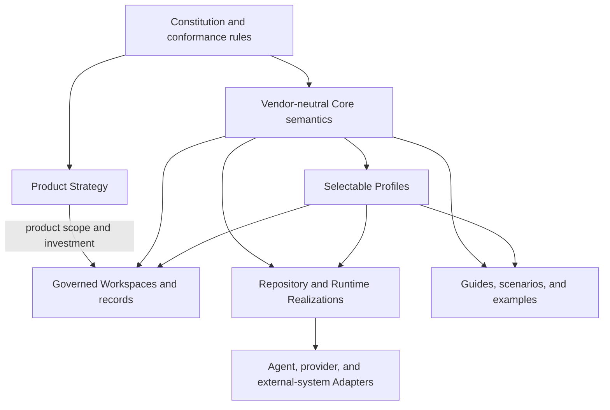

# GAEP Next Candidate Baseline

## Status and boundary

This directory is a non-destructive candidate replacement for the current Draft corpus. It is not an approved GAEP baseline and does not authorize software implementation, procurement, integration, release, deployment, or organizational mandate.

“Candidate baseline” is an informal working-corpus label in navigation and gate names. No immutable Candidate Revision Set, Baseline Proposal, Approval Determination, or Core Baseline Set currently exists.

The existing documents remain available as research input. If a current document conflicts with this candidate, neither silently wins. The conflict must be recorded, decided, and bound to exact document versions before approval.

## Candidate product definition

GAEP Core is proposed as a vendor-neutral, repository-visible governance specification and conformance model for human-AI engineering. It connects change intent, trusted context, impact and uncertainty, evidence, human decisions, authorization, and portable traceability.

Profiles specialize the Core. Workspaces represent governed state. Runtimes and adapters may automate the specification but do not define its meaning.

## Deliberate separation

The candidate baseline separates:

1. the GAEP product strategy and operating model;
2. the durable Constitution;
3. the vendor-neutral Core Specification;
4. selectable lifecycle and risk profiles;
5. repository and runtime realizations;
6. vendor and external-system adapters;
7. GAEP's own governed initiative workspace;
8. guides, examples, scenarios, roadmap, and references.

## Candidate architecture

The arrows express constraint or specialization, not implementation calls. Product Strategy cannot redefine Core meaning. A Profile cannot weaken higher-authority rules. A Workspace does not become authoritative merely because it is stored in a repository. A Realization or Adapter cannot manufacture approval, authorization, conformance, or evidence that its underlying surface cannot support.

| Layer | Owns | Does not own |
|---|---|---|
| Constitution | durable rights, authority, truthfulness, non-weakening and change-control invariants | product roadmap or implementation mechanics |
| Product Strategy | validated problem, users, product boundary, value, burden, distribution and investment choices | Core semantics or executable permission |
| Core | stable cross-profile identities, relationships, states and governance contracts | vendor, lifecycle or organizational defaults |
| Profiles | explicit applicability, specialization, co-selection, variation and conformance constraints | silent weakening or universal selection by availability |
| Workspaces | version-bound initiative facts, decisions, risks, claims, evidence and unresolved state | authority merely through presence or file location |
| Realizations | implementation-neutral repository/runtime fidelity contracts | canonical meaning |
| Adapters | declared mappings, losses, provider/external deltas and bounded activation | inherited trust from provider-native controls |
| Guides | comprehension, examples and scenario coverage | normative obligations unless an owning contract binds them |

## Authority order

Within an approved release, authority and normative dependency follow two explicit branches under the Constitution:

1. **Product-governance branch:** Constitution and conformance rules -> approved GAEP Product Strategy -> roadmap, investment, distribution, and operating decisions.
2. **Semantic branch:** Constitution and conformance rules -> Core Specification -> Profiles -> organizational bindings and initiative decisions -> Realizations and Adapters.
3. Guides, examples, scenarios, and external references remain informative unless an owning normative requirement explicitly binds their use.

Approved Product Strategy governs what GAEP invests in, for whom, and within which product boundary. It cannot redefine Core semantics, weaken the Constitution, manufacture conformance, or authorize implementation by itself.

Directory numbering is navigation, not authority. Foundational metadata, terminology, relationship, state, owner-role, decision, and Core-boundary registries under `99_Registries_and_References/` derive their authority from their owning Constitution or Core contract; external-reference entries remain informative.

This directory has not yet reached that approved state. Every document is `proposed` unless explicitly changed through a version-bound approval record.

## Reading paths

### Five-minute orientation

1. This document.
2. `00_GAEP_Product_Strategy/001_PRODUCT_CHARTER.md`.
3. `01_Constitution/001_GAEP_CONSTITUTION.md`.
4. `01_Constitution/004_METHODOLOGY_CONSTITUTION.md`.
5. `08_Roadmap_and_Adoption/001_PRE_IMPLEMENTATION_ROADMAP.md`.

### Product and sponsorship review

Read `00_GAEP_Product_Strategy/` and the GAEP-on-GAEP workspace in `06_GAEP_On_GAEP/`, especially the Product Decision Crosswalk and Repository Gap Register.

### Specification review

Read `01_Constitution/`, including the methodology-composition boundary in `004_METHODOLOGY_CONSTITUTION.md`, then `02_Core_Specification/`, then the applicable documents in `03_Profiles/`. Review `99_Registries_and_References/009_CORE_OPEN_DECISION_REGISTER.md` and `010_CORE_BOUNDARY_AND_COMPLEXITY_BUDGET.md` before treating the Core as a candidate baseline.

### Methodology and external-reference review

Read `01_Constitution/004_METHODOLOGY_CONSTITUTION.md` for GAEP's applicability-driven Product-to-Operations method boundary. The machine-readable source of current external-reference assessment is `99_Registries_and_References/011_METHODOLOGY_REFERENCE_CATALOG.json`; `002_EXTERNAL_STANDARDS_CROSSWALK.md` is its human-readable projection, and `003_REFERENCE_ENTRY_CONTRACT.md` defines the entry contract. Review `06_GAEP_On_GAEP/016_P01_FINAL_CORRECTION_EXECUTION_REPORT.md`, then the retained `015_P01_CORRECTION_EXECUTION_REPORT.md`, before relying on the original P01 execution report. External references remain informative and version-bound unless an owning GAEP requirement explicitly adopts a concept.

### Market, benchmark, and executive-claim review

Read `99_Registries_and_References/012_MARKET_EVIDENCE_AND_BENCHMARK_CONTRACT.md` for the P02 evidence and comparison rules. The machine-readable current P02 source is `99_Registries_and_References/013_MARKET_EVIDENCE_AND_BENCHMARK_REGISTRY.json`; `00_GAEP_Product_Strategy/004_POSITIONING_AND_ALTERNATIVES.md` is its deterministic human projection. Review `06_GAEP_On_GAEP/018_P02_MARKET_BENCHMARK_CORRECTION_REPORT.md`, then the retained `017_P02_MARKET_BENCHMARK_EXECUTION_REPORT.md`, for correction evidence, execution limits, tests, package evidence, and research debt. Market evidence is separate from the P01 methodology catalog. Every P02 artifact remains Proposed, internal, not approved, and not published.

### Visual Guideline and projection review

Open the bundled `apps/vscode/media/GAEP_GUIDE.md` for the four-layer human Product surface: executive orientation, quick start, practitioner lifecycle, and methodology appendix. Its strict projection contract is `99_Registries_and_References/014_GUIDELINE_PROJECTION_MANIFEST.json`; the manifest binds exact P01/P02 identities, versions, digests, runtime checkpoints, extension commands, required vertical visuals, and the 19-node target Product-to-Operations lifecycle. The generated Guide remains Proposed, internal, not approved, and not published; its maturity states are evidence projections, not acceptance or rollout authority.

### Security, privacy, AI, and assurance review

Read the identity, policy, authorization, claim/evidence, and execution Core documents, followed by the Security, Data/Privacy/Records, AI System, Assurance, and Operational profiles.

### Implementer review

Implementation is intentionally outside this candidate corpus's authority until the readiness gate is approved. The repository now also contains a separately authorized local Founder realization. Its existence, tests, and packages are implementation evidence only: they do not retroactively approve this candidate, resolve its Open Decisions, select Profiles, establish conformance, or authorize release or production use. Implementers must read the Core, applicable profiles, realizations, adapter conformance contract, GAEP-on-GAEP decisions, and the implementation-readiness gate before claiming alignment with the candidate.

## Non-goals of this candidate

This candidate does not select a programming language, database, cloud, model provider, agent framework, deployment topology, UI, or commercial model. It does not claim that all organizational truth belongs in Git, and it does not replace accountable human authorities or authoritative external systems.

## How decisions are represented

Unresolved choices are recorded as hypotheses, risks, or proposed decisions. They are not converted into facts by repetition. Approval must identify the decision, subject, exact version or digest, scope, conditions, accountable approver, time, and validity.

## Pre-implementation control sequence

```mermaid
flowchart LR
    E["Problem and user evidence"] --> PGE["Pilot Gate Evaluation"]
    PGE --> PD["Pilot Decision"]
    PD --> PILOT["Bounded manual pilot"]
    PILOT --> BGE["Candidate Baseline Gate Evaluation"]
    BGE --> BA["Baseline Approval Determination"]
    BA --> IRGE["Implementation Readiness Gate Evaluation"]
    IRGE --> ID["Implementation investment Decision"]
    ID --> IA["Implementation Approval Determination"]
    IA --> AG["Scoped Authorization Grant"]
    AG --> WORK["Authorized implementation work"]
```

No earlier result implies a later one. A passing gate remains evidence. A Decision selects a course. An Approval Determination judges an approval case. Only a valid, scoped Authorization Grant permits the exact effectful work it covers.

## Current candidate condition

The candidate is structurally and working-candidate machine-checkable but intentionally not self-approved. The working contraction meets the numeric ceiling at 8 active Core contracts, 160 active Core requirements, 24 requirements in the largest contract, and 48 provisional concept types; 135 omitted former requirements have explicit dispositions and the 13 extraction rows have exact working targets. Numeric closure does not close 70 Core Decisions, accept extracted targets, select Profiles, create effective authority, produce independent review, or designate an exact Candidate Revision Set. Product evidence, authority, exact-set and baseline records, decision closure or valid deferral, threat and data/AI disposition, Profile composition, burden and participant testing, licensing, and independent review remain gating work. Structural or candidate validation success must not be reported as semantic closure, baseline readiness, or implementation readiness.
