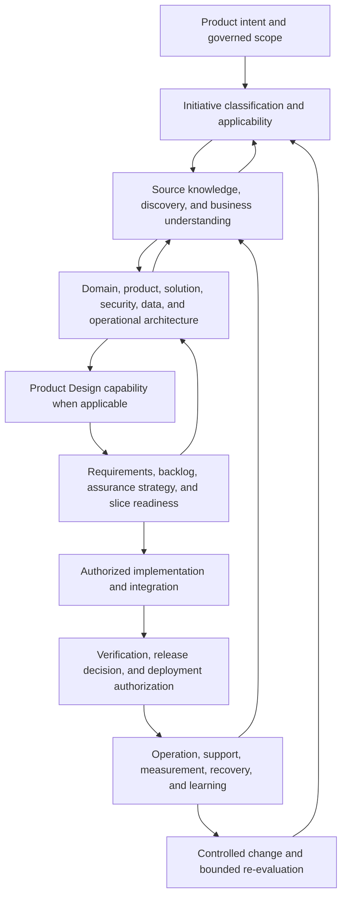

# Methodology Constitution

## Status and authority boundary

This is a Proposed GAEP Next specification. It prepares a coherent methodology foundation but does not approve a GAEP baseline, amend or supersede the legacy Draft Constitution, select methods for a real Initiative, authorize implementation, establish external conformance, or make a public Product claim.

The current legacy Drafts remain unchanged. Their durable ideas are mapped here as candidate semantics; any later supersession still requires exact source and replacement revisions, migration, review, and a version-bound Approval Determination.

## Purpose

GAEP composes lifecycle standards, engineering methods, operating models, domain practices, assurance guidance, and GAEP-native governance. No single source owns the entire GAEP lifecycle or governance model.

This Constitution answers five questions:

1. which concerns must remain visible from Product intent through operations and controlled evolution;
2. how an Initiative selects and tailors applicable work;
3. how methods may be combined without semantic collision;
4. which external references inform a concern and which claims remain prohibited; and
5. which governance semantics are GAEP-native rather than falsely attributed to an external source.

## Methodology position

GAEP is an evidence-driven, adaptive Product-to-Operations engineering system. Its methodology model is **composition by applicability**, not one universal lifecycle or branded method.

GAEP is not a universal software-development methodology. It is a governed engineering platform and reference-aligned adaptive operating model that selects applicable methods, evidence, and rigor according to Initiative context, authority, and risk.

## Four-layer model

| Layer | Owns | Examples and boundary |
|---|---|---|
| 1. GAEP-native constitutional governance | authority, proposal state, exact governed identity, durable evidence, applicability, review, acceptance, commit, approval, baseline, authorization, and effect separation | Owned by GAEP. AI confidence, conversation, file presence, or external citations cannot create authority. |
| 2. External standards and reference frameworks | version-bound calibration sources within exact access, license, and evidence limits | ISO and NIST publications are standards or guidance; TOGAF is an enterprise-architecture framework; WCAG is a W3C Recommendation. Reference presence is not conformance. |
| 3. Selectable engineering and Product methods | techniques and operating models chosen by applicability, competence, cost, and evidence | DDD and EventStorming are methods; C4 is an architecture visualization model; DORA is a research and measurement framework; Team Topologies is an optional organizational model. |
| 4. Replaceable tools, providers, and adapters | replaceable work surfaces and integrations with declared fidelity, authority, and exit | Figma is a Product Design tool or adapter; Codex and Claude Code are replaceable AI participants or providers; GitHub and Jira may remain external authorities or integration targets. |

No layer inherits authority from another by citation, availability, installation, or use. A tool cannot become a method, a method cannot become a lifecycle obligation without applicability, and an external framework cannot own GAEP-native state semantics by association.

GAEP distinguishes:

- **concern coverage:** what must be considered for the applicable scope;
- **method selection:** how participants choose to understand, design, implement, evaluate, operate, or learn;
- **representation:** how a method's output is expressed, such as a C4 diagram or another model;
- **tool or adapter:** where work is performed, such as an IDE or Product Design tool;
- **governance:** who may decide, approve, authorize, baseline, or cause an effect; and
- **evidence:** what supports or challenges a claim for an exact subject.

A source may inform one dimension without owning the others. For example, C4 may represent software architecture without selecting a lifecycle; DDD may structure strategic domain boundaries without selecting microservices; Figma may realize Product Design work without becoming a lifecycle phase.

## Canonical methodology concerns

The following concern IDs are owned by `GAEP-REG-011`. This table explains their human meaning; the JSON catalog owns their identifiers and external-reference mappings.

| Concern ID | GAEP concern | Lifecycle relevance | Candidate external calibration |
|---|---|---|---|
| `GAEP-MTH-CON-001` | Product-to-Operations lifecycle completeness and tailoring | intent through operation, support, retirement, and controlled evolution | ISO/IEC/IEEE 15288:2023; ISO/IEC/IEEE 12207:2026 |
| `GAEP-MTH-CON-002` | Requirements quality and traceability | needs, requirements, acceptance, change, and evidence | ISO/IEC/IEEE 29148:2018, currently under revision |
| `GAEP-MTH-CON-003` | Architecture description and sufficient design before implementation | stakeholder concerns, boundaries, views, and implementation readiness | ISO/IEC/IEEE 42010:2022; TOGAF 10th Edition; optional C4; applicable DDD |
| `GAEP-MTH-CON-004` | Product quality and assurance | quality intent, criteria, evaluation, evidence, and residual risk | ISO/IEC 25010:2023 |
| `GAEP-MTH-CON-005` | Iterative change and feedback | incremental delivery, reflection, and architecture evolution | Agile Manifesto; ISO lifecycle abstracts; DORA feedback |
| `GAEP-MTH-CON-006` | Organizational flow and cognitive load | ownership, interaction, flow, and sustainable operating burden | Team Topologies, Second Edition |
| `GAEP-MTH-CON-007` | Strategic domain boundaries | domain language, ownership, and boundary decisions | Eric Evans' DDD Reference; EventStorming when applicable |
| `GAEP-MTH-CON-008` | Collaborative behavioral discovery | shared learning, events, conflicts, processes, and unresolved questions | Alberto Brandolini's EventStorming source |
| `GAEP-MTH-CON-009` | Secure software development | secure-development obligations selected throughout the lifecycle | NIST SSDF 1.1 |
| `GAEP-MTH-CON-010` | AI risk and accountable human oversight | AI use, risk, evaluation, oversight, and affected-party consequences | NIST AI RMF 1.0; NIST AI 600-1 when Generative AI applies |
| `GAEP-MTH-CON-011` | Accessibility | affected-user needs, criteria, implementation, and evidence | WCAG 2.2 for applicable web scope |
| `GAEP-MTH-CON-012` | Operational outcome feedback | release, operation, recovery, delivery performance, and learning | DORA; ISO lifecycle abstracts |
| `GAEP-MTH-CON-013` | Claim evidence and non-conformance inference | honest claims, limitations, exact versions, and review triggers | all assessed catalog sources within their access limits |
| `GAEP-MTH-CON-014` | Applicability-driven method composition | selection, tailoring, combination, waiver, reuse, and non-applicability | cross-source synthesis; GAEP selection semantics remain GAEP-native |
| `GAEP-MTH-CON-015` | Product discovery | affected people, problems, desired outcomes, value, uncertainty, and challenge | Agile principles; strategic DDD and EventStorming when applicable |
| `GAEP-MTH-CON-016` | Business architecture | capabilities, value streams, operating model, policy, ownership, and domain boundaries | TOGAF summary; strategic DDD; EventStorming when applicable |
| `GAEP-MTH-CON-017` | Product Design | experience, interaction, accessibility, quality, and design evidence | ISO/IEC 25010; WCAG; Agile feedback; tools remain adapters |
| `GAEP-MTH-CON-018` | Backlog engineering | architecture-bound decomposition, acceptance, trace, and authorization scope | ISO/IEC/IEEE 29148 abstract; Agile principles |
| `GAEP-MTH-CON-019` | Testing and assurance | claim-driven verification, quality, security, accessibility, and residual risk | ISO/IEC 25010; NIST SSDF; WCAG |
| `GAEP-MTH-CON-020` | Architecture style selection | explicit structural and deployment choices without kernel-level style preference | ISO/IEC/IEEE 42010; TOGAF; C4; strategic DDD |
| `GAEP-MTH-CON-021` | Team and repository topology | separately decided team, repository, context, service, module, and deployable boundaries | Team Topologies; DDD; architecture descriptions |
| `GAEP-MTH-CON-022` | Human authority | AI proposes and eligible humans decide, approve, and authorize | GAEP-native |
| `GAEP-MTH-CON-023` | Source provenance and controlled change | exact identity, revision, lineage, change impact, and bounded re-evaluation | requirements trace and secure-development evidence; exact semantics are GAEP-native |
| `GAEP-MTH-CON-024` | Candidate, review, accept, and commit semantics | proposal, review, explicit acceptance, durable commit, and later authority separation | GAEP-native |
| `GAEP-MTH-CON-025` | Release and operations | release decision, deployment authorization, operation, recovery, measures, and learning | ISO/IEC/IEEE 12207; NIST SSDF; DORA |

Reference presence does not make a concern required for every Initiative. Applicability decides the work; the concern registry prevents accidental omission or invented source ownership.

## Product-to-Operations lifecycle concern map

The lifecycle is a recursive concern map, not a one-way waterfall and not a promise that every Initiative performs every activity.

The ordering shows principal decision dependencies, not mandatory serial execution. Work may proceed iteratively, concurrently, incrementally, and recursively when its dependencies and authority permit. Later evidence may reopen earlier understanding, applicability, architecture, requirements, or approval.

### Product Design and Figma boundary

Product Design is an applicable capability. Figma is one possible adapter or external design workspace. Neither `Figma` nor `Pre-Figma` is a canonical GAEP lifecycle phase in this candidate methodology.

P01 does not rename existing runtime or `Pre-Figma` labels. That implementation migration requires a later cross-layer decision, compatibility plan, UX change, and acceptance evidence.

## Applicability and tailoring

Every material Initiative shall resolve methodology applicability before a method or artifact becomes mandatory. The resolution uses these candidate meanings:

- `required-by-default`;
- `recommended`;
- `optional`;
- `conditionally-required`;
- `not-applicable`;
- `deferred`;
- `already-satisfied`;
- `reused`;
- `awaiting-human-decision`.

`Required-by-default` still permits only an explicit, owned applicability or waiver decision; it is not universal method selection. `Already-satisfied` and `reused` require exact provenance and current fitness. `Deferred` requires an owner, trigger, expiry or next review, and exposed downstream consequence. `Awaiting-human-decision` must not be collapsed into `not-applicable`.

A method selection must identify:

- exact Initiative, Product or Managed Asset, Change, and affected slice;
- concern IDs and applicable profile revisions;
- selected method or method combination and why it fits;
- required inputs, participants, competence, facilitation, tools, and time;
- expected outputs and the authority they do and do not carry;
- evidence, assumptions, uncertainty, exclusions, dependencies, and cost;
- combination conflicts and reconciliation rules;
- human owner, decision authority, review trigger, and expiry when applicable; and
- replacement, exit, migration, and downstream invalidation consequences.

Absence of information never means `not-applicable`. A reused artifact or method output remains subject to provenance, current fitness, exact version, ownership, and change impact.

## Method portfolio rules

### Lifecycle and requirements sources

ISO lifecycle and requirements sources are calibration references for concern coverage. Their official abstracts do not make GAEP conformant and do not supply a complete detailed mapping. GAEP may use different lifecycle models while preserving applicable concern coverage, trace, evidence, and authority.

### Architecture sources

Architecture must be resolved to sufficient depth before the affected implementation slice or architecture-bound backlog is authorized. Sufficient depth depends on risk, reversibility, dependency, trust, data, interface, failure, recovery, and cost of encoding the wrong boundary.

This is not frozen big-design-up-front for the Product's entire future. Architecture remains living, versioned, change-sensitive, and open to bounded re-evaluation as evidence arrives.

TOGAF, C4, DDD, and other architecture methods or representations may be combined only when their roles are explicit. None is the GAEP kernel.

### Domain-Driven Design

Strategic DDD is the proposed default domain approach for an applicable enterprise software-intensive Product profile. `Default` means GAEP recommends it after applicability establishes the relevant context; it does not mean universal or irreversible selection.

DDD does not imply microservices. A Bounded Context, logical module, runtime process, deployable unit, service, repository, team, data store, or network trust boundary is a separate decision. One-to-one mapping requires explicit evidence and architecture rationale.

Tactical DDD patterns are selected individually. They are not imported merely because strategic DDD applies.

### EventStorming

EventStorming is a preferred collaborative behavioral-discovery method when complex domain behavior, cross-role learning, process uncertainty, domain events, conflicts, or boundary discovery make it fit. It is not a mandatory ceremony.

Its output is candidate evidence. Workshop consensus, sticky notes, generated diagrams, transcripts, or AI summaries do not become governed truth without provenance, review, accountable human decision, and the applicable commit or baseline transition.

### Iterative delivery and operational feedback

Agile principles may inform early feedback, change response, frequent delivery, reflection, technical excellence, and simplicity. GAEP additionally requires durable governed state where consequence warrants it; conversation and working software cannot silently replace authority, architecture, requirements, evidence, or decision records.

DORA metrics may inform operational improvement at the application or service context. They are not universal targets, ranking instruments, release authority, or proof of Product value.

### Organization design

Team Topologies may inform cognitive load, value flow, interaction modes, and platform-as-a-product thinking. Organizational change remains a human organizational decision. Team shape does not automatically decide domain, module, deployment, service, data, repository, or authority boundaries.

### Security, AI risk, quality, and accessibility

NIST SSDF, NIST AI RMF, NIST AI 600-1, ISO/IEC 25010, and WCAG are selected only when their concern and scope apply. Their presence supports calibration, not achieved outcome.

Security, safety, trustworthiness, accessibility, quality, conformance, and readiness claims require exact criteria, subject, version, evaluator, evidence, limitations, residual risk, and accountable determination. A catalog row or successful schema validation proves none of these outcomes.

## GAEP-native governance semantics

The following candidate rules are GAEP-native. They must not be attributed to an external standard unless a later exact, narrower mapping supports that statement:

1. AI proposes, challenges, analyzes, drafts, and prepares; accountable humans retain consequential decision and approval authority.
2. Repository-visible governed records and exact external references are more durable than Chat or provider memory.
3. Candidate, review, accept, and commit are distinct proposal-governance steps.
4. Review Conclusion, Decision Outcome, Approval Determination, Gate Evaluation, Baseline Set designation, Authorization Grant, and actual effect remain distinct.
5. Exact revision, provenance, applicability, validity, freshness, and authority remain visible.
6. Missing material context, authority, evidence, or safe recovery produces an explicit block, narrowing, deferral, or stop.
7. A changed source triggers bounded impact analysis and re-evaluation of only affected downstream subjects.
8. User-facing Guideline, benchmark, lifecycle, UI, and export surfaces must consume canonical records rather than create parallel truth.
9. A shared pattern must be implemented systemically rather than as a checkpoint-, Product-, or screenshot-specific exception.

These rules may intersect with external ideas, but their exact state model and combination are owned by GAEP.

## Claim language

### Reference-alignment meanings

- **Aligned with** means a declared GAEP subject has an exact, version-bound mapping to named source concepts and exposes differences; it does not mean conformance.
- **Informed by** means a reviewed source materially influenced rationale or concern selection within its recorded access limit.
- **Adapted from** means GAEP intentionally changed a source concept and records the change, rationale, and limitation.
- **Uses concepts from** means selected concepts are present without adopting the source as a complete method, standard, or conformance target.
- **Designed to support** states a candidate capability intention, not an achieved outcome.
- **Candidate conformance mapping** is an unapproved mapping prepared for evaluation; it is not conformance.
- **Not independently verified** discloses that the relevant mapping, evidence, or outcome lacks independent evaluation.

Conflicting references are resolved by exact concern, scope, source authority, version, evidence access, applicability, and GAEP constitutional constraints. A conflict stays visible until an accountable human records a bounded decision. GAEP-native rules are identified explicitly in `GAEP-REG-011` and are not assigned an external owner.

### Version-bound assessment and rights boundary

An assessed source records publication date separately from source access, content review, freshness checking, and the next scheduled review. `Not-accessed` and `not-reviewed` are explicit machine states with reasons; absence never implies that a source was accessed or reviewed. Living unnumbered sources bind to the exact recorded snapshot/check date and expose the claims blocked by edition uncertainty.

Every external mapping binds the exact assessed reference identity and version, exact GAEP target artifact/catalog identity and version, relationship, rationale, limitations, assessor Principal or explicit unassigned assessor role, accountable owner role, assessment date, review trigger, and next review date. Mapping bindings and reference concern IDs are reciprocal catalog relationships, not independently authored labels.

Rights status is separate from its explanatory note. Until confirmed otherwise, restricted or proprietary content remains `link-and-summary-only`, `permission-required`, or `unresolved`; source presence never authorizes copying, transformation, distribution, or detailed normative inference.

### Permitted with exact qualification

GAEP may say that it is:

- informed by an exact listed source and edition;
- calibrated against an official abstract, summary, Recommendation, or publication within the recorded access limitation;
- compatible with selected ideas or capable of hosting an applicable method;
- using an adapted concept for a declared GAEP concern; or
- not adopting a method, practice, mapping, or claim for the recorded reason.

Every statement must preserve exact source version, access evidence, limitation, check date, and GAEP concern.

### Prohibited without separate evidence and authority

GAEP must not say or imply that it is:

- ISO-, TOGAF-, NIST-, WCAG-, DDD-, EventStorming-, Team Topologies-, Agile-, C4-, or DORA-compliant;
- certified, standardized, endorsed, equivalent, safe, secure, trustworthy, accessible, enterprise-ready, or best practice merely because a reference is present;
- based on one universal proprietary methodology recognized externally; or
- guaranteed to achieve the outcomes intended by a cited source.

## Normative candidate requirements

| Requirement ID | Requirement | Verification |
|---|---|---|
| GAEP-MTH-REQ-001 | GAEP SHALL represent its methodology as applicability-driven composition of concerns, methods, representations, tools, governance, and evidence rather than one universal methodology. | Methodology and profile review |
| GAEP-MTH-REQ-002 | A supported method, source, artifact, phase, or adapter SHALL NOT become mandatory solely because GAEP supports or cites it. | Applicability negative scenario |
| GAEP-MTH-REQ-003 | Every material method selection SHALL bind to exact subject, scope, concern IDs, applicable profiles, rationale, owner, evidence, limitations, cost, and review trigger. | Method-selection record validation |
| GAEP-MTH-REQ-004 | GAEP SHALL preserve applicable Product-to-Operations concerns through operation, support, retirement, learning, and controlled evolution; Product Design or Figma SHALL NOT terminate or define the lifecycle. | Lifecycle-profile inspection |
| GAEP-MTH-REQ-005 | Architecture SHALL be resolved to sufficient depth before the affected implementation slice or architecture-bound backlog is authorized, while permitting iterative, incremental, recursive, and feedback-driven evolution. | Readiness and change scenarios |
| GAEP-MTH-REQ-006 | Strategic DDD SHOULD be the default domain approach only for applicable enterprise software-intensive Product profiles; deviation SHALL record rationale, and DDD SHALL NOT imply microservices. | Applicability and architecture review |
| GAEP-MTH-REQ-007 | Bounded Context, module, deployable unit, service, process, repository, team, data store, and trust boundary SHALL remain separately decidable concepts. | Semantic and architecture scenario |
| GAEP-MTH-REQ-008 | EventStorming SHOULD be offered as a preferred collaborative behavioral-discovery method when applicable and SHALL NOT be imposed as a universal ceremony or treated as approval. | Discovery-method scenario |
| GAEP-MTH-REQ-009 | Figma SHALL be represented as an optional Product Design adapter or external workspace, not a canonical GAEP lifecycle phase. | Lifecycle and adapter review |
| GAEP-MTH-REQ-010 | AI output SHALL remain proposal, analysis, challenge, or evidence input until the applicable accountable human Decision, Approval, or Authorization occurs. | Human-authority negative test |
| GAEP-MTH-REQ-011 | Candidate, review, accept, commit, approval, baseline, authorization, readiness, release, and effect semantics SHALL remain distinct and SHALL NOT be falsely attributed to an external reference. | State and claim audit |
| GAEP-MTH-REQ-012 | Repository or exact external source state SHALL outrank unrecorded Chat or provider memory for durable governed facts within its declared authority. | Authority-resolution scenario |
| GAEP-MTH-REQ-013 | Every external-reference claim SHALL resolve through `GAEP-REG-011` and preserve version, access evidence, limitation, claim language, and review trigger. | Catalog resolution validation |
| GAEP-MTH-REQ-014 | A paid, licensed, abstract-only, summary-only, incomplete, or living source SHALL NOT support detailed normative inference beyond the reviewed evidence. | Access-boundary negative test |
| GAEP-MTH-REQ-015 | Guideline, benchmark, lifecycle, UI, Chat, and export projections SHALL consume one canonical methodology/reference model and SHALL NOT create independent reference truth. | Projection lineage validation |
| GAEP-MTH-REQ-016 | A method or reference change SHALL trigger bounded impact analysis across affected concerns, profiles, claims, decisions, evidence, projections, and acceptance tests. | Change-impact scenario |
| GAEP-MTH-REQ-017 | Missing knowledge SHALL remain unresolved, blocked, deferred, or awaiting human decision and SHALL NOT be interpreted as not applicable or satisfied. | Missing-context negative scenario |
| GAEP-MTH-REQ-018 | GAEP SHALL NOT claim external conformance, certification, equivalence, endorsement, safety, security, trustworthiness, accessibility, enterprise readiness, or achieved outcomes without a separate exact approved mapping and evidence case. | Public-claim audit |
| GAEP-MTH-REQ-019 | Every assessed methodology source SHALL expose separate publication, access, content-review, freshness-check, and next-review dates or explicit unresolved states allowed by the reference contract. | Catalog schema and chronology tests |
| GAEP-MTH-REQ-020 | Every methodology mapping SHALL bind exact external-reference and GAEP target versions, assessor or explicit unassigned assessor role, accountable owner, rationale, limits, assessment date, review trigger, and next review date. | Mapping governance projection and referential-integrity tests |
| GAEP-MTH-REQ-021 | Machine validation SHALL fail closed across JSON Schema structure and catalog-wide semantic integrity before any projection is rendered or accepted as synchronized. | Schema-engine, semantic, and renderer parity tests |

## Downstream projection contract

Later work may generate:

- a visual Guideline explanation;
- lifecycle and applicability UI;
- benchmark and executive-claim views;
- method-selection assistance;
- migration guidance; or
- Product Owner acceptance scenarios.

Those surfaces must project `GAEP-REG-011` concern and reference IDs plus exact catalog version. They may add audience-specific explanation but cannot change source version, adopted/adapted/not-adopted status, limitation, claim language, or review trigger.

P01 does not implement those later surfaces.

## Evidence and effectiveness boundary

External references justify candidate design rationale; they do not prove GAEP effectiveness. Later effectiveness claims require controlled scenarios, explicit Product Owner acceptance, authorized pilots, measurable organizational outcomes, counter-evidence, and operational observations bound to exact GAEP versions and contexts. Documentation validation, catalog validity, test passage, packaging, or installation cannot substitute for that evidence.

## Open decisions and review triggers

- Which exact GAEP profile schemas will carry Method Selection Records?
- Which concern-to-profile mappings require normative ownership rather than informative calibration?
- Which paid standards, if any, justify licensed full-text assessment?
- What evidence is sufficient to promote one adapted concept to direct adoption?
- Which methodology projections belong in the Guideline, lifecycle UI, benchmark, and public messaging?
- Which current `Pre-Figma` labels require migration after the Product Design adapter terminology is approved?

Review this Constitution when the Product-to-Operations lifecycle changes, a reference is added or revised, applicability states change, a public alignment claim is proposed, or a runtime surface begins consuming the catalog.
